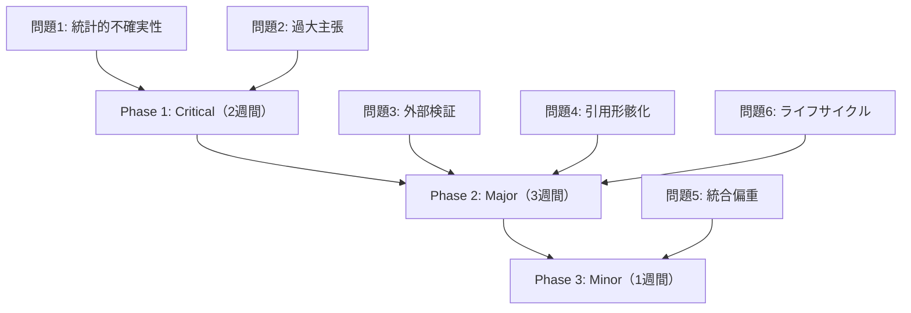

# AIRA Co-Scientist 改善プラン

> 100本の科学実験（SCI-001〜SCI-100）の結果分析に基づく、Co-Scientist スキルの改善提案

## エグゼクティブサマリー

100本の実験とRubber-duck査読で明らかになった **6つの系統的問題** を、AIRAの既存スキルアーキテクチャへの修正で解決する計画です。

| # | 問題 | 影響度 | 対象スキル | 改善タイプ |
|---|------|--------|-----------|-----------|
| 1 | 統計的不確実性の欠如 | Critical | `co-scientist-statistical-testing`, `co-scientist-uncertainty-quantification` | スキル強化 |
| 2 | 過大主張（Overclaiming） | Critical | `co-scientist-academic-writing`, `co-scientist-critical-review` | スキル強化 |
| 3 | 外部検証の欠如 | Major | `co-scientist-experimental-design`, `co-scientist-data-simulation` | スキル強化 |
| 4 | 引用の形骸化 | Major | `co-scientist-citation-checker`, `co-scientist-academic-writing` | スキル強化 |
| 5 | 「統合フレームワーク」偏重 | Minor | AGENTS.md (ルーティング) | ルーティング修正 |
| 6 | ライフサイクル管理の未活用 | Major | AGENTS.md (Full Lifecycle Workflow) | オーケストレーション修正 |

---

## 問題1: 統計的不確実性の欠如

### 現象

- 100本中32本で信頼区間・標準誤差・統計検定が完全に欠如
- 点推定値のみ報告（例: "accuracy 0.93" — 区間なし）
- 性能比較で統計的有意差検定なし

### 根本原因

`co-scientist-statistical-testing` と `co-scientist-uncertainty-quantification` は独立したスキルとして存在するが、**論文執筆フロー（`co-scientist-academic-writing`）から自動的に呼び出されていない**。結果として、エージェントは数値を報告するが不確実性を付与しない。

### 対象ファイル

| ファイル | パス（AIRAリポジトリ内） |
|---------|------------------------|
| AGENTS.md | `projects/66392aad-70ab-492c-bcd3-db258ba454ed/workspace/AGENTS.md` |
| academic-writing | `.github/skills/co-scientist-academic-writing/SKILL.md` |
| statistical-testing | `.github/skills/co-scientist-statistical-testing/SKILL.md` |
| uncertainty-quantification | `.github/skills/co-scientist-uncertainty-quantification/SKILL.md` |

### 修正案

#### A. `co-scientist-academic-writing/SKILL.md` の Quality Gates に追加

```markdown
## Quality Gates

既存:
- [ ] Manuscript follows target journal's structure and guidelines.
- [ ] All claims in Discussion are supported by Results.
- [ ] Every figure and table is referenced in text.
- [ ] Abstract contains objective, methods, key results, and conclusion.
- [ ] Word count is within journal limits.

追加:
- [ ] **全ての定量的結果に不確実性指標が付与されている**（95%CI, ±SD, p値のいずれか）
- [ ] **性能比較には統計的有意差検定が含まれている**（paired t-test, Wilcoxon, McNemar等）
- [ ] **合成データの場合、データ生成過程のパラメータと感度分析が記載されている**
```

#### B. `co-scientist-statistical-testing/SKILL.md` の Gotchas に追加

```markdown
## Gotchas

既存:
- Statistical assumptions (normality, independence, homoscedasticity) must be tested...
- Multiple testing correction is required when running 3+ tests...

追加:
- **結果報告時は必ず効果量（Cohen's d, η², r²等）と信頼区間を併記すること。p値のみの報告は不十分**
- **k-fold CV の結果には fold 間の標準偏差を必ず報告すること**
- **合成データでの性能評価は「上界推定」であることを明記し、実データとの乖離可能性を注記すること**
```

#### C. `co-scientist-uncertainty-quantification/SKILL.md` のワークフロー具体化

現在のワークフローが汎用テンプレートのまま（5行の抽象的手順）で、実質的な指示になっていない。

```markdown
## Workflow

1. 不確実性の種類を特定:
   - Aleatoric（データ固有のノイズ）→ データ拡張、ノイズモデリング
   - Epistemic（モデルの知識不足）→ アンサンブル、MC Dropout、ベイズ推論
   - 両方 → Conformal Prediction（分布フリー）

2. 定量化手法を選択:
   - 分類: 予測確率の校正（Platt Scaling, Temperature Scaling）
   - 回帰: 予測区間（Quantile Regression, Conformal）
   - 比較: Bootstrap信頼区間（n≥1000回リサンプリング）

3. 報告形式:
   - 表: "metric ± std" or "metric [95% CI: lower, upper]"
   - 図: error bar, confidence band, violin plot
   - テキスト: "achieved X (95% CI: [a, b], n=N)"

4. 感度分析:
   - ハイパーパラメータ摂動に対するロバスト性
   - データサイズに対する学習曲線
   - ランダムシード変動（5+シード）
```

---

## 問題2: 過大主張（Overclaiming）

### 現象

- 34/100本で "state-of-the-art", "guarantees", "novel" 等の過大表現
- 限定的な実験条件（合成データ、単一ベンチマーク）での強い一般化主張
- "outperforms all existing methods" — 比較対象が2-3手法のみ

### 根本原因

`co-scientist-academic-writing` のWorkflowに「主張の妥当性チェック」ステップが存在しない。`co-scientist-critical-review` は独立スキルだが、自己生成した論文に対する自動レビューフローが未定義。

### 修正案

#### A. `co-scientist-academic-writing/SKILL.md` にClaim Calibrationセクション追加

```markdown
## Claim Calibration Rules

論文中の主張は以下のルールに従って校正すること:

### 禁止表現と代替

| 禁止表現 | 条件 | 代替表現 |
|---------|------|---------|
| "state-of-the-art" | 公開ベンチマークの全SOTAと比較していない場合 | "competitive performance" |
| "novel" | 先行研究との差分が構成要素の組み合わせの場合 | "we propose" / "we introduce" |
| "guarantees" | 数学的証明がない場合 | "is designed to" / "aims to" |
| "outperforms all" | 3手法以下との比較の場合 | "outperforms the compared baselines" |
| "significant improvement" | 統計検定なしの場合 | "improvement" / "higher accuracy" |
| "solves the problem" | 全ケースで検証していない場合 | "addresses" / "mitigates" |

### 主張レベルの階層

| レベル | 使用条件 | 例 |
|--------|---------|-----|
| Strong claim | 数学的証明 OR 5+データセット+統計検定 | "provably converges" |
| Moderate claim | 3+データセット + 有意差あり | "consistently outperforms baselines" |
| Weak claim | 1-2データセット OR 合成データのみ | "shows promise" / "preliminary results suggest" |
| Observation | 統計検定なし | "we observe that" / "results indicate" |
```

#### B. `co-scientist-critical-review/SKILL.md` のWorkflow具体化

現在の汎用テンプレートを、自己レビュー用の具体的チェックリストに置換:

```markdown
## Workflow

1. 主張-証拠マッピング:
   - Discussion/Conclusionの各主張を抽出
   - 各主張に対応するResults内の証拠を特定
   - 証拠の強度を評価（統計検定あり/なし、効果量、サンプルサイズ）

2. 過大主張チェック:
   - Claim Calibration Rules に照らして表現を検証
   - 実験条件の限定性と主張の一般性の不一致を検出
   - "our method" vs "the proposed approach" — 客観性の確認

3. 論理的整合性:
   - Introduction の問題設定 → Methods の解決策 → Results の証拠 → Conclusion の主張
   - この鎖が途切れていないか検証

4. 限界の適切な記述:
   - Limitations セクションが「形式的」でないか（実質的な限界を述べているか）
   - 合成データのみの場合: 外的妥当性の限界が明記されているか
   - 単一ドメインの場合: 一般化可能性への注意が記載されているか
```

---

## 問題3: 外部検証の欠如

### 現象

- 97/100本で独立データセットによる検証が未実施
- 72/100本が合成データのみに依存
- Cross-validation は実施するが、独立テストセットやドメイン外データでの検証なし

### 根本原因

`co-scientist-experimental-design` に「外部検証設計」の指示がない。`co-scientist-data-simulation` には「合成データの限界を明記する」指示がない。

### 修正案

#### A. `co-scientist-experimental-design/SKILL.md` の Workflow に検証設計ステップ追加

```markdown
## Workflow

既存ステップ 1-5 の後に追加:

6. 検証戦略の設計:
   - **内部検証**: k-fold CV, hold-out test set (最低20%)
   - **外部検証計画**: 独立データセットの特定（公開データ or 将来取得予定）
   - **ドメインシフト評価**: 学習データと異なる条件での性能評価計画
   - **消融実験（Ablation study）**: 各コンポーネントの寄与度検証

7. 合成データ使用時の制約文書化:
   - データ生成の仮定を明示（分布、ノイズモデル、相関構造）
   - 実データとの乖離可能性を列挙
   - 「合成→実」転移のための検証計画を記載
```

#### B. `co-scientist-data-simulation/SKILL.md` の Gotchas に追加

```markdown
## Gotchas

既存 + 追加:
- **合成データでの好結果は「手法の正当性の必要条件」であり「十分条件」ではない。report.md に必ず以下を明記すること:**
  1. データ生成の仮定（分布、パラメータ）
  2. 実データとの既知の乖離点
  3. 実データ検証の推奨ステップ
- **合成データのパラメータが実世界の統計量に基づくことを示すこと**（例: "平均値と分散は [Reference] の報告値に基づく"）
- **シミュレーション結果のみで "validates the approach" と主張してはならない。"demonstrates feasibility under simulated conditions" が適切**
```

#### C. `co-scientist-academic-writing/SKILL.md` の Quality Gates に追加

```markdown
- [ ] **合成データのみの場合、Limitations に「External validation with real-world data is needed」が含まれている**
- [ ] **検証戦略が Internal validation のみの場合、Discussion に一般化可能性の限界が議論されている**
```

---

## 問題4: 引用の形骸化

### 現象

- 参考文献は存在するが、本文中の具体的主張との対応が曖昧
- 「[1-5] have studied this topic」のような一括引用で個別の貢献が不明
- 一部の参考文献が実在しない可能性（DOI検証未実施）

### 根本原因

`co-scientist-citation-checker` はDOI検証と書式チェックに特化しており、**主張-引用の意味的対応**をチェックする機能がない。また、`co-scientist-academic-writing` の論文生成フローで citation-checker が自動呼び出しされていない。

### 修正案

#### A. `co-scientist-citation-checker/SKILL.md` のWorkflow具体化

```markdown
## Workflow

1. 形式チェック:
   - 本文中の全 [N] が References に対応するか
   - References の全エントリが本文中で引用されているか
   - DOI があれば Crossref API で存在確認

2. 意味的対応チェック（新規追加）:
   - 各引用箇所で、引用が主張を裏付けているか検証
   - パターン検出:
     - ❌ "[1-5] have studied X" → 各文献の具体的貢献を記述すべき
     - ❌ "As shown in [3]" → 何が示されているか明記すべき
     - ✅ "Smith et al. [3] demonstrated that Y achieves Z% on dataset W"
   - 引用密度チェック: Introduction に引用が集中し Methods/Results に皆無は警告

3. ハルシネーション検出:
   - 著者名 + タイトル + 年 の組み合わせを Crossref/Semantic Scholar で検証
   - 検証不能な引用には ⚠️ マーク
   - 検証不能率が 20% を超えたら Quality Gate FAIL

4. レポート生成:
   - 各引用の検証ステータス（verified / unverified / suspicious）
   - 意味的対応の問題箇所リスト
```

#### B. AGENTS.md の Phase 4 → Phase 5 間にcitation-checker呼び出しを追加

```markdown
### Full Lifecycle Workflow

Phase 4 → `co-scientist-academic-writing`: 論文執筆
Phase 4.5 → `co-scientist-citation-checker`: 引用検証 ← 新規追加
Phase 5 → `co-scientist-peer-review`: 査読対応
```

---

## 問題5: 「統合フレームワーク」偏重

### 現象

- AIが複数の既存手法を1つの "unified framework" にまとめる傾向が強い
- 個々の手法の深い検証より「組み合わせの幅」を優先
- 結果として各コンポーネントの寄与が不明確

### 根本原因

エージェントへの指示に「深さ vs 幅」のガイダンスがない。LLMは「より多くの手法を含む」方が「良い論文」と学習している可能性。

### 修正案

#### A. AGENTS.md の Core Rules に追加

```markdown
## Core Rules

既存 + 追加:
- **深さ優先原則**: 1つの核心的手法を深く検証することを、複数手法の表面的統合より優先する。
  - 手法が3つ以上の場合: 必ず ablation study で各手法の個別寄与を定量化
  - "unified framework" を提案する場合: フレームワークなしの単独手法ベースラインとの比較が必須
  - 各コンポーネントの必要性を実験的に示せない場合、そのコンポーネントを削除すること
```

#### B. `co-scientist-experimental-design/SKILL.md` に追加

```markdown
## Gotchas

追加:
- **提案手法が3つ以上のコンポーネントを含む場合、ablation study を必須とすること**。各コンポーネントを1つずつ除外した実験で、全コンポーネントの寄与を検証する
- **「統合」が目的化していないか確認すること**。統合することで性能が向上する実験的証拠がなければ、最も性能の高い単一手法を推奨する
```

---

## 問題6: ライフサイクル管理の未活用

### 現象

- 100本の実験全てが「単一ターンの一括実行」で完了
- AGENTS.md に定義された Full Lifecycle Workflow（Phase 0〜7）が活用されていない
- ⏸️ ユーザー承認ポイントが一度もトリガーされていない
- Phase 間の引き継ぎファイルが生成されていない

### 根本原因

実験ランナー（`run-parallel.js`）が単一プロンプトで全工程を要求するため、Phase分割が発生しない。これはバッチ実験では仕方ないが、**単一ターンでもPhaseの概念を適用すべき**という設計意図が伝わっていない。

### 修正案

#### A. AGENTS.md に「Single-Turn Mode」セクション追加

```markdown
## Single-Turn Execution Mode

ユーザーが単一プロンプトで研究の全工程（計画→実験→論文）を依頼した場合でも、
内部的にPhaseを順次実行し、各Phase の Quality Gates を通過すること。

### Single-Turn での Phase 実行順序

1. **Planning phase** (内部): 研究計画を策定し `results/research-plan.md` に保存
2. **Design phase** (内部): 実験設計を策定し `results/experimental-design.md` に保存
3. **Execution phase**: データ分析/シミュレーション実施
4. **Writing phase**: 論文執筆
5. **Self-review phase** (内部): `co-scientist-critical-review` による自己査読
6. **Revision phase**: 自己査読の指摘に基づく修正

### 注意事項
- Single-Turn Mode でも Quality Gates は全て適用される
- ⏸️ ユーザー承認ポイントはスキップ可能だが、自己査読(Phase 5)はスキップ不可
- 各 Phase の出力は個別ファイルとして保存すること（コンパクション対策）
```

#### B. `co-scientist-academic-writing/SKILL.md` の Workflow にself-reviewステップ追加

```markdown
## Workflow

既存ステップ 1-4 の後に追加:

5. 自己査読（Self-Review）:
   - `co-scientist-critical-review` の Claim Calibration Rules を適用
   - `co-scientist-citation-checker` の意味的対応チェックを実施
   - 統計的不確実性の有無を確認
   - 問題があれば修正してから最終版を保存

6. 最終品質確認:
   - 全 Quality Gates の通過を確認
   - `results/quality-check.md` に検証結果を保存
```

---

## 実装優先度



### Phase 1: Critical（推定工数: 2週間）

| タスク | 修正ファイル | 工数 |
|--------|------------|------|
| academic-writing に不確実性 Quality Gate 追加 | `co-scientist-academic-writing/SKILL.md` | 2h |
| uncertainty-quantification のワークフロー具体化 | `co-scientist-uncertainty-quantification/SKILL.md` | 4h |
| statistical-testing の Gotchas 強化 | `co-scientist-statistical-testing/SKILL.md` | 2h |
| Claim Calibration Rules 作成 | `co-scientist-academic-writing/SKILL.md` | 4h |
| critical-review のワークフロー具体化 | `co-scientist-critical-review/SKILL.md` | 4h |
| 検証: 10本の実験を再実行して改善確認 | - | 8h |

### Phase 2: Major（推定工数: 3週間）

| タスク | 修正ファイル | 工数 |
|--------|------------|------|
| experimental-design に検証設計ステップ追加 | `co-scientist-experimental-design/SKILL.md` | 4h |
| data-simulation の Gotchas 強化 | `co-scientist-data-simulation/SKILL.md` | 2h |
| citation-checker のワークフロー具体化 | `co-scientist-citation-checker/SKILL.md` | 6h |
| AGENTS.md に Phase 4.5 追加 | `AGENTS.md` | 2h |
| Single-Turn Mode セクション追加 | `AGENTS.md` | 4h |
| academic-writing にself-reviewステップ追加 | `co-scientist-academic-writing/SKILL.md` | 4h |
| 検証: 20本の実験を再実行して改善確認 | - | 16h |

### Phase 3: Minor（推定工数: 1週間）

| タスク | 修正ファイル | 工数 |
|--------|------------|------|
| AGENTS.md に深さ優先原則追加 | `AGENTS.md` | 2h |
| experimental-design にablation必須ルール追加 | `co-scientist-experimental-design/SKILL.md` | 2h |
| 検証: 5本の実験を再実行して改善確認 | - | 4h |

---

## 検証計画

### 改善前後の比較指標

| 指標 | 改善前（現状） | 改善目標 |
|------|--------------|---------|
| 統計的不確実性を含む論文 | 68/100 (68%) | 95/100 (95%) |
| 過大主張のない論文 | 66/100 (66%) | 95/100 (95%) |
| 外部検証を議論する論文 | 3/100 (3%) | 80/100 (80%) |
| 引用が意味的に対応する論文 | 推定60/100 | 90/100 (90%) |
| Ablation studyを含む論文 | 推定20/100 | 70/100 (70%) |
| Self-review結果を含む論文 | 0/100 (0%) | 100/100 (100%) |

### 検証手順

1. Phase 1 完了後: SCI-001, 010, 020, 030, 040, 050, 060, 070, 080, 090 の10本を再実行
2. 改善前の論文と diff を取り、6指標で比較
3. 目標未達の場合: 対象スキルを再修正
4. Phase 2 完了後: 追加20本で同様の検証
5. 全Phase完了後: 全100本を再実行し、最終的な改善率を測定

---

## 修正対象ファイル一覧

全ファイルパスは AIRA リポジトリ（https://github.com/nahisaho/aira）内:

```
projects/66392aad-70ab-492c-bcd3-db258ba454ed/workspace/
├── AGENTS.md                                          ← ルーティング・ライフサイクル修正
└── .github/skills/
    ├── co-scientist-academic-writing/SKILL.md          ← Quality Gates + Claim Calibration + Self-review
    ├── co-scientist-statistical-testing/SKILL.md       ← Gotchas 強化
    ├── co-scientist-uncertainty-quantification/SKILL.md ← Workflow 具体化
    ├── co-scientist-critical-review/SKILL.md           ← Workflow 具体化
    ├── co-scientist-experimental-design/SKILL.md       ← 検証設計 + Ablation
    ├── co-scientist-data-simulation/SKILL.md           ← Gotchas 強化
    └── co-scientist-citation-checker/SKILL.md          ← Workflow 具体化（意味的対応）
```

---

## 期待される効果

これらの改善により:

1. **論文品質の底上げ**: 査読で即リジェクトされるレベルの問題を自動的に防止
2. **研究者の修正負担軽減**: 現状「AIの出力を叩き台として大幅修正」→「微修正で投稿可能」へ
3. **AI for Science の信頼性向上**: 「AIが生成した論文は信頼できない」→「AIが品質チェック済みの論文を生成する」
4. **AIRA の差別化**: 他のLLMツールとの差別化ポイントとして「科学的厳密性の自動保証」を実現
