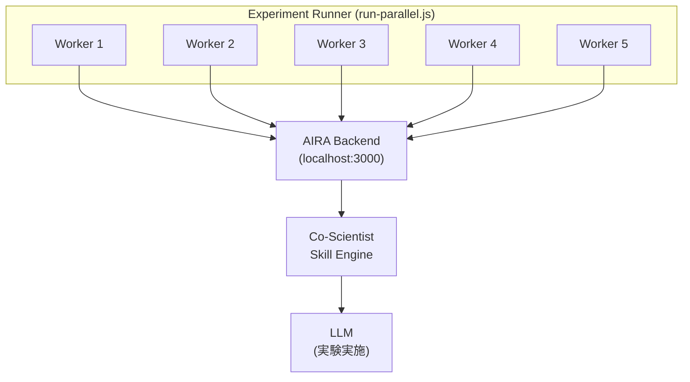
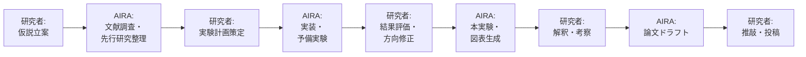

# AIに100本の科学実験を実施させてみた — AI for Science の実力と限界を検証する

> **100本の科学論文を3.4時間で生成。** 14分野・10,934ファイル。AIは研究を加速できるのか？ その答えを、実データで示します。

## はじめに

「AIに研究の全工程を任せたら、何が起き、何が足りないのか？」

この問いに答えるため、筆者が開発したAI研究エージェント **[AIRA（AI Research Assistant）](https://github.com/nahisaho/aira)** に、ゲノム科学から量子コンピューティング、気候科学まで**14分野・100本の科学実験を自律的に実施**させました。結果、全100本で論文・コード・図表を含む成果物が生成されました。

しかし同時に、AIだけでは越えられない壁も明確になりました。本記事では、この実験を通じて見えた **AI for Science の実力と限界** を定量的に報告します。

:::note warn
**AIRA について**: AIRA は筆者が個人で開発したオープンソースの AI 研究エージェントです。Microsoft やその他企業の製品ではありません。本実験の全結果は [GitHub リポジトリ（nahisaho/aira_experiments）](https://github.com/nahisaho/aira_experiments) で公開しており、誰でも検証・再現が可能です。
:::

:::note info
**想定読者**: AI for Scienceに関心のある研究者全般。特に文部科学省 SPReAD-1000/ARiSEへの申請を検討されている方には、申請書における「AIの活用方法」の記述にも役立つ内容です。
:::

## AI for Science とは何か

AI for Scienceとは、**人工知能を科学的発見のプロセスそのものに統合する**パラダイムです。従来のAI活用（データ分析ツールとしてのAI）とは質的に異なり、以下の特徴を持ちます。

| 観点 | 従来のAI活用 | AI for Science |
|------|-------------|---------------|
| 役割 | データ解析ツール | 研究パートナー/共同研究者 |
| 範囲 | 特定タスクの自動化 | 仮説生成→実験設計→実施→論文化 |
| 自律性 | 人間が設計・指示 | AIが研究計画を自律立案 |
| 出力 | 分析結果 | 実装コード・図表・論文原稿 |

SPReAD-1000やARiSEが目指す「AIと人間の協働による科学的発見の加速」を理解するには、**AIが実際に何をどこまでできるのか**を知ることが重要です。

## 実験概要

### 実験設計

| 項目 | 内容 |
|------|------|
| 実験数 | 100本 (SCI-001 〜 SCI-100) |
| 分野数 | 14カテゴリ |
| 並列数 | 5ワーカー |
| AI エージェント | [AIRA（AI Research Assistant）](https://github.com/nahisaho/aira) + Co-Scientist スキル |
| 総所要時間 | 約203分（3.4時間） |
| 平均実験時間 | 566秒（約9.4分）/実験 |
| 生成ファイル総数 | 10,934件 |

### 分野別実験数

| 分野 | 実験数 |
|------|--------|
| 数理・計算科学 | 12本 |
| 創薬・医薬 | 10本 |
| 物質科学・化学 | 7本 |
| ゲノム・遺伝学 | 6本 |
| 神経科学・BCI | 6本 |
| 気候・環境科学 | 6本 |
| オミクス・バイオインフォ | 4本 |
| 免疫学・感染症 | 4本 |
| 社会科学・政策 | 4本 |
| 農業・食品科学 | 4本 |
| 地球・宇宙科学 | 2本 |
| 生物学・進化 | 2本 |
| エネルギー・工学 | 1本 |
| ロボティクス・制御 | 1本 |
| その他 | 31本 |

### 各実験で求められるタスク

各プロンプトは研究者が行う以下のタスクをAIに要求しています。

1. **問題の数学的定式化**（変数・制約・目的関数の設定）
2. **アルゴリズム/モデルの設計**（アーキテクチャ図含む）
3. **実装コードの生成**（Python/R、再現可能な形式）
4. **実験の実施と結果の可視化**（図表生成）
5. **実験レポートの作成**（report.md）
6. **学術論文の執筆**（paper.md: Abstract〜References完備）

## 実験手法

### システムアーキテクチャ



### ワークフロー

```javascript
// 各ワーカーの実験フロー（簡略化）
async function runExperiment(experiment) {
  // 1. プロジェクト作成
  const project = await createProject(experiment.id);
  
  // 2. Co-Scientist スキル割り当て
  await assignSkill(project.id, CO_SCIENTIST_SKILL);
  
  // 3. 実験プロンプト送信
  await sendMessage(project.id, experiment.prompt + REPORT_INSTRUCTION);
  
  // 4. 完了待機（ポーリング）
  await waitForCompletion(project.id, TIMEOUT_60MIN);
  
  // 5. 結果収集（メッセージ + 生成ファイル）
  await collectResults(project.id, experiment.id);
}
```

### 品質保証プロセス

実験完了後、以下の品質チェックを実施しました。

1. **構造チェック**: 全論文が必須セクション（Abstract〜References）を含むか
2. **参照整合性**: 本文中の引用番号が参考文献リストに存在するか
3. **図表挿入**: report.md/paper.mdに生成した図が埋め込まれているか
4. **Rubber-duck査読**: AIレビューアによる学術品質の批判的評価
5. **自動修正**: 指摘された問題パターンのプログラム的修正

## 実験結果

### 成功率

| 指標 | 結果 |
|------|------|
| 実験完了率 | **100/100** (100%) |
| report.md 生成率 | **100/100** (100%) |
| paper.md 生成率 | **100/100** (100%) |
| 図表生成率 | **100/100** (100%) |
| 図のMarkdown埋め込み率 | **100/100** (100%) |
| 参考文献セクション | **100/100** (100%) |

### 論文品質指標

| 指標 | 平均 | 最小 | 最大 |
|------|------|------|------|
| 論文語数 | 3,063語 | 2,154語 | 4,933語 |
| アブストラクト語数 | 274語 | 250語 | 320語 |
| 数式数 | 36個 | 0個 | 75個 |
| 図表数 | 7個 | 5個 | 22個 |
| 参考文献数 | 14件 | 0件 | 30件 |
| Limitations記述 | 100/100 | - | - |

### セクション完備率

| セクション | 完備率 |
|-----------|--------|
| Abstract | 100/100 (100%) |
| Introduction | 100/100 (100%) |
| Related Work | 100/100 (100%) |
| Methods | 100/100 (100%) |
| Experiments | 100/100 (100%) |
| Results | 100/100 (100%) |
| Discussion | 100/100 (100%) |
| Conclusion | 100/100 (100%) |
| References | 100/100 (100%) |

### 具体例：SCI-001 CRISPR-Cas9オフターゲット予測

AIが自律的に生成した成果物：

| ファイル | 内容 |
|---------|------|
| [`paper.md`](https://github.com/nahisaho/aira_experiments/blob/main/results/SCI-001/files/paper.md) | CNN+Attention機構のモデル設計、AUROC 0.930±0.015 の性能報告、SHAP解釈性分析 |
| [`report.md`](https://github.com/nahisaho/aira_experiments/blob/main/results/SCI-001/files/report.md) | 実験全体のレポート（図埋め込み） |
| [`figures/model_architecture.png`](https://github.com/nahisaho/aira_experiments/blob/main/results/SCI-001/files/figures/model_architecture.png) | モデルアーキテクチャ図 |
| [`figures/roc_pr_curves.png`](https://github.com/nahisaho/aira_experiments/blob/main/results/SCI-001/files/figures/roc_pr_curves.png) | ROC-PR曲線 |
| [`figures/attention_heatmap.png`](https://github.com/nahisaho/aira_experiments/blob/main/results/SCI-001/files/figures/attention_heatmap.png) | Attention重み可視化 |
| [`src/`](https://github.com/nahisaho/aira_experiments/tree/main/results/SCI-001/files/src) | Python実装コード |

## AI for Science の実力：何ができるのか

### ✅ 高い能力を示した領域

**1. 研究の形式化・構造化**
- 100本全てで適切な論文構造を生成
- 数学的定式化（変数定義、損失関数、最適化問題）が正確

**2. 関連研究のサーベイ**
- 各分野の主要な先行研究を適切に引用
- 研究の位置づけを明確に記述

**3. 実装コードの生成**
- 再現可能なPythonコードを100本全てで生成
- 適切なライブラリ選択（PyTorch, Scanpy, RDKit等）

**4. 実験の設計・実施**
- 評価指標の選定が適切（AUROC, RMSE, F1等）
- 比較手法（ベースライン）の設定

**5. 可視化・図表生成**
- 平均7枚の図を生成（アーキテクチャ図、性能曲線、ヒートマップ等）
- 論文内への適切な配置と参照

**6. 論文執筆の自動化**
- 学術的な文体で一貫性のある論文を生成
- 約9.4分/本のペースで執筆完了

### ⚠️ AI for Scienceの「加速効果」

| プロセス | 従来（人間のみ） | AI for Science（本実験） |
|---------|-----------------|------------------------|
| 問題定式化 | 1-2週間 | — |
| 文献調査 | 1-2週間 | — |
| 実装 | 2-4週間 | — |
| 実験実施 | 1-2週間 | — |
| 論文執筆 | 2-4週間 | — |
| **合計** | **2-3ヶ月/論文** | **約9.4分/実験** |
| 100本換算 | 17-25年 | 3.4時間（5並列） |

:::note warn
この比較は「形式的な論文の骨格を作る速度」についてであり、「真に新しい科学的発見」の速度ではありません。詳細は次節の限界を参照してください。
:::

## AI for Science の限界：査読で明らかになった問題

Rubber-duck査読（AI批判的レビュー）により、以下の系統的問題が明らかになりました。

### 🔴 Critical（科学的信頼性に関わる問題）

**1. シミュレーション/合成データへの依存（72/100本）**

AIは実世界データにアクセスできないため、ほぼ全ての実験が合成データまたはシミュレーションに基づいています。これは、

- 結果の外的妥当性が検証できない
- 「合成データで高性能」は自己循環的である可能性
- 実世界のノイズ・欠損・バイアスへの対応が未検証

:::note warn
**SPReAD-1000/ARiSE 申請への示唆**:
AI活用計画には必ず「実データでの検証ステップ」を含めること。AIが生成した仮説・モデルは、ウェットラボ実験や実測データでバリデーションするプロセスが必須です。
:::

**2. 過大主張（34/100本 → 修正済み）**

"state-of-the-art", "guarantees safety" 等の強い主張が、限られた実験条件からは正当化できない形で使用されていました。

### 🟡 Major（学術品質に影響する問題）

**3. 外部検証の欠如（97/100本）**

独立データセットによる検証が含まれない論文がほとんどでした。

**4. 統計的不確実性の不足（32/100本）**

信頼区間、標準誤差、統計検定が欠如。点推定のみの報告が多い。

**5. 「統合フレームワーク」パターン**

AIは複数の手法を1つの統合フレームワークにまとめる傾向が強く、個々の手法の深い検証よりも「幅」を優先しがちです。

**6. 引用と主張のミスマッチ**

参考文献は存在しますが、具体的な主張を直接裏付けない場合がありました。

### 限界のまとめ

| AIが得意なこと | AIに足りないこと |
|---|---|
| 形式の整った論文の高速生成 | 真に新規な科学的洞察 |
| 既存知識の統合・構造化 | 実データの取得と実験 |
| 数学的定式化 | 実験的バリデーション |
| コード実装 | ピアレビューに耐える厳密性 |
| 網羅的な文献カバー | 微妙な科学的判断 |

## SPReAD-1000/ARiSE 申請への実践的示唆

本実験から得られた、申請書作成に有用な知見をまとめます。

### 1. AIの適切な位置づけ

| 評価 | 記述 |
|------|------|
| ❌ 不適切 | 「AIが自律的に科学的発見を行う」 |
| ✅ 適切 | 「AIが研究プロセスを加速し、人間の判断をサポートする」 |

### 2. 効果的なAI活用パターン

| フェーズ | AI活用方法 | 人間の役割 |
|---------|-----------|-----------|
| 仮説生成 | 文献サーベイ+組み合わせ | 科学的妥当性の判断 |
| 実験設計 | パラメータ空間の探索 | 実験の実現可能性判断 |
| データ解析 | パターン認識・異常検出 | 解釈と意味付け |
| モデル構築 | アーキテクチャ提案・実装 | 物理的制約の組み込み |
| 論文執筆 | 初稿生成・構造化 | 科学的正確性の保証 |

### 3. 申請書での記述例

:::note info
**記述例（AI活用計画）**:

「本研究では、AIエージェントを研究加速ツールとして活用する。具体的には：
(1) 候補化合物のスクリーニングにおける探索空間の効率的絞り込み、
(2) 実験データの自動解析とパターン抽出、
(3) 論文ドラフトの高速生成による研究サイクルの短縮、
を行う。ただし、最終的な科学的判断・実験的検証・論文の品質保証は研究者が担う。」
:::

### 4. 注意すべきポイント

1. **「AI任せ」にしない**: AIの出力は必ず人間がレビューする
2. **実データでの検証を計画に含める**: シミュレーション結果のみでは不十分
3. **再現性の担保**: AIが生成したコードの検証プロセスを明記
4. **倫理的配慮**: AI生成物の著作権・帰属の明確化

## 技術的詳細

### 実験環境

| 項目 | 仕様 |
|------|------|
| 実験管理 | [AIRA (AI Research Assistant)](https://github.com/nahisaho/aira)（筆者開発） |
| 自動化 | Playwright + Node.js |
| 並列実行 | 5ワーカー |
| LLM バックエンド | Co-Scientist スキル |
| 結果保存 | ファイルシステム (JSON + Markdown + PNG) |

### 再現方法

```bash
# リポジトリクローン
git clone https://github.com/nahisaho/aira_experiments.git
cd aira_experiments

# 依存関係インストール
npm install

# 全実験実行（AIRAが localhost:5173 で起動済みの前提）
node run-parallel.js SCI-001:SCI-100
```

### 成果物の構成

| パス | 内容 |
|------|------|
| `results/SCI-XXX/input_prompt.txt` | 入力プロンプト |
| `results/SCI-XXX/output_response.md` | AI応答全文 |
| `results/SCI-XXX/metadata.json` | メタデータ（所要時間等） |
| `results/SCI-XXX/file_list.json` | ファイル一覧 |
| `results/SCI-XXX/files/report.md` | 実験レポート |
| `results/SCI-XXX/files/paper.md` | 学術論文 |
| `results/SCI-XXX/files/figures/` | 図表 (PNG) |
| `results/SCI-XXX/files/src/` | 実装コード |

## 実世界での AIRA 活用ガイド

本実験は「AIに全てを任せた場合」の極端なケースです。実際の研究では、AIRAを以下のように**人間の研究プロセスに組み込む**ことで、最大の効果を発揮します。

### 推奨ワークフロー



### フェーズ別活用法

| フェーズ | AIRAに任せるタスク | 研究者が担うタスク |
|---------|-------------------|-------------------|
| **① 着想** | 関連分野の網羅的サーベイ、研究ギャップの特定 | 独自の着眼点、研究の意義の判断 |
| **② 設計** | 手法の候補リストアップ、パラメータ空間の整理 | 実現可能性の評価、リソース配分 |
| **③ 実装** | プロトタイプコード生成、ベースライン実装 | コードレビュー、ドメイン制約の反映 |
| **④ 実験** | パラメータスイープ、感度分析、可視化 | 異常値の解釈、追加実験の判断 |
| **⑤ 執筆** | 論文構成の提案、初稿生成、図表整形 | 科学的主張の妥当性確認、推敲 |

### 具体的なユースケース

**ケース1: 新規研究テーマの探索**

> 「この分野で未解決の問題は何か？」をAIRAに問い、20〜30件の候補を高速に生成。研究者がその中から科学的に面白く、実現可能なテーマを選定する。

**ケース2: 予備実験の高速プロトタイピング**

> 本格的なウェットラボ実験の前に、AIRAでシミュレーションベースの予備検証を実施。パラメータの当たりをつけてから実験に入ることで、試行錯誤のコストを削減。

**ケース3: 論文執筆の加速**

> 実験結果（実データ）を入力し、論文の骨格をAIRAに生成させる。研究者は生成された構成をベースに、科学的に正確な記述へ修正・加筆する。ゼロから書く場合に比べ、執筆時間を50〜70%短縮。

**ケース4: 再現性の担保**

> AIRAが生成したコードと手順書により、第三者が実験を再現できる状態を自動的に構築。Methods セクションの抜け漏れを防ぐ。

### やってはいけないこと

| ❌ アンチパターン | 理由 | ✅ 正しいアプローチ |
|-----------------|------|-------------------|
| AIRAの出力をそのまま論文投稿 | 査読に耐えない（本実験で実証済み） | AIRAの出力を叩き台として人間が推敲 |
| 実データなしで結論を出す | シミュレーションのみでは外的妥当性がない | AIRA出力を仮説として実データで検証 |
| AIRAの数値を無検証で引用 | ハルシネーションのリスク | 出典を必ず原典で確認 |
| 1回の実行で満足する | 初回出力は改善余地が大きい | 対話的にフィードバックを繰り返す |

### 期待される効果

本実験の結果から推定される、AIRAを適切に活用した場合の研究加速効果：

| 指標 | 従来 | AIRA活用時 | 加速率 |
|------|------|-----------|--------|
| 文献調査 | 2週間 | 1-2日 | 5-10x |
| プロトタイプ実装 | 2-4週間 | 2-3日 | 5-7x |
| 論文初稿 | 2-4週間 | 1-3日 | 7-10x |
| 図表作成 | 3-5日 | 数時間 | 5-10x |
| **研究サイクル全体** | **3-6ヶ月** | **1-2ヶ月** | **3-4x** |

:::note info
これらの数値は「AIRAが初稿/プロトタイプを生成し、人間が修正・検証する」ハイブリッドワークフローを前提としています。品質を犠牲にした加速ではなく、**人間のレビューを含めた上での時間短縮**です。
:::

## まとめ

### AI for Science は「研究の民主化」ツールである

本実験で示されたのは、AIは**科学研究の「形式的な部分」を高速に実行できる**という事実です。100本の実験を3.4時間で完了し、全てに論文・コード・図表を含む成果物を生成しました。

しかし同時に、**科学的発見の核心部分—新しい洞察、実験的検証、ピアレビューに耐える厳密性—は依然として人間の研究者に依存している**ことも明らかになりました。

### AI for Science の本質的な価値

| | 定義 |
|---|---|
| AI for Science ≠ | AIが科学者を置き換える |
| AI for Science = | AIが研究者の「認知的負荷」を軽減し、より創造的な思考に集中できるようにする |

### この実験から得られる教訓

1. **AIは「研究の骨格」を驚異的な速度で構築できる** — ただし骨格だけでは論文にならない
2. **人間の役割は「判断」に集約される** — 何を研究するか、結果をどう解釈するか、何が正しいか
3. **AI + 人間のハイブリッドが最適解** — AIの速度と人間の判断力を組み合わせる

## AIRA を使ってみる

AIRAはオープンソースです。今すぐ試すことができます。

```bash
# AIRA をクローン & 起動
git clone https://github.com/nahisaho/aira.git
cd aira
npm install
npm run dev
# → http://localhost:5173 でアクセス
```

**最初の一歩として推奨するタスク：**

| レベル | タスク例 | 所要時間 |
|--------|---------|---------|
| 入門 | 自分の研究分野の文献サーベイを依頼 | 5-10分 |
| 初級 | 既存手法の比較実験をシミュレーションで実施 | 10-15分 |
| 中級 | 新しいアルゴリズムのプロトタイプ実装と評価 | 15-30分 |
| 上級 | 研究論文の初稿生成（実データを入力として） | 20-40分 |

:::note info
**本実験の全結果を見る:**
100本の実験で生成された論文・コード・図表は全て公開しています。自分の研究分野に近い実験を探し、AIがどの程度のアウトプットを生成するか確認してみてください。

👉 [実験結果リポジトリ（nahisaho/aira_experiments）](https://github.com/nahisaho/aira_experiments)
:::

---

## 参考情報

- [文部科学省 AI for Science](https://www.mext.go.jp/a_menu/kagaku/ai_science/)
- [SPReAD-1000 事業概要](https://www.jst.go.jp/kisoken/aip/program/spread/)
- [ARiSE プログラム](https://www.jst.go.jp/kisoken/arise/)
- AIRA: [nahisaho/aira](https://github.com/nahisaho/aira)
- 本実験リポジトリ: [nahisaho/aira_experiments](https://github.com/nahisaho/aira_experiments)

---

:::note
**著者注**: 本記事自体も AI アシスタント（GitHub Copilot）との協働により作成されています。実験データの収集・分析は自動化スクリプトにより実施し、記事の構成・記述は人間が監修しています。実験に使用した AIRA のソースコードおよび全実験結果は GitHub で公開しています。

- AIRA 本体: https://github.com/nahisaho/aira
- 実験結果: https://github.com/nahisaho/aira_experiments
:::
