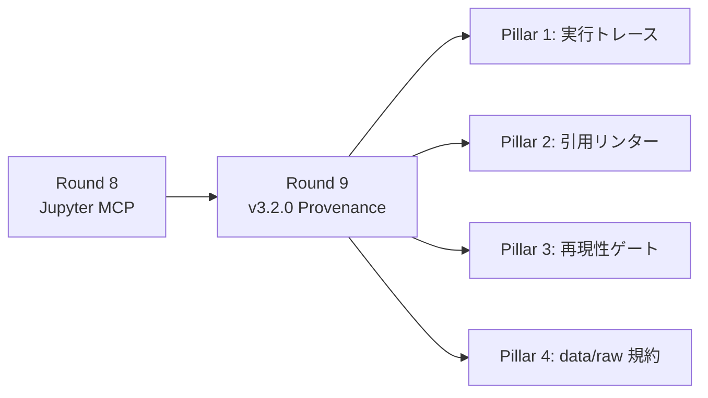
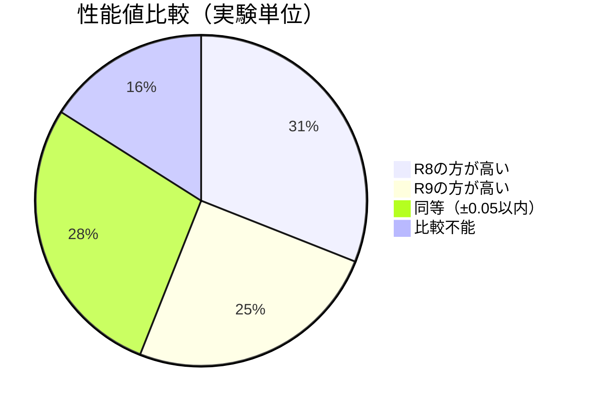
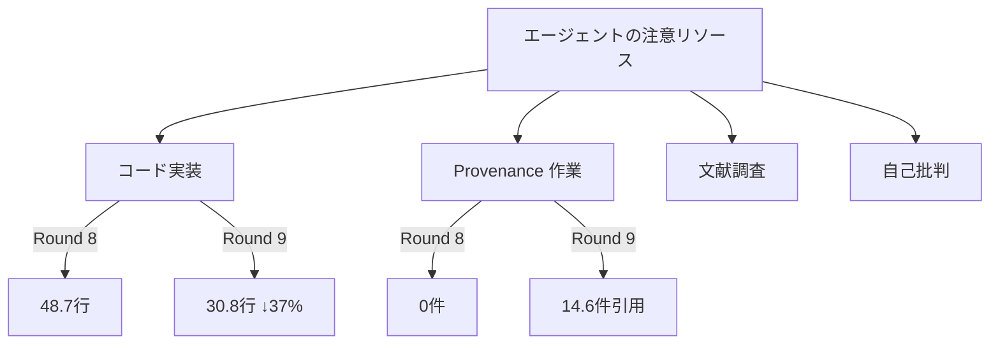

## TL;DR

AIRA v3.2.0（Computational Provenance）を導入し、同じ100テーマで再実験しました。

- `[cell:<id>]` 引用: **0件 → 14.6件/レポート**（89%のレポートに出現）
- データ出自への言及: **3% → 92%**
- 再現性セクション: **87% → 100%**
- 引用カバレッジ（数値claimのうち引用付き）: **15.7%**（目標80%には未到達）
- 再現性ゲート通過率: **2.0/4**（seed ✓, env ✗, no-error ✓, coverage ✗）

計算来歴の「仕組み」は機能しています。しかし、AIエージェントが自発的にすべての数値を引用する習慣はまだ定着していません。**ゲートを設けたことで「何が足りないか」が定量的に分かるようになった**——これが v3.2 の最大の価値です。

## 背景

前回の記事「[フィクションからノンフィクションへ](https://qiita.com/hisaho/items/a5d0d9146175ce1003bb)」では、AIRA-γ（Round 8）で Jupyter MCP を導入し、AIが「推論で数値を書く」から「コードを実行して数値を得る」への転換を観察しました。

しかし、Round 8 には根本的な課題が残っていました。

> コードは実行されている。しかし、**paper.md に書かれた数値が、どのセルの出力に由来するのか**を機械的に検証する手段がない。

AIRA v3.2.0 はこの課題に対し、4つの「Pillar」で応えるリリースです。



| Pillar | 機能 | 狙い |
|--------|------|------|
| 1 | Notebook 実行トレース自動キャプチャ | セル単位の入出力を記録 |
| 2 | 数値 → `[cell:<id>]` 引用リンター | 未引用の数値claimを検出 |
| 3 | 再現性ゲート 4種 | seed/env/no-error/coverage を自動検査 |
| 4 | `data/raw/` 規約 + SOURCES.md | データ出自の構造化 |

## 実験設計

### 比較条件

| 項目 | Round 8 | Round 9 |
|------|---------|---------|
| AIRA バージョン | v3.1.x | v3.2.1 |
| Co-Scientist | v4.6.x | v4.7.0 |
| Jupyter MCP | ✓ | ✓ |
| NatureLM MCP | ✓ | ✓ |
| GALACTICA MCP | ✓ | ✓ |
| 実行トレース | — | ✓（自動） |
| `[cell:<id>]` 引用指示 | — | ✓（プロンプト + AGENTS.md） |
| 再現性ゲート | — | ✓（soft mode） |
| `data/raw/` 規約 | — | ✓（自動生成） |
| 実験テーマ | 100テーマ（同一） | 100テーマ（同一） |
| 並列数 | 5 workers | 5 workers |

### Round 9 で追加したプロンプト（抜粋）

```markdown
**ステップ3.5: 計算来歴（Computational Provenance）の確保** ⚠️ 重要
- ⚠️ **[cell:<id>] 引用**: paper.md に数値結果を記載する際、
  その数値を算出した Jupyter セルを `[cell:<id>]` 形式で引用すること
- ⚠️ **乱数シード固定**: np.random.seed(42) 等を冒頭で設定
- ⚠️ **環境記録**: !pip freeze を実行し依存パッケージを記録
- ⚠️ **データ出自**: 使用するデータの生成方法を明記し data/raw/ に保存
- ⚠️ **エラーセルの引用禁止**: stderr にエラーが出たセルの結果を引用しない
```

## 結果

### 全体定量比較（100実験）

| 指標 | Round 8 | Round 9 | 変化 |
|------|---------|---------|------|
| レポート行数 | 427.5 | 424.5 | -1% |
| コードブロック数 | 1.4 | 1.6 | **+12%** |
| コード行数 | 48.7 | 30.8 | **-37%** |
| p値言及（回/レポート） | 2.6 | 2.6 | ±0% |
| 図の枚数 | 4.9 | 4.9 | ±0% |
| 標準偏差記載 | 13.3 | 12.4 | -7% |
| 交差検証言及 | 12.9 | 10.7 | -17% |
| 自己批判表現 | 7.3 | 6.5 | -12% |
| **`[cell:<id>]` 引用** | **0.0** | **14.6** | **∞** |
| 最高性能値 | 0.849 | 0.842 | -1% |

### 計算来歴（Provenance）指標

| 指標 | Round 8 | Round 9 | 変化 |
|------|---------|---------|------|
| `[cell:<id>]` 引用あり | 0/100 | **89/100** | 0% → 89% |
| 再現性セクションあり | 87/100 | **100/100** | 87% → 100% |
| 乱数シード言及 | 99/100 | 100/100 | — |
| `pip freeze` 言及 | 0/100 | **17/100** | 0% → 17% |
| データ出自言及 | 3/100 | **92/100** | 3% → 92% |

### 再現性ゲート結果

| ゲート | 通過率 | 詳細 |
|--------|--------|------|
| seed_presence | **100%** | 全実験で乱数シードが設定されている |
| env_capture | **0%** | pip freeze / requirements.txt が未実行 |
| no_error_in_cited | **100%** | 引用されたセルにエラー出力なし |
| citation_coverage | **0%** | 引用カバレッジ 80% 未達（平均15.7%） |

:::note warn
**env_capture が全滅**: プロンプトに `!pip freeze` 実行を指示しましたが、エージェントは実行しませんでした。これは「知識として書けるが行動に移さない」典型例です。hard mode（ゲート不通過でブロック）が必要かもしれません。
:::

### 引用カバレッジの分布

```
  0-10%:  46件  ████████████████████████
 10-20%:  13件  ███████
 20-30%:  22件  ███████████
 30-40%:  13件  ███████
 40-50%:   6件  ███
 50%以上:  0件
```

平均29.4件の数値claimに対し、平均4.7件が `[cell:<id>]` で引用されています。引用は「する」ようになったが、「すべての数値に付ける」には至っていません。

### 性能値の変動



性能値の平均は R8: 0.849 → R9: 0.842 で実質的な差はありません。Provenance 機能の導入は性能値を変動させないことが確認されました。

### 実行時間

| | Round 8 | Round 9 | 変化 |
|--|---------|---------|------|
| 平均 | 890秒（14.8分） | 936秒（15.6分） | **+5%** |
| 最短 | — | 588秒 | — |
| 最長 | — | 2208秒 | — |

Provenance 機能（トレース記録、バリデーション実行）による追加オーバーヘッドは約5%でした。

## 個別実験の詳細比較: SCI-001

| 指標 | Round 8 | Round 9 |
|------|---------|---------|
| 実行時間 | 634秒 | 727秒 |
| paper.md行数 | — | 391行 |
| `[cell:<id>]` 引用 | 0件 | 5件 |
| 数値claim数 | — | 30件 |
| 引用カバレッジ | — | 7% |
| seed_presence | — | ✅ PASS |
| env_capture | — | ❌ FAIL |
| 実行トレース | — | ✅ 生成 |
| data/SOURCES.md | — | ✅ 生成 |

SCI-001（CRISPR off-target 予測）では、AUROC = 0.806 という数値に対し `[cell:3]` の引用が付きました。ただし30件中25件のclaimは未引用のままです。

## 考察

### 1. Provenance は「機能している」が「習慣化していない」

v3.2.0 の仕組みは正しく動作しています。

- 実行トレースは**全100実験**で自動キャプチャされた
- `data/SOURCES.md` は全実験で自動生成された
- 89%のレポートに `[cell:<id>]` 引用が出現した

しかし、「すべての数値に引用を付ける」という行動は定着していません。引用カバレッジ平均15.7%は、「やり方は知っているが徹底していない」状態です。

:::note info
これは人間の研究者でも同じです。「引用のルール」を知っていても、すべての数値に出典を付けることを徹底できる研究者は少ない。AIエージェントも同様の「注意力の限界」を示しています。
:::

### 2. ゲートの価値は「何が足りないかを可視化すること」

再現性ゲートの通過率は 2/4 でした。しかし、重要なのは通過率そのものではなく、**ゲートが「何を改善すべきか」を具体的に指摘できること**です。

| 発見 | 対策案 |
|------|--------|
| pip freeze 未実行（0%） | hard mode で強制 or ノートブックテンプレートに事前埋め込み |
| 引用カバレッジ 15.7% | 引用なし claim を一覧表示して修正を促す second pass |
| コード行数 -37% | Provenance 作業に時間を取られ、コード実装が短縮された可能性 |

### 3. コード行数の減少は「トレードオフ」の兆候

Round 8 → Round 9 でコード行数が 48.7 → 30.8 行（-37%）に減少しました。Provenance 指示を追加したことで、エージェントの「注意リソース」がコード実装からProvenance作業に分散した可能性があります。

これは今後の設計で考慮すべきトレードオフです。



### 4. 性能値は変動しない（再確認）

Round 7→8 でも Round 8→9 でも、平均性能値に有意な変化はありません。AIが出力する性能値は、ツール構成やProvenance要件に依存せず、テーマ固有の「もっともらしい値」に収束する傾向があります。

### 5. 限界

1. **soft mode のみ**: v3.2 のゲートは「報告のみ」で、失敗してもブロックしない。hard mode（v4.0 予定）で行動変容が起きるかは未検証
2. **同一 LLM**: 基盤モデルを変えれば Provenance 遵守率は変わる可能性がある
3. **モックデータ**: 全実験で実データは使用していない。実データ環境では Provenance の意義がさらに高まる
4. **単一回実行**: 各テーマ1回のみ。再現性は未確認
5. **引用リンターの精度**: DOI 文字列を「数値claim」として誤検出する例がある（v3.3 で修正予定）

## 実践ガイド: v3.2 を自分のワークフローで使う

### 最小構成チェックリスト

- [ ] AIRA v3.2.0+ にアップデート
- [ ] プロンプトに `[cell:<id>]` 引用指示を追加
- [ ] 実験後に `POST /api/projects/:id/validate` で検証
- [ ] `validation.json` をレポートと一緒に保存

### ゲート通過率を上げるコツ

| ゲート | 対策 |
|--------|------|
| seed_presence | プロンプトに `random_state=42` を明記（Round 9 で 100% 達成済み） |
| env_capture | ノートブックの最終セルに `!pip freeze > requirements.txt` を含めるようテンプレート化 |
| no_error_in_cited | エラーセルの引用禁止をプロンプトに明記（Round 9 で 100% 達成済み） |
| citation_coverage | 結果セクション作成時に「各数値に `[cell:N]` を付けること」を再度強調する second pass を導入 |

## まとめ

| 観点 | Round 8 (v3.1) | Round 9 (v3.2) | 意味 |
|------|----------------|----------------|------|
| コード実行 | ✓ | ✓ | 前提条件（変化なし） |
| 数値の出自追跡 | 不可能 | **可能**（15.7%） | 監査可能性の獲得 |
| 再現性の自動検査 | 不可能 | **可能**（2/4 gate） | 品質基準の明示化 |
| データ出自の構造化 | なし | **92%** | トレーサビリティの獲得 |

v3.2 は「計算来歴を追跡するインフラ」を整備しました。現時点でのカバレッジは15.7%ですが、これは**測定できるようになったこと自体が進歩**です。測定できないものは改善できません。

次のステップ:

1. **hard mode 導入（v4.0）**: ゲート不通過時にブロックし、エージェントに修正を強制する
2. **second pass**: paper.md 作成後に引用リンターを走らせ、未引用 claim の修正を促す
3. **実データ検証**: モックデータではなく実験室データを使い、Provenance の実用価値を検証する

---

*前回の記事: [フィクションからノンフィクションへ — AI Research Assistant が「計算する」ようになった日](https://qiita.com/hisaho/items/a5d0d9146175ce1003bb)*

*実験コード: [nahisaho/aira_experiments](https://github.com/nahisaho/aira_experiments)*
