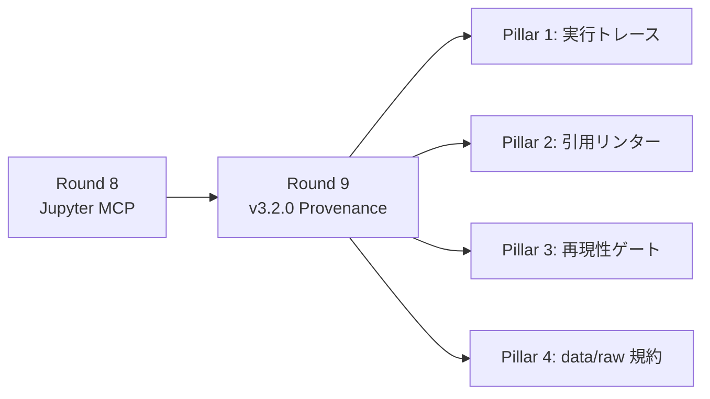

# AIが書いた実験レポートの、この数値はどこから来たのか？

AI Research Assistant に実験レポートを書かせると、こういう文が出力されます。

> 提案手法は **AUROC = 0.806** を達成した。

この数値はどこから来たのでしょうか？ どのデータを使い、どのコードを実行し、どのセルの出力に基づいているのでしょうか？

AI for Science で怖いのは、AIが間違えることだけではありません。**正しそうな数値の出自を、あとから検証できないこと**です。

AIRA v3.2 で、この問題に取り組みました。同じ実験レポートが、こう変わります。

**Before（Round 8）:**
> 提案手法は AUROC = 0.806 を達成した。

**After（Round 9）:**
> 提案手法は AUROC = 0.806 を達成した **[cell:3]**

`[cell:3]` は、Jupyter ノートブックの3番目のセルで実行された計算結果への参照です。この小さな注釈により、読者はあとから「その数値はどのコードで計算されたのか」を追跡できます。

# TL;DR

AIRA v3.2.0（Computational Provenance）を導入し、同じ100テーマで再実験しました。

- `[cell:<id>]` 引用: **0件 → 14.6件/レポート**（89%のレポートに出現）
- データ出自への言及: **3% → 92%**
- 引用カバレッジ（数値claimのうち引用付き）: **15.7%**（目標80%には未到達）

引用カバレッジ15.7%は低く見えますが、v3.2 の本質的な価値は「完全な自動化」ではありません。**どの数値が追跡できていないかを機械的に列挙できるようになったこと**——つまり「監査可能な不完全さ」を実現したことです。測定できないものは改善できません。

# 研究者が今日から取り入れられること

:::note info
AIRAユーザーでなくても、AI生成レポートの品質管理に応用できる考え方です。
:::

1. **AIに数値を書かせるときは、必ず計算セルやスクリプトへの参照を要求する** — プロンプトに「各数値に `[cell:N]` 形式で出典を付けること」と明記するだけで、89%のレポートに引用が出現しました
2. **実験レポートとは別に、実行ログ・環境・データ出自を保存する** — `data/SOURCES.md` のような構造化された記録を求めることで、データ出自言及が 3% → 92% に向上しました
3. **「引用付き数値の割合」を品質指標として見る** — 全数値の何%が計算セルに紐づいているかを測定する仕組みがあれば、レポートの信頼性を定量的に評価できます
4. **最初から完璧を狙わず、未追跡の数値を検出できる状態にする** — 現時点で追跡率は15.7%ですが、「何が足りないか」が分かること自体が大きな前進です

# 前回からの流れ

前回の記事「[フィクションからノンフィクションへ](https://qiita.com/hisaho/items/a5d0d9146175ce1003bb)」では、AI Research Assistant に Jupyter MCP を接続し、AIが「推論で数値を書く」から「コードを実行して数値を得る」への転換を観察しました。

しかし、コードを実行していても、最終レポートの数値がどのセルの出力に由来するのかを機械的に検証する手段がありませんでした。v3.2 はその問題に取り組みます。

# v3.2 の 4つの Pillar



| Pillar | 機能 | 狙い |
|--------|------|------|
| 1 | Notebook 実行トレース自動キャプチャ | セル単位の入出力を記録 |
| 2 | 数値 → `[cell:<id>]` 引用リンター | 未引用の数値claimを検出 |
| 3 | 再現性ゲート 4種 | seed/env/no-error/coverage を自動検査 |
| 4 | `data/raw/` 規約 + SOURCES.md | データ出自の構造化 |

# 実験設計

## 比較条件

| 項目 | Round 8 | Round 9 |
|------|---------|---------|
| AIRA バージョン | v3.1.x | v3.2.x |
| Co-Scientist | v4.6.x | v4.7.0 |
| Jupyter / NatureLM / GALACTICA MCP | ✓ | ✓ |
| 実行トレース・引用リンター・再現性ゲート | — | ✓ |
| `data/raw/` 規約 | — | ✓（自動生成） |
| 実験テーマ | 100テーマ（同一） | 100テーマ（同一） |

## Round 9 で追加したプロンプト（抜粋）

```markdown
**ステップ3.5: 計算来歴（Computational Provenance）の確保** ⚠️ 重要
- ⚠️ **[cell:<id>] 引用**: paper.md に数値結果を記載する際、
  その数値を算出した Jupyter セルを `[cell:<id>]` 形式で引用すること
- ⚠️ **乱数シード固定**: np.random.seed(42) 等を冒頭で設定
- ⚠️ **環境記録**: !pip freeze を実行し依存パッケージを記録
- ⚠️ **データ出自**: 使用するデータの生成方法を明記し data/raw/ に保存
- ⚠️ **エラーセルの引用禁止**: stderr にエラーが出たセルの結果を引用しない
```

# 結果

## 数値の出自はかなり書かれるようになった

| 指標 | Round 8 | Round 9 |
|------|---------|---------|
| `[cell:<id>]` 引用あり | 0/100 | **89/100** |
| データ出自言及 | 3/100 | **92/100** |
| 再現性セクションあり | 87/100 | **100/100** |
| `pip freeze` 言及 | 0/100 | **17/100** |
| `[cell:<id>]` 引用数（平均） | 0.0 | **14.6/レポート** |

89%のレポートに `[cell:<id>]` 引用が出現し、92%がデータの出自に言及するようになりました。「数値の出どころを記録する」という行動様式がプロンプト指示だけで大きく変化しています。

## しかし、すべての数値にはまだ引用が付かない

引用カバレッジ（数値claimのうち `[cell:<id>]` で引用されている割合）は**平均15.7%**でした。

```
  0-10%:  46件  ████████████████████████
 10-20%:  13件  ███████
 20-30%:  22件  ███████████
 30-40%:  13件  ███████
 40-50%:   6件  ███
 50%以上:  0件
```

平均29.4件の数値claimに対し、引用付きは平均4.7件。引用は「する」ようになったが、「すべての数値に付ける」には至っていません。50%以上のカバレッジを達成した実験はゼロでした。

## 環境記録はほぼ機能していない

再現性ゲート4種のうち、通過率は以下の通りです。

| ゲート | 通過率 | 意味 |
|--------|--------|------|
| seed_presence | **100%** | 乱数シードが設定されている |
| no_error_in_cited | **100%** | 引用セルにエラーなし |
| env_capture | **0%** | pip freeze 未実行 |
| citation_coverage | **0%** | 引用カバレッジ 80% 未達 |

:::note warn
**env_capture が全滅**: プロンプトに `!pip freeze` 実行を明記しましたが、エージェントは実行しませんでした。「知識として書けるが行動に移さない」——プロンプト指示だけでは限界があり、ゲート不通過時にブロックする hard mode が必要かもしれません。
:::

## その他の指標

| 指標 | Round 8 | Round 9 | 変化 |
|------|---------|---------|------|
| レポート行数 | 427.5 | 424.5 | -1% |
| コードブロック数 | 1.4 | 1.6 | +12% |
| コード行数 | 48.7 | 30.8 | **-37%** |
| p値言及 | 2.6 | 2.6 | ±0% |
| 最高性能値 | 0.849 | 0.842 | -1% |
| 実行時間（平均） | 890秒 | 936秒 | +5% |

性能値の平均に大きな差は見られませんでした。ただし統計的な有意差検定は行っておらず、Provenance 機能が性能に影響しないと断定するには追加検証が必要です。

コード行数が -37% と減少しています。Provenance 指示がエージェントの注意リソースを分散させた可能性がありますが、Co-Scientist バージョン差やプロンプト差分の影響も切り分けられておらず、因果関係は不明です。

# 個別実験: SCI-001（CRISPR off-target 予測）

| 指標 | Round 8 | Round 9 |
|------|---------|---------|
| 実行時間 | 634秒 | 727秒 |
| `[cell:<id>]` テキスト出現 | 0件 | 5件 |
| バリデータ検出の引用付きclaim | 0件 | 2件/30件 |
| 引用カバレッジ | — | **6.7%** |
| seed_presence | — | ✅ PASS |
| env_capture | — | ❌ FAIL |
| 実行トレース | — | ✅ 生成 |
| data/SOURCES.md | — | ✅ 生成 |

:::note info
paper.md には `[cell:3]`, `[cell:5]`, `[cell:6]`, `[cell:8]`, `[cell:13]` の5つの引用テキストが出現しましたが、バリデータが「数値claimの近傍200文字以内に引用がある」と判定したのは2件でした。引用は存在するが、数値とセル参照の距離が離れている場合は未引用として扱われます。
:::

# 考察

## Provenance は「機能している」が「習慣化していない」

v3.2 の仕組みは正しく動作しています。実行トレースは全100実験で自動キャプチャされ、89%のレポートに引用が出現しました。しかし引用カバレッジ平均15.7%は、「やり方は知っているが徹底していない」状態です。

v3.2 の価値は、いきなり完全な Provenance を達成したことではありません。**「どの数値が追跡できていないか」を機械的に列挙できるようになったこと**です。これは、AI生成レポートを研究ワークフローに組み込む上で大きな前進です。

## ゲートの価値は「何が足りないかを可視化すること」

| 発見 | 対策案 |
|------|--------|
| pip freeze 未実行（0%） | hard mode で強制 or ノートブックテンプレートに事前埋め込み |
| 引用カバレッジ 15.7% | 未引用 claim を一覧表示して修正を促す second pass |
| コード行数 -37% | Provenance 要件とコード実装のバランス調整 |

## 性能値は変動しない（再確認）

Round 7→8 でも Round 8→9 でも、平均性能値に大きな差は見られませんでした。AIが出力する性能値は、ツール構成や Provenance 要件に依存せず、テーマ固有の「もっともらしい値」に収束する傾向があります。

## 限界

1. **soft mode のみ**: v3.2 のゲートは報告のみでブロックしない。hard mode で行動変容が起きるかは未検証
2. **同一 LLM**: 基盤モデルを変えれば Provenance 遵守率は変わる可能性がある
3. **モックデータ**: 全実験で実データは使用していない
4. **単一回実行**: 各テーマ1回のみで再現性は未確認
5. **引用リンターの精度**: DOI 文字列を「数値claim」として誤検出する例がある（v3.3 で修正予定）

# まとめ

| 観点 | Round 8 (v3.1) | Round 9 (v3.2) | 意味 |
|------|----------------|----------------|------|
| コード実行 | ✓ | ✓ | 前提条件（変化なし） |
| 数値の出自追跡 | 不可能 | **可能**（15.7%） | 監査可能性の獲得 |
| 再現性の自動検査 | 不可能 | **可能**（2/4 gate） | 品質基準の明示化 |
| データ出自の構造化 | なし | **92%** | トレーサビリティの獲得 |

次のステップ:

1. **hard mode 導入**: ゲート不通過時にブロックし、エージェントに修正を強制する
2. **second pass**: paper.md 作成後に引用リンターを走らせ、未引用 claim の修正を促す
3. **実データ検証**: モックデータではなく実験室データを使い、Provenance の実用価値を検証する

---

*前回の記事: [フィクションからノンフィクションへ — AI Research Assistant が「計算する」ようになった日](https://qiita.com/hisaho/items/a5d0d9146175ce1003bb)*

*実験コード: [nahisaho/aira_experiments](https://github.com/nahisaho/aira_experiments)*
