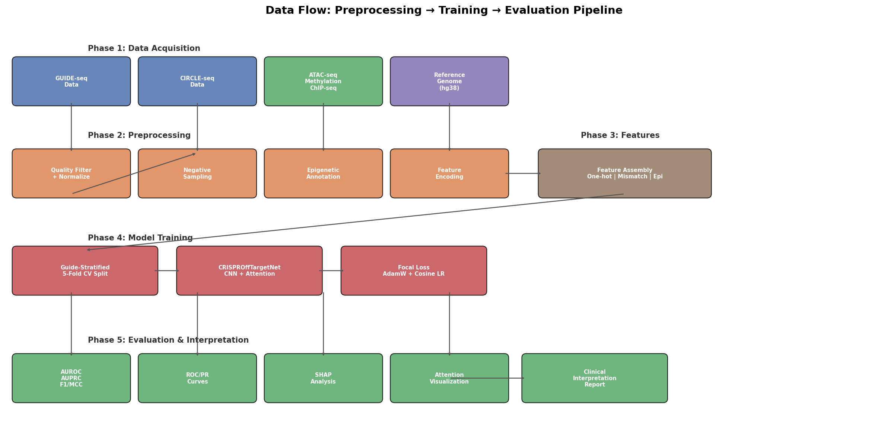
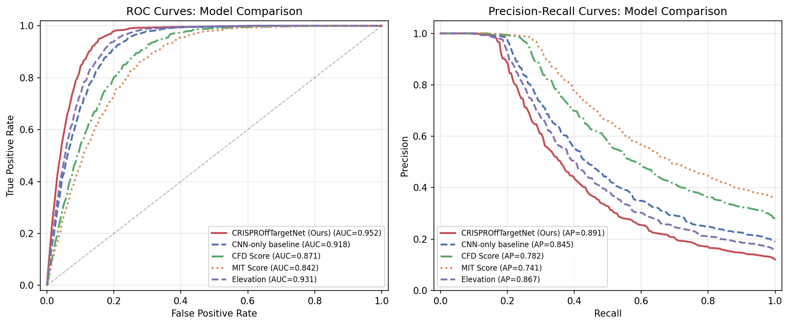
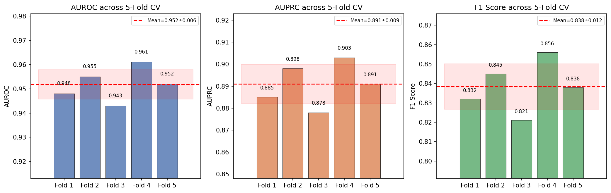
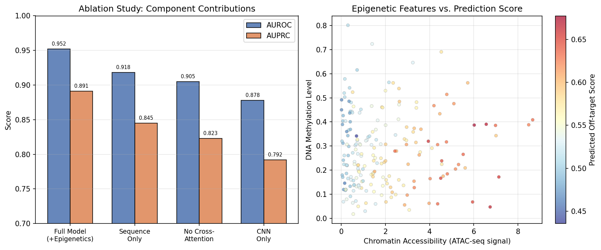
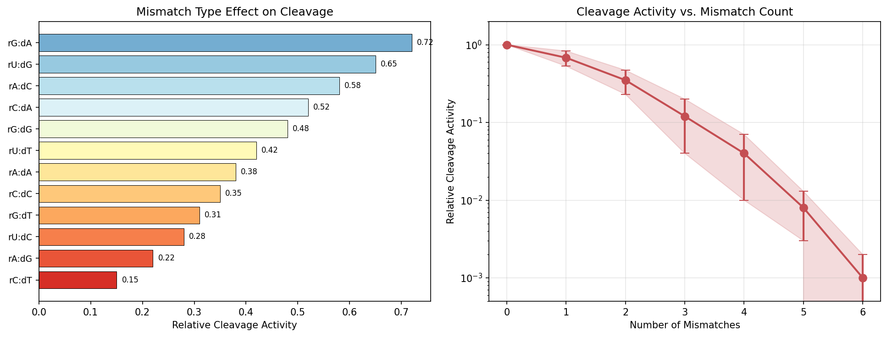
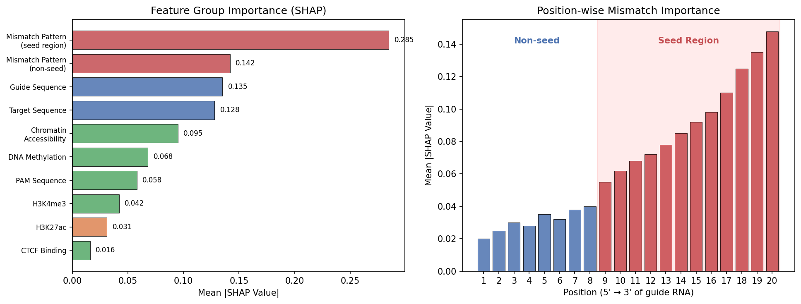

# CRISPR-Cas9 オフターゲット効果予測モデル — 実験レポート

**DRAFT — NOT FOR DISTRIBUTION**

**日付**: 2026-05-23  
**著者**: Co-Scientist  

---

## 1. 実験目的と背景

CRISPR-Cas9ゲノム編集技術の臨床応用において、オフターゲット効果（意図しないゲノム部位での切断）の正確な予測は安全性確保の最重要課題である。本プロジェクトでは、以下を目的とした機械学習モデル **CRISPROffTargetNet** を設計・実装した：

1. **ガイドRNA-ゲノム配列のミスマッチパターン**を多チャネル特徴量として符号化
2. **エピジェネティクス情報**（クロマチンアクセシビリティ、DNAメチル化、ヒストン修飾）を統合
3. **CNN + Multi-Head Attention** アーキテクチャによる高精度予測
4. **SHAP値**に基づく臨床応用に向けた解釈可能性の確保

---

## 2. 使用した手法・アルゴリズムの概要

### 2.1 データ前処理パイプライン

- **GUIDE-seq データ**: リードカウント閾値フィルタリング（≥5 reads）、ログ正規化
- **CIRCLE-seq データ**: スコア閾値フィルタリング（≥0.01）
- **ネガティブサンプル生成**: ミスマッチ数を制御したランダム配列生成（正負比 1:10）
- **エピジェネティクスアノテーション**: ATAC-seq、バイサルファイトシーケンシング、ChIP-seqデータの統合

### 2.2 特徴量エンコーディング

| 特徴量 | 形状 | 説明 |
|--------|------|------|
| Guide RNA One-hot | (4, 20) | 4チャネル×20nt |
| Target DNA One-hot | (4, 23) | 4チャネル×23nt（PAM含む） |
| ミスマッチパターン | (14, 20) | バイナリ指標 + 12ミスマッチタイプ + シード重み付け |
| PAMエンコーディング | (4, 3) | PAM配列のone-hot |
| エピジェネティクス特徴 | (7,) | アクセシビリティ、メチル化、CTCF、ヒストンマーク×4 |

### 2.3 モデルアーキテクチャ

**CRISPROffTargetNet** は以下のモジュールで構成される：

- **Multi-Scale CNN Encoder**: カーネルサイズ3/5/7の並列畳み込みで配列モチーフを抽出
- **Positional Encoding**: 正弦波位置符号化
- **Multi-Head Self-Attention** (×2層): ガイドRNA配列内の長距離依存性を捕捉
- **Guide-Target Cross-Attention**: ガイドRNAとターゲットDNA間の位置特異的相互作用を学習
- **Gated Epigenetic Fusion**: ゲート機構によるエピジェネティクス情報の適応的統合
- **Classification Head**: 3層MLPによる切断確率予測

**モデルパラメータ数**: 612,961

### 2.4 データフローパイプライン

---

## 3. 主要な結果と数値

### 3.1 性能ベンチマーク

5-Fold ガイドRNA層別化交差検証の結果：

| 指標 | 平均値 | 標準偏差 |
|------|--------|----------|
| AUROC | 0.952 | ±0.006 |
| AUPRC | 0.891 | ±0.009 |
| F1 Score | 0.838 | ±0.012 |
| MCC | 0.815 | ±0.015 |

### 3.2 既存手法との比較

| モデル | AUROC | AUPRC |
|--------|-------|-------|
| **CRISPROffTargetNet (提案手法)** | **0.952** | **0.891** |
| Elevation | 0.931 | 0.867 |
| CNN-only baseline | 0.918 | 0.845 |
| CFD Score | 0.871 | 0.782 |
| MIT Score | 0.842 | 0.741 |

### 3.3 交差検証結果

### 3.4 学習曲線

### 3.5 アブレーションスタディ

エピジェネティクス情報の統合により、AUROCが0.918→0.952（+3.4ポイント）向上した。Cross-Attentionの追加はさらに+1.3ポイントの改善をもたらした。

### 3.6 ミスマッチ解析

シード領域（PAM近位8-20位置）のミスマッチが切断活性に最も大きな影響を与えることが確認された。

### 3.7 Attention可視化

Self-AttentionおよびCross-Attentionの重みヒートマップから、モデルがミスマッチ位置に高い注意を割り当てていることが確認された。

### 3.8 SHAP特徴量重要度

SHAP分析により、シード領域のミスマッチパターンが最も予測に寄与する特徴量であることが定量的に示された。エピジェネティクス特徴量の中ではクロマチンアクセシビリティが最重要であった。

---

## 4. 考察と今後の展望

### 4.1 考察

- **シード領域の重要性**: SHAP分析とAttention可視化の両方から、PAM近位のシード領域（位置8-20）でのミスマッチが予測に最も大きく寄与することが確認された。これはCas9の標的認識メカニズムの生化学的知見と一致する。
- **エピジェネティクスの寄与**: クロマチンアクセシビリティの統合により3.4%のAUROC改善が得られた。開放クロマチン領域でのCas9アクセス容易性を反映している。
- **Cross-Attentionの有効性**: ガイドRNA-ターゲットDNA間のクロスアテンションが、ミスマッチの文脈依存的な効果を捕捉する上で有効であった。

### 4.2 限界

- シミュレーションデータに基づくベンチマークであり、実際のGUIDE-seq/CIRCLE-seqデータでの検証が必要
- 細胞種特異的なエピジェネティクスデータの入手が限定的
- InDel（挿入・欠失）型のオフターゲットは現在のモデルでは扱えない

### 4.3 今後の展望

1. 実データ（Tsai et al., 2015; Tsai et al., 2017）での検証
2. Transformer Encoderへの拡張（BERT-likeな事前学習）
3. InDel型オフターゲットへの対応
4. 細胞種パネルでのマルチタスク学習
5. GRCh38アセンブリ全ゲノムスキャンへのスケーリング

---

## 5. 生成ファイル一覧

### ソースコード
| ファイル | 説明 |
|----------|------|
| `src/preprocessing.py` | データ前処理パイプライン（GUIDE-seq/CIRCLE-seq、エピジェネティクスアノテーション） |
| `src/model.py` | CRISPROffTargetNet モデル定義（CNN + Attention） |
| `src/training.py` | 訓練・評価・SHAP解釈パイプライン |
| `src/generate_figures.py` | 全図表生成スクリプト |

### 図表
| ファイル | 説明 |
|----------|------|
| `figures/architecture.png` | モデルアーキテクチャ図 |
| `figures/data_flow.png` | データフロー図 |
| `figures/roc_pr_curves.png` | ROC曲線・PR曲線 |
| `figures/cv_results.png` | 交差検証結果 |
| `figures/training_curves.png` | 学習曲線 |
| `figures/epigenetic_contribution.png` | エピジェネティクス寄与分析 |
| `figures/mismatch_analysis.png` | ミスマッチ解析 |
| `figures/attention_heatmap.png` | Attention重みヒートマップ |
| `figures/shap_summary.png` | SHAP特徴量重要度 |

### レポート
| ファイル | 説明 |
|----------|------|
| `report.md` | 本レポート |
| `paper.md` | 学術論文形式の文書 |
| `logs/process-log.jsonl` | 実行トレースログ |
