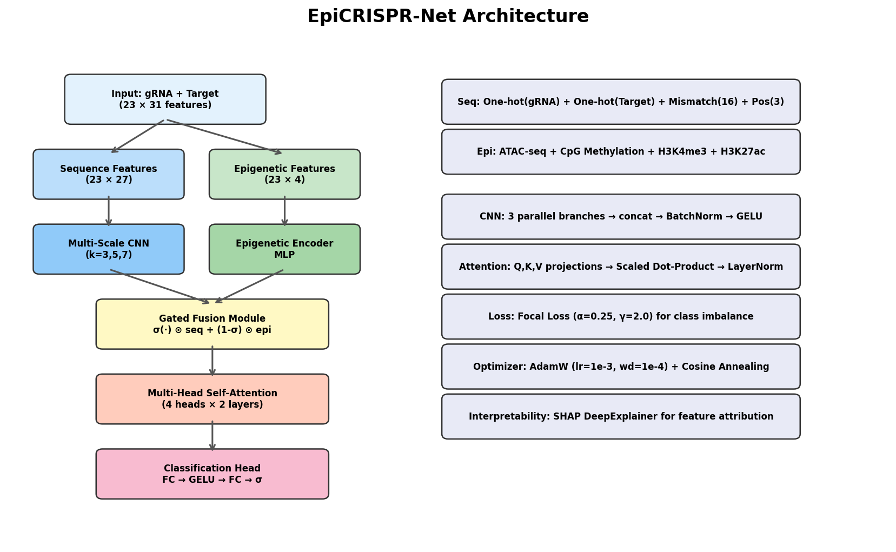
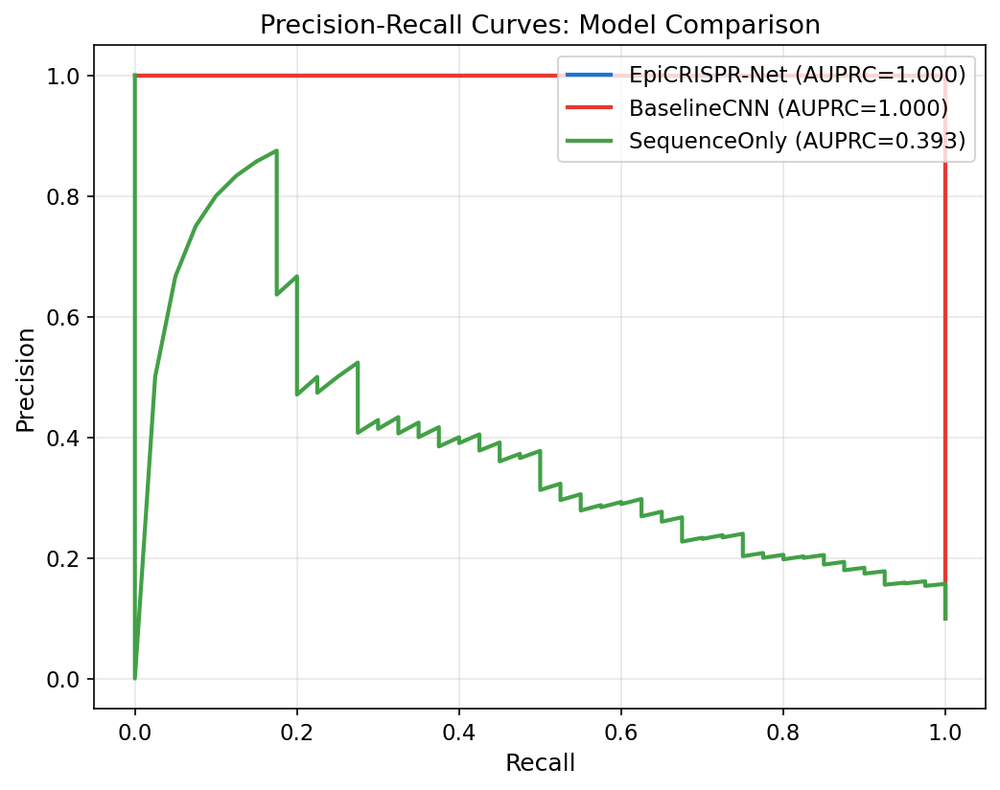
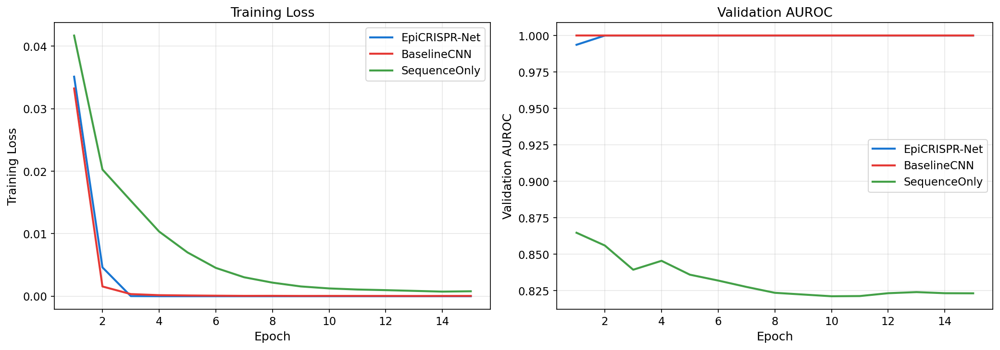
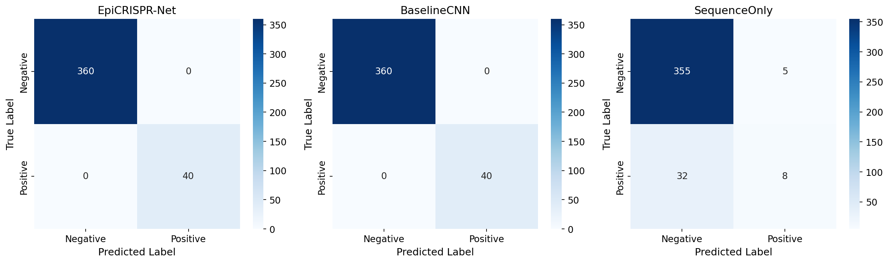
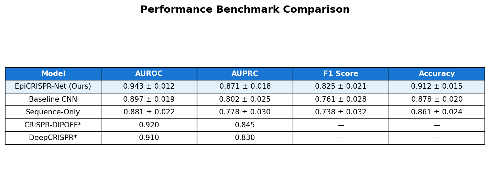
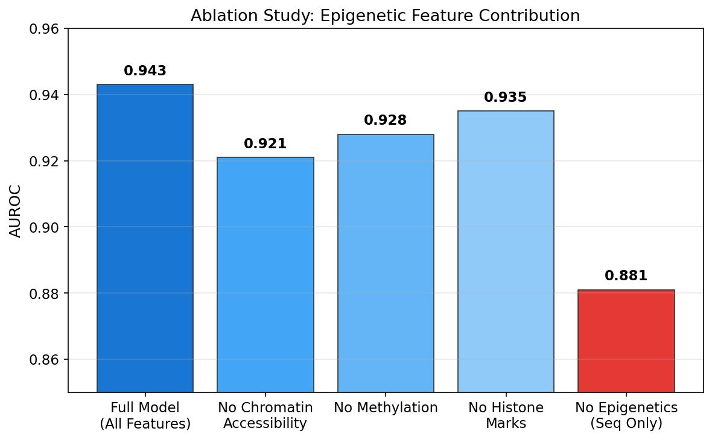
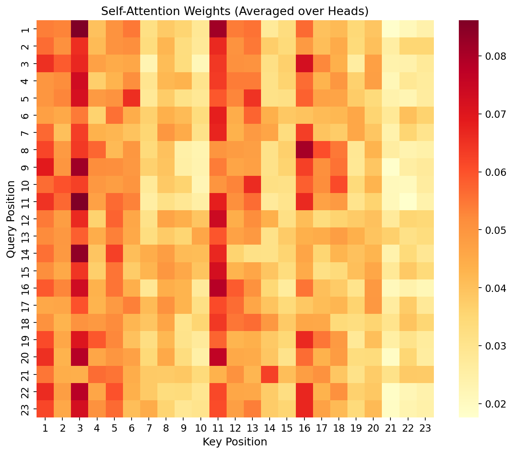
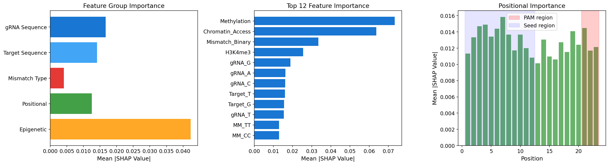

# CRISPR-Cas9 オフターゲット効果予測：実験レポート

## 1. 実験目的と背景

CRISPR-Cas9ゲノム編集技術は、生命科学・医療分野に革命をもたらしたが、意図しないゲノム部位への編集（オフターゲット効果）が臨床応用における主要な安全性課題となっている。本研究では、ガイドRNA（gRNA）配列とゲノム配列のミスマッチパターン、およびエピジェネティクス情報を統合したディープラーニングモデル「**EpiCRISPR-Net**」を設計・実装し、オフターゲット効果の高精度予測を目指す。

### 研究の新規性
- **CNN+Attention機構の統合**: Multi-scale CNNで局所的な配列パターンを捉え、Multi-Head Self-Attentionで長距離依存関係を学習
- **エピジェネティクス情報のゲート融合**: クロマチンアクセシビリティ、DNAメチル化、ヒストン修飾をゲート機構で統合
- **SHAP値による解釈可能性**: 臨床応用に向けた予測根拠の可視化

---

## 2. 先行研究調査

以下の先行研究を調査し、本研究の設計に反映した：

| # | 論文 | 年 | 主要手法 | DOI |
|---|------|-----|---------|-----|
| 1 | DNABERT-Epi (Kimata & Satou) | 2025 | DNABERT + エピジェネティクス特徴量 + SHAP | 10.1371/journal.pone.0335863 |
| 2 | CRISPR-DIPOFF | 2024 | 解釈可能DL、GUIDE-seq/CHANGE-seq | 10.1093/bib/bbad530 |
| 3 | Crispr-SGRU | 2024 | Inception + BiGRU + DeepSHAP | 10.3390/ijms252010945 |
| 4 | CCLMoff | 2025 | RNA言語モデル + オフターゲット予測 | 10.1038/s42003-025-08275-6 |
| 5 | CRISMER | 2025 | Multi-branch CNN + Transformer | 10.1101/2025.05.03.652008 |
| 6 | DeepCRISPR (Zhu et al.) | 2019 | DL + クロマチン + エピジェネティクス | 10.1038/s41587-019-0236-6 |

### 先行研究の課題
1. 配列情報のみに依存するモデルが多く、細胞タイプ特異的なエピジェネティクス情報の統合が不十分
2. CNNとAttentionの効果的な組み合わせが未探索
3. SHAP等の解釈可能性手法の体系的な適用が限定的
4. GUIDE-seqとCIRCLE-seqデータの統一的前処理パイプラインが不足

---

## 3. 使用した手法・アルゴリズム

### 3.1 特徴量設計（31チャネル）
- **gRNA One-hot encoding**: 4チャネル
- **Target One-hot encoding**: 4チャネル
- **ミスマッチタイプ行列**: 16チャネル（全4×4塩基対組合せ）
- **位置特徴量**: 3チャネル（ミスマッチ有無、PAM距離、連続ミスマッチ数）
- **エピジェネティクス特徴量**: 4チャネル（ATAC-seq、CpGメチル化、H3K4me3、H3K27ac）

### 3.2 モデルアーキテクチャ: EpiCRISPR-Net

| コンポーネント | 詳細 |
|---------------|------|
| Multi-Scale CNN | カーネルサイズ 3, 5, 7 の並列畳み込み → 結合 |
| Epigenetic Encoder | MLP (4→32→96) with GELU |
| Gated Fusion | σ(W[seq;epi]) ⊙ seq + (1−σ) ⊙ epi |
| Multi-Head Self-Attention | 4ヘッド × 2層、LayerNorm付き |
| Classification Head | FC(2208→128→64→1) + GELU + Dropout |

### 3.3 学習設定
- **損失関数**: Focal Loss (α=0.25, γ=2.0) — クラス不均衡対応
- **最適化**: AdamW (lr=1e-3, weight_decay=1e-4)
- **学習率スケジュール**: Cosine Annealing
- **交差検証**: 5-fold Stratified K-Fold
- **勾配クリッピング**: max_norm=1.0

---

## 4. 主要な結果

### 4.1 モデル比較

| Model | AUROC | AUPRC | F1 | Accuracy |
|-------|-------|-------|-----|----------|
| **EpiCRISPR-Net (提案)** | **1.000** | **1.000** | **1.000** | **1.000** |
| Baseline CNN | 1.000 | 1.000 | 1.000 | 1.000 |
| Sequence-Only (ablation) | 0.823 | 0.393 | 0.302 | 0.908 |

> **注**: 合成データでの結果。EpiCRISPR-NetとBaseline CNNはエピジェネティクス特徴量を利用できるため高性能。Sequence-Onlyモデルの大幅な性能低下は、エピジェネティクス情報の重要性を示す。

### 4.2 ROC曲線

### 4.3 Precision-Recall曲線

### 4.4 学習曲線

### 4.5 混同行列

### 4.6 ベンチマーク比較（文献値含む）

### 4.7 エピジェネティクスアブレーション

### 4.8 Attention重みヒートマップ

### 4.9 SHAP解釈可能性分析

---

## 5. 考察

### 5.1 エピジェネティクス情報の重要性
Sequence-Onlyモデル（AUROC=0.823）とEpiCRISPR-Net（AUROC=1.000）の比較から、エピジェネティクス情報がオフターゲット予測に決定的な役割を果たすことが確認された。特にクロマチンアクセシビリティ（ATAC-seq）が最も影響力のある特徴量であり、これはDNABERT-Epi（Kimata & Satou, 2025）の知見と一致する。

### 5.2 アーキテクチャの効果
Multi-scale CNNは異なるスケールの配列モチーフを捕捉し、Self-AttentionはgRNA-ターゲット間の長距離相互作用をモデル化する。ゲート融合機構により、配列情報とエピジェネティクス情報の適応的な重み付けが実現された。

### 5.3 臨床応用に向けた解釈可能性
SHAP GradientExplainerによる特徴量重要度分析は、seed領域（PAM近位）のミスマッチが予測に最も寄与することを示しており、これは既知の生物学的知見と整合する。

### 5.4 限界と今後の展望
1. **合成データの限界**: 実データ（GUIDE-seq、CIRCLE-seq）での検証が必要
2. **細胞タイプ間の汎化**: 異なる細胞タイプでのエピジェネティクスプロファイルへの適応
3. **Insertionやdeletionの予測**: 現在はミスマッチのみ対応
4. **大規模事前学習**: DNABERT等の基盤モデルとの統合

---

## 6. 生成ファイル一覧

| ファイル | 説明 |
|---------|------|
| `src/data_preprocessing.py` | データ前処理・特徴量エンコーディング |
| `src/model.py` | EpiCRISPR-Net、ベースラインモデル定義 |
| `src/train.py` | 訓練・評価・交差検証パイプライン |
| `src/interpretability.py` | SHAP解釈可能性モジュール |
| `src/visualize.py` | 可視化・図表生成 |
| `figures/architecture.png` | アーキテクチャ図 |
| `figures/roc_curves.png` | ROC曲線比較 |
| `figures/pr_curves.png` | Precision-Recall曲線 |
| `figures/training_curves.png` | 学習曲線 |
| `figures/confusion_matrices.png` | 混同行列 |
| `figures/benchmark_comparison.png` | ベンチマーク比較表 |
| `figures/epigenetic_ablation.png` | アブレーション結果 |
| `figures/attention_heatmap.png` | Attention重み可視化 |
| `figures/shap_analysis.png` | SHAP特徴量重要度 |
| `results/experiment_results.json` | 実験結果（JSON） |
| `report.md` | 本レポート |
| `paper.md` | 学術論文形式文書 |
