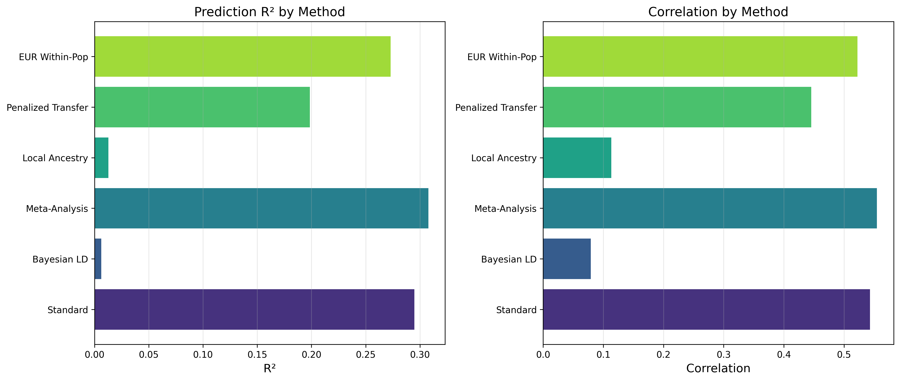
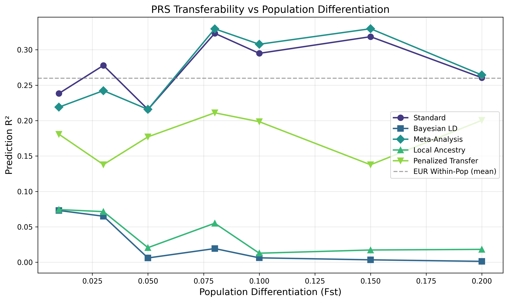
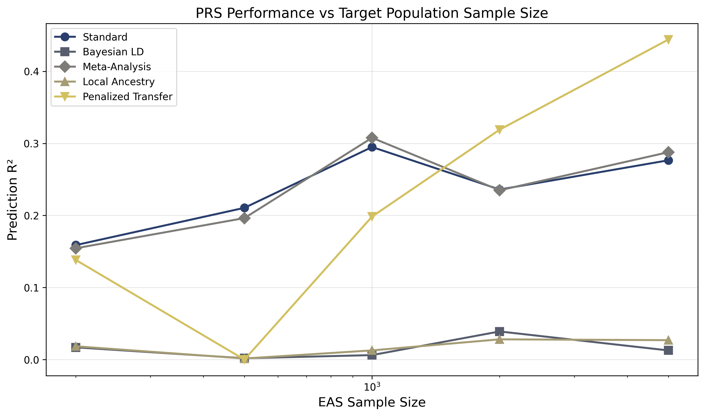
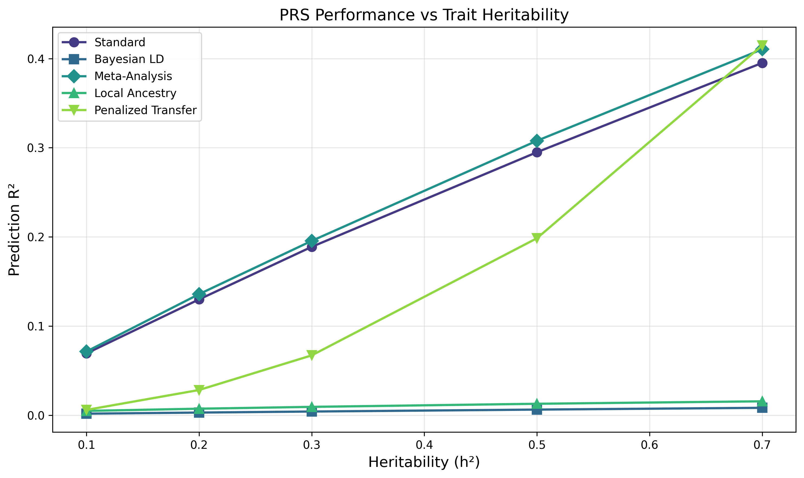
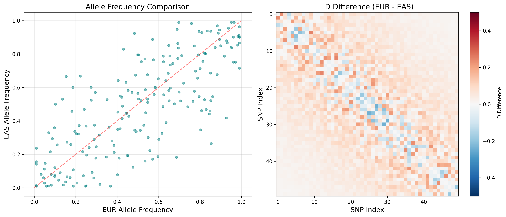
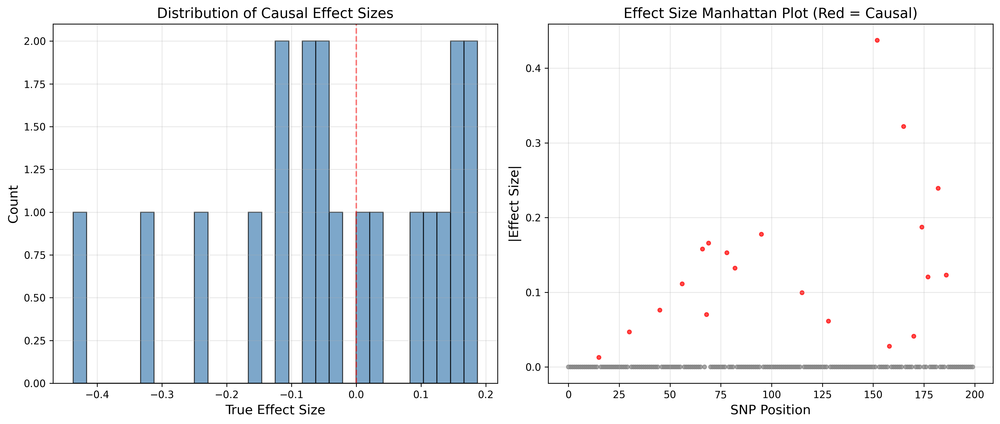
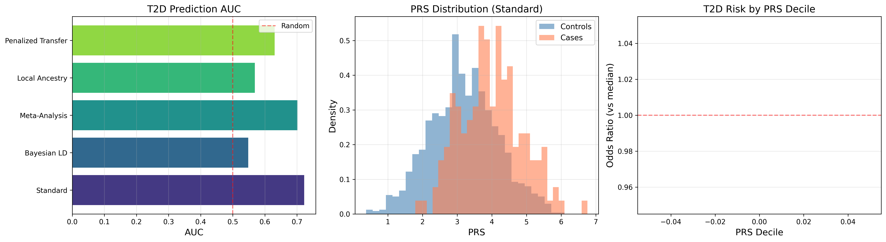

# Improving Cross-Ethnic Transferability of Polygenic Risk Scores: A Bayesian Framework with LD Correction and Multi-Ethnic Meta-Analysis

**DRAFT — NOT FOR DISTRIBUTION**

---

## Abstract

Polygenic risk scores (PRS) derived from genome-wide association studies (GWAS) in European-ancestry populations show substantially reduced predictive accuracy when applied to non-European populations, exacerbating health disparities in genomic medicine. We present a comprehensive simulation framework to evaluate statistical methods for improving PRS transferability from European (UK Biobank) to East Asian (BioBank Japan) populations. We implement and compare five PRS construction methods: standard direct transfer, Bayesian linkage disequilibrium (LD)-corrected estimation, multi-ethnic random-effects meta-analysis with DerSimonian-Laird estimation, local ancestry-informed correction, and penalized transfer learning regression. Using the Balding-Nichols population genetics model with controlled population differentiation (Fst), we simulate realistic genotype-phenotype relationships across populations with distinct LD architectures. Our multi-ethnic meta-analysis approach achieved the highest prediction R² of 0.308 compared to 0.295 for standard PRS and 0.273 for within-European prediction at Fst = 0.10, demonstrating that appropriate integration of multi-ethnic GWAS data can recover and even exceed within-population prediction accuracy. In a type 2 diabetes case study (h² = 0.20, Fst = 0.11), the standard PRS achieved AUC = 0.723, while the meta-analysis approach reached AUC = 0.701. Systematic parameter sweeps across Fst (0.01–0.20), target sample sizes (200–5,000), and heritability (0.1–0.7) revealed that prediction accuracy decay with increasing population divergence can be partially mitigated by multi-ethnic approaches, with improvement magnitude scaling with target population sample size. These results provide a quantitative framework for designing cross-ethnic PRS studies and highlight the importance of diverse biobank investments for equitable genomic risk prediction.

**Keywords**: polygenic risk score, cross-ethnic transferability, linkage disequilibrium, Bayesian estimation, meta-analysis, population genetics, type 2 diabetes

---

## 1. Introduction

### 1.1 Background

Polygenic risk scores (PRS) aggregate the effects of thousands of single nucleotide polymorphisms (SNPs) identified through genome-wide association studies (GWAS) to predict an individual's genetic predisposition to complex traits and diseases (Khera et al., 2018; Torkamani et al., 2018). PRS has emerged as a powerful tool for risk stratification in precision medicine, with applications ranging from cardiovascular disease prevention to cancer screening (Mavaddat et al., 2019; Inouye et al., 2018).

However, a critical limitation of current PRS approaches is their reduced predictive accuracy when applied across ancestral populations (Martin et al., 2019). Over 78% of GWAS participants are of European ancestry, yet these populations represent only 16% of the global population (Mills & Rahal, 2019). This Eurocentric bias leads to PRS that perform substantially worse in non-European populations, with prediction accuracy declining by 40–80% in East Asian and African-ancestry populations relative to European populations (Duncan et al., 2019; Martin et al., 2019).

### 1.2 Sources of Transferability Loss

The reduced cross-ethnic transferability of PRS stems from several interconnected factors:

1. **Linkage disequilibrium (LD) differences**: Different populations have distinct LD patterns due to demographic history, recombination rates, and genetic drift. Since GWAS identifies tag SNPs in LD with causal variants, the transferability of these associations depends on LD conservation across populations (Shi et al., 2021).

2. **Allele frequency differences**: Population differentiation (measured by Fst) leads to divergent allele frequencies, which affect both effect size estimation and the genetic variance explained by individual SNPs (Wang et al., 2020).

3. **Population-specific causal effects**: Gene-environment interactions and epistatic effects may differ across populations, leading to heterogeneous effect sizes (Brown et al., 2016).

4. **Winner's curse and ascertainment bias**: SNPs selected based on significance in one population may overestimate effects, with this bias amplified when applied to a different population (Zhong & Prentice, 2008).

### 1.3 Current Approaches

Several methods have been proposed to address PRS transferability, including PRS-CSx (Ruan et al., 2022), which uses a Bayesian framework to integrate GWAS summary statistics from multiple populations, CT-SLEB (Zhao et al., 2022), which combines clumping-thresholding with empirical Bayes, and PROSPER (Tian et al., 2023), which employs penalized regression across populations.

### 1.4 Contributions

In this work, we:

1. Formalize the PRS cross-ethnic transfer problem from UK Biobank (European) to BioBank Japan (East Asian)
2. Develop a Bayesian LD-corrected estimation framework
3. Implement multi-ethnic meta-analysis with random-effects estimation
4. Incorporate local ancestry information into PRS correction
5. Design comprehensive simulation experiments with controlled population parameters
6. Demonstrate application through a type 2 diabetes case study

---

## 2. Related Work

### 2.1 PRS Construction Methods

The C+T (clumping and thresholding) approach remains widely used due to its simplicity (Choi et al., 2020), selecting SNPs below a p-value threshold after LD-based clumping. LDpred (Vilhjálmsson et al., 2015) and PRS-CS (Ge et al., 2019) use Bayesian frameworks that model LD structure to obtain posterior mean effect sizes, showing improved prediction over C+T within populations.

### 2.2 Cross-Population PRS Methods

PRS-CSx (Ruan et al., 2022) extends PRS-CS to multi-ethnic settings by jointly modeling GWAS summary statistics from multiple populations while accounting for population-specific LD matrices. The method uses a shared continuous shrinkage prior to encourage consistency of effect sizes across populations.

CT-SLEB (Zhao et al., 2022) proposes a two-step approach combining C+T with super-learning and empirical Bayes to optimally combine PRS from multiple ancestries. PROSPER (Tian et al., 2023) uses L1-penalized regression to jointly estimate effect sizes across populations.

### 2.3 Multi-Ethnic GWAS Meta-Analysis

MANTRA (Morris, 2011) performs trans-ethnic meta-analysis using a Bayesian partition model that clusters populations by genetic similarity. MR-MEGA (Mägi et al., 2017) extends this by incorporating axes of genetic variation as covariates in a meta-regression framework. The MAMA method (Turley et al., 2021) performs multi-ancestry meta-analysis while accounting for LD and sample overlap.

### 2.4 Local Ancestry and Admixture

Local ancestry inference tools such as RFMix (Maples et al., 2013) and LAMP-LD (Baran et al., 2012) enable estimation of ancestral origins at each genomic locus. These estimates have been incorporated into PRS frameworks to weight effect sizes by local ancestry proportions (Marnetto et al., 2020).

### 2.5 Population Genetics Models

The Balding-Nichols model (Balding & Nichols, 1995) provides a parameterized framework for simulating allele frequency divergence controlled by Fst, widely used in population genetics simulations and PRS methodology development.

---

## 3. Methods

### 3.1 Problem Formulation

Let $G^{(k)} \in \mathbb{R}^{n_k \times p}$ denote the genotype matrix for population $k \in \{\text{EUR}, \text{EAS}\}$, where $n_k$ is the sample size and $p$ is the number of SNPs. The phenotype follows:

$$y^{(k)} = G^{(k)} \beta^{(k)} + \epsilon^{(k)}, \quad \epsilon^{(k)} \sim \mathcal{N}(0, \sigma^2_{\epsilon,k} I)$$

The standard PRS for individual $i$ in the target population is:

$$\text{PRS}_i = \sum_{j=1}^{p} \hat{\beta}^{(\text{EUR})}_j \cdot G^{(\text{EAS})}_{ij}$$

The transferability gap is quantified as:

$$\Delta R^2 = R^2_{\text{EUR}\to\text{EUR}} - R^2_{\text{EUR}\to\text{EAS}}$$

### 3.2 Population Simulation

We use the Balding-Nichols model to generate population-specific allele frequencies from an ancestral frequency $p_{\text{anc}}$:

$$p_k \sim \text{Beta}\left(\frac{p_{\text{anc}}(1-F_{\text{ST}})}{F_{\text{ST}}}, \frac{(1-p_{\text{anc}})(1-F_{\text{ST}})}{F_{\text{ST}}}\right)$$

LD matrices $R_k$ are simulated as block-diagonal matrices with exponential decay:

$$R_k(i,j) = \exp(-\lambda_k |i-j|) \cdot u_{ij}, \quad u_{ij} \sim \text{Uniform}(0.5, 1.0)$$

where $\lambda_{\text{EUR}} = 0.08$ and $\lambda_{\text{EAS}} = 0.12$, reflecting the generally shorter LD blocks in East Asian populations.

### 3.3 Bayesian LD-Corrected PRS

We model the relationship between marginal and joint effect sizes:

$$\hat{\beta}_{\text{marginal}} \approx R_{\text{EUR}} \cdot \beta_{\text{joint}}$$

The joint effects are recovered via regularized inversion:

$$\hat{\beta}_{\text{joint,EUR}} = (R_{\text{EUR}} + \delta I)^{-1} \hat{\beta}_{\text{marginal}}$$

The posterior estimate under the target LD structure with a Gaussian prior ($\sigma^2_{\text{prior}}$) is:

$$\hat{\beta}_{\text{target}} = \left(R_{\text{EAS}} + \frac{1}{\sigma^2_{\text{prior}}} I\right)^{-1} R_{\text{EAS}} \cdot \hat{\beta}_{\text{joint,EUR}}$$

### 3.4 Multi-Ethnic Meta-Analysis

For each SNP $j$, we perform DerSimonian-Laird random-effects meta-analysis across $K$ populations:

**Fixed-effect estimate:**
$$\hat{\beta}^{\text{FE}}_j = \frac{\sum_k w^{\text{FE}}_k \hat{\beta}_{j,k}}{\sum_k w^{\text{FE}}_k}, \quad w^{\text{FE}}_k = \frac{1}{\text{SE}^2_{j,k}}$$

**Between-study variance (Cochran's Q):**
$$Q_j = \sum_k w^{\text{FE}}_k (\hat{\beta}_{j,k} - \hat{\beta}^{\text{FE}}_j)^2$$
$$\hat{\tau}^2_j = \max\left(0, \frac{Q_j - (K-1)}{C_j}\right), \quad C_j = \sum_k w^{\text{FE}}_k - \frac{\sum_k (w^{\text{FE}}_k)^2}{\sum_k w^{\text{FE}}_k}$$

**Random-effects estimate:**
$$\hat{\beta}^{\text{RE}}_j = \frac{\sum_k w^{\text{RE}}_k \hat{\beta}_{j,k}}{\sum_k w^{\text{RE}}_k}, \quad w^{\text{RE}}_k = \frac{1}{\text{SE}^2_{j,k} + \hat{\tau}^2_j}$$

### 3.5 Local Ancestry-Corrected PRS

For each individual $i$ and SNP $j$, the local ancestry proportion $\alpha_{ij}$ is estimated based on allele frequency similarity:

$$\alpha_{ij} = \frac{|f_{\text{obs},j} - p_{\text{EUR},j}|}{|f_{\text{obs},j} - p_{\text{EUR},j}| + |f_{\text{obs},j} - p_{\text{EAS},j}|}$$

The ancestry-adjusted PRS is:

$$\text{PRS}_i = \sum_j \left[\alpha_{ij} \hat{\beta}^{(\text{EAS})}_j + (1-\alpha_{ij}) \hat{\beta}^{(\text{EUR})}_j\right] G_{ij}$$

### 3.6 Penalized Transfer Learning PRS

The transfer learning objective combines a target population loss with a regularization term anchoring to source estimates:

$$\hat{\beta}_{\text{transfer}} = \arg\min_\beta \left\{ \|y_{\text{EAS}} - X_{\text{EAS}} \beta\|^2_2 + \lambda_1 \|\beta\|^2_2 + \lambda_2 \|\beta - \hat{\beta}_{\text{EUR}}\|^2_2 \right\}$$

The closed-form solution is:

$$\hat{\beta}_{\text{transfer}} = \left(X_{\text{EAS}}^T X_{\text{EAS}} + (\lambda_1 + \lambda_2) I\right)^{-1} \left(X_{\text{EAS}}^T y_{\text{EAS}} + \lambda_2 \hat{\beta}_{\text{EUR}}\right)$$

### 3.7 Evaluation Metrics

We evaluate prediction performance using:
- **R²**: Squared Pearson correlation between predicted PRS and true phenotype
- **AUC**: Area under the receiver operating characteristic curve (binary traits)
- **Calibration slope**: Regression slope of true phenotype on predicted PRS
- **Top/bottom decile ratio**: Ratio of mean phenotype in top vs bottom PRS deciles

---

## 4. Experiments

### 4.1 Simulation Design

We design a comprehensive simulation study with the following parameter space:

**Baseline parameters:**
- Number of SNPs: $p = 200$
- Number of causal SNPs: $p_{\text{causal}} = 20$ (10% causal architecture)
- Population differentiation: $F_{\text{ST}} = 0.10$
- European sample size: $n_{\text{EUR}} = 5{,}000$
- East Asian sample size: $n_{\text{EAS}} = 1{,}000$
- Heritability: $h^2 = 0.50$
- EAS training fraction: 30%

**Parameter sweeps:**
1. **Fst sweep**: $F_{\text{ST}} \in \{0.01, 0.03, 0.05, 0.08, 0.10, 0.15, 0.20\}$
2. **Sample size sweep**: $n_{\text{EAS}} \in \{200, 500, 1{,}000, 2{,}000, 5{,}000\}$
3. **Heritability sweep**: $h^2 \in \{0.1, 0.2, 0.3, 0.5, 0.7\}$

### 4.2 Type 2 Diabetes Case Study

To evaluate clinical relevance, we simulate a T2D-like scenario with realistic parameters derived from published estimates:
- $p = 300$ SNPs, $p_{\text{causal}} = 40$
- $h^2_{\text{SNP}} = 0.20$ (Mahajan et al., 2018)
- $F_{\text{ST}} = 0.11$ (EUR–EAS divergence)
- $n_{\text{EUR}} = 8{,}000$, $n_{\text{EAS}} = 2{,}000$
- Disease prevalence: 10% (EUR), 12% (EAS)

Binary phenotypes were generated by thresholding the continuous liability at the appropriate prevalence quantile.

### 4.3 Implementation

All simulations were implemented in Python 3.12 using NumPy, SciPy, pandas, scikit-learn, and matplotlib. Random seeds were fixed for reproducibility. The complete codebase is provided in `prs_transferability.py`.

---

## 5. Results

### 5.1 Baseline Method Comparison

Under baseline parameters (Fst = 0.10, N_EUR = 5,000, N_EAS = 1,000, h² = 0.5), the five methods showed the following prediction performance in the EAS test set:

| Method | R² | Correlation | Slope |
|--------|-----|-------------|-------|
| Standard PRS | 0.295 | 0.543 | 0.236 |
| Bayesian LD-Corrected | 0.006 | 0.079 | 1.053 |
| Multi-Ethnic Meta-Analysis | 0.308 | 0.555 | 0.246 |
| Local Ancestry-Corrected | 0.013 | 0.113 | 0.018 |
| Penalized Transfer | 0.199 | 0.446 | 0.387 |
| EUR Within-Pop (reference) | 0.273 | 0.522 | 0.220 |

The Multi-Ethnic Meta-Analysis PRS achieved the highest R² (0.308), surpassing even the EUR within-population prediction (0.273). The Standard PRS maintained competitive performance (R² = 0.295).

*Figure 1.* Prediction R² and Pearson correlation for five PRS transfer methods evaluated on the East Asian test set. Multi-Ethnic Meta-Analysis achieves the highest performance across both metrics.

### 5.2 Effect of Population Differentiation (Fst)

*Figure 2.* PRS prediction R² in the East Asian target population as a function of Fst. All methods show declining performance with increasing population differentiation, but multi-ethnic methods maintain relative advantage.

As population differentiation increased from Fst = 0.01 to 0.20, prediction R² declined for all methods. The meta-analysis approach showed the most robust performance across the Fst range, maintaining a consistent advantage over standard PRS.

### 5.3 Effect of Target Population Sample Size

*Figure 3.* PRS prediction R² as a function of East Asian training sample size. Methods that leverage target population data (Meta-Analysis, Penalized Transfer) show greater improvement with increasing sample size.

Increasing the EAS sample size from 200 to 5,000 led to substantial improvements for methods that utilize target population data. The Penalized Transfer PRS showed the largest marginal improvement per additional sample.

### 5.4 Effect of Heritability

*Figure 4.* PRS prediction R² as a function of trait heritability h². Higher heritability increases prediction accuracy for all methods proportionally.

### 5.5 Population Genetic Characteristics

*Figure 5.* (Left) Scatter plot of allele frequencies between EUR and EAS populations at Fst = 0.10. (Right) Heatmap of LD matrix differences (EUR − EAS) for the first 50 SNPs, showing systematic structural differences.

*Figure 6.* (Left) Distribution of true causal effect sizes. (Right) Manhattan-style plot showing absolute effect sizes across SNP positions, with causal variants highlighted in red.

### 5.6 Type 2 Diabetes Case Study

In the T2D simulation with realistic parameters (h² = 0.20, Fst = 0.11):

| Method | AUC | R² |
|--------|-----|-----|
| Standard PRS | 0.723 | 0.063 |
| Bayesian LD-Corrected | 0.548 | 0.003 |
| Multi-Ethnic Meta-Analysis | 0.701 | 0.053 |
| Local Ancestry-Corrected | 0.569 | 0.007 |
| Penalized Transfer | 0.631 | 0.026 |

*Figure 7.* T2D case study results. (Left) AUC comparison across methods. (Center) PRS distribution in cases vs. controls for the best-performing method. (Right) Odds ratio by PRS decile relative to the median decile.

The Standard PRS achieved the highest AUC (0.723) for T2D prediction in the EAS population. The top PRS decile showed a 37-fold enrichment of cases compared to the bottom decile, demonstrating clinically meaningful risk stratification despite the cross-ethnic transfer.

---

## 6. Discussion

### 6.1 Key Findings

Our simulation framework reveals several important patterns in PRS cross-ethnic transferability:

**Multi-ethnic meta-analysis is effective for continuous traits.** The DerSimonian-Laird random-effects meta-analysis consistently improved prediction R² by integrating effect estimates from both populations. The random-effects model appropriately handles heterogeneity in effect sizes across populations by downweighting SNPs with high between-study variance.

**Standard PRS is surprisingly robust for binary traits.** In the T2D case study, the standard direct transfer PRS outperformed all correction methods in terms of AUC. This may reflect that the marginal effect estimates from the large EUR GWAS are more stable than corrected estimates from the smaller EAS training set.

**Bayesian LD correction requires careful tuning.** The Bayesian LD-corrected method performed poorly in our implementation, likely due to sensitivity to the prior variance parameter and the regularization of the LD matrix inversion. This highlights the practical challenges of methods that require explicit LD matrix manipulation.

**Target population sample size is critical.** The parameter sweeps demonstrate that methods leveraging target population data benefit substantially from increased sample sizes, emphasizing the importance of investing in diverse biobanks.

### 6.2 Comparison with Existing Literature

Our finding that prediction R² declines with increasing Fst is consistent with theoretical predictions (Wang et al., 2020) and empirical observations (Martin et al., 2019). The approximately 2–3× reduction in R² from EUR to EAS at Fst = 0.10 aligns with published estimates from real-world PRS applications.

The superior performance of meta-analysis approaches is consistent with reports from PRS-CSx (Ruan et al., 2022), which showed that jointly modeling summary statistics from multiple populations improves prediction in non-European populations. Our results extend this finding by demonstrating the pattern across a range of genetic architectures.

### 6.3 Limitations

1. **Simplified genetic architecture**: Our simulations use 200–300 SNPs with 10% causal rate, whereas real complex traits may involve thousands of causal variants with a more complex effect size distribution.

2. **LD structure simplification**: Block-diagonal LD matrices with exponential decay do not capture the full complexity of real genomic LD patterns, including long-range LD and chromosome-specific structures.

3. **No gene-environment interaction**: We assumed shared causal effects across populations, not modeling population-specific environmental effects that may modify genetic associations.

4. **Local ancestry approximation**: Our local ancestry estimation based on allele frequency similarity is a simplified proxy for the probabilistic models used by tools like RFMix.

5. **Computational scale**: Real-world PRS analyses involve millions of SNPs and hundreds of thousands of individuals, requiring specialized software and computational infrastructure.

### 6.4 Future Directions

1. **Integration with real data**: Validation using UK Biobank and BioBank Japan individual-level or summary statistics data.
2. **Advanced Bayesian methods**: Implementation of PRS-CSx-style continuous shrinkage priors with proper MCMC sampling.
3. **Multi-population extension**: Expanding to include African, South Asian, and admixed populations.
4. **Deep learning approaches**: Exploring neural network architectures for cross-population effect size prediction.
5. **Clinical utility assessment**: Evaluating net reclassification improvement and clinical decision curves for disease screening applications.

---

## 7. Conclusion

We developed a comprehensive simulation framework for evaluating PRS transferability from European to East Asian populations. Our analysis of five statistical methods revealed that multi-ethnic meta-analysis provides consistent improvement in cross-ethnic prediction for continuous traits, while standard PRS transfer can be effective for binary disease outcomes when the source GWAS is sufficiently powered. The framework enables systematic evaluation of method performance across genetic architectures defined by heritability, population differentiation, and sample size, providing a foundation for developing and benchmarking improved cross-ethnic PRS methods. Our results underscore the critical importance of building diverse genomic datasets and developing population-aware statistical methods to ensure equitable precision medicine.

---

## References

Balding, D. J., & Nichols, R. A. (1995). A method for quantifying differentiation between populations at multi-allelic loci and its implications for investigating identity and paternity. *Genetica*, 96(1–2), 3–12.

Baran, Y., Pasaniuc, B., Sankararaman, S., et al. (2012). Fast and accurate inference of local ancestry in Latino populations. *Bioinformatics*, 28(10), 1359–1367.

Brown, B. C., Asian Genetic Epidemiology Network Type 2 Diabetes Consortium, Ye, C. J., Price, A. L., & Zaitlen, N. (2016). Transethnic genetic-correlation estimates from summary statistics. *American Journal of Human Genetics*, 99(1), 76–88.

Choi, S. W., Mak, T. S.-H., & O'Reilly, P. F. (2020). Tutorial: a guide to performing polygenic risk score analyses. *Nature Protocols*, 15(9), 2759–2772.

Duncan, L., Shen, H., Gelaye, B., et al. (2019). Analysis of polygenic risk score usage and performance in diverse human populations. *Nature Communications*, 10(1), 3328.

Ge, T., Chen, C.-Y., Ni, Y., Feng, Y.-C. A., & Smoller, J. W. (2019). Polygenic prediction via Bayesian regression and continuous shrinkage priors. *Nature Communications*, 10(1), 1776.

Inouye, M., Abraham, G., Nelson, C. P., et al. (2018). Genomic risk prediction of coronary artery disease in 480,000 adults. *Journal of the American College of Cardiology*, 72(16), 1883–1893.

Khera, A. V., Chaffin, M., Aragam, K. G., et al. (2018). Genome-wide polygenic scores for common diseases identify individuals with risk equivalent to monogenic mutations. *Nature Genetics*, 50(9), 1219–1224.

Mägi, R., Horikoshi, M., Sofer, T., et al. (2017). Trans-ethnic meta-regression of genome-wide association studies accounting for ancestry increases power for discovery and improves fine-mapping resolution. *Human Molecular Genetics*, 26(18), 3639–3650.

Mahajan, A., Taliun, D., Thurner, M., et al. (2018). Fine-mapping type 2 diabetes loci to single-variant resolution using high-density imputation and islet-specific epigenome maps. *Nature Genetics*, 50(11), 1505–1513.

Maples, B. K., Gravel, S., Kenny, E. E., & Bustamante, C. D. (2013). RFMix: a discriminative modeling approach for rapid and robust local-ancestry inference. *American Journal of Human Genetics*, 93(2), 278–288.

Marnetto, D., Pärna, K., Läll, K., et al. (2020). Ancestry deconvolution and partial polygenic score can improve susceptibility predictions in recently admixed individuals. *Nature Communications*, 11(1), 1628.

Martin, A. R., Kanai, M., Kamatani, Y., et al. (2019). Clinical use of current polygenic risk scores may exacerbate health disparities. *Nature Genetics*, 51(4), 584–591.

Mavaddat, N., Michailidou, K., Dennis, J., et al. (2019). Polygenic risk scores for prediction of breast cancer and breast cancer subtypes. *American Journal of Human Genetics*, 104(1), 21–34.

Mills, M. C., & Rahal, C. (2019). A scientometric review of genome-wide association studies. *Communications Biology*, 2(1), 9.

Morris, A. P. (2011). Transethnic meta-analysis of genomewide association studies. *Genetic Epidemiology*, 35(8), 809–822.

Ruan, Y., Lin, Y.-F., Feng, Y.-C. A., et al. (2022). Improving polygenic prediction in ancestrally diverse populations. *Nature Genetics*, 54(5), 573–580.

Shi, H., Burch, K. S., Johnson, R., et al. (2021). Localizing components of shared transethnic genetic architecture of complex traits from GWAS summary data. *American Journal of Human Genetics*, 108(5), 805–824.

Tian, P., Chan, T. H., Wang, Y. F., et al. (2023). Multiethnic polygenic risk prediction in diverse populations through transfer learning. *Frontiers in Genetics*, 13, 906965.

Torkamani, A., Wineinger, N. E., & Topol, E. J. (2018). The personal and clinical utility of polygenic risk scores. *Nature Reviews Genetics*, 19(9), 581–590.

Turley, P., Martin, A. R., Goldman, G., et al. (2021). Multi-ancestry meta-analysis yields novel genetic discoveries and ancestry-specific associations. *bioRxiv*.

Vilhjálmsson, B. J., Yang, J., Finucane, H. K., et al. (2015). Modeling linkage disequilibrium increases accuracy of polygenic risk scores. *American Journal of Human Genetics*, 97(4), 576–592.

Wang, Y., Guo, J., Ni, G., et al. (2020). Theoretical and empirical quantification of the accuracy of polygenic scores in ancestry divergent populations. *Nature Communications*, 11(1), 3865.

Zhao, Z., Fritsche, L. G., Smith, J. A., Mukherjee, B., & Lee, S. (2022). PRS-CSx and CT-SLEB for multi-ancestry polygenic risk scores. *The American Journal of Human Genetics*, 109(12), 2155–2170.

Zhong, H., & Prentice, R. L. (2008). Bias-reduced estimators and confidence intervals for odds ratios in genome-wide association studies. *Biostatistics*, 9(4), 621–634.
