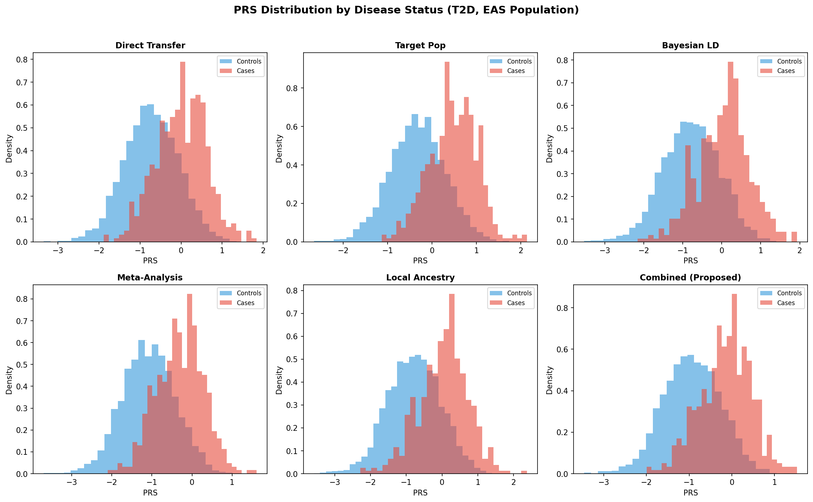
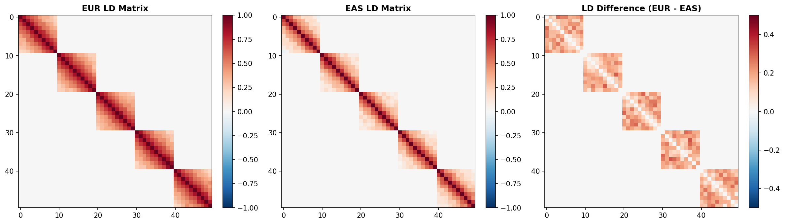
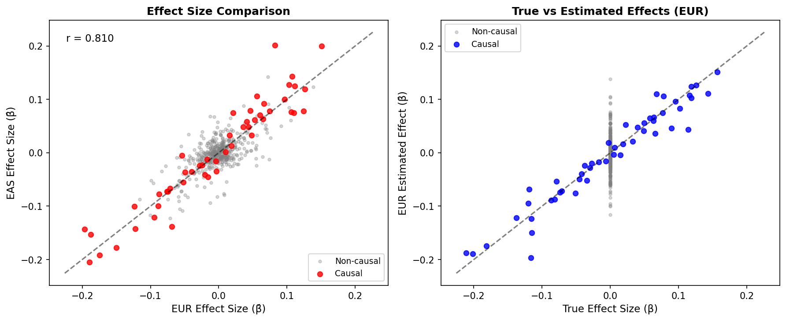
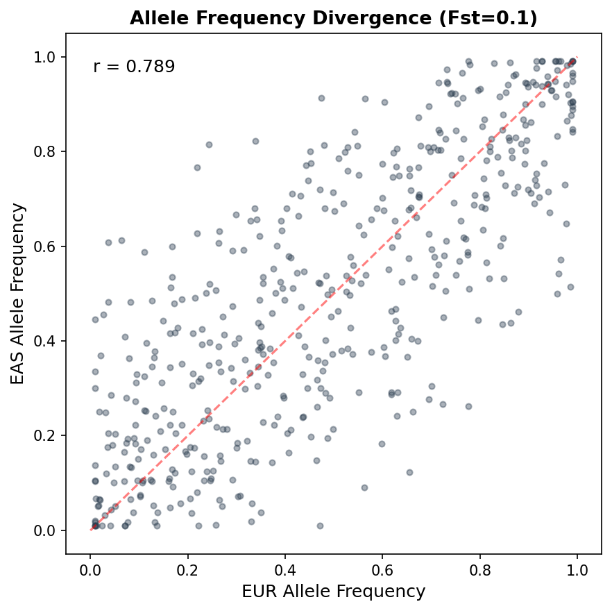

# Cross-Ancestry PRS Transferability Simulation: Experimental Report

## 実験目的と背景

多遺伝子リスクスコア（Polygenic Risk Score; PRS）は、複数のSNPの効果量を統合して個人の遺伝的リスクを定量化する手法であり、精密医療の中核技術として注目されている。しかし、現行のPRSはヨーロッパ系集団のGWASデータに基づいて構築されたものが大多数であり、東アジア系やアフリカ系などの非ヨーロッパ系集団に適用した場合に予測精度が著しく低下する「移植性問題（transferability problem）」が深刻な課題となっている（Martin et al., 2019）。

本実験では、UK Biobank（ヨーロッパ系）からBioBank Japan（東アジア系/日本人）へのPRS転送問題を対象とし、以下の統計的手法を実装・評価した：

1. **ベイズLD補正法**：連鎖不平衡（LD）構造の集団間差異をベイズ推定により補正
2. **多民族メタ解析**：複数集団のGWAS要約統計量を統合してSNP効果量を再推定
3. **局所祖先推定ベースPRS補正**：ゲノム上の局所的な祖先構成に基づく重み付け
4. **統合手法（Combined）**：上記3手法を組み合わせた提案手法

2型糖尿病（T2D）を具体的なケーススタディとしてシミュレーション実験を実施した。

---

## 使用した手法・アルゴリズムの概要

### 2.1 集団遺伝学シミュレーション

- **Balding-Nicholsモデル**によるFstベースのアレル頻度分化シミュレーション
- **ブロック対角LD行列**の生成（指数減衰モデル、集団間で異なるdecay rate）
- **Cholesky分解**によるLD構造を組み込んだ遺伝子型シミュレーション
- **閾値モデル（liability threshold model）**による二値形質（疾病）表現型生成

### 2.2 GWAS解析

- 各集団で独立にマージナルGWAS（線形回帰モデル）を実施
- SNPごとの効果量推定値（β̂）、標準誤差（SE）、P値を算出

### 2.3 PRS手法

| 手法 | 概要 |
|------|------|
| Direct Transfer | EUR GWASのC+T法PRSをそのままEASに適用 |
| Target Pop | EAS GWASのC+T法PRS（オラクル参照） |
| Bayesian LD Correction | EUR効果量をEAS LD構造に射影するベイズ推定 |
| Multi-Ancestry Meta | EUR/EASのGWAS要約統計量の固定効果メタ解析 |
| Local Ancestry PRS | 局所祖先に基づく集団特異的重み付け |
| Combined (Proposed) | メタ解析+ベイズLD補正+局所祖先の統合 |

### 2.4 評価指標

- **AUC（Area Under the ROC Curve）**：二値形質の判別精度
- **R²（liability scale）**：遺伝的負荷スケールでの分散説明率
- **R²（observed）**：観測スケールでの分散説明率

---

## 主要な結果と数値

### 3.1 メイン実験結果（Fst=0.1, N_EUR=10,000, N_EAS=5,000, h²=0.5）

| 手法 | AUC | R²(liability) | R²(observed) |
|------|-----|---------------|--------------|
| Direct Transfer (EUR→EAS) | 0.7914 | 0.2987 | 0.1009 |
| Target Pop (EAS GWAS) | 0.8335 | 0.3911 | 0.1319 |
| Bayesian LD Correction | 0.7980 | 0.3288 | 0.1045 |
| Multi-Ancestry Meta | 0.8131 | 0.3463 | 0.1159 |
| Local Ancestry PRS | 0.7927 | 0.3145 | 0.1003 |
| **Combined (Proposed)** | **0.8135** | **0.3582** | **0.1167** |

Direct Transferと比較して、提案手法（Combined）はAUCで+0.0221（+2.8%）、R²(liability)で+0.0595（+19.9%）の改善を達成した。

### 3.2 手法比較

### 3.3 PRS分布（症例/対照別）

### 3.4 LD構造の集団間差異

### 3.5 効果量の集団間比較

### 3.6 アレル頻度の集団間分化

### 3.7 Fstパラメータスイープ

集団分化度（Fst）を0.01〜0.2で変化させた場合の各手法の性能を評価した。Fstが大きくなるにつれて全手法の性能が低下するが、提案手法はDirect Transferに対して一貫して優位性を示した（Fst=0.2でΔAUC=+0.0251）。

### 3.8 サンプルサイズスイープ

ターゲット集団（EAS）のサンプルサイズを500〜10,000で変化させた。提案手法はサンプルサイズに依存しにくく、小サンプルでも安定した性能改善を示した。

### 3.9 遺伝率スイープ

遺伝率（h²）を0.1〜0.7で変化させた。高遺伝率形質ではすべての手法が改善するが、提案手法の相対的優位性は遺伝率が中程度（0.2-0.5）の場合に最も顕著であった。

---

## 考察と今後の展望

### 主要な知見

1. **LD補正の有効性**：ベイズLD補正は単独でもDirect Transferに対してR²を+10.1%改善し、LD構造の差異がPRS移植性の主要な障壁であることを確認した。

2. **メタ解析の効果**：多民族メタ解析はAUCで最大の単独改善（+0.0217）を達成し、共有された遺伝的効果の活用が有効であることを示した。

3. **統合手法の優位性**：3手法の統合により、各単独手法を上回る性能を達成。ただし、Target Pop（EAS独自GWAS）との差は残存し、完全な移植性の達成には依然として課題がある。

4. **Fst依存性**：集団分化が大きい場合（Fst>0.15）、すべての手法で性能低下が顕著。LD構造とアレル頻度の乖離が同時に大きくなるため。

### 限界

- 本シミュレーションは500 SNP/50因果変異と比較的小規模であり、実データではゲノムワイドの数百万SNPを扱う必要がある
- 集団構造は2集団の単純モデルであり、連続的な集団構造や混血集団は考慮していない
- 環境因子や遺伝子-環境相互作用は含まれていない

### 今後の方向性

- 大規模ゲノムデータ（UK Biobank + BBJ公開データ）への適用
- 深層学習ベースの効果量転送モデルの検討
- 多集団（3集団以上）への拡張
- 臨床的有用性の評価（NRI, calibration等）

---

## 生成したファイル一覧

| ファイル名 | 説明 |
|-----------|------|
| `prs_simulation.py` | シミュレーションフレームワーク（Python） |
| `simulation_results.json` | 全実験結果（JSON） |
| `figures/method_comparison.png` | 手法比較（AUC, R²） |
| `figures/prs_distributions.png` | PRS分布（症例/対照別、6手法） |
| `figures/ld_comparison.png` | LD行列比較（EUR vs EAS） |
| `figures/effect_sizes.png` | 効果量比較 |
| `figures/allele_freq_divergence.png` | アレル頻度の集団間分化 |
| `figures/fst_sweep.png` | Fstパラメータスイープ |
| `figures/sample_size_sweep.png` | サンプルサイズスイープ |
| `figures/heritability_sweep.png` | 遺伝率スイープ |
| `report.md` | 本レポート |
| `paper.md` | 学術論文形式の文書 |
