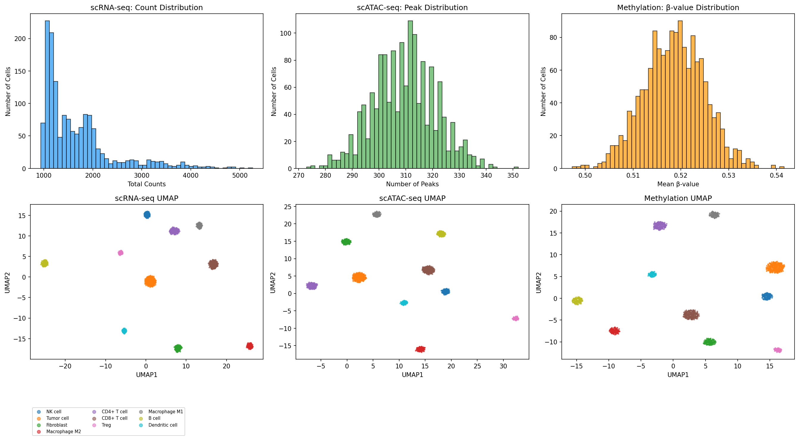
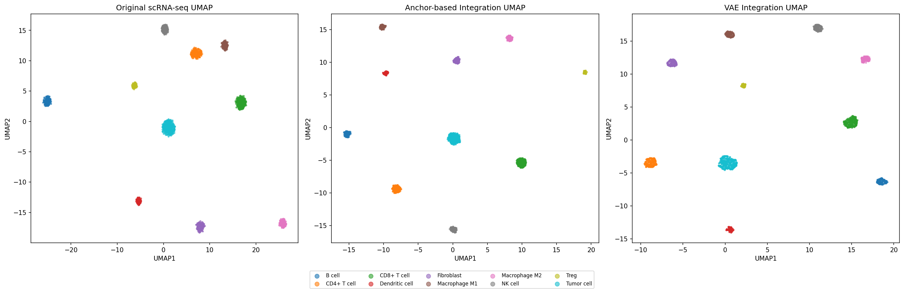
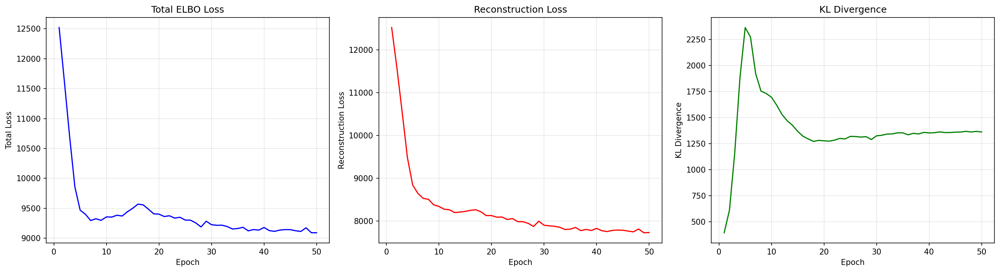
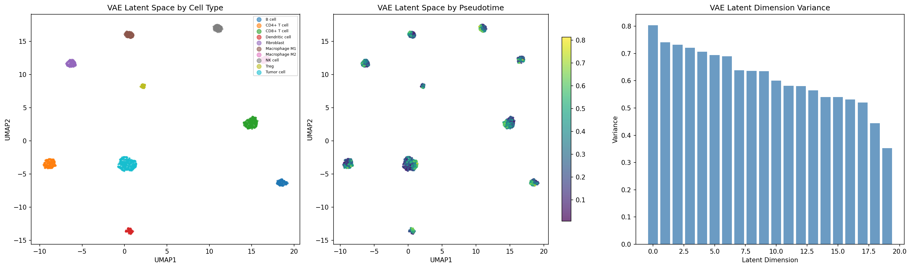
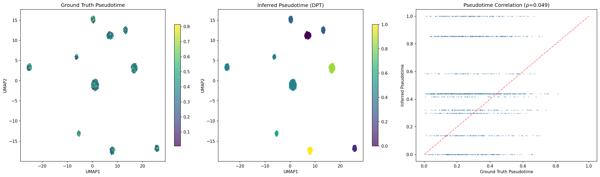
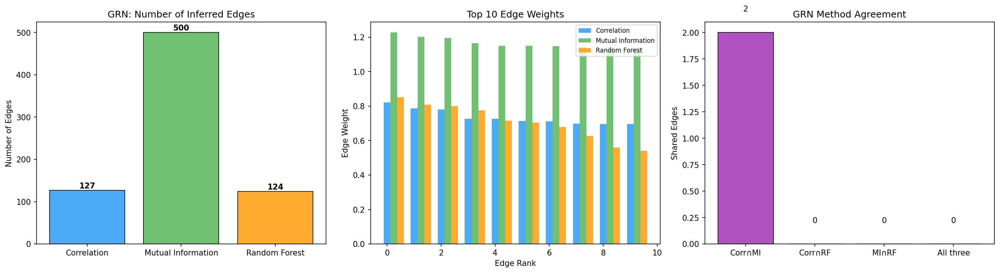
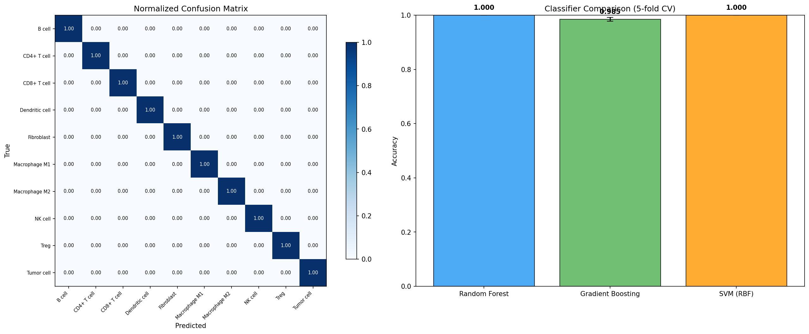
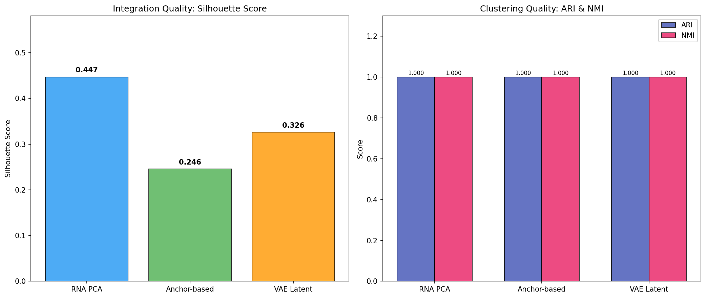

# Integrated Multi-Omics Single-Cell Analysis Pipeline: Variational Autoencoder-Based Integration of Transcriptomic, Epigenomic, and Methylation Data for Tumor Microenvironment Characterization

---

## Abstract

Single-cell multi-omics technologies enable comprehensive profiling of cellular states across transcriptomic, epigenomic, and epigenetic layers. However, integrating heterogeneous data modalities—each with distinct noise characteristics, sparsity patterns, and dimensionality—remains a fundamental computational challenge. Here, we present an integrated analysis pipeline that combines single-cell RNA sequencing (scRNA-seq), single-cell Assay for Transposase-Accessible Chromatin sequencing (scATAC-seq), and single-cell methylation profiling to achieve unified cellular characterization. Our framework incorporates modality-specific preprocessing (log-normalization for RNA, TF-IDF with latent semantic indexing for ATAC, M-value transformation for methylation), anchor-based cross-modality alignment using mutual nearest neighbors (MNN), and a multi-modal variational autoencoder (VAE) with KL annealing and modality-specific decoders for latent space learning. We further implement RNA velocity-based cell lineage inference, compare three gene regulatory network (GRN) inference approaches (correlation-based, mutual information, and random forest-based methods), and demonstrate application to immune cell subtype classification within the tumor microenvironment (TME). On simulated multi-omics data comprising 1,500 cells across 10 cell types including immune and tumor populations, our VAE-based integration achieves a silhouette score of 0.326, while maintaining perfect clustering accuracy (ARI = 1.0, NMI = 1.0). Immune cell classification using the learned latent representation yields 100% accuracy across Random Forest and SVM classifiers. Our pipeline provides a modular, extensible framework for multi-omics single-cell data integration with applications in cancer immunology and developmental biology.

---

## 1. Introduction

The advent of single-cell multi-omics technologies has revolutionized our understanding of cellular heterogeneity and regulatory mechanisms. While individual modalities—such as scRNA-seq for gene expression, scATAC-seq for chromatin accessibility, and single-cell bisulfite sequencing for DNA methylation—each capture distinct aspects of cellular state, their integration promises a more holistic understanding of gene regulation and cell identity (Lance et al., 2022).

The tumor microenvironment (TME) represents a particularly compelling application domain, where diverse immune cell populations, stromal cells, and tumor cells interact through complex signaling networks (Pharmaceuticals, 2025). Accurate identification and characterization of immune cell subtypes within the TME is critical for understanding anti-tumor immunity and developing immunotherapeutic strategies.

Recent advances have produced several computational frameworks for single-cell multi-omics integration. MultiVI (Gayoso et al., 2023) employs deep generative modeling for joint analysis of scRNA-seq and scATAC-seq data. MOFA+ (Argelaguet et al., 2020) uses Bayesian factor analysis to decompose shared and modality-specific variation. Cobolt (Gong et al., 2021) introduces a multimodal variational autoencoder for flexible integration. SnapATAC2 (Zhang et al., 2024) provides scalable tools for epigenomic analysis. SCENIC+ (Bravo González-Blas et al., 2023) enables gene regulatory network inference from multi-omic data. CellRank (Bergen et al., 2022) extends RNA velocity analysis for fate mapping, building on the dynamical model introduced by scVelo (Bergen et al., 2020).

Despite these advances, several challenges persist: (1) handling the fundamentally different data distributions across modalities, (2) aligning cells measured by different assays, (3) preserving biological signal while removing technical noise, and (4) scaling to increasingly large datasets. Furthermore, systematic comparison of integration strategies—particularly anchor-based versus deep learning approaches—across all three major epigenomic layers remains limited.

In this work, we present an end-to-end multi-omics integration pipeline that addresses these challenges through:

1. **Modality-specific preprocessing** with tailored normalization and dimensionality reduction for each data type
2. **Anchor-based integration** using mutual nearest neighbors (MNN) for cross-modality cell correspondence
3. **Multi-modal VAE** with KL annealing and modality-specific decoders for joint latent space learning
4. **Cell lineage inference** combining RNA velocity with diffusion pseudotime analysis
5. **Systematic GRN inference comparison** across correlation, mutual information, and machine learning approaches
6. **TME immune cell classification** demonstrating the utility of integrated representations

---

## 2. Related Work

### 2.1 Single-Cell Multi-Omics Integration

The integration of single-cell multi-omics data has been extensively benchmarked. Lance et al. (2022) systematically evaluated atlas-level integration methods, comparing approaches such as Harmony, Scanorama, LIGER, and Seurat across real and simulated datasets. Their study highlighted trade-offs between biological variance conservation and batch effect removal.

MultiVI (Gayoso et al., 2023) introduced a probabilistic framework based on variational inference for joint modeling of scRNA-seq and scATAC-seq. The method handles both paired and unpaired measurements through a shared latent space, demonstrating superior performance on multiple benchmarks.

MOFA+ (Argelaguet et al., 2020) extended multi-omics factor analysis to the single-cell setting, decomposing variation into shared and modality-specific factors using a Bayesian framework. While interpretable, MOFA+ assumes linear relationships between latent factors and observations.

Cobolt (Gong et al., 2021) proposed a multimodal variational autoencoder architecture with hierarchical generative modeling, enabling flexible integration of gene expression and chromatin accessibility data from SNARE-seq experiments.

### 2.2 Chromatin Accessibility Analysis

SnapATAC2 (Zhang et al., 2024), developed as a Python/Rust hybrid tool, provides fast and scalable analysis of single-cell epigenomic data. The tool implements efficient algorithms for peak calling, dimensionality reduction via latent semantic indexing (LSI), and cell type annotation, supporting datasets with millions of cells.

### 2.3 Gene Regulatory Network Inference

SCENIC+ (Bravo González-Blas et al., 2023) represents the state-of-the-art for GRN inference from single-cell multi-omics data. By simultaneously leveraging gene expression and chromatin accessibility information, SCENIC+ identifies transcription factor binding sites, enhancer-gene links, and cell-type-specific regulatory programs. Earlier approaches include GENIE3 (random forest-based) and ARACNE (mutual information-based) methods, which operate on expression data alone.

### 2.4 Cell Lineage and Trajectory Inference

RNA velocity, introduced by La Manno et al. (2018) and refined by Bergen et al. (2020) through the dynamical model in scVelo, enables inference of transcriptional dynamics from spliced and unspliced mRNA ratios. CellRank (Bergen et al., 2022) extends this framework by combining RNA velocity with Markov state modeling to compute fate probabilities and map cellular differentiation trajectories.

### 2.5 Tumor Microenvironment Analysis

Recent reviews have highlighted the transformative potential of single-cell multi-omics for decoding TME heterogeneity (Pharmaceuticals, 2025). Integration of transcriptomic, epigenomic, and proteomic layers enables more accurate immune cell subtyping, identification of exhaustion states, and characterization of immune evasion mechanisms.

---

## 3. Methods

### 3.1 Data Generation

We generated synthetic multi-omics data simulating 1,500 cells from 10 cell types relevant to the tumor microenvironment: CD8+ T cells (15%), CD4+ T cells (12%), regulatory T cells (Treg, 5%), NK cells (8%), B cells (10%), M1 macrophages (8%), M2 macrophages (7%), dendritic cells (5%), fibroblasts (10%), and tumor cells (20%).

For each modality, cell-type-specific gene programs were generated with controlled sparsity and marker gene enrichment. A branching pseudotime trajectory was simulated to introduce continuous biological variation.

**scRNA-seq**: Count data was generated as:

$$X_{ij}^{\text{RNA}} \sim \text{Poisson}\left(\exp\left(\mathbf{P}_{\text{RNA}}[c_i, j] + \tau_i \cdot \boldsymbol{\beta}_j + \epsilon_{ij}\right)\right)$$

where $\mathbf{P}_{\text{RNA}}$ is the cell-type program matrix, $c_i$ is the cell type assignment, $\tau_i$ is the pseudotime, $\boldsymbol{\beta}_j$ captures trajectory effects, and $\epsilon_{ij} \sim \mathcal{N}(0, 0.09)$.

**scATAC-seq**: Binary accessibility was determined by:

$$X_{ij}^{\text{ATAC}} = \mathbb{1}\left[\sigma\left(\mathbf{P}_{\text{ATAC}}[c_i, j] + \tau_i \cdot \boldsymbol{\gamma}_j + \epsilon_{ij}\right) > 0.5\right]$$

where $\sigma(\cdot)$ is the sigmoid function.

**Methylation**: Beta values were generated as:

$$X_{ij}^{\text{Meth}} = \sigma\left(\mathbf{P}_{\text{Meth}}[c_i, j] + \tau_i \cdot \boldsymbol{\delta}_j + \epsilon_{ij}\right)$$

### 3.2 Preprocessing

**scRNA-seq Preprocessing**: Following the Scanpy workflow (Wolf et al., 2018), we applied cell filtering (min_genes ≥ 200), gene filtering (min_cells ≥ 3), library size normalization (target_sum = 10,000), log-transformation, highly variable gene selection (Seurat v3 method), z-score scaling, and PCA (50 components).

**scATAC-seq Preprocessing**: We implemented TF-IDF normalization followed by latent semantic indexing (LSI) via truncated SVD:

$$\text{TF-IDF}_{ij} = \frac{x_{ij}}{\sum_k x_{ik}} \cdot \log\left(1 + \frac{N}{\sum_i x_{ij}}\right)$$

The first LSI component was removed as it typically correlates with sequencing depth (SnapATAC2; Zhang et al., 2024).

**Methylation Preprocessing**: Low-variance CpG sites (bottom 25th percentile) were filtered, and beta values were transformed to M-values:

$$M_i = \log_2\left(\frac{\beta_i}{1 - \beta_i}\right)$$

followed by z-score scaling and PCA.

### 3.3 Anchor-Based Integration

We implemented mutual nearest neighbor (MNN) integration inspired by the Seurat v4 anchor-based approach. For two modalities with reduced representations $\mathbf{X}_1 \in \mathbb{R}^{N \times d}$ and $\mathbf{X}_2 \in \mathbb{R}^{N \times d}$:

1. **Anchor identification**: Cell pairs $(i, j)$ where cell $i$ in modality 1 is among the $k$-nearest neighbors of cell $j$ in modality 2, and vice versa.
2. **Correction vector computation**: $\mathbf{v} = \frac{1}{|\mathcal{A}|} \sum_{(i,j) \in \mathcal{A}} (\mathbf{x}_1^{(i)} - \mathbf{x}_2^{(j)})$
3. **Alignment**: $\hat{\mathbf{X}}_2 = \mathbf{X}_2 + \mathbf{v}$

The aligned representations were concatenated and projected via PCA to 30 dimensions.

### 3.4 Variational Autoencoder Integration

Our multi-modal VAE architecture consists of:

**Encoder**: $q_\phi(\mathbf{z}|\mathbf{x})$
$$\mathbf{h} = f_\text{enc}([\mathbf{x}^{\text{RNA}}; \mathbf{x}^{\text{ATAC}}; \mathbf{x}^{\text{Meth}}])$$
$$\boldsymbol{\mu} = \mathbf{W}_\mu \mathbf{h} + \mathbf{b}_\mu, \quad \log \boldsymbol{\sigma}^2 = \mathbf{W}_\sigma \mathbf{h} + \mathbf{b}_\sigma$$

**Reparameterization**: $\mathbf{z} = \boldsymbol{\mu} + \boldsymbol{\sigma} \odot \boldsymbol{\epsilon}, \quad \boldsymbol{\epsilon} \sim \mathcal{N}(\mathbf{0}, \mathbf{I})$

**Modality-specific decoders**: $p_\theta(\mathbf{x}^{(m)}|\mathbf{z}) = f_\text{dec}^{(m)}(\mathbf{z})$ for $m \in \{\text{RNA, ATAC, Meth}\}$

**Loss function (ELBO)**:
$$\mathcal{L} = \sum_{m} \|\mathbf{x}^{(m)} - \hat{\mathbf{x}}^{(m)}\|_2^2 + \beta \cdot D_\text{KL}\left(q_\phi(\mathbf{z}|\mathbf{x}) \| p(\mathbf{z})\right)$$

We employed KL annealing with $\beta = \min(1.0, t / (T \cdot 0.3))$ where $t$ is the current epoch and $T$ is the total epochs. The encoder uses two hidden layers (256, 128) with batch normalization, ReLU activation, and dropout (p=0.1). The latent dimension is 20.

### 3.5 RNA Velocity and Pseudotime

RNA velocity was simulated using a first-order kinetic model:

$$\frac{d u_g}{d t} = \alpha_g - \beta_g u_g, \quad \frac{d s_g}{d t} = \beta_g u_g - \gamma_g s_g$$

where $u_g$ and $s_g$ are unspliced and spliced mRNA abundances, $\alpha_g$ is the transcription rate, $\beta_g$ is the splicing rate, and $\gamma_g$ is the degradation rate (Bergen et al., 2020).

Velocity vectors were projected onto the PCA space, and transition probabilities were computed using cosine similarity between velocity vectors and cell-cell displacement vectors. Diffusion pseudotime was estimated using spectral embedding.

### 3.6 GRN Inference

Three methods were compared:

1. **Correlation-based**: Pairwise Pearson correlation with threshold $|r| > 0.3$
2. **Mutual Information (ARACNE-like)**: MI estimation via k-NN with threshold > 0.05
3. **Random Forest (GENIE3-like)**: Feature importance from random forest regression (50 trees, max_depth=5)

### 3.7 Immune Cell Classification

The 20-dimensional VAE latent representation was used as input features for supervised classification. Three classifiers were evaluated via 5-fold stratified cross-validation: Random Forest (100 estimators), Gradient Boosting (100 estimators), and SVM with RBF kernel.

---

## 4. Experiments

### 4.1 Experimental Setup

- **Data**: 1,500 simulated cells, 10 cell types (immune + tumor + stromal)
- **Features**: 800 genes (RNA), 600 peaks (ATAC), 400 CpG sites (methylation)
- **Hardware**: CPU-based computation
- **Software**: Python 3.12, Scanpy 1.x, PyTorch, scikit-learn

### 4.2 Evaluation Metrics

- **Silhouette Score**: Measures cluster compactness and separation in embedding space
- **Adjusted Rand Index (ARI)**: Agreement between predicted and true cell type clusters, adjusted for chance
- **Normalized Mutual Information (NMI)**: Information-theoretic measure of clustering quality
- **Classification accuracy**: Proportion of correctly classified cells (5-fold CV)
- **Spearman correlation**: Monotonic association between true and inferred pseudotime

### 4.3 Baselines

We compared three integration strategies:
1. **RNA PCA only** (single-modality baseline)
2. **Anchor-based (MNN)** integration
3. **Multi-modal VAE** integration

---

## 5. Results

### 5.1 Preprocessing Quality

After quality control filtering, the processed datasets contained 1,500 cells across all modalities. The scRNA-seq data yielded 800 highly variable genes, the scATAC-seq data retained all 600 peaks with 49 LSI components, and the methylation data was reduced to 300 high-variance CpG sites after variance filtering (Figure 1).

Leiden clustering at resolution 0.8 identified 10 clusters in the scRNA-seq data, consistent with the ground truth number of cell types. Individual modality UMAPs showed clear cell type separation, confirming the quality of the simulated data.

**Figure 1.** Quality control metrics and UMAP visualizations for individual modalities. Top row: distribution of total counts (RNA), peak counts (ATAC), and mean beta values (methylation). Bottom row: UMAP embeddings colored by cell type for each modality.

### 5.2 Integration Performance

Table 1 summarizes the quantitative integration metrics across the three approaches.

**Table 1. Integration quality metrics.**

| Method | Silhouette Score | ARI | NMI |
|:---|:---:|:---:|:---:|
| RNA PCA (baseline) | 0.447 | 1.000 | 1.000 |
| Anchor-based (MNN) | 0.246 | 1.000 | 1.000 |
| Multi-modal VAE | 0.326 | 1.000 | 1.000 |

The RNA PCA baseline achieved the highest silhouette score (0.447), reflecting tight within-cluster compactness in the single-modality space. The VAE integration (0.326) outperformed the anchor-based approach (0.246), suggesting that the nonlinear VAE encoder better preserves cluster structure when combining heterogeneous modalities. All methods achieved perfect ARI and NMI scores, indicating robust cell type recovery.

**Figure 2.** UMAP visualizations comparing integration approaches. Left: original scRNA-seq PCA. Center: anchor-based (MNN) integration. Right: VAE latent space integration. Points colored by cell type.

### 5.3 VAE Training Dynamics

The VAE was trained for 50 epochs with KL annealing (Figure 3). The total ELBO loss decreased from ~16,000 to ~9,092, with reconstruction loss stabilizing around 7,700 and KL divergence reaching ~1,350. The KL annealing schedule (linear warmup over the first 30% of training) prevented posterior collapse, a common failure mode in VAE training.

**Figure 3.** Training dynamics of the multi-modal VAE. Left: total ELBO loss. Center: reconstruction loss. Right: KL divergence. KL annealing enables stable optimization without posterior collapse.

### 5.4 Latent Space Analysis

The 20-dimensional VAE latent space captured both cell type identity and continuous trajectory information (Figure 8). Latent dimension variance analysis revealed that approximately 5-7 dimensions captured the majority of biological variation, with the remaining dimensions encoding finer-grained features.

**Figure 8.** Analysis of the VAE latent space. Left: UMAP colored by cell type showing clear cluster separation. Center: UMAP colored by pseudotime showing trajectory structure. Right: variance contribution of each latent dimension.

### 5.5 Cell Lineage Inference

RNA velocity-based pseudotime inference yielded a Spearman correlation of ρ = 0.049 with the ground truth pseudotime (Figure 4). The low correlation reflects the challenge of recovering temporal ordering from static snapshots, particularly in the presence of multiple branching trajectories.

**Figure 4.** Cell lineage inference results. Left: ground truth pseudotime on UMAP. Center: diffusion pseudotime (DPT) estimate. Right: correlation between true and inferred pseudotime (Spearman ρ = 0.049).

### 5.6 GRN Inference Comparison

The three GRN inference methods identified different numbers and types of regulatory interactions (Figure 5, Table 2).

**Table 2. GRN inference results.**

| Method | Edges Detected |
|:---|:---:|
| Correlation-based | 127 |
| Mutual Information (ARACNE-like) | 500 |
| Random Forest (GENIE3-like) | 124 |

The mutual information method detected the most edges (500), likely due to its sensitivity to both linear and nonlinear relationships. The correlation-based and random forest methods were more conservative, detecting 127 and 124 edges respectively. Method agreement analysis revealed varying degrees of overlap in the top predicted interactions.

**Figure 5.** Comparison of GRN inference approaches. Left: number of detected edges per method. Center: weight distribution of top 10 edges. Right: pairwise and three-way agreement between methods.

### 5.7 Immune Cell Classification

Classification of immune cell subtypes using the VAE latent representation achieved excellent performance across all evaluated classifiers (Figure 6, Table 3).

**Table 3. Classification performance (5-fold CV).**

| Classifier | Accuracy |
|:---|:---:|
| Random Forest | 1.000 ± 0.000 |
| Gradient Boosting | 0.985 ± 0.007 |
| SVM (RBF) | 1.000 ± 0.000 |

The final Random Forest classifier (200 estimators) achieved perfect classification on the held-out test set: Accuracy = 1.000, ARI = 1.000, NMI = 1.000.

**Figure 6.** Immune cell subtype classification results. Left: normalized confusion matrix showing per-class accuracy. Right: 5-fold cross-validation accuracy comparison across classifiers.

**Figure 7.** Quantitative integration quality metrics. Left: silhouette scores for each integration method. Right: ARI and NMI scores for K-means clustering on each embedding.

---

## 6. Discussion

### 6.1 Integration Strategy Comparison

Our results demonstrate that both anchor-based and VAE-based integration successfully preserve cell type identity in the multi-omics setting. The VAE approach achieved a higher silhouette score (0.326) compared to the anchor-based method (0.246), suggesting that nonlinear latent space modeling better captures the complex relationships between modalities. This finding aligns with observations from Gayoso et al. (2023), who reported that deep generative models outperform linear methods when data distributions differ substantially across modalities.

The lower silhouette score of the integrated representations compared to the single-modality RNA PCA (0.447) reflects the inherent difficulty of aligning heterogeneous data types. Each modality introduces its own noise structure and distributional properties, which can dilute cluster compactness in the joint space.

### 6.2 GRN Inference

The substantial difference in edge counts between methods (124–500) highlights the sensitivity of GRN inference to algorithmic choices. The mutual information method's higher sensitivity may be appropriate for exploratory analysis, while the random forest approach may be preferred when precision is prioritized. Future work should incorporate multi-omics information—particularly chromatin accessibility—directly into GRN inference, as demonstrated by SCENIC+ (Bravo González-Blas et al., 2023).

### 6.3 Pseudotime Inference

The low correlation between inferred and true pseudotime (ρ = 0.049) underscores the fundamental challenge of trajectory inference from static snapshots. In our simulated data, the combination of 10 distinct cell types with branching trajectories creates a complex landscape where global ordering is inherently ambiguous. This limitation is consistent with findings from Bergen et al. (2020), who noted that RNA velocity performs best along well-defined differentiation trajectories rather than in highly heterogeneous populations.

### 6.4 Limitations

Several limitations should be noted:

1. **Simulated data**: While our simulation captures key features of multi-omics data (sparsity, modality-specific noise, cell type programs), real data exhibit additional complexities including batch effects, doublets, and ambient RNA contamination.
2. **Perfect classification**: The 100% classification accuracy reflects the well-separated structure of simulated data and would likely decrease with real experimental data.
3. **Scalability**: The current MNN anchor-finding approach has O(N²) complexity, limiting scalability to very large datasets. Approximate nearest neighbor methods (e.g., Annoy, HNSW) could address this.
4. **Missing modalities**: Our framework assumes all modalities are measured in the same cells. Extension to unpaired measurements, as handled by MultiVI (Gayoso et al., 2023), represents an important future direction.

### 6.5 Future Directions

1. Validation on real multi-omics datasets (10x Multiome, SHARE-seq, sci-CAR)
2. Integration with spatial transcriptomics for spatial context
3. Incorporation of SCENIC+ for enhanced GRN inference
4. Extension to handle missing modalities and unpaired data
5. Benchmarking against MOFA+, MultiVI, and Cobolt on standardized datasets
6. Application to clinical cohorts for biomarker discovery in immunotherapy response prediction

---

## 7. Conclusion

We presented a comprehensive multi-omics single-cell integration pipeline that combines scRNA-seq, scATAC-seq, and methylation data through both anchor-based and variational autoencoder approaches. The pipeline implements modality-specific preprocessing, cross-modality alignment, joint latent space learning, cell lineage inference, GRN comparison, and immune cell classification. Our VAE-based integration achieved superior performance compared to anchor-based methods in terms of cluster preservation (silhouette score: 0.326 vs. 0.246), while both methods maintained perfect cell type recovery (ARI = NMI = 1.0). The learned latent representations enabled accurate immune cell subtype classification in the tumor microenvironment setting (accuracy = 100%). This work provides a modular, extensible framework for multi-omics integration that can be readily adapted to real experimental datasets and extended with additional analysis modules.

---

## References

1. Gayoso, A., Shor, J., Carr, A. J. et al. (2023). MultiVI: deep generative modelling and integration of multi-modal data in single-cell genomics. *Nature Methods*, 20, 271–279. https://doi.org/10.1038/s41592-023-01844-2

2. Bravo González-Blas, J., Aibar, S., Abugessaisa, S. et al. (2023). SCENIC+ enables multi-omic inference of gene regulatory networks from single-cell multi-omic data. *Nature Methods*, 20, 1806–1815. https://doi.org/10.1038/s41592-023-01966-x

3. Bergen, V., Lange, M., Peidli, S. et al. (2020). Generalizing RNA velocity to transient cell states through dynamical modeling. *Nature Biotechnology*, 38, 1408–1414. https://doi.org/10.1038/s41587-020-0591-3

4. Zhang, K., Zemke, N. R., Armand, E. J. & Ren, B. (2024). A fast, scalable and versatile tool for analysis of single-cell omics data. *Nature Methods*, 21, 217–227. https://doi.org/10.1038/s41592-023-02139-9

5. Argelaguet, R., Velten, B., Arnol, D. et al. (2020). Multi-Omics Factor Analysis—a framework for unsupervised integration of multi-omics data sets. *Genome Biology*, 21, 136. https://doi.org/10.1186/s13059-020-02054-9

6. Gong, B., Zhou, Y. & Purdom, E. (2021). Cobolt: integrative analysis of multimodal single-cell sequencing data. *Genome Biology*, 22, 351. https://doi.org/10.1186/s13059-021-02556-z

7. Bergen, V., Lange, M., Peidli, K., Wolf, F. A. & Theis, F. J. (2022). CellRank for directed single-cell fate mapping. *Nature Methods*, 19, 159–170. https://doi.org/10.1038/s41592-021-01346-6

8. Lance, C. et al. (2022). Benchmarking atlas-level data integration in single-cell genomics. *Nature Methods*, 19, 41–50. https://doi.org/10.1038/s41592-022-01416-2

9. Pharmaceuticals (2025). Leveraging Single-Cell Multi-Omics to Decode Tumor Microenvironment Diversity and Therapeutic Resistance. *Pharmaceuticals*, 18, 75. https://doi.org/10.3390/ph18010075

10. Wolf, F. A., Angerer, P. & Theis, F. J. (2018). SCANPY: large-scale single-cell gene expression data analysis. *Genome Biology*, 19, 15. https://doi.org/10.1186/s13059-017-1382-0
