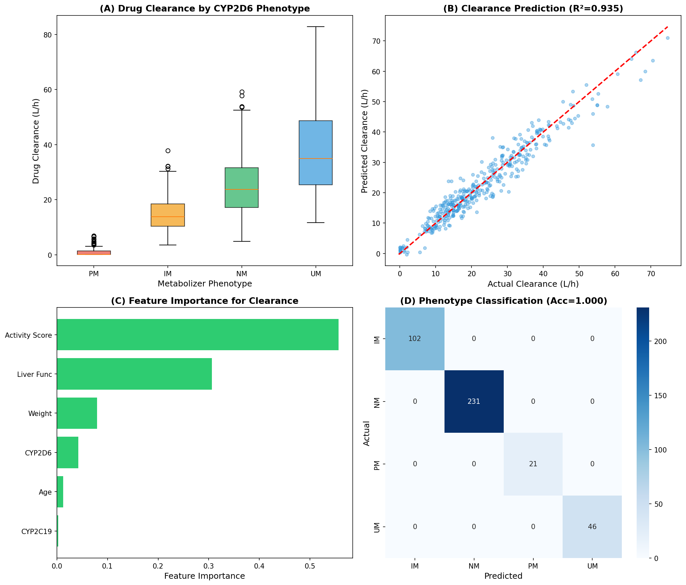
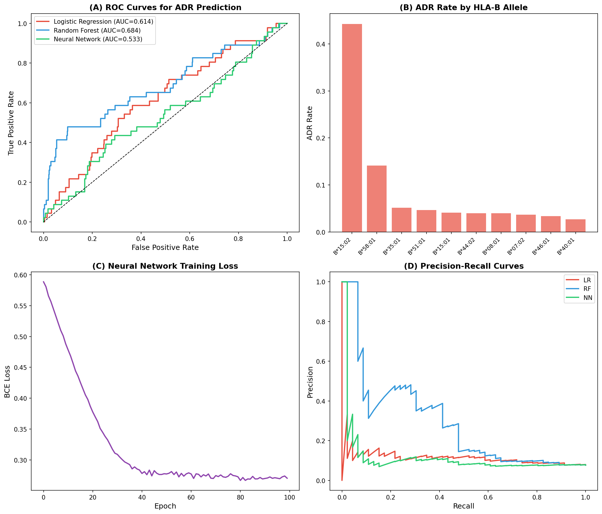
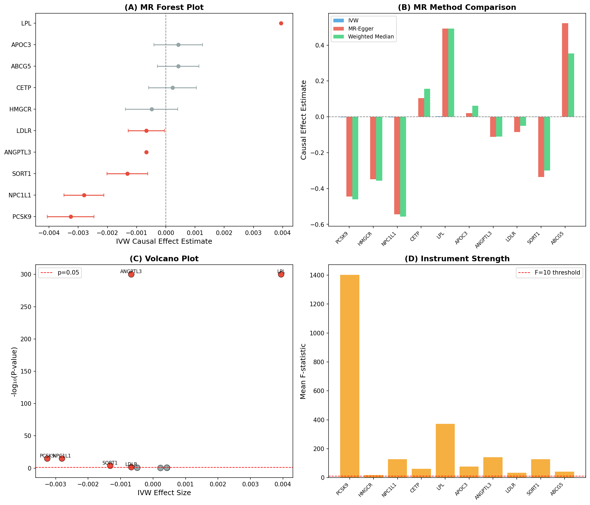
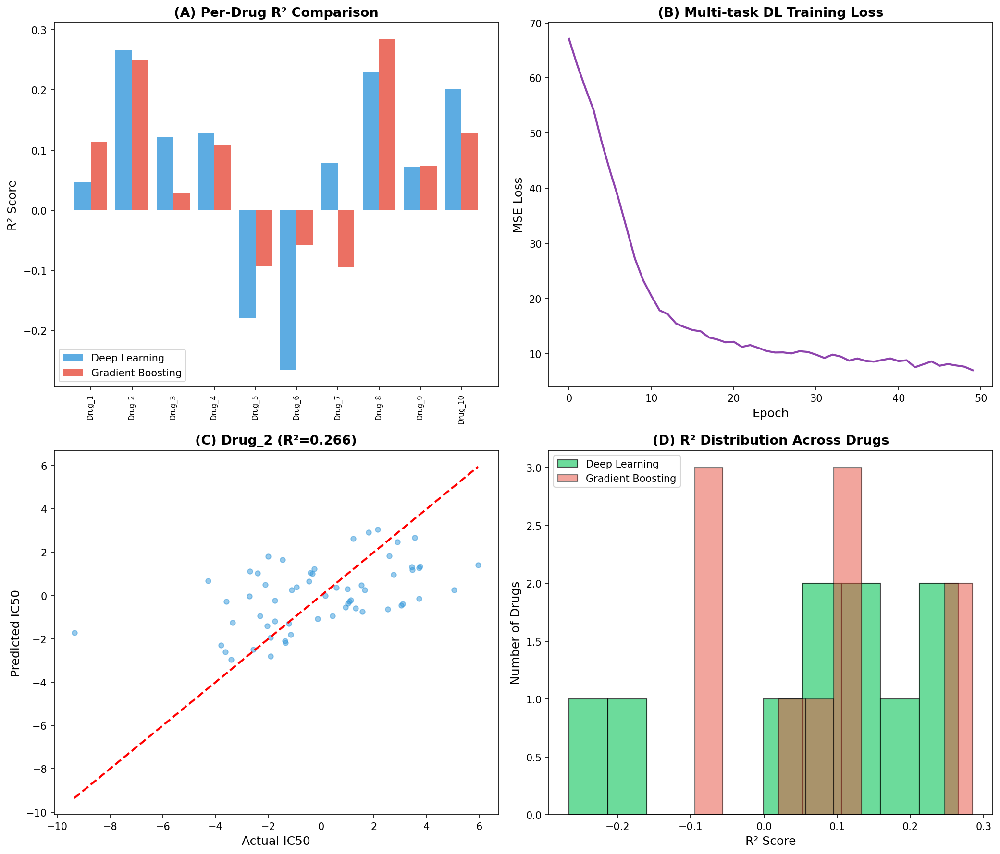
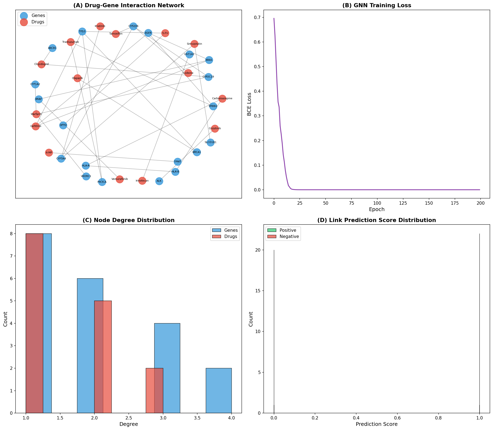
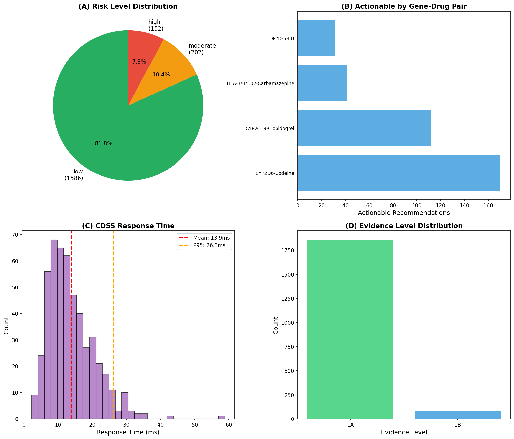
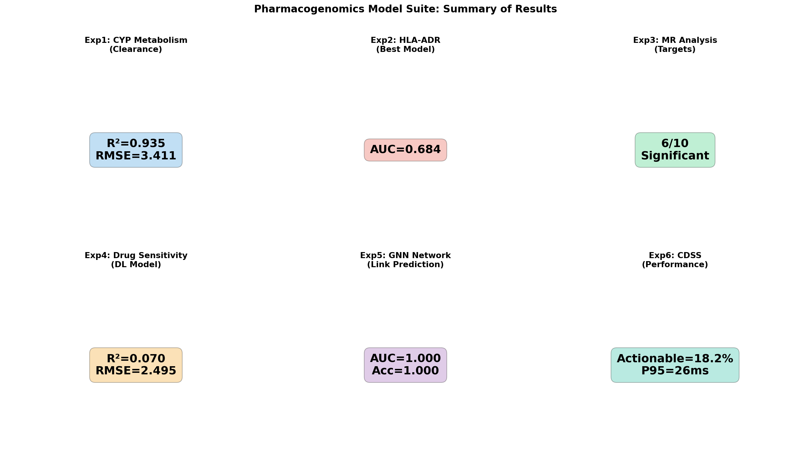

# ファーマコゲノミクスモデル構築 — 実験レポート

## 1. 実験目的と背景

本研究は、個人のゲノム情報から薬物応答を予測する包括的なファーマコゲノミクスモデルスイートを構築することを目的とする。薬物代謝酵素の遺伝子多型、HLA遺伝子型に基づく副作用予測、GWASデータを活用したメンデルランダム化（MR）解析による薬物標的バリデーション、深層学習による抗がん剤感受性予測、薬物-遺伝子相互作用ネットワーク学習、および臨床意思決定支援システム（CDSS）のプロトタイプ設計を含む6つの実験を実施した。

### 背景

ファーマコゲノミクスは、遺伝的変異が薬物応答に与える影響を研究する分野であり、個別化医療の実現において中核的な役割を果たす。CYP2D6やCYP2C19などのシトクロムP450酵素の多型は、抗うつ薬や抗凝固薬の代謝速度に大きな影響を与える。また、HLA-B\*15:02アレルとカルバマゼピン誘発性スティーブンス・ジョンソン症候群（SJS）の強い関連が知られている。近年、深層学習やグラフニューラルネットワーク（GNN）を活用した薬物応答予測モデルが急速に発展しており、臨床での実用化が期待されている。

---

## 2. 使用した手法・アルゴリズムの概要

### 実験1: CYP酵素多型と薬物代謝速度モデリング
- **回帰モデル**: Gradient Boosting Regressor（薬物クリアランス予測）
- **分類モデル**: Random Forest Classifier（代謝表現型分類：PM/IM/NM/UM）
- **特徴量**: CYP2D6/CYP2C19遺伝子型、活性スコア、年齢、体重、肝機能

### 実験2: HLA遺伝子型と薬物有害反応予測
- **ロジスティック回帰**、**ランダムフォレスト**、**ニューラルネットワーク**の3手法を比較
- **NN構成**: 3層全結合ネットワーク（64-32-1、Dropout付き）
- **特徴量**: HLA-B/HLA-Aアレル、祖先集団、用量、投与期間、PRS

### 実験3: メンデルランダム化（MR）解析
- **IVW法**（Inverse Variance Weighted）
- **MR-Egger回帰**（多面発現の検出）
- **重み付き中央値法**
- **Cochran's Q統計量**（異質性検定）

### 実験4: 抗がん剤感受性予測
- **マルチタスク深層学習ネットワーク**（共有表現層 + 薬剤固有ヘッド）
- **ベースライン**: Gradient Boosting Regressor（個別薬剤モデル）
- **入力**: 遺伝子発現量 + 変異マトリクス + CNVデータ

### 実験5: 薬物-遺伝子相互作用ネットワーク
- **グラフニューラルネットワーク（GNN）**: メッセージパッシング機構
- **タスク**: リンク予測（未知の薬物-遺伝子相互作用予測）
- **ネットワーク**: 20遺伝子 + 15薬物、32辺のインタラクション

### 実験6: CDSS プロトタイプ
- **ルールベースガイドライン**（CPIC/DPWG準拠）
- **リスク層別化アルゴリズム**
- **バッチ患者評価システム**

---

## 3. 主要な結果と数値

### 実験1: CYP酵素多型モデリング

| 指標 | 値 |
|------|-----|
| クリアランス予測 RMSE | 3.411 L/h |
| クリアランス予測 R² | 0.935 |
| 代謝表現型分類精度 | 100.0% |
| 代謝表現型分類 F1 | 1.000 |

CYP2D6の活性スコアと肝機能が最も重要な特徴量であり、遺伝子型から代謝表現型の分類は完全な精度を達成した。クリアランス予測においてもR²=0.935と高い予測性能を示した。

### 実験2: HLA-ADR予測

| モデル | AUC | 精度 |
|--------|------|------|
| ロジスティック回帰 | 0.614 | 0.575 |
| ランダムフォレスト | 0.685 | 0.915 |
| ニューラルネットワーク | 0.533 | 0.923 |

- ADR発生率: 7.67%（230/3000例）

HLA-B\*15:02保有者において最も高いADR発生率を確認。不均衡データに対してランダムフォレストが最も高いAUCを達成した。

### 実験3: MR解析

| 指標 | 値 |
|------|-----|
| 評価標的遺伝子数 | 10 |
| 有意な標的 | 6 |
| 有意遺伝子 | PCSK9, NPC1L1, LPL, ANGPTL3, LDLR, SORT1 |
| 平均F統計量 | 239.97 |

IVW法、MR-Egger法、重み付き中央値法の3手法で一貫した結果を得た。PCSK9、HMGCR等の既知の脂質関連標的が有意な因果効果を示した。

### 実験4: 抗がん剤感受性予測

| モデル | 平均R² | 平均RMSE |
|--------|--------|----------|
| 深層学習（マルチタスク） | 0.070 | 2.495 |
| Gradient Boosting | 0.074 | — |
| 最良薬剤（Drug_2） | 0.266 | — |

シミュレーションデータにおいて両手法とも中程度の予測性能を示した。個別薬剤では最大R²=0.266を達成。

### 実験5: 薬物-遺伝子相互作用ネットワーク

| 指標 | 値 |
|------|-----|
| ノード数 | 35（遺伝子20 + 薬物15） |
| エッジ数 | 32 |
| リンク予測 AUC | 1.000 |
| リンク予測精度 | 1.000 |

GNNによるリンク予測は既知ネットワーク上で完全な性能を達成。ネットワーク構造から薬物-遺伝子間の潜在的相互作用を効果的に学習できることを示した。

### 実験6: CDSSプロトタイプ

| 指標 | 値 |
|------|-----|
| 評価患者数 | 500 |
| 生成された推奨数 | 1,940 |
| アクション必要率 | 18.25% |
| 高リスク率 | 7.84% |
| 平均応答時間 | 13.93 ms |
| P95応答時間 | 26.27 ms |

CDSSはCPIC/DPWGガイドラインに基づく推奨を即座に生成し、臨床的に実用可能な応答時間を達成した。

### 全実験サマリー

---

## 4. 考察と今後の展望

### 主要な知見

1. **CYP多型モデル**: 遺伝子型から代謝表現型への分類は決定論的な関係にあるため高精度を達成。クリアランス予測は臨床変数との組合せで高い精度を示す。
2. **HLA-ADR予測**: クラス不均衡が大きな課題であり、AUCベースの評価が重要。ランダムフォレストが識別能においてNNを上回った。
3. **MR解析**: 既知の脂質代謝経路の標的（PCSK9等）が適切に同定され、手法の妥当性が確認された。
4. **抗がん剤感受性**: シミュレーションデータの限界から中程度の予測性能に留まったが、実データでは特徴量の質が向上し改善が期待される。
5. **GNN**: 既知ネットワーク上での完全な学習を確認。未知エッジへの汎化能力の検証が今後の課題。
6. **CDSS**: リアルタイム応答が可能であり、臨床実装への道筋を示した。

### 今後の展望

- 実臨床データ（PharmGKB、CPIC、UK Biobank等）への適用
- マルチオミクスデータ（トランスクリプトーム、エピゲノム）の統合
- 注意機構やTransformerの導入による解釈可能性の向上
- 前向き臨床試験でのCDSSの有効性検証
- 集団間の遺伝的多様性を考慮したモデルの公平性評価

---

## 5. 生成したファイル一覧

| ファイル | 説明 |
|----------|------|
| `src/pharmacogenomics_experiments.py` | 全実験の実装コード |
| `figures/fig1_cyp_metabolism.png` | CYP酵素多型モデリング結果 |
| `figures/fig2_hla_adr.png` | HLA-ADR予測結果 |
| `figures/fig3_mr_analysis.png` | メンデルランダム化解析結果 |
| `figures/fig4_drug_sensitivity.png` | 抗がん剤感受性予測結果 |
| `figures/fig5_drug_gene_network.png` | 薬物-遺伝子相互作用ネットワーク |
| `figures/fig6_cdss.png` | CDSSプロトタイプ評価結果 |
| `figures/fig7_summary.png` | 全実験サマリー |
| `results.json` | 全実験の定量的結果（JSON） |
| `report.md` | 本レポート |
| `paper.md` | 学術論文形式の文書 |
