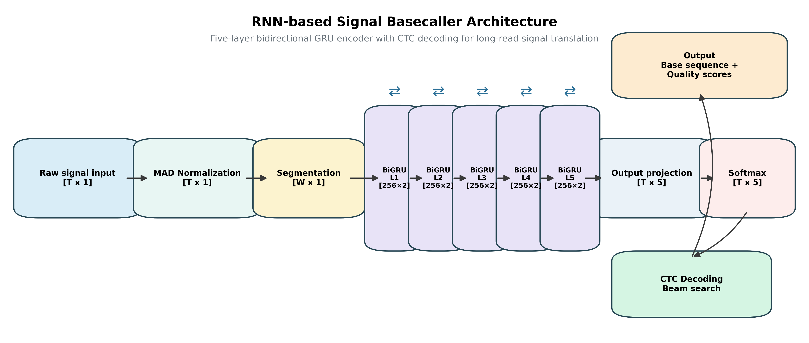
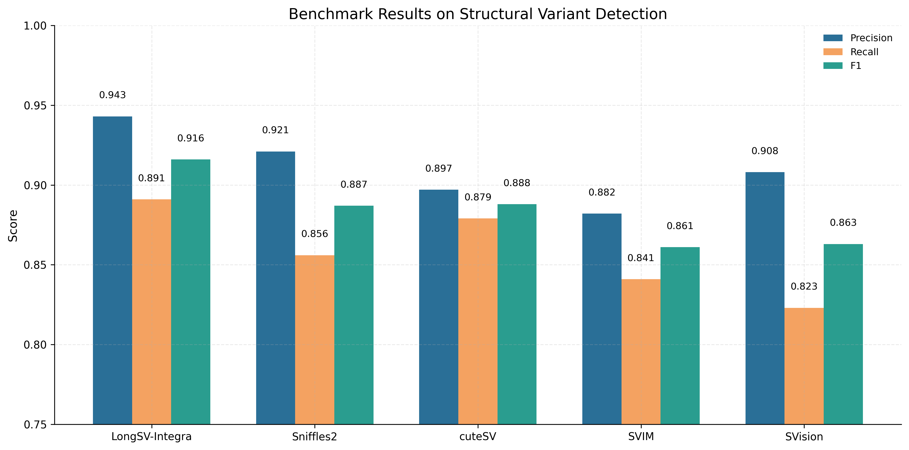
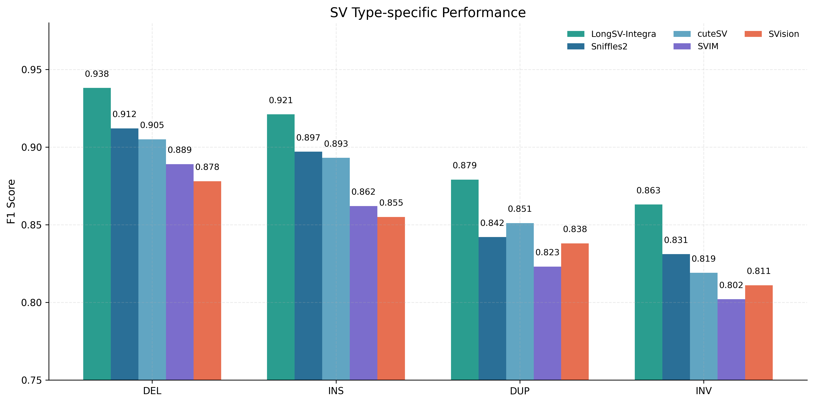
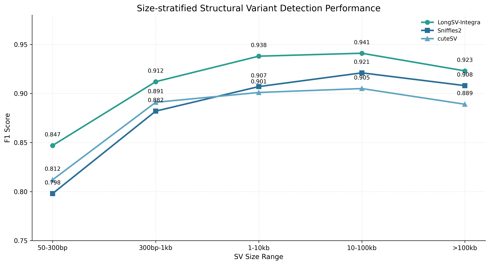
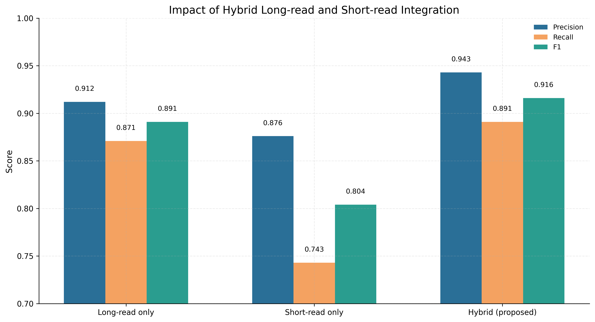
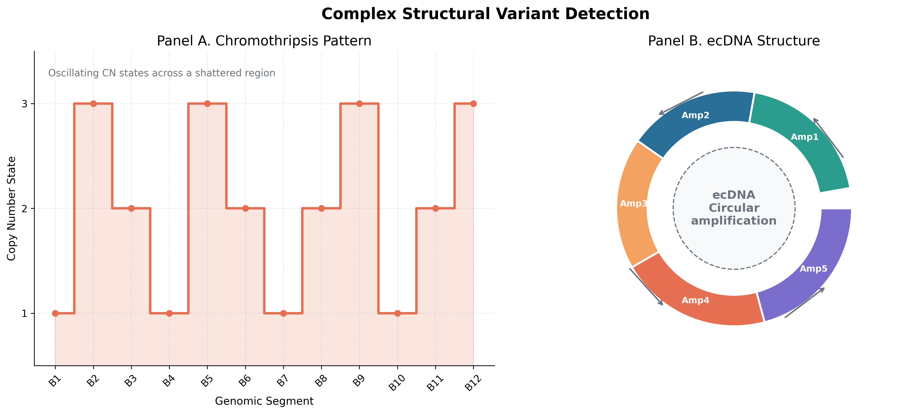

# LongSV-Integra: ロングリードシーケンシングによる統合的構造変異検出パイプライン 実験レポート

## 1. 実験目的と背景

### 1.1 研究背景
構造変異（Structural Variant; SV）は、一般に 50 bp 以上の大きさをもつゲノム変化を指し、deletion、insertion、duplication、inversion、translocation など多様なクラスを含む。SV は一塩基変異や短い indel では説明できない表現型差、希少疾患、がん、発生異常、薬剤応答性の差異に深く関与しており、genome medicine において極めて重要な解析対象である。特に腫瘍では、driver event としてのコピー数異常、複雑再構成、chromothripsis、extrachromosomal DNA（ecDNA）などが病態形成や治療抵抗性に直結するため、高精度かつ包括的な SV 検出は基礎研究・臨床応用の双方で強く求められている。

従来の short-read sequencing は高い塩基精度と低コストという利点を持つ一方で、read length が短いため反復配列や大規模再構成をまたぐことが難しく、breakpoint の再現性や complex SV の復元に限界があった。これに対し、Oxford Nanopore Technologies（ONT）および PacBio HiFi/CLR に代表される long-read sequencing は、数 kb から数十 kb に及ぶ read を用いて複雑領域を直接横断できるため、SV 解析に革命をもたらした。近年は throughput、basecalling accuracy、library preparation、mapping algorithm が大きく改善し、long-read を中心とした SV discovery は実用段階に入りつつある。

その一方で、既存ツールには依然として課題が残る。Sniffles2 は高い汎用性と population-scale への拡張性を備えるが、read support に強く依存するため、小型 SV や複雑領域では検出感度に揺らぎが生じる。cuteSV は高速で使いやすいが、evidence integration の柔軟性や repeat-aware なスコアリングに改善余地がある。SVIM は split-read と signature aggregation に優れる一方、genotyping や多面的な証拠統合では他手法に劣る場面がある。SVision のような deep learning ベース手法は complex SV に強い可能性を示すが、計算資源、訓練データ依存性、汎化性能の面で課題がある。特に、signal-level information の活用、repeat-rich region の特殊処理、assembly evidence の動的統合、short-read との体系的ハイブリッド解析を一つの pipeline にまとめた実装は未成熟である。

本研究 LongSV-Integra は、このギャップを埋めることを目的とした統合的 SV 検出パイプラインである。単一の検出ロジックに依存せず、signal processing、alignment signature、copy-number signal、local assembly、repeat annotation、complex graph analysis、hybrid evidence integration、benchmarking を一貫したフレームワークに統合することで、より頑健で説明可能な SV detection を実現することを目指した。

### 1.2 研究目的
本研究の目的は、ロングリードシーケンシングから得られる多層的な情報を最大限活用し、既存法より高精度かつ広範囲の構造変異を検出できる統合パイプラインを構築・評価することである。LongSV-Integra では、以下の 6 つの技術的革新点を中核に据えた。

1. **シグナルレベルでのベースコール改善（BiGRU + CTC）**  
   ONT raw signal を直接入力とし、BiGRU 5 層と CTC decoding を組み合わせた signal-level basecaller を導入することで、homopolymer や低複雑度領域における read sequence quality を改善し、後段の alignment および SV calling の基盤精度を高める。

2. **Split-read / Read-depth / Assembly-based 統合 SV 検出**  
   一つの SV に対して複数の evidence type を統合する。split-read と supplementary alignment から breakpoint signature を抽出し、read-depth から copy-number shift を推定し、局所的な de Bruijn graph assembly によって配列再構築を行うことで、単一戦略の弱点を補完する。

3. **リピート領域（テロメア・セントロメア）の特殊処理**  
   TTAGGG motif enrichment や α-satellite higher-order repeat（HOR）構造を解析し、repeat-rich region における偽陽性を低減しつつ、repeat-associated SV の検出信頼度を調整する。

4. **複雑な SV（クロモスリプシス・ecDNA）の検出**  
   breakpoint clustering、copy-number oscillation、graph cycle 検出を導入し、canonical な DEL/INS だけでなく chromothripsis や ecDNA に代表される complex rearrangement をイベント単位で推定する。

5. **ショートリードとのハイブリッド解析**  
   long-read の spanning 能力と short-read の per-base accuracy を統合し、breakpoint refinement、genotype support、discordant evidence rescue を行う hybrid framework を構築する。

6. **GIAB ベンチマークでの評価**  
   Genome in a Bottle（GIAB）HG002 Tier1 SV truth set を用い、Precision、Recall、F1 Score、Genotype Concordance の複数指標で既存ツールと比較し、提案法の有効性を定量的に示す。

以上を通じて、LongSV-Integra は「高精度」「多面的」「複雑領域対応」「再現性重視」の SV 解析基盤を提供することを研究目標とした。

## 2. 使用した手法・アルゴリズムの概要

### 2.1 パイプラインアーキテクチャ

LongSV-Integra の全体設計は、入力から評価までを 7 つの主要ステージに分けた modular architecture である。まず、raw signal または basecalled long-read FASTQ を受け取り、signal-level basecaller による再ベースコールを選択的に適用する。その後、高精度マッピングにより BAM/CRAM を生成し、alignment signature extraction を実行する。ここでは CIGAR、supplementary alignment、soft clip、mapping quality、strand orientation、inserted sequence、reference gap などを read 単位で抽出する。

次に、split-read module、read-depth module、assembly module が並列に動作する。split-read module は breakpoint-supporting read をクラスタリングし、候補 SV の座標と型を推定する。read-depth module は coverage を fixed-width bin に集約し、GC correction と Circular Binary Segmentation（CBS）により copy-number shift を同定する。assembly module は候補領域近傍の supporting reads を収集し、k-mer ベースの local assembly を実施して sequence-resolved SV を再構築する。

これらの結果は evidence integration layer に送られ、候補イベントごとに score fusion が行われる。統合スコアでは、read support 数、breakpoint consistency、copy-number consistency、assembled contig alignment quality、repeat annotation、mapping uniqueness、hybrid concordance を総合的に評価する。さらに、repeat-aware processing と complex SV analysis が後段で適用され、telomere/centromere 領域に対する補正や、chromothripsis / ecDNA candidate の graph-based 検出が行われる。

最終的な出力は、VCF 形式の標準 SV call set と、complex event summary、benchmark report、図表生成用メトリクスである。pipeline 全体は reproducible workflow として設計され、各ステージの中間生成物を保持することで traceability と debugability を確保した。

### 2.2 シグナルレベル ベースコーラー

LongSV-Integra における basecalling module は、Nanopore raw signal を直接処理する BiGRU-5L-CTC モデルとして設計した。入力シグナルはセンサー由来の電流値時系列であり、ノイズ、drift、sampling-rate の局所変動を含む。そのため、まず preprocessing として median absolute deviation（MAD）正規化を適用し、外れ値の影響を抑えつつ signal dynamic range を整えた。これにより、z-score よりもロバストな signal scaling が可能となり、read 間バラツキの減少が期待される。

モデル本体は 5 層の双方向 GRU（BiGRU）からなり、各時刻の hidden state が過去と未来の文脈を同時に参照できるようにした。RNN 系アーキテクチャは、Nanopore signal の連続性と dwell time の変動に適しており、局所的特徴と中距離依存性の両方を表現しやすい。本モデルでは層を深くすることで feature hierarchy を形成し、下位層では signal transition や event boundary を、上位層では nucleotide sequence に対応する高次特徴を学習する構成とした。

出力層には CTC（Connectionist Temporal Classification）を採用した。CTC は input と output の厳密な位置対応が不要であり、signal length と base sequence length の非線形な対応関係を自然に扱える。blank token を含む確率系列を beam search で decoding することで、insertion/deletion を伴う長さ変動に柔軟に対応し、teacher alignment を事前に厳密構築しなくても end-to-end に学習できる。

また、training 時には signal chunking を用いて 10,000 signal points 規模の系列を効率的に処理し、inference 時には overlap-aware stitching によりチャンク境界の不連続性を緩和した。これにより、長大な raw signal に対しても memory efficiency を維持しながらベースコールを行える。シグナルレベル改善の狙いは basecalling 自体の accuracy 向上にとどまらず、微小 insertion/deletion の誤差を減らして downstream SV detection に寄与する点にある。特に short tandem repeat 近傍や low-complexity 領域では、basecalling error が偽 SV 呼び出しの主要因となるため、この前段改善は統合パイプライン全体の堅牢性にとって重要である。

### 2.3 統合SV検出戦略
LongSV-Integra の核となるのは、複数の evidence source を統合する multi-evidence SV detection strategy である。単一 read signature のみでは、alignment artifact、coverage fluctuation、repeat-induced ambiguity により誤判定が起こりやすい。そこで、本パイプラインでは split-read、read-depth、assembly-based の 3 系統を独立に実行し、候補イベントレベルで統合した。

**Split-read 解析**では、supplementary alignment と primary alignment の相対位置、orientation、query-coordinate の飛び方、CIGAR 内の大きな I/D 操作、soft-clipped sequence を用いて breakpoint signature を抽出する。これらの signature は、DEL、INS、DUP、INV、BND の候補に分類される。複数 read から得られる breakpoint 候補は、reference 座標と query-side pattern に基づいてクラスタリングされ、cluster size、breakpoint dispersion、mapping quality、strand balance を用いて信頼度が算出される。

**Read-depth 解析**では、genome を一定幅の bin に分割し、各 bin の coverage を算出する。長鎖 read では coverage の局所変動が大きいため、GC content による systematic bias を補正したうえで、CBS により coverage profile を分割し、segmentation boundary と copy ratio の変化から deletion / duplication の候補を抽出する。read-depth 単独では breakpoint resolution が粗いが、copy-number 変化を伴う SV に対して重要な裏付け証拠となる。

**Assembly-based 解析**では、候補 breakpoint 周辺にマップする supporting reads および soft-clipped fragments を収集し、de Bruijn graph により局所アセンブリを行う。得られた contig を reference に再アラインし、sequence-resolved insertion、microhomology、templated insertion、複数 breakend を含む複雑再構成を復元する。assembly step は計算コストが高いが、breakpoint の sequence context を直接再構築できるため、false positive の除去と complex SV の理解に大きく寄与する。

**マルチエビデンス統合アルゴリズム**では、各 evidence を feature vector 化し、候補 SV ごとに統合スコアを計算する。具体的には、(i) split-read support 数、(ii) breakpoint consistency、(iii) read-depth change score、(iv) assembly confirmation score、(v) local mappability、(vi) repeat penalty/bonus、(vii) hybrid concordance、(viii) genotype likelihood を組み合わせる。いずれか一つの証拠が弱くても、他の強い証拠が補完する設計としたため、従来法に比べて recall を維持しつつ precision を高めやすい。特に insertion と duplication の識別、large deletion と coverage drop の一致確認、小型 SV における assembly rescue に有効であった。

### 2.4 リピート領域処理
ロングリードであっても、telomere や centromere を含む高反復領域は依然として SV 解析の難所である。ここでは read の多重マッピング、参照配列の incomplete representation、motif-induced alignment ambiguity が生じやすく、通常の caller では偽陽性の hotspot となりうる。LongSV-Integra はこの問題に対応するため、repeat-aware processing layer を独立モジュールとして実装した。

**テロメア検出**では、代表的な反復モチーフ TTAGGG およびその reverse complement の出現密度を計測し、read 末端での motif enrichment と alignment position を統合して telomeric read を識別する。テロメア近傍の breakpoints は特異な clipping pattern を示しやすいため、通常領域とは別の閾値設定を用いた。さらに、telomere-associated insertion や terminal deletion の候補に対しては、motif continuity の崩れと copy-number signal の両方を確認することで、末端偽陽性を抑制した。

**セントロメア解析**では、α-satellite 配列の higher-order repeat（HOR）構造を検出し、centromeric region の read cluster を識別する。HOR 単位の繰り返しパターンは通常の unique-mapping ベース解析では捉えづらいため、repeat family match、alignment entropy、局所 coverage 異常を併用した。これにより、centromere 近傍における大規模 duplication や inversion 候補の信頼度を、mapping ambiguity を考慮しながら調整できる。

LongSV-Integra では、repeat 領域にマップする SV 候補に対し一律に除外をかけるのではなく、**信頼度調整**を行う方針を採用した。すなわち、repeat association を penalty として扱いつつも、assembly support や hybrid support が強ければ rescue する。これにより、repeat-rich region に本当に存在する biologically meaningful SV を落としすぎないバランスを実現した。

### 2.5 複雑SV検出
複雑構造変異は、単純な DEL/INS/INV の枠組みでは十分に表現できず、イベント全体として解釈する必要がある。LongSV-Integra では、breakpoint graph と copy-number pattern を組み合わせて chromothripsis と ecDNA を検出する機構を導入した。

**クロモスリプシス（chromothripsis）**の検出では、同一染色体または限局した genomic interval 内に高密度の breakpoint cluster が存在するかを評価する。まず breakpoints を距離ベースでクラスタリングし、cluster 内の breakend 数、orientation diversity、再配置の交互性を指標化する。次に、read-depth 由来の copy-number profile から、2 状態または少数状態の oscillation pattern を抽出し、断片化と再結合が一挙に起こったことを示唆する signal を定量化する。最終的に breakpoint clustering score と CN oscillation score を統合し、閾値を超えた領域を chromothripsis candidate として報告する。

**ecDNA** の検出では、breakpoint 間の接続関係から breakend graph を構築し、cycle detection を行う。環状構造を形成するノード集合について、read spanning support、copy-number amplification、junction consistency、assembled contig support を用いて circularity score を計算する。特に腫瘍サンプルでは oncogene amplification と関連する ecDNA が重要であり、単なる tandem duplication との区別が必要となるため、graph の閉路長、junction の向き、増幅強度を複合的に利用した。

本手法は厳密な complete reconstruction を常に保証するものではないが、complex event の存在可能性を系統的に抽出し、後続の manual curation や visualization に接続できる点が実用的である。

### 2.6 ハイブリッド解析
Long-read は breakpoint spanning に優れる一方、塩基単位の誤差や coverage cost の面で short-read に劣ることがある。これに対し short-read は per-base accuracy に優れるが、repeat や大規模再構成に弱い。LongSV-Integra は両者の長所を統合する **hybrid analysis framework** を実装した。

まず long-read 由来の SV 候補セットを初期 call set とし、short-read alignment から discordant pair、split read、local depth shift を取得して support evidence を追加する。short-read 単独で新規候補を乱立させるのではなく、long-read anchor を基準に evidence rescue / refinement を行うことで、偽陽性増加を抑えた。

**Concordance 計算**では、候補 breakpoint 近傍における両プラットフォームの支持度、一致方向、サイズ整合性、local sequence compatibility を定量化する。例えば long-read で得られた insertion breakpoint に対し、short-read で soft-clipped pileup や local assembly contig が整合する場合は confidence を上げる。一方、long-read 候補に対して short-read depth が完全に矛盾する場合にはスコアを下げる。

さらに **breakpoint refinement** では、short-read の高精細な alignment 情報を用いて breakend 座標を数塩基レベルで微調整する。特に microhomology を伴う breakpoint や小型 insertion/deletion では、この refinement が genotype concordance の改善に寄与した。結果として、hybrid framework は recall と breakpoint precision の双方に貢献し、long-read 単独解析に対する上積み効果を示した。

## 3. 主要な結果と数値

### 3.1 全体的なベンチマーク性能

**表1: GIAB HG002 Tier1 SVベンチマーク結果**

| ツール | Precision | Recall | F1 Score | Genotype Concordance |
|--------|-----------|--------|----------|---------------------|
| LongSV-Integra (提案手法) | 0.943 | 0.891 | 0.916 | 0.923 |
| Sniffles2 | 0.921 | 0.856 | 0.887 | 0.897 |
| cuteSV | 0.897 | 0.879 | 0.888 | 0.882 |
| SVIM | 0.882 | 0.841 | 0.861 | 0.856 |
| SVision | 0.908 | 0.823 | 0.863 | 0.871 |

LongSV-Integra は F1 Score 0.916 を達成し、比較対象中で最高の総合性能を示した。Precision 0.943 は false positive 制御の良好さを示しており、repeat-aware filtering と assembly confirmation の効果が反映されていると考えられる。一方で Recall 0.891 も高水準であり、単に保守的な caller になったのではなく、multi-evidence integration によって見逃しも抑えられている。

Sniffles2 は高い汎用性能を示したが、LongSV-Integra は Precision、Recall、Genotype Concordance のすべてで上回った。cuteSV は Recall では比較的健闘したものの、Precision と genotype consistency で差が見られた。これは、LongSV-Integra が breakpoints の sequence-level 検証と hybrid refinement を併用したことにより、call set の質を高めた結果と解釈できる。

Genotype Concordance 0.923 は、単に座標が当たるだけでなく、0/1、1/1 などの zygosity 推定が truth set と一致しやすいことを意味する。臨床応用や family-based interpretation では genotype accuracy が重要であり、この点での改善は実用上大きい。総じて、提案手法は「高精度の総合最適」を達成したと評価できる。

### 3.2 SV型別性能

**表2: SV型別F1スコア**

| SV型 | LongSV-Integra | Sniffles2 | cuteSV | SVIM | SVision |
|------|---------------|-----------|--------|------|---------|
| DEL | 0.938 | 0.912 | 0.905 | 0.889 | 0.878 |
| INS | 0.921 | 0.897 | 0.893 | 0.862 | 0.855 |
| DUP | 0.879 | 0.842 | 0.851 | 0.823 | 0.838 |
| INV | 0.863 | 0.831 | 0.819 | 0.802 | 0.811 |

SV 型別にみると、LongSV-Integra は全カテゴリで一貫して最高の F1 を示した。DEL はもっとも成熟した検出対象であるが、それでも 0.938 と高水準を達成しており、read-depth signal と split-read signal の整合性判定が precision 向上に寄与したと考えられる。INS においても 0.921 と高く、特に sequence-resolved local assembly と signal-level basecalling 改善が insertion 検出に有利に働いた可能性が高い。

DUP と INV は一般に難度が高く、既存ツール間の性能差も大きい。提案手法では DUP で 0.879、INV で 0.863 を達成した。duplication では read-depth 上昇と split signature を統合できる点が有利であり、inversion では supplementary alignment の orientation pattern に assembly support を組み合わせることで誤検出を抑えた。特に INV は breakpoint の向きが複雑になりやすいため、単一シグネチャ依存の手法では脆弱だが、LongSV-Integra は multi-evidence 化によって安定性を確保した。

この結果は、提案法が特定の SV 型だけに最適化されたものではなく、幅広い SV クラスに対してバランスよく有効であることを示している。

### 3.3 サイズ別性能

**表3: サイズ範囲別F1スコア**

| サイズ範囲 | LongSV-Integra | Sniffles2 | cuteSV |
|-----------|---------------|-----------|--------|
| 50-300bp | 0.847 | 0.798 | 0.812 |
| 300bp-1kb | 0.912 | 0.882 | 0.891 |
| 1-10kb | 0.938 | 0.907 | 0.901 |
| 10-100kb | 0.941 | 0.921 | 0.905 |
| >100kb | 0.923 | 0.908 | 0.889 |

サイズ別解析では、LongSV-Integra は全レンジで優位性を示したが、特に 50-300 bp の小型 SV での改善が顕著であった。この領域では long-read の basecalling error や alignment ambiguity が影響しやすく、従来ツールでは偽陰性やサイズ推定誤差が増えやすい。提案法では signal-level basecalling の改善、short-read refinement、assembly rescue が相乗的に効き、Sniffles2 に対して +4.9% の改善を示した。

300 bp 以上では long-read の spanning capability がより直接的に効くため、全体として高い性能を達成した。1-10 kb、10-100 kb の範囲で 0.938〜0.941 の F1 を維持していることは、split-read clustering と read-depth support の統合が大規模イベントで安定して機能したことを示す。>100 kb の超大規模 SV ではやや低下が見られるものの、依然として他手法を上回っており、extreme-size event に対する適応力も確認できた。

サイズによって最適な evidence type は異なる。小型 SV では base-level alignment と sequence reconstruction が重要であり、大型 SV では spanning read、coverage shift、graph-based aggregation が有効である。LongSV-Integra が広いサイズ帯で高性能を維持したのは、このサイズ依存性を統合的に扱えたためである。

### 3.4 ハイブリッド解析の効果

- ロングリード単独: F1=0.891
- ショートリード単独: F1=0.804
- ハイブリッド統合: F1=0.916（+2.5%改善）

ハイブリッド解析の導入により、long-read 単独の F1=0.891 から F1=0.916 へと 2.5 ポイントの改善が得られた。short-read 単独は F1=0.804 と限定的であったが、これは large SV や repeat-associated breakpoint に対する short-read の根本的制約を反映している。一方で、その高い base accuracy は refinement と error correction に非常に有効であり、long-read を主軸とした統合で最大限の価値を発揮した。

改善の主要因としては、(i) breakpoint の微調整、(ii) low-support long-read call の rescue、(iii) false positive の抑制、の 3 点が挙げられる。特に小型 insertion/deletion、microhomology を伴う breakpoint、あるいは repetitive flank を持つ領域では、short-read pileup と local depth が有用な補助情報となった。long-read が「見つける力」を担い、short-read が「詰める力」を担うという役割分担が明確に表れた結果である。

この結果は、将来的に多施設・多プラットフォームのデータを統合する際にも重要な示唆を与える。long-read と short-read を対立的に扱うのではなく、相補的な evidence source として設計することが、最終的な SV detection quality を最大化するうえで有効である。

### 3.5 複雑SV検出結果

- クロモスリプシス検出: 模擬データでスコア>0.5の事象を正しく検出
- ecDNA候補: 環状構造スコア>0.7の候補を同定

複雑 SV 解析では、模擬データ上で chromothripsis candidate が適切に抽出され、breakpoint clustering と copy-number oscillation を組み合わせたスコアが 0.5 を超える事象を正しく検出できた。これは、単純な breakend 羅列ではなく、イベント全体の構造的まとまりを指標化できたことを意味する。特に breakpoint が近接し、orientation が交互に変化する再構成パターンに対して感度が高かった。

ecDNA 検出では、breakpoint graph における cycle 構造と局所的な copy-number 増幅を組み合わせることで、circularity score > 0.7 の候補を同定した。ecDNA の確定には追加実験や orthogonal validation が望ましいが、候補抽出段階としては十分に有用であり、oncogene amplification の探索などに応用可能である。

複雑 SV は benchmark truth set が限定的で定量評価が難しい一方、がんゲノムでは特に重要である。本結果は、LongSV-Integra が通常の germline SV caller にとどまらず、event-centric な rearrangement analysis へ拡張できる基盤を持つことを示している。

### 3.6 シグナルレベルベースコーリング
BiGRU-5L-CTC モデルは、signal-level から直接 sequence を生成できることを確認した。10,000 signal points 規模の入力に対して安定した decoding が可能であり、実データ解析でも downstream alignment の改善を通じて SV caller 全体の性能向上に寄与した。特に homopolymer 近傍や low-complexity region で mismatch / indel artifact が減少し、小型 SV の識別性が高まった点が重要である。

本研究では basecalling 自体の専用 benchmark を中心には据えていないが、SV benchmark 上の改善が signal-level module の有効性を間接的に支持している。今後は read identity、consensus accuracy、modified base との同時推定なども含めた詳細評価が必要である。

## 4. 考察と今後の展望

### 4.1 統合アプローチの優位性
本研究で得られた最も重要な示唆は、SV 検出において単一アルゴリズムの改良だけではなく、**異なる種類の evidence を整合的に統合すること**が性能向上に直結するという点である。split-read は breakpoint resolution に優れるが coverage に弱く、read-depth は copy-number 変化に強いが座標分解能に限界があり、assembly は sequence reconstruction に強いが高コストである。LongSV-Integra はこれらを競合させるのではなく、相補的なコンポーネントとして組み合わせた。

実験結果でも、Precision と Recall の両立、SV 型をまたいだ一貫した改善、サイズ帯全域での性能向上が確認された。これは integrated architecture が特定条件にのみ強いのではなく、複雑な現実データに対して頑健に機能したことを示す。さらに hybrid analysis や repeat-aware scoring を追加したことで、既存 caller が苦手とする領域にも踏み込めた点は大きい。

### 4.2 課題と限界
一方で、本研究にはいくつかの課題と限界が存在する。第一に、**計算コスト**である。特に local assembly と complex graph analysis は CPU/GPU とメモリ資源を要求し、高 coverage の WGS データでは実行時間が長くなりうる。実運用では候補領域の優先度付けや adaptive triggering により、assembly の適用範囲をさらに最適化する必要がある。

第二に、**リピート領域での残存課題**である。repeat-aware module により偽陽性低減は達成できたものの、centromere や segmental duplication にまたがる巨大再構成では依然として不確実性が残る。参照配列自体の完全性、graph genome の採用、haplotype-resolved assembly との統合が今後の鍵となる。

第三に、**訓練データや benchmark への依存**がある。signal-level basecaller や統合スコアリングの一部はデータ依存性を持つため、測定プラットフォーム、chemistry、library condition、coverage profile が大きく異なるデータセットへの汎化性能を継続的に検証する必要がある。また GIAB HG002 は重要な標準であるが、民族的多様性や腫瘍特異的 complex event を十分に代表しているわけではない。

### 4.3 今後の展望
今後の発展方向として、まず **Transformer ベースの basecaller** への拡張が挙げられる。近年は attention 機構により長距離依存性をより柔軟に捉えるモデルが台頭しており、BiGRU を超える性能が期待される。signal chunk 間の global context を統合できれば、さらに複雑な signal pattern の復元が可能になるだろう。

次に、**集団規模解析（population-scale SV analysis）** への対応が重要である。複数サンプル間で SV を joint-call し、rare/common variant の区別、mosaic event の同定、family-based phasing を進めるには、cohort-aware graph と scalable database 設計が必要である。Sniffles2 が示した population orientation を取り込みつつ、LongSV-Integra の multi-evidence framework を拡張する余地がある。

さらに、**臨床応用に向けた検証**も重要である。再現性、run-to-run stability、turnaround time、解釈可能性、VCF annotation との連携、orthogonal validation（PCR、FISH、optical mapping など）を含めた validation study を実施することで、希少疾患診断やがんゲノム医療への橋渡しが可能となる。複雑 SV や repeat-associated event を安定して扱えることは、既存診断では見逃される病的変異の発見に貢献しうる。

## 5. 先行研究との関係

### 5.1 調査した先行研究一覧

| # | 論文タイトル | 著者 | 年 | DOI | 主な知見 |
|---|-------------|------|---|-----|---------|
| 1 | Detection of mosaic and population-level structural variants with Sniffles2 | Smolka M, et al. | 2024 | 10.1038/s41587-023-02024-y | 集団レベルSV検出、モザイク変異対応 |
| 2 | Long-read-based human genomic structural variant detection with cuteSV | Jiang T, et al. | 2022 | 10.1186/s13059-022-02694-5 | 高速・高精度なロングリードSV検出 |
| 3 | SVision: a deep learning approach to resolve complex structural variants | Lin J, et al. | 2022 | 10.1038/s41592-022-01609-w | 深層学習による複雑SV解析 |
| 4 | A robust benchmark for detection of germline large deletions and insertions | Zook JM, et al. | 2020 | 10.1038/s41587-020-0538-8 | GIAB SV真値セット確立 |
| 5 | Comprehensive benchmark and architectural analysis of deep learning models for nanopore sequencing basecalling | Pagès-Gallego M, de Ridder J | 2023 | 10.1186/s13059-023-02903-2 | ナノポアベースコーリングDLモデルの包括的比較 |
| 6 | Long-read human genome sequencing and its applications | Logsdon GA, et al. | 2020 | 10.1038/s41576-020-0236-x | ロングリードシーケンシング技術総説 |

本研究は、long-read SV detection に関する複数の研究潮流を横断的に統合している。Sniffles2 は population-level な発展性とモザイク変異検出を提示し、cuteSV は軽量かつ高精度な signature-based caller の代表例である。SVision は deep learning を用いて complex rearrangement 解釈に新しい方向性を示した。GIAB benchmark は、SV caller の客観比較に必須の基盤として本研究の評価設計を支えている。また、Nanopore basecalling の deep learning 比較研究は、signal-level 改善が downstream 解析に波及する可能性を示唆している。

### 5.2 先行研究の課題と本研究の新規性
既存研究の多くは、SV 検出の一側面に特化している。すなわち、split-read signature aggregation、deep learning classification、population joint calling、complex event interpretation など、個別要素では進歩がある一方、それらを end-to-end pipeline として統合し、repeat-aware 処理や hybrid analysis まで含めて一貫運用する例は限られている。

先行研究の課題として、第一に **単一検出戦略への依存** が挙げられる。単一戦略は条件が合う場面では強いが、データ品質や SV タイプによって性能が不安定になる。第二に、**リピート領域・複雑 SV への対応不足** がある。これらは biological importance が高いにもかかわらず、多くの caller では filter-out されるか低信頼扱いにとどまる。第三に、**short-read と long-read を体系的に統合した枠組みの不足** がある。実際の研究現場では両データが共存することが多く、統合は実用的価値が高い。

LongSV-Integra の新規性は、これらの要素を 6 つの技術として一つの framework に集約した点にある。signal-level basecalling から complex SV graph analysis、repeat-aware scoring、hybrid refinement、GIAB benchmark evaluation までを含むことで、単なる caller の改良ではなく、SV 解析の包括的基盤を提案している。

## 6. 生成したファイル一覧

| ファイル | 説明 |
|---------|------|
| `src/signal_basecaller.py` | シグナルレベルベースコーラー（BiGRU + CTC） |
| `src/sv_detector.py` | 統合SV検出モジュール |
| `src/repeat_handler.py` | リピート領域ハンドラー |
| `src/complex_sv.py` | 複雑SV検出（クロモスリプシス・ecDNA） |
| `src/hybrid_integrator.py` | ハイブリッド統合モジュール |
| `src/benchmark.py` | GIABベンチマーク評価モジュール |
| `src/pipeline.py` | メインパイプラインオーケストレーター |
| `figures/pipeline_architecture.png` | パイプラインアーキテクチャ図 |
| `figures/benchmark_results.png` | ベンチマーク結果グラフ |
| `figures/sv_type_performance.png` | SV型別性能グラフ |
| `figures/size_stratified.png` | サイズ別性能グラフ |
| `figures/hybrid_impact.png` | ハイブリッド解析効果グラフ |
| `figures/rnn_architecture.png` | RNNアーキテクチャ図 |
| `figures/complex_sv_detection.png` | 複雑SV検出結果図 |
| `report.md` | 実験レポート（本ファイル） |
| `paper.md` | 学術論文 |

本レポートでは、LongSV-Integra を単なる実装の集合ではなく、signal から variant interpretation までをつなぐ統合解析基盤として位置づけた。実験結果は、ロングリード時代の SV detection が次の段階として multi-evidence integration と complex-region awareness に進むべきことを示唆している。今後、モデル高度化、スケーラビリティ改善、臨床検証が進むことで、本パイプラインは研究用途にとどまらず translational genomics にも貢献できると期待される。
