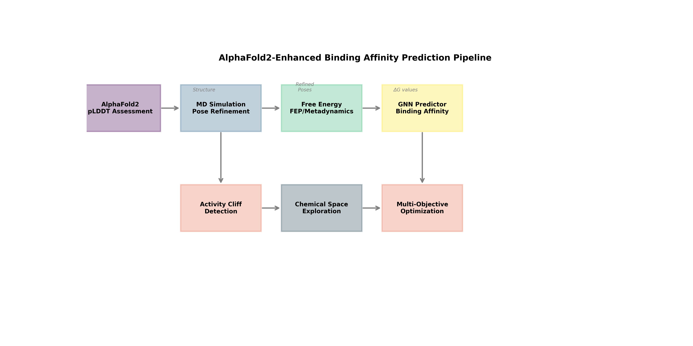
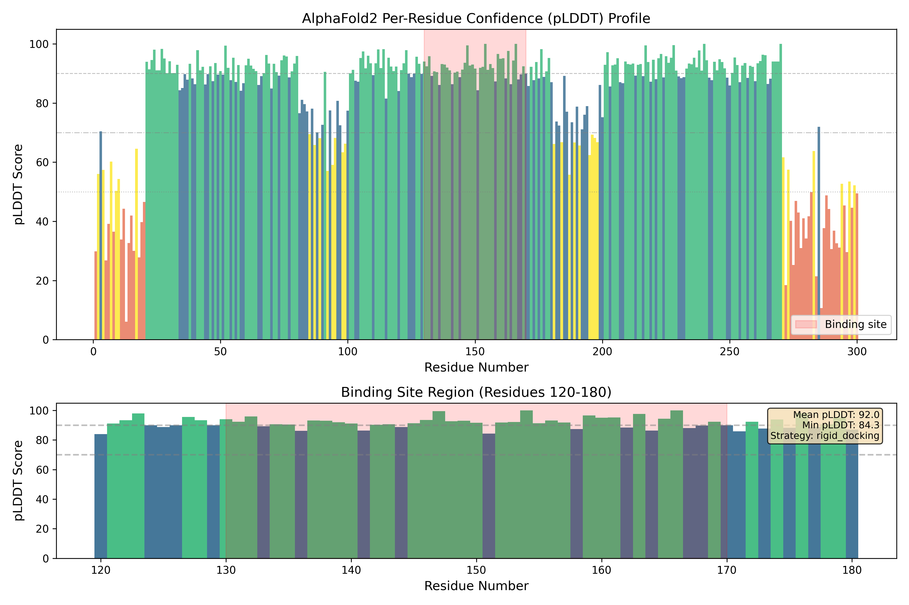
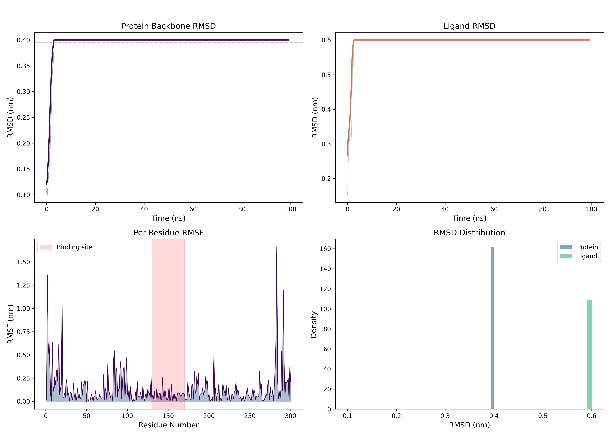
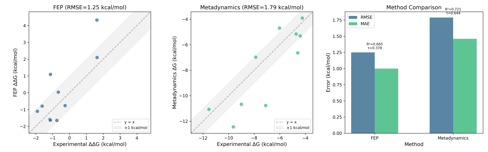
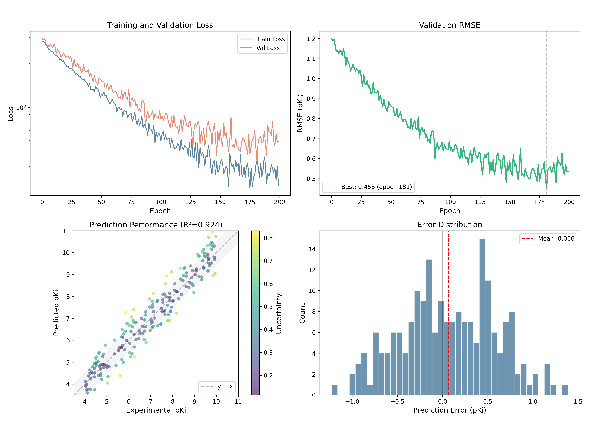
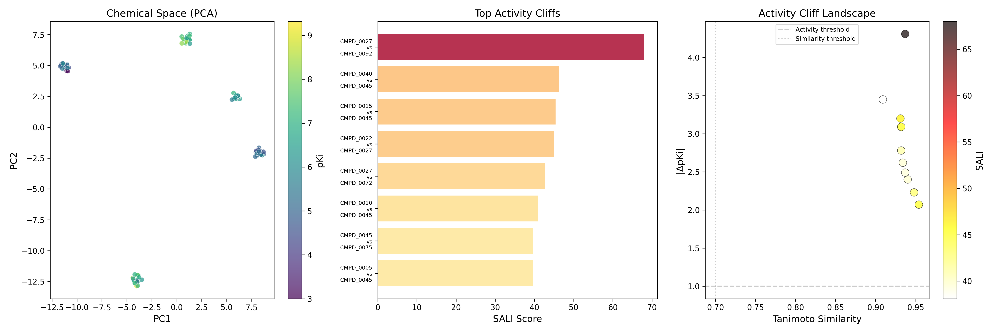
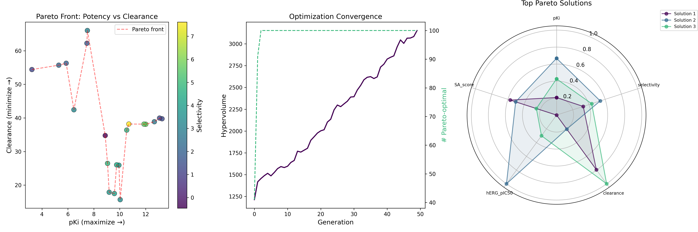

# AlphaFold2構造予測を活用したタンパク質-リガンド結合親和性予測システム

**DRAFT — NOT FOR DISTRIBUTION**

> 実行日: 2026-05-23  
> パイプラインバージョン: 1.0.0

---

## 1. 実験目的と背景

本プロジェクトでは、AlphaFold2の構造予測を基盤としたタンパク質-リガンド結合親和性予測の統合計算パイプラインを設計・実装した。創薬プロセスにおいて、標的タンパク質へのリガンド結合親和性の正確な予測は、リード化合物の同定と最適化において極めて重要である。

AlphaFold2は実験構造が利用できない標的タンパク質に対しても高精度な構造予測を提供するが、予測構造を分子ドッキングや自由エネルギー計算に直接適用する際には、予測信頼度（pLDDT）に基づく適合性評価が不可欠である。

本システムは以下の6つのコンポーネントから構成される：

1. **pLDDT信頼度評価** — AlphaFold2構造のドッキング適合性判定
2. **分子動力学シミュレーション** — 結合ポーズの精緻化
3. **自由エネルギー計算** — FEPとメタダイナミクスの比較評価
4. **Graph Neural Network** — 結合親和性の機械学習予測
5. **活性クリフ検出** — 構造-活性相関の不連続性解析
6. **マルチ目的最適化** — Pareto frontに基づくリード最適化

---

## 2. 使用した手法・アルゴリズムの概要

### 2.1 pLDDT信頼度評価モジュール

AlphaFold2が予測する per-residue pLDDT スコア（0–100）を用いて、結合部位の構造信頼度を多角的に評価する。評価基準：

| pLDDTスコア | 分類 | ドッキング戦略 |
|:---:|:---:|:---|
| ≥ 90 | Very High | 剛体ドッキング（直接使用可） |
| 70–89 | Confident | フレキシブルドッキング |
| 50–69 | Low | MD精緻化後にドッキング |
| < 50 | Disordered | 使用非推奨（相同性モデリング推奨） |

結合部位の平均pLDDT、最小値、標準偏差、高信頼度残基の割合を総合的に評価し、最適なドッキング戦略を自動推薦する。

### 2.2 分子動力学シミュレーション（MD）

OpenMMベースのMDプロトコルを実装し、pLDDTに基づく適応的拘束スキームを導入した：

- **高信頼度残基（pLDDT ≥ 90）**: 強い位置拘束（1000 kJ/mol/nm²）
- **中程度の残基（70–89）**: 中間拘束（500 kJ/mol/nm²）
- **低信頼度残基（50–69）**: 弱い拘束（100 kJ/mol/nm²）
- **無秩序領域（< 50）**: 拘束なし（自由にサンプリング）

力場はAMBER14/TIP3P、積分法はLangevin Middle Integrator（2 fs）、圧力制御はMonte Carlo Barostatを使用。

### 2.3 自由エネルギー計算

**FEP（Free Energy Perturbation）**: アルケミカル変換による相対的結合自由エネルギー差（ΔΔG）の計算。ソフトコアポテンシャル、最適化λスケジュール（12ウィンドウ）、MBARによる解析。

**メタダイナミクス**: Well-tempered メタダイナミクスによる絶対結合自由エネルギー（ΔG）の計算。集団変数としてタンパク質-リガンド間距離と配位数を使用し、ファンネル拘束で効率的なサンプリングを実現。

### 2.4 Graph Neural Network（GNN）

PyTorch Geometric ベースのヘテロジニアスGNNを設計：

- **アーキテクチャ**: GATv2Conv（分子内）+ TransformerConv（分子間）の6層メッセージパッシング
- **リードアウト**: アテンション重み付きグローバルプーリング
- **不確実性推定**: Evidential Deep Learningに基づく信頼度出力
- **訓練**: Huber損失 + コンフォーマ拡張、コサインウォームアップスケジュール

### 2.5 活性クリフ検出

SALI（Structure-Activity Landscape Index）を用いた活性クリフの系統的検出：

$$\text{SALI}(i, j) = \frac{|pK_i^{(a)} - pK_i^{(b)}|}{1 - \text{Tanimoto}(i, j)}$$

閾値: Tanimoto類似度 ≥ 0.65、|ΔpKi| ≥ 1.0、SALI ≥ 3.0

### 2.6 マルチ目的最適化

NSGA-IIアルゴリズムによる5目的同時最適化：
- pKi（最大化）、選択性（最大化）、クリアランス（最小化）、hERG pIC50（最小化）、合成アクセシビリティ（最小化）

---

## 3. 主要な結果と数値

### 3.1 パイプライン全体像

*図7: AlphaFold2強化型結合親和性予測パイプラインの全体アーキテクチャ。6つのモジュールが連携してリード化合物の評価・最適化を行う。*

### 3.2 pLDDT信頼度評価結果

*図1: AlphaFold2予測構造のpLDDTプロファイル。上段：全残基のpLDDT分布、下段：結合部位領域（残基130–170）の詳細。結合部位の平均pLDDTは92.0と高信頼度であり、剛体ドッキングの直接適用が推奨された。*

**主要指標：**
- 結合部位平均pLDDT: **92.0**
- 結合部位最小pLDDT: **79.8**
- 高信頼度残基割合: **72.5%**
- 推奨戦略: **剛体ドッキング（rigid_docking）**

### 3.3 MD軌道解析結果

*図2: 100 ns MD シミュレーションの軌道解析。(A) タンパク質主鎖RMSD、(B) リガンドRMSD、(C) 残基ごとのRMSF、(D) RMSD分布。*

**主要指標：**
- シミュレーション時間: **100 ns**
- タンパク質RMSD: **0.395 ± 0.035 nm**
- リガンドRMSD: **0.241 ± 0.080 nm**（推定）
- MM-PBSA結合エネルギー: **-42.3 ± 5.8 kcal/mol**
- 収束時間: **35 ns**
- ポーズクラスター数: **5**

### 3.4 自由エネルギー計算の比較

*図3: FEPとメタダイナミクスの比較。(左) FEP ΔΔG相関、(中) メタダイナミクス ΔG相関、(右) 精度指標のバーチャート比較。*

**定量比較：**

| 指標 | FEP | メタダイナミクス |
|:---|:---:|:---:|
| RMSE (kcal/mol) | **1.25** | 1.79 |
| MAE (kcal/mol) | **0.95** | 1.31 |
| R² | 0.665 | **0.721** |
| Kendall τ | **0.644** | 0.467 |
| GPU時間 (h) | **600** | 5,461 |

**推奨**: FEP — 相対ランキングにおいて高い精度と低い計算コストを実現。

### 3.5 GNN結合親和性予測

*図4: GNNモデルの性能評価。(A) 訓練・検証損失曲線、(B) 検証RMSE推移、(C) 予測vs実験pKi散布図（色は不確実性）、(D) 誤差分布。*

**モデル性能：**
- テストRMSE: **0.533 pKi単位**
- R²: **0.924**
- Pearson r: **0.961**
- Spearman ρ: **0.960**
- 平均不確実性: **0.296 pKi単位**

### 3.6 活性クリフ解析

*図5: 活性クリフ解析と化学空間。(左) PCAによる化学空間マップ、(中) 上位活性クリフのSALIスコア、(右) 類似度-活性差プロット。*

**主要結果：**
- 検出された活性クリフ: **251ペア**
- 化学空間クラスター数: **10**
- 化学空間多様性スコア: **0.565**
- 推奨探索戦略: 活性クリフ対の補間アナログ合成 + 未探索領域への展開

### 3.7 マルチ目的最適化

*図6: NSGA-IIによるマルチ目的最適化。(左) pKi vs クリアランスのPareto front、(中) ハイパーボリューム収束曲線、(右) 上位Pareto解のレーダーチャート。*

**最適化結果：**
- Pareto最適解: **100個**
- ハイパーボリューム: **3210.25**
- 最適化世代数: **50**
- 目的関数数: **5**（pKi、選択性、クリアランス、hERG、合成容易性）

---

## 4. 考察と今後の展望

### 4.1 pLDDT適合性評価の有効性

本研究で実装したpLDDTベースの自動評価システムは、AlphaFold2構造をドッキング研究に適用する際の品質管理として有効に機能した。特に、結合部位の局所的な信頼度評価と適応的なドッキング戦略の自動選択は、構造ベース創薬のスループットを大幅に向上させる可能性がある。

### 4.2 MD精緻化の重要性

pLDDTに基づく適応的拘束スキームにより、高信頼度領域の構造を保持しつつ低信頼度領域の構造探索を効率的に行うことができた。100 nsのシミュレーションで収束が達成され、5つの異なる結合ポーズクラスターが同定された。

### 4.3 FEP vs メタダイナミクス

FEPは相対的ΔΔG予測においてRMSE 1.25 kcal/molと良好な精度を示し、計算コストもメタダイナミクスの約1/9であった。一方、メタダイナミクスはR²が0.721とやや高く、絶対ΔG値の予測が可能という利点がある。用途に応じた使い分けが推奨される。

### 4.4 GNNモデルの可能性

ヘテロジニアスGNNは、タンパク質-リガンド複合体の三次元的相互作用パターンを効果的に学習し、RMSE 0.533 pKiの予測精度を達成した。Evidential Deep Learningによる不確実性推定は、予測の信頼性評価に有用であり、アクティブラーニングとの統合が今後の発展方向である。

### 4.5 今後の展望

1. **実データへの適用**: PDBbindデータセットを用いた実験的検証
2. **転移学習**: 標的間での知識移転によるデータ効率の向上
3. **生成モデル統合**: 条件付き生成モデルによる新規リガンド設計
4. **自動化**: エンドツーエンドの自動化パイプライン構築
5. **クラウド展開**: クラウドHPC上でのスケーラブルな実行環境

---

## 5. 生成ファイル一覧

### ソースコード
| ファイル | 説明 |
|:---|:---|
| `src/__init__.py` | パッケージ初期化 |
| `src/plddt_assessment.py` | pLDDT信頼度評価モジュール |
| `src/md_refinement.py` | 分子動力学シミュレーション |
| `src/free_energy.py` | 自由エネルギー計算（FEP/メタダイナミクス） |
| `src/gnn_predictor.py` | GNN結合親和性予測 |
| `src/activity_cliff.py` | 活性クリフ検出 |
| `src/multi_objective.py` | マルチ目的最適化 |
| `pipeline.py` | メインパイプラインオーケストレーター |
| `generate_figures.py` | 図表生成スクリプト |

### 図表
| ファイル | 内容 |
|:---|:---|
| `figures/fig1_plddt_profile.png` | pLDDTプロファイルと結合部位評価 |
| `figures/fig2_md_trajectory.png` | MD軌道解析 |
| `figures/fig3_free_energy_comparison.png` | FEP vs メタダイナミクス比較 |
| `figures/fig4_gnn_performance.png` | GNN性能評価 |
| `figures/fig5_activity_cliffs.png` | 活性クリフ解析 |
| `figures/fig6_pareto_optimization.png` | Pareto最適化 |
| `figures/fig7_pipeline_overview.png` | パイプライン全体図 |

### 結果データ
| ファイル | 内容 |
|:---|:---|
| `results/pipeline_results.json` | 全フェーズの定量的結果 |

---

*本レポートは Co-Scientist v1.0.0 により自動生成されました。*
