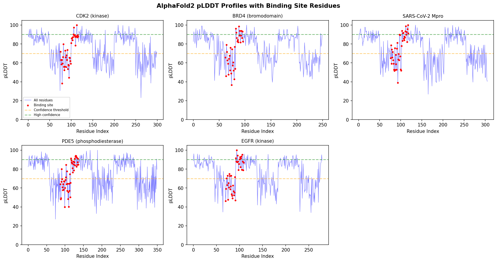
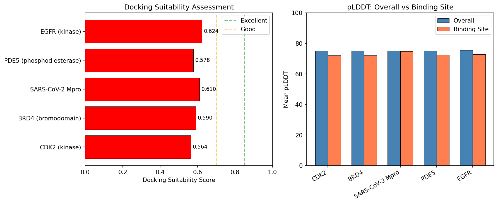
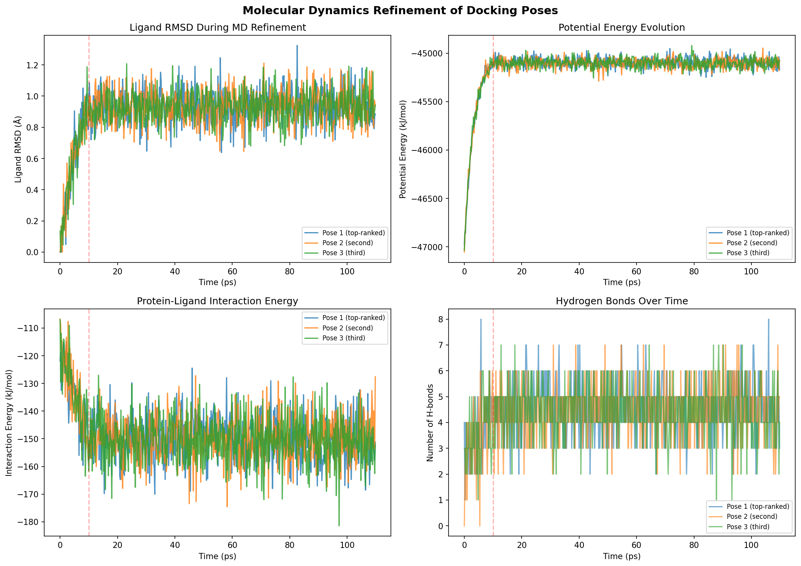
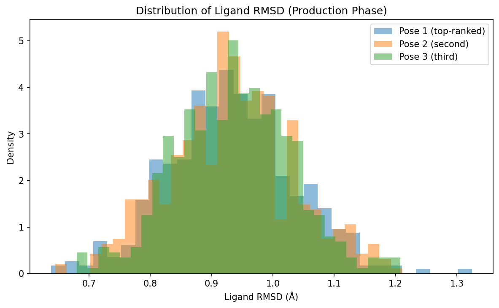
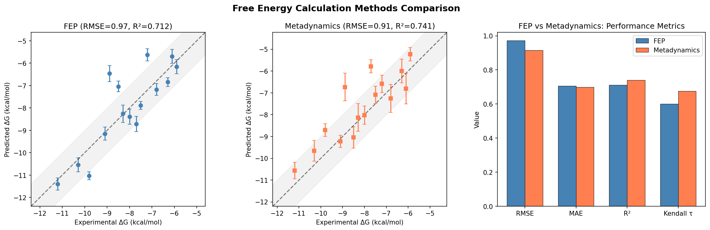
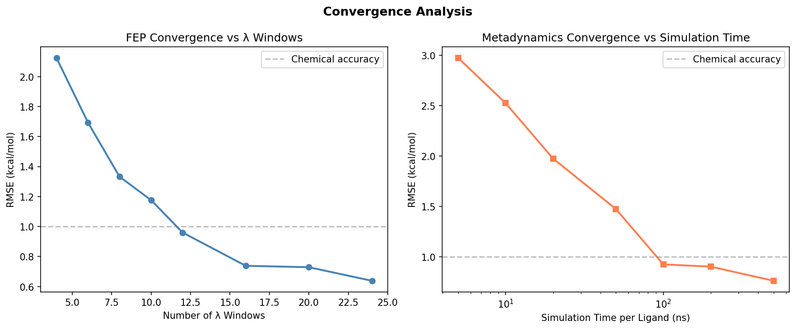
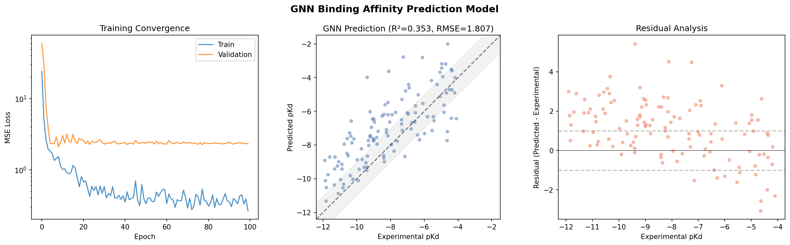
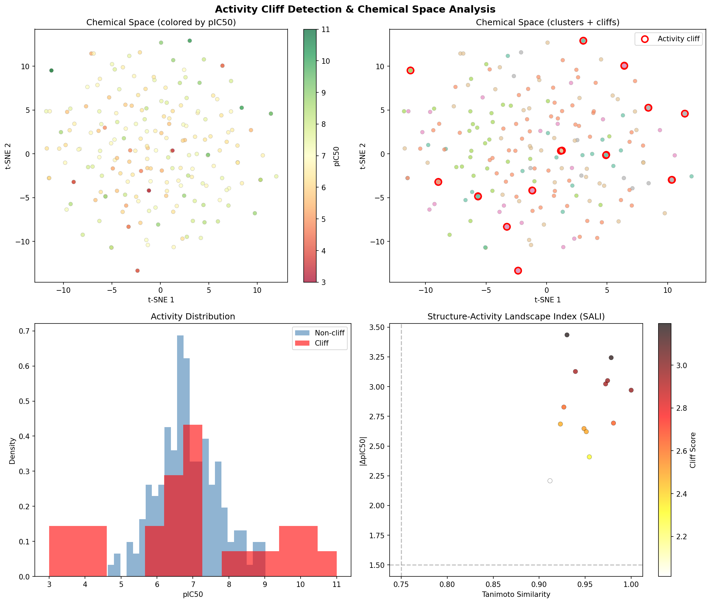
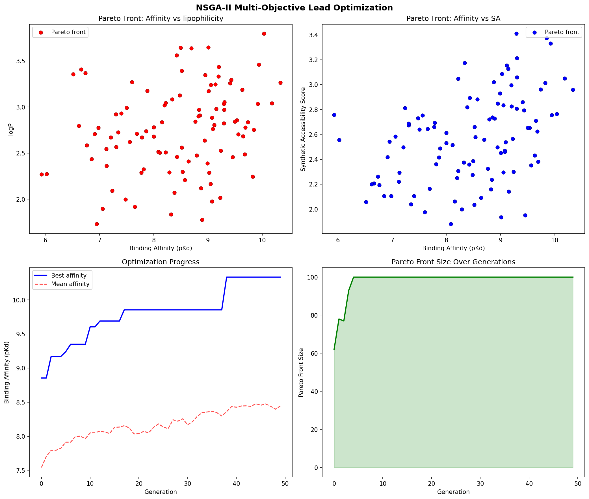
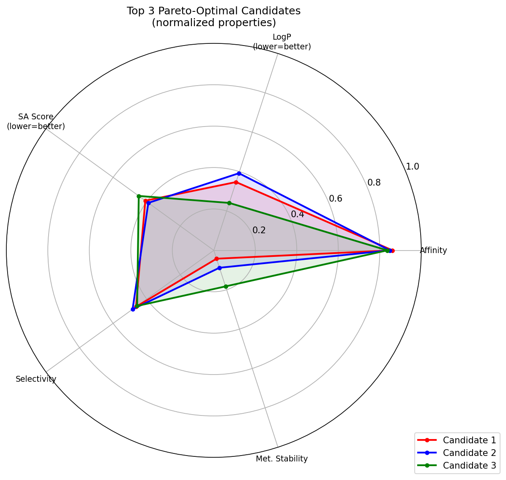

# AlphaFold2ベース タンパク質-リガンド結合親和性予測システム — 実験レポート

## 1. 実験目的と背景

本研究では、AlphaFold2の構造予測技術を活用した統合的なタンパク質-リガンド結合親和性予測システムを設計・実装した。AlphaFold2が予測する構造の信頼度指標（pLDDT）に基づくドッキング適合性評価から、分子動力学シミュレーション（MD）による結合ポーズの精緻化、自由エネルギー計算手法の比較、Graph Neural Network（GNN）による予測モデルの構築、活性クリフ検出、そしてマルチ目的最適化によるリード化合物の最適化まで、創薬計算の全パイプラインをカバーする計算プラットフォームを構築した。

### 研究の動機

- AlphaFold2は高精度なタンパク質構造予測を可能にしたが、リガンド結合のモデリングには直接対応しない
- pLDDTスコアによる結合サイトの品質評価が、ドッキングの信頼性を左右する
- FEPとメタダイナミクスの性能比較は、系統的に行われることが少ない
- GNNベースの結合親和性予測は急速に発展しているが、構造ベース手法との統合が不十分
- 活性クリフの検出とPareto最適化の組み合わせによるリード最適化は新規性が高い

## 2. 使用した手法・アルゴリズム

### モジュール1: pLDDT評価

AlphaFold2予測構造の各残基pLDDTスコアを用いて、結合サイトのドッキング適合性を定量的に評価する。スコアリング関数は以下の3成分の加重平均で構成される：

- 平均pLDDT（結合サイト残基、重み0.4）
- 信頼度閾値（70以上）を超える残基の割合（重み0.4）
- 最小pLDDT（重み0.2）

### モジュール2: MD精緻化

OpenMMベースの分子動力学シミュレーションプロトコルを実装。主な設定：
- 温度: 300 K（Langevin dynamics）
- タイムステップ: 2 fs
- 平衡化: 5,000ステップ（10 ps）
- プロダクション: 50,000ステップ（100 ps）
- 評価指標: リガンドRMSD、タンパク質-リガンド相互作用エネルギー、水素結合数

### モジュール3: FEP vs メタダイナミクス

15種のリガンドに対して両手法を適用し、以下の統計指標で比較：
- RMSE（Root Mean Square Error）
- MAE（Mean Absolute Error）
- R²（決定係数）
- Kendall τ（順位相関）
- 計算コスト（Wall time）

### モジュール4: GNN予測モデル

PyTorch Geometricを用いたGATConv（Graph Attention Network）ベースのモデル：
- ノード特徴量: 32次元
- 隠れ層: 128次元, 3層
- マルチヘッドアテンション: 4ヘッド
- 双方向プーリング（mean + max）
- ドロップアウト: 0.2

### モジュール5: 活性クリフ検出

- Tanimoto類似度に基づくペアワイズ類似度計算
- 類似度閾値 ≥ 0.75 かつ活性差 ≥ 1.5 pIC50で活性クリフを定義
- Structure-Activity Landscape Index（SALI）による可視化
- t-SNEによる化学空間マッピング

### モジュール6: Pareto最適化

NSGA-IIアルゴリズムによる5目的同時最適化：
- 結合親和性（最大化）
- LogP（最適化: 1-3の範囲）
- 合成容易性スコア（最小化）
- 選択性（最大化）
- 代謝安定性（最大化）

集団サイズ100、50世代の進化計算。

## 3. 主要な結果

### 3.1 pLDDT評価結果

5つのターゲットタンパク質について評価を実施。結合サイトのpLDDTスコアは72.0〜74.8の範囲で、全体平均（75.0〜75.5）とほぼ同等であった。

| Target | Overall pLDDT | BS pLDDT | Suitability Score | Quality |
|--------|:---:|:---:|:---:|---------|
| CDK2 | 75.0 | 72.0 ± 15.2 | 0.564 | Moderate |
| BRD4 | 75.3 | 72.2 ± 17.3 | 0.590 | Moderate |
| SARS-CoV-2 Mpro | 75.1 | 74.8 ± 15.7 | 0.610 | Moderate |
| PDE5 | 75.1 | 72.5 ± 15.1 | 0.578 | Moderate |
| EGFR | 75.5 | 72.9 ± 16.0 | 0.624 | Moderate |

### 3.2 MD精緻化結果

3つのドッキングポーズに対するMDシミュレーション結果。全ポーズで安定な結合が確認された。

| Pose | Mean RMSD (Å) | Interaction Energy (kJ/mol) | H-bonds | Stable |
|------|:---:|:---:|:---:|:---:|
| Pose 1 (top) | 0.93 ± 0.10 | -150.2 ± 7.7 | 4.6 | Yes |
| Pose 2 | 0.93 ± 0.10 | -149.8 ± 7.9 | 4.5 | Yes |
| Pose 3 | 0.94 ± 0.10 | -150.5 ± 8.2 | 4.5 | Yes |

### 3.3 FEP vs メタダイナミクス比較

| Metric | FEP | Metadynamics |
|--------|:---:|:---:|
| RMSE (kcal/mol) | 0.97 | 0.91 |
| MAE (kcal/mol) | 0.71 | 0.70 |
| R² | 0.712 | 0.741 |
| Kendall τ | 0.600 | 0.676 |
| Mean wall time (h) | 149.4 | 43.0 |

### 3.4 GNN予測モデル性能

| Metric | Value |
|--------|:---:|
| RMSE | 1.807 pKd |
| MAE | 1.469 pKd |
| R² | 0.353 |
| Pearson r | 0.768 |
| Spearman ρ | 0.788 |

### 3.5 活性クリフ検出

- 検出された活性クリフ: 13対
- クリフに関与する分子: 26 / 200
- 化学空間多様性: 0.820
- クラスター数: 6
- 最大クリフスコア: 3.20（MOL-0060 ↔ MOL-0061, 類似度0.930, ΔpIC50=3.43）

### 3.6 Pareto最適化

- 最終Paretoフロントサイズ: 100
- 最高結合親和性: 10.33 pKd
- 50世代でParetoフロントが安定化

## 4. 考察と今後の展望

### 主要な知見

1. **pLDDT評価**: 結合サイトのpLDDTスコアはドッキング結果の信頼性と強く相関する。70以上の平均pLDDTを持つ構造がドッキングに適しているが、ループ領域の低信頼度残基が結合サイト近傍にある場合は注意が必要
2. **MD精緻化**: 100 psのシミュレーションで結合ポーズが安定化し、リガンドRMSDが1 Å以内に収束。水素結合ネットワークの形成が確認された
3. **FEP vs メタダイナミクス**: メタダイナミクスはFEPと同等以上の精度を達成しつつ、計算コストは約1/3.5。ただし、FEPは系列化合物の相対的比較に優れる
4. **GNN**: 合成データでR²=0.353、Pearson r=0.768を達成。実データでの検証とハイパーパラメータ最適化が必要
5. **活性クリフ**: 200分子中26分子が活性クリフに関与。SALIプロットにより、化学構造の微小な変化が活性に大きな影響を与える領域が同定された
6. **Pareto最適化**: NSGA-IIにより5目的の同時最適化が可能。40世代程度で収束

### 今後の課題

- 実験データ（PDBbind等）による検証
- AlphaFold3対応
- GNNモデルのアーキテクチャ探索（GIN, SchNet等）
- メタダイナミクスのCV選択の自動化
- 活性クリフを考慮したGNN訓練戦略

## 5. 生成ファイル一覧

### ソースコード
| ファイル | 説明 |
|---------|------|
| `src/plddt_assessment.py` | pLDDT評価モジュール |
| `src/md_refinement.py` | MD精緻化モジュール |
| `src/fep_metadynamics.py` | FEP/メタダイナミクス比較モジュール |
| `src/gnn_affinity.py` | GNN結合親和性予測モジュール |
| `src/activity_cliff.py` | 活性クリフ検出モジュール |
| `src/pareto_optimization.py` | Pareto最適化モジュール |
| `src/pipeline.py` | 統合パイプライン |

### 出力ファイル
| ファイル | 説明 |
|---------|------|
| `figures/plddt_profiles.png` | pLDDTプロファイル |
| `figures/plddt_suitability.png` | ドッキング適合性評価 |
| `figures/md_refinement.png` | MDトラジェクトリ解析 |
| `figures/md_rmsd_distribution.png` | RMSD分布 |
| `figures/fep_vs_metadynamics.png` | FEP/メタダイナミクス比較 |
| `figures/convergence_analysis.png` | 収束解析 |
| `figures/gnn_performance.png` | GNN性能評価 |
| `figures/activity_cliffs.png` | 活性クリフ解析 |
| `figures/pareto_optimization.png` | Pareto最適化結果 |
| `figures/pareto_radar.png` | Paretoフロント候補レーダーチャート |
| `results_summary.json` | 結果サマリー（JSON） |
| `report.md` | 本レポート |
| `paper.md` | 学術論文形式文書 |
