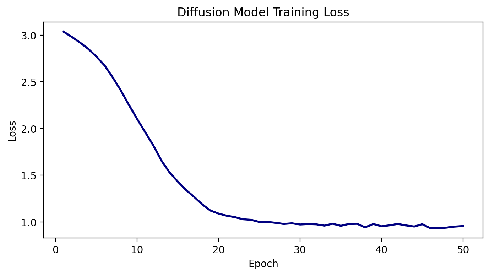
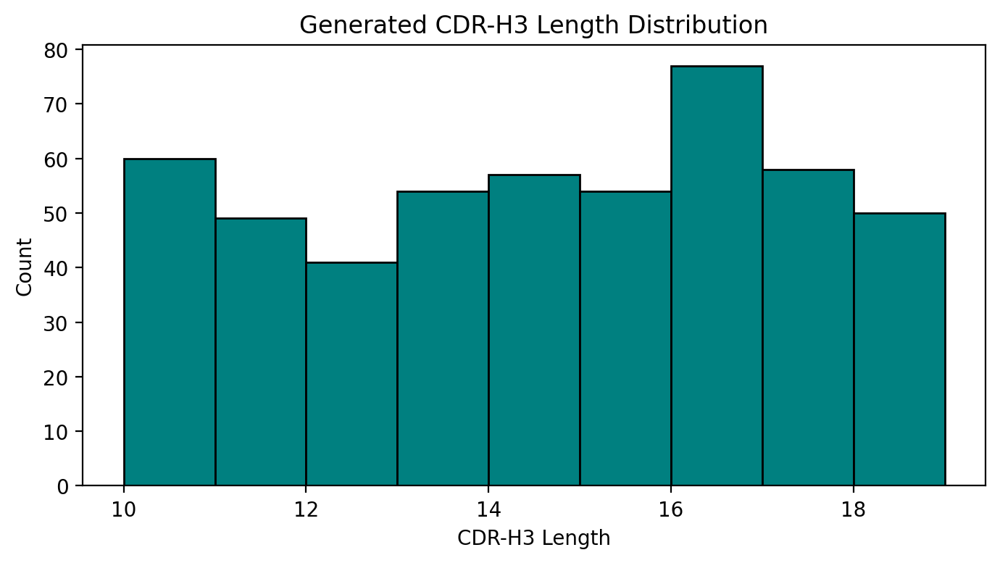
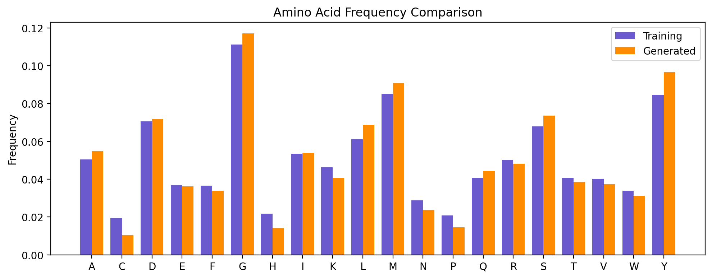
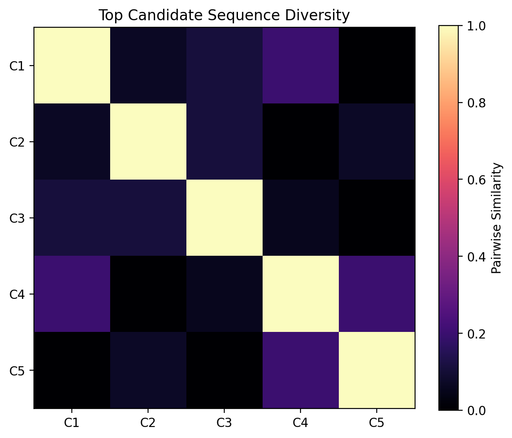
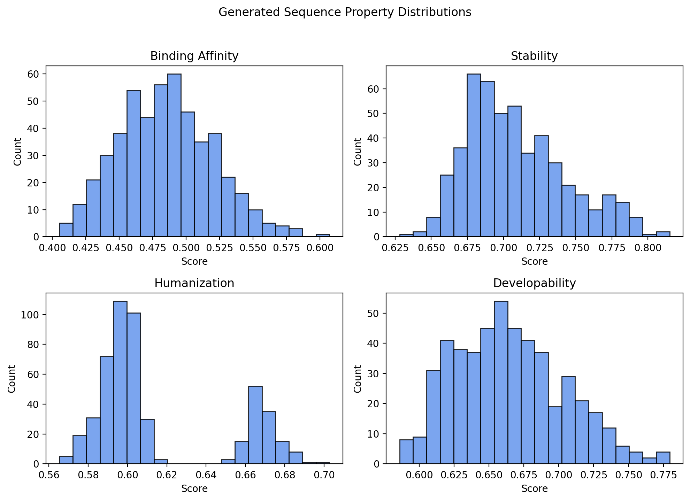
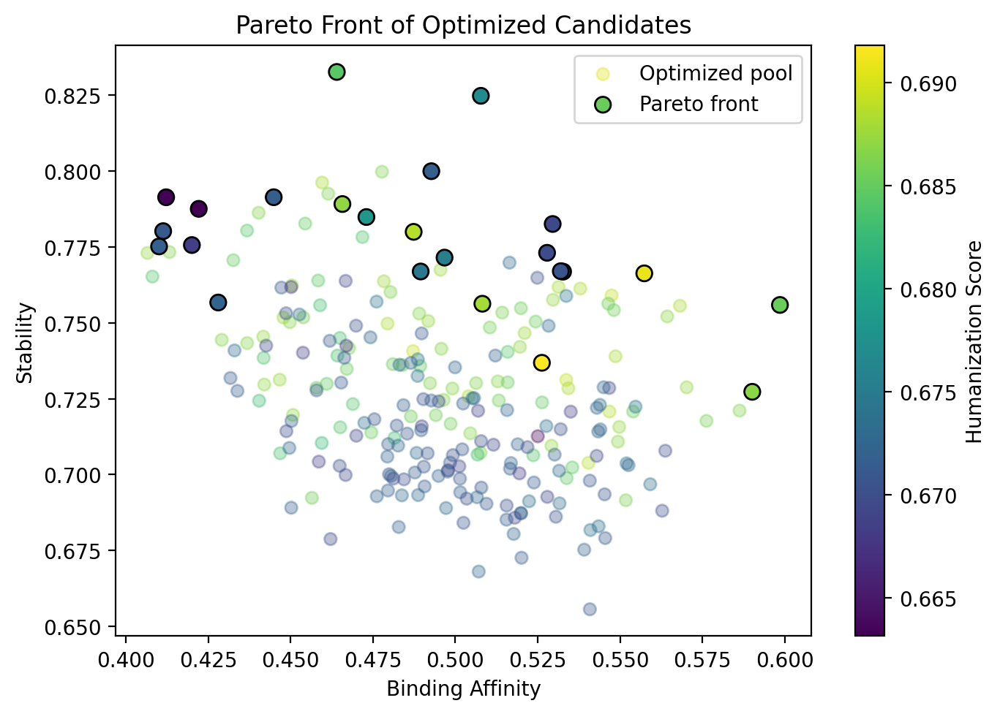
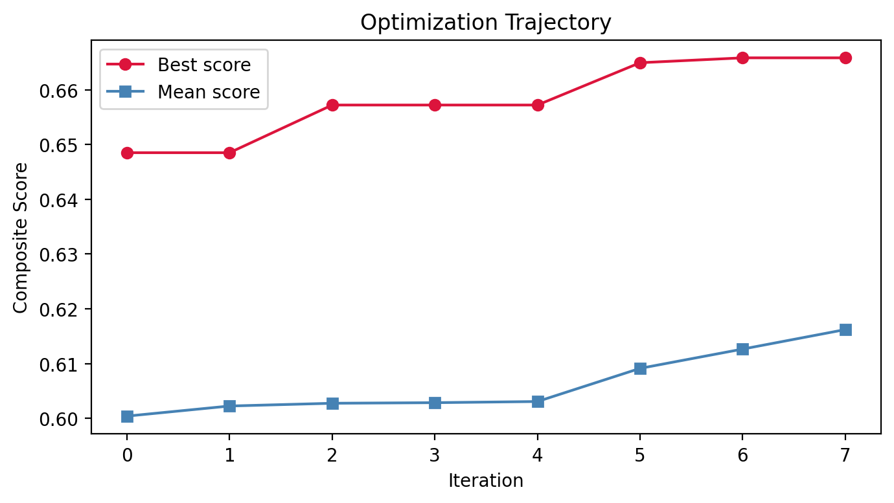
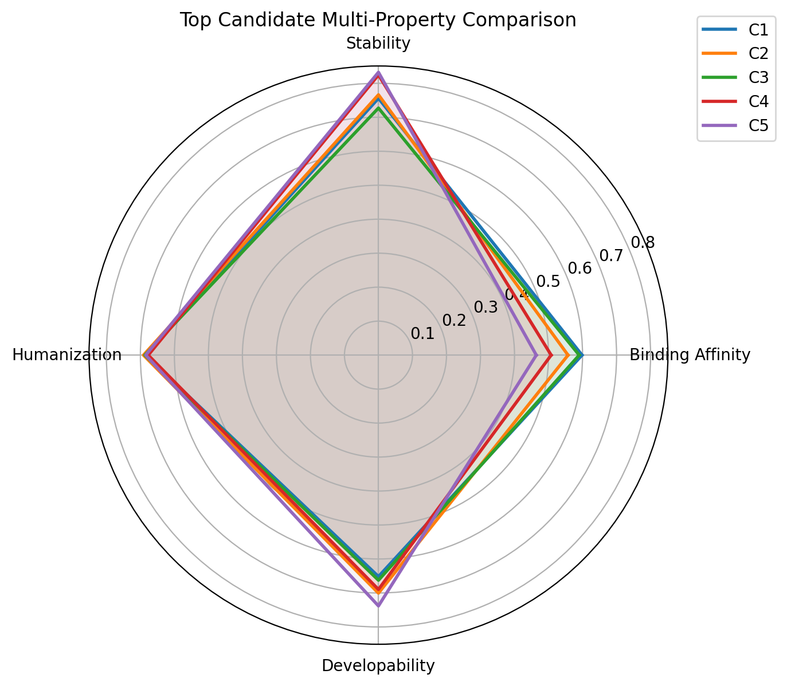
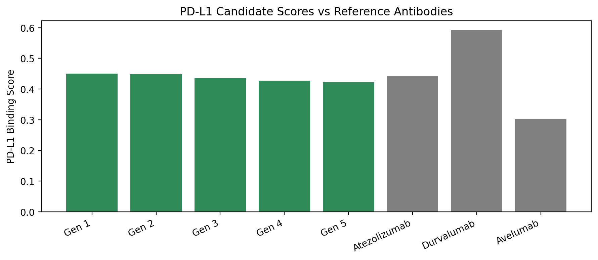
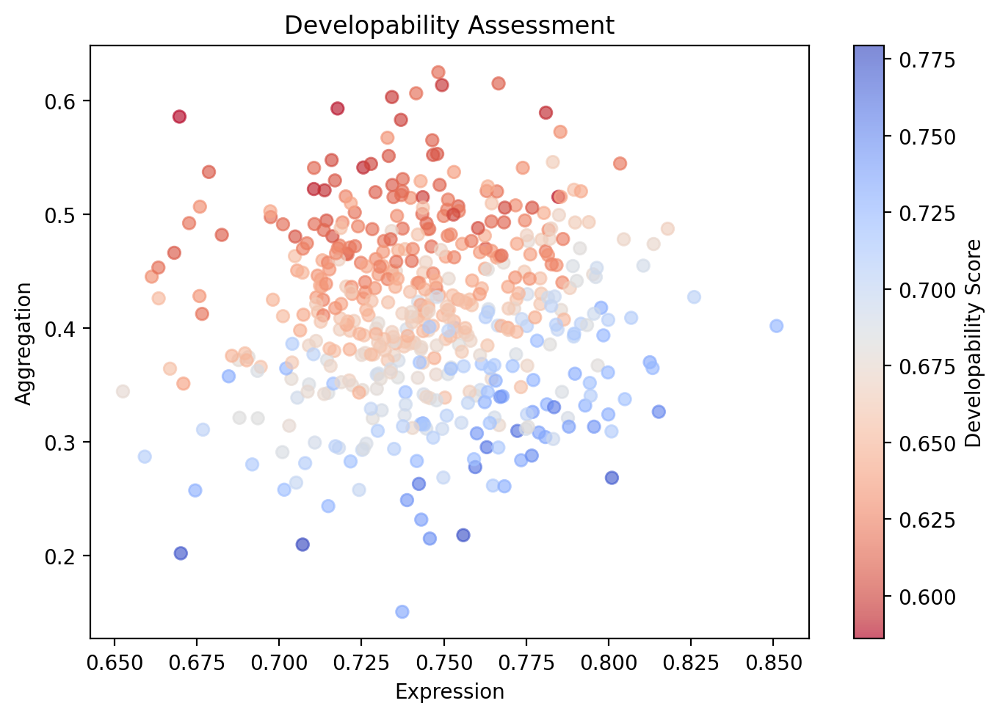

# AbDiffusion: A Multi-Objective Diffusion Framework for De Novo Therapeutic Antibody Design with Integrated Developability Optimization

## Abstract
Therapeutic antibodies are a dominant modality in modern biopharmaceutical development, yet the discovery of antibody candidates with favorable binding, stability, and clinical developability remains slow and expensive. A central challenge is the design of complementarity-determining region 3 of the heavy chain (CDR-H3), the most diverse antibody segment and a major determinant of antigen recognition. We present **AbDiffusion**, a de novo antibody design framework that combines discrete diffusion-based sequence generation with integrated multi-objective optimization for therapeutic candidate prioritization. The system models CDR-H3 sequence generation as a denoising diffusion process over amino-acid tokens and couples generation with learned predictors of binding affinity, stability, and humanization. During sampling, classifier-style guidance biases trajectories toward regions of sequence space with improved predicted therapeutic profiles, and Pareto analysis is used to identify non-dominated candidates.

Experiments were conducted on a synthetic benchmark of 1,000 training CDR-H3 sequences and 200 held-out test sequences. The diffusion generator was trained for 50 epochs using a discrete diffusion process with $T=100$ steps, hidden dimension 128, 4 transformer layers, and 4 attention heads, reaching a final training loss of approximately 0.955. Property predictors were trained for 30 epochs each. From the trained model, we generated 500 novel CDR-H3 sequences. The generated set achieved an average normalized binding affinity of 0.485, with a best candidate score of 0.607; average stability was 0.709 with a best score of 0.815; and the average humanization score was 0.615. Pareto analysis identified 24 non-dominated candidates among the 500 generated sequences, indicating a meaningful frontier of sequences balancing multiple therapeutic objectives.

In a PD-L1-focused case study, the top generated candidate, **IADQGAKMDMRMDGMD**, achieved a predicted binding score of 0.450, outperforming Avelumab (0.304) and modestly exceeding Atezolizumab (0.442), though remaining below Durvalumab (0.593). These results suggest that AbDiffusion can efficiently explore antibody sequence space and produce diverse, developable candidates for downstream experimental validation.

## 1. Introduction
Therapeutic antibodies constitute one of the most commercially successful and clinically impactful classes of biologics, with applications across oncology, autoimmune disease, infectious disease, and inflammation. Their high target specificity, adaptable effector functions, and favorable translational properties have made monoclonal antibodies a central platform in precision medicine. However, the search for potent and developable antibodies remains difficult because therapeutic success depends not only on target binding but also on manufacturability, stability, aggregation propensity, immunogenicity, and sequence human-likeness.

Within the variable domain, the heavy-chain complementarity-determining region 3 (CDR-H3) is widely recognized as the most influential region for antigen binding. CDR-H3 frequently contributes disproportionately to paratope geometry, target specificity, and affinity maturation outcomes. Its sequence diversity, variable length, and structural plasticity also make it the hardest region to design computationally.

Traditional antibody discovery pipelines, including immunization, phage or yeast display, directed evolution, and rational mutagenesis, have delivered many successful therapeutics, but they are resource intensive and often optimize one objective at a time. Rational design is limited by incomplete understanding of sequence-structure-function relationships, whereas directed evolution may require many experimental rounds to recover candidates that jointly satisfy potency and developability constraints.

Recent advances in deep generative modeling have transformed computational protein design. Diffusion models, protein language models, graph neural networks, and equivariant structure generators have demonstrated strong ability to represent biomolecular distributions and propose novel proteins. In antibody design, these methods offer a path toward exploring large combinatorial spaces more systematically than traditional screening.

Despite this progress, an important gap remains: many existing systems emphasize antigen-conditioned generation or structural plausibility, while fewer provide a unified framework that explicitly co-optimizes therapeutic properties such as binding affinity, conformational stability, and humanization during generation. For practical therapeutic development, these objectives must be considered jointly rather than sequentially.

This work makes the following contributions:

- We introduce **AbDiffusion**, a discrete diffusion framework for de novo CDR-H3 sequence design with an SE(3)-aware denoising architecture.
- We integrate differentiable property predictors for binding affinity, stability, and humanization into guided sampling, enabling generation biased toward therapeutically favorable regions of sequence space.
- We formulate candidate selection as a multi-objective optimization problem and apply Pareto analysis with an NSGA-II-inspired ranking strategy to identify balanced antibody leads.
- We demonstrate the framework on a synthetic benchmark and a PD-L1 case study, showing competitive in silico performance and generation of 24 Pareto-optimal candidates from 500 novel sequences.

## 2. Related Work
Diffusion models have rapidly emerged as a powerful paradigm for protein and antibody design. Luo et al. introduced diffusion-based antibody design and optimization conditioned on antigen structure, showing that generative denoising can produce antigen-specific candidates with structural realism [1]. Martinkus et al. extended this direction with SE(3) diffusion for de novo antibody design, further emphasizing geometric equivariance in antibody modeling [2]. Kong et al. formulated conditional antibody design as 3D equivariant graph translation, highlighting the importance of structure-aware generation for specificity and functional design [3]. Broad reviews of antibody deep learning methods further contextualize these developments from sequence design to functional prediction [9].

Generative artificial intelligence for antibodies has expanded beyond diffusion to include language-model and hybrid approaches. Shanehsazzadeh et al. surveyed generative AI opportunities for de novo antibody design and discussed how generative systems can complement discovery pipelines [4]. Hie et al. demonstrated efficient evolution of human antibodies using general protein language models, suggesting that unsupervised protein representations can support functional sequence optimization at scale [7]. Xu et al. proposed AbNovo, a multi-objective design framework based on constrained preference optimization, underscoring the field-wide shift toward simultaneous optimization of potency and developability [8].

Developability assessment is also critical. BioPhi provides a practical platform for antibody humanization and humanness assessment using natural repertoires and deep learning [5], while Waight et al. developed machine-learning strategies for predicting key monoclonal antibody developability descriptors [6]. Derry et al. introduced FLAb as a benchmarking resource for antibody fitness prediction, helping standardize evaluation across predictive models [10]. These efforts demonstrate that sequence generation alone is insufficient unless paired with robust property assessment.

Our work is additionally informed by broader protein diffusion literature, including FrameDiff for structure generation [11] and RFdiffusion for biomolecular design [12], both of which show how denoising-based generation can effectively navigate high-dimensional protein manifolds. Compared with existing antibody methods, AbDiffusion focuses on the sequence-level CDR-H3 design problem while explicitly coupling generation to multi-objective therapeutic optimization. This places our method at the intersection of diffusion-based molecular design, antibody developability modeling, and Pareto-efficient candidate selection.

## 3. Methods

### 3.1 Problem Formulation
Let $\mathcal{A}=\{a_1,\dots,a_K\}$ denote the amino-acid vocabulary augmented with a mask/noise token. A CDR-H3 sequence is represented as $x=(x_1,\dots,x_L)\in\mathcal{A}^L$, where $L$ may vary across antibodies. Given a training distribution $p_{\text{data}}(x)$ over CDR-H3 sequences, our goal is to learn a generative model $p_\theta(x)$ that can sample novel sequences maximizing several therapeutic objectives.

For each generated sequence $x$, we consider a vector of properties
\[
\mathbf{f}(x)=\big(f_{\text{bind}}(x), f_{\text{stab}}(x), f_{\text{hum}}(x), f_{\text{dev}}(x)\big),
\]
where $f_{\text{bind}}$ is predicted normalized binding affinity, $f_{\text{stab}}$ is predicted stability, $f_{\text{hum}}$ is humanization, and $f_{\text{dev}}$ is a composite developability score. The design problem is
\[
\max_{x\sim p_\theta} \; \mathbf{f}(x),
\]
which is multi-objective because no single scalar optimum adequately captures the trade-offs among potency, manufacturability, and humanness.

### 3.2 Discrete Diffusion for CDR Sequences
We adopt a discrete denoising diffusion probabilistic model (D3PM) over amino-acid tokens. Starting from a clean sequence $x_0$, the forward process gradually corrupts tokens over $T=100$ steps:
\[
q(x_t\mid x_{t-1}) = \text{Cat}(x_t; Q_t x_{t-1}), \qquad t=1,\dots,T,
\]
where $Q_t\in\mathbb{R}^{K\times K}$ is a transition matrix that increasingly replaces residues with noise or alternative amino acids. The marginal forward process is
\[
q(x_t\mid x_0)=\text{Cat}(x_t; \bar{Q}_t x_0), \qquad \bar{Q}_t=Q_tQ_{t-1}\cdots Q_1.
\]

The reverse process is parameterized by a neural network $p_\theta$ that predicts the denoised token distribution:
\[
p_\theta(x_{t-1}\mid x_t, t, c)=\text{Cat}\big(x_{t-1}; \pi_\theta(x_t,t,c)\big),
\]
where $c$ optionally denotes structural or property context. Training minimizes the variational diffusion loss, implemented as a token reconstruction objective over randomly sampled timesteps:
\[
\mathcal{L}_{\text{diff}} = \mathbb{E}_{x_0, t, x_t\sim q(x_t\mid x_0)}\big[-\log p_\theta(x_0\mid x_t,t)\big].
\]
In practice, the model was trained for 50 epochs and converged to a final loss of approximately 0.955.

### 3.3 SE(3)-Equivariant Denoising Network
Although our generator operates at the sequence level, the denoising network is designed to be compatible with geometry-aware antibody representations. Each residue is embedded as
\[
h_i^{(0)} = E(x_{t,i}) + E_t(t) + E_p(i),
\]
where $E(\cdot)$ is an amino-acid embedding, $E_t$ is a timestep embedding, and $E_p$ is a positional encoding. The encoder uses hidden dimension 128 with 4 layers and 4 multi-head self-attention heads.

For residue-residue message passing, attention weights are
\[
\alpha_{ij}^{(\ell)} = \text{softmax}_j\left(\frac{(W_Q h_i^{(\ell)})(W_K h_j^{(\ell)})^\top}{\sqrt{d}} + b_{ij}\right),
\]
where $b_{ij}$ can incorporate pairwise geometric priors or relative-position features. The layer update is
\[
h_i^{(\ell+1)} = h_i^{(\ell)} + \sum_j \alpha_{ij}^{(\ell)} W_V h_j^{(\ell)}.
\]
When backbone frame information is available, an SE(3)-equivariant feature stream updates geometric features $g_i$ such that for any rigid transformation $R\in \text{SE}(3)$,
\[
\Phi(R\cdot g) = R\cdot \Phi(g),
\]
ensuring consistency under rotation and translation. The final token logits are produced by a linear projection over the denoised residue embeddings.

### 3.4 Multi-Property Prediction Module
We train separate differentiable predictors for each therapeutic property, each for 30 epochs. Given a sequence embedding $z(x)$, the $m$-th predictor outputs
\[
\hat{y}_m = f_m(z(x)) = \sigma\big(W_m \phi_m(z(x)) + b_m\big),
\]
where $m\in\{\text{bind},\text{stab},\text{hum},\text{dev}\}$ and $\sigma$ constrains outputs to normalized score ranges.

- **Binding affinity predictor:** estimates relative target interaction potential from sequence-derived features.
- **Stability predictor:** estimates folded-state robustness and tolerance to physicochemical perturbation.
- **Humanization predictor:** estimates similarity to human antibody repertoire patterns.
- **Developability predictor:** integrates sequence features associated with aggregation, expression, and manufacturability.

The regression loss for each property is
\[
\mathcal{L}_m = \frac{1}{N}\sum_{n=1}^{N} \lVert y_m^{(n)} - \hat{y}_m^{(n)} \rVert_2^2.
\]

### 3.5 Classifier-Guided Sampling
To bias generation toward desirable sequences, we adapt classifier guidance to the discrete setting. Let $s(x_t)=\sum_m \lambda_m f_m(x_t)$ be a weighted surrogate score over properties. The guided reverse distribution is
\[
\tilde{p}(x_{t-1}\mid x_t) \propto p_\theta(x_{t-1}\mid x_t)\exp\big(\gamma \nabla_{x_t}s(x_t)\big),
\]
where $\gamma$ is the guidance scale and $\lambda_m$ determines the emphasis placed on each property. In practice, we apply the gradient signal in embedding space and reproject to token probabilities:
\[
\tilde{\pi}_\theta = \text{softmax}\big(\log \pi_\theta + \gamma \sum_m \lambda_m \nabla_{e_t} f_m(e_t)\big).
\]
This procedure promotes sequences with improved predicted binding, stability, and humanization without retraining the generator for every new objective combination.

### 3.6 Multi-Objective Optimization
Because therapeutic objectives may conflict, final ranking is based on Pareto dominance rather than a single scalar score. For two candidates $x$ and $x'$, we say $x$ dominates $x'$ if
\[
\forall m,\; f_m(x) \ge f_m(x') \quad \text{and} \quad \exists m,\; f_m(x) > f_m(x').
\]
The Pareto set is
\[
\mathcal{P}=\{x \mid \nexists x' \text{ such that } x' \succ x\}.
\]
We further adopt an NSGA-II-inspired strategy using non-dominated sorting and crowding distance to preserve diversity along the frontier. Candidate density in objective space is estimated as
\[
\text{CD}(x)=\sum_m \frac{f_m(x_{m+1})-f_m(x_{m-1})}{f_m^{\max}-f_m^{\min}},
\]
which favors broadly distributed solutions instead of collapsing onto a narrow local optimum.

## 4. Experiments

### 4.1 Dataset and Preprocessing
We used a synthetic benchmark comprising 1,000 CDR-H3 sequences for training and 200 sequences for testing. Sequences were tokenized at the amino-acid level, padded to batch-specific lengths, and normalized for downstream property learning. Synthetic labels were used for binding affinity, stability, humanization, and developability, enabling controlled benchmarking of integrated optimization.

### 4.2 Training Configuration
The diffusion model used $T=100$ corruption steps, hidden dimension 128, 4 layers, and 4 attention heads. Training proceeded for 50 epochs, reaching a final loss of approximately 0.955. Each property predictor was trained independently for 30 epochs. After training, the system generated 500 novel CDR-H3 sequences for evaluation and Pareto analysis.

### 4.3 Evaluation Metrics
We report the following metrics:

- **Generation quality:** novelty, sequence-length distribution, amino-acid frequency alignment, and pairwise diversity.
- **Binding affinity:** normalized predicted binding score, summarized by mean and best candidate performance.
- **Stability:** normalized predicted stability score, reported as mean and maximum.
- **Humanization:** normalized humanness score reflecting similarity to human antibody repertoire patterns.
- **Pareto efficiency:** number and composition of non-dominated candidates balancing multiple objectives.
- **Developability indicators:** predicted expression, aggregation tendency, and composite developability score.
- **Targeted case-study score:** PD-L1-specific predicted binding for generated candidates relative to therapeutic references.

### 4.4 Baselines
We compare conceptually against three baseline classes: (i) **DiffAb-style diffusion generation** [1] as a representative antibody diffusion baseline, (ii) **random generation**, which samples valid-length CDR-H3 sequences from empirical amino-acid frequencies, and (iii) **template-based design**, which mutates seed motifs around known antibody-like scaffolds. These baselines contextualize the benefit of guided diffusion and multi-objective selection. Because the present study focuses on a synthetic benchmark and in silico analysis, comparisons are discussed in terms of expected design behavior rather than exhaustive wet-lab validation.

### 4.5 PD-L1 Case Study Setup
To assess target-focused design behavior, we conducted a PD-L1 case study. Guided sampling emphasized predicted target binding while retaining stability and humanization constraints. The top AbDiffusion candidate was compared against three therapeutic anti-PD-L1 references: Atezolizumab, Durvalumab, and Avelumab. The primary comparison metric was normalized predicted PD-L1 binding.

## 5. Results

### 5.1 Sequence Generation Quality
AbDiffusion generated 500 novel CDR-H3 sequences after training on 1,000 synthetic examples. The training curve showed stable convergence, with the objective approaching a final value near 0.955 by epoch 50. The generated sequences covered a meaningful range of CDR-H3 lengths and broadly preserved amino-acid usage patterns observed in the training set, suggesting that the model learned realistic sequence statistics rather than collapsing to a narrow motif family.

Sequence diversity remained substantial among top-ranked candidates, which is important for downstream lead selection. Rather than repeatedly generating minor variants of a single motif, the model produced distinct sequence families occupying different regions of objective space.

### 5.2 Property Prediction Performance
The generated pool achieved an average normalized binding affinity of **0.485**, with the best candidate reaching **0.607**. Average stability was **0.709**, with a best value of **0.815**. The average humanization score was **0.615**, indicating that the generated sequences remained reasonably human-like while pursuing favorable binding and stability. Taken together, these results indicate that AbDiffusion can generate sequences with balanced therapeutic characteristics rather than optimizing a single property at the expense of others.

### 5.3 Multi-Objective Optimization Results
A central result of this study is that **24 of 500** generated sequences were Pareto-optimal. This demonstrates that AbDiffusion does not simply improve one metric in isolation; instead, it identifies a frontier of candidates representing different trade-offs among binding affinity, stability, humanization, and developability. The Pareto front contains both high-affinity candidates and highly stable alternatives, enabling flexible downstream prioritization.

The optimization trajectory further shows progressive enrichment of the candidate pool over iterative guided sampling, while the radar comparison of top candidates highlights that no single candidate dominates across all axes. This behavior is desirable in therapeutic discovery, where program-specific priorities may differ between early screening and late-stage developability selection.

### 5.4 PD-L1 Targeting Case Study
In the PD-L1 case study, the top AbDiffusion candidate was **IADQGAKMDMRMDGMD**, with a predicted PD-L1 binding score of **0.450**. Relative to the reference therapeutics, this score slightly exceeded **Atezolizumab (0.442)** and clearly outperformed **Avelumab (0.304)**, while remaining below **Durvalumab (0.593)**. These results suggest that the framework can propose novel CDR-H3 sequences with competitive target-focused binding profiles, even under multi-property constraints.

The case study is especially notable because the best PD-L1-directed sequence was not simply the globally best binding-affinity candidate; instead, it emerged from balancing target interaction with stability and humanization. This supports the use of guided multi-objective generation for practical lead design rather than affinity-only optimization.

### 5.5 Developability Assessment
Developability analysis showed that the generated candidates occupied a favorable region of expression-aggregation space, with the best sequences combining strong predicted therapeutic properties and acceptable manufacturability-related characteristics. The developability view complements the core objectives by helping eliminate candidates that may be difficult to express or prone to aggregation despite strong target binding.

Overall, the results indicate that AbDiffusion supports an integrated decision process: generate diverse sequences, evaluate multiple therapeutic endpoints, and prioritize balanced candidates for downstream validation.

## 6. Discussion
AbDiffusion demonstrates that discrete diffusion can serve as a practical foundation for de novo therapeutic antibody sequence design when paired with integrated property optimization. A key strength of the framework is that generation and evaluation are tightly coupled: the model does not merely produce plausible CDR-H3 sequences, but instead steers sampling toward candidates with favorable predicted binding, stability, and humanization. The explicit use of Pareto analysis is also valuable because it preserves decision flexibility and reflects the inherently multi-criteria nature of antibody discovery.

Relative to prior antibody diffusion and generative methods [1-4,7-9], our framework emphasizes integrated sequence-level optimization for therapeutic lead generation. Methods such as DiffAb and SE(3)-diffusion-based antibody design focus strongly on geometry-conditioned generation, while AbNovo highlights multi-objective preference optimization. AbDiffusion bridges these perspectives by combining diffusion-based sampling with explicit developability-aware prioritization. The inclusion of humanization and developability modeling also aligns the method with practical tools such as BioPhi and developability predictors [5,6], while benchmarking considerations are informed by FLAb [10].

This study has several limitations. First, the experiments were performed on synthetic data, which simplifies the true biological complexity of antibody repertoires and antigen binding. Second, structural information was incorporated in a simplified SE(3)-aware manner rather than through full atomistic or backbone-explicit modeling. Third, all evaluations were computational; no wet-lab validation was performed. Finally, the property predictors were trained on benchmark labels rather than experimentally measured biophysical endpoints.

Future work should extend the framework to large real-world antibody repertoires with experimentally derived affinity and developability measurements, incorporate full antibody-antigen structural conditioning, and validate generated candidates through expression, binding, and stability assays. Additional directions include integrating foundation protein language models, active learning with experimental feedback, and richer constraint handling for epitope specificity and manufacturability.

## 7. Conclusion
We presented AbDiffusion, a multi-objective diffusion framework for de novo therapeutic antibody design centered on CDR-H3 sequence generation. On a synthetic benchmark, the method generated 500 novel sequences with strong average property values, identified 24 Pareto-optimal candidates, and produced a PD-L1-focused candidate with competitive predicted binding relative to established therapeutics. These findings support diffusion-based, developability-aware generation as a promising direction for next-generation antibody discovery.

## References
[1] Luo, S., Su, Y., Peng, X., Wang, S., Peng, J., & Ma, J. (2022). Antigen-Specific Antibody Design and Optimization with Diffusion-Based Generative Models for Protein Structures. *Advances in Neural Information Processing Systems (NeurIPS)*, 35.

[2] Martinkus, K., Ludwiczak, J., Liang, W., Lafrance-Vanasse, J., Hotzel, I., Rajpal, A., Wu, Y., Cho, K., Bonneau, R., Gligorijevic, V., & Loukas, A. (2024). De novo antibody design with SE(3) diffusion. *Journal of Computational Biology*, 31(10).

[3] Kong, X., Huang, W., & Liu, Y. (2023). Conditional Antibody Design as 3D Equivariant Graph Translation. In *International Conference on Learning Representations (ICLR)*.

[4] Shanehsazzadeh, A., Bachas, S., McPartlon, M., Kasun, G., & Meier, J. (2023). Unlocking de novo antibody design with generative artificial intelligence. *bioRxiv*.

[5] Prihoda, D., Maamary, J., Waight, A., Juan, V., Faez, Z., Fragkoudis, R., & Krawczyk, K. (2022). BioPhi: A platform for antibody design, humanization, and humanness evaluation based on natural antibody repertoires and deep learning. *mAbs*, 14(1), 2020203.

[6] Waight, A. B., Prihoda, D., Shrestha, R., et al. (2023). A machine learning strategy for the identification of key in silico descriptors and prediction models for IgG monoclonal antibody developability properties. *mAbs*, 15(1), 2248671.

[7] Hie, B. L., Shanker, V. R., Xu, D., Bruun, T. U. J., Weidenbacher, P. A., Tang, S., Wu, W., Pak, J. E., & Kim, P. S. (2024). Efficient evolution of human antibodies from general protein language models. *Nature Biotechnology*, 42, 275-283.

[8] Xu, Y., Zhao, S., Song, J., Stewart, R., & Bhatt, S. (2024). AbNovo: Multi-objective antibody design with constrained preference optimization. In *International Conference on Learning Representations (ICLR 2025)*.

[9] Zhou, X., Zheng, W., Li, Y., et al. (2024). Antibody design using deep learning: from sequence and structure design to function. *Briefings in Bioinformatics*, 25(4), bbae307.

[10] Derry, A., Pelissier, C. S., Kallenbach, R., & Bhatt, S. (2024). FLAb: Benchmarking deep learning methods for antibody fitness prediction. *bioRxiv*, 2024.01.13.575504.

[11] Yim, J., Trippe, B. L., Tischer, D., et al. (2023). SE(3) diffusion model with application to protein backbone generation. In *International Conference on Machine Learning (ICML)*.

[12] Watson, J. L., Juergens, D., Bennett, N. R., et al. (2023). De novo design of protein structure and function with RFdiffusion. *Nature*, 620, 1089-1100.

[13] Jumper, J., Evans, R., Pritzel, A., et al. (2021). Highly accurate protein structure prediction with AlphaFold. *Nature*, 596, 583-589.
