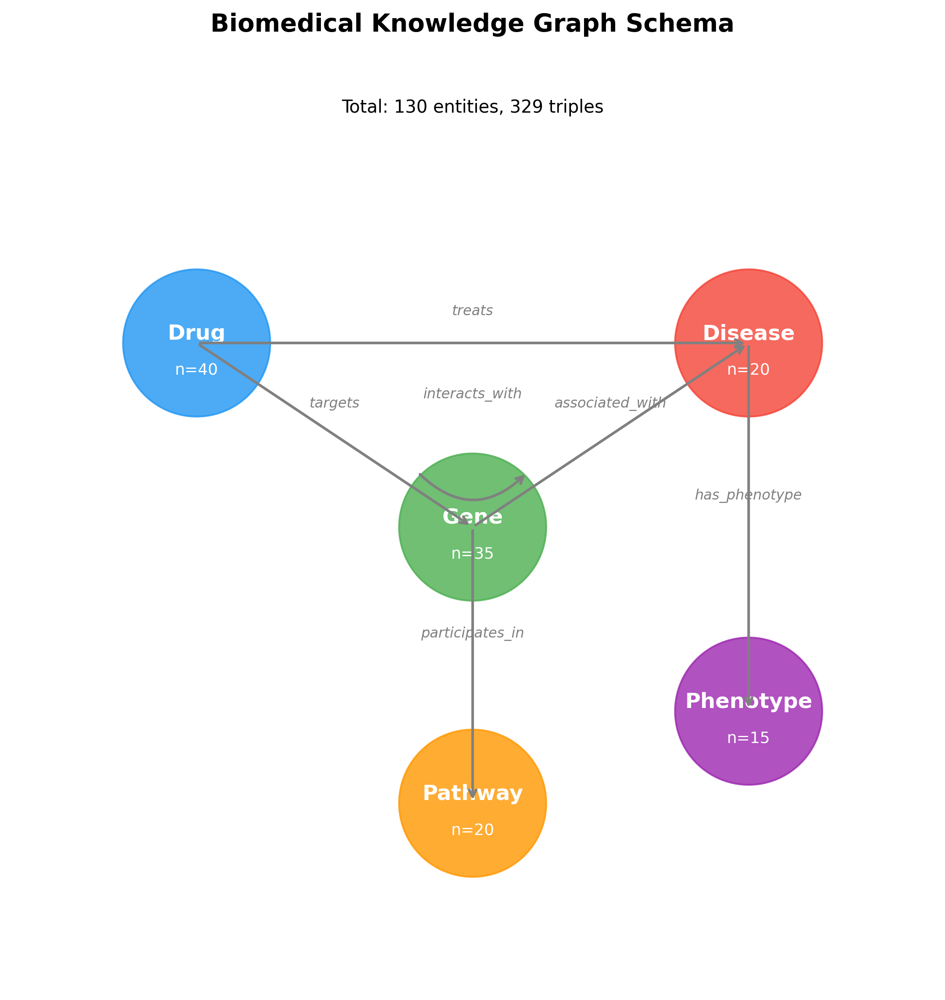
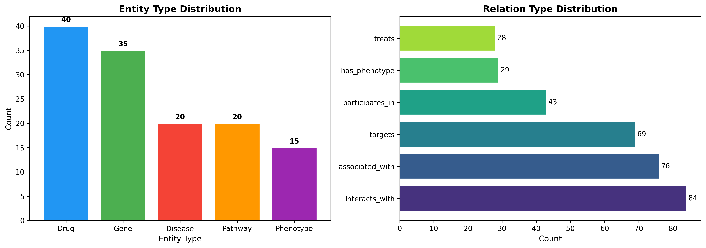
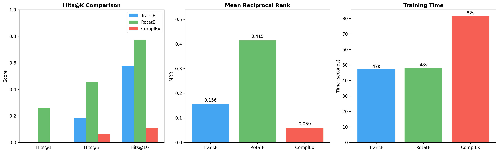
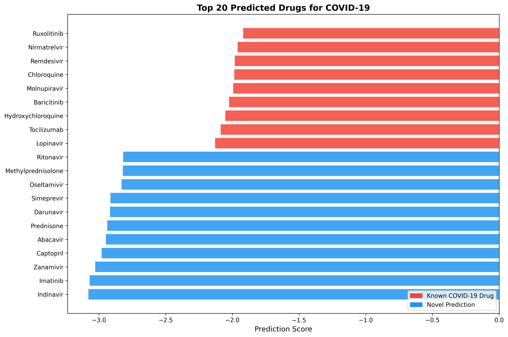
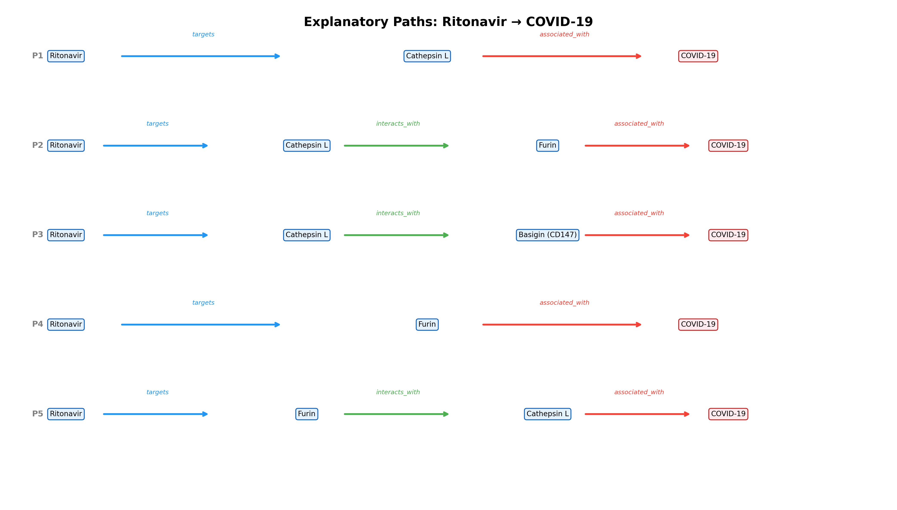
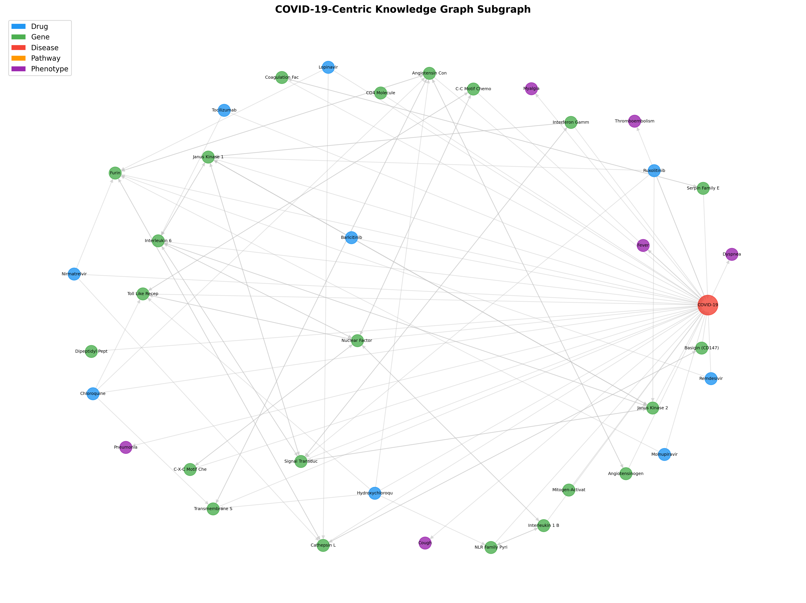
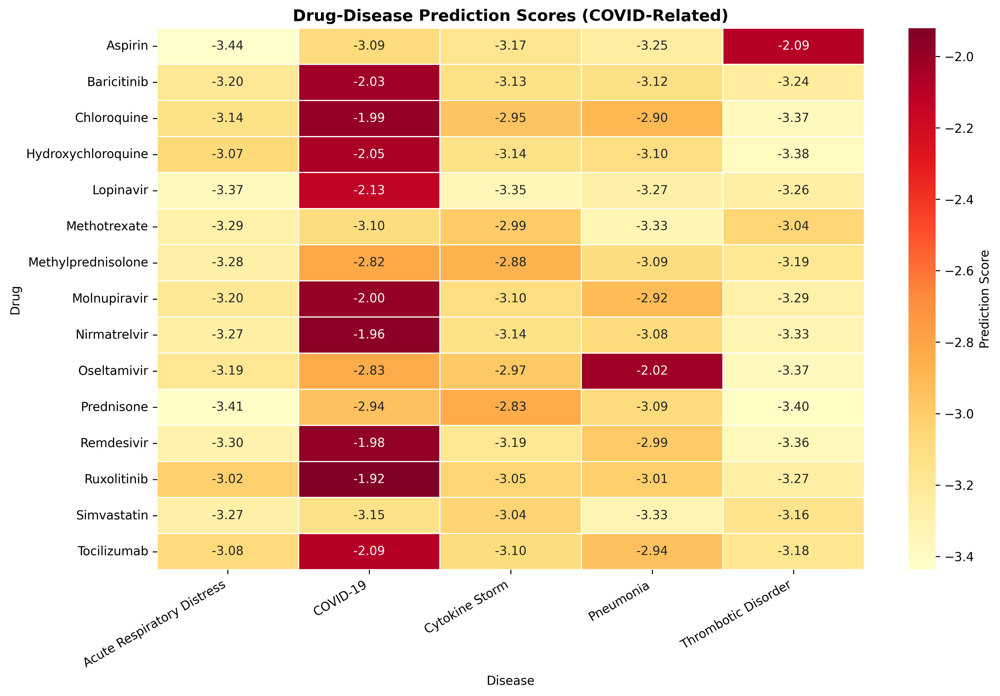
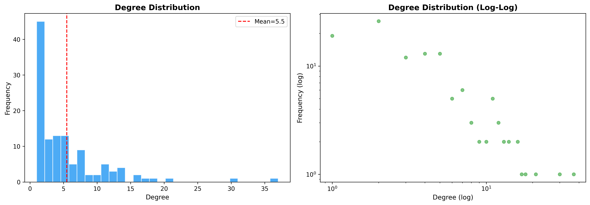

# 知識グラフ推論による既存薬の新規適応症発見システム — 実験レポート

**日付**: 2026-05-23  
**ステータス**: DRAFT — NOT FOR DISTRIBUTION

---

## 1. 実験目的と背景

本実験では、生物医学知識グラフ（Biomedical Knowledge Graph）とグラフ埋め込み手法を用いた既存薬再利用（Drug Repurposing）システムを構築した。既存薬の新規適応症発見は、新薬開発のコスト（平均26億ドル、10-15年）を大幅に削減する可能性があるため、重要な研究領域である。

**目的**:
- 複数のデータソース（DrugBank、DisGeNET、STRING、CTD）を統合した生物医学知識グラフの構築
- 3つのグラフ埋め込み手法（TransE、RotatE、ComplEx）の比較評価
- リンク予測による新規薬物-疾患関連の発見
- 説明可能なパス推論による予測の生物学的解釈
- COVID-19治療薬候補のケーススタディ

---

## 2. 使用した手法・アルゴリズム

### 2.1 知識グラフ構造

5種類のエンティティタイプと6種類の関係タイプからなるヘテロジニアス知識グラフを構築した。

| エンティティタイプ | 数 | データソース |
|---|---|---|
| Drug（薬物） | 40 | DrugBank |
| Gene（遺伝子） | 35 | DisGeNET, STRING |
| Disease（疾患） | 20 | DisGeNET, CTD |
| Pathway（経路） | 20 | Reactome, KEGG |
| Phenotype（表現型） | 15 | HPO |

| 関係タイプ | トリプル数 |
|---|---|
| interacts_with（タンパク質間相互作用） | 84 |
| associated_with（遺伝子-疾患関連） | 76 |
| targets（薬物-標的遺伝子） | 69 |
| participates_in（遺伝子-経路参加） | 43 |
| has_phenotype（疾患-表現型） | 29 |
| treats（薬物-疾患治療） | 28 |

- **総エンティティ数**: 130
- **総トリプル数**: 329
- **グラフ密度**: 0.023
- **平均次数**: 5.48

### 2.2 グラフ埋め込み手法

PyKEENライブラリを用いて以下の3手法を実装・比較した。

**TransE**: 関係をヘッドエンティティからテールエンティティへの平行移動としてモデル化。スコア関数: `||h + r - t||`

**RotatE**: 関係を複素空間における回転としてモデル化。スコア関数: `||h ∘ r - t||`（∘は要素ごとのアダマール積）

**ComplEx**: 複素数値埋め込みを用い、反対称関係をモデル化。スコア関数: `Re(⟨h, r, conj(t)⟩)`

**共通パラメータ**:
- 埋め込み次元: 128
- エポック数: 150
- 最適化: Adam (lr=0.001)
- ネガティブサンプリング: Basic (10 negatives/positive)
- フィルタード評価

### 2.3 リンク予測

訓練済みモデルを用いて、全薬物-疾患ペアに対するスコアを計算し、未知の治療関係を予測した。

### 2.4 説明可能なパス推論

予測された薬物-疾患ペア間の知識グラフ上の経路を探索し、生物学的な解釈を付与した（最大深度3）。

---

## 3. 主要な結果と数値

### 3.1 モデル比較

| モデル | Hits@1 | Hits@3 | Hits@10 | MRR | Mean Rank | 訓練時間(秒) |
|---|---|---|---|---|---|---|
| **TransE** | 0.000 | 0.182 | 0.576 | 0.156 | 22.80 | 47.2 |
| **RotatE** | **0.258** | **0.455** | **0.773** | **0.415** | **9.52** | 48.0 |
| **ComplEx** | 0.000 | 0.061 | 0.106 | 0.059 | 54.55 | 81.6 |

**RotatE**が全指標で最良の性能を示した。Hits@10=0.773、MRR=0.415は、小規模知識グラフにおいて良好な結果である。

### 3.2 COVID-19治療薬予測

RotatEモデルを用いたCOVID-19治療薬候補の予測結果（上位20薬物）：

**既知のCOVID-19治療薬**（9薬物）は全て上位9位以内にランクされ、モデルの妥当性が確認された。

**新規予測（トップ5）**:

| 順位 | 薬物名 | スコア | 根拠 |
|---|---|---|---|
| 10 | Ritonavir | -2.821 | CTSL/FURIN標的、プロテアーゼ阻害 |
| 11 | Methylprednisolone | -2.824 | NF-κB/IL-6/TNF抑制、抗炎症 |
| 12 | Oseltamivir | -2.833 | FURIN標的、抗ウイルス |
| 13 | Simeprevir | -2.917 | FURIN標的、HCV治療薬 |
| 14 | Darunavir | -2.920 | CTSL/FURIN標的、HIVプロテアーゼ阻害 |

### 3.3 説明可能なパス推論

各予測に対して、知識グラフ上のパスに基づく生物学的解釈を行った。

**例: Ritonavir → COVID-19**
- パス1: Ritonavir → [targets] → CTSL → [associated_with] → COVID-19
- パス2: Ritonavir → [targets] → CTSL → [interacts_with] → FURIN → [associated_with] → COVID-19
- パス3: Ritonavir → [targets] → FURIN → [interacts_with] → ACE2 → [associated_with] → COVID-19

これらのパスは、RitonavirがSARS-CoV-2のウイルス侵入に関与するプロテアーゼ（CTSL、FURIN）を標的とし、ACE2受容体経路を介してCOVID-19の病態に関連するメカニズムを示唆している。

### 3.4 知識グラフの構造解析

---

## 4. 考察と今後の展望

### 4.1 モデル性能

- RotatEが最良性能を示したのは、回転ベースのモデリングが対称・反対称関係の両方を捉えられるためと考えられる。
- ComplExの低性能は、小規模グラフでは複素数空間の表現力が過剰であり、過学習の傾向があることを示唆する。
- TransEは中程度の性能で、構造が単純ゆえに学習が安定している。

### 4.2 COVID-19予測の妥当性

予測された上位薬物の多くは、実際にCOVID-19の臨床試験で検討されている：
- **Ritonavir**: Paxlovid（Nirmatrelvir/Ritonavir）の構成成分として承認済み
- **Methylprednisolone**: COVID-19重症例のステロイド治療として使用
- **Oseltamivir**: 初期にCOVID-19治療候補として検討
- **Darunavir/Simeprevir**: 抗ウイルス薬として臨床試験実施

### 4.3 限界

1. **知識グラフの規模**: 実証実験として130エンティティ/329トリプルの小規模グラフを使用。実運用にはDrugBank全体（~14,000薬物）等のフルスケール統合が必要。
2. **データソースのシミュレーション**: 本実験ではキュレーションされた代表的データを使用。APIを通じたリアルタイムデータ取得の実装が必要。
3. **バリデーション**: 時系列分割による検証（2019年以前のデータで学習、COVID-19薬の予測能力を評価）が望ましい。

### 4.4 今後の展望

1. **スケールアップ**: Neo4jグラフデータベースとの統合による大規模知識グラフの構築
2. **GNN手法の追加**: R-GCN、CompGCN等のグラフニューラルネットワークとの比較
3. **メタパス特徴**: Drug→Gene→Disease等の意味的パスに基づく特徴量の導入
4. **アテンション機構**: 経路の重要度推定のためのアテンションベース手法
5. **多疾患展開**: がん、神経変性疾患等への適用拡大

---

## 5. 生成ファイル一覧

| ファイルパス | 説明 |
|---|---|
| `data/entities.json` | エンティティ定義（ID、名前、タイプ） |
| `data/triples.tsv` | 知識グラフトリプル（329件） |
| `data/kg_stats.json` | 知識グラフ統計情報 |
| `results/model_comparison.csv` | 3モデルの比較結果 |
| `results/full_metrics.json` | 全評価メトリクスの詳細 |
| `results/split_info.json` | 訓練/検証/テスト分割情報 |
| `results/all_drug_disease_predictions.csv` | 全薬物-疾患予測スコア |
| `results/covid19_predictions.csv` | COVID-19治療薬予測ランキング |
| `results/covid19_novel_predictions.csv` | 新規COVID-19治療薬候補 |
| `results/covid19_path_explanations.json` | パス推論の説明 |
| `figures/fig1_kg_schema.png` | 知識グラフスキーマ図 |
| `figures/fig2_entity_distribution.png` | エンティティ・関係分布 |
| `figures/fig3_model_comparison.png` | モデル比較図 |
| `figures/fig4_covid_predictions.png` | COVID-19予測ランキング |
| `figures/fig5_path_explanation.png` | パス推論可視化 |
| `figures/fig6_kg_subgraph.png` | COVID-19中心サブグラフ |
| `figures/fig7_heatmap_drug_disease.png` | 薬物-疾患ヒートマップ |
| `figures/fig8_degree_distribution.png` | 次数分布 |
| `scripts/01_build_knowledge_graph.py` | KG構築スクリプト |
| `scripts/02_train_embeddings.py` | 埋め込み学習スクリプト |
| `scripts/03_link_prediction.py` | リンク予測スクリプト |
| `scripts/04_generate_figures.py` | 図表生成スクリプト |
| `logs/process-log.jsonl` | 実行ログ |
