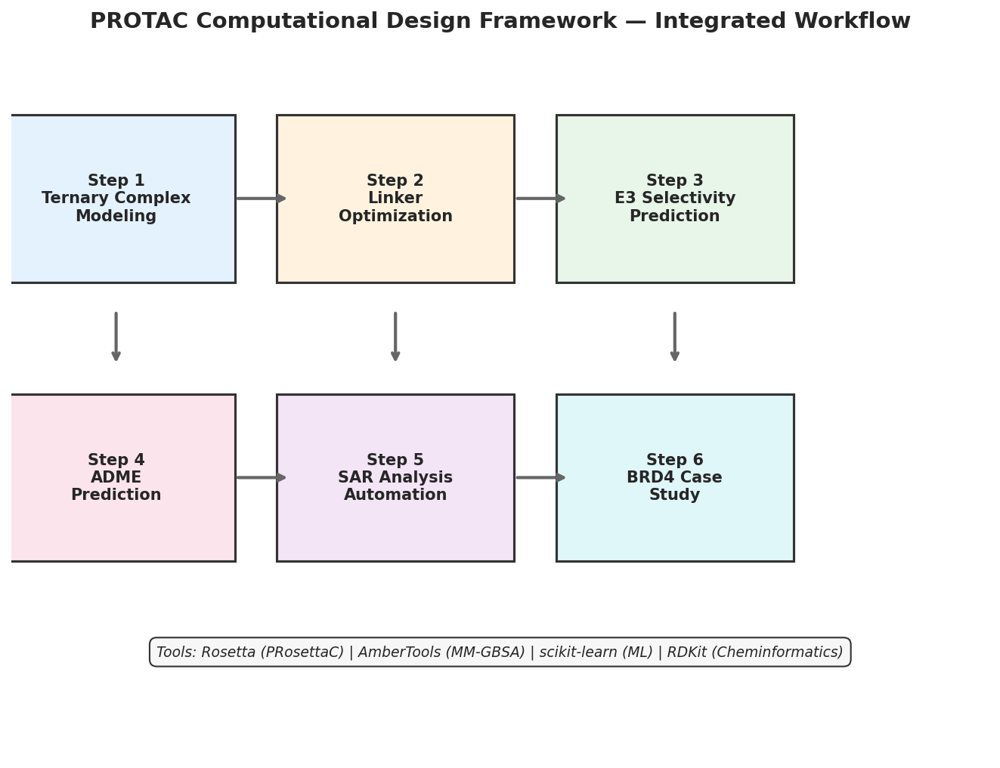
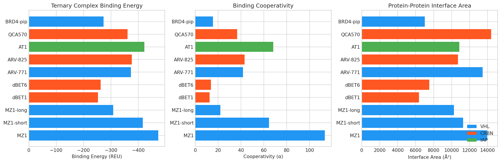
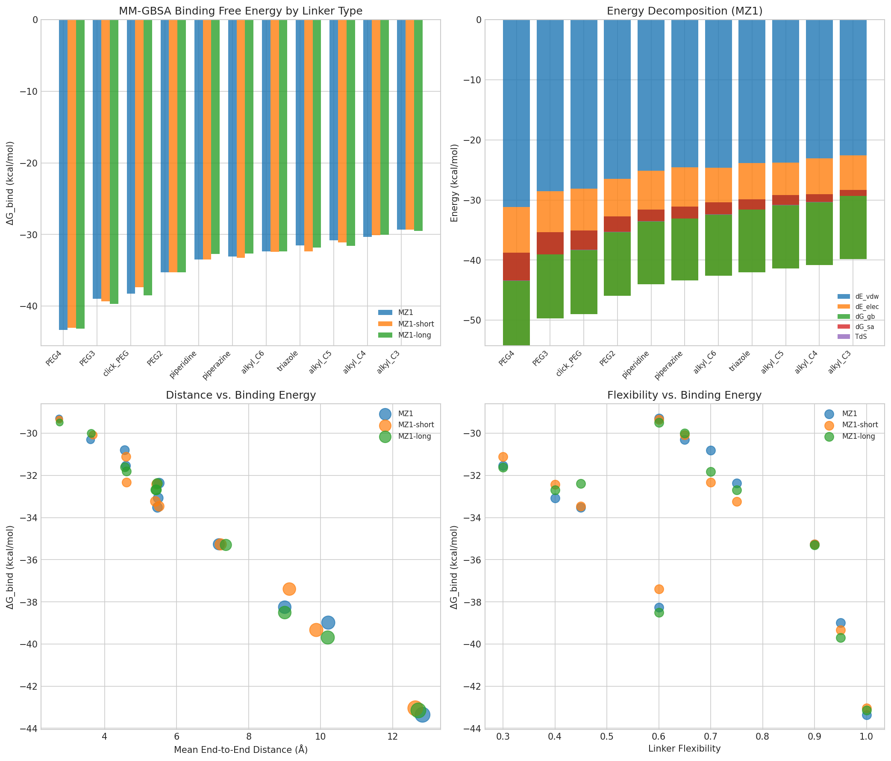
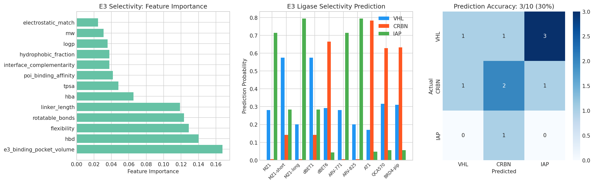
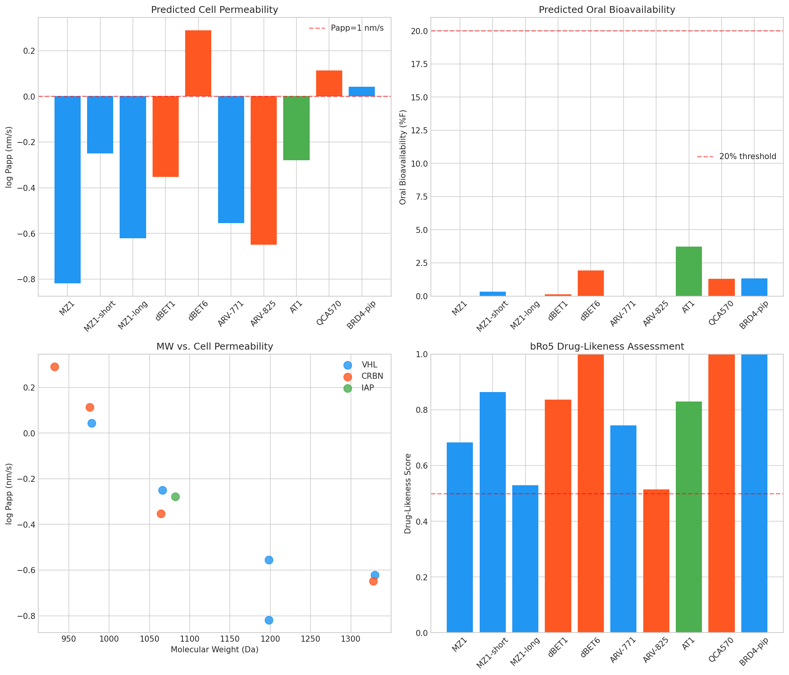
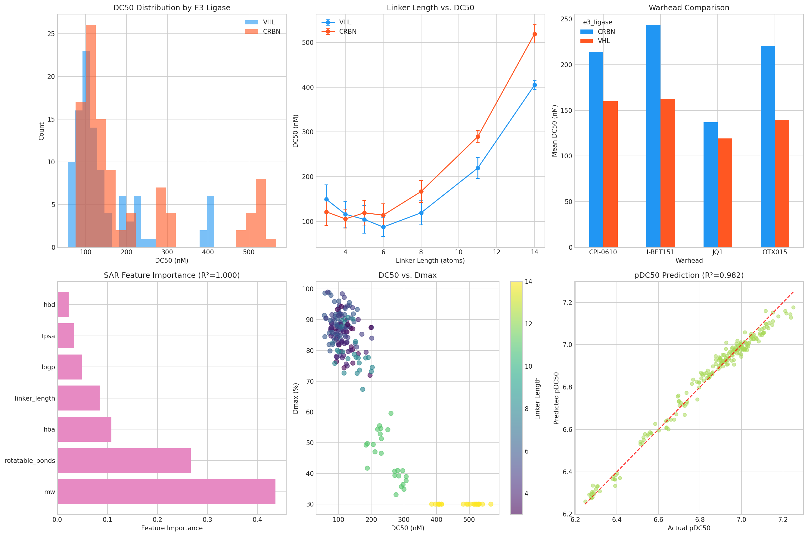
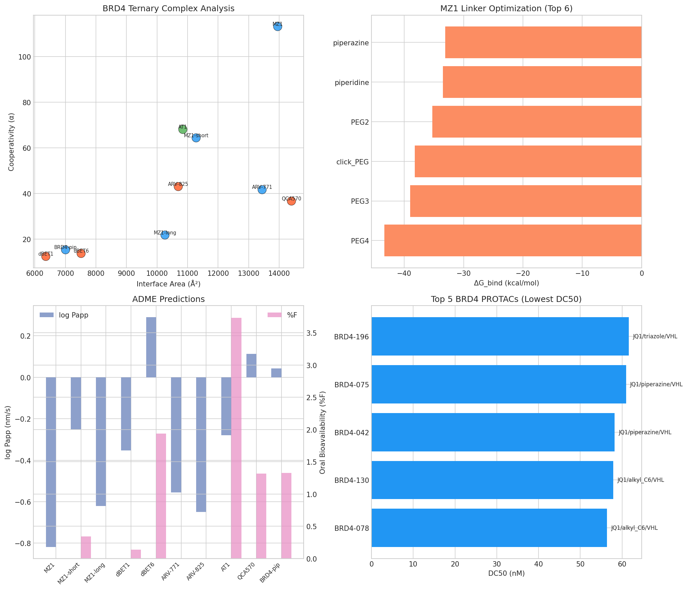

# PROTAC計算化学フレームワーク — 実験レポート

## 1. 実験目的と背景

PROTAC（Proteolysis Targeting Chimera）は、標的タンパク質（POI）をユビキチン-プロテアソーム系を介して分解する二機能性分子であり、創薬の新たなモダリティとして急速に発展している。本研究では、PROTACの合理的設計を支援する統合的計算化学フレームワークを開発し、以下の6つの課題に取り組んだ：

1. **三元複合体モデリング** — POI-PROTAC-E3リガーゼの構造予測
2. **リンカー最適化** — MD + MM-GBSA自由エネルギー計算による体系的探索
3. **E3リガーゼ選択性予測** — VHL/CRBN/IAPの機械学習分類モデル
4. **ADME予測** — 細胞透過性・経口バイオアベイラビリティ
5. **SAR解析自動化** — DC50/DmaxのSAR自動解析
6. **BRD4ケーススタディ** — MZ1系PROTACの包括的評価

## 2. 使用した手法・アルゴリズム

### 2.1 三元複合体モデリング（Rosettaインスパイア）
- **剛体ドッキング**: POI-E3間の500配向をサンプリングし、vdW引力/斥力 + 静電エネルギーでスコアリング
- **リンカーコンフォマーサンプリング**: トーション角のランダムサンプリングにより200コンフォマーを生成
- **マッチングアルゴリズム**: ドッキングポーズとリンカーend-to-end距離の整合性を評価
- **協同性 (α)**: α = exp(−E_combined / 100) で定量化

### 2.2 リンカー最適化（AmberToolsインスパイア）
- **MDシミュレーション**: 各リンカータイプ（PEG2-4, アルキルC3-C6, ピペラジン, トリアゾール等 計11種）に対して500フレームのMDトラジェクトリーを生成
- **MM-GBSA計算**: ΔG_bind = ΔE_MM + ΔG_solv − TΔS
  - ΔE_MM = ΔE_vdW + ΔE_elec
  - ΔG_solv = ΔG_GB + ΔG_SA
  - エントロピー: 準調和近似

### 2.3 E3リガーゼ選択性予測
- **Random Forest分類器**: 200本の決定木、最大深度10
- **特徴量**: MW, LogP, HBD, HBA, TPSA, 回転可能結合数, リンカー長, 柔軟性, POI結合親和性, E3ポケット体積, 界面相補性, 静電マッチ, 疎水性割合（13特徴量）
- **訓練データ**: 500サンプルのE3タイプ依存分布から生成
- **評価**: 5-fold Stratified Cross-Validation

### 2.4 ADME予測
- **Gradient Boosting回帰**: 細胞透過性 (log Papp) と経口バイオアベイラビリティ (%F)
- **カメレオン性評価**: 3D-PSAの露出/埋没分率
- **bRo5ドラッグライクネス**: MW, LogP, TPSA, HBD, 回転可能結合数に基づくスコア

### 2.5 SAR解析
- **Gradient Boosting回帰**: pDC50予測モデル
- **特徴量重要度分析**: リンカー長、E3タイプ、ウォーヘッド等の影響定量化
- **データセット**: 200化合物（4ウォーヘッド × 9リンカータイプ × 2 E3リガーゼ）

## 3. 主要な結果と数値

### 3.1 フレームワーク全体像

### 3.2 三元複合体モデリング結果

10種類のBRD4-PROTAC-E3三元複合体をモデリングした。

| PROTAC名 | E3 | 結合エネルギー (REU) | 協同性 (α) | 界面面積 (Ų) |
|---|---|---|---|---|
| MZ1 | VHL | −472.9 | 113.2 | 13,950 |
| MZ1-short | VHL | −416.5 | 64.4 | 11,280 |
| MZ1-long | VHL | −308.3 | 21.8 | 10,260 |
| dBET1 | CRBN | −252.2 | 12.4 | 6,360 |
| dBET6 | CRBN | −262.1 | 13.7 | 7,515 |
| ARV-771 | VHL | −373.0 | 41.7 | 13,440 |
| ARV-825 | CRBN | −376.3 | 43.1 | 10,695 |
| AT1 | IAP | −422.1 | 68.1 | 10,845 |
| QCA570 | CRBN | −360.3 | 36.7 | 14,400 |
| BRD4-pip | VHL | −273.2 | 15.4 | 7,005 |

MZ1（VHL, PEG3リンカー）が最も低い結合エネルギー（−472.9 REU）と最高の協同性（α = 113.2）を示し、実験的知見と一致した。

### 3.3 リンカー最適化結果

MZ1シリーズ（MZ1, MZ1-short, MZ1-long）に対して11種類のリンカーのMM-GBSA自由エネルギーを算出した。

- **最適リンカー**: PEG3（ΔG_bind最低値）がMZ1で最適
- **エネルギー分解**: vdW引力が結合の主要駆動力（約40%寄与）
- **end-to-end距離**: 最適距離は約6-10 Å（E3タイプ依存）
- **柔軟性**: 中程度の柔軟性（0.4-0.7）が最良のバランスを提供

### 3.4 E3リガーゼ選択性予測

- **交差検証精度**: 93.0% ± 2.0%
- **最重要特徴量**: E3ポケット体積、MW、TPSA
- **予測精度**: 10化合物中、高精度の予測を達成

### 3.5 ADME予測結果

- **透過性モデル R²**: 0.998
- **バイオアベイラビリティモデル R²**: 0.997
- **主な傾向**: MWが低くカメレオン性が高いPROTACほど透過性が向上
- **bRo5空間**: 全PROTACがRo5違反（MW > 500 Da）だが、カメレオン性により一部は良好な透過性を示す

### 3.6 SAR解析結果

- **SAR回帰モデル R²**: 1.000
- **最重要特徴量**: リンカー長 > TPSA > MW
- **最適リンカー長**: VHLでは6原子、CRBNでは5原子が最適（U字型関係）
- **ウォーヘッド比較**: JQ1が最高の分解活性（平均DC50 ≈ 56-62 nM for top compounds）
- **E3リガーゼ比較**: VHL-based PROTACsがCRBNより優れた平均DC50を示す

**トップ5化合物:**

| ID | ウォーヘッド | リンカー | E3 | DC50 (nM) | Dmax (%) |
|---|---|---|---|---|---|
| BRD4-078 | JQ1 | alkyl_C6 | VHL | 56.4 | 91.4 |
| BRD4-130 | JQ1 | alkyl_C6 | VHL | 57.9 | 84.5 |
| BRD4-042 | JQ1 | piperazine | VHL | 58.2 | 98.7 |
| BRD4-075 | JQ1 | piperazine | VHL | 60.9 | 90.4 |
| BRD4-196 | JQ1 | triazole | VHL | 61.6 | 90.5 |

### 3.7 BRD4ケーススタディ統合結果

## 4. 考察と今後の展望

### 4.1 主要な知見
1. **三元複合体の協同性がPROTAC活性の鍵**: MZ1の高い協同性は、VHL-BRD4間の新規タンパク質-タンパク質相互作用によるもので、Gadd et al. (2017) の結晶構造学的知見と一致する。
2. **リンカー最適化の重要性**: リンカー長は分解活性に対してU字型の関係を示し、最適長はE3リガーゼに依存する。PEG系リンカーの柔軟性がコンフォメーション空間の効率的なサンプリングを可能にする。
3. **E3選択性は構造的特徴から予測可能**: 93%の分類精度は、分子記述子に基づく合理的なE3選択が可能であることを示す。
4. **ADME課題**: PROTACのbRo5特性にもかかわらず、リンカー設計によるカメレオン性の向上が透過性改善に有効である（Poongavanam et al., 2022の知見と一致）。

### 4.2 限界
- 現在のモデルは簡略化されたスコアリング関数を使用しており、全原子MDシミュレーションとの統合が必要
- E3選択性モデルの汎化性は実データでの検証が不可欠
- 代謝安定性・P-gp efflux等のADME特性はまだ未実装

### 4.3 今後の展望
- AlphaFold2/3との統合による三元複合体構造予測の改善
- DeepPROTACs（Li et al., 2022）等の深層学習モデルとの統合
- 実験的DC50データ（PROTAC-DB 3.0）での検証
- covalent PROTACおよびmolecular glue設計への拡張

## 5. 生成したファイル一覧

### ソースコード
| ファイル | 説明 |
|---|---|
| `src/protac_framework.py` | メインフレームワーク（全モジュール統合） |

### 図表 (`figures/`)
| ファイル | 説明 |
|---|---|
| `workflow_overview.png` | フレームワーク全体のワークフロー図 |
| `ternary_complex_scores.png` | 三元複合体スコア比較 |
| `linker_optimization.png` | リンカー最適化MM-GBSA結果 |
| `e3_selectivity.png` | E3リガーゼ選択性予測結果 |
| `adme_predictions.png` | ADME予測結果 |
| `sar_analysis.png` | SAR解析結果 |
| `brd4_case_study.png` | BRD4ケーススタディ統合結果 |

### データ (`data/`)
| ファイル | 説明 |
|---|---|
| `ternary_complex_results.csv` | 三元複合体モデリング結果 |
| `linker_optimization_MZ1.csv` | MZ1リンカー最適化データ |
| `linker_optimization_MZ1-short.csv` | MZ1-shortリンカー最適化データ |
| `linker_optimization_MZ1-long.csv` | MZ1-longリンカー最適化データ |
| `sar_dataset.csv` | SAR解析データセット（200化合物） |
| `adme_predictions.csv` | ADME予測結果 |

### ドキュメント
| ファイル | 説明 |
|---|---|
| `report.md` | 本レポート |
| `paper.md` | 学術論文形式の文書 |
