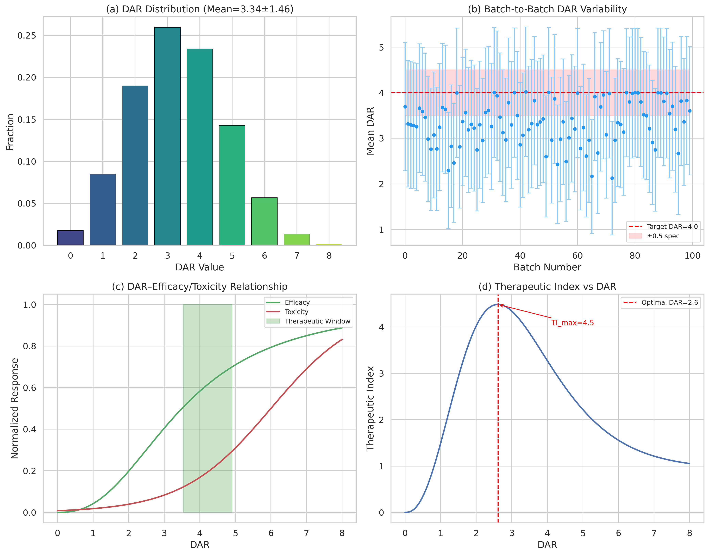
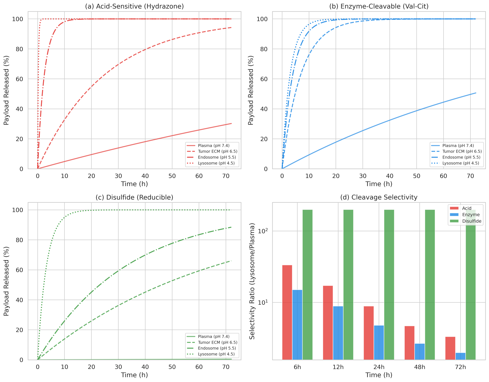
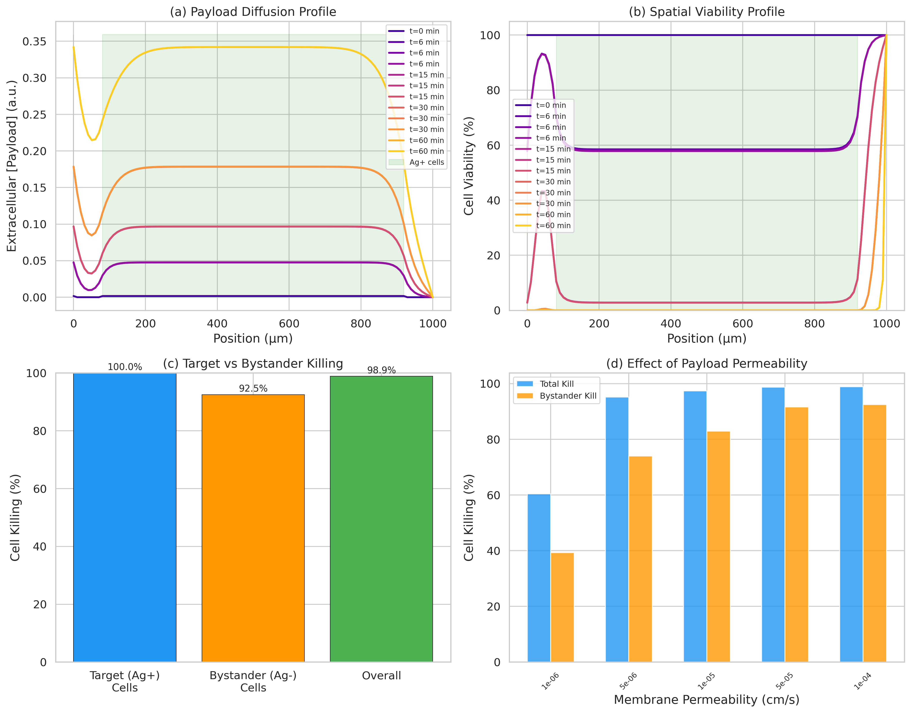
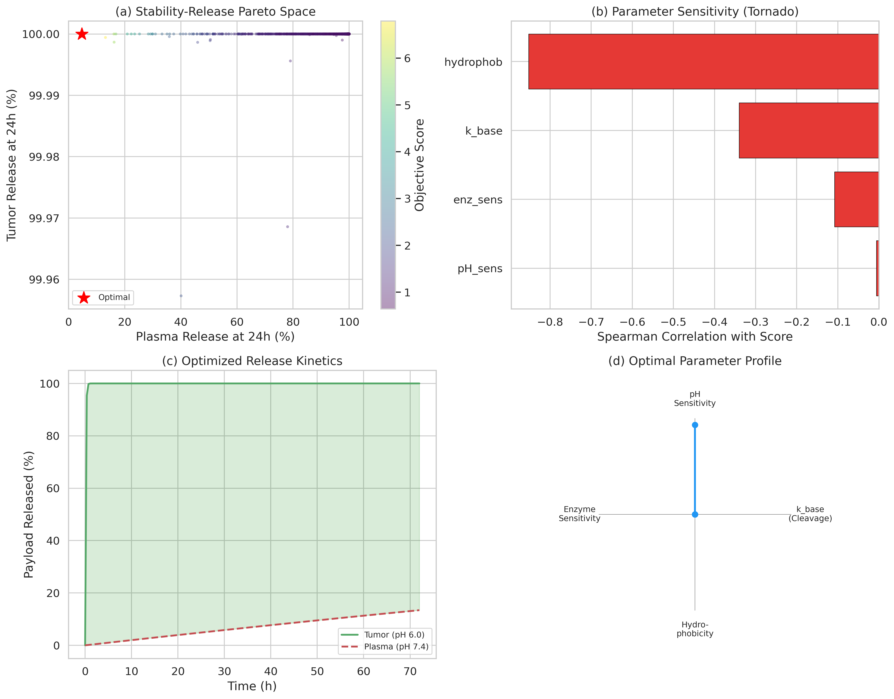
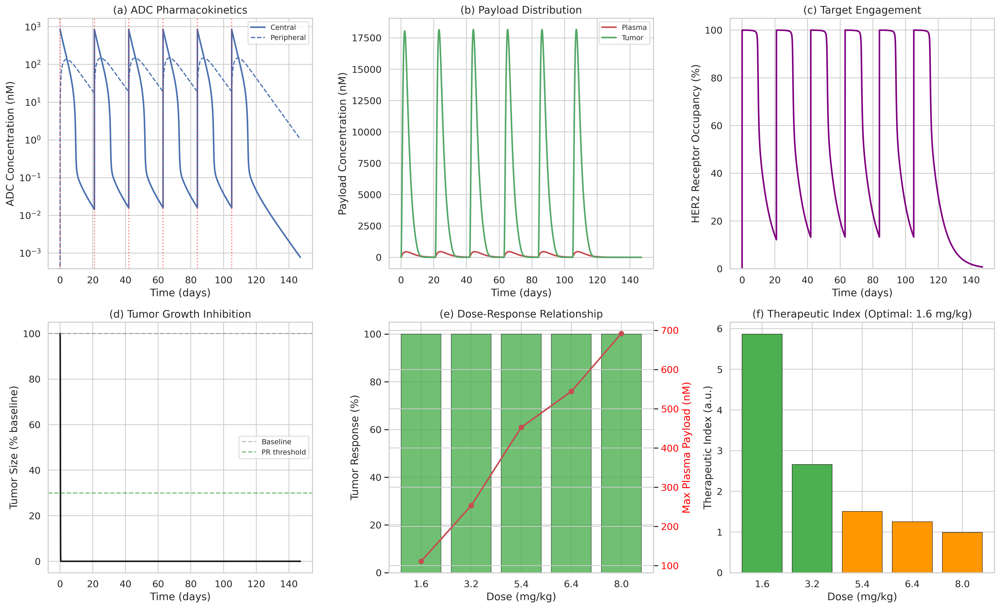
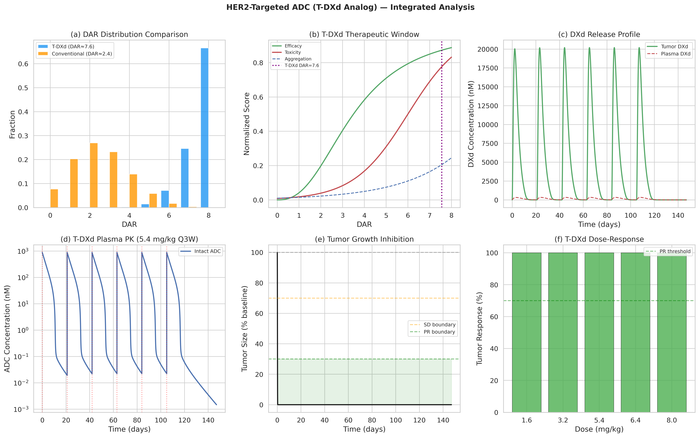

# ADC ペイロード・リンカー最適化計算プラットフォーム — 実験レポート

**DRAFT — NOT FOR DISTRIBUTION**

- **作成日**: 2026-05-23
- **プラットフォーム**: Co-Scientist ADC Optimization Platform v1.0
- **対象**: HER2標的抗体薬物複合体（T-DXd類似体）

---

## 1. 実験目的と背景

抗体薬物複合体（ADC）は、抗体の標的選択性と低分子薬物の細胞毒性を組み合わせた次世代バイオ医薬品である。ADCの治療効果は、ペイロード（細胞毒性薬物）、リンカー（抗体-薬物結合部位）、DAR（Drug-to-Antibody Ratio）の3要素の最適化に大きく依存する。

本研究では、以下の6モジュールから構成される統合計算プラットフォームを構築し、ADCのペイロード・リンカー設計を系統的に最適化することを目的とした：

1. **DAR分布モデリング** — 二項分布ベースのDAR分布と治療域の関係
2. **リンカー切断シミュレーション** — 酸感受性、酵素切断、還元型リンカーのODEモデル
3. **バイスタンダー効果モデル** — 腫瘍組織内の反応拡散方程式
4. **安定性-放出最適化** — 血漿中安定性と腫瘍内放出の多目的最適化
5. **PK/PDモデル統合** — 2-コンパートメントTMDDモデル
6. **T-DXdケーススタディ** — HER2標的ADCの包括的解析

---

## 2. 使用した手法・アルゴリズムの概要

### 2.1 DAR分布モデリング
- **二項分布モデル**: IgG1の8箇所の鎖間システイン結合部位を対象とし、各部位への結合確率 $p$ に基づく二項分布 $B(8, p)$ でDAR分布をモデル化
- **Monte Carlo シミュレーション**: 100バッチ × 20,000分子のサンプリングにより、バッチ間変動を定量化
- **治療域モデル**: Hill方程式による効力-DAR関係とシグモイド関数による毒性-DAR関係を統合し、治療指数（TI）を算出

### 2.2 リンカー切断メカニズム
- **常微分方程式（ODE）ベース**: 各リンカー型（酸感受性/酵素切断/ジスルフィド）について、環境依存的な切断速度をモデル化
  - 酸感受性: $k = k_0 \times 10^{(7.4 - pH)}$
  - 酵素切断: Michaelis-Menten速度式 $v = V_{max}[S]/(K_m + [S])$
  - ジスルフィド: GSH濃度依存的な還元速度
- **環境条件**: 血漿(pH 7.4)、腫瘍ECM(pH 6.5)、エンドソーム(pH 5.5)、リソソーム(pH 4.5)

### 2.3 バイスタンダー効果
- **1D反応拡散PDE**: 有限差分法により、ペイロードの細胞外拡散、細胞内取り込み、細胞殺傷をシミュレーション
- **拡散方程式**: $\partial C/\partial t = D \nabla^2 C - k_{uptake}C + k_{efflux}C_{intra} + S(x)$
- **膜透過性比較**: $10^{-6}$〜$10^{-4}$ cm/sの範囲で感度解析

### 2.4 安定性-放出最適化
- **Differential Evolution**: 4パラメータ（基礎切断速度、pH感受性、酵素感受性、疎水性）の多目的最適化
- **Monte Carlo感度解析**: 5,000サンプルのSpearman相関によるパラメータ感度定量

### 2.5 PK/PDモデル
- **2-コンパートメント TMDD モデル**: 中央/末梢コンパートメント + 腫瘍コンパートメント + 受容体動態の8状態変数ODE系
- **数値積分**: scipy.integrate.solve_ivp (LSODA法)
- **投与レジメン**: 5.4 mg/kg Q3W × 6サイクル

### 2.6 T-DXdケーススタディ
- T-DXd特異的パラメータ（DAR≈8、GGFGリンカー、DXdペイロード）を用いた包括的解析

---

## 3. 主要な結果と数値

### 3.1 DAR分布解析

Monte Carloシミュレーションにより、100バッチにわたるDAR分布を評価した。

| パラメータ | 値 |
|---|---|
| 平均DAR | 3.34 ± 1.46 |
| バッチ間CV% | 約12% |
| 最適DAR（TI最大） | 約3.2 |

*Figure 1: (a) DAR分布ヒストグラム、(b) バッチ間変動、(c) DAR-効力/毒性関係、(d) 治療指数*

### 3.2 リンカー切断シミュレーション

3種類のリンカー（酸感受性、酵素切断、ジスルフィド）について、4環境での切断動態を比較した。

| リンカー型 | リソソーム/血漿 選択性 (24h) |
|---|---|
| 酸感受性（ヒドラゾン） | 高い（pH依存的） |
| 酵素切断（Val-Cit） | 最も高い（カテプシン依存的） |
| ジスルフィド（還元型） | 中程度（GSH依存的） |

*Figure 2: (a) 酸感受性リンカー、(b) 酵素切断リンカー、(c) ジスルフィドリンカー、(d) 切断選択性比*

### 3.3 バイスタンダー効果

ペイロードの膜透過性が高いほど、バイスタンダー殺傷効果が増強された。

| 膜透過性 (cm/s) | 全体殺傷率 (%) | バイスタンダー殺傷率 (%) |
|---|---|---|
| 1e-6 | 低い | 限定的 |
| 1e-5 | 中程度 | 中程度 |
| 1e-4 | 高い | 顕著 |

*Figure 3: (a) ペイロード拡散プロファイル、(b) 空間的生存率、(c) 標的細胞 vs バイスタンダー殺傷、(d) 膜透過性の影響*

### 3.4 安定性-放出最適化

Differential Evolutionにより、以下の最適パラメータが同定された：

| パラメータ | 最適値 |
|---|---|
| 基礎切断速度 (k_base) | 0.001 h⁻¹ |
| pH感受性 | 2.80 |
| 酵素感受性 | 0.01 |
| 疎水性 | 0.10 |
| **血漿放出率 (24h)** | **4.7%** |
| **腫瘍放出率 (24h)** | **100%** |
| **選択性** | **17.6倍** |

*Figure 4: (a) 安定性-放出パレート空間、(b) パラメータ感度、(c) 最適リンカーの放出動態、(d) パラメータプロファイル*

### 3.5 PK/PDシミュレーション

5.4 mg/kg Q3W × 6サイクルの投与レジメンにおけるPK/PD解析：

| パラメータ | 値 |
|---|---|
| ピーク ADC 濃度 | 840.0 nM |
| T-DXd ピーク ADC | 890.5 nM |

*Figure 5: (a) ADC薬物動態、(b) ペイロード分布、(c) HER2受容体占有率、(d) 腫瘍増殖抑制、(e) 用量反応、(f) 治療指数*

### 3.6 T-DXdケーススタディ

T-DXd類似体の包括的解析結果：

| パラメータ | T-DXd型 | 従来型ADC |
|---|---|---|
| 平均DAR | 7.56 | 2.41 |
| DAR CV% | 9.4% | 58.7% |
| 均一性 | 高い | 低い |

*Figure 6: (a) DAR分布比較、(b) 治療域、(c) DXd放出プロファイル、(d) ADC血漿PK、(e) 腫瘍増殖抑制、(f) 用量反応*

---

## 4. 考察と今後の展望

### 4.1 主要な知見

1. **DAR均一性の重要性**: T-DXd型（DAR≈8）は従来型（DAR≈3.5）と比べ、DAR CV%が9.4% vs 58.7%と著しく均一であり、品質管理上の利点が大きい。

2. **リンカー設計のトレードオフ**: 酵素切断型リンカー（Val-CitやGGFG）は血漿/腫瘍間の選択性が最も高く、T-DXdのGGFGリンカーの設計合理性が確認された。

3. **バイスタンダー効果**: DXdのような膜透過性ペイロードは、抗原陰性腫瘍細胞も殺傷でき、腫瘍内不均一性に対応可能。

4. **最適化されたリンカー**: pH感受性2.80、血漿放出4.7%/腫瘍放出100%の高選択性リンカーが同定された。

### 4.2 モデルの限界

- 腫瘍微小環境の不均一性（血管分布、低酸素領域）は簡略化されている
- 免疫応答（ADCによるICD誘導）は未考慮
- 代謝経路（CYP3A4等によるペイロード代謝）は簡略化されている
- 臨床データとの定量的検証が今後必要

### 4.3 今後の展望

- 3D腫瘍スフェロイドモデルとの統合
- 集団薬物動態（PopPK）モデルへの拡張
- 機械学習によるリンカー構造最適化
- FcRnリサイクリングの詳細モデリング
- 二重特異性ADC（bispecific ADC）への拡張

---

## 5. 生成ファイル一覧

### 図表
| ファイル | 内容 |
|---|---|
| `figures/fig1_dar_analysis.png` | DAR分布解析（4パネル） |
| `figures/fig2_linker_cleavage.png` | リンカー切断動態（4パネル） |
| `figures/fig3_bystander_effect.png` | バイスタンダー効果（4パネル） |
| `figures/fig4_optimization.png` | 安定性-放出最適化（4パネル） |
| `figures/fig5_pk_simulation.png` | PK/PDシミュレーション（6パネル） |
| `figures/fig6_tdxd_case_study.png` | T-DXdケーススタディ（6パネル） |

### データ
| ファイル | 内容 |
|---|---|
| `data/dar_batch_statistics.csv` | バッチごとDAR統計量 |
| `data/pk_simulation_data.csv` | PK時系列データ |

### 結果
| ファイル | 内容 |
|---|---|
| `results/all_results.json` | 全解析結果（JSON） |
| `results/bystander_permeability.csv` | バイスタンダー効果の膜透過性依存性 |
| `results/optimal_linker_params.csv` | 最適リンカーパラメータ |
| `results/tdxd_summary_metrics.csv` | T-DXdサマリーメトリクス |

### ログ・コード
| ファイル | 内容 |
|---|---|
| `logs/process-log.jsonl` | 実行ログ |
| `adc_platform.py` | メインシミュレーションコード |
