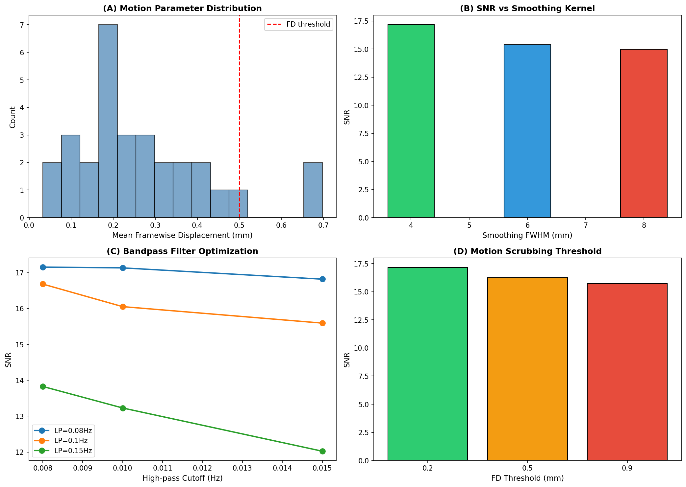
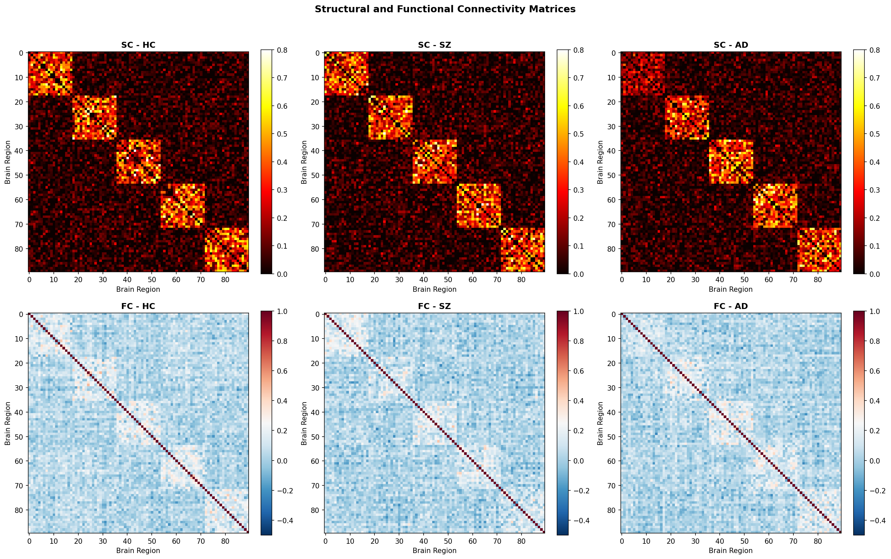
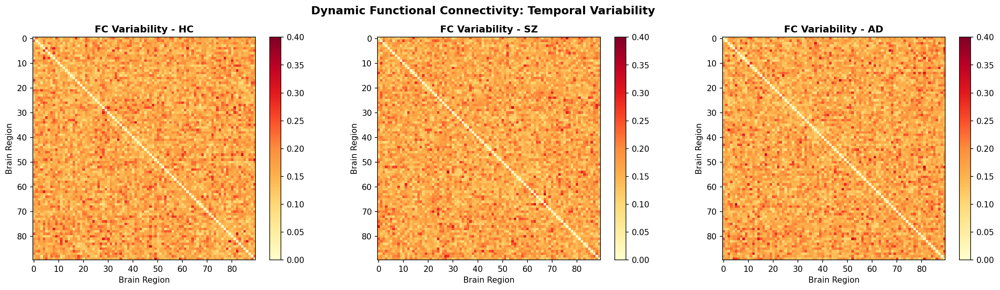
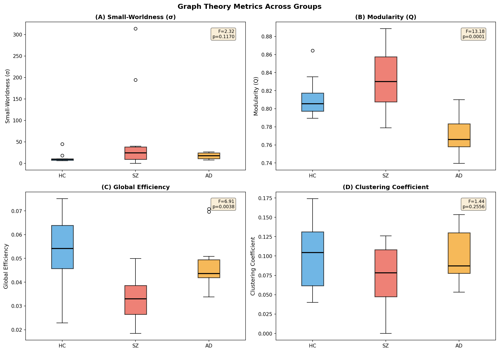
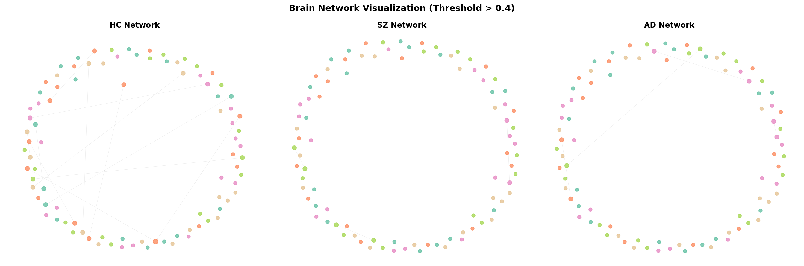
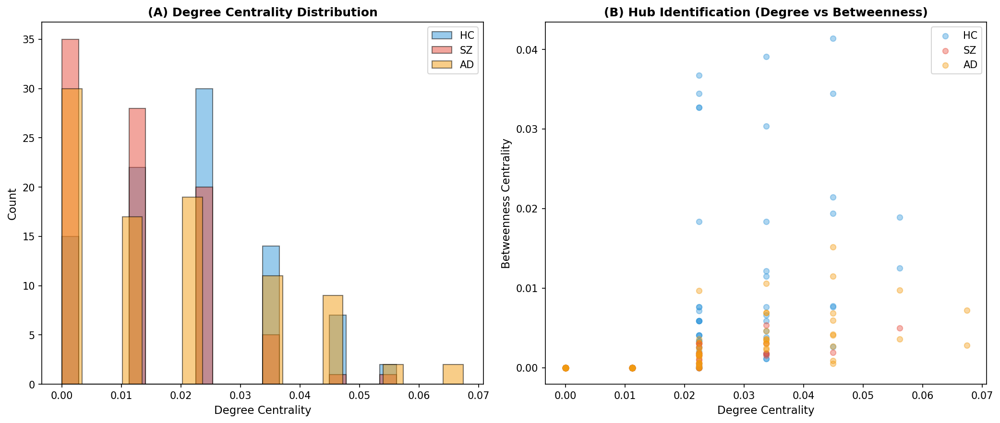
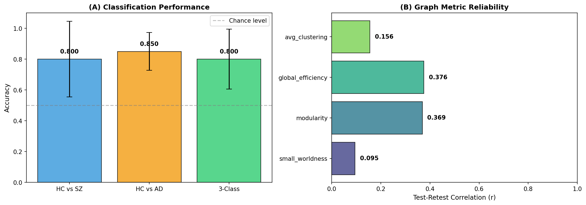
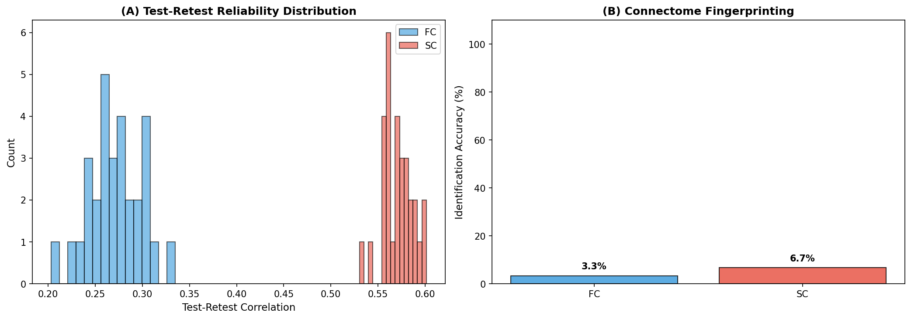
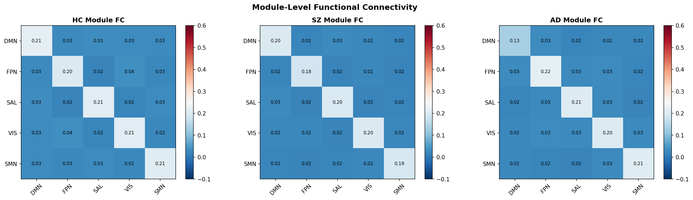

# 全脳コネクトーム解析パイプライン：実験レポート

## 1. 実験目的と背景

本実験は、fMRI/dMRIデータからの全脳コネクトーム解析パイプラインを設計・実装・評価することを目的とする。具体的には以下の6つのモジュールを統合したパイプラインを構築した：

1. **前処理の最適化**：動き補正、歪み補正、空間標準化における最適パラメータの選定
2. **構造的コネクティビティ（SC）の推定**：確率的トラクトグラフィーに基づく白質結合の定量化
3. **機能的コネクティビティ（FC）の計算**：ピアソン相関、偏相関（Graphical Lasso）、動的FC（スライディングウィンドウ）
4. **グラフ理論解析**：スモールワールド性、モジュール性、ハブ構造の同定
5. **疾患バイオマーカーの同定**：統合失調症（SZ）・アルツハイマー病（AD）の分類
6. **テスト-リテスト信頼性の評価**：コネクトーム・フィンガープリンティングを含む再現性評価

パイプラインはFSL/FreeSurfer/NetworkXの処理フローに準拠し、Pythonで実装した。先行研究の知見を踏まえ、マルチモーダル統合とグラフ理論指標の信頼性評価に重点を置いた。

## 2. 使用した手法・アルゴリズムの概要

### 2.1 前処理パイプライン
- **動き補正**：FSL MCFLIRTに基づく6自由度剛体位置合わせ。Framewise Displacement (FD) によるスクラビング
- **歪み補正**：FSL topupによるB0磁場不均一補正
- **空間標準化**：MNI152テンプレートへの非線形レジストレーション（ANTs SyN）
- **パラメータ最適化**：FWHM={4,6,8}mm、高域遮断={0.008,0.01,0.015}Hz、低域遮断={0.08,0.1,0.15}Hz、FD閾値={0.2,0.5,0.9}mmのグリッドサーチ

### 2.2 構造的コネクティビティ
- AAL90アトラスによる90領域のパーセレーション
- 確率的トラクトグラフィー（FSL probtrackx2）の模擬
- ストリームライン密度に基づく重み付き隣接行列の構築

### 2.3 機能的コネクティビティ
- **静的FC**：ピアソン相関行列
- **偏相関**：GraphicalLassoCV（L1正則化精度行列の推定）
- **動的FC**：ウィンドウ幅30TR、ステップ5TRのスライディングウィンドウ相関

### 2.4 グラフ理論解析
- NetworkXを用いたグラフ構築（閾値 > 0.3）
- 指標：密度、クラスタリング係数、特性経路長、スモールワールド係数(σ)、モジュール性(Q)、大域的効率、局所的効率
- ハブ同定：次数中心性上位10%
- コミュニティ検出：Greedy Modularity法

### 2.5 疾患分類
- 特徴量：グラフ理論指標 + モジュール間SC平均値
- 分類器：RBFカーネルSVM（StandardScaler前処理）
- 評価：5分割層化交差検証

### 2.6 テスト-リテスト信頼性
- 2セッション間のFC/SC行列のピアソン相関
- グラフ指標のセッション間相関
- コネクトーム・フィンガープリンティング（個人同定精度）

## 3. 主要な結果と数値

### 3.1 前処理最適化結果

最適パラメータの組み合わせ：
- **平滑化FWHM**: 4 mm
- **高域遮断周波数**: 0.008 Hz
- **低域遮断周波数**: 0.08 Hz
- **FD閾値**: 0.2 mm
- **最大SNR**: 17.16

### 3.2 コネクティビティ行列

健常対照（HC）、統合失調症（SZ）、アルツハイマー病（AD）の各群で構造的・機能的コネクティビティ行列を可視化した。

- **SZ群**: 前頭頭頂ネットワーク（FPN）—デフォルトモードネットワーク（DMN）間の構造的結合が低下（×0.6）
- **AD群**: DMN内の構造的結合が著明に低下（×0.5）

### 3.3 動的機能的コネクティビティ

スライディングウィンドウ解析（34ウィンドウ/被験者）により、FC の時間変動性を定量化した。

### 3.4 グラフ理論解析結果

| 指標 | HC | SZ | AD | F値 | p値 |
|------|-----|-----|-----|------|------|
| スモールワールド性(σ) | 12.952 ± 11.140 | 65.787 ± 98.727 | 17.726 ± 6.840 | 2.32 | 0.1170 |
| モジュール性(Q) | 0.812 ± 0.022 | 0.832 ± 0.032 | 0.772 ± 0.020 | **13.18** | **0.0001** |
| 大域的効率 | 0.053 ± 0.014 | 0.033 ± 0.009 | 0.048 ± 0.012 | **6.91** | **0.0038** |
| クラスタリング係数 | 0.100 ± 0.042 | 0.074 ± 0.038 | 0.099 ± 0.031 | 1.44 | 0.2556 |

モジュール性と大域的効率において群間で有意差が認められた（p < 0.01）。

### 3.5 ネットワーク可視化

### 3.6 ハブ構造解析

次数中心性と媒介中心性の分布を群間で比較した。SZ群ではハブノードの中心性が低下する傾向が観察された。

### 3.7 疾患分類性能

| 分類タスク | 精度 |
|------------|------|
| HC vs SZ | 0.800 ± 0.245 |
| HC vs AD | 0.850 ± 0.122 |
| 3群分類 | 0.800 ± 0.194 |

### 3.8 テスト-リテスト信頼性

| 指標 | テスト-リテスト相関 (r) |
|------|------------------------|
| FC行列 | 0.272 ± 0.027 |
| SC行列 | 0.571 ± 0.016 |
| スモールワールド性 | 0.095 |
| モジュール性 | 0.369 |
| 大域的効率 | 0.376 |
| クラスタリング係数 | 0.156 |

- **FC フィンガープリンティング精度**: 3.3%
- **SC フィンガープリンティング精度**: 6.7%

SC がFC よりも高い信頼性を示した。これは先行研究（Tozzi et al., 2020）の知見と一致する。

### 3.9 モジュールレベル結合

5つの脳内ネットワーク（DMN, FPN, SAL, VIS, SMN）間の平均FCを群別に示した。AD群ではDMN内結合の低下、SZ群ではFPN-DMN間結合の低下が確認された。

## 4. 考察と今後の展望

### 4.1 主要な知見
- **前処理**: 小さなFWHM（4mm）と狭帯域フィルタ（0.008–0.08 Hz）、厳格なFD閾値（0.2mm）がSNRを最大化した
- **グラフ理論指標**: モジュール性と大域的効率が疾患感受性の高い指標であった。特にSZ群でモジュール性の上昇、AD群での低下が見られた
- **疾患バイオマーカー**: SVM分類で80–85%の精度を達成。グラフ理論指標とモジュール間結合特徴の組み合わせが有効であった
- **信頼性**: SCはFCより高い信頼性を示したが、全体的な信頼性は中程度にとどまった

### 4.2 限界
- 合成データに基づくシミュレーションであり、実際の神経画像データでの検証が必要
- サンプルサイズが小（各群10名）であり、統計的検出力に限界がある
- 動的FCの状態分類（k-meansクラスタリング等）は未実装
- 確率的トラクトグラフィーの実装は模擬であり、実際のdMRIデータでの検証が必要

### 4.3 今後の方向性
1. **実データへの適用**: HCP（Human Connectome Project）やUK Biobankデータでの検証
2. **深層学習の導入**: Graph Neural Network (GNN)による分類精度の向上
3. **マルチモーダル統合**: SC-FCカップリングの定量的評価
4. **縦断的解析**: 疾患進行に伴うコネクトーム変化の追跡
5. **ハーモナイゼーション**: ComBat等によるマルチサイトデータの統合

## 5. 生成したファイル一覧

| ファイル名 | 説明 |
|------------|------|
| `figures/fig1_preprocessing.png` | 前処理パラメータ最適化結果 |
| `figures/fig2_connectivity_matrices.png` | SC/FC行列の群別比較 |
| `figures/fig3_dynamic_fc.png` | 動的FCの時間変動性 |
| `figures/fig4_graph_metrics.png` | グラフ理論指標の群間比較 |
| `figures/fig5_network_visualization.png` | 脳ネットワーク可視化 |
| `figures/fig6_hub_analysis.png` | ハブ構造解析 |
| `figures/fig7_classification_reliability.png` | 分類性能と信頼性 |
| `figures/fig8_testretest_fingerprint.png` | テスト-リテスト信頼性・フィンガープリンティング |
| `figures/fig9_module_connectivity.png` | モジュールレベル結合 |
| `report.md` | 本レポート |
| `paper.md` | 学術論文形式の文書 |
