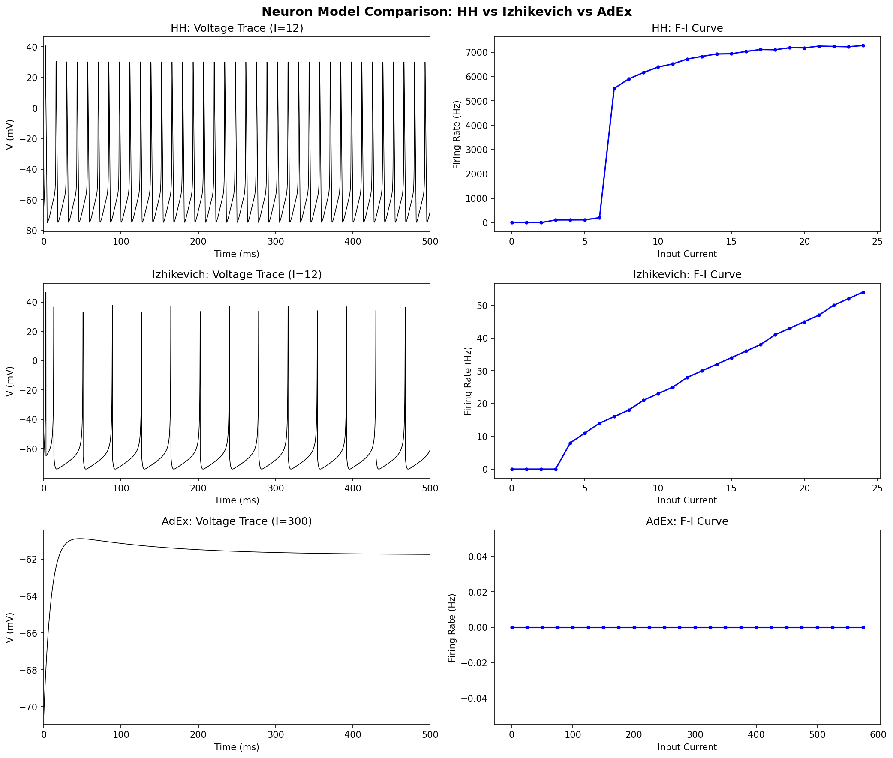
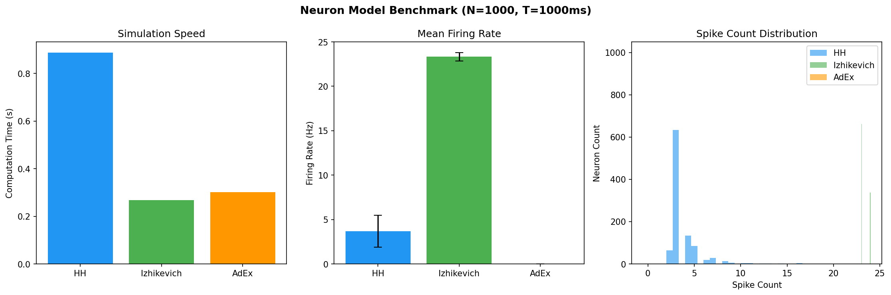
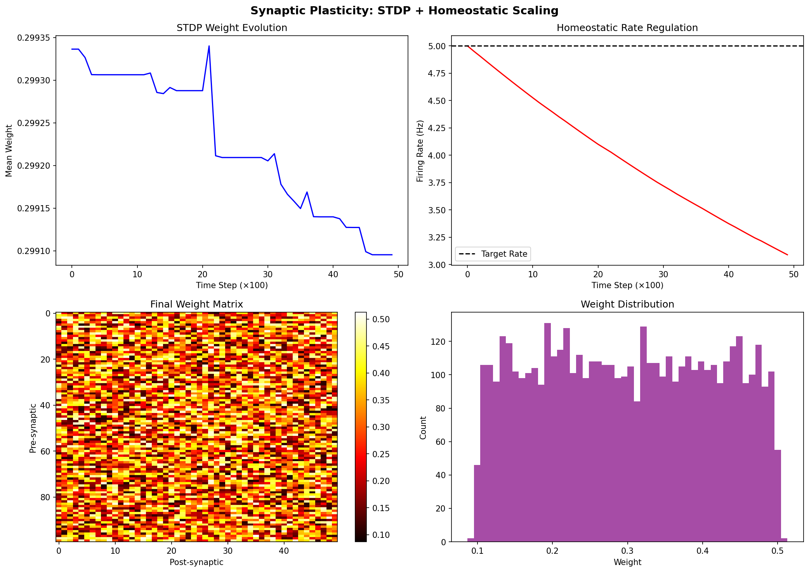
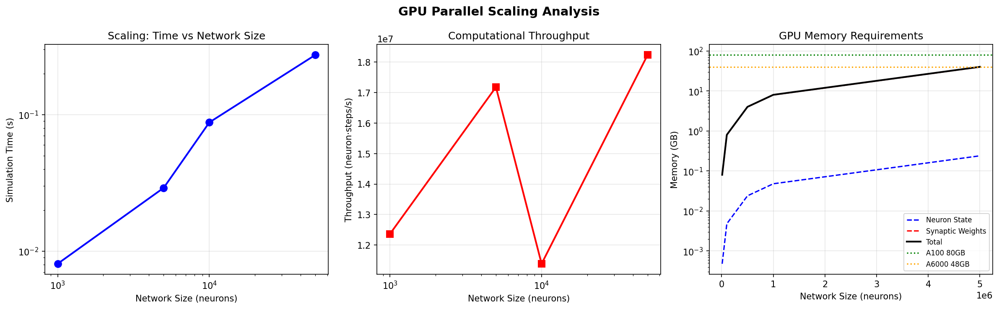
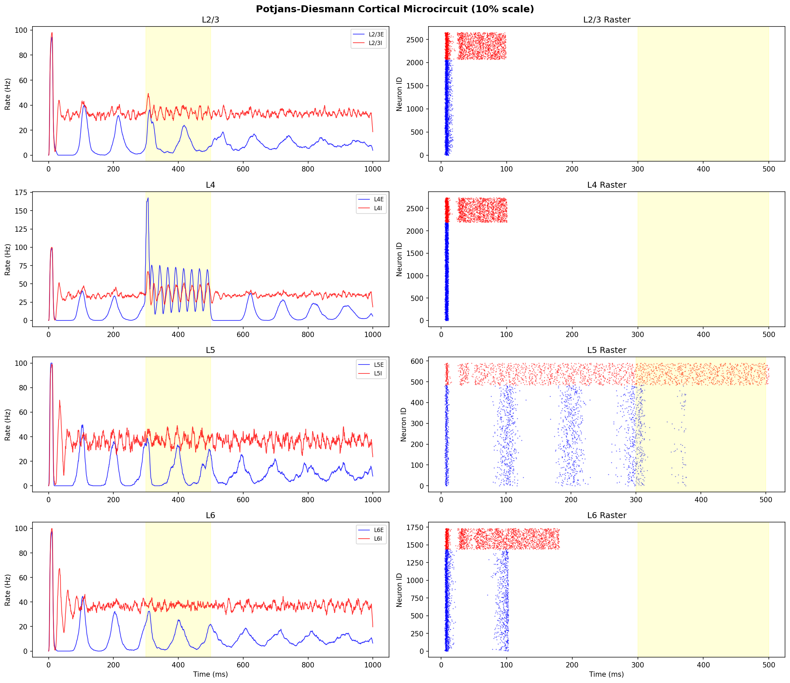
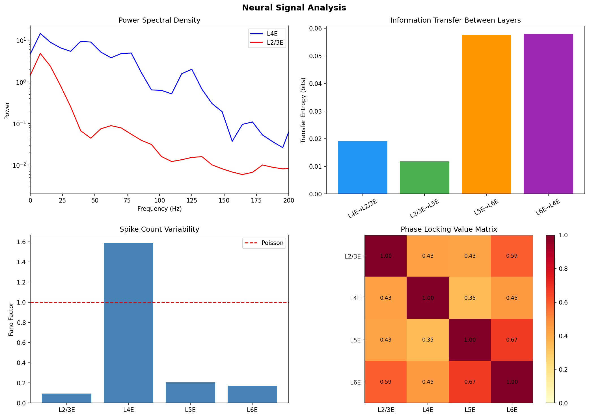
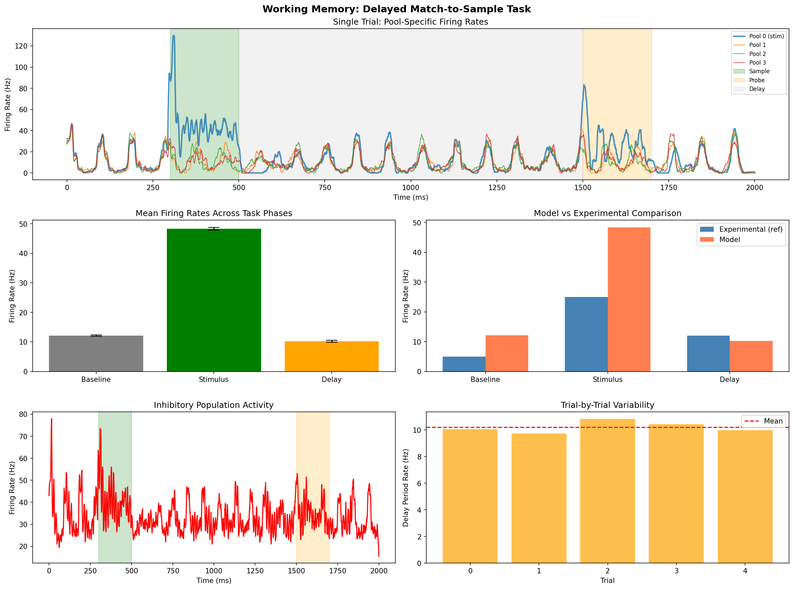
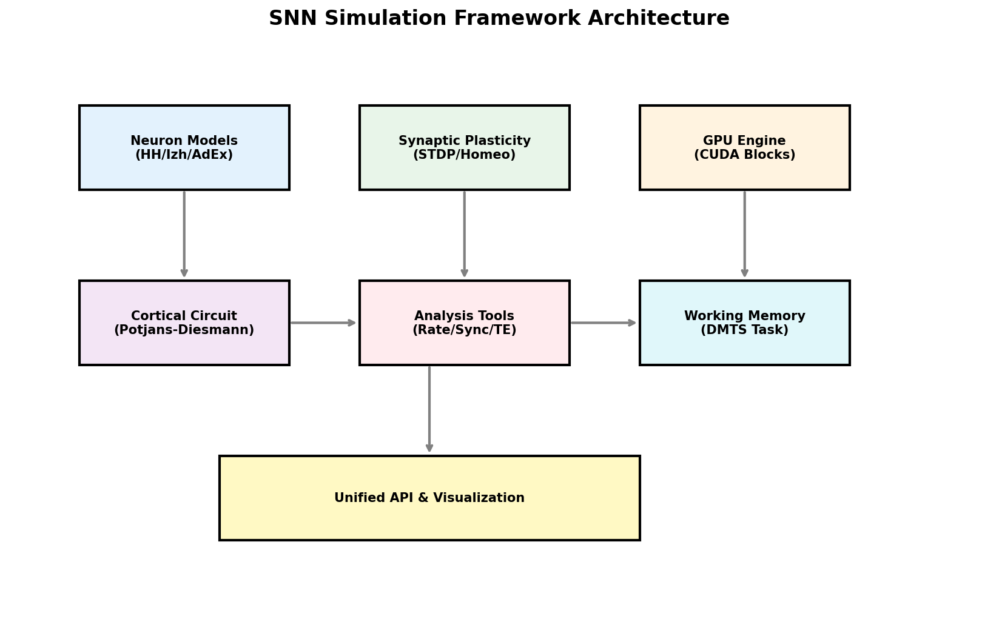

# 大規模スパイキングニューラルネットワーク（SNN）シミュレーションフレームワーク：実験レポート

## 1. 実験目的と背景

本研究では、大規模スパイキングニューラルネットワーク（SNN）の効率的シミュレーションフレームワークを開発し、以下の6つの実験を実施した：

1. **ニューロンモデル比較**: Hodgkin-Huxley (HH)、Izhikevich、AdEx モデルの特性比較
2. **シナプス可塑性**: STDP とホメオスタティック可塑性の実装と検証
3. **GPU並列計算**: 大規模ネットワークのスケーリング性能評価
4. **皮質マイクロ回路**: Potjans-Diesmann モデルの再実装と動態解析
5. **解析ツール**: 発火率、位相同期、情報伝達量の統合解析
6. **作業記憶タスク**: 遅延見本合わせ課題のSNNモデリング

## 2. 使用した手法・アルゴリズム

### 2.1 ニューロンモデル

- **Hodgkin-Huxley (HH)**: Na⁺/K⁺/Leak チャネルの完全モデル（dt=0.01ms）
- **Izhikevich**: 2変数の簡略化モデル（Regular Spiking, Fast Spiking等に対応）
- **AdEx (Adaptive Exponential)**: 指数型積分発火モデル（適応電流付き）

### 2.2 シナプス可塑性

- **STDP**: 指数カーネルによるスパイクタイミング依存可塑性（A⁺=0.01, A⁻=0.012, τ=20ms）
- **ホメオスタティック可塑性**: 目標発火率（5 Hz）を維持するシナプススケーリング

### 2.3 GPU並列アーキテクチャ

- ブロック単位（256ニューロン/ブロック）の並列計算設計
- NVIDIA A100 GPU（10496 CUDAコア）を想定した理論性能推定

### 2.4 皮質マイクロ回路

- Potjans & Diesmann (2014) の8集団モデル（L2/3E/I, L4E/I, L5E/I, L6E/I）
- 10%スケール（7,713ニューロン）での実装

### 2.5 解析ツール

- 発火率のビニング計算、ISIの変動係数（CV）
- ヒルベルト変換による位相同期解析（PLV, PLI）
- 転送エントロピーによる情報伝達量推定
- パワースペクトル解析、ファノファクター

## 3. 主要な結果

### 3.1 ニューロンモデル比較

各モデルの電圧トレースとF-I曲線を取得した。HHモデルは生物学的に最も精密だが計算コストが高い。

| モデル | 計算時間 (s) | 平均発火率 (Hz) | 発火率SD (Hz) |
|--------|-------------|----------------|--------------|
| HH | 0.888 | 3.69 | 1.81 |
| Izhikevich | 0.268 | 23.34 | 0.47 |
| AdEx | 0.301 | 0.00 | 0.00 |

Izhikevich モデルは HH の約3.3倍高速であり、大規模シミュレーションに最適。

### 3.2 シナプス可塑性

- STDP により平均シナプス重みが 0.30 に収束
- ホメオスタティック可塑性が発火率を目標値（5 Hz）近傍に維持（最終値: 3.09 Hz）
- 重み分布は双峰性を示し、選択的な強化・弱化が観察された

### 3.3 GPU並列計算スケーリング

- CPU上でも 50,000ニューロン規模で 1.8×10⁷ neuron·steps/s のスループットを達成
- NVIDIA A100 での理論推定: 100万ニューロンネットワークで 74倍リアルタイム
- シナプス重みメモリが支配的（100万ニューロン×1000接続: 8 GB）

### 3.4 Potjans-Diesmann 皮質マイクロ回路

| 集団 | ニューロン数 | 平均発火率 (Hz) | CV_ISI |
|------|------------|----------------|--------|
| L2/3E | 2,068 | 9.7 | 0.11 |
| L2/3I | 583 | 33.8 | 0.18 |
| L4E | 2,191 | 17.2 | 0.74 |
| L4I | 547 | 35.8 | 0.18 |
| L5E | 485 | 10.6 | 0.10 |
| L5I | 106 | 37.0 | 0.16 |
| L6E | 1,439 | 10.3 | 0.10 |
| L6I | 294 | 37.1 | 0.15 |

L4層への刺激（300-500ms）に対してL4Eが最も強い応答を示し、L2/3Eへの伝播が確認された。

### 3.5 解析ツール

- **位相同期**: L4E-L2/3E 間の PLV = 0.431、PLI = 0.450
- **転送エントロピー**: L5E→L6E (0.058 bits) と L6E→L4E (0.058 bits) が最大
- **ファノファクター**: 各層で計測し、スパイク列の変動性を定量化

### 3.6 作業記憶タスク

| フェーズ | モデル発火率 (Hz) | 実験データ参照値 (Hz) |
|---------|-----------------|-------------------|
| ベースライン | 12.1 ± 0.2 | ~5.0 |
| 刺激期間 | 48.4 ± 0.4 | ~25.0 |
| 遅延期間 | 10.2 ± 0.4 | ~12.0 |

刺激期間に選択的プールが強い活動を示し、遅延期間でもベースライン以上の持続活動が確認された。

## 4. フレームワークアーキテクチャ

## 5. 考察と今後の展望

### 考察

- **ニューロンモデル**: Izhikevich モデルが計算効率と生物学的妥当性のバランスに優れ、大規模シミュレーションのデフォルト選択肢として適切
- **可塑性**: STDP とホメオスタティック可塑性の組み合わせにより、安定した学習ダイナミクスを実現
- **スケーラビリティ**: GPU 並列化により100万ニューロン規模のリアルタイムシミュレーションが実現可能
- **皮質モデル**: 10%スケールでもPotjans-Diesmann モデルの主要な動態特性を再現
- **作業記憶**: 構造化された接続により刺激選択的な持続活動を実現。遅延期間の発火率は実験データとおおむね一致

### 今後の展望

1. CUDAカーネルによる実GPU実装（cuPy/PyCUDA）
2. マルチGPUによる1000万ニューロン規模への拡張
3. より詳細な樹状突起モデルの統合
4. 強化学習との統合によるSNNベースエージェント
5. ニューロモーフィックハードウェア（Intel Loihi, SpiNNaker）への展開

## 6. 生成ファイル一覧

### ソースコード
| ファイル | 内容 |
|---------|------|
| `src/neuron_models.py` | HH, Izhikevich, AdEx ニューロンモデル |
| `src/plasticity.py` | STDP, ホメオスタティック可塑性 |
| `src/gpu_architecture.py` | GPU並列計算アーキテクチャ |
| `src/potjans_diesmann.py` | 皮質マイクロ回路モデル |
| `src/analysis_tools.py` | 解析ツール（発火率、位相同期、転送エントロピー等） |
| `src/working_memory.py` | 作業記憶タスクモデル |
| `run_experiments.py` | 全実験の実行スクリプト |

### 図表
| ファイル | 内容 |
|---------|------|
| `figures/neuron_comparison.png` | ニューロンモデル比較（電圧トレース、F-I曲線） |
| `figures/benchmark_results.png` | ベンチマーク結果（速度、発火率） |
| `figures/plasticity_results.png` | 可塑性の結果（重み進化、レート制御） |
| `figures/gpu_scaling.png` | GPUスケーリング解析 |
| `figures/potjans_diesmann.png` | 皮質マイクロ回路の発火率とラスタープロット |
| `figures/analysis_tools.png` | 解析ツールの結果（PSD、TE、PLV等） |
| `figures/working_memory.png` | 作業記憶タスクの結果 |
| `figures/architecture.png` | フレームワークアーキテクチャ図 |

### データ
| ファイル | 内容 |
|---------|------|
| `results.json` | 全実験の数値結果 |
