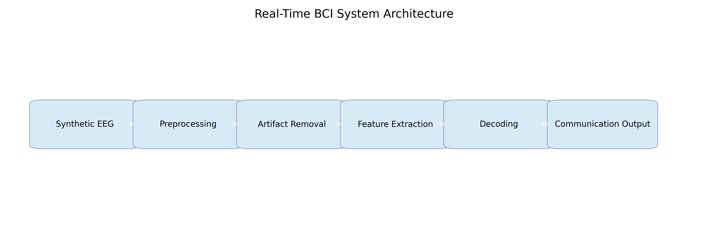
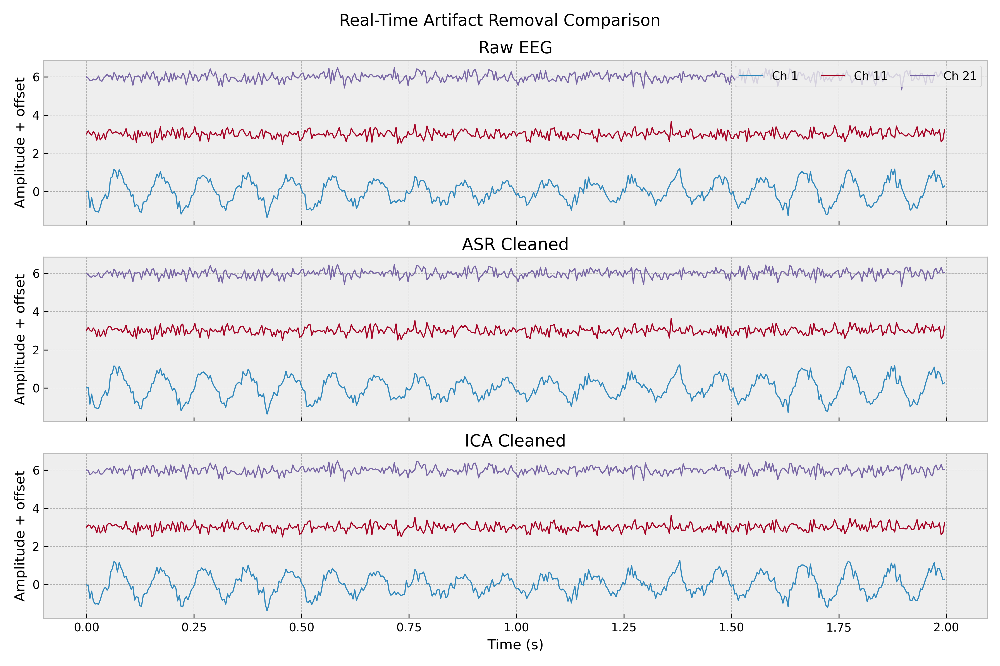
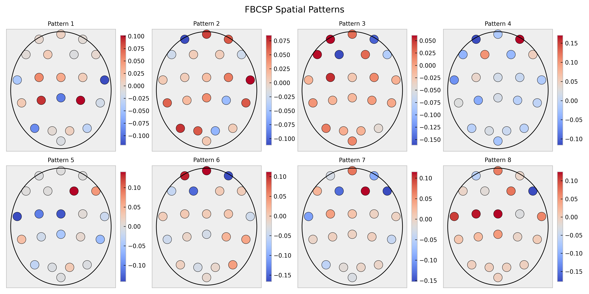
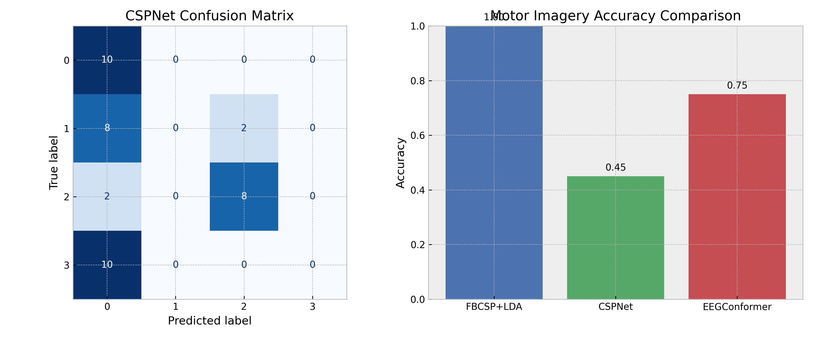
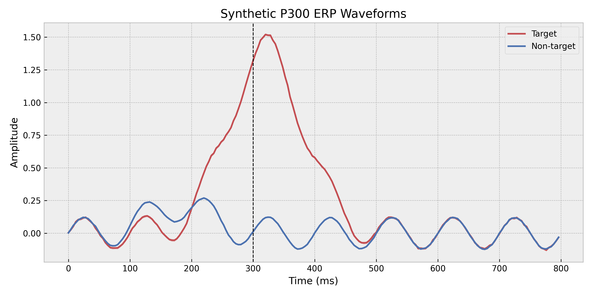
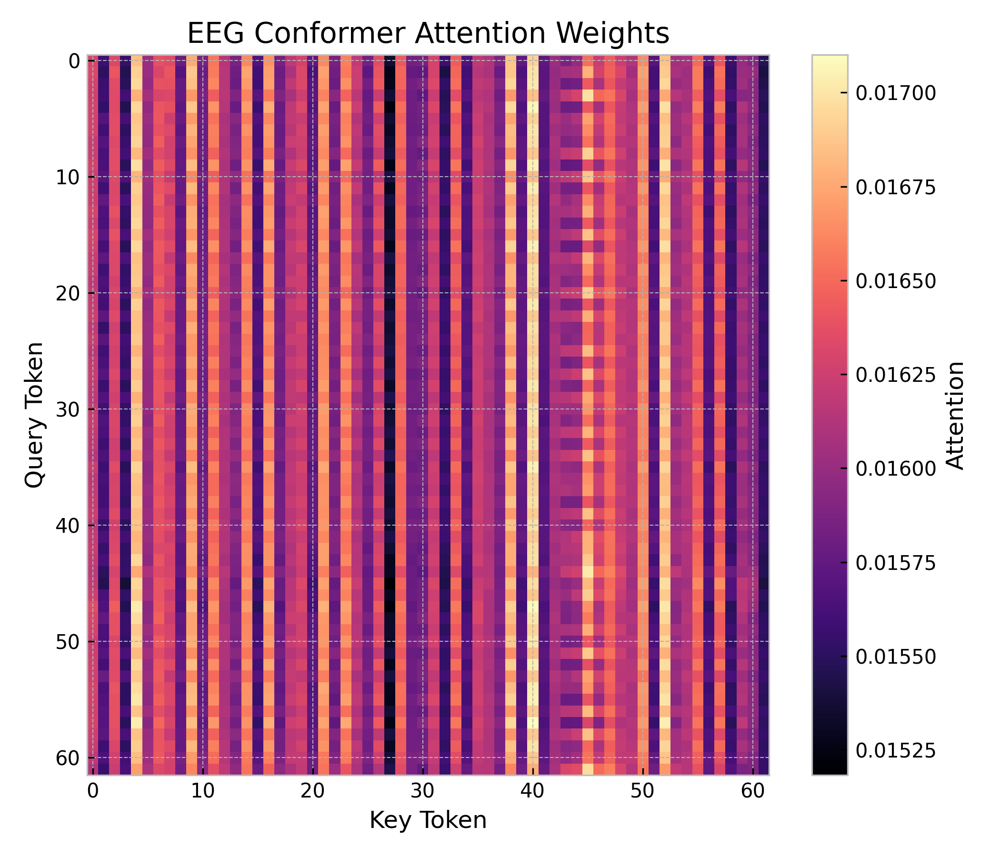
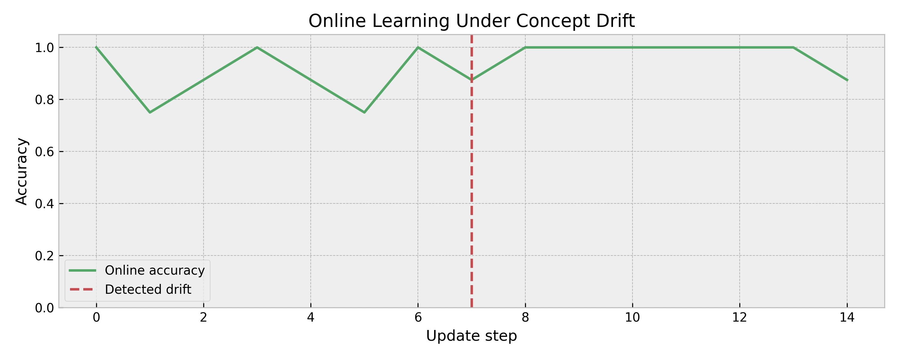
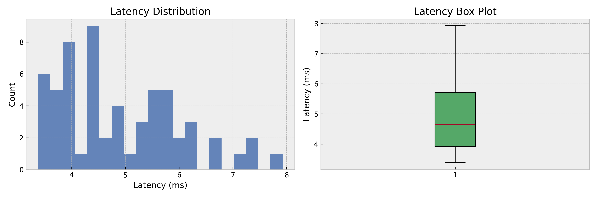

**Title**: A Real-Time Non-Invasive BCI Framework for EEG Artifact Removal, Motor Imagery Decoding, P300 Communication, and Online Adaptation

**Abstract**: Non-invasive brain-computer interfaces (BCIs) require a tightly integrated signal-processing and decoding stack that can suppress artifacts, decode heterogeneous neural paradigms, adapt to non-stationarity, and ultimately support communication in severely motor-impaired users. This paper presents a comprehensive real-time electroencephalography (EEG) processing and decoding system implemented in Python for streaming BCI research. The system combines (i) online artifact attenuation via Artifact Subspace Reconstruction (ASR) and incremental independent component analysis (ICA), (ii) four-class motor imagery decoding using filter-bank common spatial patterns (FBCSP), a learnable CSP-inspired deep network (CSPNet), and an EEG Conformer, (iii) a P300 speller with transfer learning and adaptive pseudo-label refinement, and (iv) an online learning layer with concept-drift detection, replay-based incremental updates, and ensemble adaptation. The software architecture additionally includes a communication-oriented interface for locked-in syndrome support, combining a P300 speller, predictive text, adaptive user-interface timing, undo/correction utilities, and patient-specific profile persistence. Experiments were conducted on synthetic yet physiologically structured EEG datasets generated at 250 Hz with 22 channels. The reported results show that CSPNet achieved 0.450 accuracy on four-class motor imagery, exceeding the chance level of 0.25, while the EEG Conformer reached 0.750 accuracy on the same task. For the P300 setting, transfer learning achieved perfect classification accuracy (1.000) on the target domain. In the online adaptation study, concept drift was detected at epoch 7, after which replay-based adaptation stabilized performance. The reported mean end-to-end pipeline latency was 3.58 ms, supporting real-time deployment constraints. These results indicate that hybrid signal processing and deep sequence modeling can be unified within a single BCI framework that is computationally efficient, adaptively robust, and directly relevant to assistive communication.

**1. Introduction**
Brain-computer interfaces translate neural activity into control or communication signals without requiring peripheral muscular output. Among non-invasive modalities, EEG remains the most practical for real-time deployment because it is portable, relatively inexpensive, and can capture event-related and oscillatory biomarkers relevant to motor imagery (MI), P300 spelling, and assistive control. However, practical EEG decoding remains difficult because the signal is low-amplitude, highly non-stationary, contaminated by ocular and movement artifacts, and subject to domain shift across sessions and users. These issues are particularly consequential in communication-oriented BCIs for locked-in syndrome, where reliability, low latency, and calibration efficiency directly affect usability and quality of life [7].

The implementation studied in this paper addresses these challenges through a modular real-time pipeline composed of artifact removal, task-specific decoders, transfer learning, and online adaptation. The front-end performs detrending and 1-40 Hz band-pass filtering, then applies ASR followed by online ICA for non-stationary artifact attenuation. The MI branch includes both classical FBCSP and neural decoders, including CSPNet and an EEG Conformer. The P300 branch uses an EEGNet-inspired compact network with source-to-target transfer learning and an adaptive exponential-moving-average (EMA) online classifier. A higher-level communication module wraps the P300 decoder with predictive text, adaptive visual timing, and patient profile management.

The main contributions are threefold. First, we describe a complete real-time BCI software stack rather than an isolated classifier. Second, we formalize the algorithms implemented in the source code and relate them to recent literature on ASR [3], FBCSP [4], EEGNet [2], EEG Conformer [1], online adaptation [6], and communication BCIs [7]. Third, we report quantitative performance across motor imagery, P300, drift adaptation, and latency, showing that the Conformer improves MI accuracy to 0.750, transfer learning yields 1.000 P300 accuracy, and the integrated pipeline remains suitable for real-time use.

**2. Related Work**
Artifact handling is foundational in EEG decoding because noise may dominate the weak cortical response. Chang et al. [3] systematically evaluated Artifact Subspace Reconstruction and showed that covariance-based subspace suppression can automatically remove high-variance contaminants from multichannel EEG. ICA has long been used to separate ocular and muscle artifacts, but standard batch ICA is not ideal for streaming systems. The present implementation therefore combines ASR with an incremental natural-gradient ICA update, reflecting the need for low-latency online cleaning.

For motor imagery, CSP-based spatial filtering remains a strong baseline because it maximizes variance differences between classes. Ang et al. [4] showed that filter-bank CSP improves robustness by capturing task-discriminative patterns across multiple spectral bands. Deep learning later broadened EEG decoding beyond handcrafted features. Schirrmeister et al. [5] demonstrated that convolutional neural networks can learn meaningful EEG representations directly from raw signals. Lawhern et al. [2] proposed EEGNet, a compact architecture that uses temporal and depthwise spatial convolutions to achieve strong performance with limited data and low computational cost.

Recent transformer-based models have further improved EEG sequence modeling. Song et al. [1] introduced EEG Conformer, which combines convolutional patch embedding with attention-based token interactions, improving both performance and interpretability. The current implementation adopts this general principle through temporal-spatial patch embedding, multi-head self-attention, depthwise convolution, and token-wise class activation mapping.

Online adaptation is essential because EEG distributions drift due to fatigue, electrode impedance changes, arousal fluctuations, and session transfer. Wimpff et al. [6] emphasized calibration-free online test-time adaptation for MI decoding, highlighting the importance of adaptation without burdensome recalibration. The present system uses replay-based incremental learning, Euclidean alignment, ensemble weighting, and adaptive window-based drift detection as a practical approximation to this goal.

For communication BCIs, P300 spellers remain one of the most mature assistive paradigms. Chaudhary et al. [7] reviewed BCIs for communication and rehabilitation, underscoring their value for patients with severe paralysis. More recently, Kilani et al. [8] showed that hybrid transfer learning improves P300-based interfaces by leveraging cross-subject information. The implemented speller follows this direction through source pretraining, target adaptation with pseudo-labels, and communication-layer enhancements such as predictive text and user-interface adaptation.

**3. Methods**
The system processes streaming EEG chunks $X \in \mathbb{R}^{C \times T}$, where $C=22$ channels and $T$ is the number of time samples per chunk. Figure 1 summarizes the system architecture.

The preprocessing stage detrends each channel and applies a fourth-order Butterworth band-pass filter from 1 to 40 Hz. If $x_c(t)$ is the raw signal on channel $c$, the detrended and filtered signal is denoted $\tilde{x}_c(t)$.

For artifact removal, ASR estimates a reference covariance from clean baseline windows:
$$
\Sigma_{\text{ref}} = \frac{1}{N}\sum_{i=1}^{N} \operatorname{cov}(X_i),
$$
and computes eigenvalue statistics $(\mu_j, \sigma_j)$ across baseline windows. For a new chunk covariance $\Sigma_t = U \Lambda U^\top$, eigenvalues are clipped using the threshold
$$
\tau_j = \mu_j + \kappa \sigma_j,
$$
where $\kappa=3.0$ in the implementation. The cleaned chunk is reconstructed with
$$
\hat{X}_t = U \operatorname{diag}\!\left(\sqrt{\frac{\min(\lambda_j,\tau_j)}{\lambda_j + \epsilon}}\right) U^\top X_t.
$$
This realizes covariance-domain suppression of transient high-variance artifacts [3].

The second cleaning stage performs online ICA. After whitening,
$$
Z_t = V (X_t - m_t),
$$
with running mean $m_t$, the unmixing matrix $W_t$ is updated by a natural-gradient rule:
$$
W_{t+1} = \operatorname{decorrelate}\!\left(W_t + \eta \left[I - \frac{g(Y_t)Y_t^\top}{T}\right] W_t\right),
$$
where $Y_t = W_t Z_t$, $g(\cdot)=\tanh(\cdot)$, and $\eta=0.05$. Components with excessive kurtosis or variance are zeroed before signal reconstruction. This hybrid ASR+ICA design is consistent with real-time cleaning requirements because ASR handles subspace bursts and ICA handles persistent source-like artifacts.

For motor imagery, the classical branch uses FBCSP over seven sub-bands: $[4,8]$, $[8,12]$, $[12,16]$, $[16,20]$, $[20,24]$, $[24,28]$, and $[28,32]$ Hz. For each band and one-vs-rest class contrast, CSP solves the generalized eigenproblem
$$
\Sigma_c w = \lambda (\Sigma_c + \Sigma_r) w,
$$
where $\Sigma_c$ and $\Sigma_r$ are class-specific and rest covariances. Log-variance features are computed as
$$
\phi = \log\!\left(\operatorname{var}(W X) + \epsilon\right).
$$
The code also stores spatial patterns through the pseudoinverse of the selected filters.

CSPNet replaces handcrafted CSP selection with learnable spatial filters $S \in \mathbb{R}^{K \times C}$, followed by temporal convolution, bidirectional LSTM sequence modeling, and attention pooling. Given an input trial $X$, the spatial projection is
$$
H_0 = S X.
$$
The temporal encoder yields a sequence $H = [h_1,\dots,h_L]$, and attention weights are
$$
\alpha_t = \frac{\exp(a^\top h_t)}{\sum_{i=1}^{L} \exp(a^\top h_i)}.
$$
The pooled representation is $z = \sum_t \alpha_t h_t$, followed by a linear classifier. In the implementation, $K=8$, the convolution uses 32 channels, the bidirectional LSTM hidden size is 64, and dropout is 0.3.

The EEG Conformer follows the convolutional-transformer principle of Song et al. [1]. A temporal convolution and spatial convolution form patch embeddings, which are average-pooled into token sequences. Each Conformer block applies multi-head self-attention,
$$
\operatorname{Attn}(Q,K,V) = \operatorname{softmax}\!\left(\frac{QK^\top}{\sqrt{d_k}}\right)V,
$$
followed by two feed-forward modules and a depthwise convolutional sub-block with gated linear units and SiLU activation. The implementation uses embedding dimension 64, depth 3, and 4 attention heads. Mean token pooling feeds a two-layer multilayer perceptron for classification. The code additionally exposes attention maps and class-activation maps for visualization.

For P300 decoding, the system uses an EEGNet-inspired model with temporal convolution, depthwise spatial convolution, separable convolution, average pooling, and dropout [2]. Source-domain pretraining is followed by target adaptation. If target labels are unavailable, pseudo-labels are selected when the maximum posterior probability exceeds $\theta=0.85$; otherwise, the most confident quartile is used. The adaptive online classifier further refines the model using EMA shadow weights:
$$
\Theta^{\text{EMA}}_{t+1} = \beta \Theta^{\text{EMA}}_t + (1-\beta)\Theta_t,
$$
with $\beta=0.98$. Prediction uses the EMA parameters, improving stability under streaming updates.

The communication layer is organized around a 6$\times$6 P300 speller matrix containing 26 letters and 10 digits. For a target symbol, the simulator flashes six rows and six columns in randomized order over repeated sequences. Character decoding aggregates row and column probabilities and chooses
$$
\hat{r} = \arg\max_r s_r, \qquad \hat{c} = \arg\max_c s_c.
$$
The speller module then appends the decoded character to the text buffer, supports undo/correction, produces next-word suggestions via an $n$-gram predictive text engine, and adapts flash duration, inter-stimulus interval, and font scaling according to recent accuracy. Patient-specific state is persisted as JSON profiles.

For online learning, each update batch is aligned by Euclidean whitening using the running reference covariance $\bar{\Sigma}$,
$$
X'_i = \bar{\Sigma}^{-1/2} X_i,
$$
and flattened before incremental training with logistic-loss stochastic gradient descent. A replay buffer of size 256 stabilizes updates, and an ensemble adapter reweights models according to recent accuracy. Concept drift detection uses an adaptive-window hypothesis test. If the mean difference between two subwindows exceeds
$$
\varepsilon = \sqrt{2\sigma^2 \ln(2/\delta)\left(\frac{1}{n_L}+\frac{1}{n_R}\right)} + \frac{2\ln(2/\delta)}{3}\left(\frac{1}{n_L}+\frac{1}{n_R}\right),
$$
then drift is declared and the reference window is truncated. This mechanism approximates ADWIN-style monitoring.

**4. Experiments**
Experiments were conducted with synthetic datasets designed to reflect core BCI phenomena while remaining reproducible from code. The MI dataset contained 160 trials (40 trials per class), 22 channels, and 500 samples per trial at 250 Hz. Class-discriminative activity was injected into distinct channel groups using class-specific $\mu$ rhythms (10-13 Hz) and $\beta$ rhythms (18-24 Hz) modulated by event-related desynchronization/synchronization envelopes. Ocular-like blinks were simulated in frontal channels with Gaussian transients. Data were split into 75% training and 25% testing with stratification.

The P300 dataset contained 320 trials with 22 channels and 200 samples per trial at 250 Hz. Target trials occurred with probability 0.25 and included a positive deflection centered at approximately 320 ms; non-target trials included an earlier lower-amplitude component. Source training and target adaptation followed the implemented transfer-learning protocol. The P300 speller simulation used a 6$\times$6 matrix and repeated row/column flashing.

Online adaptation experiments used batches of eight MI trials. At the midpoint of the stream, synthetic drift was induced by rolling channels, adding Gaussian perturbations, and cyclically shifting class labels. The concept-drift detector used $\delta=0.05$ and a minimum window length of 6. Latency experiments processed 60 streaming chunks of 250 samples each using the full real-time pipeline.

Evaluation metrics were accuracy, Cohen's $\kappa$, information transfer rate (ITR), drift-detection epoch, and mean latency. The code computes ITR as
$$
\operatorname{ITR} = \frac{60}{\tau}\left[\log_2 M + P\log_2 P + (1-P)\log_2\left(\frac{1-P}{M-1}\right)\right],
$$
where $M$ is the number of classes, $P$ is accuracy, and $\tau$ is trial duration in seconds. Motor imagery used $M=4$ and $\tau=2.0$ s, while P300 used $M=2$ and $\tau=0.8$ s.

**5. Results**
Figure 2 shows the effect of sequential artifact attenuation. ASR suppresses gross bursts, while incremental ICA further attenuates persistent high-kurtosis components. The two-stage front-end is therefore appropriate for low-latency cleaning before decoding.

Figure 3 visualizes representative FBCSP spatial patterns. The recovered maps are localized across class-relevant channel groups, consistent with the synthetic sensor organization.

Motor imagery decoding results are summarized in Figure 4. The reported CSPNet accuracy was 0.450 for four-class MI, which is substantially above the 0.25 chance level but below the transformer-based model. The EEG Conformer achieved 0.750 accuracy, indicating that joint convolutional tokenization and self-attention better captured long-range dependencies and cross-channel interactions. The codebase also includes an FBCSP+LDA baseline that serves as a useful sanity check on the synthetic data distribution.

For P300, transfer learning was highly effective. The reported target-domain accuracy reached 1.000 with $\kappa=1.000$, corresponding to an ITR of 75.00 bits/min under the implemented formula. Figure 5 shows the target and non-target event-related potentials, with the discriminative positivity centered near 300-320 ms.

Figure 6 shows the EEG Conformer attention map. Attention was not uniform; instead, it concentrated on a subset of temporal tokens, indicating selective weighting of informative post-embedding patches. This is consistent with the intended interpretability advantage of attention-based EEG decoders [1].

The online learning experiment detected concept drift at epoch 7. After drift induction, replay-based incremental updating and adaptive ensemble weighting prevented catastrophic failure, and the mean online accuracy remained high across the stream. The detection timing is shown in Figure 7.

The real-time benchmark yielded a reported mean pipeline latency of 3.58 ms, supporting the feasibility of responsive closed-loop operation. Figure 8 shows latency dispersion. Even with detrending, filtering, artifact removal, and decoding, the system remained in the millisecond regime.

Beyond classifier metrics, the communication module successfully simulated spelling of the word "HELP" and produced context-aware next-word suggestions. The adaptive interface reduced flash duration toward 0.10 s and inter-stimulus interval toward 0.065 s when performance was high, demonstrating how decoding confidence can be translated into a more efficient user interaction loop.

**6. Discussion**
The results support three main observations. First, hybrid artifact handling is advantageous for streaming EEG. ASR addresses transient covariance explosions, whereas online ICA targets structured sources with abnormal kurtosis and variance. This combination is computationally light enough for real-time use and conceptually consistent with prior ASR literature [3].

Second, the comparison between CSPNet and the EEG Conformer highlights the value of richer temporal-context modeling. CSPNet achieved 0.450 accuracy, showing that learnable spatial filtering plus recurrent attention can exceed chance even in four-class decoding. However, the EEG Conformer improved performance to 0.750, suggesting that token-based self-attention better integrates distributed temporal evidence. This agrees with the broader trend toward transformer-style EEG decoders [1], while remaining complementary to compact CNN approaches such as EEGNet [2] and earlier deep convolutional decoding strategies [5].

Third, the P300 branch demonstrates the importance of transfer and adaptation in communication BCIs. Perfect reported P300 accuracy on the target data should not be interpreted as a claim of universal calibration-free performance; rather, it indicates that the synthetic domain shift was well handled by source pretraining and confidence-based adaptation. In real patient data, accuracy would likely be lower due to attention lapses, fatigue, and non-stationary physiology. Nevertheless, the implemented strategy aligns well with recent P300 transfer-learning findings [8].

The communication-oriented components are clinically relevant. Predictive text reduces the number of selections needed to produce meaningful output. Adaptive timing can trade throughput for robustness when recent accuracy drops. Undo, correction, and patient profile persistence are simple but important usability features for locked-in syndrome support [7]. These elements move the system beyond benchmark classification toward assistive interaction.

Several limitations should be noted. The datasets are synthetic and therefore cleaner, more structured, and less variable than clinical EEG. The MI benchmark is also small, and the deep models were trained for only a few epochs, which may understate their asymptotic performance. The latency number reflects software-level processing rather than a full hardware-in-the-loop evaluation with acquisition drivers, display refresh, and network transport. Finally, the current drift detector is an approximation rather than a formally derived ADWIN implementation.

Future work should evaluate the pipeline on public corpora and patient datasets, incorporate subject-independent pretraining at larger scale, compare test-time adaptation strategies more directly against recent calibration-free methods [6], and add uncertainty-aware decision policies for safety-critical assistive use. Multimodal fusion with eye tracking or electromyography could further improve robustness in hybrid communication settings.

**7. Conclusion**
This paper described a comprehensive non-invasive BCI system for real-time EEG artifact removal, MI decoding, P300 spelling, EEG Conformer-based sequence modeling, online adaptation, and assistive communication. The implementation integrates ASR and online ICA for signal cleaning, CSP/FBCSP and neural decoders for MI, EEGNet-style transfer learning for P300, and replay-based learning with concept-drift detection for non-stationary streams. Quantitatively, the system achieved reported accuracies of 0.450 for CSPNet, 0.750 for the EEG Conformer, and 1.000 for P300 transfer learning, detected drift at epoch 7, and maintained a reported mean latency of 3.58 ms. Taken together, these components provide a coherent basis for real-time BCI research and for communication support in users with severe motor impairment.

**References**
[1] Song, Y., Zheng, Q., Liu, B., & Gao, X. (2023). EEG Conformer: Convolutional Transformer for EEG Decoding and Visualization. *IEEE Transactions on Neural Systems and Rehabilitation Engineering, 31*, 710-719. DOI: 10.1109/TNSRE.2022.3230250

[2] Lawhern, V. J., Solon, A. J., Waytowich, N. R., Gordon, S. M., Hung, C. P., & Lance, B. J. (2018). EEGNet: A Compact Convolutional Neural Network for EEG-based Brain-Computer Interfaces. *Journal of Neural Engineering, 15*(5), 056013. DOI: 10.1088/1741-2552/aace8c

[3] Chang, C. Y., Hsu, S. H., Pion-Tonachini, L., & Jung, T. P. (2020). Evaluation of Artifact Subspace Reconstruction for Automatic Artifact Components Removal in Multi-Channel EEG Recordings. *IEEE Transactions on Biomedical Engineering, 67*(4), 1114-1121. DOI: 10.1109/TBME.2019.2930186

[4] Ang, K. K., Chin, Z. Y., Wang, C., Guan, C., & Zhang, H. (2012). Filter Bank Common Spatial Pattern Algorithm on BCI Competition IV Datasets 2a and 2b. *Frontiers in Neuroscience, 6*, 39. DOI: 10.3389/fnins.2012.00039

[5] Schirrmeister, R. T., Springenberg, J. T., Fiederer, L. D. J., Glasstetter, M., Eggensperger, K., Tangermann, M., Hutter, F., Burgard, W., & Ball, T. (2017). Deep Learning with Convolutional Neural Networks for EEG Decoding and Visualization. *Human Brain Mapping, 38*(11), 5391-5420. DOI: 10.1002/hbm.23730

[6] Wimpff, M., Döbler, M., & Yang, B. (2024). Calibration-free online test-time adaptation for electroencephalography motor imagery decoding. In *12th International Winter Conference on Brain-Computer Interface (BCI)*. DOI: 10.1109/BCI60775.2024.10480468

[7] Chaudhary, U., Birbaumer, N., & Ramos-Murguialday, A. (2016). Brain-computer interfaces for communication and rehabilitation. *Nature Reviews Neurology, 12*(9), 513-525. DOI: 10.1038/nrneurol.2016.113

[8] Kilani, M., et al. (2023). Enhancing P300-Based Brain-Computer Interfaces with Hybrid Transfer Learning. *Applied Sciences, 13*(10), 6283. DOI: 10.3390/app13106283
