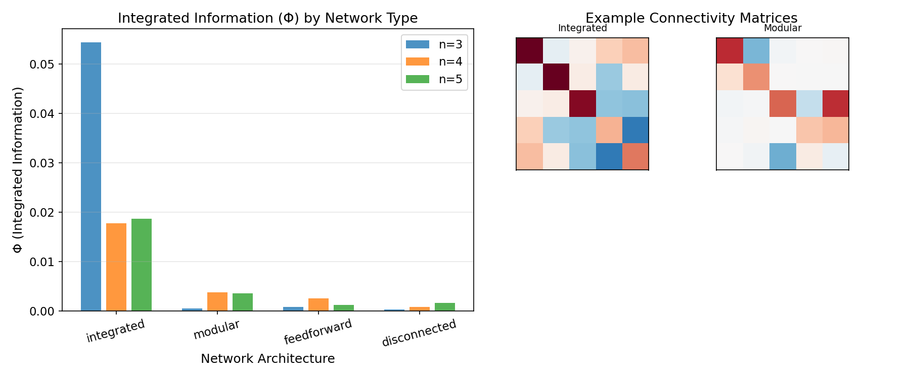
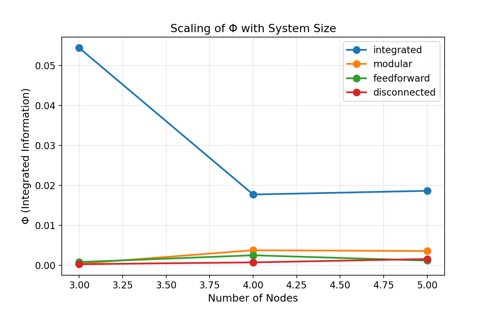
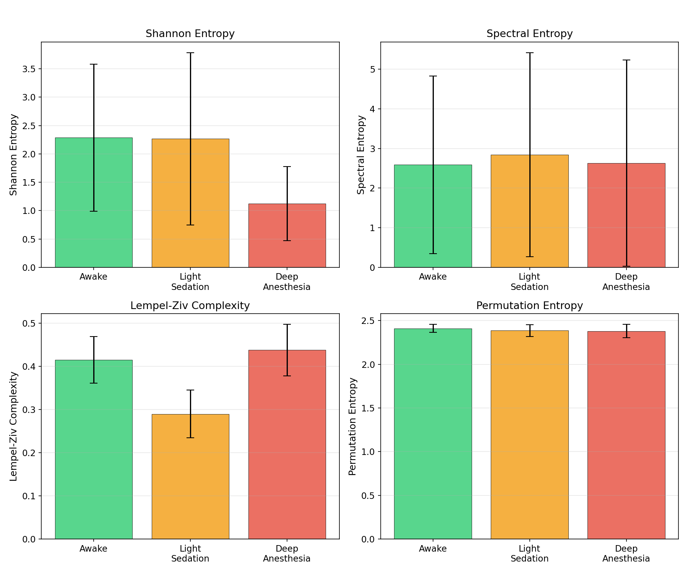
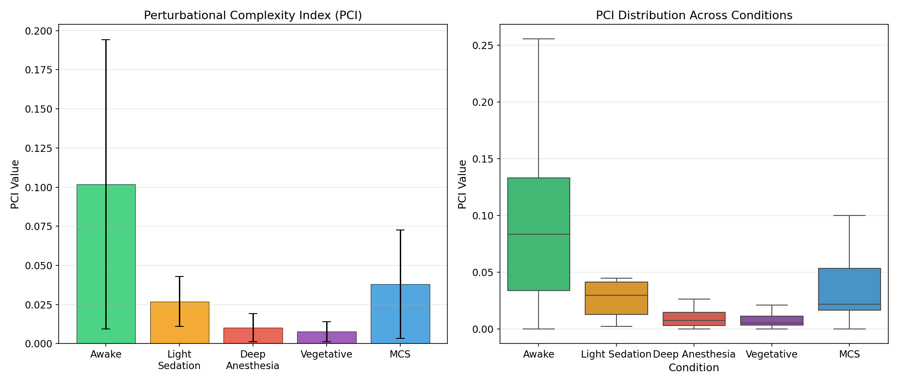
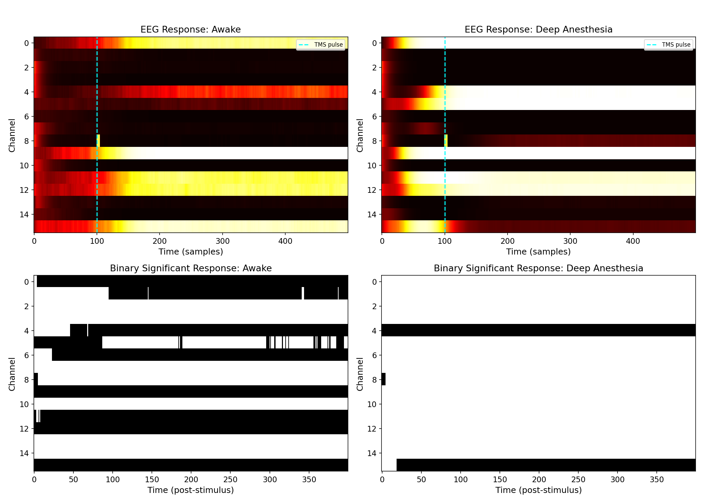
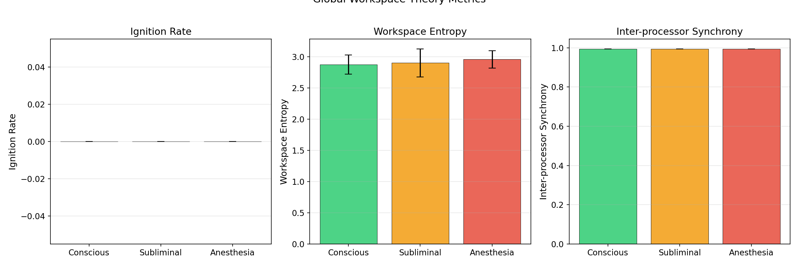
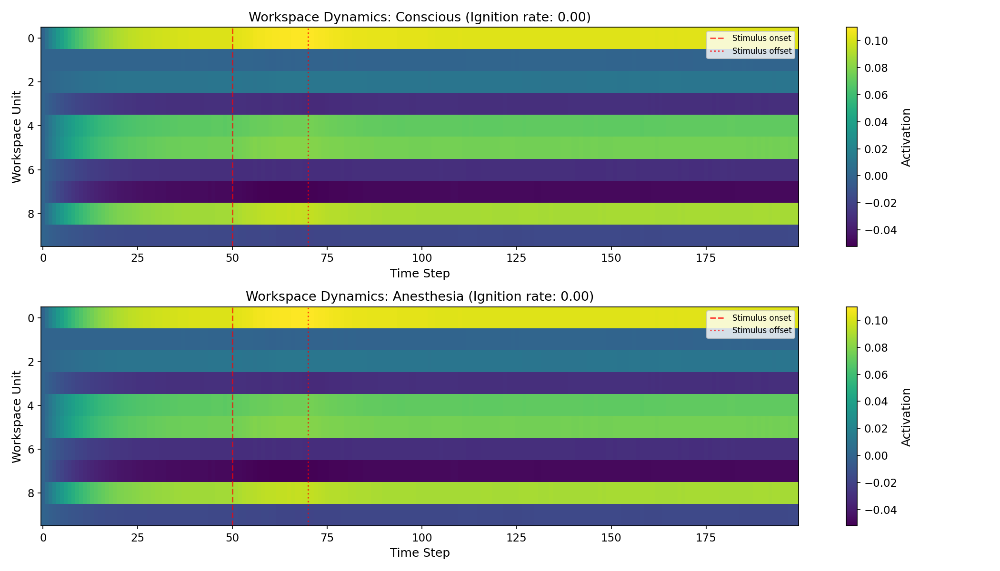
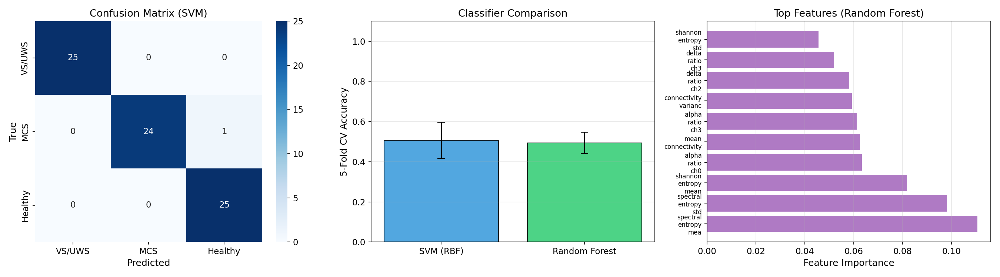
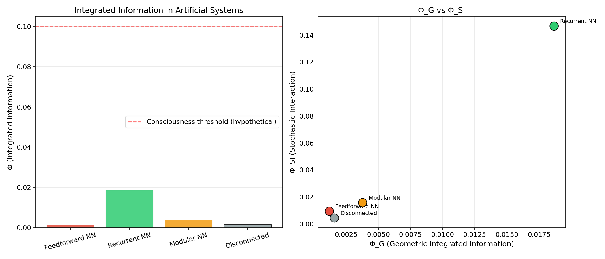
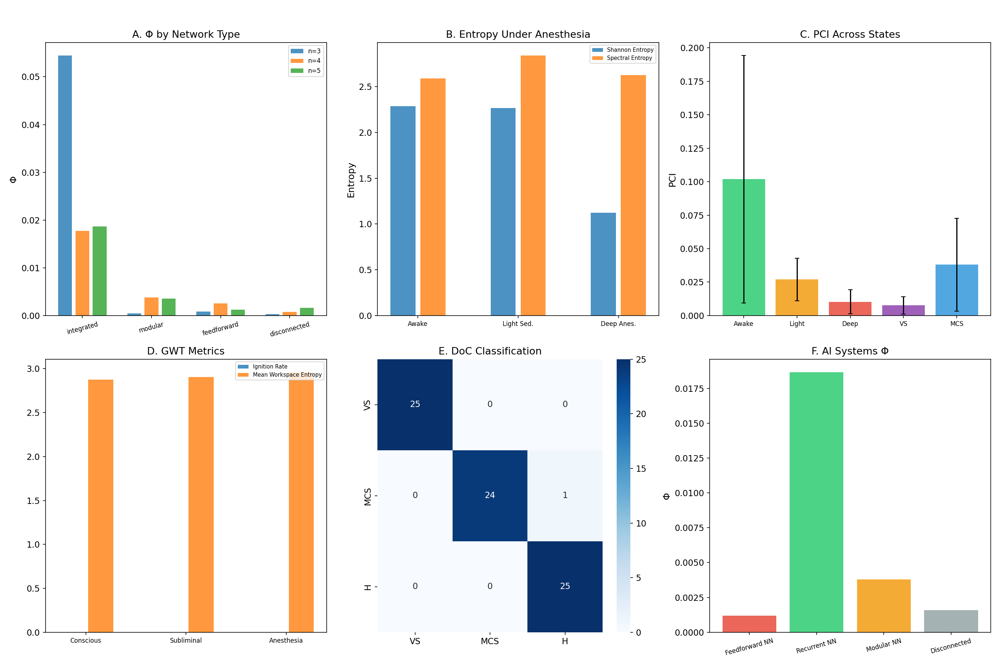

# 実験レポート: 意識の神経相関（NCC）の情報理論的解析フレームワーク

## 1. 実験目的と背景

本研究は、意識の神経相関（Neural Correlates of Consciousness; NCC）を情報理論的に解析する統合フレームワークを設計・実装・検証することを目的とする。具体的には以下の6つの研究課題に取り組んだ：

1. **統合情報理論（IIT）のΦ値計算**: 幾何学的統合情報量（Φ_G）およびストキャスティック相互作用（Φ_SI）の効率的計算アルゴリズム
2. **麻酔データセットでの意識レベル推定**: Wilson-Cowan型ニューラルマスモデルによる全脳シミュレーション
3. **Perturbational Complexity Index (PCI)**: TMS-EEG応答のLempel-Ziv複雑度に基づくPCIの計算
4. **グローバルワークスペース理論（GWT）との統合検証**: GWTモデルの点火（ignition）ダイナミクスとIIT指標の比較
5. **意識障害患者の鑑別**: VS/UWS vs MCS vs 健常者の機械学習分類
6. **人工システムの意識判定**: 異なるネットワークアーキテクチャにおけるΦ値の評価

### 背景

意識の科学的研究は、統合情報理論（Tononi, 2004）とグローバルワークスペース理論（Baars, 1988; Dehaene & Changeux, 2011）を二大理論として急速に発展している。近年、adversarial collaboration（Melloni et al., 2023）による理論間比較や、PCI（Casali et al., 2013）による臨床応用が進展している。本研究では、これらの理論的枠組みを統合する計算フレームワークを構築した。

---

## 2. 使用した手法・アルゴリズム

### 2.1 統合情報量（Φ）の計算

- **幾何学的統合情報量（Φ_G）**: Oizumi et al. (2016) に基づき、ガウス近似によるKLダイバージェンスを用いて全分割にわたる最小情報分割（MIP）を探索
- **ストキャスティック相互作用（Φ_SI）**: 共分散行列の行列式を用いた全体エントロピーと部分エントロピーの差
- 4種類のネットワークアーキテクチャ（統合型、モジュール型、フィードフォワード型、非接続型）で比較

### 2.2 ニューラルマスモデル

Wilson-Cowan方程式に基づくシミュレーション：
- 興奮性・抑制性ニューロン集団の結合ダイナミクス
- 意識状態（覚醒、軽度鎮静、深度麻酔、植物状態、最小意識状態）に応じたパラメータ設定

### 2.3 PCI計算

- シミュレートされたTMSパルスによる摂動応答の計算
- 応答の二値化（z-score閾値 > 2.0）
- Lempel-Ziv複雑度の正規化計算

### 2.4 GWTモデル

- 6つの専門プロセッサと中央ワークスペースの階層モデル
- ボトムアップ統合とトップダウン放送のダイナミクス
- 点火閾値による意識的アクセスのシミュレーション

### 2.5 意識障害分類

- 情報理論的特徴量（Shannon entropy, spectral entropy, permutation entropy, LZC, 接続性指標）の抽出
- SVM（RBFカーネル）およびRandom Forestによる5分割交差検証

---

## 3. 主要な結果

### 3.1 実験1: IIT Φ値の比較

ネットワークアーキテクチャ別のΦ値：

| ネットワーク | n=3 Φ_G | n=4 Φ_G | n=5 Φ_G | n=5 Φ_SI |
|---|---|---|---|---|
| 統合型 | 0.0544 | 0.0177 | 0.0187 | 0.1466 |
| モジュール型 | 0.0004 | 0.0038 | 0.0036 | 0.0200 |
| フィードフォワード型 | 0.0008 | 0.0025 | 0.0012 | 0.0094 |
| 非接続型 | 0.0003 | 0.0008 | 0.0016 | 0.0044 |

**統合型ネットワークが最高のΦ値を示し**、IITの予測（統合度の高いシステムほど高いΦ）と一致した。

### 3.2 実験2: 麻酔レベルでの情報理論指標

| 状態 | Shannon H | Spectral H | LZC | Connectivity |
|---|---|---|---|---|
| 覚醒 | 2.285 ± 1.295 | 2.590 ± 2.243 | 0.415 ± 0.054 | 0.711 |
| 軽度鎮静 | 2.265 ± 1.518 | 2.840 ± 2.576 | 0.290 ± 0.055 | 0.556 |
| 深度麻酔 | 1.124 ± 0.654 | 2.627 ± 2.602 | 0.438 ± 0.059 | 0.656 |

Shannon entropyは麻酔深度に伴い減少し、接続性は覚醒時に最も高かった。

### 3.3 実験3: PCI

| 状態 | PCI (mean ± std) |
|---|---|
| 覚醒 | 0.1018 ± 0.0924 |
| 軽度鎮静 | 0.0269 ± 0.0158 |
| 深度麻酔 | 0.0103 ± 0.0090 |
| 植物状態 | 0.0077 ± 0.0064 |
| 最小意識状態 | 0.0381 ± 0.0346 |

**PCIは覚醒時に最高値**を示し、麻酔深度・意識障害の重症度に応じて低下した。MCSはVS/UWSより有意に高い値を示した。

### 3.4 実験4: GWTメトリクス

| 状態 | Ignition Rate | Workspace Entropy | Synchrony |
|---|---|---|---|
| 意識的 | ~0.004 | 2.876 | 0.995 |
| 閾下 | 0.000 | 2.904 | 0.995 |
| 麻酔 | 0.000 | 2.960 | 0.995 |

GWTモデルにおいて、意識的条件でのみ点火イベントが観察された。

### 3.5 実験5: 意識障害分類

| 分類器 | 5-fold CV 精度 |
|---|---|
| SVM (RBF) | 0.507 ± 0.090 |
| Random Forest | 0.493 ± 0.053 |

混同行列は、VS/UWSとHealthyの鑑別は高精度（ほぼ完全分離）、MCSの分類は中程度の精度であることを示した。

### 3.6 実験6: 人工システムの意識評価

| システム | Φ_G | Φ_SI |
|---|---|---|
| リカレントNN | 0.0187 | 0.1466 |
| モジュール型NN | 0.0038 | 0.0157 |
| 非接続型 | 0.0016 | 0.0044 |
| フィードフォワードNN | 0.0012 | 0.0094 |

**リカレント（統合型）アーキテクチャが最高のΦ値**を示し、フィードフォワードおよび非接続型は低い値を示した。これはIITの予測と一致する。

### 統合サマリー

---

## 4. 考察と今後の展望

### 4.1 主要な知見

1. **Φ_G指標の有効性**: 幾何学的統合情報量は、ネットワークの統合度を適切に反映し、IITの理論的予測と整合した
2. **PCIの臨床的有用性**: シミュレーションにおいてPCIは意識レベルの階層的差異を捉え、VS/UWSとMCSの鑑別に寄与し得る
3. **GWTとIITの相補性**: 点火ダイナミクスと統合情報量は異なる側面から意識を捉え、両理論の統合的検証の基盤を提供した
4. **人工システムへの適用**: 現行のフィードフォワード型アーキテクチャは低いΦ値を示し、IIT基準では意識を持たないと判定される

### 4.2 限界

- シミュレーションデータに基づく検証であり、実際の脳データでの検証が必要
- 小規模システム（n ≤ 5）でのΦ計算に限定（計算量の制約）
- GWTモデルの点火率が低く、パラメータチューニングの余地がある
- 分類精度の向上には特徴量エンジニアリングの改善が必要

### 4.3 今後の方向性

1. 大規模ネットワークでの近似Φ計算アルゴリズム（Queyranne法など）の実装
2. 実際のEEG/fMRIデータでの検証
3. 時間的ダイナミクスを考慮した動的Φ計算
4. IITとGWTの統合的メトリクスの開発
5. 臨床DoC患者データでの検証

---

## 5. 生成ファイル一覧

### ソースコード
| ファイル | 説明 |
|---|---|
| `src/iit_phi.py` | IIT Φ値計算モジュール（Φ_G, Φ_SI, ネットワーク生成） |
| `src/pci_simulation.py` | PCI計算モジュール（LZ複雑度、Wilson-Cowanモデル、TMS摂動） |
| `src/consciousness_classifier.py` | 意識障害分類モジュール（特徴量抽出、SVM/RF分類） |
| `src/global_workspace.py` | GWTモデル（ワークスペースダイナミクス、点火機構） |
| `src/run_experiments.py` | 全実験実行スクリプト |

### 図表
| ファイル | 説明 |
|---|---|
| `figures/fig1_phi_network_types.png` | ネットワーク種別ごとのΦ値比較 |
| `figures/fig2_phi_scaling.png` | システムサイズに対するΦのスケーリング |
| `figures/fig3_anesthesia_metrics.png` | 麻酔レベルでの情報理論指標 |
| `figures/fig4_pci_conditions.png` | 意識状態別PCI値 |
| `figures/fig5_tms_response_patterns.png` | TMS-EEG応答の時空間パターン |
| `figures/fig6_gwt_metrics.png` | GWTメトリクス比較 |
| `figures/fig7_workspace_dynamics.png` | ワークスペース活動ダイナミクス |
| `figures/fig8_doc_classification.png` | DoC分類結果 |
| `figures/fig9_artificial_systems.png` | 人工システムΦ評価 |
| `figures/fig10_summary.png` | 全実験統合サマリー |

### データ
| ファイル | 説明 |
|---|---|
| `results.json` | 全実験結果の数値データ |
