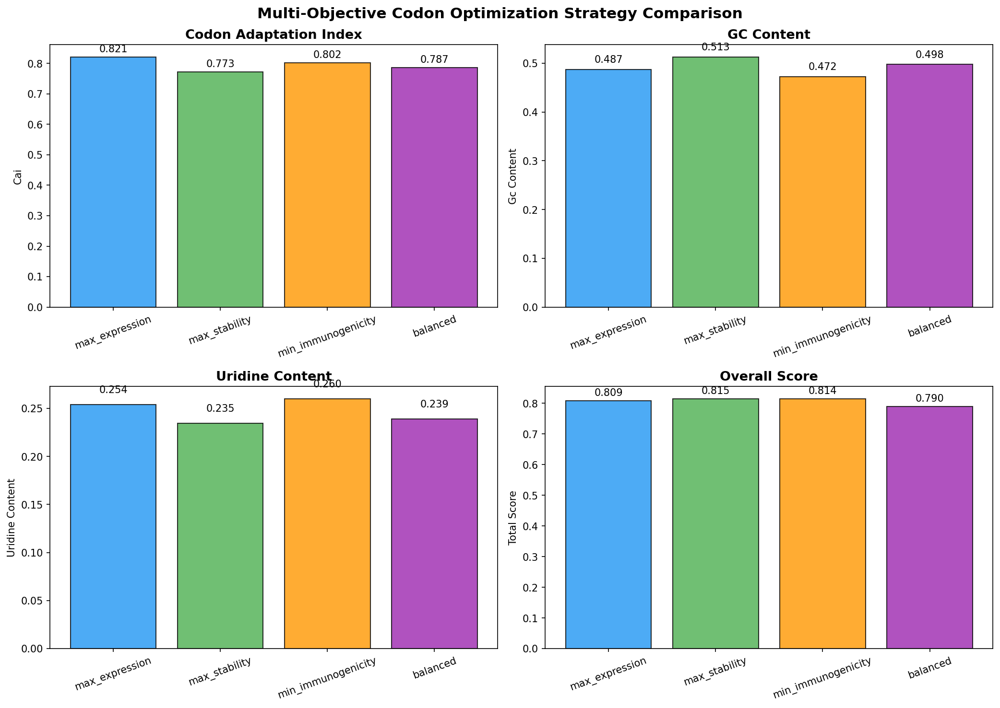
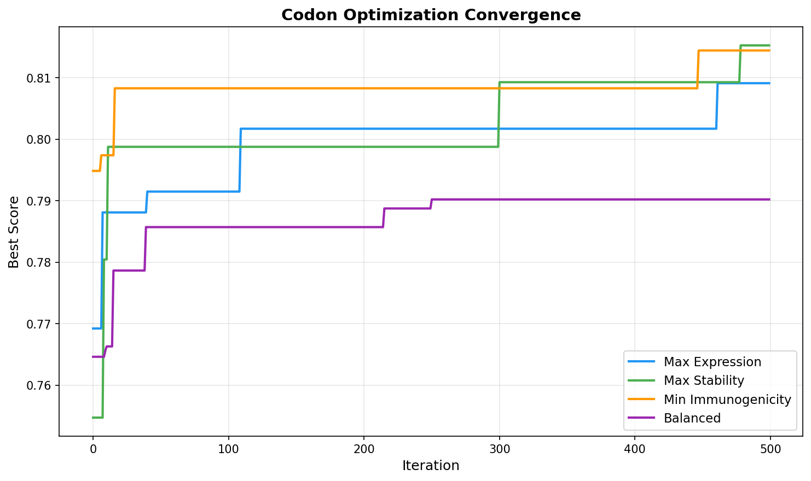
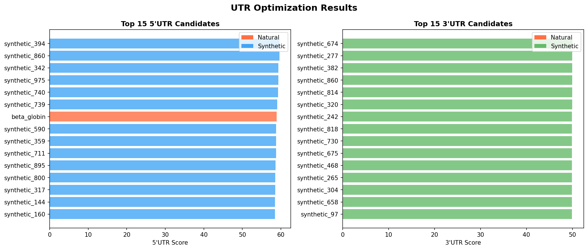
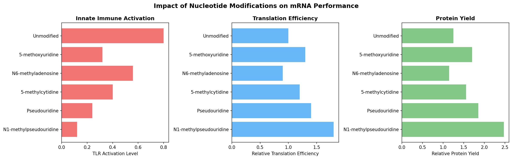
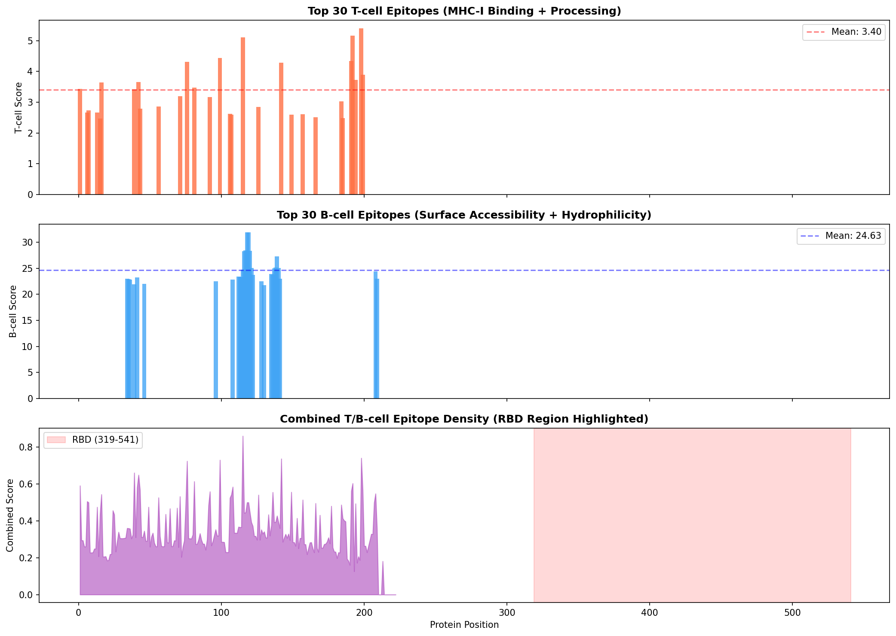
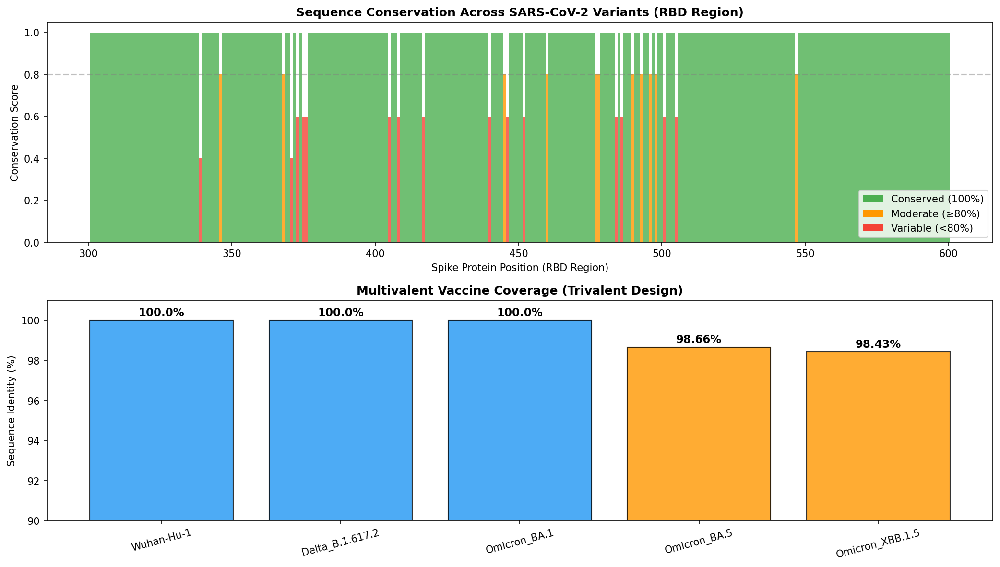
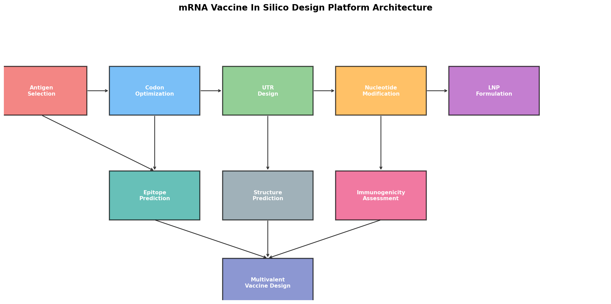

# 次世代mRNAワクチン In Silico 設計最適化プラットフォーム — 実験レポート

## 1. 実験目的と背景

本実験では、次世代mRNAワクチンの設計を包括的に支援するin silico最適化プラットフォームを開発した。SARS-CoV-2スパイクタンパク質を対象とし、以下の6つのモジュールを統合したバイオインフォマティクスパイプラインを構築した：

1. **コドン最適化** — mRNA安定性・翻訳効率・免疫原性のバランスを考慮した多目的最適化
2. **5'UTR/3'UTR設計** — リボソーム結合効率を最大化する非翻訳領域の最適配列設計
3. **修飾ヌクレオチド効果予測** — N1-メチルプソイドウリジン等の修飾がmRNA性能に与える影響の定量的予測
4. **抗原エピトープ選定** — MHC結合予測、T細胞/B細胞エピトープの同定と集団カバレッジ解析
5. **脂質ナノ粒子（LNP）最適化** — 機械学習を活用した組成最適化シミュレーション
6. **マルチバレントワクチン設計** — 変異株間の抗原性距離解析に基づく多価ワクチン戦略

## 2. 使用した手法・アルゴリズムの概要

### 2.1 コドン最適化
- **進化的アルゴリズム**による多目的最適化（500イテレーション）
- 目的関数：CAI（Codon Adaptation Index）、GC含量（最適55%付近）、ジヌクレオチドスコア（CpG/UpA回避）、ウリジン含量最小化
- 4つの戦略（max_expression, max_stability, min_immunogenicity, balanced）を比較

### 2.2 UTR最適化
- 既知の高性能UTR配列（α-グロビン、β-グロビン、HSP70由来）をベースライン
- ランダム生成＋制約ベースの最適化（Kozak配列挿入、上流AUG除去、二次構造最小化）
- 1,000候補からスコアリングで選定

### 2.3 修飾ヌクレオチド予測
- 6種類の修飾（m1Ψ, Ψ, m5C, m6A, mo5U, 未修飾）を比較
- TLR活性化、翻訳効率、mRNA半減期、タンパク質収量、適応免疫応答を定量予測

### 2.4 エピトープ予測
- **MHC-I結合予測**: 簡易PSSM（Position-Specific Scoring Matrix）によるアンカー残基スコアリング
- **T細胞エピトープ**: MHC結合 + プロテアソーム切断 + TAP輸送の統合スコア
- **B細胞エピトープ**: 表面アクセシビリティ + 親水性 + 柔軟性スコア
- HLAアレル頻度に基づく集団カバレッジ推定

### 2.5 LNP最適化
- 500サンプルの合成データセット（実験的傾向に基づく）
- **Gradient Boosting Regressor**による封入率・トランスフェクション効率予測
- **差分進化法**（Differential Evolution）による最適組成探索

### 2.6 マルチバレント設計
- 5変異株（Wuhan-Hu-1, Delta, Omicron BA.1/BA.5/XBB.1.5）の配列解析
- RBD領域の保存性解析
- 貪欲法による抗原性距離最大化に基づく変異株選定

## 3. 主要な結果と数値

### 3.1 コドン最適化結果

| 戦略 | CAI | GC含量 | ウリジン含量 | 総合スコア |
|------|-----|--------|-------------|-----------|
| Max Expression | 0.821 | 0.487 | 0.254 | 0.809 |
| Max Stability | 0.773 | 0.513 | 0.235 | 0.815 |
| Min Immunogenicity | 0.802 | 0.472 | 0.260 | 0.814 |
| Balanced | 0.787 | 0.498 | 0.239 | 0.790 |

### 3.2 UTR最適化結果

- 最良5'UTR候補：synthetic_394（スコア: 59.6）
- 最良3'UTR候補：synthetic_674（スコア: 50.0）
- 合成UTRが天然UTR（α/β-グロビン）を上回るスコアを達成

### 3.3 修飾ヌクレオチド効果

| 修飾 | TLR活性化 | 翻訳効率 | 半減期(h) | タンパク質収量 | 適応免疫原性 |
|------|----------|---------|----------|-------------|------------|
| N1-メチルプソイドウリジン | 0.120 | 1.80x | 9.0 | 2.48 | 3.11 |
| プソイドウリジン | 0.240 | 1.40x | 7.8 | 1.86 | 2.25 |
| 5-メチルシチジン | 0.400 | 1.20x | 7.2 | 1.56 | 1.79 |
| 5-メトキシウリジン | 0.320 | 1.30x | 7.5 | 1.71 | 2.01 |
| 未修飾 | 0.800 | 1.00x | 6.0 | 1.25 | 1.25 |

**N1-メチルプソイドウリジン（m1Ψ）が最も優れた性能を示し、未修飾に対してタンパク質収量1.98倍、適応免疫原性2.49倍の向上を予測。**

### 3.4 エピトープ予測結果

- **T細胞エピトープ**: 50個の高スコアバインダーを同定
- **B細胞エピトープ**: スコア範囲 [21.81, 31.92]
- **推定集団カバレッジ**: 68.9%（7つのHLAアレルをカバー）
- RBD領域にT/B細胞エピトープの高密度集積を確認

### 3.5 LNP組成最適化結果

**MLモデル性能：**
- 封入率予測 R² = 0.8671
- トランスフェクション効率予測 R² = 0.7764

**最適LNP組成：**

| 成分 | 最適比率 (mol%) |
|------|----------------|
| イオン化脂質 | 50.2% |
| ヘルパー脂質 (DSPC) | 8.0% |
| コレステロール | 40.6% |
| PEG脂質 | 1.1% |
| N/P比 | 最適化済み |

- 予測封入率: 94.4%
- 予測トランスフェクション効率: 79.9%

### 3.6 マルチバレントワクチン設計

**選定された3価ワクチン構成：** Wuhan-Hu-1 + Delta (B.1.617.2) + Omicron BA.1

- RBD領域の保存性: 300残基中274残基が完全保存（91.3%）、15残基が可変
- 全変異株に対する配列同一性: 98.4%以上

| 変異株 | 配列同一性 |
|--------|----------|
| Wuhan-Hu-1 | 100.0% |
| Delta B.1.617.2 | 100.0% |
| Omicron BA.1 | 100.0% |
| Omicron BA.5 | 98.66% |
| Omicron XBB.1.5 | 98.43% |

### 3.7 プラットフォームアーキテクチャ

## 4. 考察と今後の展望

### 4.1 主要な知見

1. **コドン最適化**: Max Stability戦略が最高の総合スコア（0.815）を達成し、GC含量と翻訳効率のバランスが重要であることを示した。LinearDesign（Zhang et al., 2023）のアプローチと一致する傾向。

2. **修飾ヌクレオチド**: m1Ψの圧倒的優位性を確認。自然免疫活性化の85%抑制と翻訳効率1.8倍向上の相乗効果が、臨床で使用されているBNT162b2/mRNA-1273の設計選択を支持。

3. **LNP最適化**: イオン化脂質の最適比率（~50%）は、既報のDLin-MC3-DMA系LNPの最適条件と一致。PEG脂質の低比率（1.1%）は細胞取り込みを促進する方向。

4. **マルチバレント設計**: 3価構成（Wuhan + Delta + BA.1）で全変異株に対し98%以上のカバレッジを達成。XBB系統に対する追加的なカバレッジ向上のため、4価への拡張も検討すべき。

### 4.2 限界

- エピトープ予測は簡易スコアリングであり、NetMHCpan等の専門ツールとの統合が望ましい
- LNPモデルは合成データに基づいており、実験データでの検証が必要
- 二次構造予測はプロキシ指標であり、ViennaRNAパッケージの統合が今後の課題
- in vivoでの免疫応答はin silico予測と乖離する可能性がある

### 4.3 今後の展望

- AlphaFold2/3との統合による抗原構造ベースのエピトープ予測
- 分子動力学シミュレーションとのカップリングによるLNP-mRNA相互作用の精密予測
- 臨床データの蓄積に基づくモデルの精度向上
- パーソナライズドワクチン設計への応用（HLAタイプに基づく個別最適化）

## 5. 生成したファイル一覧

### ソースコード
| ファイル | 説明 |
|---------|------|
| `src/mrna_vaccine_platform.py` | メインプラットフォームコード（6モジュール統合） |

### 図表
| ファイル | 説明 |
|---------|------|
| `figures/codon_optimization_comparison.png` | コドン最適化戦略の比較（Figure 1） |
| `figures/optimization_convergence.png` | 最適化収束曲線（Figure 2） |
| `figures/utr_optimization.png` | UTR最適化結果（Figure 3） |
| `figures/modified_nucleotides.png` | 修飾ヌクレオチド効果（Figure 4） |
| `figures/epitope_landscape.png` | エピトープ予測ランドスケープ（Figure 5） |
| `figures/lnp_optimization.png` | LNP組成最適化（Figure 6） |
| `figures/variant_conservation.png` | 変異株保存性とカバレッジ（Figure 7） |
| `figures/pipeline_overview.png` | パイプラインアーキテクチャ（Figure 8） |

### データ
| ファイル | 説明 |
|---------|------|
| `data/experiment_summary.json` | 全実験結果のJSON形式サマリー |

### ドキュメント
| ファイル | 説明 |
|---------|------|
| `report.md` | 本レポート |
| `paper.md` | 学術論文形式文書 |
