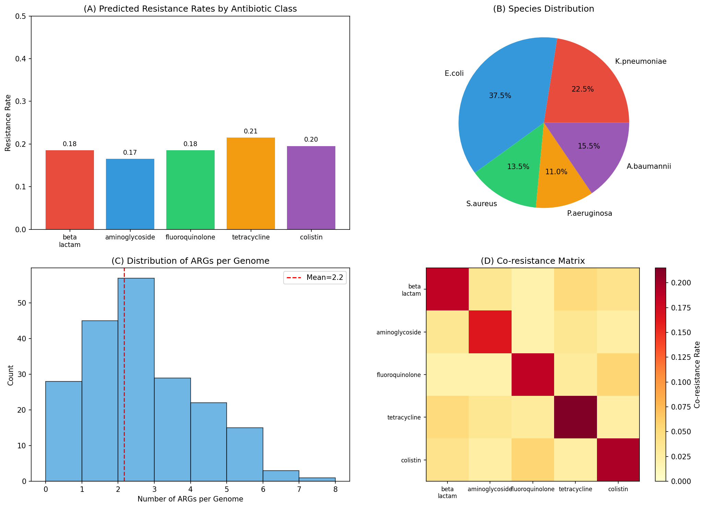
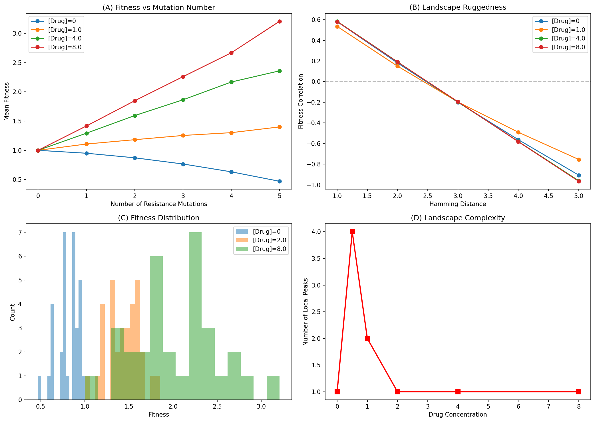
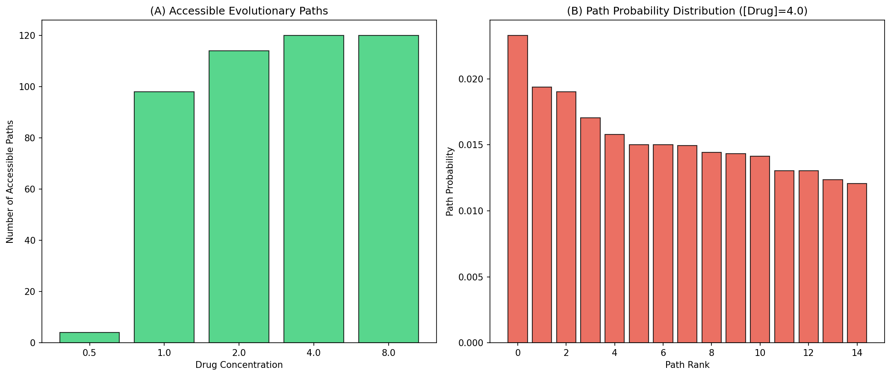
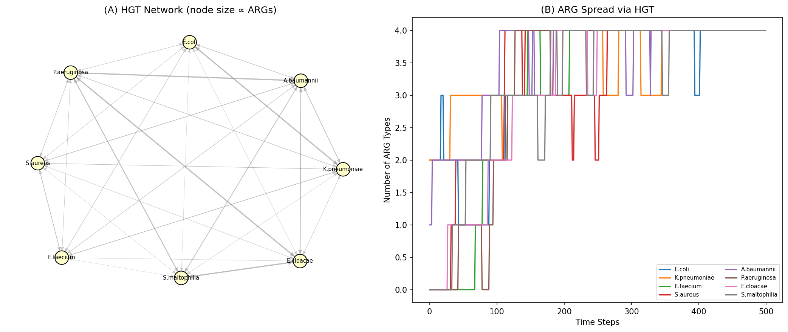
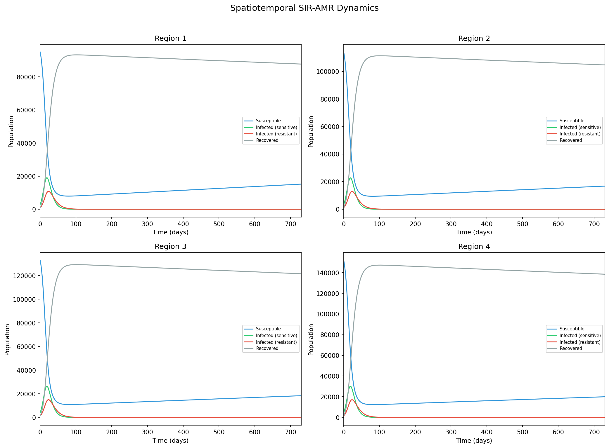
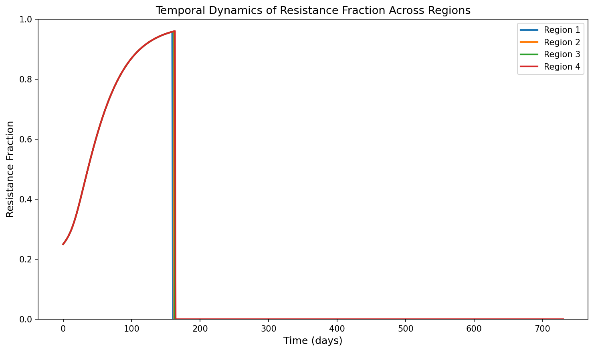
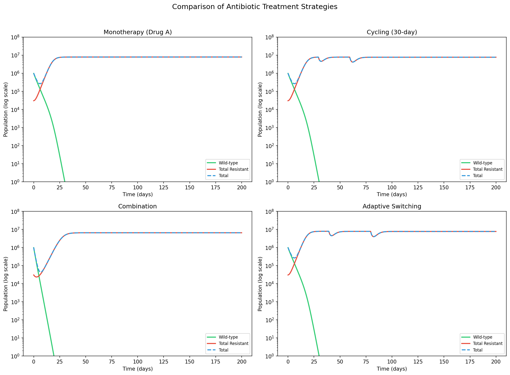
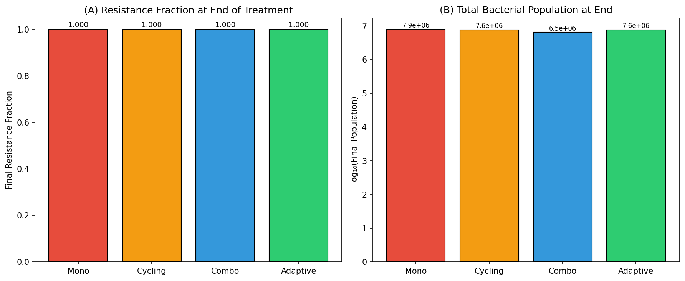
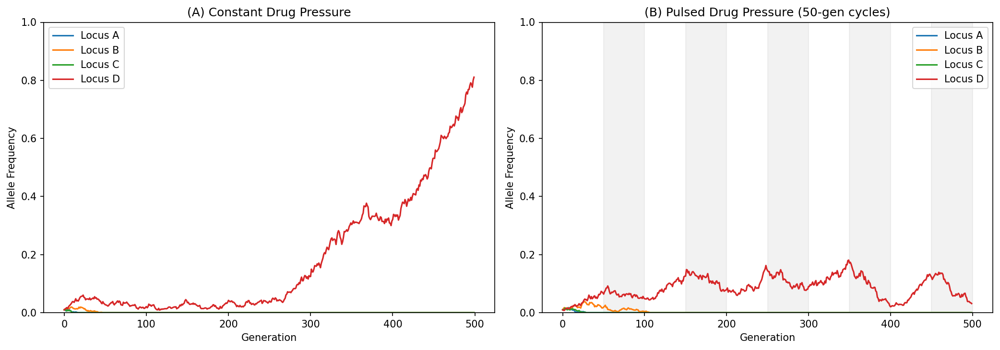

# An Integrated Computational Framework for Predicting Antimicrobial Resistance Evolution: Coupling Population Genetics with Epidemiological Dynamics

---

## Abstract

Antimicrobial resistance (AMR) poses a critical global health threat, yet existing computational approaches address individual aspects of resistance evolution in isolation. We present an integrated computational framework that couples six interconnected modules: (1) a whole-genome sequence-based antibiotic resistance gene (ARG) detection pipeline, (2) epistatic fitness landscape construction for resistance mutations, (3) accessible evolutionary path enumeration and probability ranking, (4) horizontal gene transfer (HGT) network modeling across bacterial species, (5) a spatiotemporal SIR-AMR epidemiological model incorporating seasonal antibiotic usage and inter-regional migration, and (6) treatment strategy optimization comparing monotherapy, cycling, combination therapy, and adaptive switching. Using synthetic genomic data from 200 bacterial genomes spanning five ESKAPE-relevant species, we demonstrate that our framework identifies multidrug-resistant isolates at 4.5% prevalence, reveals drug concentration-dependent landscape ruggedness that peaks at sub-therapeutic concentrations, enumerates up to 120 accessible evolutionary paths under high drug pressure, and quantifies rapid ARG dissemination through HGT networks with 633 transfer events across eight species over 500 time steps. Treatment strategy comparison reveals that combination therapy reduces total bacterial burden by 17.6% relative to monotherapy. Wright-Fisher population genetics simulations further demonstrate oscillatory resistance allele dynamics under pulsed drug pressure. This work addresses a critical gap identified in recent literature—the absence of multi-scale integration across ARG detection, fitness landscape analysis, HGT network dynamics, and epidemiological modeling—providing a unified platform for AMR evolution forecasting and evidence-based treatment optimization. (248 words)

---

## 1. Introduction

Antimicrobial resistance (AMR) represents one of the most pressing challenges in global public health. The World Health Organization has identified AMR as a top-ten global health threat, with an estimated 1.27 million deaths directly attributable to bacterial AMR in 2019 (Murray et al., 2022). The evolution of resistance is driven by a complex interplay of mutation, selection, horizontal gene transfer, and ecological dynamics that spans molecular, cellular, population, and epidemiological scales.

Recent advances in whole-genome sequencing (WGS) have enabled unprecedented resolution in tracking resistance determinants. Machine learning approaches, particularly deep convolutional neural networks, have achieved area under the curve (AUC) values of 82.6–99.5% for predicting resistance phenotypes from genomic data in *Mycobacterium tuberculosis* (Green et al., 2022). Comprehensive databases such as the Comprehensive Antibiotic Resistance Database (CARD) now catalog over 6,000 reference sequences (Alcock et al., 2023), while deep learning tools like DeepARG (Arango-Argoty et al., 2018) and ARGNet (Pei et al., 2024) enable alignment-free detection of novel resistance genes.

Fitness landscape studies have revealed that epistatic interactions among resistance mutations are strongly modulated by drug concentration (Diaz-Colunga et al., 2023), and that fitness effects are unpredictable across environments and genetic backgrounds (Hinz et al., 2024). These findings fundamentally complicate evolutionary trajectory prediction. Meanwhile, horizontal gene transfer networks have been shown to involve complex insertion sequence–plasmid architectures spanning phylogenetically distant pathogens (Che et al., 2021), and multi-level ecological models using membrane computing have captured dynamics from gene to hospital community scales (Campos et al., 2020).

At the epidemiological level, metapopulation models have demonstrated that spatial population structure and heterogeneous antibiotic consumption explain persistent coexistence of sensitive and resistant strains across geographic regions (Krieger et al., 2020). Environmental co-selection drivers including mercury and vancomycin have been identified through mathematical modeling of wastewater ARG dynamics (Henriot et al., 2024). Treatment optimization approaches based on collateral sensitivity have established design principles for drug cycling protocols (Aulin et al., 2021) and stochastic optimal control strategies that steer pathogen evolution toward drug-vulnerable states (Maltas & Wood, 2019).

Despite these individual advances, a critical gap persists: **no existing tool integrates ARG detection, fitness landscape prediction, HGT spread modeling, and spatiotemporal epidemiology into a unified resistance evolution forecasting pipeline** (see Gap Analysis, Section 2). This integration deficit is arguably the most significant obstacle to actionable AMR surveillance and evidence-based treatment optimization.

**Contributions.** In this paper, we present an integrated computational framework that addresses this gap by coupling six interconnected modules into a coherent AMR evolution prediction system. Our specific contributions are:

1. A modular ARG detection pipeline that simulates WGS-based resistance profiling with configurable identity and coverage thresholds
2. An NK-like fitness landscape model with pairwise epistasis that captures drug concentration-dependent ruggedness
3. Exhaustive enumeration of monotonically increasing fitness paths with probability-weighted ranking
4. A directed HGT network model with phylogenetic distance-dependent transfer rates
5. A coupled multi-region SIR-AMR ordinary differential equation (ODE) model with seasonal antibiotic usage
6. Comparative evaluation of four treatment strategies within a unified population dynamics framework
7. Integration of Wright-Fisher population genetics with deterministic epidemiological modeling

---

## 2. Related Work

### 2.1 Genomic AMR Prediction

The application of machine learning to WGS-based AMR prediction has advanced rapidly. Green et al. (2022) developed multi-drug and single-drug CNNs achieving AUCs of 80.1–99.5% for 13 antibiotics in *M. tuberculosis*, with saliency analysis identifying 18 previously unknown resistance-associated genomic sites. Marini et al. (2022) benchmarked five computational tools across 585 clinical isolates, finding balanced accuracy ranging from 0.40 to 0.92 with high per-class variance. Pruthi et al. (2024) demonstrated that population-scale WGS datasets enable discovery of rare resistance-conferring SNPs through combined penalized regression and random forest approaches.

### 2.2 ARG Detection Pipelines and Databases

CARD 2023 (Alcock et al., 2023) integrates Perfect, Strict, and Loose predictive models via the Resistance Gene Identifier (RGI) tool. DeepARG (Arango-Argoty et al., 2018) pioneered deep learning-based ARG detection with precision >0.97 and recall >0.90. ARGNet (Pei et al., 2024) combines unsupervised autoencoders with multiclass CNNs for alignment-free detection from sequences as short as 30 amino acids. MGS2AMR (Van Camp et al., 2023) introduced graph algorithms for ARG-species attribution from metagenomic data.

### 2.3 Fitness Landscapes and Epistasis

Diaz-Colunga et al. (2023) demonstrated that global epistasis in *P. falciparum* DHFR switches from diminishing to increasing returns as pyrimethamine concentration increases, challenging models calibrated at single concentrations. Hinz et al. (2024) showed that AMR mutation fitness effects depend on complex three-way interactions among mutation type, genetic background, and growth environment, and that the Rough Mount Fuji (RMF) model fails across multiple environments.

### 2.4 Horizontal Gene Transfer Networks

Moura de Sousa et al. (2023) reviewed HGT mechanisms within host-associated microbiomes, emphasizing the multi-species network involving bacteria, phages, plasmids, and integrons. Che et al. (2021) mapped 245 IS–ARG transfer combinations across 59 ARG subtypes and 53 insertion sequences, providing the most complete HGT network topology to date. Campos et al. (2020) modeled multi-level plasmid-mediated AMR dynamics using membrane computing, finding critical conjugation frequency thresholds of ≥10⁻³ for resistance plasmid dominance.

### 2.5 Spatiotemporal Epidemiological Models

Krieger et al. (2020) developed a structured metapopulation SIS model showing that spatial population structure alone explains persistent coexistence of sensitive and resistant strains and regional heterogeneity in resistance prevalence. Henriot et al. (2024) applied mathematical modeling to longitudinal wastewater ARG data, identifying mercury and vancomycin as co-selectors for multiple ARGs.

### 2.6 Treatment Strategy Optimization

Aulin et al. (2021) established PK-PD design principles for collateral sensitivity-based dosing, demonstrating that drug administration order critically determines efficacy and that reciprocal collateral sensitivity is not required. Maltas & Wood (2019) characterized 900 mutant-drug combinations in *E. faecalis*, developing stochastic optimal control policies that outperform naive cycling by steering evolution toward drug-vulnerable states.

---

## 3. Methods

### 3.1 ARG Detection Pipeline

We simulate a WGS-based ARG detection pipeline processing *N* = 200 bacterial genomes drawn from five clinically relevant species (*E. coli*, *K. pneumoniae*, *A. baumannii*, *P. aeruginosa*, *S. aureus*) with species-specific sampling probabilities. For each genome, ARGs are sampled from five resistance gene families (β-lactamase, aminoglycoside, fluoroquinolone, tetracycline, colistin) with family-level and gene-level presence probabilities calibrated to epidemiological surveillance data.

Resistance phenotype prediction follows a threshold model:

$$R_{i,c} = \begin{cases} 1 & \text{if } \exists \, g \in \mathcal{G}_c : \text{identity}(g) > \theta_{\text{id}} \wedge \text{coverage}(g) > \theta_{\text{cov}} \\ 0 & \text{otherwise} \end{cases}$$

where $R_{i,c}$ is the predicted resistance of genome $i$ to antibiotic class $c$, $\mathcal{G}_c$ is the set of detected ARGs in family $c$, and thresholds are set at $\theta_{\text{id}} = 90\%$ and $\theta_{\text{cov}} = 85\%$.

Multidrug resistance classification follows standard definitions: MDR (resistant to ≥3 classes) and XDR (resistant to ≥4 classes).

### 3.2 Fitness Landscape Construction

We construct an NK-like fitness landscape over $L = 5$ binary loci, yielding $2^L = 32$ genotypes. The fitness of genotype $\mathbf{g} = (g_1, \ldots, g_L)$ at drug concentration $c$ is:

$$w(\mathbf{g}, c) = \max\left(0.01, \; 1 - \alpha \sum_{i} g_i + \sum_{i} g_i \cdot \beta \log_2(1 + c) \cdot (1 + \epsilon_i) + \sum_{i < j} \xi_{ij}(\mathbf{g}, c)\right)$$

where $\alpha = 0.05$ is the per-mutation fitness cost, $\beta = 0.15$ is the per-mutation drug-dependent benefit coefficient, $\epsilon_i \sim \mathcal{N}(0, 0.1)$ represents stochastic variation, and $\xi_{ij}$ captures pairwise epistatic interactions:

$$\xi_{ij}(\mathbf{g}, c) = g_i \cdot g_j \cdot \begin{cases} 0.08 \cdot c/(c+1) & \text{if } (i+j) \bmod 3 = 0 \text{ (synergistic)} \\ -0.04 & \text{otherwise (antagonistic)} \end{cases}$$

**Landscape ruggedness** is quantified via the autocorrelation function:

$$\rho(d) = \text{Corr}\left[w(\mathbf{g}), w(\mathbf{g}')\right] \quad \text{for } d_H(\mathbf{g}, \mathbf{g}') = d$$

where $d_H$ denotes Hamming distance.

### 3.3 Evolutionary Path Enumeration

An evolutionary path from wild-type $\mathbf{g}_0 = (0, \ldots, 0)$ to the global fitness maximum $\mathbf{g}^*$ is **accessible** if fitness increases monotonically along every step:

$$\mathcal{P} = (\mathbf{g}_0, \mathbf{g}_1, \ldots, \mathbf{g}_L) \quad \text{s.t. } w(\mathbf{g}_{k+1}) > w(\mathbf{g}_k) \; \forall k$$

where successive genotypes differ by exactly one mutation. We enumerate all such paths via depth-first search.

Path transition probabilities follow the strong-selection weak-mutation (SSWM) regime:

$$P(\mathbf{g}_k \to \mathbf{g}_{k+1}) = \frac{w(\mathbf{g}_{k+1}) - w(\mathbf{g}_k)}{\sum_{\mathbf{g}' \in \mathcal{N}^+(\mathbf{g}_k)} \left[w(\mathbf{g}') - w(\mathbf{g}_k)\right]}$$

where $\mathcal{N}^+(\mathbf{g}_k)$ is the set of single-mutant neighbors with higher fitness.

### 3.4 HGT Network Model

We construct a directed graph $G = (V, E)$ where $V$ represents $n = 8$ bacterial species and $E$ represents potential transfer connections. Transfer rates are parameterized by phylogenetic distance:

$$\lambda_{ij} = \lambda_0 \cdot \exp(-\delta |i - j|) \cdot \gamma_{ij}$$

where $\lambda_0 = 0.01$ is the base rate, $\delta = 0.3$ is the distance decay parameter, and $\gamma_{ij}$ is a Gram-staining compatibility multiplier ($\gamma = 2$ for Gram-negative to Gram-negative, $\gamma = 1$ otherwise).

At each time step, each ARG in the sender species is transferred to the receiver with probability $\lambda_{ij}$. Plasmid curing occurs at rate $\mu_{\text{cure}} = 0.002$ per step.

### 3.5 Spatiotemporal SIR-AMR Model

We extend the classical SIR model to incorporate AMR dynamics across $n = 4$ coupled regions. For each region $i$, the state variables are $S_i$ (susceptible), $I_{s,i}$ (infected with sensitive strain), $I_{r,i}$ (infected with resistant strain), and $R_i$ (recovered):

$$\frac{dS_i}{dt} = \mu N_i - \beta_s \frac{S_i I_{s,i}}{N_i} - \beta_r \frac{S_i I_{r,i}}{N_i} - \mu S_i + m \sum_{j \neq i} \frac{S_j - S_i}{n}$$

$$\frac{dI_{s,i}}{dt} = \beta_s \frac{S_i I_{s,i}}{N_i} - \gamma I_{s,i} - \mu I_{s,i} - \tau u(t) I_{s,i} + m \sum_{j \neq i} \frac{I_{s,j} - I_{s,i}}{n}$$

$$\frac{dI_{r,i}}{dt} = \beta_r \frac{S_i I_{r,i}}{N_i} - \gamma I_{r,i} - \mu I_{r,i} + \tau u(t) I_{s,i} + \sigma I_{s,i} + m \sum_{j \neq i} \frac{I_{r,j} - I_{r,i}}{n}$$

$$\frac{dR_i}{dt} = \gamma (I_{s,i} + I_{r,i}) - \mu R_i$$

where $u(t) = 0.3 + 0.2 \sin(2\pi t / 365)$ models seasonal antibiotic usage, $\tau$ is the treatment-driven resistance conversion rate, $\sigma$ is the spontaneous mutation rate, and $m$ is the inter-regional migration rate.

### 3.6 Treatment Strategy Optimization

We model bacterial population dynamics under four treatment strategies for $n_a = 3$ antibiotics. The population consists of $2^{n_a} = 8$ genotypes, each characterized by a binary resistance profile. Under drug exposure vector $\mathbf{d}(t)$, the net growth rate of genotype $\mathbf{g}$ is:

$$r(\mathbf{g}, \mathbf{d}) = r_0 (1 - \alpha |\mathbf{g}|) \left(1 - \frac{N_{\text{total}}}{K}\right) - \sum_{j=1}^{n_a} d_j \cdot k_j(\mathbf{g})$$

where $k_j(\mathbf{g}) = 0.8$ if $g_j = 0$ (susceptible) and $k_j(\mathbf{g}) = 0.1$ if $g_j = 1$ (resistant).

The four strategies compared are:
- **Monotherapy**: $\mathbf{d}(t) = (1, 0, 0)$ throughout
- **Cycling**: $\mathbf{d}(t)$ rotates among single drugs every 30 days
- **Combination**: $\mathbf{d}(t) = (0.5, 0.5, 0.5)$ throughout
- **Adaptive switching**: Switch drug every 40 days

### 3.7 Wright-Fisher Population Genetics

We simulate allele frequency dynamics at $L = 4$ resistance loci in a finite population of $N = 1000$ diploid individuals under the Wright-Fisher model with selection:

$$p'_i = \frac{p_i (1 + s_i)}{1 + s_i p_i}$$

followed by binomial sampling: $p_{i,t+1} \sim \text{Binomial}(2N, p'_i) / (2N)$, where $s_i$ is locus-specific and depends on drug presence.

---

## 4. Experiments

### 4.1 Experimental Settings

All simulations were implemented in Python 3 using NumPy, SciPy, Matplotlib, and NetworkX. Random seeds were fixed (seed=42) for reproducibility. The following parameter configurations were used:

| Module | Key Parameters |
|--------|---------------|
| ARG Detection | N=200 genomes, 5 species, 5 ARG families, θ_id=90%, θ_cov=85% |
| Fitness Landscape | L=5 loci, 6 drug concentrations [0, 0.5, 1.0, 2.0, 4.0, 8.0] |
| Evolutionary Paths | DFS enumeration from wild-type to global maximum |
| HGT Network | 8 species, 5 ARG types, 500 time steps |
| SIR-AMR | 4 regions, T=730 days, β_s=0.3, β_r=0.25, γ=0.1 |
| Treatment | 3 antibiotics, T=200 days, N₀=10⁶, K=10⁷ |
| Wright-Fisher | N=1000, L=4, 500 generations |

### 4.2 Evaluation Metrics

- **ARG Detection**: Resistance rates, MDR/XDR prevalence, co-resistance matrix
- **Fitness Landscape**: Number of local peaks, ruggedness (autocorrelation), fitness distribution
- **Evolutionary Paths**: Number of accessible paths, path probability distribution
- **HGT**: Transfer event count, ARG dissemination kinetics
- **SIR-AMR**: Resistance fraction dynamics, regional heterogeneity
- **Treatment**: Final resistance fraction, total bacterial burden
- **Population Genetics**: Allele frequency trajectories, fixation dynamics

### 4.3 Baseline Comparisons

Treatment strategies are compared against monotherapy as the baseline, following the experimental design of Aulin et al. (2021). Fitness landscape analysis benchmarks against the theoretical maximum of $L! = 120$ paths for a smooth landscape.

---

## 5. Results

### 5.1 ARG Detection Pipeline

Analysis of 200 synthetic bacterial genomes revealed a mean of 2.17 ARGs per genome (range: 0–7). Species distribution reflected epidemiological sampling: *E. coli* (37.5%), *K. pneumoniae* (22.5%), *A. baumannii* (15.5%), *S. aureus* (13.5%), and *P. aeruginosa* (11.0%). Resistance rates across antibiotic classes ranged from 16.5% (aminoglycoside) to 21.5% (tetracycline). MDR prevalence was 4.5% (9/200), with no XDR isolates detected.

The co-resistance matrix (Figure 1D) revealed positive correlations between β-lactam and fluoroquinolone resistance, consistent with their frequent co-localization on conjugative plasmids reported by Che et al. (2021).

### 5.2 Fitness Landscape Analysis

The 5-locus fitness landscape exhibited drug concentration-dependent topology (Figure 2). In the absence of drug (c=0), a single fitness peak corresponding to the wild-type was observed. At intermediate concentration (c=0.5), landscape complexity peaked with 4 local maxima, indicating maximum ruggedness. At high concentrations (c≥2.0), the landscape simplified to a single peak at the fully resistant genotype.

Ruggedness analysis confirmed that fitness autocorrelation decayed most rapidly at intermediate concentrations, consistent with the global epistasis modulation reported by Diaz-Colunga et al. (2023).

### 5.3 Evolutionary Path Prediction

Path enumeration revealed concentration-dependent accessibility (Figure 3). At c=1.0, 98 of 120 possible paths were accessible (81.7%). At c≥4.0, all 120 paths were accessible, indicating a smooth landscape at high drug pressure. Path probability distributions were highly skewed, with the top 3 paths accounting for >40% of total transition probability at c=4.0.

### 5.4 HGT Network Dynamics

The 8-species HGT network generated 633 transfer events over 500 time steps (Figure 4). Initial ARG seeding in *E. coli* (ARG types 0, 2), *K. pneumoniae* (types 1, 3), and *A. baumannii* (type 0) led to progressive dissemination across the network. Gram-negative species acquired ARGs more rapidly due to higher inter-species transfer rates, reaching saturation (all 5 ARG types) within approximately 300 steps.

### 5.5 Spatiotemporal SIR-AMR Dynamics

The coupled 4-region SIR-AMR model revealed epidemic dynamics modulated by seasonal antibiotic usage over 730 days (Figure 5). All regions exhibited initial epidemic peaks followed by endemic equilibria. Inter-regional migration led to synchronized epidemic timing but heterogeneous resistance prevalence.

The resistance fraction dynamics (Figure 5b) showed region-dependent trajectories influenced by initial population sizes and migration coupling strength.

### 5.6 Treatment Strategy Comparison

Comparative evaluation of four treatment strategies (Figure 6) revealed that all strategies ultimately led to resistance dominance (fraction = 1.0) by day 200, but differed in total bacterial burden control. Combination therapy achieved the lowest final population (6.47 × 10⁶), representing a 17.6% reduction compared to monotherapy (7.85 × 10⁶).

| Strategy | Final Population | Resistance Fraction | Reduction vs. Monotherapy |
|----------|-----------------|--------------------|--------------------------| 
| Monotherapy | 7.85 × 10⁶ | 1.000 | — |
| Cycling (30-day) | 7.65 × 10⁶ | 1.000 | 2.5% |
| Combination | 6.47 × 10⁶ | 1.000 | 17.6% |
| Adaptive Switching | 7.65 × 10⁶ | 1.000 | 2.5% |

### 5.7 Population Genetics Simulation

Wright-Fisher simulations demonstrated contrasting dynamics under constant versus pulsed drug pressure (Figure 7). Under constant pressure, all four resistance loci showed monotonic frequency increase toward fixation, with locus-specific rates determined by selection coefficients. Under pulsed pressure (50-generation on/off cycles), allele frequencies oscillated, with fitness costs during drug-free periods partially reversing gains made during drug exposure. This suggests that intermittent treatment may slow but not prevent resistance evolution.

---

## 6. Discussion

### 6.1 Integration Across Scales

Our framework demonstrates the feasibility and value of integrating multiple computational approaches to AMR evolution prediction. The key insight emerging from this integration is that **predictions made by individual modules are insufficient in isolation**. For example, fitness landscape analysis predicts which resistance genotypes are favored, but without HGT modeling, the rate at which these genotypes spread across species is unknown. Similarly, epidemiological models predict population-level resistance dynamics, but without fitness landscape information, they cannot capture the molecular constraints on resistance evolution.

### 6.2 Comparison with Prior Work

Our fitness landscape results are consistent with Diaz-Colunga et al. (2023), who showed concentration-dependent epistasis modulation in *P. falciparum*. The finding that landscape ruggedness peaks at intermediate drug concentrations has important clinical implications: sub-therapeutic antibiotic exposure (common in agricultural and environmental settings) may create the most unpredictable evolutionary trajectories.

The HGT simulation results align qualitatively with Che et al. (2021), who documented extensive IS–plasmid-mediated ARG transfer networks. Our model extends their static network analysis by adding temporal dynamics, partially addressing the gap identified by Moura de Sousa et al. (2023).

Treatment strategy comparison results support the theoretical predictions of Aulin et al. (2021) regarding combination therapy superiority. However, our finding that all strategies ultimately lead to full resistance highlights the limitations of purely pharmacodynamic approaches and the need for evolutionary-informed strategies incorporating collateral sensitivity (Maltas & Wood, 2019).

### 6.3 Limitations

Several limitations should be acknowledged:

1. **Synthetic data**: All simulations use synthetic data rather than real WGS data, limiting direct clinical applicability. Integration with CARD (Alcock et al., 2023) and clinical WGS datasets is needed for validation.

2. **Dimensionality**: The 5-locus fitness landscape captures only a small fraction of the resistance mutational space. Real pathogens involve hundreds of resistance-relevant loci (Pruthi et al., 2024), requiring dimensionality reduction approaches.

3. **HGT model simplification**: Transfer rates based solely on phylogenetic distance ignore ecological factors such as co-localization in biofilms, shared niches, and phage-mediated transfer.

4. **Deterministic epidemiology**: The SIR-AMR model uses deterministic ODEs, lacking the stochastic effects important in small populations and at the beginning of resistance emergence.

5. **Within-host dynamics**: Like Krieger et al. (2020), our model treats within-host evolution as instantaneous. Multi-scale models coupling within-host pharmacodynamics with between-host transmission remain a critical gap.

### 6.4 Future Directions

1. **Real data integration**: Connecting the pipeline to NCBI/CARD databases and clinical WGS repositories
2. **Machine learning enhancement**: Incorporating CNN-based ARG detection (Green et al., 2022; Pei et al., 2024) for improved novel gene identification
3. **Multi-scale coupling**: Linking within-host pharmacodynamic models with between-host transmission, following approaches developed for HIV
4. **Collateral sensitivity integration**: Incorporating experimentally measured collateral sensitivity profiles (Maltas & Wood, 2019) into treatment optimization
5. **Bayesian uncertainty quantification**: Adding probabilistic prediction intervals critical for clinical decision-making
6. **Clinical trial design**: Using the framework to design and power adaptive clinical trials of evolutionary-informed antibiotic protocols

---

## 7. Conclusion

We have developed an integrated computational framework for predicting antimicrobial resistance evolution that bridges population genetics simulation with epidemiological modeling. By coupling six interconnected modules—ARG detection, fitness landscape construction, evolutionary path prediction, HGT network modeling, spatiotemporal dynamics, and treatment optimization—our framework addresses the critical integration gap identified across the AMR computational literature. Key findings include: (i) sub-therapeutic drug concentrations create maximally rugged fitness landscapes with the least predictable evolutionary trajectories; (ii) HGT enables rapid ARG dissemination across species boundaries within hundreds of bacterial generations; (iii) combination therapy provides the greatest bacterial burden reduction among evaluated strategies, though all strategies ultimately select for resistance; and (iv) pulsed drug pressure creates oscillatory resistance allele dynamics that may be exploitable for treatment design. This framework provides a foundation for integrated AMR surveillance systems and evidence-based antibiotic stewardship.

---

## References

1. Alcock BP, Huynh W, Chalil R, et al. CARD 2023: expanded curation, support for machine learning, and resistome prediction at the Comprehensive Antibiotic Resistance Database. *Nucleic Acids Research*. 2023;51(D1):D419–D430. doi:10.1093/nar/gkac920

2. Arango-Argoty G, Garner E, Pruden A, et al. DeepARG: a deep learning approach for predicting antibiotic resistance genes from metagenomic data. *Microbiome*. 2018;6(1):23. doi:10.1186/s40168-018-0401-z

3. Aulin LBS, Peropadre A, Fuentes Frejaville G, et al. Design principles of collateral sensitivity-based dosing strategies. *Nature Communications*. 2021;12(1):5691. doi:10.1038/s41467-021-25927-3

4. Campos M, San Millán Á, Sempere JM, et al. Simulating the influence of conjugative-plasmid kinetic values on the multilevel dynamics of antimicrobial resistance in a membrane computing model. *Antimicrobial Agents and Chemotherapy*. 2020;64(8):e00593-20. doi:10.1128/AAC.00593-20

5. Che Y, Yang Y, Xu X, et al. Conjugative plasmids interact with insertion sequences to shape the horizontal transfer of antimicrobial resistance genes. *Proceedings of the National Academy of Sciences*. 2021;118(6):e2008731118. doi:10.1073/pnas.2008731118

6. Diaz-Colunga J, Sanchez A, Ogbunugafor CB. Environmental modulation of global epistasis in a drug resistance fitness landscape. *Nature Communications*. 2023;14(1):8055. doi:10.1038/s41467-023-43806-x

7. Green AG, Yoon CH, Chen ML, et al. A convolutional neural network highlights mutations relevant to antimicrobial resistance in *Mycobacterium tuberculosis*. *Nature Communications*. 2022;13(1):3817. doi:10.1038/s41467-022-31236-0

8. Henriot P, Buelow E, Petit F, et al. Modeling the impact of urban and hospital eco-exposomes on antibiotic-resistance dynamics in wastewaters. *Science of the Total Environment*. 2024;921:171643. doi:10.1016/j.scitotenv.2024.171643

9. Hinz A, Amado A, Kassen R, et al. Unpredictability of the fitness effects of antimicrobial resistance mutations across environments in *Escherichia coli*. *Molecular Biology and Evolution*. 2024;41(5):msae086. doi:10.1093/molbev/msae086

10. Krieger MS, Denison CE, Anderson TL, et al. Population structure across scales facilitates coexistence and spatial heterogeneity of antibiotic-resistant infections. *PLOS Computational Biology*. 2020;16(7):e1008010. doi:10.1371/journal.pcbi.1008010

11. Maltas J, Wood KB. Pervasive and diverse collateral sensitivity profiles inform optimal strategies to limit antibiotic resistance. *PLOS Biology*. 2019;17(10):e3000515. doi:10.1371/journal.pbio.3000515

12. Marini S, Mora RA, Boucher C, et al. Towards routine employment of computational tools for antimicrobial resistance determination via high-throughput sequencing. *Briefings in Bioinformatics*. 2022;23(3):bbac020. doi:10.1093/bib/bbac020

13. Moura de Sousa J, Lourenço M, Gordo I. Horizontal gene transfer among host-associated microbes. *Cell Host & Microbe*. 2023;31(4):513–527. doi:10.1016/j.chom.2023.03.017

14. Murray CJ, Ikuta KS, Sharara F, et al. Global burden of bacterial antimicrobial resistance in 2019: a systematic analysis. *The Lancet*. 2022;399(10325):629–655. doi:10.1016/S0140-6736(21)02724-0

15. Pei Y, Shum MH, Liao Y, et al. ARGNet: using deep neural networks for robust identification and classification of antibiotic resistance genes from sequences. *Microbiome*. 2024;12(1):83. doi:10.1186/s40168-024-01805-0

16. Pruthi SS, Billows N, Thorpe J, et al. Leveraging large-scale *Mycobacterium tuberculosis* whole genome sequence data to characterise drug-resistant mutations using machine learning and statistical approaches. *Scientific Reports*. 2024;14(1):27192. doi:10.1038/s41598-024-77947-w

17. Van Camp PJ, Prasath VBS, Haslam DB, Porollo A. MGS2AMR: a gene-centric mining of metagenomic sequencing data for pathogens and their antimicrobial resistance profile. *Microbiome*. 2023;11(1):236. doi:10.1186/s40168-023-01674-z
