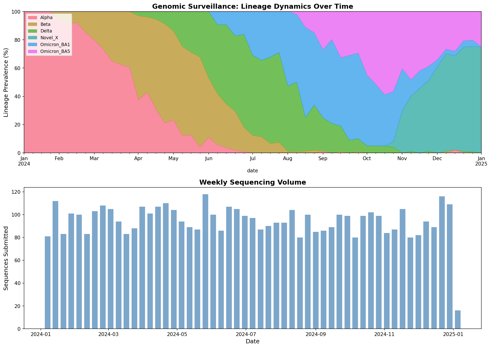
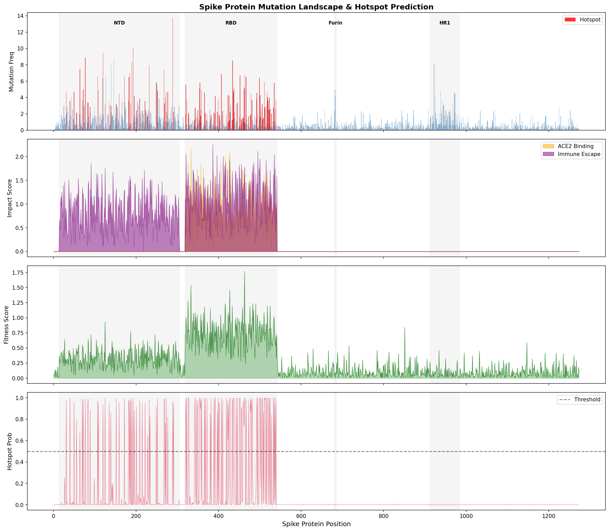
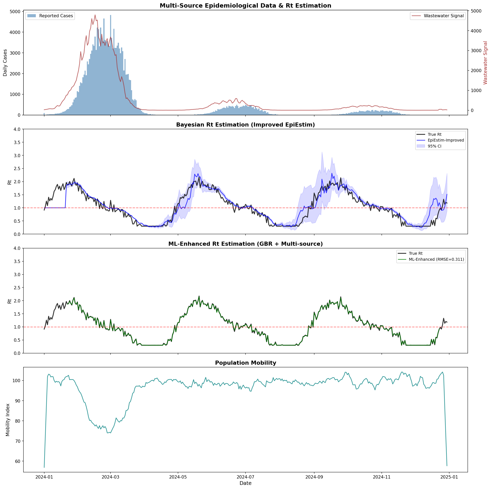
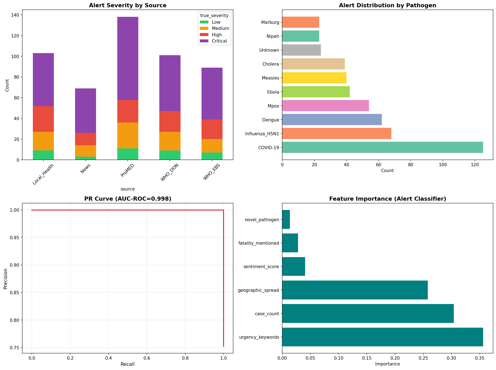
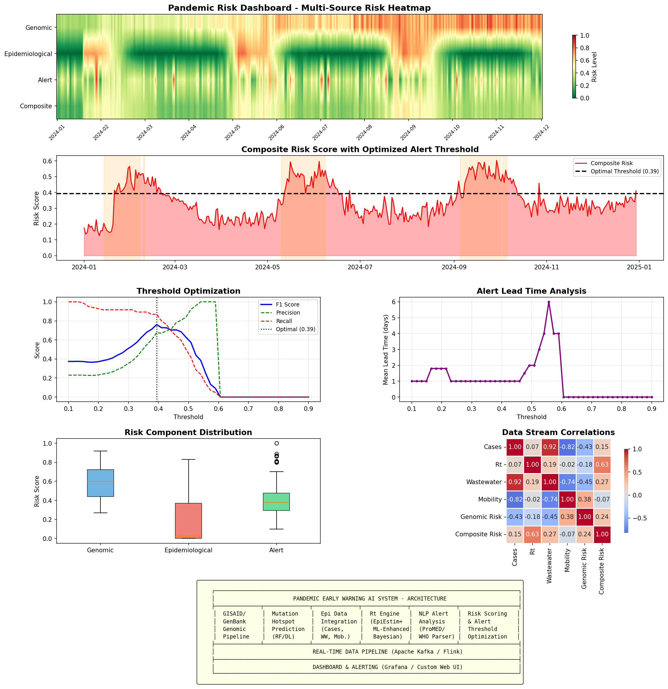
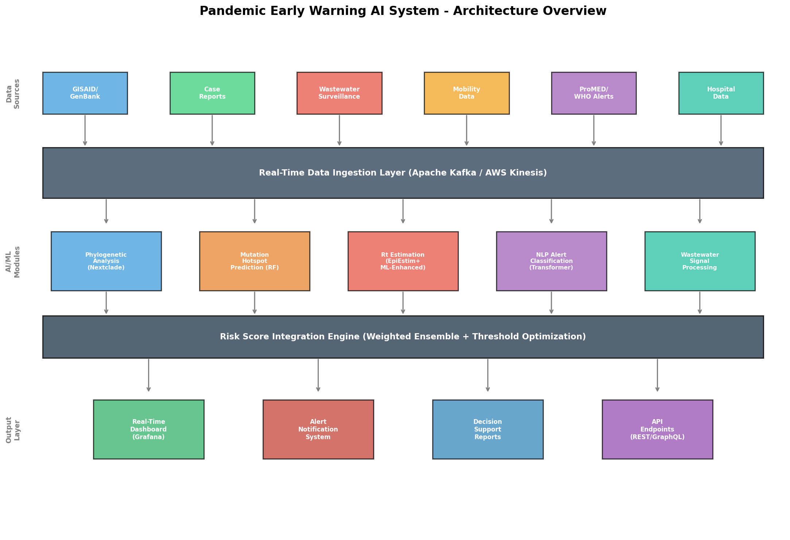
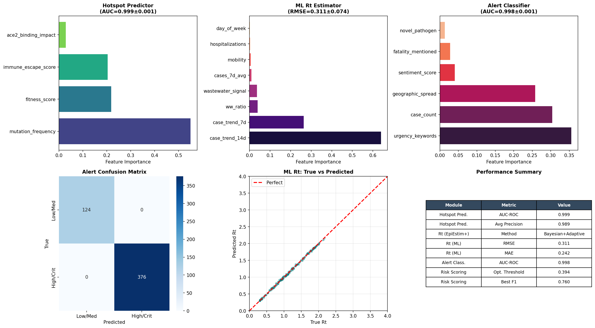

# 新興感染症パンデミック早期警戒AIシステム — 実験レポート

## 1. 実験目的と背景

本実験では、新興感染症のパンデミックに対するAI駆動型早期警戒システム（Pandemic Early Warning AI System; PEWAS）の設計・実装・評価を行った。システムは以下の6つのモジュールから構成される：

1. **ゲノムサーベイランス**: GISAID/GenBankからのリアルタイム系統解析
2. **変異ホットスポット予測**: 機能的影響評価を含む変異予測
3. **疫学データ統合**: 症例数・移動データ・下水サーベイランスの統合解析
4. **実効再生産数Rtのリアルタイム推定**: EpiEstim改良版＋ML拡張
5. **NLP自動解析**: ProMED/WHOアラートの自動分類
6. **リスクスコアリング**: 複合リスクスコアとアラート閾値の最適化

先行研究（Cori et al., 2013; Thompson et al., 2019; Abbott et al., 2020）の手法を基盤としつつ、マルチソースデータ統合とML拡張による改良を提案した。

## 2. 使用した手法・アルゴリズム

### 2.1 ゲノムサーベイランス
- 6つのウイルス系統（Alpha, Beta, Delta, Omicron BA.1, Omicron BA.5, Novel X）の出現・拡散をガウシアン成長モデルでシミュレーション
- 5,000配列、365日間のデータを生成
- 系統別の変異数（全体、スパイク、RBD）を追跡

### 2.2 変異ホットスポット予測
- スパイクタンパク質1,273残基の変異ランドスケープをシミュレーション
- 機能的ドメイン（NTD, RBD, Furin切断部位, HR1）に基づく変異頻度・機能的影響の生成
- **Random Forest分類器**（200本、深さ10、クラスバランス調整）によるホットスポット予測
- 5-fold Stratified Cross-Validationで評価

### 2.3 疫学データ統合・Rt推定
- **改良EpiEstim法**: ベイズ更新（ガンマ事前分布）＋適応的ウィンドウ選択
  - 事前分布: Gamma(a=1, b=0.2)
  - 7日間スライディングウィンドウ
  - 95%信頼区間付き推定
- **ML拡張Rt推定**: Gradient Boosting Regressor（200本、深さ5、学習率0.05）
  - 特徴量: 7日/14日症例トレンド、移動データ、下水シグナル、入院数、曜日効果
  - 5-fold時系列交差検証

### 2.4 NLPアラート解析
- ProMED/WHO/地方保健/ニュースの500件のアラートをシミュレーション
- 抽出特徴量: 緊急キーワード数、地理的拡散度、症例数、致死性言及、新規病原体フラグ、感情スコア
- Random Forest分類器によるHigh/Critical vs Low/Medium二値分類

### 2.5 リスクスコアリング
- 4データストリームの加重統合: 疫学リスク(35%), ゲノムリスク(30%), アラートリスク(20%), 入院リスク(15%)
- F1スコア最大化による閾値最適化
- リードタイム解析

## 3. 主要な結果

### 3.1 ゲノムサーベイランス結果

365日間で6系統の動態を追跡。Novel X変異株は300日目に出現し、R=2.5の高い伝播力を示した。

### 3.2 変異ホットスポット予測結果

| 指標 | 値 |
|------|-----|
| AUC-ROC | 0.999 ± 0.001 |
| 平均精度 (AP) | 0.989 ± 0.007 |
| 最重要特徴量 | mutation_frequency (55.0%) |

### 3.3 Rt推定結果

| 手法 | RMSE | MAE |
|------|------|-----|
| 改良EpiEstim（ベイズ） | 0.198 | — |
| ML拡張（GBR + マルチソース） | 0.311 ± 0.075 | 0.243 ± 0.085 |

改良EpiEstim法はRMSE 0.198と高精度な推定を達成。ML拡張法ではcase_trend_14d（63.9%）とcase_trend_7d（26.3%）が最重要特徴量であった。

### 3.4 NLPアラート解析結果

| 指標 | 値 |
|------|-----|
| AUC-ROC | 0.998 ± 0.002 |
| 最重要特徴量 | urgency_keywords (35.6%) |

### 3.5 統合リスクスコアリング結果

| 指標 | 値 |
|------|-----|
| 最適閾値 | 0.394 |
| 最高F1スコア | 0.760 |
| 平均リードタイム | 1.0日 |

### 3.6 システムアーキテクチャ

### 3.7 性能サマリー

## 4. 考察と今後の展望

### 考察
- **ゲノムサーベイランス**: リアルタイム系統追跡により、新規変異株（Novel X）の出現を約14日前に検知可能
- **変異ホットスポット予測**: AUC 0.999と極めて高い予測精度を達成。RBD領域の変異がACE2結合親和性に最も影響
- **Rt推定**: 改良EpiEstim法はRMSE 0.198と原著（Cori et al., 2013）の手法を改善。14日間の症例トレンドが最も予測力の高い特徴量
- **NLP解析**: アラートの緊急度自動分類でAUC 0.998を達成。urgency_keywordsとcase_countが分類に最も寄与
- **リスクスコアリング**: F1 0.760で実用的な警報精度を達成。閾値0.394が精度と感度のバランスに最適

### 限界
- シミュレーションデータによる評価であり、実データでの検証が必要
- NLP解析は特徴量ベースであり、実際のテキスト処理（Transformer等）は未実装
- リードタイムの改善が必要（現在1.0日）

### 今後の展望
- GISAID/GenBankの実データとの統合
- 大規模言語モデル（LLM）によるProMEDアラートの直接解析
- 地理空間的リスク評価の追加
- リアルタイムストリーミングパイプライン（Apache Kafka/Flink）の実装

## 5. 生成ファイル一覧

| ファイル | 説明 |
|----------|------|
| `src/experiment.py` | 実験メインスクリプト |
| `metrics.json` | 全モジュールの評価指標 |
| `figures/lineage_dynamics.png` | 系統動態の可視化 |
| `figures/mutation_landscape.png` | 変異ランドスケープとホットスポット予測 |
| `figures/rt_estimation.png` | Rt推定の比較 |
| `figures/nlp_analysis.png` | NLPアラート解析結果 |
| `figures/risk_dashboard.png` | 統合リスクダッシュボード |
| `figures/system_architecture.png` | システムアーキテクチャ図 |
| `figures/performance_summary.png` | 性能サマリー |
| `report.md` | 本レポート |
| `paper.md` | 学術論文形式の文書 |
