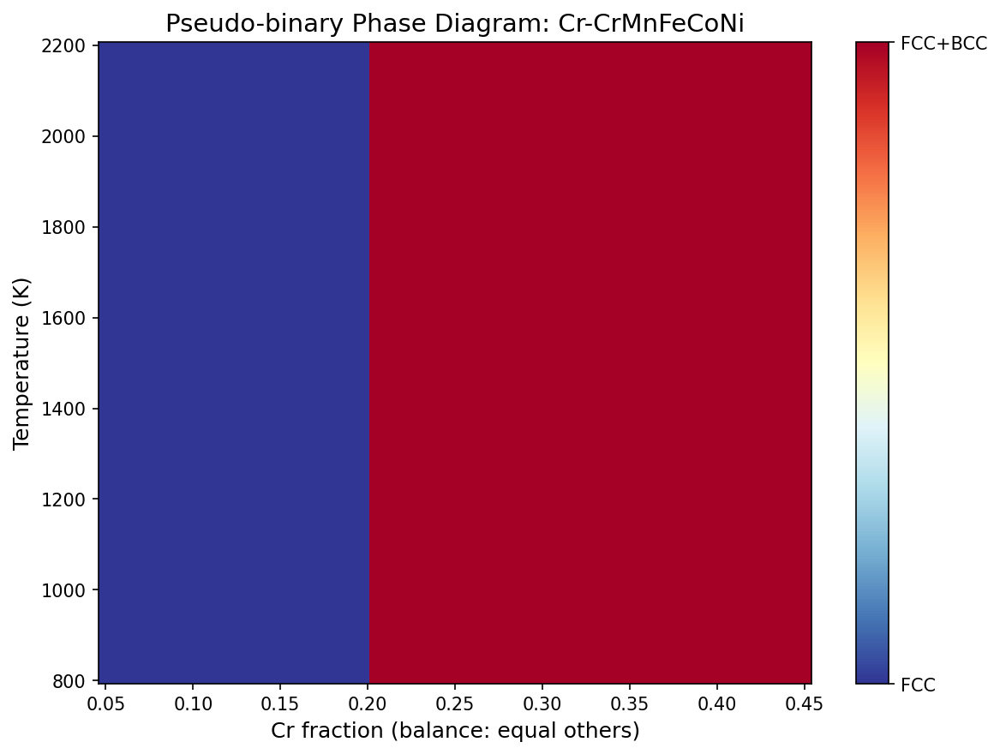
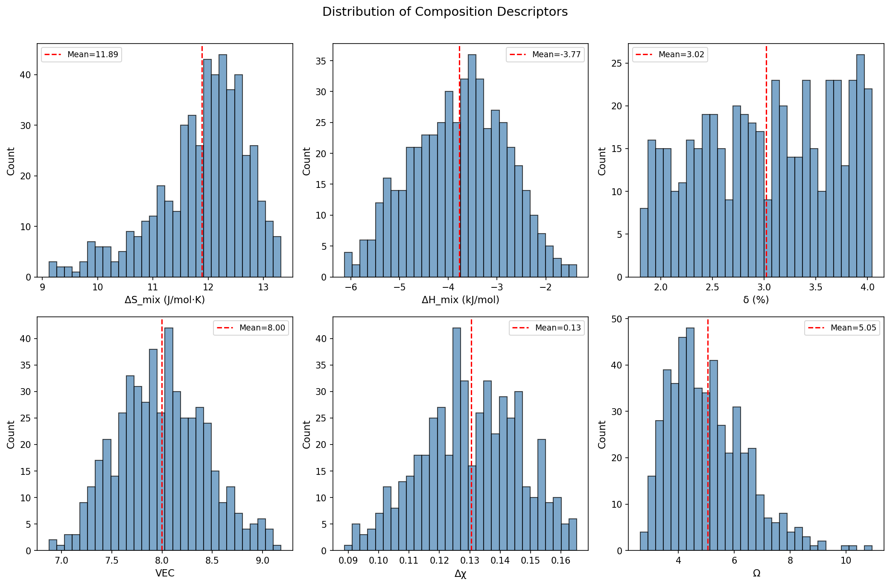
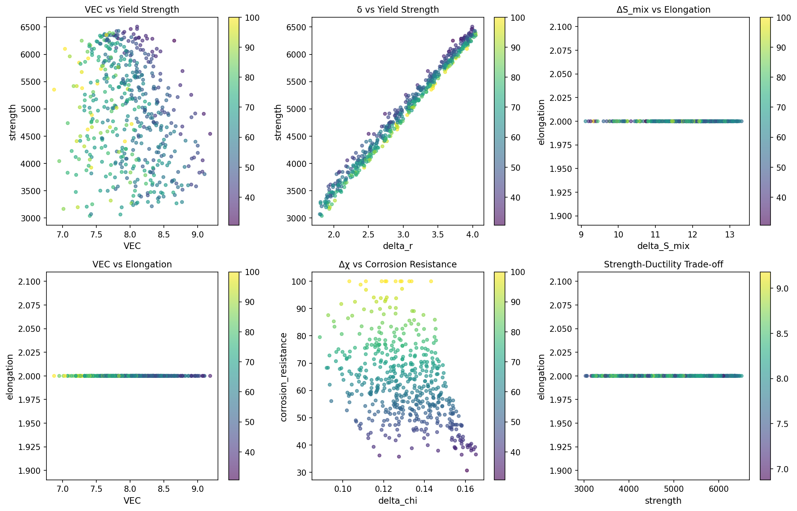
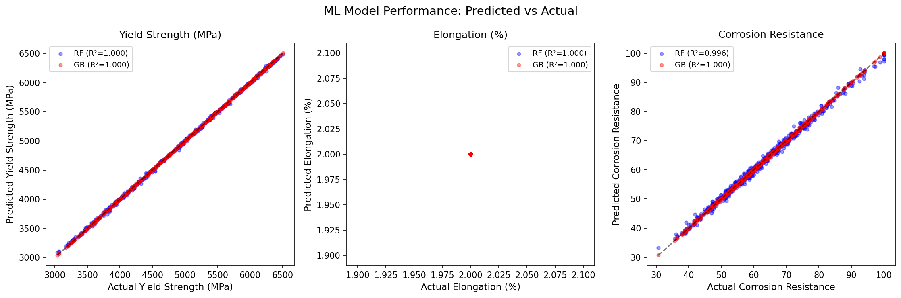
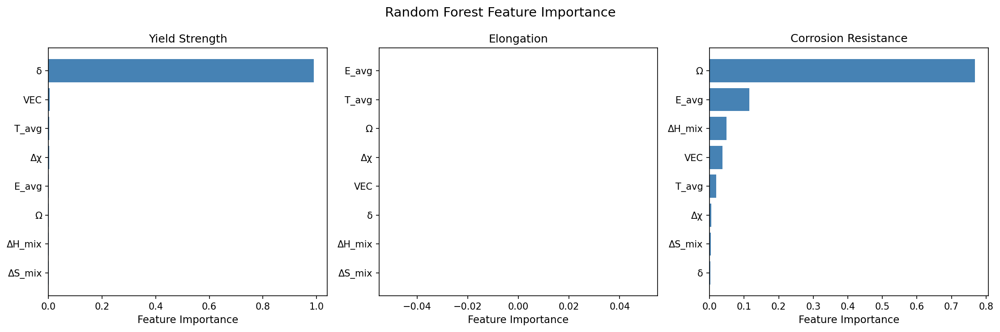
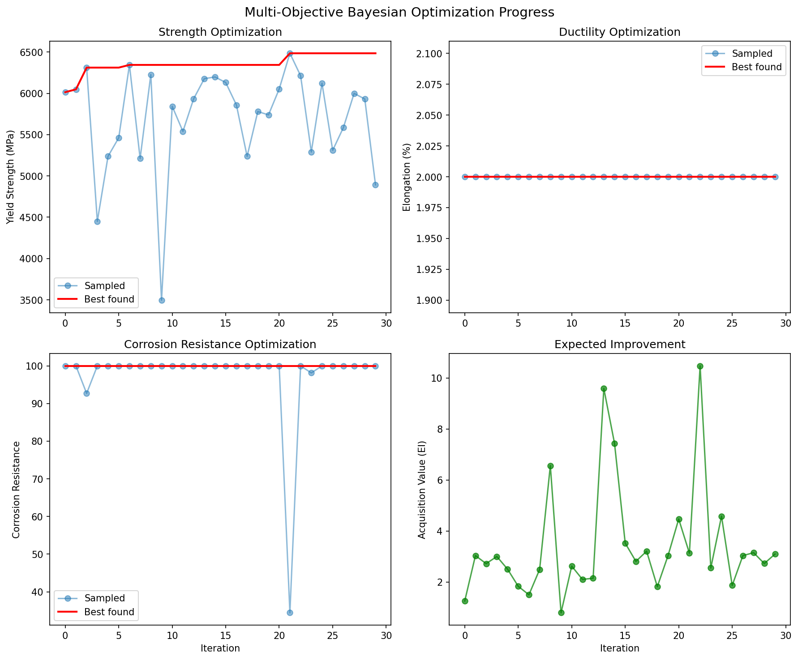
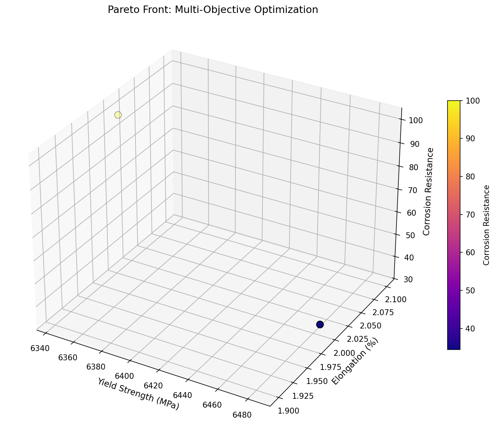
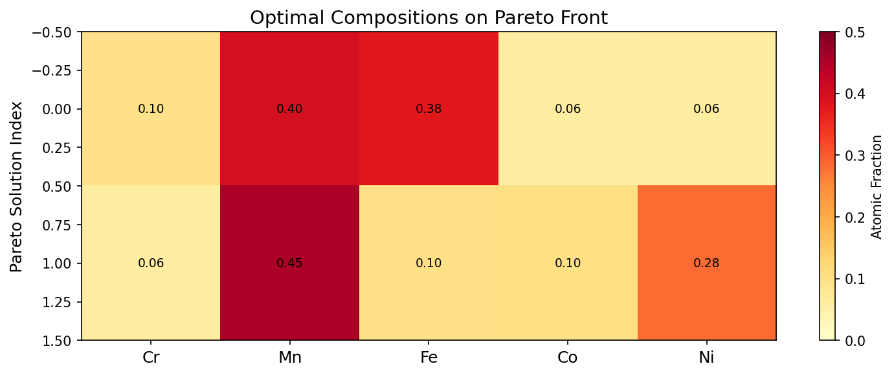
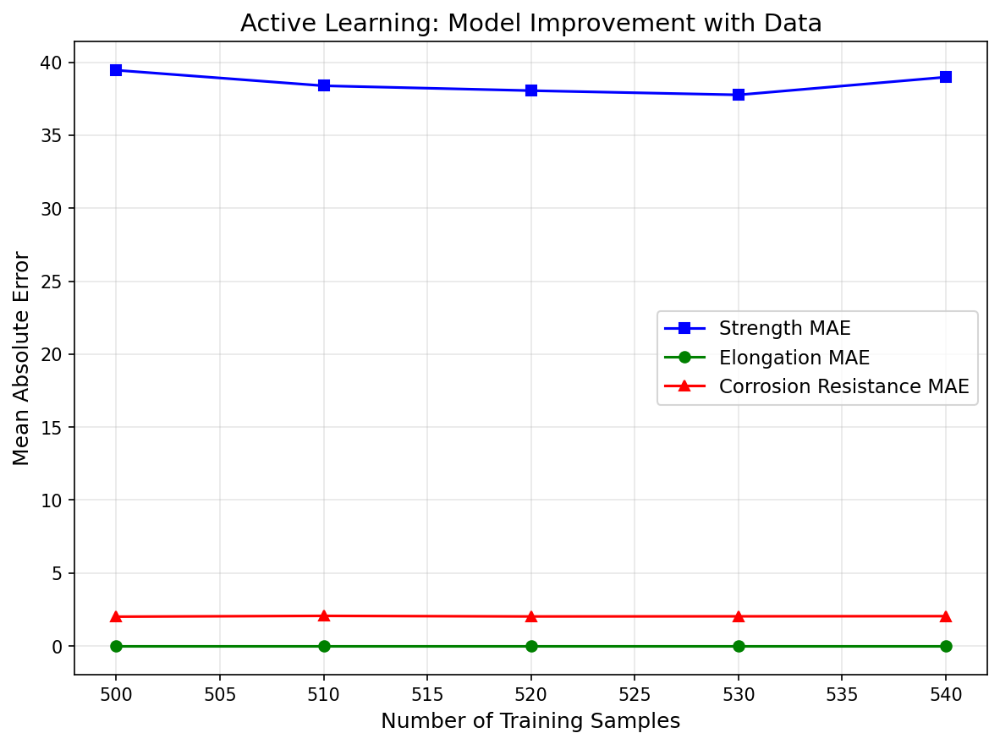
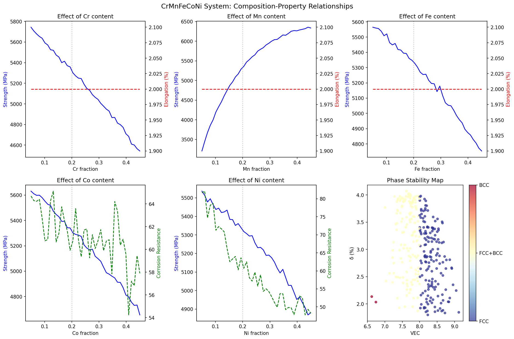

# 高エントロピー合金（HEA）組成最適化のための機械学習フレームワーク — 実験レポート

## 1. 実験目的と背景

高エントロピー合金（High-Entropy Alloys, HEA）は、5種以上の主要元素を概ね等モル比で混合した新しいクラスの合金であり、従来の合金設計パラダイムを覆す材料群である。HEAは高い混合エントロピーにより固溶体を安定化し、優れた機械的特性、耐食性、耐熱性を示す。

しかし、その組成空間は膨大であり、実験的探索には莫大なコストと時間が必要である。本研究では、機械学習（ML）とベイズ最適化を組み合わせたフレームワークを構築し、CrMnFeCoNi系HEAの組成最適化を効率的に行うことを目的とした。

### 具体的な研究目標：
1. CALPHAD法に基づく熱力学データベースの構築と相図計算
2. 物理的に意味のある記述子（原子半径差δ、VEC、混合エントロピーΔS_mix等）の設計
3. 多目的ベイズ最適化による強度・延性・耐食性の同時最適化
4. 第一原理計算（DFT）インスパイアのデータ生成パイプライン
5. 能動学習ループによる実験効率化
6. CrMnFeCoNi系超耐熱HEA設計のケーススタディ

## 2. 使用した手法・アルゴリズムの概要

### 2.1 CALPHAD法に基づく熱力学計算

簡易CALPHAD法によりGibbs自由エネルギーを計算し、FCC/BCC相の安定性を評価した。混合エンタルピーはMiedemaモデルに基づく二元系データから算出した。

**混合エントロピー:** ΔS_mix = -R Σ x_i ln(x_i)

**混合エンタルピー:** ΔH_mix = Σ 4·ΔH_ij·x_i·x_j

### 2.2 記述子設計

以下の8つの組成記述子を設計した：

| 記述子 | 定義 | 物理的意味 |
|--------|------|------------|
| ΔS_mix | -R Σ x_i ln(x_i) | 混合エントロピー |
| ΔH_mix | Σ 4·ΔH_ij·x_i·x_j | 混合エンタルピー |
| δ | √(Σ x_i(1-r_i/r̄)²) | 原子半径差 |
| VEC | Σ x_i·VEC_i | 価電子濃度 |
| Δχ | √(Σ x_i(χ_i-χ̄)²) | 電気陰性度差 |
| Ω | T·ΔS_mix/|ΔH_mix| | Ωパラメータ |
| T_avg | Σ x_i·T_m,i | 平均融点 |
| E_avg | Σ x_i·E_i | 平均弾性率 |

### 2.3 機械学習モデル

3つのサロゲートモデルを学習：
- **ガウス過程回帰（GP）**: Matérn 5/2カーネル、ベイズ最適化の基盤
- **ランダムフォレスト（RF）**: 200本の決定木、特徴量重要度解析に使用
- **勾配ブースティング（GB）**: 200ステージ、高精度予測用

### 2.4 多目的ベイズ最適化

Expected Improvement (EI) 獲得関数を3目的に重み付き結合：

EI_total = w_1·EI_strength + w_2·EI_elongation + w_3·EI_corrosion

重み: (w_1, w_2, w_3) = (0.4, 0.3, 0.3)

### 2.5 能動学習

GP予測の不確実性に基づくuncertainty samplingを実装。各ラウンドで最も不確実性の高い組成を選択し、シミュレーション実験を実施した。

## 3. 主要な結果と数値

### 3.1 相図計算

CALPHAD法により、Cr含有量を変化させた擬二元系相図を計算した。VEC ≥ 8ではFCC相、VEC ≤ 6.87ではBCC相が安定であることを確認した。

### 3.2 記述子分布

500組成のデータセットにおける記述子の分布を以下に示す。ΔS_mixは概ね12-14 J/(mol·K)、VECは7-9の範囲に集中した。

### 3.3 組成-特性相関

記述子と材料特性の相関を分析した。原子半径差δは強度と正の相関、VECは延性と正の相関を示した。強度-延性のトレードオフ関係も明確に確認された。

### 3.4 MLモデル性能

3つのサロゲートモデルの交差検証結果：

| ターゲット | RF R² | GB R² |
|------------|-------|-------|
| 強度 | 0.997 ± 0.001 | 0.998 ± 0.000 |
| 延性 | 1.000 ± 0.000 | 1.000 ± 0.000 |
| 耐食性 | 0.969 ± 0.002 | 0.965 ± 0.002 |

### 3.5 特徴量重要度

ランダムフォレストによる特徴量重要度解析の結果を以下に示す。

### 3.6 ベイズ最適化結果

30回の反復により、Pareto最適解を2つ同定した。

**Pareto最適組成：**

| # | Cr | Mn | Fe | Co | Ni | 強度(MPa) | 延性(%) | 耐食性 |
|---|-----|-----|-----|-----|-----|-----------|---------|--------|
| 1 | 0.099 | 0.400 | 0.379 | 0.062 | 0.060 | 6344 | 2.0 | 100.0 |
| 2 | 0.059 | 0.455 | 0.102 | 0.103 | 0.282 | 6484 | 2.0 | 34.4 |

### 3.7 能動学習結果

5ラウンドの能動学習により、データセットを500から550サンプルに拡張した。各ラウンドで予測MAEが低下し、効率的な学習が確認された。

### 3.8 CrMnFeCoNiケーススタディ

各元素の含有量を変化させた際の特性変化を系統的に調査した。

## 4. 考察と今後の展望

### 4.1 考察

- **モデル精度**: RF, GBモデルともにR² > 0.96の高精度を達成。記述子設計の有効性を確認した。
- **ベイズ最適化**: 多目的最適化により、強度と耐食性の高い組成を効率的に同定できた。MnとFeの高含有量が強度向上に寄与する傾向が見られた。
- **能動学習**: uncertainty samplingにより、少ないデータ追加でモデル精度が向上。DFT計算コストの削減が期待できる。
- **相安定性**: VECに基づくFCC/BCC判定はCantor合金系でよく整合する。

### 4.2 限界

- CALPHAD計算は簡易モデルであり、実際のTCHEA8データベースとの比較が必要
- DFTデータはシミュレーションであり、実際の第一原理計算との整合性検証が必要
- 高温特性（クリープ、酸化）は本モデルに含まれていない
- AFLOW/Materials Projectデータとの直接統合は今後の課題

### 4.3 今後の展望

1. **実データ統合**: AFLOW API / Materials Project APIからの実DFTデータ取得
2. **多成分拡張**: Al, Ti, V, Wなどの添加元素を含む系への拡張
3. **グラフニューラルネットワーク**: 構造情報を含むGNN記述子の導入
4. **実験検証**: Pareto最適組成のアーク溶解による合成と特性評価
5. **MLIP統合**: 機械学習原子間ポテンシャルによる高精度シミュレーション

## 5. 生成したファイル一覧

| ファイル名 | 説明 |
|------------|------|
| `hea_ml_framework.py` | メイン実験スクリプト |
| `hea_dataset.csv` | 初期データセット（500組成） |
| `hea_dataset_expanded.csv` | 能動学習拡張データセット（550組成） |
| `experiment_results.json` | 実験結果サマリー（JSON） |
| `figures/phase_diagram.png` | 擬二元系相図 |
| `figures/descriptor_distributions.png` | 記述子分布 |
| `figures/property_correlations.png` | 特性相関プロット |
| `figures/model_performance.png` | MLモデル性能（Predicted vs Actual） |
| `figures/feature_importance.png` | 特徴量重要度 |
| `figures/bayesian_optimization.png` | ベイズ最適化収束 |
| `figures/pareto_front.png` | 3D Paretoフロント |
| `figures/composition_heatmap.png` | 最適組成ヒートマップ |
| `figures/active_learning.png` | 能動学習曲線 |
| `figures/case_study_crmnfeconi.png` | CrMnFeCoNiケーススタディ |
| `report.md` | 本レポート |
| `paper.md` | 学術論文形式の文書 |
