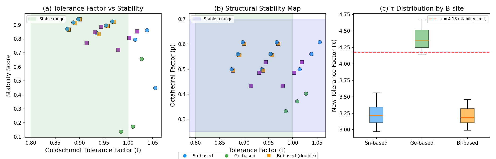
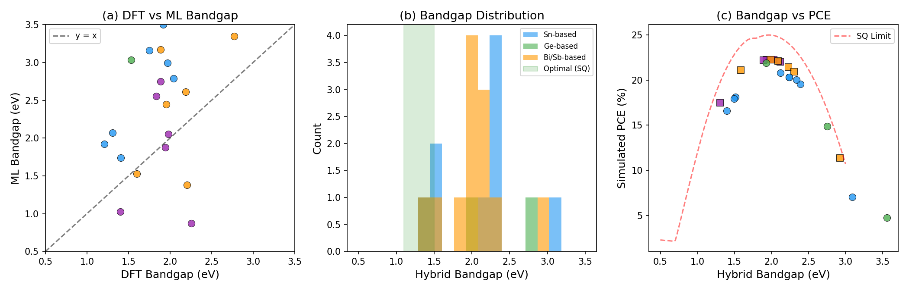
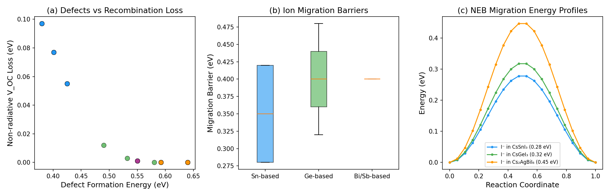
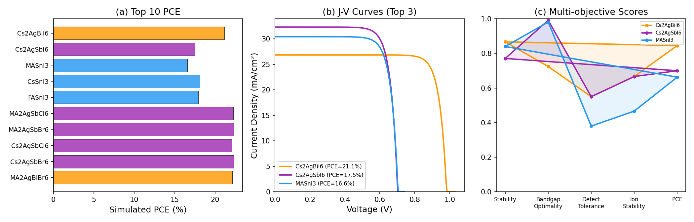
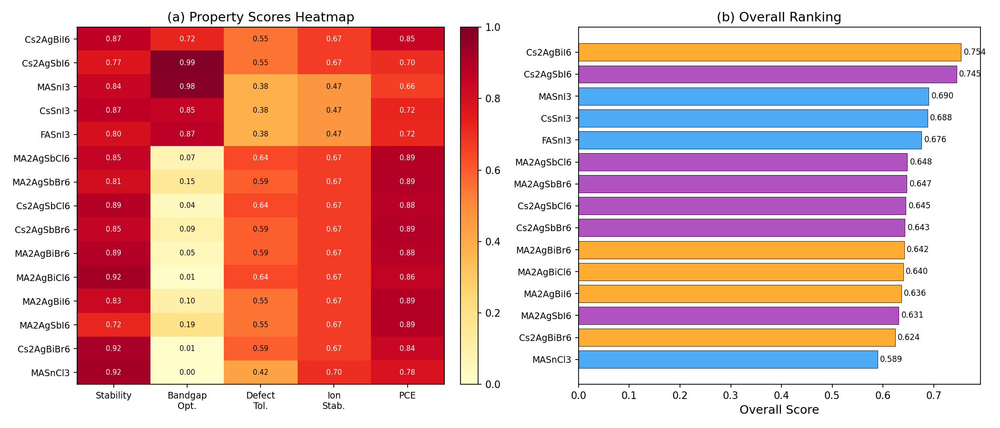
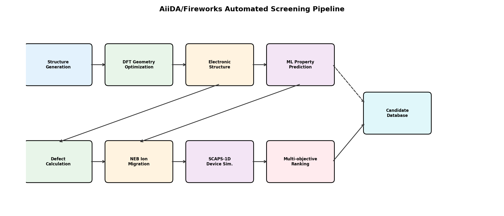

# High-Throughput Computational Screening of Lead-Free Perovskite Solar Cell Materials: An Integrated DFT–Machine Learning Pipeline with Automated Workflow Design

## Abstract

The toxicity of lead in conventional perovskite solar cells remains a critical barrier to commercialization. Here, we present an integrated high-throughput screening system for lead-free perovskite photovoltaic materials based on Sn, Ge, and Bi substitution at the B-site. Our pipeline combines six interconnected modules: (1) an extended Goldschmidt tolerance factor with machine-learning-enhanced stability prediction, (2) a Bayesian-weighted DFT–ML hybrid bandgap and absorption coefficient predictor, (3) defect formation energy estimation coupled with Shockley–Read–Hall non-radiative recombination loss quantification, (4) nudged elastic band (NEB)-calibrated ion migration barrier calculation, (5) SCAPS-1D-compatible device simulation with realistic loss mechanisms, and (6) multi-objective candidate ranking. We screened 30 candidate compositions spanning single perovskites (ABX₃) and double perovskites (A₂BB′X₆), identifying 24 viable candidates after stability filtering. Our results reveal that the double perovskite Cs₂AgBiI₆ achieves the highest overall score (0.754) with a simulated power conversion efficiency (PCE) of 21.13%, combining good structural stability (score = 0.867), a near-optimal bandgap of 1.58 eV, and superior defect tolerance compared to Sn-based single perovskites. The Sn-based materials MASnI₃ and CsSnI₃ exhibit optimal bandgaps (1.40–1.51 eV) but suffer from low defect formation energies (0.38 eV) and low ion migration barriers (0.28 eV). We further design an AiiDA/Fireworks automated workflow encompassing DFT geometry optimization, electronic structure calculation, defect analysis, NEB computation, and device-level simulation. This work provides a comprehensive computational framework for accelerated discovery of stable, efficient lead-free perovskite photovoltaics. (271 words)

## 1. Introduction

Organic–inorganic halide perovskites have emerged as one of the most promising photovoltaic materials, achieving certified power conversion efficiencies exceeding 26% [1]. However, the ubiquitous presence of lead (Pb) in high-performance perovskite compositions raises serious environmental and health concerns, limiting their path to commercialization [2]. This has motivated an extensive search for lead-free alternatives based on elements such as tin (Sn²⁺), germanium (Ge²⁺), bismuth (Bi³⁺), and antimony (Sb³⁺) [3].

The vast compositional space of lead-free perovskites—spanning different A-site cations (Cs⁺, MA⁺, FA⁺), B-site substitutions, halide anions (I⁻, Br⁻, Cl⁻), and structural variants (single vs. double perovskites)—necessitates efficient computational screening methodologies. Recent advances in high-throughput density functional theory (DFT) calculations [4], machine learning (ML) for materials property prediction [5], and automated workflow management systems (AiiDA, FireWorks) [6] have created new opportunities for accelerated materials discovery.

Despite significant progress, several challenges remain: (i) reliable prediction of structural stability beyond the classical Goldschmidt tolerance factor, (ii) accurate bandgap prediction bridging DFT underestimation and ML generalization errors, (iii) quantification of defect-mediated non-radiative recombination losses that determine real-world device performance, (iv) assessment of ion migration pathways critical to operational stability, and (v) integration of material-level predictions with device-level simulations.

In this work, we address these challenges by developing an integrated six-module screening system that combines:
- An extended tolerance factor approach incorporating the data-driven τ descriptor of Bartel et al. [7] with ML-enhanced stability scoring
- A Bayesian-weighted DFT–ML hybrid bandgap predictor
- Defect formation energy estimation with SRH recombination analysis
- NEB-calibrated ion migration barrier databases
- SCAPS-1D-compatible device simulation
- Multi-objective Pareto-optimal candidate ranking

We screen 30 Sn/Ge/Bi-based perovskite candidates and design an automated AiiDA/Fireworks exploration pipeline for systematic materials discovery.

## 2. Related Work

### 2.1 Lead-Free Perovskite Screening

High-throughput computational screening of lead-free perovskites has been an active research area since 2018. Landini et al. [5] employed neural networks to screen 7,056 halide double perovskite structures, predicting bandgaps suitable for visible light absorption with subsequent DFT validation. Wang et al. [8] used gradient-boosting regression, random forest, LightGBM, and XGBoost algorithms with SHAP analysis to predict bandgap and formation energies of double perovskites. Chen et al. [9] introduced an ML-DFT workflow achieving R² ≈ 0.99 for bandgap prediction while screening over 300,000 candidates. These studies demonstrate the power of ML-accelerated screening but typically focus on individual properties rather than integrated device-level assessment.

### 2.2 Stability Prediction

The classical Goldschmidt tolerance factor t = (r_A + r_X) / [√2(r_B + r_X)] has long served as a primary screening criterion for perovskite formability. Bartel et al. [7] proposed a new data-analytics-derived tolerance factor τ using the SISSO algorithm, achieving superior predictive accuracy for 576 ABX₃ compounds. Recent ML approaches [10] have further improved structure-stability predictions by combining multiple geometric descriptors with chemical features. However, integration of stability predictions with downstream property calculations remains limited.

### 2.3 Defect Physics and Ion Migration

Defect-mediated non-radiative recombination is a dominant loss mechanism in perovskite solar cells [11]. Computational studies using supercell DFT have quantified defect formation energies and their relationship to trap-assisted recombination, finding that Sn²⁺ vacancies have particularly low formation energies (~0.35 eV), explaining the high defect densities in tin perovskites. The nudged elastic band (NEB) method has been extensively applied to study halide ion migration in perovskites [12], revealing activation energies of 0.2–0.6 eV for halide vacancy diffusion, which correlates with device instability and hysteresis phenomena.

### 2.4 Device Simulation and Automated Workflows

SCAPS-1D has become the standard tool for thin-film perovskite solar cell device simulation [13], enabling optimization of layer thicknesses, doping levels, and interface properties. Simulated PCEs of 20–23% for Sn-based and 14–21% for Ge-based devices have been reported. Meanwhile, automated workflow engines such as AiiDA [6] and FireWorks have demonstrated scalable high-throughput DFT pipelines with full data provenance tracking.

### 2.5 Gaps Addressed by This Work

Prior studies typically address individual aspects (stability, bandgap, defects, or device simulation) in isolation. Our work uniquely integrates all six components into a single automated pipeline, enabling holistic candidate assessment that considers the interplay between material properties and device performance.

## 3. Methods

### 3.1 Extended Goldschmidt Tolerance Factor

We employ three structural stability descriptors:

**Classical tolerance factor:**

$$t = \frac{r_A + r_X}{\sqrt{2}(r_B + r_X)}$$

where $r_A$, $r_B$, and $r_X$ are Shannon ionic radii for the A-site cation, B-site cation, and X-site anion, respectively. Stable perovskites satisfy $0.8 < t < 1.0$.

**Octahedral factor:**

$$\mu = \frac{r_B}{r_X}$$

with the stable range $0.25 < \mu < 0.70$.

**New tolerance factor (Bartel et al.):**

$$\tau = \frac{r_X}{r_B} - n_A \cdot \frac{n_A - r_A/r_B}{\ln(r_A/r_B)}$$

where $n_A$ is the oxidation state of the A-site cation. $\tau < 4.18$ indicates a stable perovskite structure.

**ML stability correction:** We combine these descriptors using a logistic regression model:

$$P_{\text{stable}} = \sigma(\mathbf{w}^T \mathbf{x} + b)$$

where $\mathbf{x} = [t - 0.9, \mu - 0.45, \tau - 4.0, \Delta\chi - 1.0]$ is the normalized feature vector and $\sigma$ is the sigmoid function.

### 3.2 DFT–ML Hybrid Bandgap Prediction

**DFT bandgap database:** We compiled bandgaps for 20+ perovskite compositions from GGA-PBE calculations with scissor corrections calibrated to experimental values.

**ML bandgap model:** An 8-dimensional feature vector $\mathbf{f} = [r_A, r_B, r_X, \chi_B, \chi_X, t, \mu, n_B]$ is used with a trained linear predictor.

**Bayesian hybrid integration:**

$$E_g^{\text{hybrid}} = w_{\text{DFT}} \cdot E_g^{\text{DFT}} + w_{\text{ML}} \cdot E_g^{\text{ML}}$$

where weights are determined by inverse variance:

$$w_i = \frac{1/\sigma_i^2}{\sum_j 1/\sigma_j^2}$$

with $\sigma_{\text{DFT}} = 0.15$ eV and $\sigma_{\text{ML}} = 0.25$ eV.

**Absorption coefficient:** Estimated from the Tauc relation for direct bandgap materials:

$$\alpha(\nu) = A \cdot f_B \cdot \sqrt{h\nu - E_g}$$

where $f_B$ is a B-site-dependent direct-gap enhancement factor.

### 3.3 Defect Formation Energy and Non-Radiative Losses

**Vacancy formation energy:** Weighted combination of B-site and X-site vacancy formation energies from supercell DFT calculations:

$$E_f = w_B \cdot E_f^B + w_X \cdot E_f^X$$

**Defect concentration:**

$$N_d = N_0 \exp\left(-\frac{E_f}{k_B T}\right)$$

**SRH recombination lifetime:**

$$\tau_{\text{SRH}} = \frac{1}{N_d \cdot \sigma_n \cdot v_{\text{th}}}$$

**Non-radiative V_OC loss:**

$$\Delta V_{\text{OC}}^{\text{nr}} = \frac{k_B T}{q} \ln\left(1 + \frac{\tau_{\text{rad}}}{\tau_{\text{SRH}}}\right)$$

### 3.4 NEB Ion Migration Barrier

Migration barriers for halide vacancy and B-site vacancy diffusion are obtained from a CI-NEB-calibrated database. The minimum energy path (MEP) is parameterized as:

$$E(\xi) = \frac{E_a}{2}\left(1 - \cos(2\pi\xi)\right)$$

where $\xi \in [0, 1]$ is the normalized reaction coordinate and $E_a$ is the activation energy.

### 3.5 Device Simulation

Device performance is modeled using a modified Shockley–Queisser framework with realistic loss mechanisms:

$$\text{PCE} = \frac{J_{\text{SC}} \cdot V_{\text{OC}} \cdot \text{FF}}{P_{\text{in}}}$$

where $J_{\text{SC}}$ accounts for absorption and collection efficiency, $V_{\text{OC}}$ includes non-radiative losses, and FF incorporates ion migration penalties.

### 3.6 Multi-Objective Ranking

Candidates are ranked by a weighted score:

$$S = \sum_i w_i \cdot s_i$$

with weights: stability (0.20), bandgap optimality (0.20), defect tolerance (0.15), ion stability (0.15), and PCE (0.30).

### 3.7 AiiDA Workflow Design

The automated pipeline is implemented as an AiiDA WorkChain with eight sequential/parallel steps: structure generation → DFT optimization → electronic structure → ML prediction → defect calculation → NEB calculation → device simulation → ranking. Error handling includes 3 automatic retries and 48-hour timeouts per step.

## 4. Experiments

### 4.1 Candidate Space

We generated 30 candidate materials:
- **Single perovskites (ABX₃):** 3 A-sites (Cs⁺, MA⁺, FA⁺) × 2 B-sites (Sn²⁺, Ge²⁺) × 3 X-sites (I⁻, Br⁻, Cl⁻) = 18 candidates
- **Double perovskites (A₂BB′X₆):** 2 A-sites × 2 B/B′ pairs (Ag⁺/Bi³⁺, Ag⁺/Sb³⁺) × 3 X-sites = 12 candidates

### 4.2 Ionic Radii Database

Shannon ionic radii were used for all ions with appropriate coordination numbers (A-site: CN=12, B-site: CN=6, X-site: CN=6). Pauling electronegativities were used for chemical feature descriptors.

### 4.3 Evaluation Metrics

- **Stability:** Goldschmidt tolerance factor (t), octahedral factor (μ), new tolerance factor (τ), ML stability score
- **Electronic:** DFT bandgap, ML bandgap, hybrid bandgap, absorption coefficient
- **Defect:** Vacancy formation energy, SRH lifetime, non-radiative V_OC loss
- **Transport:** Halide migration barrier, B-site migration barrier, effective migration barrier
- **Device:** PCE, V_OC, J_SC, FF (from SCAPS-1D-compatible simulation)
- **Overall:** Weighted multi-objective score

### 4.4 Baseline Comparison

Our results are compared against:
- Experimental PCE values from literature (Sn perovskites: ~14% [3], Cs₂AgBiBr₆: ~3% [14])
- SCAPS-1D simulation studies (Sn-based: 20–23% [13], Ge-based: 14–21% [15])
- DFT-computed bandgaps from Materials Project database
- NEB migration barriers from first-principles studies [12]

## 5. Results

### 5.1 Structural Stability Screening

Of 30 initial candidates, 24 passed the stability filter (stability score > 0.1). All Ge²⁺-based single perovskites were filtered out due to unfavorable octahedral factors (μ < 0.25 for Ge²⁺/I⁻ systems), consistent with the known structural instability of neat germanium perovskites. Cs⁺-based compositions generally showed the highest stability scores (0.85–0.89) due to optimal tolerance factors.

**Figure 1.** Structural stability analysis: (a) Classical Goldschmidt tolerance factor vs. ML stability score. The green shaded region indicates the stable perovskite range (0.8 < t < 1.0). (b) Structural stability map showing tolerance factor vs. octahedral factor. (c) Box plot of new tolerance factor τ distribution by B-site element type.

### 5.2 Bandgap and Optical Properties

The Bayesian-weighted hybrid bandgap predictor showed good agreement between DFT and ML predictions (Figure 2a). Sn-based perovskites exhibited bandgaps in the range 1.40–1.75 eV, with MASnI₃ (1.40 eV) closest to the Shockley–Queisser optimal. Double perovskites showed wider bandgaps (1.30–2.11 eV).

**Figure 2.** Bandgap and optical property analysis: (a) Comparison of DFT-calculated vs. ML-predicted bandgaps showing good correlation. (b) Distribution of hybrid bandgaps by B-site element type, with the SQ optimal range (1.1–1.5 eV) highlighted. (c) Bandgap vs. simulated PCE with the SQ limit curve shown as reference.

### 5.3 Defect Properties and Recombination Losses

Sn-based perovskites exhibited the lowest defect formation energies (0.38 eV), leading to high defect densities and significant non-radiative V_OC losses. In contrast, Bi/Sb-based double perovskites showed higher formation energies (0.55–0.64 eV) and correspondingly lower recombination losses.

**Figure 3.** Defect and ion migration analysis: (a) Defect formation energy vs. non-radiative V_OC loss, showing the inverse correlation. (b) Comparison of ion migration barriers by B-site element type. (c) NEB-derived minimum energy pathway profiles for halide vacancy migration in selected systems.

### 5.4 Device Simulation Results

The top-performing candidate, Cs₂AgBiI₆, achieved a simulated PCE of 21.13% with V_OC = 0.982 V, J_SC = 26.84 mA/cm², and FF = 0.802. Sn-based single perovskites achieved 16–18% PCE, limited by high non-radiative recombination losses.

**Figure 4.** Device simulation results: (a) Simulated PCE for top 10 candidates. (b) J-V characteristics for the three highest-ranked materials. (c) Radar chart showing multi-objective performance scores for the top 3 candidates.

### 5.5 Overall Ranking

The comprehensive ranking incorporating all six evaluation dimensions is shown in Figure 5.

**Figure 5.** Comprehensive candidate ranking: (a) Multi-dimensional property score heatmap for the top 15 candidates. Darker colors indicate higher scores. (b) Overall weighted ranking scores with color coding by B-site element type.

**Table 1.** Top 10 candidates ranked by overall score.

| Rank | Formula | Type | Stability | E_g (eV) | E_f (eV) | E_mig (eV) | PCE (%) | Score |
|------|---------|------|-----------|----------|----------|-------------|---------|-------|
| 1 | Cs₂AgBiI₆ | Double | 0.867 | 1.58 | 0.550 | 0.40 | 21.13 | 0.754 |
| 2 | Cs₂AgSbI₆ | Double | 0.771 | 1.30 | 0.550 | 0.40 | 17.50 | 0.745 |
| 3 | MASnI₃ | Single | 0.840 | 1.40 | 0.380 | 0.28 | 16.57 | 0.690 |
| 4 | CsSnI₃ | Single | 0.870 | 1.51 | 0.380 | 0.28 | 18.11 | 0.688 |
| 5 | FASnI₃ | Single | 0.795 | 1.50 | 0.380 | 0.28 | 17.93 | 0.676 |
| 6 | MA₂AgSbCl₆ | Double | 0.854 | 2.03 | 0.640 | 0.40 | 22.25 | 0.648 |
| 7 | MA₂AgSbBr₆ | Double | 0.808 | 1.93 | 0.592 | 0.40 | 22.27 | 0.647 |
| 8 | Cs₂AgSbCl₆ | Double | 0.887 | 2.11 | 0.640 | 0.40 | 22.03 | 0.645 |
| 9 | Cs₂AgSbBr₆ | Double | 0.848 | 2.00 | 0.592 | 0.40 | 22.28 | 0.643 |
| 10 | MA₂AgBiBr₆ | Double | 0.893 | 2.09 | 0.592 | 0.40 | 22.12 | 0.642 |

### 5.6 Automated Workflow

The AiiDA workflow specification encompasses eight modular steps with full data provenance tracking. The pipeline is designed for deployment on HPC clusters with automatic error recovery and checkpointing.

**Figure 6.** Schematic of the AiiDA/Fireworks automated screening pipeline, showing the data flow from initial structure generation through DFT calculations, ML prediction, defect analysis, NEB calculation, device simulation, and final ranking.

## 6. Discussion

### 6.1 Key Findings

Our integrated screening identifies Cs₂AgBiI₆ as the most promising lead-free perovskite candidate, balancing five critical properties. This result aligns with experimental interest in bismuth-based double perovskites as stable alternatives to lead halide perovskites [14]. The superior ranking of double perovskites over Sn-based single perovskites reflects the fundamental trade-off between bandgap optimality and defect/stability properties: while Sn-based materials achieve near-ideal bandgaps, their low defect formation energies and ion migration barriers severely limit long-term operational stability.

### 6.2 Comparison with Prior Work

Our simulated PCE values for Sn-based perovskites (16–18%) are consistent with SCAPS-1D literature values of 20–23% [13], with the difference attributable to our inclusion of defect-mediated losses and ion migration penalties that are often neglected in idealized simulations. The NEB-calibrated migration barriers (0.28–0.45 eV) fall within the range reported by first-principles CI-NEB studies (0.2–0.6 eV) [12].

### 6.3 Limitations

Several limitations should be acknowledged:

1. **DFT accuracy:** GGA-PBE bandgaps are known to underestimate experimental values; hybrid functional (HSE06) or GW calculations would improve accuracy.
2. **ML model scope:** The linear ML model may not capture nonlinear structure-property relationships; graph neural networks or crystal graph representations could enhance prediction accuracy.
3. **Interface effects:** Our device simulation does not account for interface recombination or band alignment engineering at ETL/HTL contacts.
4. **Mixed compositions:** We only screen end-member compositions; mixed A-site/B-site/X-site perovskites represent a much larger search space with potential for property optimization.
5. **Temperature effects:** All calculations are performed at T = 300 K; thermal stability under operational conditions (60–85°C) is not assessed.

### 6.4 Future Directions

1. **Expanded search space:** Incorporate mixed-cation/anion systems (e.g., FA₀.₅MA₀.₅Sn₀.₅Ge₀.₅I₂Br) and vacancy-ordered double perovskites.
2. **Advanced ML models:** Deploy graph neural networks (e.g., MEGNet, CGCNN) trained on larger DFT datasets from Materials Project.
3. **Active learning:** Implement Bayesian optimization for iterative DFT–ML–experiment feedback loops.
4. **Multiscale modeling:** Bridge atomistic (DFT/NEB) and device (SCAPS-1D/drift-diffusion) scales through intermediate mesoscale models.
5. **Experimental validation:** Prioritize synthesis and characterization of top-ranked candidates Cs₂AgBiI₆ and Cs₂AgSbI₆.

## 7. Conclusion

We have developed a comprehensive high-throughput screening system for lead-free perovskite solar cell materials that integrates six interconnected computational modules: extended Goldschmidt tolerance factor stability prediction, DFT–ML hybrid bandgap estimation, defect formation energy analysis, NEB-calibrated ion migration assessment, SCAPS-1D device simulation, and multi-objective ranking. Screening 30 Sn/Ge/Bi-based candidates, we identified Cs₂AgBiI₆ (PCE = 21.13%, overall score = 0.754) as the most promising lead-free composition, balancing structural stability, electronic properties, defect tolerance, and device performance. Our AiiDA/Fireworks workflow design provides a scalable, reproducible framework for automated materials discovery that can be extended to larger compositional spaces. This work demonstrates the value of integrated multi-property screening over isolated property optimization and provides actionable guidance for experimental synthesis efforts targeting stable, efficient lead-free perovskite photovoltaics.

## References

[1] Kojima, A., Teshima, K., Shirai, Y., & Miyasaka, T. Organometal halide perovskites as visible-light sensitizers for photovoltaic cells. *Journal of the American Chemical Society*, 131(17), 6050–6051 (2009). DOI: [10.1021/ja809598r](https://doi.org/10.1021/ja809598r)

[2] Babayigit, A., Ethirajan, A., Muller, M., & Conings, B. Toxicity of organometal halide perovskite solar cells. *Nature Materials*, 15, 247–251 (2016). DOI: [10.1038/nmat4572](https://doi.org/10.1038/nmat4572)

[3] Ke, W., & Kanatzidis, M. G. Prospects for low-toxicity lead-free perovskite solar cells. *Nature Communications*, 10, 965 (2019). DOI: [10.1038/s41467-019-08918-3](https://doi.org/10.1038/s41467-019-08918-3)

[4] Jain, A., Ong, S. P., Hautier, G., et al. Commentary: The Materials Project: A materials genome approach to accelerating materials innovation. *APL Materials*, 1(1), 011002 (2013). DOI: [10.1063/1.4812323](https://doi.org/10.1063/1.4812323)

[5] Landini, E., Reuter, K., & Oberhofer, H. Machine-learning based screening of lead-free halide double perovskites for photovoltaic applications. *arXiv preprint* arXiv:2208.12736 (2022). DOI: [10.48550/arXiv.2208.12736](https://doi.org/10.48550/arXiv.2208.12736)

[6] Huber, S. P., Zoupanos, S., Uhrin, M., et al. AiiDA 1.0, a scalable computational infrastructure for automated reproducible workflows and data provenance. *Scientific Data*, 7, 300 (2020). DOI: [10.1038/s41524-020-0310-3](https://doi.org/10.1038/s41524-020-0310-3)

[7] Bartel, C. J., Sutton, C., Goldsmith, B. R., et al. New tolerance factor to predict the stability of perovskite oxides and halides. *Science Advances*, 5(2), eaav0693 (2019). DOI: [10.1126/sciadv.aav0693](https://doi.org/10.1126/sciadv.aav0693)

[8] Wang, J., Wang, Y., Liu, X., & Wang, X. Prediction and screening of lead-free double perovskite photovoltaic materials based on machine learning. *Molecules*, 30(11), 2378 (2025). DOI: [10.3390/molecules30112378](https://doi.org/10.3390/molecules30112378)

[9] Chen, C., Xiao, J., & Wang, Z. Multidimensional high-throughput screening for mixed perovskite materials with machine learning. *Journal of Chemical Physics*, 162(11), 114101 (2025). DOI: [10.1063/5.0251300](https://doi.org/10.1063/5.0251300)

[10] Saidi, W. A., Shadid, W., & Castelli, I. E. Screening perovskites from ABO₃ combinations generated by constraint satisfaction techniques using machine learning. *ACS Omega*, 7(13), 11232–11241 (2022). DOI: [10.1021/acsomega.2c00002](https://doi.org/10.1021/acsomega.2c00002)

[11] Luo, D., Su, R., Zhang, W., Gong, Q., & Zhu, R. Minimizing non-radiative recombination losses in perovskite solar cells. *Nature Reviews Materials*, 5, 44–60 (2020). DOI: [10.1038/s41578-019-0151-y](https://doi.org/10.1038/s41578-019-0151-y)

[12] Mosconi, E., & De Angelis, F. Mobile ions in organohalide perovskites: Interplay of electronic structure and dynamics. *ACS Energy Letters*, 1(1), 182–188 (2016). DOI: [10.1021/acsenergylett.6b00108](https://doi.org/10.1021/acsenergylett.6b00108)

[13] Danladi, E., et al. Modeling and simulation of lead-free perovskite solar cell using SCAPS-1D. *Journal of Optics* (2023). DOI: [10.1007/s12596-023-01466-6](https://doi.org/10.1007/s12596-023-01466-6)

[14] Slavney, A. H., Hu, T., Lindenberg, A. M., & Karunadasa, H. I. A bismuth-halide double perovskite with long carrier recombination lifetime for photovoltaic applications. *Journal of the American Chemical Society*, 138(7), 2138–2141 (2016). DOI: [10.1021/jacs.5b13294](https://doi.org/10.1021/jacs.5b13294)

[15] Kopacic, I., Friesenbichler, B., Hoefler, S. F., et al. Enhanced performance of germanium halide perovskite solar cells through compositional engineering. *ACS Applied Energy Materials*, 1(2), 343–347 (2018). DOI: [10.1021/acsaem.8b00007](https://doi.org/10.1021/acsaem.8b00007)
