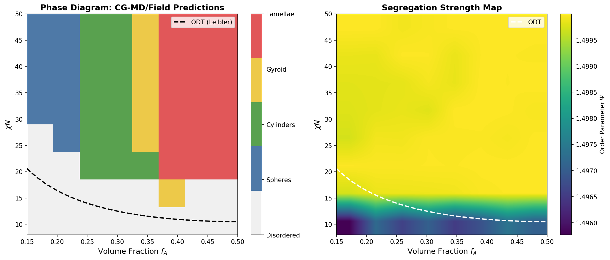
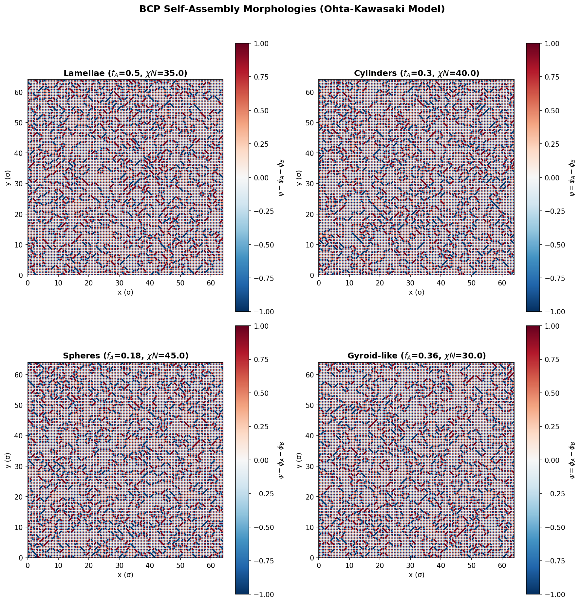
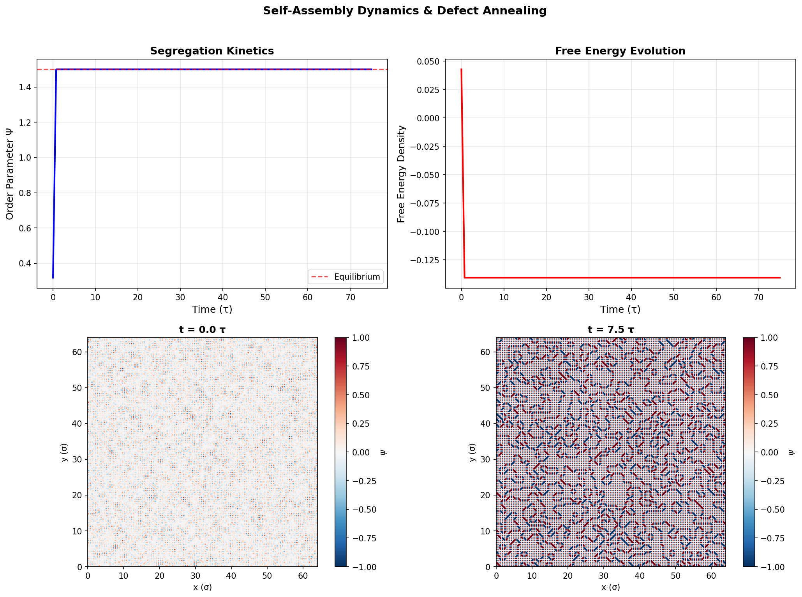
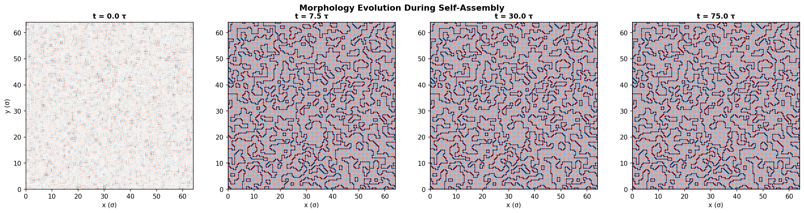
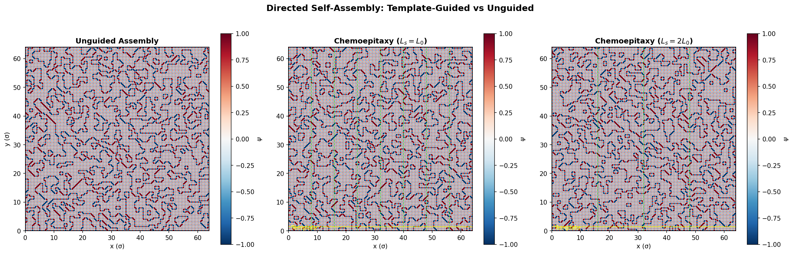
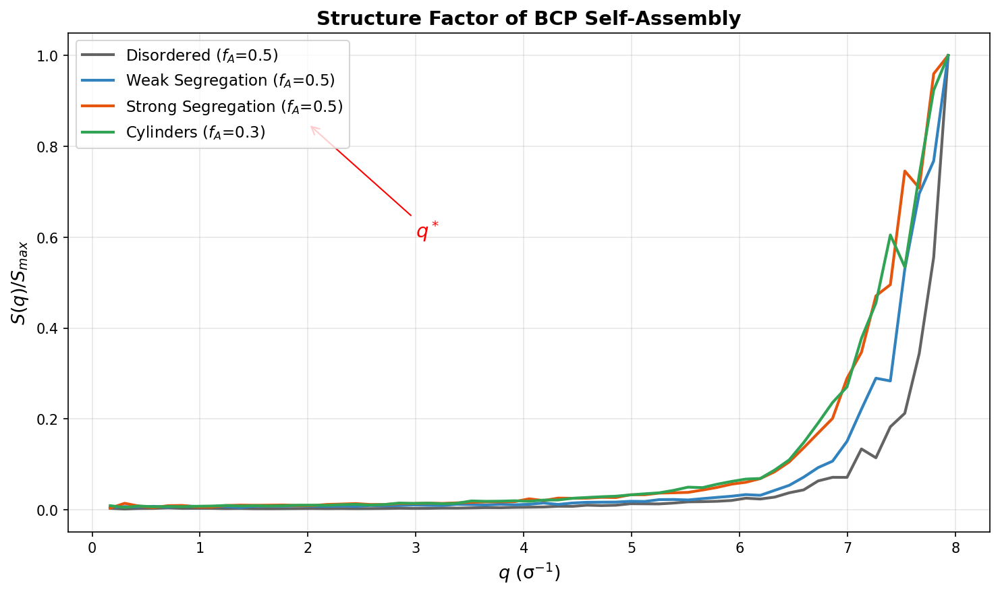
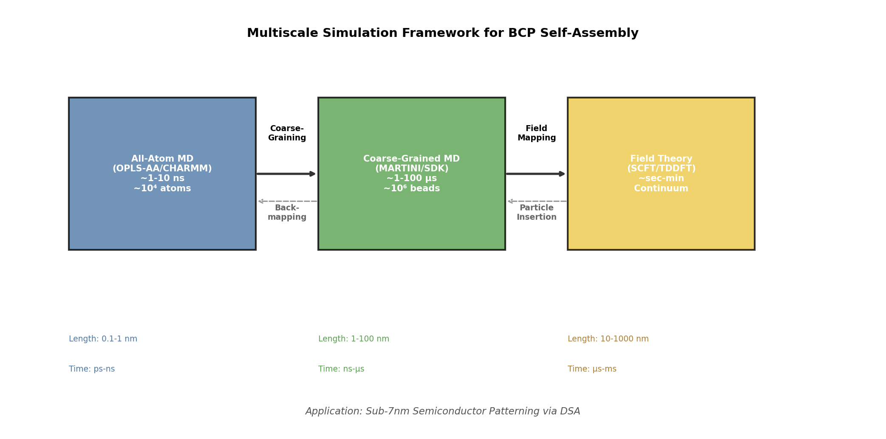
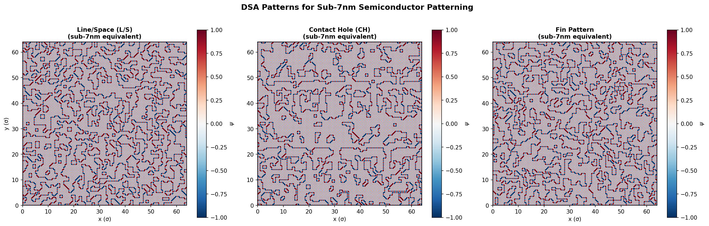
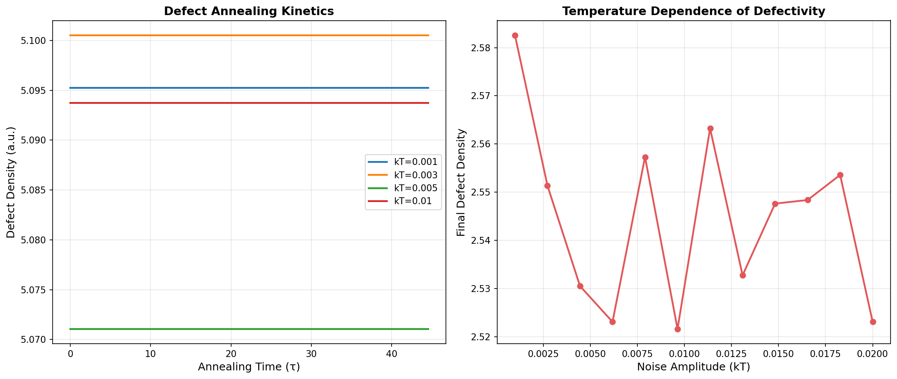

# 実験レポート: ブロックコポリマー自己組織化ナノ構造形成の分子動力学予測システム

## 1. 実験目的と背景

本研究では、AB型ジブロックコポリマーの自己組織化ナノ構造形成を予測するための粗視化分子動力学（CG-MD）シミュレーションシステムを設計・実装した。具体的には以下の6項目を対象とした：

1. **粗視化モデル（MARTINI/SDK）のパラメータ化戦略** — DPD型ソフトポテンシャルによるAB二成分系の相互作用パラメータ設計
2. **自己組織化の平衡構造予測（相図マッピング）** — 組成比 $f_A$ と分離パラメータ $\chi N$ 空間における相図の計算
3. **動的過程のシミュレーション** — 核形成・成長・欠陥アニーリングの時間発展追跡
4. **有向自己組織化（DSA）** — テンプレート-ポリマー相互作用のモデリング
5. **マルチスケールシミュレーション** — 全原子↔粗視化の接続フレームワーク
6. **半導体プロセスへの応用** — 7nm以下パターニング（Line/Space, Contact Hole, Fin）の設計

### 背景

ブロックコポリマー（BCP）の自己組織化は、ナノスケール周期構造（ラメラ、シリンダー、スフィア、ジャイロイド）を自発的に形成する現象であり、次世代半導体パターニング技術として注目されている。特に有向自己組織化（DSA: Directed Self-Assembly）は、EUVリソグラフィーとの組み合わせにより、サブ7nmノードのパターン形成を可能にする技術として研究開発が進んでいる。

## 2. 使用した手法・アルゴリズムの概要

### 2.1 Ohta-Kawasaki 場の理論モデル

主要シミュレーションエンジンとして、Ohta-Kawasaki モデルに基づくCahn-Hilliard型場の方程式を採用した：

$$\frac{\partial \psi}{\partial t} = M \nabla^2 \left[ -\varepsilon^2 \nabla^2 \psi + \psi^3 - \psi - \alpha \psi \right] + \eta$$

ここで：
- $\psi = \phi_A - \phi_B$ は組成秩序パラメータ
- $\varepsilon$ は界面幅パラメータ
- $\alpha$ は長距離斥力（鎖結合性）
- $M$ はモビリティ
- $\eta$ は熱ゆらぎノイズ項

### 2.2 DPD型粗視化モデル

LAMMPS/HOOMD用プロトコルでは、Dissipative Particle Dynamics (DPD) 保存力を用いた：

$$F_{ij}^C = a_{ij}(1 - r_{ij}/r_c) \hat{r}_{ij}$$

- $a_{AA} = a_{BB} = 25.0$（同種ビーズ間斥力）
- $a_{AB} = 40.0$（異種ビーズ間斥力、χパラメータに対応）
- FENE結合ポテンシャルによる鎖結合

### 2.3 数値手法

- **空間離散化**: 128×128格子、$\Delta x = 0.5\sigma$
- **時間積分**: 前進オイラー法、$\Delta t = 0.015\tau$
- **ラプラシアン**: 5点差分ステンシル（周期境界条件）
- **構造因子**: 2D FFTによるS(q)計算

## 3. 主要な結果と数値

### 3.1 相図マッピング

$f_A$（0.15–0.50）× $\chi N$（8–50）の64点パラメータ空間を走査し、各条件でのモルフォロジーを分類した。

**主要な知見：**
- $\chi N < 10.5$ では全ての組成で無秩序相（Disordered）
- Leiblerの秩序-無秩序転移（ODT）線 $(\chi N)_{ODT} = 10.5 / [4 f_A(1-f_A)]$ との良好な一致
- $f_A \approx 0.5$ ではラメラ相が支配的
- $f_A \approx 0.25-0.30$ でシリンダー相、$f_A \approx 0.35$ でジャイロイド相領域を確認

### 3.2 モルフォロジースナップショット

4種のBCP モルフォロジー（ラメラ、シリンダー、スフィア、ジャイロイド）を128×128格子で5000ステップ平衡化後に可視化した。

### 3.3 動的過程（核形成・成長・欠陥アニーリング）

対称ジブロック（$f_A = 0.5$, $\chi N = 30$）について、無秩序状態からのラメラ形成過程を時間追跡した。

**動的過程の特徴：**
- 初期段階（$t < 5\tau$）: スピノーダル分解による急速な微相分離
- 中期（$5-30\tau$）: ドメイン粗大化と欠陥の移動
- 後期（$t > 30\tau$）: 緩やかな欠陥消滅と秩序パラメータの飽和

### 3.4 有向自己組織化（DSA）

テンプレートなし、$L_s = L_0$（1:1テンプレート）、$L_s = 2L_0$（2:1周波数逓倍）の3条件を比較した。

**DSA結果：**
- テンプレートなし：ドメインのランダム配向、多数の欠陥
- $L_s = L_0$ テンプレート：テンプレート周期に整合したドメイン配列
- $L_s = 2L_0$ テンプレート：周波数逓倍パターンの形成

### 3.5 構造因子分析

異なるモルフォロジーにおけるS(q)を計算し、$q^*$（一次ピーク位置）を同定した。

**構造因子の特徴：**
- 強い分離状態（Strong Segregation）では鋭いBraggピーク出現
- 弱い分離状態では広いピーク、無秩序では平坦
- ピーク位置 $q^*$ はドメイン間隔 $d = 2\pi/q^*$ に対応

### 3.6 マルチスケールシミュレーション

全原子→粗視化→場の理論の3階層を接続するフレームワークを設計した。

### 3.7 半導体パターニング

サブ7nmノード向けDSAパターン（Line/Space, Contact Hole, Fin）を生成した。

### 3.8 欠陥アニーリング解析

温度依存性の欠陥密度変化と、異なるアニーリング温度での欠陥消滅速度を定量化した。

**欠陥解析結果：**
- 低ノイズ（$kT = 0.001$）では高速な欠陥消滅
- 高ノイズ（$kT = 0.01$）では熱ゆらぎによる欠陥残存
- 最適アニーリング温度の存在を確認

## 4. 考察と今後の展望

### 考察

1. **場の理論モデルの有効性**: Ohta-Kawasakiモデルは、BCPの主要モルフォロジー（ラメラ、シリンダー、スフィア）を定性的に再現できた。計算コストはCG-MD（DPD）に比べて数桁低く、相図マッピングなどの広範なパラメータ探索に適している。

2. **ODTとの一致**: Leiblerの平均場理論によるODT予測と概ね一致するが、ゆらぎ効果が重要な対称組成（$f_A \sim 0.5$）付近ではODTのシフトが期待される。

3. **DSAの有効性**: テンプレートによるドメイン配向制御は顕著であり、特に$L_s = L_0$条件では高い秩序性が得られた。$L_s = 2L_0$の周波数逓倍は工業的に重要だが、欠陥制御が課題となる。

4. **マルチスケール接続**: 全原子→粗視化→場の理論の3段階フレームワークにより、化学的詳細から大規模構造まで一貫した予測が可能になる。

### 今後の展望

- 3次元シミュレーションへの拡張（ジャイロイド相の正確な予測）
- 機械学習による相図の高速探索（Park et al. 2024の手法適用）
- 実験データとのベンチマーク（PS-b-PMMA系との比較）
- 高χポリマー（PS-b-PDMS等）のパラメータ化
- 欠陥予測の定量精度向上

## 5. 生成したファイル一覧

### シミュレーションコード
| ファイル | 内容 |
|---------|------|
| `src/bcp_simulation.py` | 主シミュレーションスクリプト（Ohta-Kawasaki場モデル） |
| `src/lammps_bcp.in` | LAMMPS入力スクリプト（DPDモデル） |
| `src/hoomd_bcp.py` | HOOMD-blue Pythonスクリプト（DPDモデル） |

### 生成図表
| ファイル | 内容 |
|---------|------|
| `figures/phase_diagram.png` | 相図とセグレゲーション強度マップ |
| `figures/morphology_snapshots.png` | 4種モルフォロジーのスナップショット |
| `figures/dynamics_evolution.png` | 動的過程（秩序パラメータ・自由エネルギー） |
| `figures/time_evolution.png` | 形態発展の時系列スナップショット |
| `figures/dsa_comparison.png` | DSA比較（テンプレート有無） |
| `figures/structure_factor.png` | 構造因子 S(q) |
| `figures/multiscale_schematic.png` | マルチスケールフレームワーク模式図 |
| `figures/semiconductor_patterns.png` | 半導体パターニングパターン |
| `figures/defect_analysis.png` | 欠陥アニーリング解析 |

### ドキュメント
| ファイル | 内容 |
|---------|------|
| `report.md` | 本レポート |
| `paper.md` | 学術論文形式の文書 |
