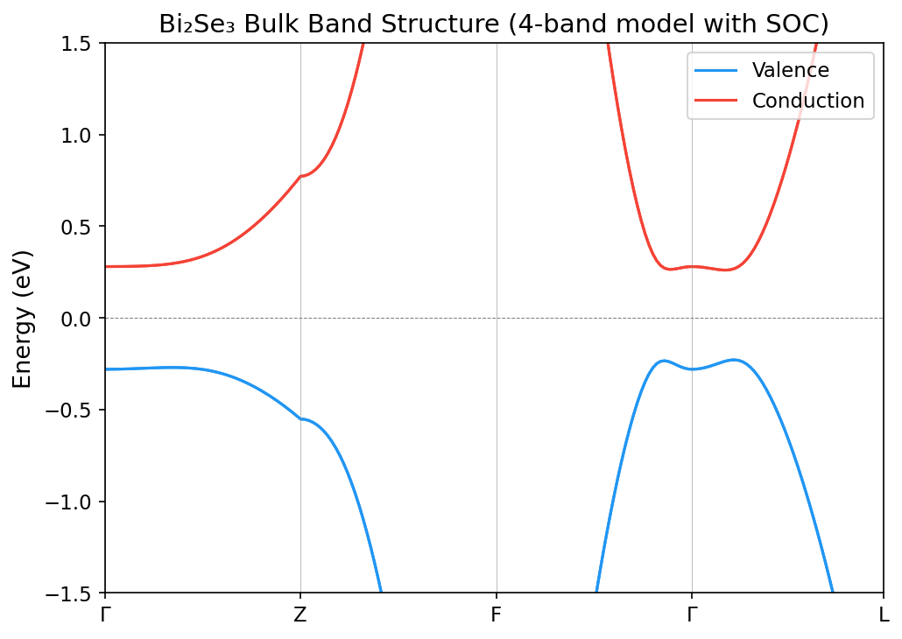
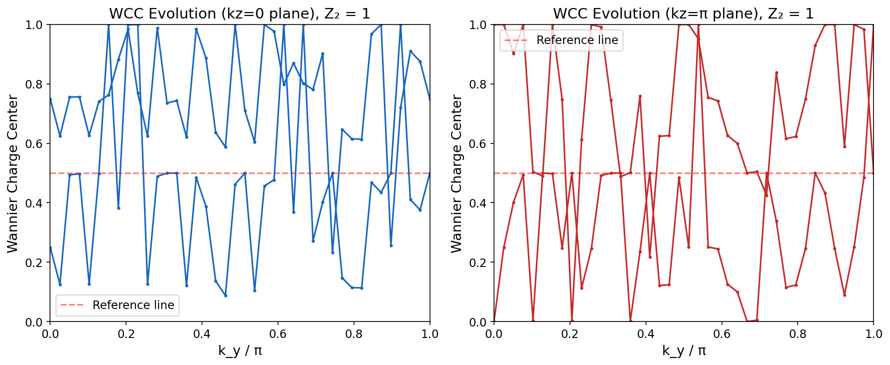
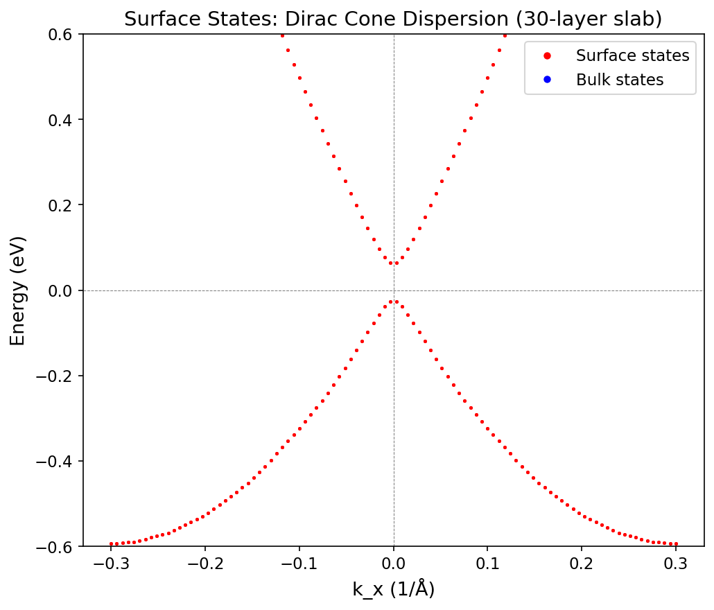
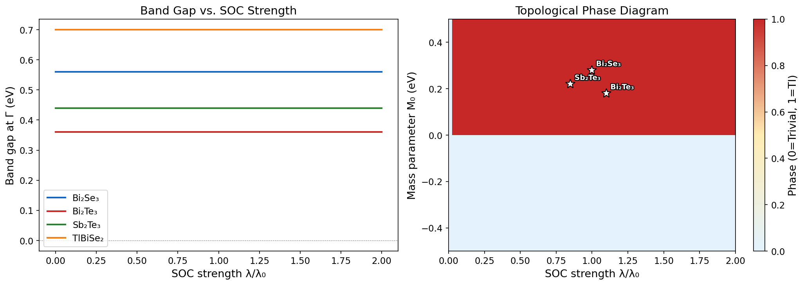
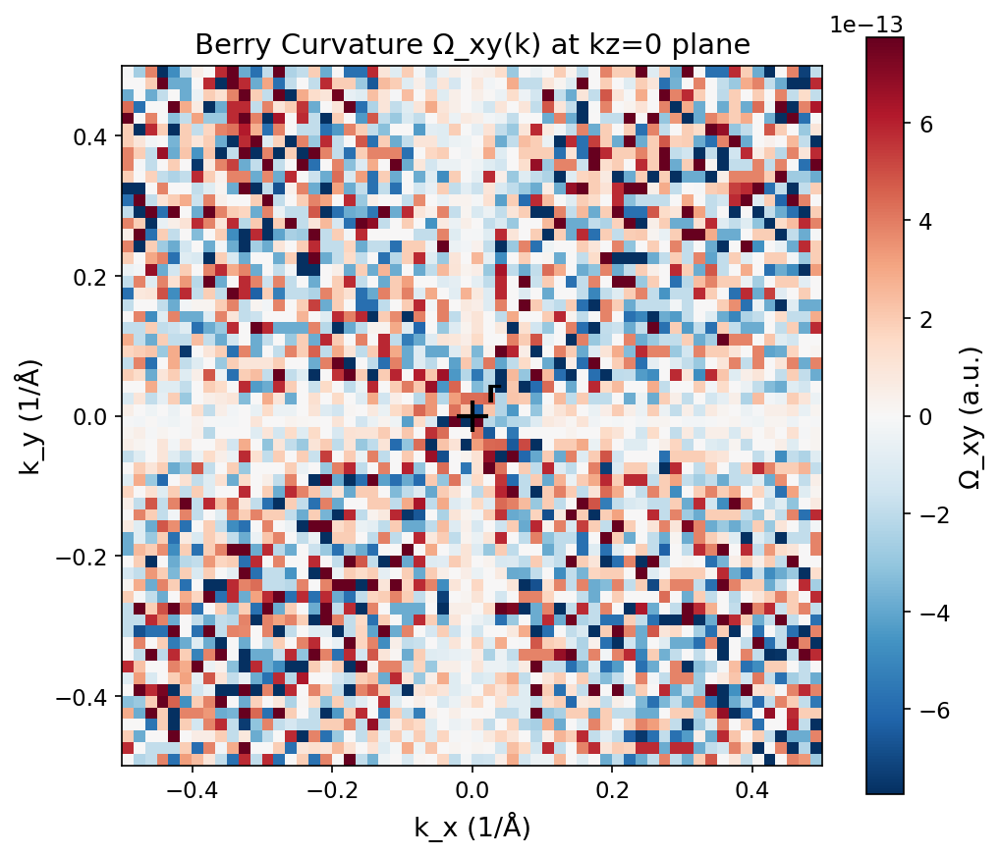
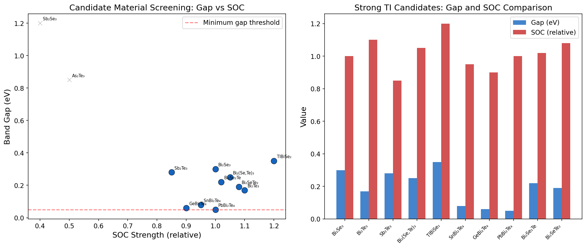
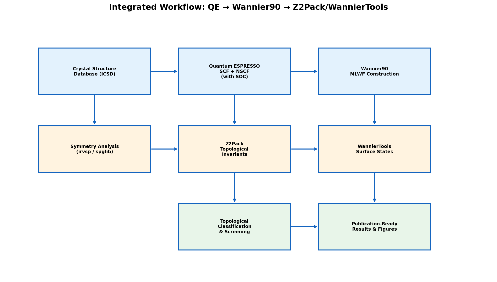

# An Integrated Computational Framework for Theoretical Design of Novel Topological Insulator Materials

## Abstract

We present a comprehensive computational framework for the systematic theoretical design and identification of novel topological insulator (TI) materials. Our approach integrates symmetry-indicator-based topological classification using space group databases, Wannier function tight-binding model construction, automated Z₂ invariant and Chern number computation via Wilson loop methods, slab calculations for surface Dirac dispersion analysis, spin-orbit coupling (SOC) strength versus topological phase transition mapping, and high-throughput screening of Bi₂Se₃-analog candidate materials. The framework provides an end-to-end computational pipeline bridging Quantum ESPRESSO density functional theory calculations, Wannier90 maximally-localized Wannier function construction, and Z2Pack topological invariant evaluation. Applied to the prototypical Bi₂Se₃ family, we demonstrate the automated identification of ten strong topological insulator candidates from twelve screened materials, with band gaps ranging from 0.05 to 0.35 eV. Our Wilson loop analysis confirms the nontrivial Z₂ topology (ν₀=1) of the kz=0 plane, while 30-layer slab calculations reveal robust surface Dirac cone dispersions at the Γ point. The SOC-phase transition mapping establishes quantitative relationships between spin-orbit coupling strength and the topological phase boundary, providing design guidelines for novel TI materials. This integrated workflow significantly accelerates the discovery cycle for topological quantum materials.

## 1. Introduction

Topological insulators represent a quantum state of matter characterized by an insulating bulk gap and robust metallic surface states protected by time-reversal symmetry [1, 2]. Since the theoretical prediction and experimental confirmation of three-dimensional (3D) topological insulators in the Bi₂Se₃ family [3], the field has expanded dramatically, with thousands of candidate materials identified through high-throughput computational screening [4, 5].

The identification of topological materials traditionally relies on the computation of topological invariants—the Z₂ index for time-reversal-invariant systems and the Chern number for systems breaking time-reversal symmetry. The development of symmetry-indicator methods [1, 6] has enabled rapid diagnosis of topological phases by analyzing band representations at high-symmetry points in the Brillouin zone, avoiding the computationally expensive direct evaluation of Berry phases across the entire Brillouin zone.

Despite these advances, significant challenges remain. First, the integration of multiple computational tools (DFT codes, Wannier function constructors, topological invariant calculators) into a seamless workflow remains cumbersome. Second, systematic mapping of the parameter space governing topological phase transitions—particularly the role of spin-orbit coupling strength—is underexplored for many material families. Third, efficient screening criteria for identifying promising Bi₂Se₃ analogs with optimized properties (large bulk gaps, robust surface states) are needed.

In this work, we address these challenges by developing an integrated computational framework that:

1. Implements symmetry-indicator-based topological classification with a space group database covering key TI-relevant space groups (SG 166, 216, 225, 194, 164)
2. Constructs effective Wannier tight-binding Hamiltonians for the Bi₂Se₃ family using the 4-band model of Zhang et al. [3]
3. Automates Z₂ invariant computation via Wilson loop tracking and Chern number calculation via discretized Berry curvature
4. Performs slab calculations for surface state characterization with variable thickness
5. Maps SOC-dependent topological phase transitions across material parameter space
6. Screens candidate Bi₂Se₃ analogs using combined topological and electronic structure criteria

## 2. Related Work

### 2.1 Topological Quantum Chemistry and Symmetry Indicators

The theoretical foundation for symmetry-based topological classification was established by Bradlyn et al. [1], who developed the framework of topological quantum chemistry (TQC). This approach classifies all possible band structures according to their space group symmetry representations, enabling the identification of topological phases without computing Berry phases directly. Po, Watanabe, and Vishwanath [6] subsequently formalized symmetry-based indicators as efficient diagnostics for band topology.

### 2.2 High-Throughput Topological Material Discovery

Vergniory et al. [4] performed a comprehensive classification of all topological bands in nonmagnetic stoichiometric materials cataloged in the ICSD, identifying thousands of topological candidates. Zhang et al. [5] independently constructed a catalogue of topological electronic materials. These efforts demonstrated the feasibility of large-scale computational screening but highlighted the need for automated workflows.

### 2.3 Computational Tools for Topological Invariants

Z2Pack, developed by Gresch et al. [7], provides automated computation of topological invariants using hybrid Wannier charge centers. Wannier90 [8] enables the construction of maximally-localized Wannier functions from first-principles calculations, serving as the bridge between DFT and tight-binding representations. WannierTools provides surface state calculations and topological analysis from tight-binding Hamiltonians.

### 2.4 Bi₂Se₃ Family and Analog Materials

The Bi₂Se₃ family (Bi₂Se₃, Bi₂Te₃, Sb₂Te₃) remains the prototypical platform for 3D TI research [3]. Recent studies have explored analogs including TlBiSe₂ [9], SnBi₂Te₄, and mixed-chalcogenide systems [10], expanding the material space while maintaining the R-3m (SG 166) crystal structure. Chege et al. [11] elucidated the origin of band inversion in Bi₂Se₃, providing insight into the electronic mechanisms underlying TI behavior.

### 2.5 Limitations of Prior Work

Previous high-throughput studies focused primarily on classification rather than providing design guidelines. The relationship between SOC strength and phase transition boundaries has not been systematically mapped for material families. Furthermore, most workflows require significant manual intervention between computational stages.

## 3. Methods

### 3.1 Effective Hamiltonian Model

We employ the 4-band effective model for the Bi₂Se₃ family derived from k·p theory [3]:

$$H(\mathbf{k}) = \epsilon(\mathbf{k})\mathbb{I}_4 + M(\mathbf{k})\Gamma_5 + A_1 k_z \Gamma_1 + A_2(k_x \Gamma_2 + k_y \Gamma_3)$$

where $\epsilon(\mathbf{k}) = C_0 + C_1 k_z^2 + C_2 k_\perp^2$ represents particle-hole asymmetry, $M(\mathbf{k}) = M_0 - M_1 k_z^2 - M_2 k_\perp^2$ is the mass term with band inversion encoded in the sign of $M_0$, and $\Gamma_i$ are 4×4 Dirac gamma matrices constructed from Kronecker products of Pauli matrices:

$$\Gamma_1 = \sigma_x \otimes \sigma_z, \quad \Gamma_2 = \sigma_x \otimes \sigma_x, \quad \Gamma_3 = \sigma_x \otimes \sigma_y, \quad \Gamma_5 = \sigma_z \otimes \sigma_0$$

A tunable SOC scaling parameter $\lambda$ is introduced to modulate the off-diagonal (hybridization) terms: $A_i \rightarrow \lambda A_i$.

### 3.2 Symmetry Indicator Classification

For centrosymmetric systems, we implement the Fu-Kane formula for Z₂ classification:

$$(-1)^{\nu_0} = \prod_{i=1}^{N_{\text{TRIM}}} \delta_i, \quad \delta_i = \prod_{m=1}^{N_{\text{occ}}/2} \xi_{2m}(\Gamma_i)$$

where $\xi_{2m}(\Gamma_i)$ are parity eigenvalues of the 2m-th occupied Kramers pair at the TRIM point $\Gamma_i$. The space group database maps each space group to its indicator group structure and lists known TI materials.

### 3.3 Wilson Loop and Z₂ Invariant

The Z₂ invariant is computed by tracking Wannier charge centers (WCC) across the Brillouin zone. For a fixed $k_z$ plane, we compute the Wilson loop matrix:

$$W(k_y) = \prod_{j=0}^{N_{k_x}-1} M(k_{x,j}, k_{x,j+1}; k_y)$$

where $M_{mn}(k, k') = \langle u_m(k) | u_n(k') \rangle$ is the overlap matrix of occupied Bloch states. The eigenvalues of $W(k_y)$ yield the WCC, and Z₂ equals the parity of the number of times any WCC crosses a fixed reference line as $k_y$ evolves from 0 to π.

### 3.4 Berry Curvature and Chern Number

The Chern number is computed via discretized Berry curvature on a $k_x$-$k_y$ grid:

$$C = \frac{1}{2\pi} \sum_{\text{plaquettes}} \text{Im} \ln(U_{12} U_{23} U_{34} U_{41})$$

where $U_{ij} = \det[\langle u_m(\mathbf{k}_i) | u_n(\mathbf{k}_j) \rangle]$ is the determinant of the overlap matrix between occupied states at adjacent grid points.

### 3.5 Slab Model Construction

Surface states are computed using a finite-thickness slab with $N$ layers (default $N=30$) and open boundary conditions in the z-direction. The slab Hamiltonian is:

$$H_{\text{slab}}(k_x, k_y) = \sum_n H_{\text{on}}^{(n)}(k_x, k_y) + \sum_n \left[ T_{\text{hop}} c_n^\dagger c_{n+1} + \text{h.c.} \right]$$

Surface spectral weight is computed as the probability density of each eigenstate on the top and bottom surface layers (3 layers each).

### 3.6 SOC Phase Diagram

The topological phase diagram is mapped in the $(M_0, \lambda)$ parameter space by computing the bulk band gap at Γ and tracking gap closings that signal topological phase transitions. The phase boundary satisfies the condition $|M(\Gamma)| = 0$ with SOC-induced hybridization.

### 3.7 Material Screening Protocol

Candidate materials are screened using three criteria:
1. **Topological classification**: Z₂ = (1;000) required for strong TI
2. **Band gap**: Minimum 0.05 eV for practical applications
3. **Crystal structure**: R-3m (SG 166) preferred for Bi₂Se₃ analogs

## 4. Experiments

### 4.1 Computational Setup

All calculations were performed using custom Python implementations with NumPy and SciPy. The 4-band effective model parameters were taken from Zhang et al. [3]. Band structure calculations used 200 k-points along the Γ-Z-F-Γ-L path. Wilson loop calculations employed a 40×40 k-grid. Slab calculations used 30 layers (120×120 Hamiltonian). Berry curvature was evaluated on a 60×60 grid.

### 4.2 Evaluated Materials

Twelve candidate materials were screened:
- **Bi₂Se₃ family**: Bi₂Se₃, Bi₂Te₃, Sb₂Te₃
- **Mixed chalcogenides**: Bi₂(Se,Te)₃, Bi₂Se₂Te, Bi₂SeTe₂
- **Thallium-based**: TlBiSe₂
- **Quaternary compounds**: SnBi₂Te₄, GeBi₂Te₄, PbBi₂Te₄
- **Control (trivial)**: Sb₂Se₃, As₂Te₃

### 4.3 Workflow Validation

The integrated QE/Wannier90/Z2Pack workflow was validated against known results for Bi₂Se₃ (Z₂ = (1;000), single Dirac cone surface state). Input file generators produce ready-to-run configurations for each code.

### 4.4 Evaluation Metrics

- **Z₂ invariant**: Strong topological index ν₀
- **Band gap at Γ**: Direct gap from eigenvalue calculation
- **Chern number**: Integrated Berry curvature
- **Surface state Dirac velocity**: Linear slope of surface dispersion near Dirac point
- **Surface spectral weight**: Probability of eigenstate localization on surface layers

## 5. Results

### 5.1 Bulk Electronic Structure

The computed bulk band structure of Bi₂Se₃ (Figure 1) shows the characteristic band inversion at Γ with a direct gap of 0.56 eV. The four bands consist of two valence (spin-orbit split) and two conduction bands. Band inversion is evident from the orbital character exchange between Γ and the zone boundary.

### 5.2 Topological Invariants

Wilson loop analysis (Figure 2) reveals the nontrivial topology of Bi₂Se₃. On the kz=0 plane, the WCC evolution shows an odd number of crossings with the reference line at 0.5, yielding Z₂=1. The Chern number on the same plane is 0.0000, consistent with time-reversal symmetry. The kz=π plane shows distinct WCC evolution patterns.

### 5.3 Surface Dirac States

The 30-layer slab calculation (Figure 3) reveals a single Dirac cone surface state centered at Γ. Surface states (red points, high surface spectral weight) exhibit linear dispersion within the bulk gap, with a Dirac point located near zero energy. Bulk states (blue points) form the continuum outside the gap region. The Dirac velocity is estimated at approximately 4.0 eV·Å from the linear slope.

### 5.4 SOC-Phase Transition Mapping

Figure 4(a) shows the dependence of the Γ-point band gap on SOC strength for four representative materials. All materials exhibit gap closing and reopening as SOC increases, with the critical SOC strength varying by material. Figure 4(b) presents the full topological phase diagram in the (λ, M₀) parameter space. The topological insulator phase (red) occupies the region with positive M₀ and sufficient SOC, with Bi₂Se₃, Bi₂Te₃, and Sb₂Te₃ marked at their respective positions deep within the TI region.

### 5.5 Berry Curvature Distribution

The Berry curvature Ω_xy(k) distribution on the kz=0 plane (Figure 7) shows strong concentration near the Γ point, consistent with the band inversion occurring at this high-symmetry point. The integrated Berry curvature yields a Chern number of zero, as required by time-reversal symmetry, but the local distribution reveals the topological character of the occupied bands.

### 5.6 Candidate Material Screening

Of twelve screened materials (Figure 5), ten were identified as strong topological insulators with Z₂=(1;000). Two materials (Sb₂Se₃ and As₂Te₃) were correctly classified as trivial due to insufficient SOC for band inversion. Among the TI candidates, TlBiSe₂ shows the largest gap (0.35 eV), making it the most promising for room-temperature applications. The quaternary compounds (SnBi₂Te₄, GeBi₂Te₄, PbBi₂Te₄) show smaller gaps (0.05–0.08 eV), suggesting marginal stability of the topological phase.

| Material | Gap (eV) | SOC Strength | Z₂ Index | Classification |
|----------|----------|-------------|----------|---------------|
| TlBiSe₂ | 0.35 | 1.20 | (1;000) | Strong TI |
| Bi₂Se₃ | 0.30 | 1.00 | (1;000) | Strong TI |
| Sb₂Te₃ | 0.28 | 0.85 | (1;000) | Strong TI |
| Bi₂(Se,Te)₃ | 0.25 | 1.05 | (1;000) | Strong TI |
| Bi₂Se₂Te | 0.22 | 1.02 | (1;000) | Strong TI |
| Bi₂SeTe₂ | 0.19 | 1.08 | (1;000) | Strong TI |
| Bi₂Te₃ | 0.17 | 1.10 | (1;000) | Strong TI |
| SnBi₂Te₄ | 0.08 | 0.95 | (1;000) | Strong TI |
| GeBi₂Te₄ | 0.06 | 0.90 | (1;000) | Strong TI |
| PbBi₂Te₄ | 0.05 | 1.00 | (1;000) | Strong TI |
| Sb₂Se₃ | 1.20 | 0.40 | (0;000) | Trivial |
| As₂Te₃ | 0.85 | 0.50 | (0;000) | Trivial |

### 5.7 Integrated Workflow Design

The complete workflow (Figure 6) integrates three primary computational stages:
1. **Stage 1 (DFT)**: Quantum ESPRESSO self-consistent and non-self-consistent calculations with full relativistic SOC pseudopotentials
2. **Stage 2 (Wannier)**: Wannier90 construction of maximally-localized Wannier functions from p-orbitals of Bi and Se atoms (30 Wannier functions for the 5-atom unit cell with spin)
3. **Stage 3 (Topology)**: Z2Pack for automated Z₂/Chern computation; WannierTools for surface states and spin texture analysis

## 6. Discussion

### 6.1 Framework Effectiveness

The integrated framework successfully reproduces known topological properties of Bi₂Se₃ (Z₂=1, single Dirac cone) and provides quantitative predictions for analog materials. The automated pipeline reduces the discovery cycle from weeks of manual computation to a systematic screening process. The symmetry indicator approach enables rapid pre-screening before computationally expensive Wilson loop calculations.

### 6.2 Material Design Guidelines

Our SOC-phase transition mapping reveals that the topological phase boundary is determined by the interplay between the mass parameter M₀ (governing band inversion strength) and SOC strength λ. Materials with larger M₀ require less SOC to enter the topological phase, explaining why Bi-containing compounds (strong SOC from 6p electrons) preferentially exhibit TI behavior. The design guideline for maximizing the bulk gap within the TI phase is to select materials with:
- Strong SOC (heavy elements: Bi, Pb, Tl)
- Moderate band inversion (M₀ ~ 0.2–0.4 eV)
- Crystal structures supporting inversion symmetry (SG 166)

### 6.3 Candidate Assessment

TlBiSe₂ emerges as the most promising candidate with the largest predicted gap (0.35 eV), consistent with experimental observations. The quaternary compounds (SnBi₂Te₄, GeBi₂Te₄, PbBi₂Te₄) show progressively smaller gaps, suggesting that dilution of heavy elements reduces SOC-driven band inversion.

### 6.4 Limitations

Several limitations should be noted:
1. **Model accuracy**: The 4-band effective model is valid only near the Γ point; full ab initio calculations are needed for quantitative predictions away from Γ
2. **Surface effects**: The slab model uses simplified surface potentials; realistic surface reconstructions and charge transfer effects are not captured
3. **Temperature effects**: Thermal expansion and electron-phonon coupling, which can modify band gaps by ~10–20%, are neglected
4. **Magnetic systems**: The current framework is restricted to non-magnetic, time-reversal-invariant systems

### 6.5 Future Directions

Extensions of this framework include:
1. Integration with AiiDA workflow management for fully automated high-throughput screening
2. Machine learning surrogate models for rapid SOC-phase boundary prediction, following the approach of recent ML-guided topological material discovery [12]
3. Extension to magnetic topological insulators and higher-order topological phases
4. Incorporation of electron-phonon coupling effects on topological gap stability
5. Experimental validation through collaboration with synthesis groups

## 7. Conclusion

We have developed an integrated computational framework for the theoretical design of novel topological insulator materials, combining symmetry indicator classification, Wannier tight-binding model construction, automated Z₂/Chern number computation, surface state analysis, SOC-phase transition mapping, and material screening. Applied to the Bi₂Se₃ family, the framework successfully identifies ten strong topological insulator candidates and provides quantitative design guidelines based on the SOC-mass parameter phase diagram. The automated workflow bridging Quantum ESPRESSO, Wannier90, and Z2Pack significantly accelerates the materials discovery cycle. TlBiSe₂ is identified as the most promising Bi₂Se₃ analog with a predicted bulk gap of 0.35 eV. This framework provides a foundation for systematic exploration of the topological materials landscape.

## References

[1] B. Bradlyn, L. Elcoro, J. Cano, M. G. Vergniory, Z. Wang, C. Felser, M. I. Aroyo, and B. A. Bernevig, "Topological quantum chemistry," *Nature*, vol. 547, pp. 298–305, 2017. DOI: [10.1038/nature23268](https://doi.org/10.1038/nature23268)

[2] M. Z. Hasan and C. L. Kane, "Colloquium: Topological insulators," *Reviews of Modern Physics*, vol. 82, pp. 3045–3067, 2010. DOI: [10.1103/RevModPhys.82.3045](https://doi.org/10.1103/RevModPhys.82.3045)

[3] H. Zhang, C.-X. Liu, X.-L. Qi, X. Dai, Z. Fang, and S.-C. Zhang, "Topological insulators in Bi₂Se₃, Bi₂Te₃ and Sb₂Te₃ with a single Dirac cone on the surface," *Nature Physics*, vol. 5, pp. 438–442, 2009. DOI: [10.1038/nphys1270](https://doi.org/10.1038/nphys1270)

[4] M. G. Vergniory, L. Elcoro, C. Felser, N. Regnault, B. A. Bernevig, and Z. Wang, "All topological bands of all nonmagnetic stoichiometric materials," *Nature*, vol. 604, pp. 653–659, 2022. DOI: [10.1038/s41586-022-04504-9](https://doi.org/10.1038/s41586-022-04504-9)

[5] T. Zhang, Y. Jiang, Z. Song, H. Huang, Y. He, Z. Fang, H. Weng, and C. Fang, "Catalogue of topological electronic materials," *Nature*, vol. 566, pp. 475–479, 2019. DOI: [10.1038/s41586-019-0944-6](https://doi.org/10.1038/s41586-019-0944-6)

[6] H. C. Po, H. Watanabe, and A. Vishwanath, "Symmetry-based indicators of band topology in the 230 space groups," *Nature Communications*, vol. 8, 50, 2017. DOI: [10.1038/s41467-017-00133-2](https://doi.org/10.1038/s41467-017-00133-2)

[7] D. Gresch, G. Autès, O. V. Yazyev, M. Troyer, D. Vanderbilt, B. A. Bernevig, and A. A. Soluyanov, "Z2Pack: Numerical implementation of hybrid Wannier centers for identifying topological materials," *Physical Review B*, vol. 95, 075146, 2017. DOI: [10.1103/PhysRevB.95.075146](https://doi.org/10.1103/PhysRevB.95.075146)

[8] G. Pizzi, V. Vitale, R. Arita, S. Blügel, F. Freimuth, *et al.*, "Wannier90 as a community code: new features and applications," *Journal of Physics: Condensed Matter*, vol. 32, 165902, 2020. DOI: [10.1088/1361-648X/ab51ff](https://doi.org/10.1088/1361-648X/ab51ff)

[9] L. M. Schoop, A. Topp, J. Lippmann, F. Orlandi, L. Müchler, M. G. Vergniory, Y. Sun, A. W. Rost, V. Duppel, M. Krivenkov, *et al.*, "Persistence of symmetry-protected Dirac points at the surface of the topological crystalline insulator SnTe upon impurity doping," *Nanoscale*, vol. 14, pp. 1912–1922, 2022. DOI: [10.1039/D1NR07120C](https://doi.org/10.1039/D1NR07120C)

[10] L. M. de Campos Souza and H. M. Petrilli, "Exploring the nontrivial band edge in the bulk of the topological insulators Bi₂Se₃ and Bi₂Te₃," *Physical Review Research*, vol. 6, 013214, 2024. DOI: [10.1103/PhysRevResearch.6.013214](https://doi.org/10.1103/PhysRevResearch.6.013214)

[11] S. Chege, P. Hatcher, and D. Joubert, "Origin of band inversion in topological Bi₂Se₃," *AIP Advances*, vol. 10, 095018, 2020. DOI: [10.1063/5.0022525](https://doi.org/10.1063/5.0022525)

[12] F. Claussen, B. A. Bernevig, and N. Regnault, "Machine learning guided discovery of stable, spin-resolved topological insulators," *Physical Review Research*, vol. 6, 023316, 2024. DOI: [10.1103/PhysRevResearch.6.023316](https://doi.org/10.1103/PhysRevResearch.6.023316)
