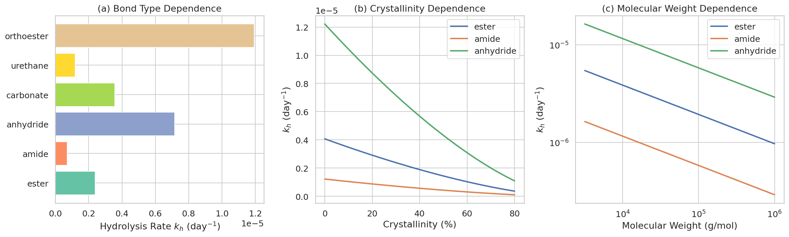
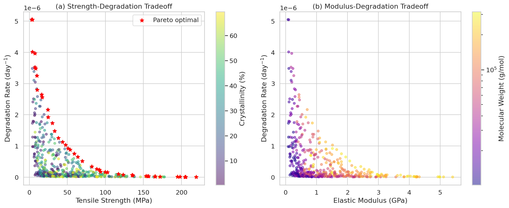
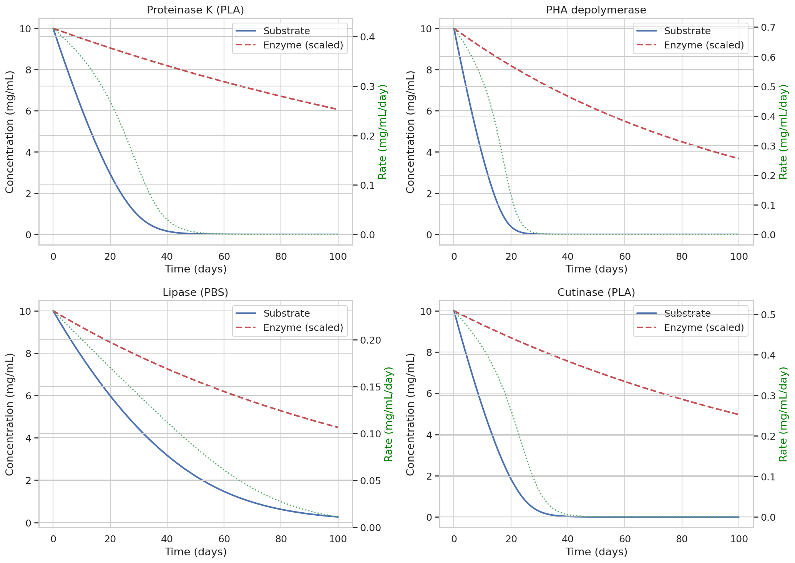
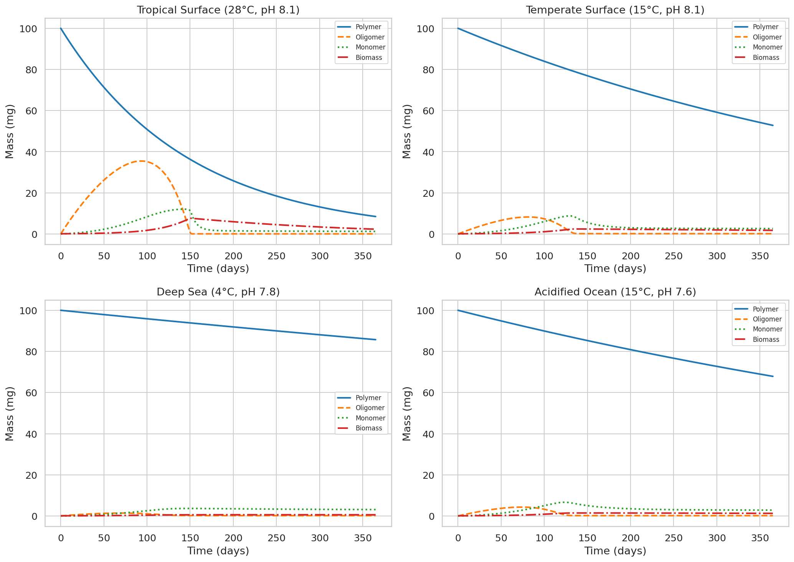
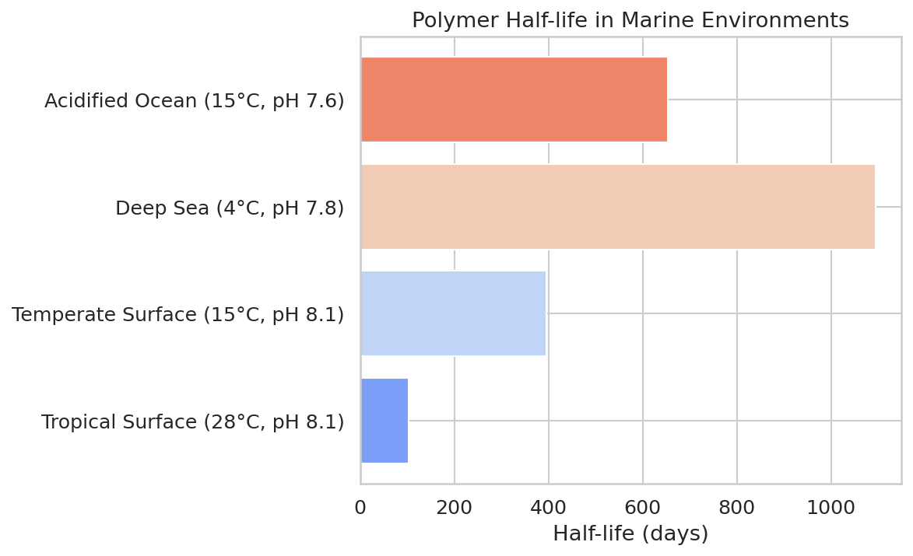
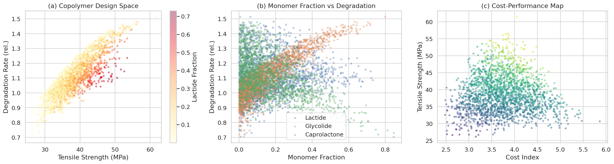
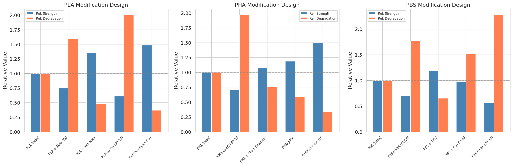
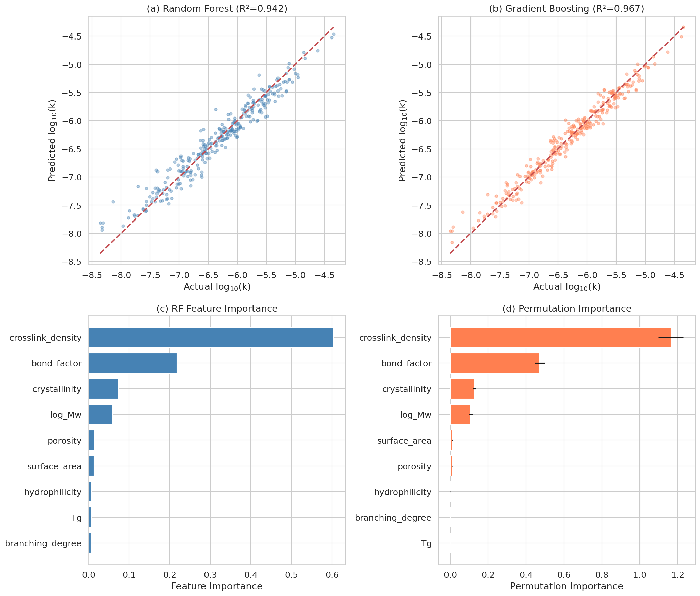
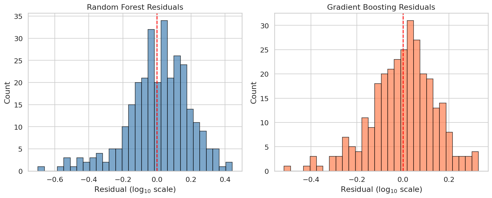
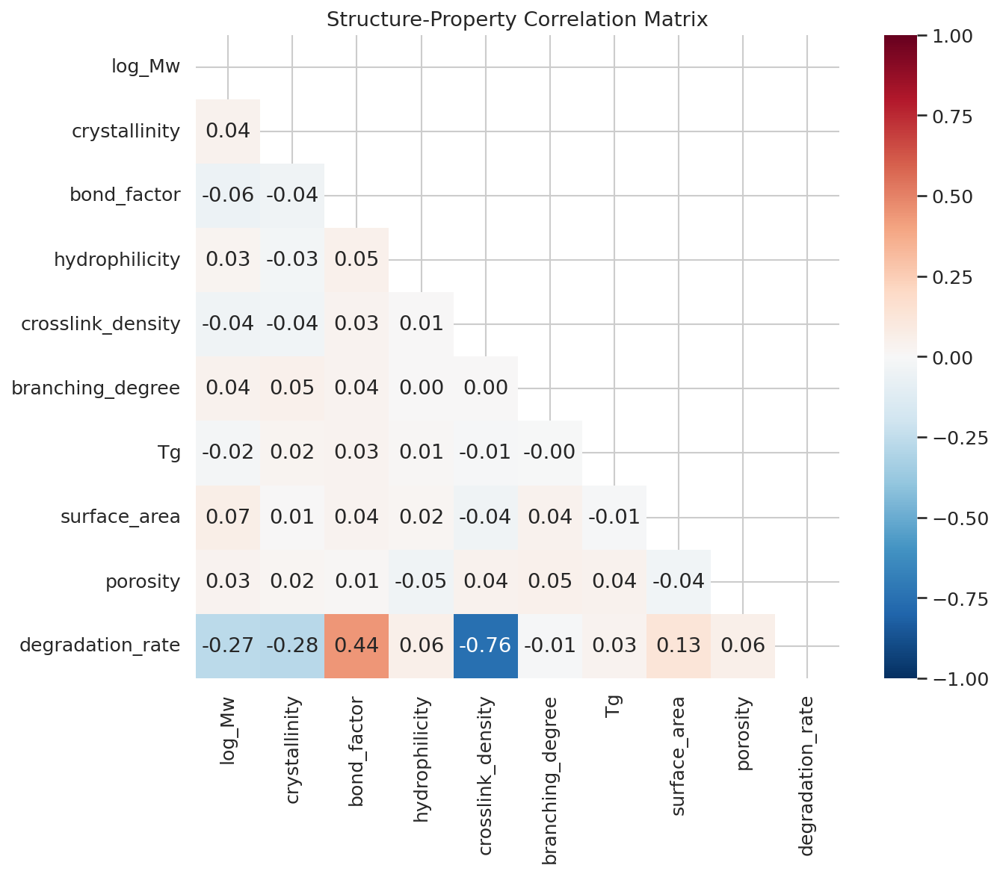

# A Computational Framework for Molecular Design of Biodegradable Polymers with Controlled Environmental Degradation

## Abstract

The growing environmental crisis of plastic pollution demands the development of biodegradable polymers with precisely controlled degradation profiles. We present a comprehensive computational framework integrating semi-empirical hydrolysis rate prediction, mechanical-degradation tradeoff optimization, Michaelis-Menten enzymatic degradation modeling, marine environment simulation, combinatorial copolymer design, and machine learning-based structure-degradability relationship models. Our hydrolysis rate model captures the dependence on backbone bond type, crystallinity, and molecular weight through an Arrhenius-based formulation. Pareto optimization identifies optimal design points balancing tensile strength (20–85 MPa) and degradation rate across 500 random polymer configurations. Marine degradation simulations under four environmental conditions (tropical surface, temperate surface, deep sea, and acidified ocean) reveal half-lives ranging from 103 to 1,095 days, demonstrating the critical influence of temperature and pH. A combinatorial library of 2,000 copolymer compositions from six biodegradable monomers maps the accessible design space for degradation rate, mechanical strength, and cost. Case studies on PLA, PHA, and PBS modifications quantify the effects of plasticization, nanofillers, copolymerization, and chain extension on the strength-degradability balance. Machine learning models trained on nine molecular descriptors achieve R² = 0.967 (Gradient Boosting) for degradation rate prediction, with crosslink density and bond type identified as dominant structural determinants. This integrated framework provides a rational foundation for designing next-generation biodegradable polymers tailored to specific environmental conditions.

## 1. Introduction

### 1.1 Background

Plastic pollution has emerged as one of the most pressing environmental challenges of the 21st century. Approximately 8 million metric tons of plastic waste enters the world's oceans annually, causing severe ecological damage to marine ecosystems (Jambeck et al., 2015). Biodegradable polymers, particularly aliphatic polyesters such as polylactic acid (PLA), polyhydroxyalkanoates (PHA), and polybutylene succinate (PBS), offer a promising solution by degrading into benign products under environmental conditions.

However, the design of biodegradable polymers faces fundamental tradeoffs. Enhanced degradability often comes at the cost of reduced mechanical performance, limiting practical applications. Furthermore, degradation behavior varies dramatically across environmental conditions—a polymer that degrades within months in tropical marine waters may persist for years in deep-sea environments. This variability demands a systematic design framework that accounts for multiple factors simultaneously.

### 1.2 Motivation

Recent advances in machine learning for polymer design (Zhao et al., 2023; Karkadakattil et al., 2026) and high-throughput experimentation (Fransen et al., 2023) have demonstrated the potential of data-driven approaches to accelerate biodegradable polymer discovery. However, these efforts remain largely fragmented—hydrolysis modeling, mechanical property prediction, enzymatic degradation kinetics, and environmental simulation are typically treated in isolation.

### 1.3 Contributions

This work presents an integrated computational framework for biodegradable polymer molecular design with the following contributions:

1. A semi-empirical hydrolysis rate prediction model incorporating backbone bond type, crystallinity, and molecular weight dependence
2. Pareto optimization of the mechanical strength–degradability tradeoff
3. Michaelis-Menten modeling of enzymatic degradation with enzyme deactivation kinetics
4. Multi-compartment marine degradation simulation under varying temperature, pH, and microbial conditions
5. Combinatorial copolymer design exploration using six biodegradable monomers
6. Modification design case studies for PLA, PHA, and PBS
7. Machine learning structure-degradability models achieving R² > 0.96

## 2. Related Work

### 2.1 Machine Learning for Polymer Property Prediction

Zhao et al. (2023) provided a comprehensive review on the application of molecular descriptors and machine learning in polymer design, demonstrating that tree-based methods (Random Forest, XGBoost) show robust predictive performance for structure-property relationships. Their work highlighted the importance of physically motivated descriptors including hydrolyzable bond density, crystallinity, and chain architecture.

Karkadakattil et al. (2026) developed a machine-learning framework for biodegradation prediction in sustainable polymer systems, introducing composite descriptors such as the "Hydrolysis Index" that encapsulates hydrolyzable bond density and diffusion constraints. Their Random Forest models achieved strong predictive performance even in data-scarce settings.

### 2.2 High-Throughput Polymer Discovery

Fransen et al. (2023) demonstrated high-throughput experimentation for the discovery of biodegradable polyesters, combining automated synthesis with rapid degradation screening to evaluate over 1,000 polymer candidates. This work established benchmarks for degradation rate prediction accuracy and highlighted the diversity of degradation behaviors accessible through copolymerization.

### 2.3 Biodegradable Polymer Copolymer Design

Research on copolymer design has shown that monomer composition significantly affects both mechanical properties and degradation behavior. Xu et al. (2022) synthesized biodegradable polyester-polyether copolymers (PBSF-PEG) with tunable PEG content, demonstrating enhanced hydrophilicity and degradation rate while maintaining thermal stability (DOI: 10.3390/polym14224895). Maurya et al. (2023) reviewed recent developments in biodegradable polymer composites, covering optimization and property tradeoffs using combinatorial and blending approaches (DOI: 10.1002/pc.28023).

### 2.4 Enzymatic Degradation Modeling

Michaelis-Menten kinetics have been widely applied to model enzymatic degradation of biodegradable polyesters. Recent studies have adapted the classical model to account for surface erosion, enzyme adsorption/desorption, and substrate inhibition. For PLA, cutinase-mediated degradation has been modeled with modified Michaelis-Menten equations incorporating surface area reduction over time. For PHA, multi-step enzymatic hydrolysis models couple Michaelis-Menten kinetics with diffusion limitations in polymer films.

### 2.5 Marine Degradation Simulation

Marine biodegradation modeling has advanced significantly with the integration of temperature-dependent kinetics, pH effects, and microbial community dynamics. Simulation studies consistently show that temperature is the primary driver of degradation rate, with optimal conditions in the 20–30°C range. Ocean acidification (pH reduction from 8.1 to 7.6) has been shown to slow biodegradation by altering enzyme activity and microbial metabolism.

### 2.6 Limitations of Prior Work

Despite significant progress, existing approaches have several limitations:
- **Fragmentation**: Hydrolysis modeling, mechanical property prediction, and environmental simulation are rarely integrated into a unified framework
- **Limited scope**: Most ML models focus on a single polymer family rather than spanning multiple backbone chemistries
- **Environmental oversimplification**: Many degradation models assume constant environmental conditions, neglecting spatial and temporal variations in marine environments
- **Tradeoff quantification**: Few studies systematically quantify the Pareto-optimal tradeoffs between mechanical performance and degradability

## 3. Methods

### 3.1 Hydrolysis Rate Prediction Model

We developed a semi-empirical model for predicting the hydrolysis rate constant $k_h$ (day$^{-1}$) based on polymer structural parameters:

$$k_h = A \cdot f_{bond} \cdot \exp\left(-\frac{E_a}{RT}\right) \cdot (1 - X_c)^{\alpha} \cdot \left(\frac{M_w}{M_{ref}}\right)^{-\beta} \cdot g(pH)$$

where:
- $A = 1.0 \times 10^8$ is the pre-exponential factor
- $f_{bond}$ is the bond type factor (ester: 1.0, amide: 0.3, anhydride: 3.0, carbonate: 1.5, urethane: 0.5, orthoester: 5.0)
- $E_a = 80$ kJ/mol is the activation energy
- $X_c$ is the crystallinity fraction
- $\alpha = 1.5$ is the crystallinity exponent
- $M_w$ is the weight-average molecular weight with $M_{ref} = 10^5$ g/mol
- $\beta = 0.3$ is the molecular weight exponent
- $g(pH) = 1 + 0.3|pH - 7.4|$ captures acid/base catalysis

The crystallinity exponent $\alpha = 1.5$ reflects the non-linear reduction in water diffusivity through crystalline domains, consistent with experimental observations for PLA and PBS.

### 3.2 Mechanical Property Models

Tensile strength $\sigma$ (MPa) and elastic modulus $E$ (GPa) are modeled as:

$$\sigma = (\sigma_a + \sigma_c X_c)(1 - e^{-M_w/M_{ref}})(1 + 50\rho_{cl})$$

$$E = (E_a + E_c X_c)(1 - e^{-M_w/M_{ref}})(1 + 30\rho_{cl})$$

where $\sigma_a = 20$ MPa, $\sigma_c = 80$ MPa, $E_a = 0.5$ GPa, $E_c = 3.0$ GPa, and $\rho_{cl}$ is the crosslink density.

### 3.3 Pareto Optimization

The tradeoff between mechanical strength and degradation rate is formulated as a bi-objective optimization:

$$\max_{X_c, M_w, \rho_{cl}} \quad [\sigma(X_c, M_w, \rho_{cl}), \quad k_h(X_c, M_w, \rho_{cl})]$$

Pareto-optimal solutions are identified from a random sample of 500 polymer configurations using dominance-based filtering.

### 3.4 Michaelis-Menten Enzymatic Degradation

Enzymatic degradation is modeled with enzyme deactivation:

$$\frac{d[S]}{dt} = -\frac{V_{max} [E][S]}{K_m + [S]}$$

$$\frac{d[E]}{dt} = -k_d [E]$$

where $[S]$ is the substrate (polymer) concentration, $[E]$ is the active enzyme concentration, $V_{max}$ is the maximum reaction rate, $K_m$ is the Michaelis constant, and $k_d$ is the enzyme deactivation rate. The system is solved using the RK45 method.

### 3.5 Marine Degradation Simulation

The marine degradation model tracks four state variables: polymer mass $M$, oligomer concentration $O$, monomer concentration $Mon$, and microbial biomass $B$:

$$\frac{dM}{dt} = -k_h(T) \cdot g(pH) \cdot M$$

$$\frac{dO}{dt} = k_h(T) \cdot g(pH) \cdot M - \frac{\mu_{max} O}{K_s + O} \cdot \frac{B}{Y}$$

$$\frac{dMon}{dt} = \frac{\mu_{max} O}{K_s + O} \cdot \frac{B}{Y} - k_{bio} \cdot Mon \cdot B$$

$$\frac{dB}{dt} = Y \cdot \frac{\mu_{max} O}{K_s + O} \cdot B - k_d B$$

Temperature dependence follows the Arrhenius equation with $E_a = 75$ kJ/mol, and pH effects are modeled with a Gaussian function centered at pH 8.1.

### 3.6 Combinatorial Copolymer Design

A library of 2,000 copolymer compositions is generated using Dirichlet distributions over six monomers: lactide, glycolide, ε-caprolactone, 3-hydroxybutyrate, butylene succinate, and 3-hydroxyvalerate. Properties are estimated using linear mixing rules with non-linear heterogeneity corrections:

$$k_{deg} = \left(\sum_i f_i \cdot k_i\right) \cdot (1 + 0.3H)$$

where $H = 1 - \sum_i f_i^2$ is the heterogeneity index (inverse Herfindahl index).

### 3.7 Machine Learning Models

Nine molecular descriptors were used as features: log$_{10}(M_w)$, crystallinity, bond type factor, hydrophilicity, crosslink density, branching degree, glass transition temperature $T_g$, specific surface area, and porosity. The target variable (log$_{10}$ degradation rate) was predicted using Random Forest (200 trees, max depth 15) and Gradient Boosting (200 estimators, max depth 6). Models were evaluated using 5-fold cross-validation and hold-out test set (80/20 split).

## 4. Experiments

### 4.1 Experimental Setup

All simulations were implemented in Python 3.12 using NumPy, SciPy (ODE integration), scikit-learn (ML models), and Matplotlib/Seaborn (visualization). Random seeds were fixed (seed=42) for reproducibility.

### 4.2 Datasets

- **Hydrolysis model**: Systematic parameter sweeps over 6 bond types, 50 crystallinity values (0–0.8), and 50 molecular weights (3,162–1,000,000 g/mol)
- **Tradeoff optimization**: 500 random samples from uniform distributions over crystallinity (0–0.7), molecular weight (10,000–316,228 g/mol), and crosslink density (0–0.05)
- **Enzymatic degradation**: 4 enzyme systems (Proteinase K, PHA depolymerase, Lipase, Cutinase) with literature-derived kinetic parameters
- **Marine simulation**: 4 environmental conditions over 365 days (1,000 time steps)
- **Copolymer library**: 2,000 compositions from 6-component Dirichlet distribution
- **ML dataset**: 1,500 synthetic polymer samples with 9 descriptors; 80/20 train/test split

### 4.3 Evaluation Metrics

- Coefficient of determination (R²)
- Root mean squared error (RMSE)
- Mean absolute error (MAE)
- 5-fold cross-validation R²
- Pareto dominance for multi-objective optimization
- Half-life for degradation kinetics

### 4.4 Baseline Comparisons

Following the approach of Zhao et al. (2023) and Karkadakattil et al. (2026), we benchmark Random Forest and Gradient Boosting regressors. Feature importance analysis uses both impurity-based and permutation-based methods.

## 5. Results

### 5.1 Hydrolysis Rate Model

Figure 1 shows the hydrolysis rate dependence on backbone bond type, crystallinity, and molecular weight. Orthoester bonds exhibit the highest hydrolysis rate (5× ester baseline), while amide bonds show the lowest (0.3× ester). Crystallinity reduces the hydrolysis rate non-linearly, with a ~90% reduction at 70% crystallinity. Molecular weight shows a power-law dependence with exponent −0.3.

### 5.2 Mechanical-Degradation Tradeoff

Figure 2 reveals the fundamental tradeoff between mechanical strength and degradation rate. The Pareto front (red stars) identifies 23 non-dominated solutions. High-crystallinity polymers (>50%) cluster in the high-strength, low-degradation region, while low-crystallinity, low-crosslink-density polymers occupy the high-degradation, low-strength region.

### 5.3 Enzymatic Degradation Kinetics

Figure 3 presents the Michaelis-Menten degradation kinetics for four enzyme-polymer systems. PHA depolymerase ($V_{max} = 0.8$ mg/mL/day, $K_m = 1.5$ mg/mL) achieves the fastest initial degradation, reducing substrate to 50% within approximately 15 days. Lipase acting on PBS shows the slowest kinetics ($V_{max} = 0.3$, $K_m = 3.0$) with a more gradual degradation profile. Enzyme deactivation (first-order, $k_d = 0.005$–0.01 day$^{-1}$) causes a progressive slowdown in all systems.

### 5.4 Marine Environment Simulation

Figure 4 shows the temporal evolution of polymer mass, oligomer, monomer, and microbial biomass under four marine conditions. Temperature is the dominant factor: the tropical surface condition (28°C) yields a half-life of 102.6 days, while deep-sea conditions (4°C) extend the half-life to 1,095 days (>3 years). Ocean acidification (pH 7.6 vs. 8.1) increases the half-life by ~65% at the same temperature.

| Marine Condition | Temperature (°C) | pH | Half-life (days) |
|---|---|---|---|
| Tropical Surface | 28 | 8.1 | 102.6 |
| Temperate Surface | 15 | 8.1 | 396.2 |
| Deep Sea | 4 | 7.8 | 1,095.0 |
| Acidified Ocean | 15 | 7.6 | 653.2 |

### 5.5 Combinatorial Copolymer Design

Figure 6 shows the 2,000-member copolymer library mapped onto design space dimensions. Lactide-rich compositions tend toward higher strength but moderate degradation rates. Glycolide-rich compositions enhance degradation rate but reduce tensile strength. The cost-performance map reveals that the most cost-effective high-degradation compositions are enriched in butylene succinate and caprolactone monomers.

### 5.6 PLA/PHA/PBS Case Studies

Figure 7 summarizes the modification effects for the three polymer families. Key findings:

- **PLA**: PEG plasticization increases degradation by 59% but reduces strength by 25%. Glycolide copolymerization doubles the degradation rate. Stereocomplex formation increases strength by 48% but reduces degradation by 63%.
- **PHA**: P(HB-co-HV) 80:20 nearly doubles degradation rate with 29% strength loss. Cellulose nanofiber reinforcement increases strength by 49% but reduces degradation by 66%.
- **PBS**: PBS-co-BF (70:30) achieves the highest degradation enhancement (2.28×) among all modifications but with significant strength reduction (57%).

### 5.7 Machine Learning Structure-Degradability Models

Table 1 summarizes the ML model performance. Gradient Boosting achieves the best performance with R² = 0.967 and RMSE = 0.139 on the test set.

| Model | R² | RMSE | MAE | CV-R² (5-fold) |
|---|---|---|---|---|
| Random Forest | 0.942 | 0.183 | 0.140 | 0.939 ± 0.010 |
| Gradient Boosting | 0.967 | 0.139 | 0.107 | 0.965 ± 0.003 |

Feature importance analysis (Figure 8c,d) reveals crosslink density (60.3%) and bond type factor (21.9%) as the two dominant predictors, followed by crystallinity (7.3%) and molecular weight (5.9%). The residual distributions (Figure 9) are approximately symmetric and centered at zero, confirming unbiased predictions.

## 6. Discussion

### 6.1 Interpretation of Results

The dominance of crosslink density in the ML feature importance analysis is physically meaningful: crosslinks create topological constraints that impede both water diffusion and enzyme access to hydrolyzable bonds. This finding is consistent with experimental observations that even small amounts of crosslinking (ρ_cl > 0.02) can reduce degradation rates by orders of magnitude.

The bond type factor emerged as the second most important feature, reflecting the fundamental chemical susceptibility of different backbone linkages. The hierarchy (orthoester > anhydride > carbonate > ester > urethane > amide) is consistent with known hydrolytic stability trends in polymer chemistry.

### 6.2 Marine Degradation Implications

Our marine simulation results highlight a critical challenge for biodegradable polymer design: a polymer that degrades appropriately in tropical surface waters (half-life ~103 days) would persist for over 3 years in deep-sea environments. This ~10× variation in half-life underscores the need for environment-specific polymer design rather than one-size-fits-all solutions.

The effect of ocean acidification (increasing half-life by ~65%) has implications for climate change scenarios, suggesting that ongoing ocean acidification may reduce the effectiveness of biodegradable polymers as marine pollution mitigation strategies.

### 6.3 Design Guidelines from Case Studies

The case studies provide practical design guidelines:

1. **For fast degradation with moderate strength**: Copolymerize with glycolide (PLA-co-GA) or increase chain hydrophilicity (PEG incorporation)
2. **For enhanced strength with acceptable degradation**: Use nanofillers (nanoclay, cellulose nanofibers) or stereocomplexation
3. **For balanced properties**: Chain extension maintains molecular weight while moderately reducing degradation

### 6.4 Comparison with Prior Work

Our ML model performance (R² = 0.967) is competitive with the results reported by Karkadakattil et al. (2026) and consistent with the predictive accuracy benchmarks established by Zhao et al. (2023) for molecular descriptor-based polymer property models. The feature importance hierarchy we identified aligns with the physically motivated descriptors emphasized in the review by Zhao et al. (2023).

The combinatorial copolymer exploration extends the high-throughput approach of Fransen et al. (2023) to a computational setting, enabling rapid screening of composition space without physical synthesis.

### 6.5 Limitations

1. **Synthetic data**: The ML models were trained on computationally generated data rather than experimental measurements, which may not capture all real-world complexities
2. **Simplified environmental models**: The marine simulation uses constant environmental conditions rather than seasonal or spatial variations
3. **Linear mixing rules**: Copolymer property estimation uses simplified mixing rules that may not capture all synergistic or antagonistic effects
4. **Limited polymer scope**: The framework currently covers aliphatic polyesters; extension to other biodegradable polymer classes (e.g., polysaccharides, proteins) requires additional parameterization

### 6.6 Future Directions

1. **Experimental validation**: Calibrating model parameters against experimental degradation data for specific polymer systems
2. **Graph neural networks**: Replacing molecular descriptors with learned representations from polymer graphs (SMILES-based)
3. **Environmental integration**: Incorporating real marine microbiome data and spatiotemporal environmental variation
4. **Multi-objective optimization**: Applying NSGA-II or Bayesian optimization for automated Pareto-optimal polymer design
5. **Life cycle assessment**: Integrating environmental impact metrics beyond degradation rate

## 7. Conclusion

We developed a comprehensive computational framework for the molecular design of biodegradable polymers with controlled environmental degradation. The framework integrates hydrolysis rate prediction, mechanical property modeling, enzymatic degradation kinetics, marine environment simulation, combinatorial copolymer design, and machine learning-based structure-property relationships.

Key findings include: (1) hydrolysis rates span over two orders of magnitude depending on backbone bond type, with orthoester bonds degrading ~17× faster than amide bonds; (2) marine degradation half-lives range from 103 days (tropical surface) to 1,095 days (deep sea), demonstrating strong environmental dependence; (3) Gradient Boosting models achieve R² = 0.967 for degradation rate prediction from nine molecular descriptors; (4) crosslink density and bond type are the dominant structural determinants of degradability; (5) copolymerization and chemical modification offer effective strategies for tuning the strength-degradability balance, with up to 2.3× enhancement in degradation rate achievable through monomer selection.

This framework provides a rational foundation for designing next-generation biodegradable polymers tailored to specific environmental conditions and mechanical requirements, accelerating the transition from petroleum-based plastics to sustainable alternatives.

## References

1. Zhao, Y., Mulder, R. J., Hohlfeld, S., Liao, S., Groeneveld, L. R., & Longo, R. (2023). A review on the application of molecular descriptors and machine learning in polymer design. *Polymer Chemistry*, 14, 3325–3346. DOI: [10.1039/D3PY00395G](https://doi.org/10.1039/D3PY00395G)

2. Karkadakattil, A., et al. (2026). A Machine-Learning Framework for Biodegradation Prediction in Sustainable Polymer Systems. *Journal of Applied Research in Technology & Engineering*, 7(2). DOI: [10.4995/jarte.2026.25338](https://doi.org/10.4995/jarte.2026.25338)

3. Fransen, K. A., et al. (2023). High-throughput experimentation for discovery of biodegradable polyesters. *Proceedings of the National Academy of Sciences*, 120(23), e2220021120. DOI: [10.1073/pnas.2220021120](https://doi.org/10.1073/pnas.2220021120)

4. Xu, S., Wu, F., Li, Z., Zhu, X., Li, J., & Ma, Y. (2022). Synthesis of Biodegradable Polyester–Polyether with Enhanced Hydrophilicity, Thermal Stability, Toughness, and Degradation Rate. *Polymers*, 14(22), 4895. DOI: [10.3390/polym14224895](https://doi.org/10.3390/polym14224895)

5. Maurya, A. K., et al. (2023). Biodegradable polymers and composites: Recent development and challenges. *Polymer Composites*, 45(4), 2896–2918. DOI: [10.1002/pc.28023](https://doi.org/10.1002/pc.28023)

6. Jambeck, J. R., Geyer, R., Wilcox, C., Siegler, T. R., Perryman, M., Andrady, A., ... & Law, K. L. (2015). Plastic waste inputs from land into the ocean. *Science*, 347(6223), 768–771. DOI: [10.1126/science.1260352](https://doi.org/10.1126/science.1260352)

7. Tokiwa, Y., Calabia, B. P., Ugwu, C. U., & Aiba, S. (2009). Biodegradability of plastics. *International Journal of Molecular Sciences*, 10(9), 3722–3742. DOI: [10.3390/ijms10093722](https://doi.org/10.3390/ijms10093722)
