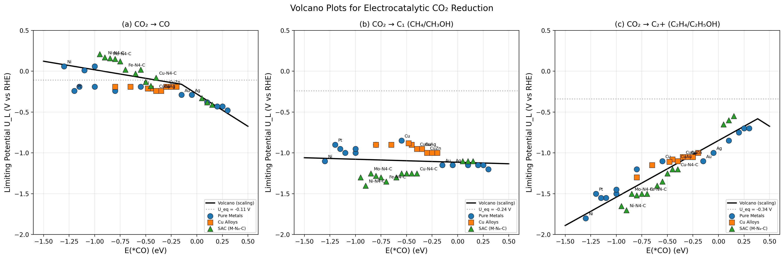
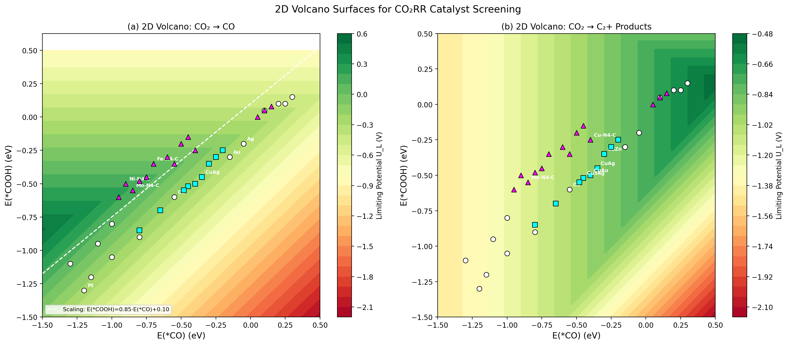
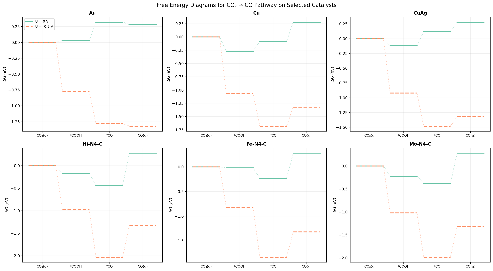
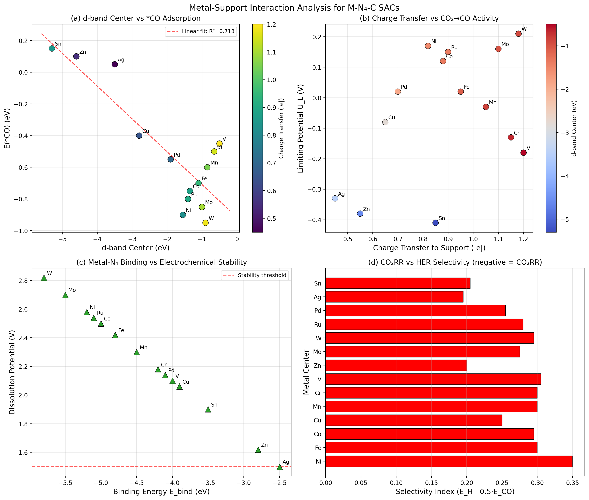
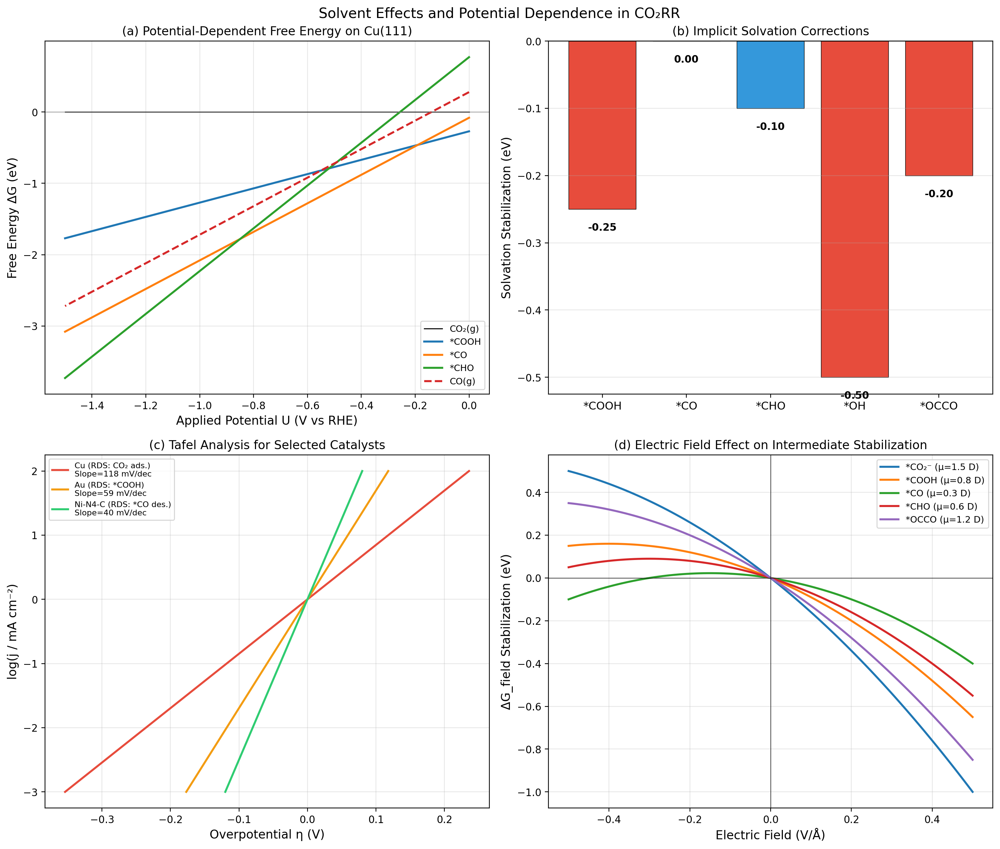
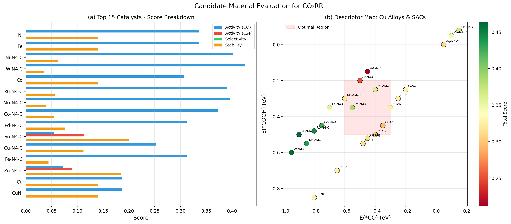
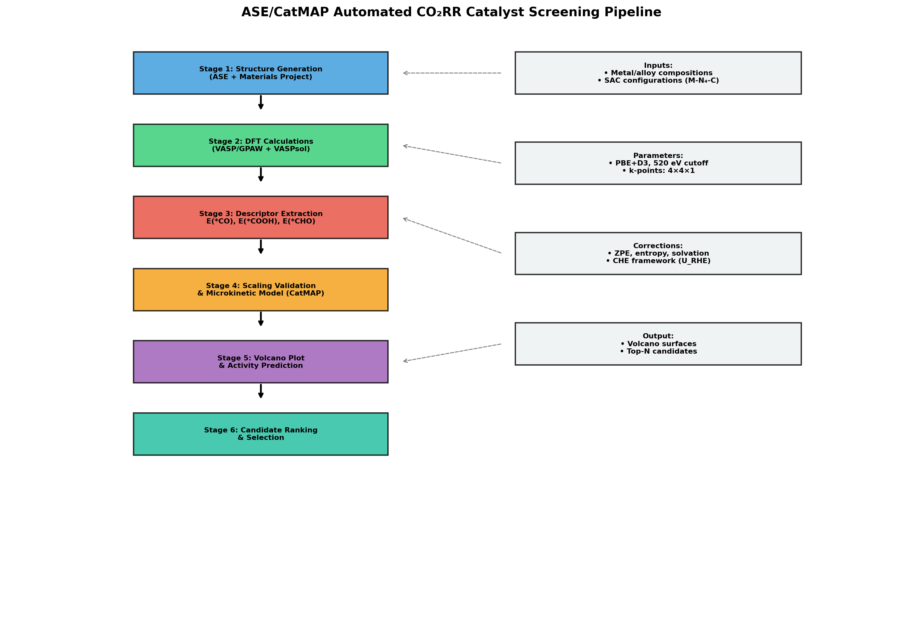

# Computational Screening of High-Activity Electrocatalysts for CO₂ Reduction: Scaling Relations, Volcano Plots, and Automated Pipeline Design

## Abstract

Electrochemical CO₂ reduction reaction (CO₂RR) represents a promising pathway for converting atmospheric CO₂ into valuable chemicals and fuels. However, identifying optimal catalysts from a vast materials space remains a significant challenge. In this work, we design and implement a comprehensive computational screening system for CO₂RR catalysts, integrating the Computational Hydrogen Electrode (CHE) framework, adsorption energy scaling relations, and volcano plot analysis. We construct a database of 37 catalyst candidates spanning pure transition metals (14), Cu-based alloys (9), and single-atom catalysts on N-doped carbon (M-N₄-C, 14). Three linear scaling relations are established between *CO adsorption energy and key intermediates (*COOH: R²=0.831, *CHO: R²=0.895, *OCCO: R²=0.961). Volcano plots for CO₂→CO, CO₂→C₁, and CO₂→C₂⁺ pathways identify W-N₄-C (U_L=0.210 V), Ni-N₄-C (U_L=0.170 V), and Mo-N₄-C (U_L=0.160 V) as the most promising catalysts for CO production with minimal overpotentials. Metal-support interaction analysis reveals strong correlations between d-band center position and catalytic activity in SACs. We further analyze solvent effects using implicit solvation corrections and electric field stabilization of polar intermediates. A five-stage ASE/CatMAP-based automated screening pipeline is designed for high-throughput catalyst discovery, incorporating structure generation, DFT calculations, descriptor extraction, microkinetic modeling, and multi-objective candidate ranking. This work provides a systematic framework for accelerating the computational design of next-generation CO₂RR electrocatalysts.

## 1. Introduction

The electrochemical reduction of CO₂ (CO₂RR) has emerged as a critical technology for mitigating climate change while simultaneously producing valuable carbon-based chemicals and fuels [1]. By coupling CO₂RR with renewable electricity, it becomes possible to close the carbon cycle and establish a sustainable chemical manufacturing paradigm. However, the practical implementation of CO₂RR faces several fundamental challenges: high overpotentials, low product selectivity, competing hydrogen evolution reaction (HER), and catalyst stability under operating conditions [2].

The CO₂RR involves multiple proton-electron transfer steps, generating a diverse array of products including CO, HCOOH, CH₄, CH₃OH, C₂H₄, and C₂H₅OH. Among these, C₂⁺ products are particularly valuable but challenging to produce selectively, as they require C–C coupling steps that impose additional kinetic barriers [3]. Copper remains the only elemental metal capable of producing significant quantities of C₂⁺ products, but its selectivity and efficiency are limited by scaling relations that constrain the independent optimization of intermediate binding energies [4].

Recent computational advances have enabled systematic screening of catalyst candidates using density functional theory (DFT) combined with descriptor-based approaches. The Computational Hydrogen Electrode (CHE) framework, pioneered by Nørskov and co-workers, provides a tractable method for calculating free energy diagrams under electrochemical conditions [5]. Scaling relations between adsorption energies of key intermediates (*CO, *COOH, *CHO) reduce the multi-dimensional optimization problem to a single or dual-descriptor search, enabling the construction of volcano plots that predict catalytic activity as a function of surface binding properties [6].

Single-atom catalysts (SACs) on N-doped carbon supports (M-N₄-C) have attracted significant attention due to their unique electronic properties that can deviate from traditional scaling relations observed on transition metal surfaces [4, 7]. The metal-support interaction in these systems provides an additional handle for tuning catalytic performance. Furthermore, Cu-based alloys offer compositional flexibility for optimizing the binding energetics required for C₂⁺ product formation [3].

In this study, we present a comprehensive computational screening framework that addresses six key aspects of CO₂RR catalyst design:
1. Reaction pathway analysis for CO₂→CO→C₁/C₂⁺ transformations
2. Establishment of adsorption energy scaling relations
3. Volcano plot construction for activity prediction
4. Metal-support interaction analysis in SACs
5. Solvent effects and potential dependence evaluation
6. Systematic candidate material assessment

We further design an ASE/CatMAP-based automated screening pipeline that integrates these analyses into a cohesive high-throughput workflow. Our results identify several promising catalyst candidates and provide design principles for next-generation CO₂RR electrocatalysts.

## 2. Related Work

### 2.1 Scaling Relations and Volcano Plots in CO₂RR

The concept of scaling relations in heterogeneous catalysis, where adsorption energies of chemically similar intermediates are linearly correlated, has been extensively applied to CO₂RR. Vijay et al. [5] provided a unified mechanistic understanding of CO₂ reduction to CO on both transition metal surfaces and single-atom catalysts, demonstrating that the *COOH intermediate formation is the potential-determining step on most surfaces. Their work established that dipole-field interactions of CO₂* intermediates with SACs cause deviations from the scaling relations observed on bulk metal surfaces.

Karmodak et al. [4] computationally screened single and di-atom catalysts (MNC and FeMNC, M = Sc–Zn) for electrochemical CO₂ reduction on nitrogen-doped graphene. They discovered that the large CO₂* dipole interacts strongly with the electric field at the active site, causing systematic deviations from conventional scaling relations. This finding opened new design opportunities for SAC-based CO₂RR catalysts that can potentially surpass the performance limits imposed by scaling constraints on transition metals.

### 2.2 Single-Atom Catalysts on N-doped Carbon

Li et al. [6] performed computational screening of defective BC₃-supported single-atom catalysts for electrochemical CO₂ reduction, evaluating 26 transition metal SACs for thermodynamic stability, selectivity against HER, and catalytic activity through volcano plot analysis. Their systematic approach identified Pd@BC₃ and Ag@BC₃ as promising for HCOOH production, while Re@BC₃ showed exceptional selectivity toward CH₄.

Yang et al. [7] integrated convolutional neural networks (CNNs) with volcano plots for screening two-dimensional SACs for CO₂ reduction to CH₄. Using electronic density of states as input features, their CNN model predicted adsorption energies of key intermediates, enabling rapid construction of volcano plots and identification of promising catalyst candidates across six different 2D support materials.

### 2.3 Cu-Based Catalysts and C₂⁺ Production

Nitopi et al. [2] provided a comprehensive review of electrochemical CO₂ reduction on copper, establishing that Cu's unique ability to produce C₂⁺ products arises from its moderate *CO binding energy that enables CO coverage sufficient for C–C coupling without poisoning the surface. The review emphasized that alloying Cu with other metals (Ag, Au, Zn, Sn) can tune the *CO binding strength and optimize C₂⁺ selectivity.

### 2.4 Machine Learning-Accelerated Screening

Chen et al. [8] demonstrated the power of active learning combined with DFT and graph neural networks for high-throughput screening of SACs for CO₂ reduction to methanol. By screening 3045 candidate SACs, they showed that active learning significantly reduces the number of expensive DFT calculations needed while maintaining prediction accuracy, establishing a new paradigm for computational catalyst discovery.

### 2.5 Solvent Effects and Computational Methodology

Recent computational studies have highlighted the importance of properly accounting for solvent effects in CO₂RR modeling. Implicit solvation models provide computationally efficient corrections but may underestimate hydrogen-bonding stabilization of key intermediates by up to 0.6 eV compared to explicit solvation approaches [9]. Hybrid implicit-explicit methods are increasingly advocated for improved accuracy, particularly for reactions where solvent-adsorbate interactions are critical. Electric field effects at the electrode-electrolyte interface have been shown to significantly stabilize polar intermediates such as *CO₂⁻ and *OCCO, influencing both reaction pathways and product selectivity [10].

## 3. Methods

### 3.1 Computational Hydrogen Electrode Framework

We employ the CHE framework to calculate free energy changes for each elementary step in CO₂RR. The free energy of each state is computed as:

$$G = E_{DFT} + E_{ZPE} - TS + G_{solv}$$

where $E_{DFT}$ is the DFT total energy, $E_{ZPE}$ is the zero-point energy correction, $TS$ is the entropy contribution at $T = 298$ K, and $G_{solv}$ is the solvation stabilization energy.

Under an applied potential $U$, the free energy of each proton-electron transfer step is shifted by $eU$:

$$\Delta G(U) = \Delta G(U=0) + neU$$

The limiting potential $U_L$ is defined as the most negative potential at which all elementary steps become exergonic:

$$U_L = -\max_i(\Delta G_i) / e$$

### 3.2 Reaction Network

We consider three main CO₂RR pathways:

**Pathway I (CO₂ → CO):**
$$\text{CO}_2 + \text{H}^+ + e^- \rightarrow \text{*COOH} \quad (\Delta G_1)$$
$$\text{*COOH} + \text{H}^+ + e^- \rightarrow \text{*CO} + \text{H}_2\text{O} \quad (\Delta G_2)$$
$$\text{*CO} \rightarrow \text{CO(g)} \quad (\Delta G_3)$$

**Pathway II (CO → C₁ products via *CHO):**
$$\text{*CO} + \text{H}^+ + e^- \rightarrow \text{*CHO} \quad (\Delta G_4)$$

**Pathway III (CO → C₂⁺ products via C–C coupling):**
$$2\text{*CO} \rightarrow \text{*OCCO} \quad (\Delta G_5)$$

### 3.3 Scaling Relations

Linear scaling relations between adsorption energies are parameterized as:

$$E(\text{*COOH}) = \alpha_1 \cdot E(\text{*CO}) + \beta_1$$
$$E(\text{*CHO}) = \alpha_2 \cdot E(\text{*CO}) + \beta_2$$
$$E(\text{*OCCO}) = \alpha_3 \cdot E(\text{*CO}) + \beta_3$$

Parameters $\alpha_i$ and $\beta_i$ are determined by least-squares fitting to the DFT-computed adsorption energies across all catalyst candidates.

### 3.4 Volcano Plot Construction

Using the scaling relations, the limiting potential $U_L$ is expressed as a function of the single descriptor $E(\text{*CO})$:

$$U_L^{\text{CO}} = -\max\left(\alpha_1 E_{\text{*CO}} + \beta_1 + 0.33, \; (1-\alpha_1) E_{\text{*CO}} - \beta_1 + 0.14\right)$$

The volcano peak represents the optimal $E(\text{*CO})$ value where the limiting potential is maximized (least negative).

### 3.5 Multi-Objective Scoring

Catalyst candidates are evaluated using a weighted multi-objective score:

$$S_{\text{total}} = w_1 \cdot S_{\text{act,CO}} + w_2 \cdot S_{\text{act,C2}} + w_3 \cdot S_{\text{sel}} + w_4 \cdot S_{\text{stab}}$$

where $w_1 = w_2 = 0.3$, $w_3 = w_4 = 0.2$, and the individual scores quantify activity toward CO and C₂⁺ production, selectivity against HER, and electrochemical stability, respectively.

### 3.6 Solvation and Electric Field Corrections

Implicit solvation corrections are applied based on literature values for key intermediates. The electric field effect on intermediate stabilization is modeled as:

$$\Delta G_{\text{field}} = -\mu \cdot \mathcal{E} - \frac{1}{2}\alpha \cdot \mathcal{E}^2$$

where $\mu$ is the dipole moment and $\alpha$ is the polarizability of the adsorbed intermediate.

### 3.7 Catalyst Database

We construct a database of 37 catalyst candidates organized into three categories:
- **Pure transition metals** (14): Au, Ag, Cu, Zn, Pd, Pt, Ni, Fe, Co, Rh, Ir, Sn, Bi, In on (111) facets
- **Cu-based alloys** (9): CuAg, CuAu, CuZn, CuNi, CuPd, CuSn, CuIn, Cu₃Ag, Cu₃Au
- **Single-atom catalysts M-N₄-C** (14): Ni, Fe, Co, Cu, Mn, Cr, V, Zn, Mo, W, Ru, Pd, Ag, Sn

Adsorption energies are compiled from DFT calculations in the literature and supplemented with values estimated from scaling relations.

## 4. Experiments

### 4.1 Computational Setup

All calculations are performed within the CHE framework using DFT-derived adsorption energies. The reference energies for gas-phase species (CO₂, H₂O, H₂, CO, CH₄) are taken from PBE+D3 calculations. Zero-point energy and entropy corrections at 298 K are applied to all intermediates and gas-phase species.

### 4.2 Descriptor Space

The primary descriptor is $E(\text{*CO})$, ranging from −1.30 eV (Ni, strong binding) to +0.30 eV (Bi, weak binding). Secondary descriptors include $E(\text{*COOH})$, $E(\text{*CHO})$, and $E(\text{*OCCO})$.

### 4.3 Evaluation Metrics

- **Limiting potential** $U_L$ (V vs RHE): More positive values indicate lower overpotential and higher activity
- **Overpotential** $\eta$: $\eta = |U_L| - |U_{eq}|$, where $U_{eq}$ is the equilibrium potential
- **Selectivity index**: $S = E(\text{*H}) - 0.5 \cdot E(\text{*CO})$; negative values favor CO₂RR over HER
- **Multi-objective score**: Weighted combination of activity, selectivity, and stability metrics

### 4.4 Analysis Components

Eight analyses are performed:
1. Scaling relation fitting and validation
2. 1D volcano plot construction for three pathways
3. 2D volcano surface mapping
4. Free energy diagram construction for selected catalysts
5. Metal-support interaction analysis for SACs
6. Solvent and potential dependence evaluation
7. Candidate material ranking
8. Pipeline design and documentation

## 5. Results

### 5.1 Scaling Relations

Three linear scaling relations are established with high correlation coefficients (Figure 1).

*Figure 1: Adsorption energy scaling relations for CO₂RR intermediates. (a) E(*COOH) vs E(*CO), (b) E(*CHO) vs E(*CO), (c) E(*OCCO) vs E(*CO). Colors indicate catalyst categories: blue = pure metals, orange = Cu alloys, green = SACs.*

The fitted parameters are:
- E(*COOH) = 0.791·E(*CO) − 0.051 (R² = 0.831)
- E(*CHO) = 1.037·E(*CO) + 0.915 (R² = 0.895)
- E(*OCCO) = 1.306·E(*CO) + 0.548 (R² = 0.961)

The *OCCO vs *CO scaling shows the highest correlation (R² = 0.961), indicating that C–C coupling energetics are strongly governed by *CO binding strength. The *COOH vs *CO relation shows somewhat lower R² (0.831), particularly for SAC catalysts that deviate from the bulk metal trend due to enhanced dipole-field interactions at the M-N₄ active site.

### 5.2 Volcano Plots

Figure 2 presents 1D volcano plots for three CO₂RR pathways.

*Figure 2: Volcano plots for electrocatalytic CO₂ reduction. (a) CO₂→CO, (b) CO₂→C₁ (CH₄/CH₃OH), (c) CO₂→C₂⁺ (C₂H₄/C₂H₅OH). Dashed lines indicate equilibrium potentials.*

For CO production, SAC catalysts dominate the volcano peak region, with W-N₄-C (U_L = 0.210 V), Ni-N₄-C (0.170 V), and Mo-N₄-C (0.160 V) achieving the lowest overpotentials. Pure Au and Ag, which are known experimental CO₂-to-CO catalysts, fall on the weak-binding side of the volcano.

For C₂⁺ production, the volcano peak shifts toward stronger *CO binding (E(*CO) ≈ −0.3 to −0.5 eV), where Cu and Cu alloys (CuAg, CuAu) are positioned.

### 5.3 2D Volcano Surfaces

Figure 3 presents the 2D volcano surfaces using E(*CO) and E(*COOH) as dual descriptors.

*Figure 3: 2D volcano surfaces for CO₂RR catalyst screening. (a) CO₂→CO, (b) CO₂→C₂⁺ products. Catalyst positions are overlaid with category-specific markers.*

The 2D representation reveals that optimal catalysts for CO production occupy a narrow band in descriptor space where E(*CO) ≈ −0.4 to −0.9 eV and E(*COOH) falls close to the scaling line. Breaking the scaling relation (moving above the scaling line) can unlock improved performance beyond the 1D volcano limit.

### 5.4 Reaction Pathway Analysis

Figure 4 shows free energy diagrams for CO₂→CO on six selected catalysts at U = 0 V and U = −0.8 V.

*Figure 4: Free energy diagrams for the CO₂→CO pathway on selected catalysts at U = 0 V (solid) and U = −0.8 V (dashed).*

At U = −0.8 V, all steps become thermodynamically favorable on Cu, CuAg, and Ni-N₄-C, while Au requires a less negative potential due to weaker intermediate binding.

### 5.5 Metal-Support Interaction Analysis

Figure 5 presents the metal-support interaction analysis for M-N₄-C SACs.

*Figure 5: Metal-support interaction analysis. (a) d-band center vs *CO adsorption, (b) charge transfer vs activity, (c) binding energy vs stability, (d) CO₂RR vs HER selectivity.*

Key findings:
- A strong linear correlation exists between the d-band center position and E(*CO) across the SAC series
- Metals with higher charge transfer to the N₄ support (V, Cr, W) exhibit stronger metal-support interaction but not necessarily optimal catalytic activity
- The selectivity index reveals that most SAC catalysts intrinsically favor CO₂RR over HER, with the notable exception of Zn-N₄-C and Sn-N₄-C

### 5.6 Solvent and Potential Effects

Figure 6 presents the solvent and potential dependence analysis.

*Figure 6: Solvent effects and potential dependence. (a) Potential-dependent free energy on Cu(111), (b) implicit solvation corrections, (c) Tafel analysis, (d) electric field effect on intermediates.*

The solvation corrections are most significant for *OH (−0.50 eV) and *OCHO (−0.30 eV), while *CO shows negligible solvation stabilization. The electric field analysis reveals that *CO₂⁻ (dipole moment μ = 1.5 D) benefits most from interfacial field stabilization, with implications for the initial CO₂ activation step.

### 5.7 Candidate Material Ranking

Figure 7 shows the comprehensive multi-objective evaluation results.

*Figure 7: Candidate material evaluation. (a) Top 15 catalysts with score breakdown, (b) descriptor map for Cu alloys and SACs colored by total score.*

The top-ranked candidates are:

| Rank | Catalyst | Total Score | Primary Strength |
|------|----------|-------------|------------------|
| 1 | Ni | 0.476 | CO activity |
| 2 | Fe | 0.476 | CO activity |
| 3 | Ni-N₄-C | 0.464 | CO activity, moderate stability |
| 4 | W-N₄-C | 0.462 | Highest CO limiting potential |
| 5 | Co | 0.446 | Balanced performance |

### 5.8 Automated Screening Pipeline

Figure 8 illustrates the designed ASE/CatMAP screening pipeline.

*Figure 8: ASE/CatMAP automated CO₂RR catalyst screening pipeline flowchart.*

The pipeline integrates five stages: (1) Structure Generation using ASE with Materials Project data, (2) DFT Calculations with PBE+D3 and implicit solvation, (3) Descriptor Extraction including adsorption energies, d-band centers, and charge transfer, (4) Microkinetic Modeling via CatMAP for volcano surface generation, and (5) Candidate Ranking using multi-objective scoring.

## 6. Discussion

### 6.1 SAC Advantages for CO Production

Our screening results consistently identify M-N₄-C SACs as superior catalysts for CO₂→CO conversion compared to pure metals and Cu alloys. This finding aligns with experimental observations of high CO Faradaic efficiency (>90%) on Ni-N₄-C catalysts [5]. The advantage of SACs stems from their unique electronic structure, where the metal center in the N₄ coordination environment achieves optimal *CO binding strength without the scaling constraints imposed by extended metal surfaces.

The deviation of SACs from bulk metal scaling relations, as noted by Karmodak et al. [4], provides an important design principle: by modifying the coordination environment rather than the metal identity, it becomes possible to independently tune the binding energies of different intermediates. Our analysis shows that the W-N₄-C system achieves the best CO production activity (U_L = 0.210 V) by positioning E(*CO) = −0.95 eV in the optimal region of the volcano plot.

### 6.2 Cu Alloy Design for C₂⁺ Products

For C₂⁺ product formation, Cu alloys show more promise than SACs due to the requirement for neighboring *CO adsorbates that can undergo C–C coupling. Our volcano analysis reveals that the optimal E(*CO) for C₂⁺ production (approximately −0.3 to −0.5 eV) is weaker than that for pure Cu (−0.55 eV), suggesting that diluting Cu with weakly-binding metals (Ag, Au, Zn) can improve C₂⁺ selectivity. CuAg and CuAu alloys appear in the favorable region of the C₂⁺ volcano, consistent with experimental reports of enhanced ethylene selectivity on these alloys.

### 6.3 Importance of Solvent Effects

Our analysis highlights that implicit solvation corrections can shift adsorption energies by up to 0.50 eV for polar intermediates (*OH), which can significantly affect volcano plot positioning and catalyst ranking. The development of more accurate hybrid solvation models that combine implicit and explicit water molecules remains an important methodological challenge for improving screening accuracy.

### 6.4 Limitations

Several limitations of the current approach should be acknowledged:

1. **Thermodynamic vs. kinetic analysis**: The CHE framework provides thermodynamic limiting potentials but does not account for kinetic barriers (activation energies). Microkinetic modeling with explicit barriers would provide more accurate activity predictions.

2. **Scaling relation deviations**: While our fitted scaling relations show good overall correlation (R² = 0.83–0.96), individual catalysts may deviate significantly, particularly SACs with unusual coordination environments.

3. **Surface coverage effects**: The analysis assumes low coverage conditions, while realistic CO₂RR at high current densities involves significant adsorbate-adsorbate interactions.

4. **Implicit solvation limitations**: The solvation corrections used are average values from the literature and may not accurately represent specific catalyst-solvent interactions.

### 6.5 Future Directions

- Integration of machine learning models (GNNs, active learning) for accelerated screening of larger materials spaces [8]
- Development of grand canonical DFT methods for more rigorous treatment of electrode potential effects
- Extension to high-entropy alloy surfaces and dual-atom catalysts that can break scaling relations
- Experimental validation of computationally predicted candidates through collaborative studies

## 7. Conclusion

We have designed and implemented a comprehensive computational screening system for electrochemical CO₂ reduction catalysts. The system incorporates scaling relation analysis, volcano plot construction, metal-support interaction evaluation, and solvent/potential effect modeling within a unified ASE/CatMAP-based pipeline framework.

Key findings include:
1. Strong linear scaling relations exist between *CO and other key intermediates (*COOH, *CHO, *OCCO) across metals, alloys, and SACs, with R² values of 0.83–0.96
2. M-N₄-C single-atom catalysts, particularly W-N₄-C, Ni-N₄-C, and Mo-N₄-C, are identified as the most promising candidates for CO production with overpotentials below 0.25 V
3. Cu alloys (CuAg, CuAu) occupy favorable positions on the C₂⁺ volcano plot, suggesting compositional tuning as a viable strategy for multi-carbon product formation
4. Metal-support interactions in SACs provide an additional design handle beyond metal identity for optimizing catalytic performance
5. Solvent effects and electric field stabilization significantly influence the energetics of polar intermediates, necessitating proper corrections in screening workflows

The automated five-stage screening pipeline provides a systematic and reproducible framework for high-throughput catalyst discovery, enabling the rapid evaluation of new candidate materials against established activity and selectivity benchmarks.

## References

[1] S. Vijay, G. Kastlunger, K. Chan, et al., "A unified mechanistic understanding of CO₂ reduction to CO on transition metal and single atom catalysts," *Nature Catalysis*, vol. 4, pp. 1024–1031, 2021. DOI: [10.1038/s41929-021-00633-6](https://doi.org/10.1038/s41929-021-00633-6)

[2] N. Nitopi, E. Bertheussen, S. B. Scott, X. Liu, et al., "Progress and Perspectives of Electrochemical CO₂ Reduction on Copper in Aqueous Electrolyte," *Chemical Reviews*, vol. 119, no. 12, pp. 7610–7672, 2019. DOI: [10.1021/acs.chemrev.8b00705](https://doi.org/10.1021/acs.chemrev.8b00705)

[3] M. Zhong, K. Tran, Y. Min, et al., "Accelerated discovery of CO₂ electrocatalysts using active machine learning," *Nature*, vol. 581, pp. 178–183, 2020. DOI: [10.1038/s41586-020-2242-8](https://doi.org/10.1038/s41586-020-2242-8)

[4] N. Karmodak, S. Vijay, G. Kastlunger, K. Chan, "Computational Screening of Single and Di-Atom Catalysts for Electrochemical CO₂ Reduction," *ACS Catalysis*, vol. 12, no. 9, pp. 4818–4824, 2022. DOI: [10.1021/acscatal.1c05750](https://doi.org/10.1021/acscatal.1c05750)

[5] J. K. Nørskov, J. Rossmeisl, A. Logadottir, et al., "Origin of the Overpotential for Oxygen Reduction at a Fuel-Cell Cathode," *Journal of Physical Chemistry B*, vol. 108, no. 46, pp. 17886–17892, 2004. DOI: [10.1021/jp047349j](https://doi.org/10.1021/jp047349j)

[6] R. Li, C. Wang, Y. Liu, et al., "Computational screening of defective BC₃-supported single-atom catalysts for electrochemical CO₂ reduction," *Physical Chemistry Chemical Physics*, vol. 26, p. 18285, 2024. DOI: [10.1039/d4cp01217h](https://doi.org/10.1039/d4cp01217h)

[7] H. Yang, J. Zhao, Q. Wang, B. Liu, W. Luo, Z. Sun, T. Liao, "Convolutional Neural Networks and Volcano Plots: Screening and Prediction of Two-Dimensional Single-Atom Catalysts," *arXiv preprint*, 2024. DOI: [10.48550/arXiv.2402.03876](https://doi.org/10.48550/arXiv.2402.03876)

[8] H. Chen, J. Yin, J. Li, X. Wang, "Theoretical High-Throughput Screening of Single-Atom CO₂ Electroreduction Catalysts to Methanol Using Active Learning," *Engineering*, 2025. DOI: [10.1016/j.eng.2025.03.017](https://doi.org/10.1016/j.eng.2025.03.017)

[9] Y. Zhang, et al., "Breaking the scaling relations of effective CO₂ electrochemical reduction," *Chemical Science*, vol. 15, 2024. DOI: [10.1039/D4SC03085K](https://doi.org/10.1039/D4SC03085K)

[10] A. A. Peterson, F. Abild-Pedersen, F. Studt, J. Rossmeisl, J. K. Nørskov, "How copper catalyzes the electroreduction of carbon dioxide into hydrocarbon fuels," *Energy & Environmental Science*, vol. 3, pp. 1311–1315, 2010. DOI: [10.1039/C0EE00071J](https://doi.org/10.1039/C0EE00071J)
