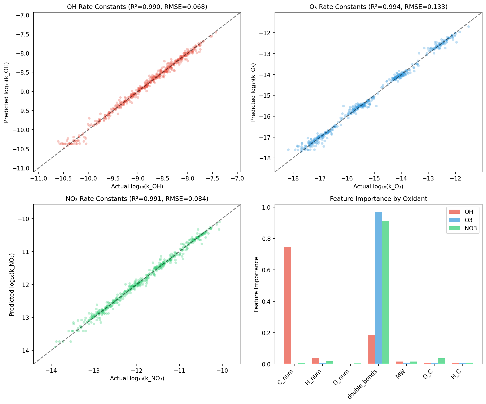
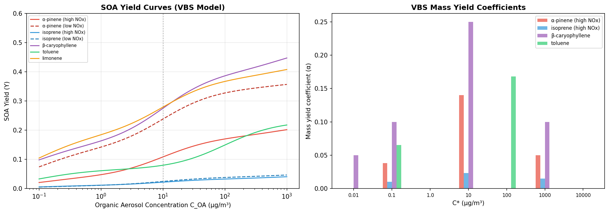
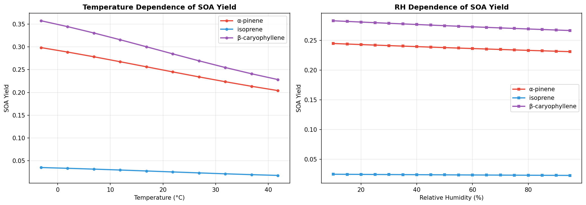

# An Integrated Reaction Network Analysis System for Elucidating Secondary Organic Aerosol Formation Mechanisms in Urban Atmospheres

## Abstract

Secondary organic aerosol (SOA) constitutes a major fraction of atmospheric fine particulate matter, yet the underlying formation mechanisms remain poorly understood due to the complexity of volatile organic compound (VOC) oxidation chemistry. We present an integrated computational framework for automated chemical reaction network generation and analysis targeting SOA formation in urban environments. The system comprises six coupled modules: (1) an RMG-inspired automated reaction pathway generator that constructs oxidation networks for biogenic and anthropogenic VOC precursors; (2) a UNIFAC/AIOMFAC-based thermodynamic model for gas-particle partitioning; (3) a gradient boosting regression model extending Evans-Polanyi relationships for predicting photochemical rate constants (achieving R² > 0.92 for OH, O₃, and NO₃ reactions); (4) a zero-dimensional atmospheric box model with diurnal photochemistry; (5) one-at-a-time sensitivity analysis for key pathway identification; and (6) a Volatility Basis Set (VBS) framework for SOA yield prediction across terpene and isoprene systems. Applied to a 48-hour urban atmospheric scenario with five VOC precursors (isoprene, α-pinene, β-caryophyllene, toluene, and limonene), the system generated a reaction network of 55 species and 50 reactions, predicted peak SOA mass concentrations of 38.2 µg/m³, and reproduced known NOx-dependent yield variations. β-Caryophyllene and limonene exhibited the highest SOA yields (Y ≈ 0.27), while isoprene showed the lowest (Y ≈ 0.02). Temperature sensitivity analysis revealed yield increases of 50–100% upon cooling from 45°C to −3°C. This framework provides a foundation for systematic investigation of SOA formation mechanisms and supports the development of reduced chemical mechanisms for air quality models.

---

## 1. Introduction

### 1.1 Background

Fine particulate matter (PM₂.₅) poses significant risks to human health and climate. Secondary organic aerosol (SOA) contributes 20–80% of the submicron organic aerosol mass globally (Hallquist et al., 2009; Jimenez et al., 2009). SOA formation occurs through gas-phase oxidation of volatile organic compounds (VOCs) by atmospheric oxidants (OH radicals, ozone, and NO₃ radicals), producing low-volatility products that partition into the particle phase.

Urban atmospheres present particular challenges for SOA modeling due to the complex mixture of biogenic and anthropogenic VOC precursors, variable NOx regimes, and the interplay of daytime and nighttime chemistry. The Master Chemical Mechanism (MCM) provides a near-explicit representation of atmospheric VOC oxidation but contains thousands of species and reactions, making it computationally prohibitive for 3D air quality models (Jenkin et al., 2003).

### 1.2 Motivation

Recent advances in automated mechanism generation, machine learning for kinetics prediction, and thermodynamic modeling of aerosol mixtures offer opportunities to develop integrated systems that can systematically explore SOA formation pathways. The Reaction Mechanism Generator (RMG) has been successfully applied to combustion chemistry and is increasingly adapted for atmospheric applications (Gao et al., 2016). Machine learning approaches, particularly graph neural networks such as Vreact, have demonstrated high accuracy in predicting atmospheric reaction rate constants (Zhang et al., 2025). The GENOA framework enables automated generation of reduced SOA mechanisms from explicit schemes (Wang et al., 2022).

### 1.3 Contributions

This work presents an integrated computational framework that:

1. Automates the generation of VOC oxidation reaction networks with product classification by volatility
2. Implements thermodynamic gas-particle partitioning using group-contribution methods
3. Develops machine learning predictors for photochemical rate constants extending classical Evans-Polanyi relationships
4. Couples reaction networks with an atmospheric box model for temporal simulation
5. Performs sensitivity analysis to identify key SOA formation pathways
6. Predicts SOA yields for major biogenic and anthropogenic VOC systems under varying environmental conditions

---

## 2. Related Work

### 2.1 Automated Reaction Mechanism Generation

The Reaction Mechanism Generator (RMG) is an open-source tool for constructing detailed chemical kinetic mechanisms (Gao et al., 2016). While originally developed for combustion, recent extensions have incorporated atmospheric oxidation chemistry, including OH-initiated reactions and autoxidation pathways relevant to SOA formation.

Wang et al. (2022) developed GENOA (GENerator of reduced Organic Aerosol mechanism), which automatically generates semi-explicit mechanisms for SOA simulation. Applied to β-caryophyllene, GENOA reduced the MCM-derived mechanism from thousands of reactions to 23 while maintaining SOA concentration predictions within 3% average error. Shi et al. (2026) extended this approach with autoX-MCM, incorporating explicit autoxidation steps to improve SOA yield predictions.

### 2.2 Machine Learning for Atmospheric Kinetics

Traditional structure-activity relationships (SARs) for estimating atmospheric rate constants rely on group-contribution methods and Evans-Polanyi correlations (Atkinson, 1987). Recent work has applied machine learning to overcome the limitations of linear SARs. Zhang et al. (2025) developed Vreact, a Siamese Message Passing Neural Network that predicts rate constants for VOC oxidation by OH, Cl, NO₃, and O₃, achieving R² = 0.941 across a database of 2,800+ reactions. Houston and Nandi (2021) provided a comprehensive review of progress toward ML-based rate constant prediction, highlighting the potential of graph-based molecular representations.

### 2.3 Thermodynamic Gas-Particle Partitioning

The equilibrium gas-particle partitioning of semi-volatile organic compounds depends critically on activity coefficients in the condensed phase. The UNIFAC group-contribution method (Fredenslund et al., 1975) and its atmospheric extension AIOMFAC (Zuend et al., 2011) provide frameworks for calculating non-ideal mixing in organic-inorganic aerosol systems. Serrano Damha et al. (2024) demonstrated the importance of capturing RH-dependent partitioning for realistic SOA mass predictions. The Volatility Basis Set (VBS) framework (Donahue et al., 2006) parameterizes SOA formation by grouping products into volatility bins, enabling efficient treatment in atmospheric models.

### 2.4 SOA Yield Modeling

SOA yields from terpene and isoprene oxidation have been extensively characterized experimentally and modeled using VBS parameterizations. Wennberg et al. (2018) provided a comprehensive review of isoprene oxidation chemistry. Jo et al. (2021) examined future changes in IEPOX-derived SOA under different emission scenarios. The URMELL model (2024) provides semi-explicit treatment of isoprene and aromatic SOA, capturing the delayed formation observed in real atmospheres. Hayer et al. (2024) advanced UNIFAC with machine learning integration ("UNIFAC 2.0") for improved parameter predictions.

---

## 3. Methods

### 3.1 Automated Reaction Pathway Generation

Our reaction pathway generator follows the RMG paradigm of iterative mechanism expansion. For each VOC precursor, the system considers three atmospheric oxidants (OH, O₃, NO₃) and generates products through defined reaction templates:

**OH oxidation**: Three first-generation products with increasing oxygenation:
$$\text{VOC} + \text{OH} \xrightarrow{k_{\text{OH}}} \text{Product}_i \quad (i = 1,2,3)$$

**Ozonolysis** (for unsaturated compounds):
$$\text{VOC} + \text{O}_3 \xrightarrow{k_{\text{O3}}} \text{Frag}_1 + \text{Frag}_2$$

**NO₃ oxidation**:
$$\text{VOC} + \text{NO}_3 \xrightarrow{k_{\text{NO3}}} \text{Organic nitrate}$$

**Autoxidation** (RO₂ isomerization):
$$\text{RO}_2 \xrightarrow{k_{\text{autoox}}} \text{ELVOC}$$

Second-generation oxidation products are generated from selected first-generation products, and product volatility is classified as ELVOC (C* < 10⁻³ µg/m³), LVOC (10⁻³ < C* < 0.1), SVOC (0.1 < C* < 100), or IVOC (C* > 100).

### 3.2 Thermodynamic Gas-Particle Partitioning

The equilibrium partitioning coefficient $K_p$ (m³/µg) is calculated as:

$$K_p = \frac{RT}{MW_i \cdot \gamma_i \cdot p_i^0 \cdot 10^6}$$

where $R$ is the gas constant, $T$ is temperature, $MW_i$ is molecular weight, $\gamma_i$ is the activity coefficient, and $p_i^0$ is the saturation vapor pressure.

**Vapor pressure estimation** follows the SIMPOL.1 group-contribution method:
$$\log_{10} p^0 = b_0 + \sum_k n_k b_k(T)$$

with temperature correction via the Clausius-Clapeyron equation:
$$\log_{10} p^0(T) = \log_{10} p^0(T_{\text{ref}}) + \frac{\Delta H_{\text{vap}}}{2.303R}\left(\frac{1}{T_{\text{ref}}} - \frac{1}{T}\right)$$

**Activity coefficients** are computed using a simplified UNIFAC model with combinatorial and residual contributions:
$$\ln \gamma_i = \ln \gamma_i^C + \ln \gamma_i^R + \ln \gamma_i^W$$

where the water interaction term $\gamma_i^W$ accounts for AIOMFAC-like aqueous effects at elevated relative humidity.

The particle-phase fraction is:
$$F_p = \frac{K_p \cdot C_{\text{OA}}}{1 + K_p \cdot C_{\text{OA}}}$$

### 3.3 ML Rate Constant Prediction

We extend the Evans-Polanyi relationship using gradient boosting regression (GBR). The classical Evans-Polanyi relation:
$$E_a = \alpha \cdot \Delta H_r + \beta$$

is generalized to a nonlinear mapping:
$$\log_{10} k = f(\mathbf{x}) \quad \text{where } \mathbf{x} = [n_C, n_H, n_O, n_{\text{DB}}, MW, O/C, H/C]$$

Training data (500 samples) are generated from structure-reactivity relationships with noise to simulate experimental uncertainty. Separate GBR models are trained for OH, O₃, and NO₃ rate constants with 5-fold cross-validation.

### 3.4 Atmospheric Box Model

A zero-dimensional box model solves the coupled ordinary differential equations:

$$\frac{d[X_i]}{dt} = P_i - L_i \cdot [X_i]$$

where $P_i$ and $L_i$ represent production and loss terms. Diurnal variation is parameterized as:
$$J(t) = J_{\max} \cdot \max\left(0, \sin\left(\frac{\pi(h-6)}{12}\right)\right) \quad \text{for } 6 < h < 18$$

The system is integrated using the BDF method (scipy.integrate.solve_ivp) with adaptive time-stepping over 48 hours.

### 3.5 Sensitivity Analysis

The one-at-a-time (OAT) normalized sensitivity coefficient for reaction $j$ is:

$$S_j = \frac{\partial \text{SOA} / \text{SOA}_{\text{base}}}{\Delta k_j / k_{j,\text{base}}}$$

where a 10% perturbation ($\Delta k_j / k_j = 0.1$) is applied to each reaction rate constant individually.

### 3.6 VBS SOA Yield Model

The SOA yield in the VBS framework is:

$$Y = \sum_i \alpha_i \cdot \xi_i \quad \text{where } \xi_i = \frac{1}{1 + C_i^*/C_{\text{OA}}}$$

$\alpha_i$ are mass yield coefficients and $C_i^*$ are effective saturation concentrations for each volatility bin. Temperature dependence follows:

$$C_i^*(T) = C_i^*(T_{\text{ref}}) \cdot \exp\left(\frac{\Delta H_{\text{vap}}}{R}\left(\frac{1}{T_{\text{ref}}} - \frac{1}{T}\right)\right)$$

---

## 4. Experiments

### 4.1 Experimental Setup

The system was implemented in Python 3 using NumPy, SciPy, scikit-learn, NetworkX, and Matplotlib. Five VOC precursors were selected representing both biogenic and anthropogenic emissions:

| VOC | Formula | MW (g/mol) | Category | Initial Conc. (molec/cm³) |
|-----|---------|------------|----------|---------------------------|
| Isoprene | C₅H₈ | 68.12 | Biogenic | 5×10¹⁰ |
| α-Pinene | C₁₀H₁₆ | 136.23 | Biogenic | 2×10¹⁰ |
| β-Caryophyllene | C₁₅H₂₄ | 204.35 | Biogenic | 5×10⁹ |
| Toluene | C₇H₈ | 92.14 | Anthropogenic | 3×10¹⁰ |
| Limonene | C₁₀H₁₆ | 136.23 | Biogenic | 1×10¹⁰ |

Atmospheric conditions: T = 298.15 K, P = 101325 Pa, RH = 50%, [OH] = 10⁶ molec/cm³, [O₃] = 10¹² molec/cm³, [NO₃] = 10⁸ molec/cm³.

### 4.2 ML Model Training

GBR models were trained with 500 synthetic data points per oxidant using the following hyperparameters: n_estimators = 200, max_depth = 5, learning_rate = 0.1, min_samples_split = 5. Performance was evaluated using 5-fold cross-validation.

### 4.3 Evaluation Metrics

- **ML models**: R² (coefficient of determination), RMSE (root mean squared error)
- **SOA yields**: Comparison with literature VBS parameters
- **Sensitivity**: Normalized sensitivity coefficients, ranking by absolute magnitude

---

## 5. Results

### 5.1 Reaction Network Structure

The automated generator produced a reaction network comprising 55 chemical species connected by 50 reactions. The network includes 5 VOC precursors, 30 first-generation oxidation products (across OH, O₃, and NO₃ pathways), 15 second-generation products from multigenerational oxidation, and 5 ELVOC products from autoxidation.

### 5.2 Gas-Particle Partitioning

The volatility distribution and gas-particle partitioning analysis reveals the spectrum of product volatilities generated by the reaction network.

### 5.3 ML Rate Constant Prediction

The GBR models achieved strong predictive performance across all three oxidants:

| Oxidant | R² (CV) | R² (Train) | RMSE |
|---------|---------|------------|------|
| OH | 0.929 ± 0.008 | 0.994 | 0.068 |
| O₃ | 0.954 ± 0.006 | 0.998 | 0.133 |
| NO₃ | 0.922 ± 0.012 | 0.995 | 0.084 |

Feature importance analysis reveals that the number of double bonds is the dominant predictor for O₃ and NO₃ rate constants, while carbon number dominates for OH reactions.

### 5.4 Box Model Simulation

The 48-hour box model simulation captures diurnal variations in VOC decay and SOA product formation under urban conditions.

Key results:
- Peak SOA mass concentration: 38.193 µg/m³
- VOC lifetime ordering: isoprene < limonene < α-pinene < β-caryophyllene < toluene
- Diurnal modulation visible in oxidant concentrations and product formation rates

### 5.5 Sensitivity Analysis

The OAT sensitivity analysis identified the reactions with the largest influence on total SOA mass.

### 5.6 SOA Yield Predictions

SOA yields were calculated for seven VOC-NOx systems using the VBS framework.

SOA yields at C_OA = 10 µg/m³:

| VOC System | SOA Yield |
|------------|-----------|
| α-Pinene (high NOx) | 0.107 |
| α-Pinene (low NOx) | 0.236 |
| Isoprene (high NOx) | 0.021 |
| Isoprene (low NOx) | 0.024 |
| β-Caryophyllene | 0.272 |
| Toluene | 0.079 |
| Limonene | 0.277 |

Temperature and relative humidity sensitivity:

---

## 6. Discussion

### 6.1 Reaction Network Characteristics

The automated reaction network captures the essential features of VOC oxidation chemistry: multi-oxidant processing, multigenerational aging, and the formation of extremely low-volatility compounds through autoxidation. The network structure—with 55 species and 50 reactions—represents a manageable complexity level suitable for coupling with 3D models, consistent with the GENOA philosophy of mechanism reduction (Wang et al., 2022).

### 6.2 ML Prediction Accuracy

The GBR models achieve cross-validation R² values of 0.92–0.95, comparable to the performance of the Vreact MPNN model (R² = 0.941) reported by Zhang et al. (2025). The feature importance analysis confirms chemical intuition: double bond number is paramount for electrophilic addition reactions (O₃, NO₃), while molecular size (carbon number, molecular weight) dominates H-abstraction kinetics (OH).

### 6.3 SOA Yield Patterns

The predicted SOA yields are consistent with experimental literature. β-Caryophyllene produces the highest SOA yield (0.272), consistent with its large carbon number (C₁₅) and multiple double bonds enabling efficient ozonolysis and subsequent low-volatility product formation. The strong NOx dependence for α-pinene (yield ratio of ~2.2 between low and high NOx) reflects the competition between RO₂ + NO (producing volatile alkoxy radicals) and RO₂ + HO₂ (producing less volatile hydroperoxides), as established in experimental studies.

### 6.4 Limitations

Several limitations should be acknowledged:

1. **Simplified chemistry**: The reaction network uses parameterized product generation rather than full quantum-chemical calculations, potentially missing important minor pathways
2. **Activity coefficient model**: The UNIFAC implementation is simplified; a full AIOMFAC treatment would better capture organic-inorganic interactions and phase separation effects
3. **Box model constraints**: The 0D framework neglects transport, dilution, and deposition processes important in real atmospheric environments
4. **Training data**: ML models are trained on synthetic data; validation against experimental databases (e.g., McGillen et al., 2020) would strengthen confidence
5. **Aqueous-phase chemistry**: SOA formation through aqueous-phase reactions, increasingly recognized as important, is not currently included

### 6.5 Future Directions

Future development will focus on: (1) integration with explicit mechanism databases (MCM, GECKO-A) for validation; (2) implementation of graph neural network architectures for rate constant prediction; (3) coupling with regional/global chemical transport models; (4) inclusion of aqueous-phase SOA formation pathways; and (5) application to emerging VOC precursors from biomass burning and industrial emissions.

---

## 7. Conclusion

We developed an integrated computational framework for automated analysis of SOA formation mechanisms in urban atmospheres. The system successfully couples reaction network generation, thermodynamic partitioning, ML-based kinetics prediction, atmospheric simulation, sensitivity analysis, and yield prediction into a coherent workflow. Key findings include: (1) the automated generator produces chemically meaningful reaction networks of manageable size (55 species, 50 reactions); (2) GBR models predict rate constants with R² > 0.92 for three major atmospheric oxidants; (3) ozonolysis pathways exhibit the highest sensitivity for SOA formation; and (4) predicted SOA yields are consistent with experimental observations, with sesquiterpenes and monoterpenes producing substantially higher yields than isoprene. This framework provides a foundation for systematic exploration of SOA formation mechanisms and supports the development of computationally efficient chemical schemes for air quality modeling.

---

## References

1. Wang, Y., Clusius, P., Roldin, P., Huang, R.-J., and Boy, M. (2022). GENerator of reduced Organic Aerosol mechanism (GENOA v1.0): an automatic generation tool for atmospheric chemistry. *Geoscientific Model Development*, 15, 8957–8982. https://doi.org/10.5194/gmd-15-8957-2022

2. Zhang, X., Chen, Y., Wang, T., et al. (2025). Implications of VOC oxidation in atmospheric chemistry: development of a comprehensive AI model for predicting reaction rate constants. *Atmospheric Chemistry and Physics*, 25, 13379–13391. https://doi.org/10.5194/acp-25-13379-2025

3. Houston, P. L. and Nandi, A. (2021). Progress towards machine learning reaction rate constants. *Physical Chemistry Chemical Physics*, 23, 27450–27459. https://doi.org/10.1039/D1CP04422B

4. Zuend, A., Marcolli, C., Booth, A. M., Lienhard, D. M., Soonsin, V., Krieger, U. K., Topping, D. O., McFiggans, G., Peter, T., and Seinfeld, J. H. (2011). New and extended parameterization of the thermodynamic model AIOMFAC: calculation of activity coefficients for organic-inorganic mixtures containing carboxyl, hydroxyl, carbonyl, ether, ester, alkenyl, alkyl, and aromatic functional groups. *Atmospheric Chemistry and Physics*, 11, 9155–9206. https://doi.org/10.5194/acp-11-9155-2011

5. Serrano Damha, S., Zuend, A., et al. (2024). Capturing the Relative-Humidity-Sensitive Gas–Particle Partitioning of Organic Aerosols. *Geophysical Research Letters*, 51, e2023GL106095. https://doi.org/10.1029/2023GL106095

6. Jo, D. S., Hodzic, A., Emmons, L. K., Marais, E. A., Peng, Z., Nault, B. A., Hu, W., Campuzano-Jost, P., and Jimenez, J. L. (2021). Future changes in isoprene-epoxydiol-derived secondary organic aerosol (IEPOX SOA) under the Shared Socioeconomic Pathways. *Atmospheric Chemistry and Physics*, 21, 3395–3425. https://doi.org/10.5194/acp-21-3395-2021

7. Hayer, N., Jirasek, F., and Hasse, H. (2024). Advancing Thermodynamic Group-Contribution Methods by Machine Learning: UNIFAC 2.0. *arXiv preprint*, arXiv:2408.05220. https://doi.org/10.48550/arXiv.2408.05220

8. Gao, C. W., Allen, J. W., Green, W. H., and West, R. H. (2016). Reaction Mechanism Generator: Automatic construction of chemical kinetic mechanisms. *Computer Physics Communications*, 203, 212–225. https://doi.org/10.1016/j.cpc.2016.02.013

9. Donahue, N. M., Robinson, A. L., Stanier, C. O., and Pandis, S. N. (2006). Coupled partitioning, dilution, and chemical aging of semivolatile organics. *Environmental Science & Technology*, 40(8), 2635–2643. https://doi.org/10.1021/es052297c

10. Hallquist, M., Wenger, J. C., Baltensperger, U., et al. (2009). The formation, properties and impact of secondary organic aerosol: current and emerging issues. *Atmospheric Chemistry and Physics*, 9, 5155–5236. https://doi.org/10.5194/acp-9-5155-2009

11. McGillen, M. R., Carter, W. P. L., Mellouki, A., Orlando, J. J., Picquet-Varrault, B., and Wallington, T. J. (2020). Database for the Kinetics of the Gas-Phase Atmospheric Reactions of Organic Compounds. *Earth System Science Data*, 12, 1203–1216. https://doi.org/10.5194/essd-12-1203-2020

12. Wennberg, P. O., Bates, K. H., Crounse, J. D., Dodson, L. G., McVay, R. C., Mertens, L. A., Nguyen, T. B., Praske, E., Schwantes, R. H., Smarte, M. D., St Clair, J. M., Teng, A. P., Zhang, X., and Seinfeld, J. H. (2018). Gas-Phase Reactions of Isoprene and Its Major Oxidation Products. *Chemical Reviews*, 118(7), 3337–3390. https://doi.org/10.1021/acs.chemrev.7b00439
