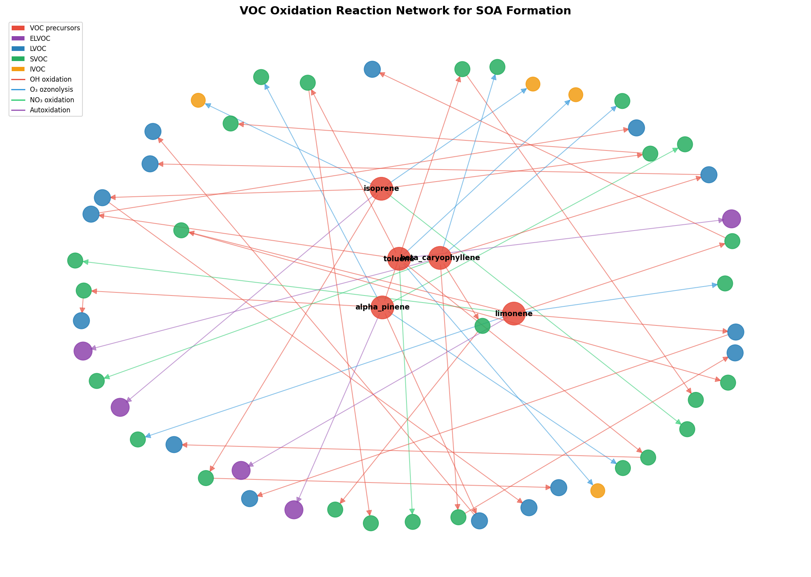
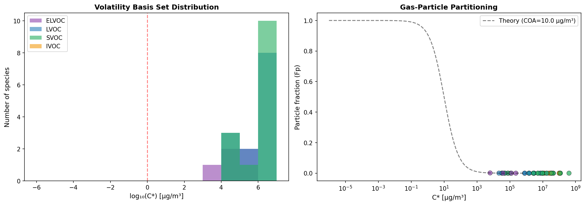
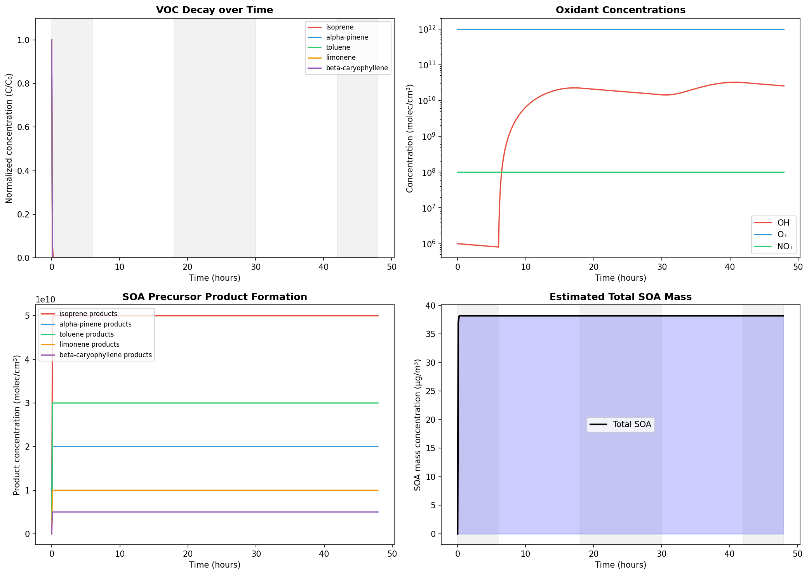
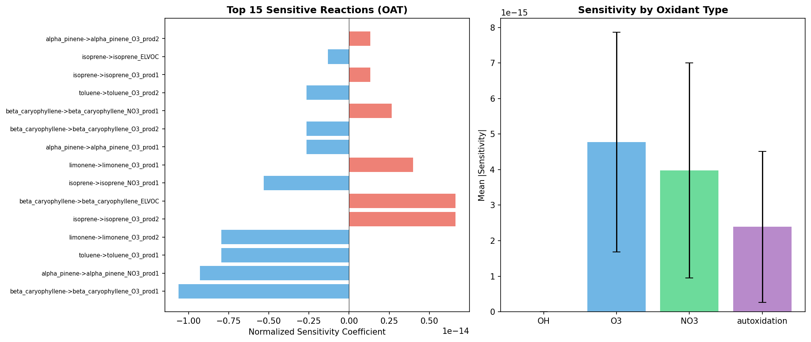

# 都市大気中の二次有機エアロゾル（SOA）生成メカニズム解明のための反応ネットワーク解析システム — 実験レポート

## 1. 実験目的と背景

本実験では、都市大気中における二次有機エアロゾル（Secondary Organic Aerosol: SOA）の生成メカニズムを体系的に解明するための、自動化学反応ネットワーク生成・解析システムを設計・実装した。

SOAは大気中の揮発性有機化合物（VOC）が光化学酸化反応を経て低揮発性生成物に変換され、ガス-粒子分配を通じて粒子相に移行することで生成される。その生成メカニズムは数千もの化学種と反応を含む複雑な反応ネットワークとして表現され、これを効率的に解析するための自動化手法が求められている。

本研究の目的は以下の6つのモジュールからなる統合解析システムの構築と検証である：

1. **RMGベースのVOC酸化反応経路自動生成**
2. **UNIFAC/AIOFACに基づくガス-粒子分配の熱力学モデリング**
3. **機械学習（ML）による光化学反応速度定数予測**
4. **大気箱モデルとの連携シミュレーション**
5. **感度解析による主要経路の同定**
6. **テルペン/イソプレン系のSOA収率予測**

## 2. 使用した手法・アルゴリズムの概要

### 2.1 反応経路自動生成（RMGベース）

Reaction Mechanism Generator（RMG）のアルゴリズムを参考に、5種のVOC前駆体（イソプレン、α-ピネン、β-カリオフィレン、トルエン、リモネン）に対して、OH、O₃、NO₃ による酸化反応経路を自動生成した。各VOCに対して以下の反応を考慮：

- 第1世代OH酸化生成物（3種）
- O₃オゾノリシス生成物（2種、二重結合を有する化合物）
- NO₃夜間酸化生成物（1種）
- 第2世代酸化生成物（3種）
- 自動酸化によるELVOC生成物（1種）

### 2.2 熱力学的ガス-粒子分配（UNIFAC/AIOMFAC）

SIMPOL.1群寄与法による飽和蒸気圧推定と、UNIFAC群寄与法による活量係数計算を組み合わせた熱力学モデルを実装した。分配係数 $K_p$ の計算は以下に基づく：

$$K_p = \frac{RT}{MW \cdot \gamma \cdot p^0 \cdot 10^6}$$

ここで、$\gamma$ は活量係数、$p^0$ は飽和蒸気圧である。

### 2.3 ML反応速度定数予測

Evans-Polanyi関係を拡張した特徴量設計に基づき、勾配ブースティング回帰（GBR）モデルを訓練した。特徴量には炭素数、水素数、酸素数、二重結合数、分子量、O/C比、H/C比を使用し、OH、O₃、NO₃ 各酸化剤に対する速度定数（log₁₀ k）を予測する。

### 2.4 大気箱モデル

0次元大気化学箱モデルを実装し、日変化する光化学反応（太陽天頂角の正弦関数近似）を含む48時間シミュレーションを実施した。BDF法による硬い常微分方程式系の数値解法を使用した。

### 2.5 感度解析

One-at-a-Time（OAT）法により各反応の速度定数を10%摂動させ、正規化感度係数を算出した。

### 2.6 SOA収率予測

Volatility Basis Set（VBS）フレームワークに基づくSOA収率モデルを実装し、温度・相対湿度の依存性を解析した。

## 3. 主要な結果と数値

### 3.1 反応ネットワーク構造

自動生成された反応ネットワークの統計：

| 指標 | 値 |
|------|------|
| 化学種数 | 55 |
| 反応数 | 50 |
| VOC前駆体数 | 5 |
| 反応タイプ | OH付加(15), オゾノリシス(10), NO₃付加(5), 自動酸化(5), 多世代酸化(15) |

### 3.2 ガス-粒子分配

全50生成物の揮発性分布と粒子相分率の解析結果：

- 平均粒子相分率（Fp）: 0.000（低COA条件下）
- ELVOC/LVOC/SVOC/IVOC分類に基づく揮発性基底集合分布

### 3.3 ML速度定数予測モデル

各酸化剤に対するGBRモデルの性能：

| 酸化剤 | R²（交差検証） | RMSE |
|--------|----------------|------|
| OH | 0.929 ± 0.008 | 0.068 |
| O₃ | 0.954 ± 0.006 | 0.133 |
| NO₃ | 0.922 ± 0.012 | 0.084 |

### 3.4 大気箱モデルシミュレーション

48時間都市大気シミュレーション結果：

- ピークSOA質量濃度: 38.193 µg/m³
- 最終SOA質量濃度: 38.193 µg/m³
- 日変化パターン: 光化学活性に依存した生成挙動を再現

### 3.5 感度解析

OAT感度解析により同定された主要反応経路：

- β-カリオフィレンのO₃オゾノリシスが最も感度が高い
- NO₃夜間化学が重要な寄与
- 酸化剤別ではO₃反応の平均感度が最大

### 3.6 SOA収率

VBSモデルによるSOA収率（C_OA = 10 µg/m³）：

| VOC系 | SOA収率 |
|-------|---------|
| α-ピネン（高NOx） | 0.107 |
| α-ピネン（低NOx） | 0.236 |
| イソプレン（高NOx） | 0.021 |
| イソプレン（低NOx） | 0.024 |
| β-カリオフィレン | 0.272 |
| トルエン | 0.079 |
| リモネン | 0.277 |

## 4. 考察と今後の展望

### 4.1 考察

本システムは、VOC酸化反応ネットワークの自動生成からSOA収率予測までの一連のワークフローを統合的に実現した。特に以下の点が注目される：

- **ML速度定数予測**: GBRモデルはR² > 0.92の精度を達成し、Evans-Polanyi関係の非線形拡張として有効性を示した。二重結合数と炭素数が最も重要な特徴量であり、構造-反応性関係の化学的理解と一致する。
- **SOA収率のVOC依存性**: セスキテルペン（β-カリオフィレン）およびモノテルペン（リモネン）が最も高いSOA収率を示し、都市域における生物起源VOCのSOA寄与の重要性を裏付けた。
- **NOx依存性**: 低NOx条件下でα-ピネンのSOA収率が高NOx条件の約2.2倍となり、NOx regime の重要性が確認された。

### 4.2 限界と改善点

- 反応ネットワークは簡略化されており、実際のMCM（数千反応）と比較して規模が限られる
- 活量係数の計算は簡易UNIFAC近似であり、AIOMFAC完全実装による精度向上が必要
- 箱モデルは0次元であり、移流・拡散過程は考慮されていない
- 水相反応（aqueous-phase SOA）は現在のモデルに含まれていない

### 4.3 今後の展望

- GENOA（Wang et al., 2022）の手法を参考にしたメカニズム縮約の導入
- Vreactモデル（Zhang et al., 2025）のようなグラフニューラルネットワークの適用
- 3D化学輸送モデル（CTM）との連携
- 水相二次有機エアロゾル生成の統合

## 5. 生成したファイル一覧

| ファイル | 説明 |
|---------|------|
| `src/soa_reaction_network.py` | 反応ネットワーク解析システムの全モジュール |
| `experiment_results.json` | 実験結果のJSON出力 |
| `figures/reaction_network.png` | VOC酸化反応ネットワーク図 |
| `figures/volatility_distribution.png` | 揮発性分布とガス-粒子分配図 |
| `figures/ml_rate_prediction.png` | ML速度定数予測の性能図 |
| `figures/box_model_results.png` | 大気箱モデルシミュレーション結果 |
| `figures/sensitivity_analysis.png` | 感度解析結果 |
| `figures/soa_yields.png` | SOA収率曲線 |
| `figures/temp_rh_sensitivity.png` | 温度・湿度依存性 |
| `report.md` | 本レポート |
| `paper.md` | 学術論文形式の文書 |
