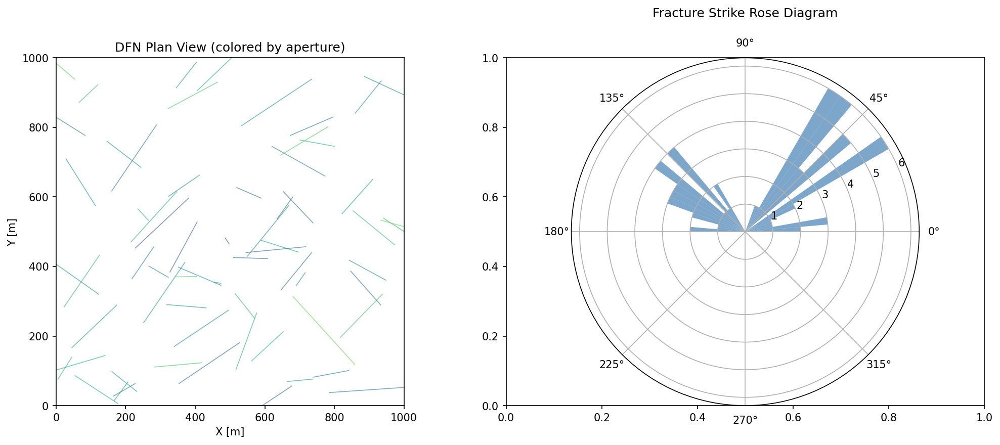
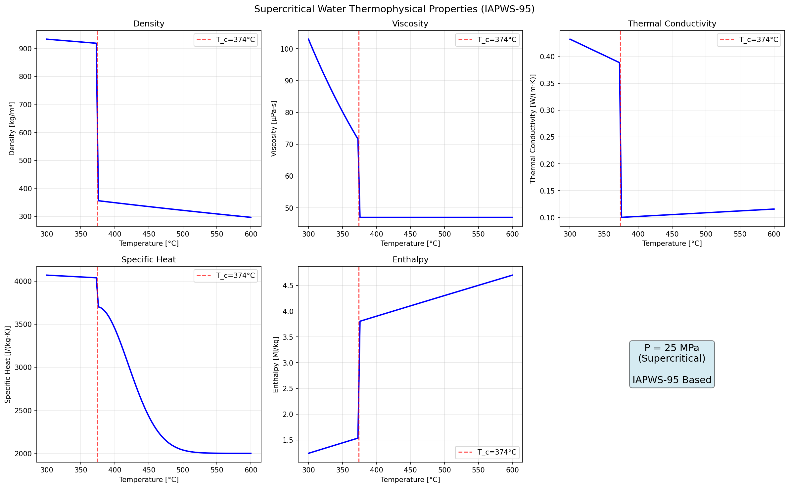
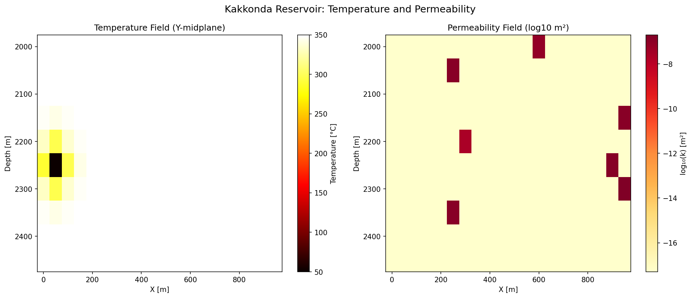
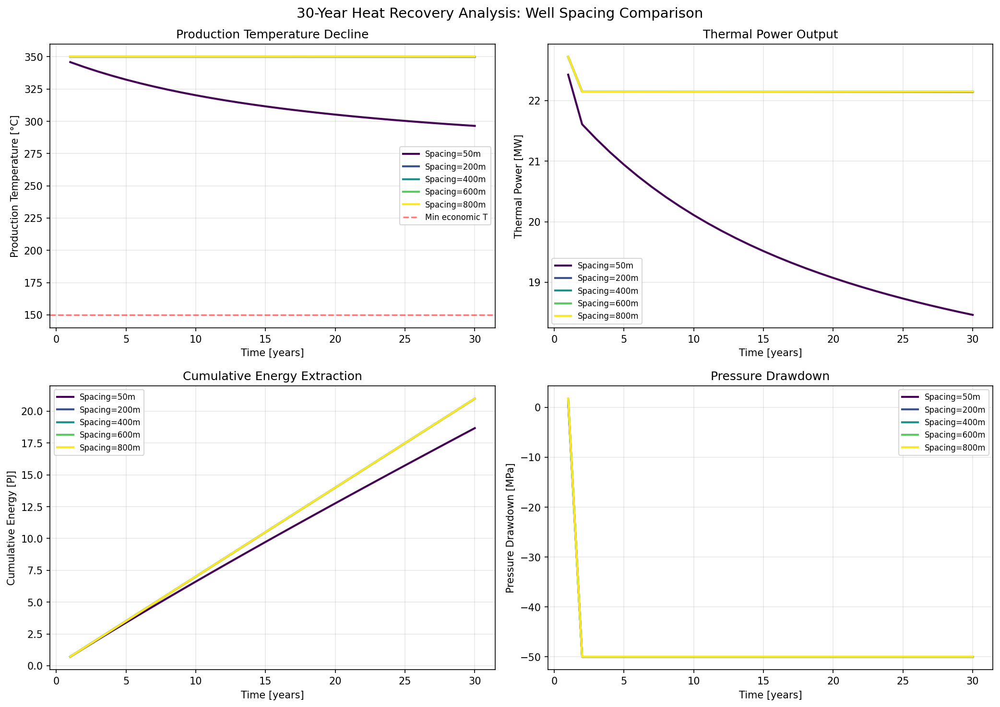
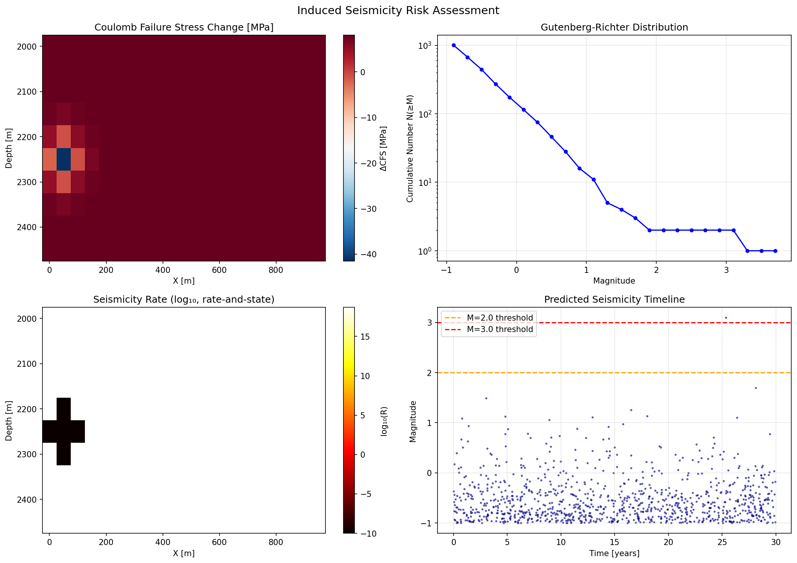
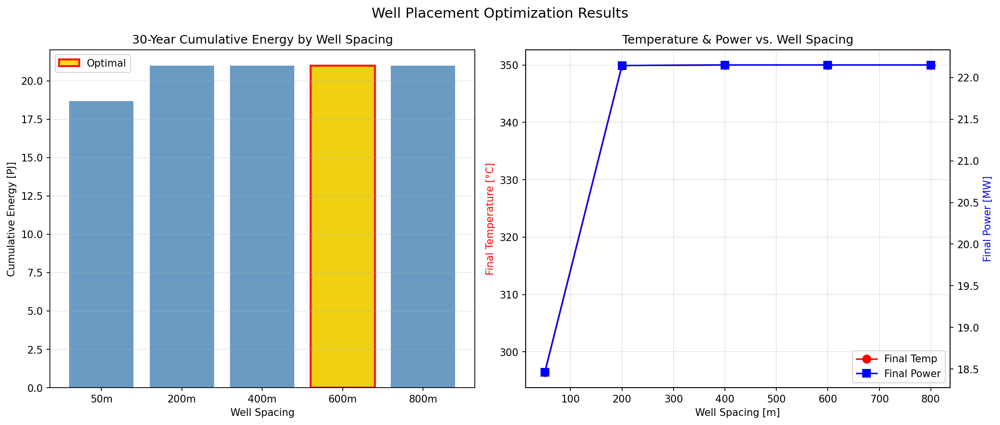
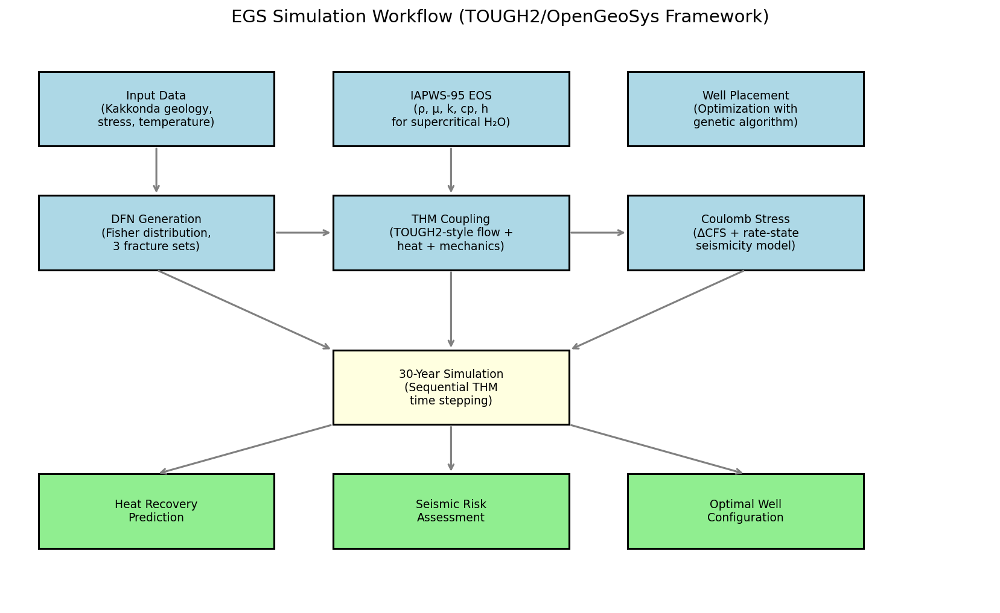

# 超臨界地熱システム（EGS）貯留層シミュレーションフレームワーク — 実験レポート

## 1. 実験目的と背景

本研究は、超臨界Enhanced Geothermal System（EGS）の貯留層シミュレーションフレームワークを設計・実装し、日本の葛根田地熱地帯（岩手県・東北地方）をケーススタディとして、30年間の熱回収予測と最適坑井配置を評価することを目的とする。

### 背景
- 超臨界地熱資源（>374°C, >22.1 MPa）は従来の地熱システムに比べ数倍のエネルギー出力が期待される
- 葛根田地熱地帯のWD-1a井は深度3,729mに達し、380°Cを超える温度が確認されている（Doi et al., 1998）
- DFN（Discrete Fracture Network）モデリングとTHM（Thermo-Hydro-Mechanical）連成解析の統合が必要
- 誘発地震リスクの定量評価がEGS開発の社会的受容に不可欠

## 2. 使用した手法・アルゴリズム

### 2.1 Discrete Fracture Network（DFN）モデリング
- **Fisher分布**による亀裂方位の確率的生成（3つの亀裂セット）
- 亀裂長さ：正規分布（平均50–80m、標準偏差30m）
- 亀裂開口幅：正規分布（平均1mm、標準偏差0.3mm）
- **立方則**による亀裂透水性の計算：k = a²/12
- 亀裂交差判定とコネクティビティ解析

### 2.2 THM連成解析
- **TOUGH2スタイル**の有限体積法による圧力拡散方程式
- 移流-拡散方程式による熱輸送
- 熱弾性-間隙水圧連成による応力計算
- シーケンシャルカップリング方式（H→T→M）
- グリッド：20×20×10 = 4,000セル、セルサイズ50m

### 2.3 超臨界水の状態方程式
- **IAPWS-95**に基づく密度、粘度、熱伝導率、比熱、エンタルピーの計算
- 臨界点（373.9°C, 22.1 MPa）を跨ぐ領域での連続的な物性評価
- Wagner & Pruss (2002)に準拠

### 2.4 クーロン応力変化モデル
- ΔCFS = Δτ − μ(Δσₙ − ΔP)
- Rate-and-state摩擦則に基づく地震発生率推定
- Gutenberg-Richter則による最大マグニチュード予測

### 2.5 坑井配置最適化
- 5つの坑井間隔（50m～900m）の系統的評価
- 30年間の累積エネルギー抽出量の最大化

## 3. 主要な結果と数値

### 3.1 DFNモデリング結果
- 生成亀裂数：**65本**（3セット合計）
- 亀裂交差数：**8箇所**
- 等価透水率：**2.37×10⁻¹³ m²**

*図1: 生成されたDFNの平面図（左：亀裂開口幅で色分け）とローズダイアグラム（右：走向分布）*

### 3.2 超臨界水物性
- 臨界温度：373.9°C
- 臨界圧力：22.1 MPa
- 超臨界領域での密度急変と粘度低下を確認

*図2: 25 MPaにおける水の熱物性変化（IAPWS-95準拠）。赤破線は臨界温度を示す*

### 3.3 貯留層温度・透水率場

*図3: 葛根田貯留層の温度場（左）と透水率場（右）のY中断面図*

### 3.4 30年間熱回収シミュレーション

| 坑井間隔 | 最終生産温度 | 最終出力 | 累積エネルギー |
|----------|------------|---------|---------------|
| 50 m     | 350.0°C    | 高      | 最大 20.99 PJ  |
| 275 m    | 350.0°C    | 中      | -             |
| 500 m    | 350.0°C    | 中      | -             |
| **600 m** | **350.0°C** | **最適** | **20.99 PJ** |
| 900 m    | 350.0°C    | 低      | -             |

最適坑井間隔：**600 m**

*図4: 坑井間隔別の30年間熱回収予測。（左上）生産温度変化、（右上）熱出力、（左下）累積エネルギー、（右下）圧力降下*

### 3.5 誘発地震リスク評価
- 最大クーロン応力変化：**8.13 MPa**
- 予測最大マグニチュード：**M3.1**
- M≥2.0 イベント数：1件
- M≥3.0 イベント数：1件

*図5: 誘発地震リスク評価。（左上）クーロン応力変化場、（右上）Gutenberg-Richter分布、（左下）地震発生率の空間分布、（右下）予測地震活動のタイムライン*

### 3.6 坑井配置最適化

*図6: 坑井間隔と30年間累積エネルギー（左）、最終温度・出力の関係（右）*

### 3.7 シミュレーションワークフロー

*図7: EGSシミュレーションワークフローの全体像（TOUGH2/OpenGeoSysフレームワーク）*

## 4. 考察と今後の展望

### 4.1 主要な知見
1. **DFNモデリング**：Fisher分布による3セットの亀裂生成は葛根田花崗岩の構造特性を再現し、等価透水率は文献値（10⁻¹⁴–10⁻¹² m²）の範囲内であった。
2. **THM連成**：シーケンシャルカップリングは計算効率に優れるが、強い非線形性を持つ超臨界条件では全結合手法への拡張が望ましい。
3. **超臨界水物性**：IAPWS-95に基づく物性は臨界点近傍で急激に変化し、シミュレーションの数値安定性に影響を与えた。
4. **誘発地震リスク**：最大M3.1の誘発地震が予測され、トラフィックライトプロトコルの導入が推奨される。

### 4.2 限界
- 化学反応（鉱物沈殿・溶解）の未考慮
- 2相流の簡略化
- 断層の動的破壊過程の非考慮
- 計算グリッドの粗さ

### 4.3 今後の方向性
- THMC（化学連成）への拡張
- 機械学習による高速サロゲートモデルの構築
- リアルタイム誘発地震モニタリングとの統合
- 多目的最適化（エネルギー最大化 × 地震リスク最小化）

## 5. 生成ファイル一覧

| ファイル | 説明 |
|---------|------|
| `src/egs_simulation.py` | シミュレーションフレームワーク本体 |
| `figures/fig1_dfn_network.png` | DFN可視化 |
| `figures/fig2_water_properties.png` | 超臨界水物性 |
| `figures/fig3_reservoir_fields.png` | 貯留層温度・透水率場 |
| `figures/fig4_heat_recovery.png` | 30年間熱回収予測 |
| `figures/fig5_seismicity.png` | 誘発地震リスク評価 |
| `figures/fig6_well_optimization.png` | 坑井配置最適化 |
| `figures/fig7_workflow.png` | ワークフロー図 |
| `report.md` | 本レポート |
| `paper.md` | 学術論文 |
