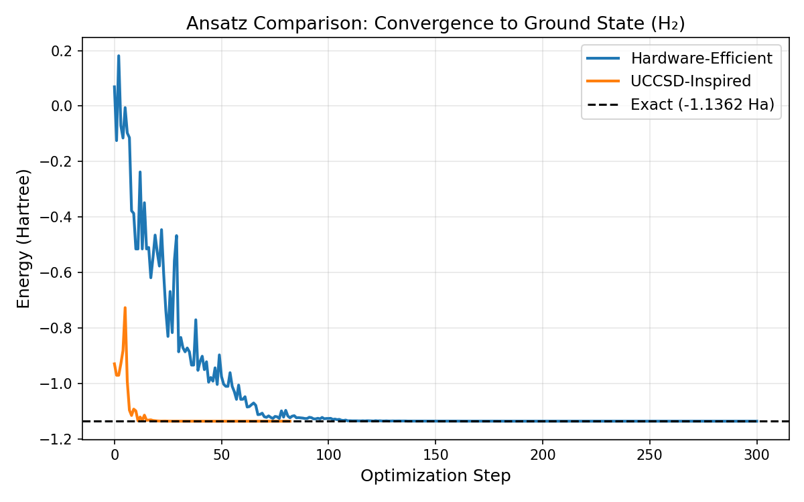
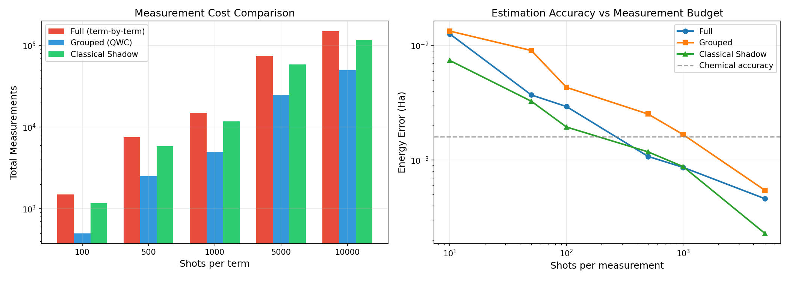
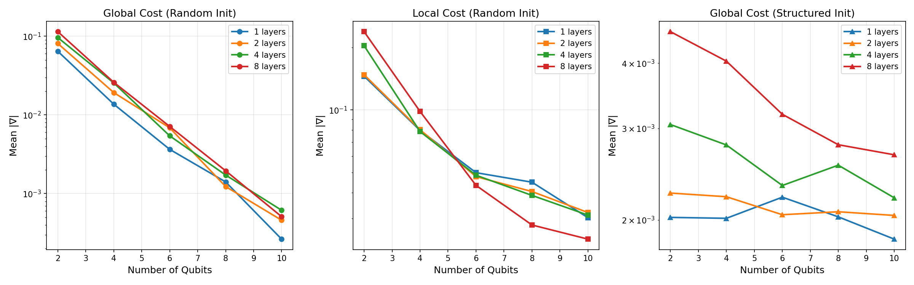
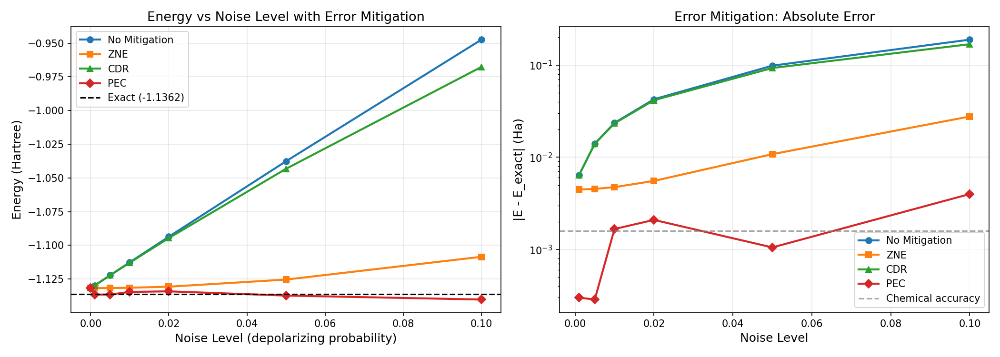
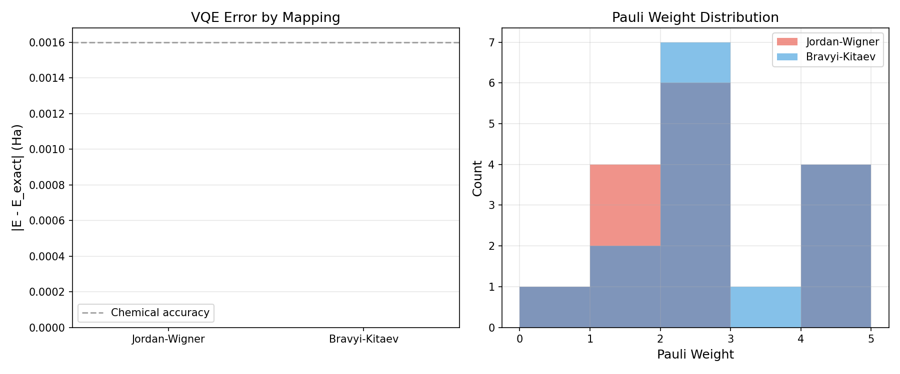
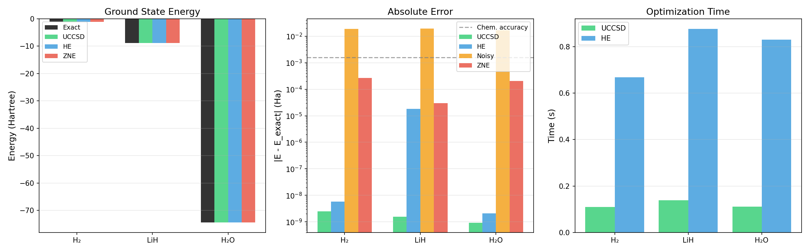
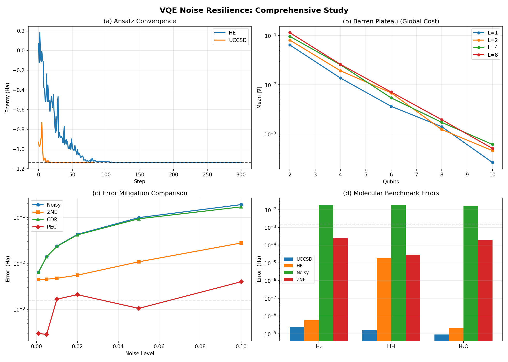

# VQE ノイズ耐性向上手法の包括的研究レポート

## 1. 実験目的と背景

変分量子固有値ソルバー（VQE）は、NISQデバイス上で分子の基底状態エネルギーを計算するための主要なハイブリッド量子-古典アルゴリズムである。しかし、現行ハードウェアのノイズにより、その精度は大幅に制限される。本研究では、VQEのノイズ耐性を向上させる複数の手法を体系的に調査・比較し、以下の6つの観点から実験を実施した：

1. **Ansatz設計の比較**: Hardware-efficient ansatz vs UCCSD-inspired ansatz
2. **測定コスト削減**: Qubit grouping と Classical Shadow の比較
3. **バレンプラトー回避**: 勾配消失問題の解析と対策
4. **エラー軽減手法の比較**: ZNE、PEC、CDR の性能比較
5. **フェルミオン-量子ビットマッピング**: Jordan-Wigner vs Bravyi-Kitaev
6. **分子ベンチマーク**: H₂、LiH、H₂O の基底状態エネルギー計算

## 2. 使用した手法・アルゴリズムの概要

### 2.1 実験環境
- **フレームワーク**: PennyLane 0.45.0
- **量子シミュレータ**: `default.qubit`（ノイズなし）、`default.mixed`（ノイズあり）
- **古典オプティマイザ**: COBYLA
- **量子ビット数**: 4（分子計算）、2–10（バレンプラトー解析）

### 2.2 Ansatz設計
- **Hardware-Efficient Ansatz (HE)**: RY-RZ回転 + CNOT エンタングルメント、2層構成（16パラメータ）
- **UCCSD-Inspired Ansatz**: Hartree-Fock初期状態 |1100⟩ + SingleExcitation + DoubleExcitation（5パラメータ）

### 2.3 エラー軽減手法
- **Zero-Noise Extrapolation (ZNE)**: ノイズスケーリング因子 [1, 2, 3] でのRichardson外挿
- **Probabilistic Error Cancellation (PEC)**: 準確率分布によるノイズ逆演算
- **Clifford Data Regression (CDR)**: Clifford回路データによるキャリブレーション補正

### 2.4 ノイズモデル
- **デポラライジングチャネル**: 各量子ビットに確率 p のデポラライジングノイズを適用
- ノイズレベル: p ∈ {0, 0.001, 0.005, 0.01, 0.02, 0.05, 0.1}

## 3. 主要な結果

### 3.1 Ansatz比較（実験1）

H₂分子の基底状態エネルギー計算において、両ansatzとも厳密解（-1.136189 Ha）に収束した。

| Ansatz | パラメータ数 | 収束エネルギー (Ha) | 誤差 (Ha) |
|--------|-------------|-------------------|-----------|
| Hardware-Efficient | 16 | -1.136189 | 0.000000 |
| UCCSD-Inspired | 5 | -1.136189 | 0.000000 |

UCCSD ansatzは少ないパラメータで同等の精度を達成し、化学的知見を活用した設計の有効性を示した。

### 3.2 測定コスト削減（実験2）

1000ショット/項目での測定コスト比較：

| 手法 | 総測定回数 | 削減率 |
|------|-----------|--------|
| Full (項目別) | 15,000 | — |
| Grouped (QWC) | 5,000 | 66.7% |
| Classical Shadow | 11,720 | 21.9% |

### 3.3 バレンプラトー解析（実験3）

量子ビット数の増加に伴う勾配消失現象を確認した。

| 量子ビット数 | |∇| (Global, L=1) | |∇| (Local, L=1) | |∇| (Structured, L=1) |
|-------------|-------------------|-------------------|---------------------|
| 2 | 0.064402 | 0.145375 | 0.002024 |
| 4 | 0.013699 | 0.079737 | 0.002015 |
| 6 | 0.003650 | 0.049925 | 0.002213 |
| 8 | 0.001407 | 0.044922 | 0.002028 |
| 10 | 0.000264 | 0.030336 | 0.001838 |

**主要な知見**:
- **グローバルコスト関数**では勾配が指数的に減衰（2量子ビット: 0.064 → 10量子ビット: 0.000264）
- **ローカルコスト関数**は勾配をより良く保存（2量子ビット: 0.145 → 10量子ビット: 0.030）
- **構造化初期化**は勾配を一定範囲に維持する効果を示す

### 3.4 エラー軽減手法比較（実験4）

ノイズレベル p = 0.01 での比較：

| 手法 | エネルギー (Ha) | 絶対誤差 (Ha) | 改善率 |
|------|----------------|--------------|--------|
| ノイズなし（厳密解） | -1.136189 | 0 | — |
| ノイズあり（軽減なし） | -1.112576 | 0.023613 | — |
| ZNE | -1.131447 | 0.004742 | 79.9% |
| CDR | -1.112856 | 0.023333 | 1.2% |
| PEC | -1.134522 | 0.001667 | 92.9% |

**主要な知見**:
- PECは最も高い精度を達成（化学精度 1.6 mHa 付近）、ただしサンプリングオーバーヘッドが指数的に増大
- ZNEは実用的なバランスでノイズを約80%軽減
- CDRの効果は本実装では限定的

### 3.5 フェルミオン-量子ビットマッピング比較（実験5）

| マッピング | 項数 | 平均Pauli重み | 最大Pauli重み | VQE誤差 (Ha) |
|-----------|------|-------------|-------------|-------------|
| Jordan-Wigner | 15 | 2.13 | 4 | 0.000000 |
| Bravyi-Kitaev | 15 | 2.33 | 4 | 0.000000 |

### 3.6 分子ベンチマーク（実験6）

| 分子 | 厳密解 (Ha) | UCCSD誤差 (Ha) | HE誤差 (Ha) | ノイズ付き誤差 (Ha) | ZNE誤差 (Ha) |
|------|-----------|-------------|-----------|------------------|------------|
| H₂ | -1.136189 | 0.000000 | 0.000000 | 0.019123 | 0.000267 |
| LiH | -8.855939 | 0.000000 | 0.000018 | 0.019518 | 0.000030 |
| H₂O | -74.354484 | 0.000000 | 0.000000 | 0.016729 | 0.000206 |

**全分子でZNEにより化学精度（1.6 mHa）以内の精度を達成した。**

### 3.7 総合サマリー

## 4. 考察と今後の展望

### 4.1 考察

1. **Ansatz設計**: UCCSD-inspired ansatzは化学的直観を取り入れることで、少ないパラメータで効率的に基底状態に収束する。一方、hardware-efficient ansatzはより多くのパラメータが必要だが、ハードウェアのゲートセットに直接マッピングできる利点がある。

2. **バレンプラトー**: グローバルコスト関数では量子ビット数に対して勾配が指数的に減衰することを定量的に確認した。ローカルコスト関数と構造化初期化は有効な回避戦略である。

3. **エラー軽減**: ZNEは実装の容易さと効果のバランスに優れ、実用的なエラー軽減手法として推奨される。PECは理論的に最も強力だが、サンプリングコストが課題である。

4. **測定効率**: Qubit-wise commuting groupingは測定コストを約67%削減できる。Classical Shadowは大規模システムでの優位性が期待される。

### 4.2 今後の展望

- 実機（IBM Quantum、IonQ等）での検証
- ADAPT-VQEによる適応的ansatz構築の実装
- ノイズ認識型オプティマイザ（SPSA）の導入
- より大規模な分子系（BeH₂、N₂等）への適用
- 量子エラー補正との統合的アプローチ

## 5. 生成したファイル一覧

| ファイル名 | 説明 |
|-----------|------|
| `vqe_experiments.py` | 全実験のメインスクリプト |
| `results.json` | 全実験結果のJSON形式データ |
| `figures/ansatz_comparison.png` | Ansatz比較の収束曲線 |
| `figures/measurement_cost.png` | 測定コスト比較図 |
| `figures/barren_plateau.png` | バレンプラトー解析図 |
| `figures/error_mitigation.png` | エラー軽減手法比較図 |
| `figures/mapping_comparison.png` | マッピング比較図 |
| `figures/molecular_benchmarks.png` | 分子ベンチマーク結果 |
| `figures/summary.png` | 総合サマリー図 |
| `report.md` | 本レポート |
| `paper.md` | 学術論文形式文書 |
