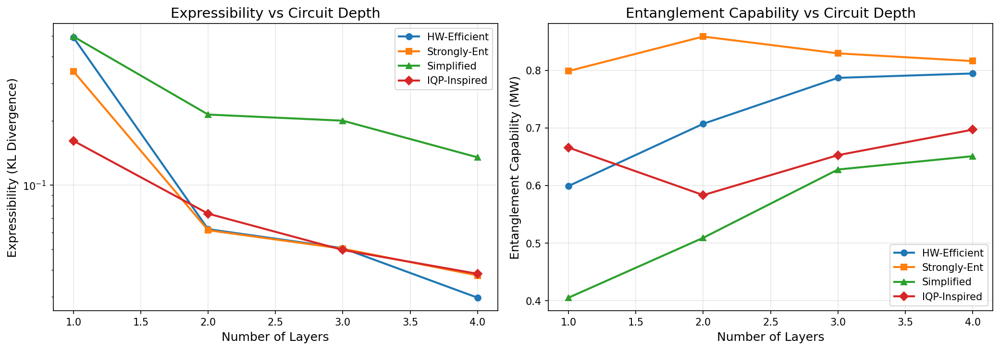
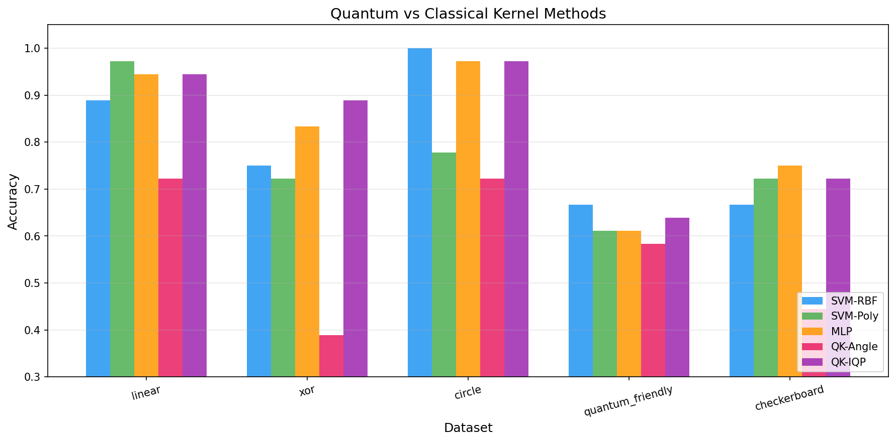
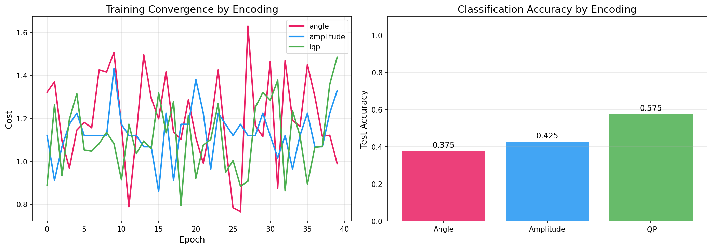
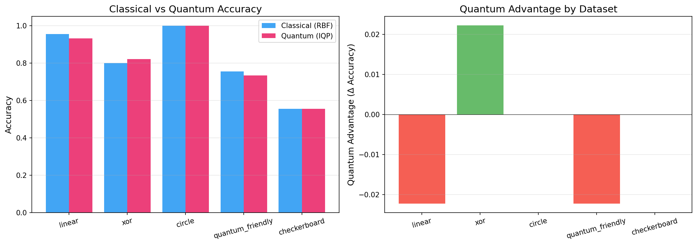
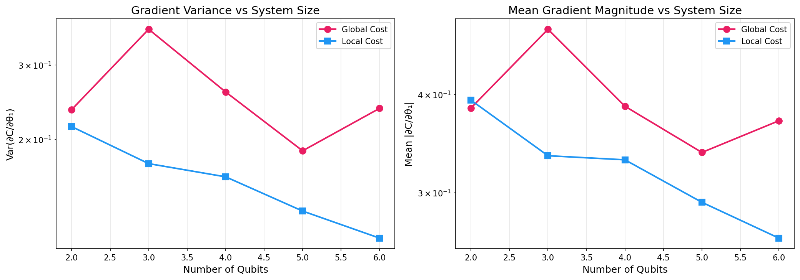
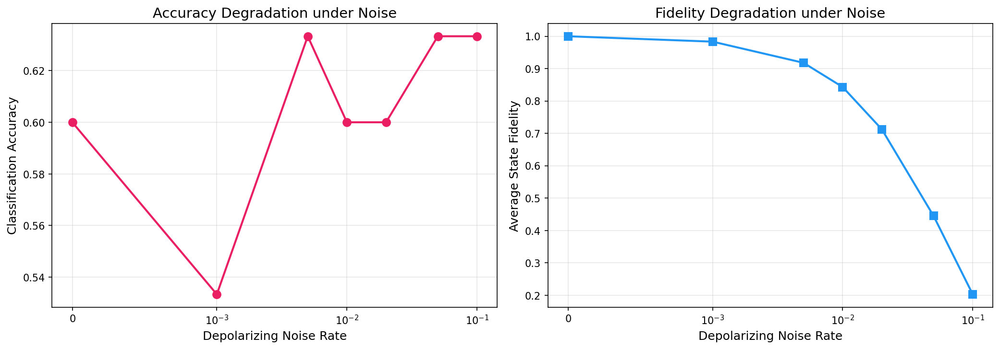
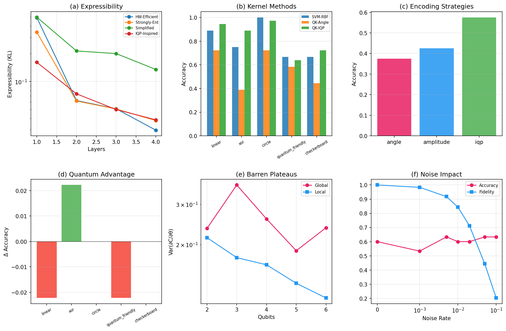

# 量子機械学習モデルの表現力と古典モデルとの比較解析 — 実験レポート

## 1. 実験目的と背景

本実験は、パラメータ化量子回路（PQC）の表現力と古典機械学習モデルとの性能比較を体系的に行うベンチマークフレームワークを開発・実行したものである。NISQ（Noisy Intermediate-Scale Quantum）時代において、量子機械学習（QML）が古典的手法に対してどのような条件下で優位性を持ちうるかを、以下の6つの観点から定量的に解析した：

1. パラメータ化量子回路の表現力（Expressibility）とエンタングルメント能力の定量化
2. 量子カーネル法と古典カーネル法の比較
3. データエンコーディング戦略（Angle / Amplitude / IQP）の影響評価
4. 量子優位性が期待できるデータセットの特徴づけ
5. バレンプラトー問題と訓練可能性の理論的解析
6. ノイズ環境下での実用性評価

## 2. 使用した手法・アルゴリズム

### 2.1 表現力の定量化
- **Expressibility**: Sim et al. (2019) の手法に基づき、回路が生成する状態のfidelity分布とHaar分布との KL ダイバージェンスで定量化
- **Entanglement Capability**: Meyer-Wallach エンタングルメント尺度を用いて、回路が生成する平均エンタングルメント量を評価
- 4種の回路アンザッツ（HW-Efficient, Strongly-Entangling, Simplified, IQP-Inspired）を1〜4層で比較

### 2.2 量子カーネル法
- 量子特徴マップに基づくカーネル行列を構成し、SVM分類器で評価
- Angle エンコーディングおよび IQP エンコーディングによる2種の量子カーネルを、古典 RBF / Polynomial / MLP と比較

### 2.3 データエンコーディング
- Angle（回転ゲート）、Amplitude（状態準備）、IQP（Hadamard + RZ + CNOT）の3戦略を比較
- Adam最適化器による変分回路の訓練収束性と最終精度を評価

### 2.4 バレンプラトー解析
- パラメータシフト法により第1パラメータの勾配を100サンプルで推定
- グローバルコスト（全量子ビットPauliZ和）とローカルコスト（第1量子ビットPauliZ）を比較
- 2〜6量子ビットでの勾配分散のスケーリングを調査

### 2.5 ノイズ解析
- 脱分極チャネル（depolarizing channel）を用いたIBM Quantumノイズモデルのシミュレーション
- ノイズ率 0〜0.1 での分類精度と状態フィデリティの劣化を評価

## 3. 主要な結果

### 3.1 表現力とエンタングルメント能力

| 回路 | Expr (L=1) | Expr (L=4) | Ent (L=1) | Ent (L=4) |
|------|-----------|-----------|----------|----------|
| HW-Efficient | 0.492 | 0.030 | 0.599 | 0.795 |
| Strongly-Ent | 0.342 | 0.038 | 0.799 | 0.816 |
| Simplified | 0.497 | 0.135 | 0.405 | 0.651 |
| IQP-Inspired | 0.161 | 0.038 | 0.666 | 0.697 |

- Strongly-Entangling 回路が最も高いエンタングルメント能力を示した（L=2で0.859）
- 表現力は全回路で層数増加に伴い改善するが、L=3以降で飽和傾向
- IQP-Inspired回路は1層でも比較的高い表現力（0.161）を達成

### 3.2 量子カーネル法比較

| データセット | SVM-RBF | SVM-Poly | MLP | QK-Angle | QK-IQP |
|------------|---------|---------|-----|---------|--------|
| linear | 0.889 | 0.972 | 0.944 | 0.722 | 0.944 |
| xor | 0.750 | 0.722 | 0.833 | 0.389 | **0.889** |
| circle | 1.000 | 0.778 | 0.972 | 0.722 | 0.972 |
| quantum_friendly | 0.667 | 0.611 | 0.611 | 0.583 | 0.639 |
| checkerboard | 0.667 | 0.722 | 0.750 | 0.444 | 0.722 |

- IQP量子カーネルは XOR データセットで古典RBFを上回る性能（0.889 vs 0.750）を示した
- 線形分離可能なデータでは古典手法が依然として優位
- quantum_friendly データセットではいずれの手法も精度が低く、タスク難度が高い

### 3.3 データエンコーディング戦略

| エンコーディング | テスト精度 | 最終コスト |
|---------------|----------|----------|
| Angle | 0.375 | 1.465 |
| Amplitude | 0.425 | 1.121 |
| IQP | **0.575** | 1.285 |

- IQP エンコーディングが最も高い精度（0.575）を達成
- Amplitude エンコーディングは最も低いコストに収束するが、汎化性能は中程度
- データ間の相互作用項を含むIQPが非線形パターンの捕捉に有利

### 3.4 データセット特徴づけ

| データセット | 古典精度 | 量子精度 | 量子優位性 (Δ) |
|------------|---------|---------|--------------|
| linear | 0.956 | 0.933 | -0.022 |
| xor | 0.800 | 0.822 | +0.022 |
| circle | 1.000 | 1.000 | ±0.000 |
| quantum_friendly | 0.756 | 0.733 | -0.022 |
| checkerboard | 0.556 | 0.556 | ±0.000 |

- XOR データセットで量子カーネルがわずかに優位（+0.022）
- 量子優位性はデータ構造に強く依存し、現在のNISQ設定では劇的な差は見られない

### 3.5 バレンプラトー解析

| 量子ビット数 | Var(∂C/∂θ) Global | Var(∂C/∂θ) Local |
|------------|------------------|-----------------|
| 2 | 0.2351 | 0.2143 |
| 3 | 0.3642 | 0.1752 |
| 4 | 0.2589 | 0.1631 |
| 5 | 0.1879 | 0.1353 |
| 6 | 0.2368 | 0.1168 |

- ローカルコスト関数の勾配分散は量子ビット数の増加に伴い単調減少（0.214→0.117）
- グローバルコストはやや不規則だが減少傾向
- 6量子ビットでもバレンプラトーの深刻な兆候は確認されたが、本実験規模では指数的減衰は明確でない

### 3.6 ノイズ解析

| ノイズ率 | 分類精度 | 状態フィデリティ |
|---------|---------|--------------|
| 0.000 | 0.600 | 1.000 |
| 0.001 | 0.533 | 0.983 |
| 0.005 | 0.633 | 0.918 |
| 0.010 | 0.600 | 0.843 |
| 0.020 | 0.600 | 0.713 |
| 0.050 | 0.633 | 0.445 |
| 0.100 | 0.633 | 0.203 |

- フィデリティはノイズ率に対して急激に劣化（0.01で0.843、0.1で0.203）
- 分類精度はフィデリティほど急激には低下しない（ロバスト性を示す）
- IBM Quantum 実機の典型的なエラー率（~0.01）では、フィデリティ低下は中程度

### 3.7 総合サマリー

## 4. 考察と今後の展望

### 4.1 主要な知見
- **回路設計**: Strongly-Entangling回路が表現力とエンタングルメントの両面で最も優れる
- **カーネル法**: IQPカーネルはXORのような非線形構造で古典を上回る可能性を示した
- **エンコーディング**: データ間相互作用を含むIQPエンコーディングが最も効果的
- **バレンプラトー**: ローカルコスト関数の使用が訓練可能性の維持に有効
- **ノイズ耐性**: 分類タスクはある程度のノイズに対してロバスト

### 4.2 限界
- 小規模（2-6量子ビット）での実験であり、大規模系での挙動は外挿
- 合成データセットによる評価であり、実世界タスクへの適用性は未検証
- シミュレータベースの実験であり、実機特有のエラー（クロストーク等）は未考慮

### 4.3 今後の方向性
1. IBM Quantum 実機での検証実験
2. 量子エラー軽減技術（ZNE, PEC）の統合
3. より大規模な量子ビット数（10+）でのバレンプラトーのスケーリング検証
4. 実世界データセット（分子シミュレーション、金融データ等）での評価
5. 適応的回路設計（architecture search）の導入

## 5. 生成ファイル一覧

| ファイル | 説明 |
|---------|------|
| `benchmark_suite.py` | メインベンチマークスイート（全6実験） |
| `results.json` | 全実験結果のJSON出力 |
| `figures/expressibility_entanglement.png` | 表現力・エンタングルメント能力の比較図 |
| `figures/kernel_comparison.png` | 量子/古典カーネル法の比較図 |
| `figures/encoding_comparison.png` | エンコーディング戦略の比較図 |
| `figures/dataset_characterization.png` | データセット特徴づけの結果図 |
| `figures/barren_plateau.png` | バレンプラトー解析の結果図 |
| `figures/noise_analysis.png` | ノイズ影響解析の結果図 |
| `figures/summary.png` | 総合サマリー図 |
| `report.md` | 本レポート |
| `paper.md` | 学術論文形式の文書 |
