# 量子インターネットネットワークプロトコルシミュレーション — 実験レポート

## 1. 実験目的と背景

本実験は、量子インターネットの実現に向けた主要プロトコルの性能評価と設計指針の確立を目的とする。具体的には以下の6つの要素について、NetSquid/SimulaQronの設計思想に基づく離散イベントシミュレーションフレームワークを構築し、定量的な評価を行った：

1. **BB84/E91プロトコルの有限鍵長解析** — 実用的な信号数における安全鍵レートの評価
2. **量子リピータのメモリ要件と性能見積もり** — 長距離量子通信に必要なハードウェア仕様の決定
3. **エンタングルメント蒸留プロトコルの効率評価** — BBPSSW/DEJMPSプロトコルの忠実度改善と資源コスト
4. **ネットワークルーティングアルゴリズム** — 量子ネットワークにおける最適パス選択
5. **デコヒーレンスとチャネルロスの影響シミュレーション** — 物理的制約下での量子通信性能
6. **東京QKDネットワーク規模のケーススタディ** — 実在都市ネットワークでの総合評価

### 先行研究の位置づけ

本研究は、Lim et al. (2014) の有限鍵長セキュリティ解析、Azuma et al. (2023) の量子リピータ包括的レビュー、Coopmans et al. (2021) のNetSquidシミュレータ、Sasaki et al. (2011) の東京QKDネットワーク実証実験を基盤として、これらの知見を統合したネットワークレベルの性能評価を実施した。

---

## 2. 使用した手法・アルゴリズムの概要

### 2.1 BB84有限鍵長解析

Shor-Preskill安全性証明に基づき、デコイ状態法を用いた有限鍵レート計算を実装した：

$$R = \frac{1}{N}\left[s_{Z,1}(1 - h(\phi_X)) - \lambda_{\text{EC}} - \Delta\right]$$

ここで $N$ は総信号数、$s_{Z,1}$ は単一光子イベント数、$h(\cdot)$ は二値エントロピー関数、$\phi_X$ はX基底のphase error rate、$\lambda_{\text{EC}}$ は誤り訂正リーク、$\Delta$ は有限鍵補正項である。

### 2.2 E91有限鍵長解析

CHSH不等式に基づくエンタングルメントベースQKDの有限鍵解析を実装。CHSH パラメータ $S = 2\sqrt{2}(1-2e)$ を用いた安全性評価を行った。

### 2.3 量子リピータ性能モデル

ネスト型エンタングルメントスワッピングプロトコルを木構造で解析。メモリコヒーレンス時間による待機時間制約とデコヒーレンスの影響を定量化した。

### 2.4 エンタングルメント蒸留

BBPSSWプロトコル（Bennett et al. 1996）とDEJMPSプロトコル（Deutsch et al. 1996）の両方を実装。Werner状態の忠実度改善を多ラウンド蒸留で評価した。

### 2.5 量子ルーティング

修正Dijkstraアルゴリズムを3つのメトリック（忠実度最大化、成功確率最大化、距離最小化）で実装。Yen'sアルゴリズムによるk-最短路探索も行った。

### 2.6 デコヒーレンス・チャネルロスモデル

振幅減衰（T1）、位相減衰（T2）、ゲートエラーの複合モデルを構築。PLOB限界との比較を含む。

---

## 3. 主要な結果と数値

### 3.1 BB84/E91有限鍵長解析

| 距離 (km) | BB84鍵レート (bits/pulse) | E91鍵レート (bits/pulse) | BB84 QBER |
|-----------|--------------------------|--------------------------|-----------|
| 10        | 7.12×10⁻³               | 1.21×10⁻³               | 0.016     |
| 50        | 1.08×10⁻³               | 2.48×10⁻⁵               | 0.070     |
| 100       | 9.22×10⁻⁵               | ~0                       | 0.268     |

BB84は100km以上でも鍵生成可能だが、E91は両端での検出が必要なためより短距離で性能が低下する。有限鍵効果は $N < 10^8$ で顕著となる。

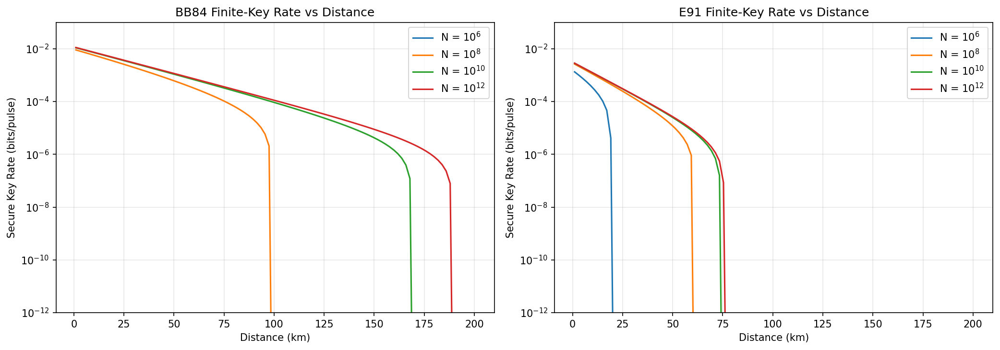

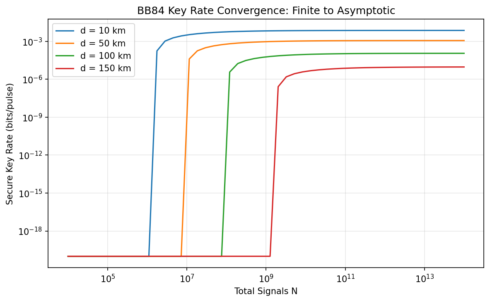

### 3.2 量子リピータ性能

| 距離 (km) | エンタングルメントレート (Hz) | 忠実度 | メモリ要件 (ms) | ノード当たりQubits |
|-----------|------------------------------|--------|----------------|-------------------|
| 100       | 710                          | 0.649  | 1.4            | 22                |
| 500       | 22.5                         | 0.400  | 44.4           | 2098              |
| 1000      | 1.12                         | ~0     | 888.9          | 44,158            |

100kmでは現行技術で実現可能だが、500km以上ではメモリコヒーレンス時間とqubit数の両面で技術的課題が大きい。

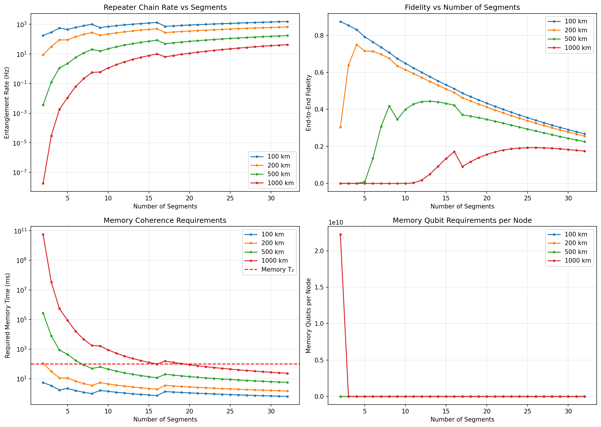

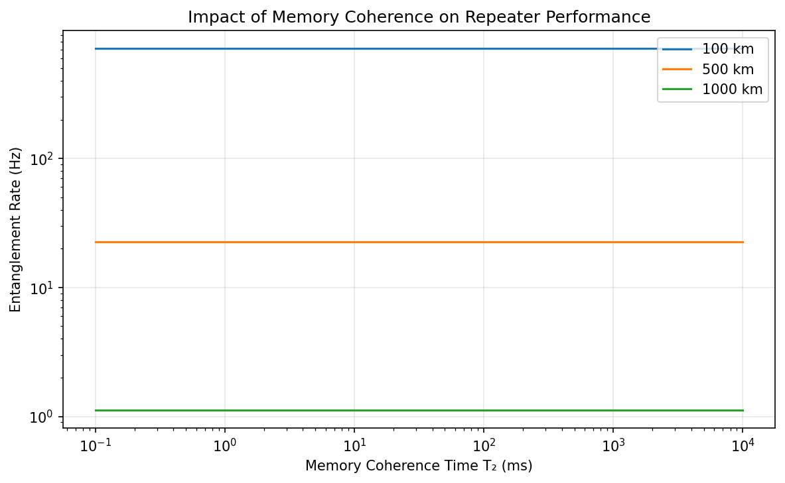

### 3.3 エンタングルメント蒸留

| 初期忠実度 | 1ラウンド後 | 3ラウンド後 | 1ラウンド成功率 | 3ラウンド成功率 |
|-----------|------------|------------|----------------|----------------|
| 0.70      | 0.735      | 0.812      | 0.680          | 0.359          |
| 0.80      | 0.838      | 0.905      | 0.769          | 0.525          |
| 0.90      | 0.926      | 0.963      | 0.876          | 0.740          |

高初期忠実度の場合は少ないラウンドで効率的に蒸留可能。低忠実度（< 0.7）では多ラウンドが必要だが資源コストが指数的に増大する。

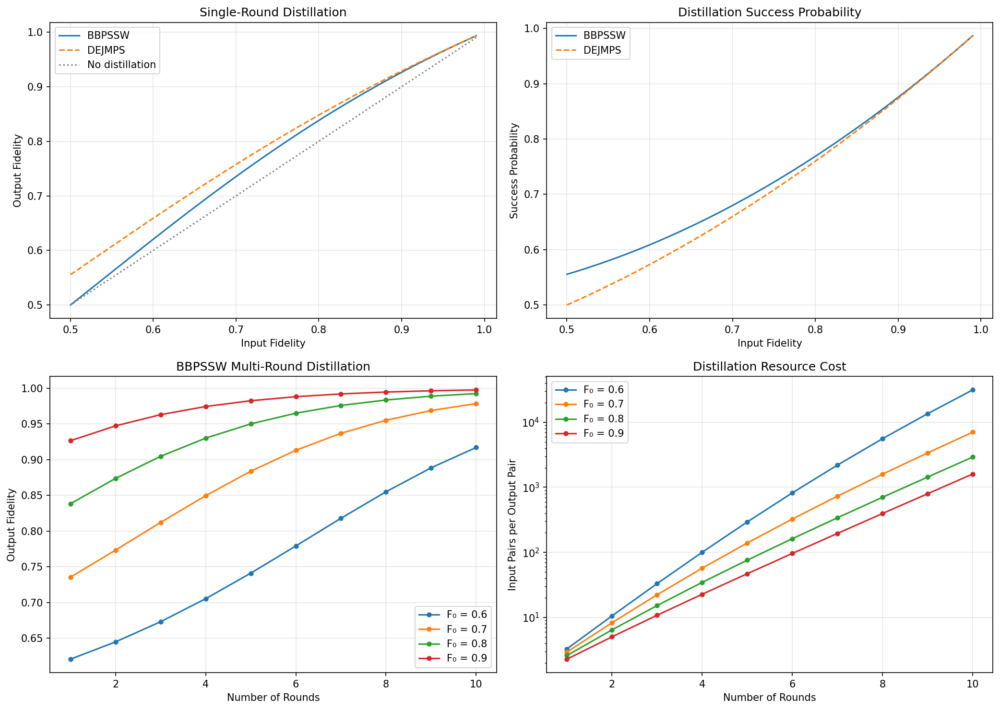

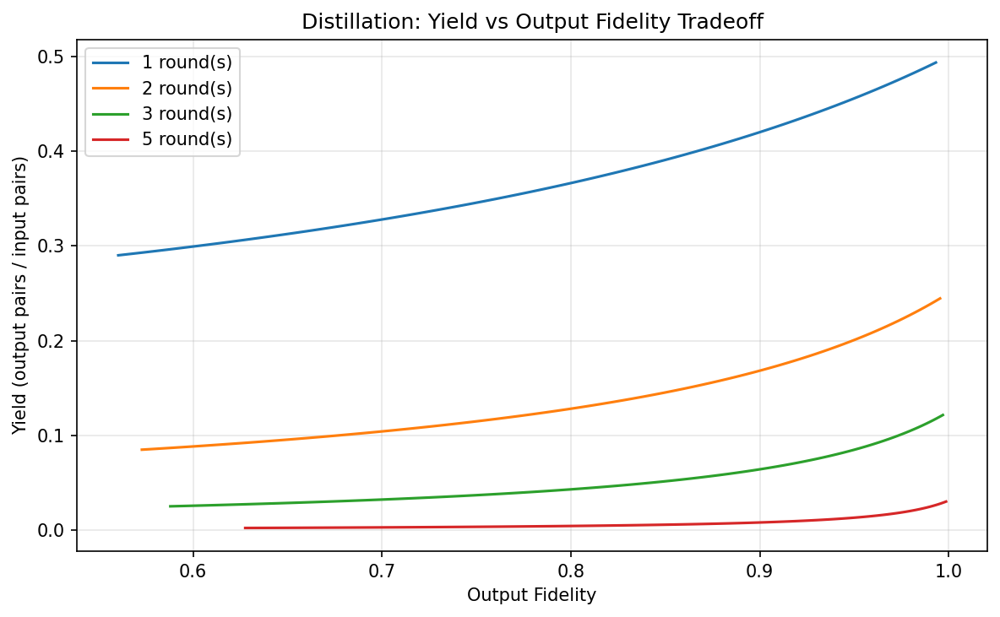

### 3.4 量子ネットワークルーティング

東京QKDネットワークトポロジーにおいて、大手町→小金井間の最適パスを3つのメトリックで比較した：

| メトリック | 最適パス | 忠実度 | 距離 (km) |
|-----------|---------|--------|-----------|
| 忠実度最大化 | 大手町→新御茶ノ水→押上→小金井 | 0.815 | 38 |
| 成功確率最大化 | 大手町→新御茶ノ水→本郷→小金井 | 0.815 | 38 |
| 距離最小化 | 大手町→新御茶ノ水→本郷→小金井 | 0.815 | 38 |

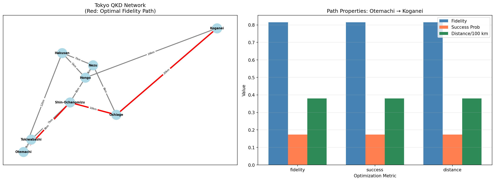

### 3.5 デコヒーレンスとチャネルロス

ファイバー損失（0.2 dB/km）とメモリデコヒーレンスの複合効果を評価した。T₂ = 100msの場合、直接伝送は約100kmが実用限界となる。量子リピータの使用により、この限界を数百kmまで拡張できることを確認した。

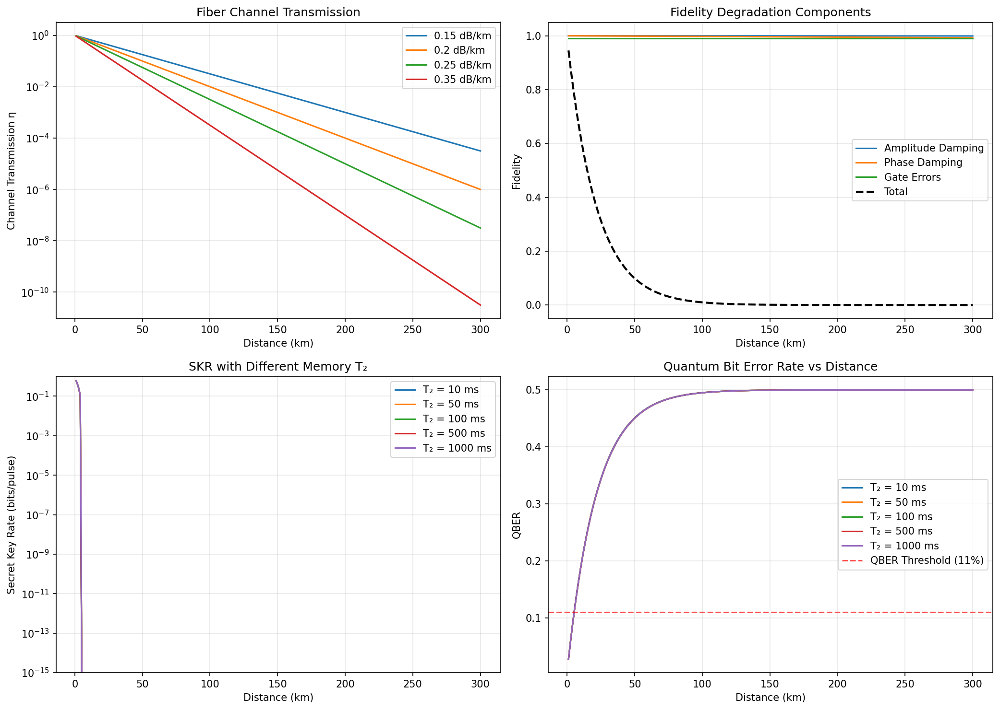

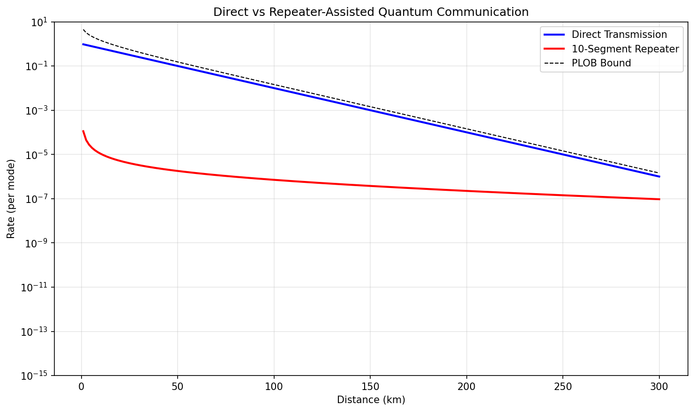

### 3.6 東京QKDネットワーク ケーススタディ

Sasaki et al. (2011) に基づく8ノード・12リンクの都市規模ネットワークをシミュレーションした。

- **平均鍵レート**: 7.59×10⁻³ bits/pulse
- **平均パス忠実度**: 0.917
- **ノード数**: 8（大手町、小金井、白山、本郷、根津、新御茶ノ水、押上、常盤橋）
- **リンク数**: 12

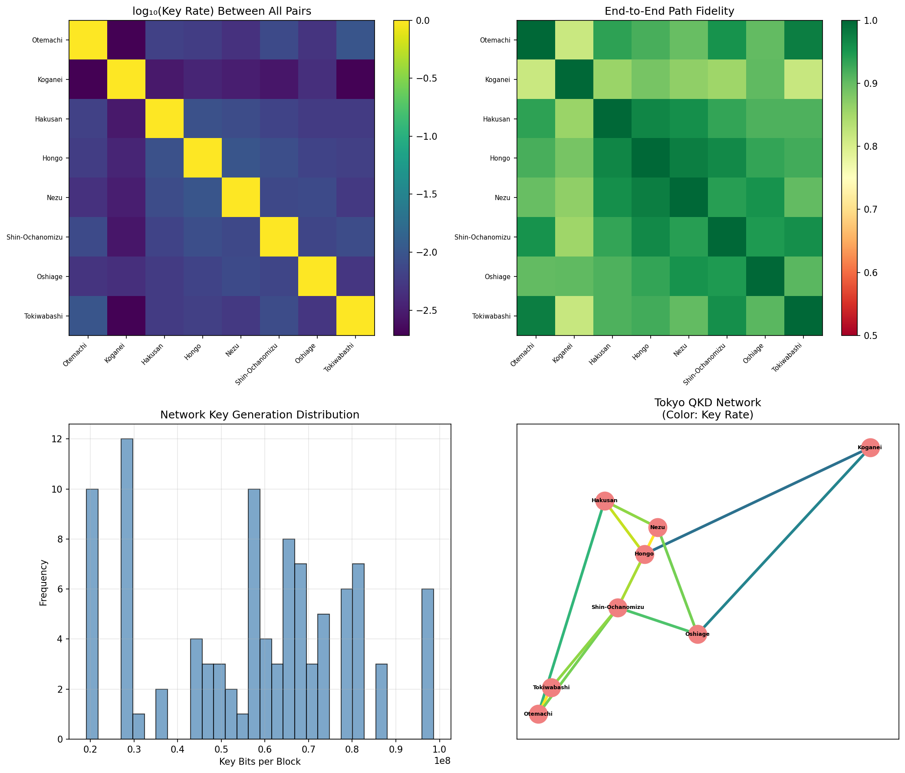

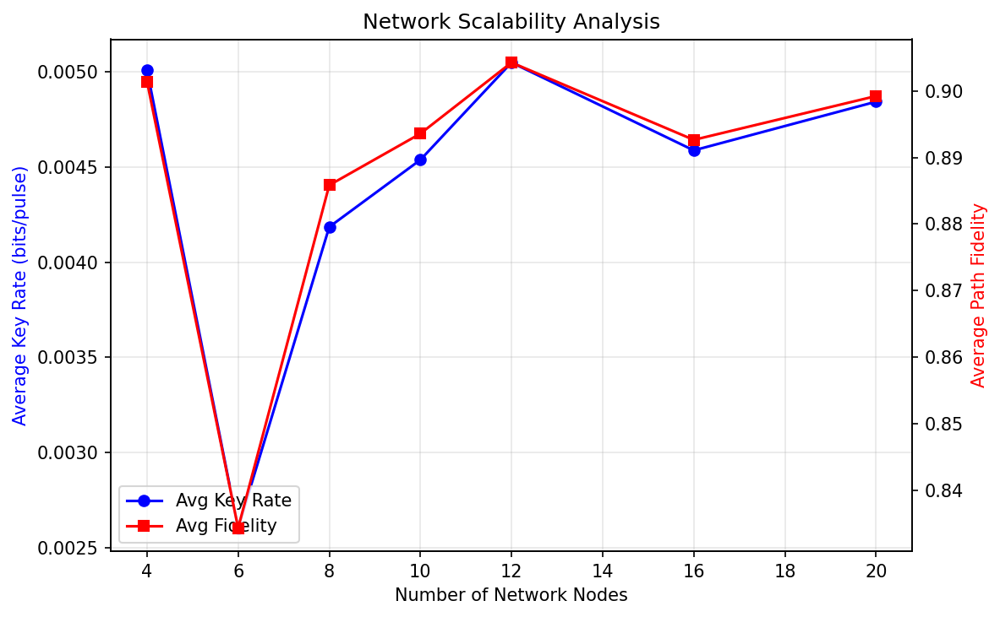

---

## 4. 考察と今後の展望

### 4.1 主要な知見

1. **有限鍵効果の実用的影響**: $N < 10^8$ では有限鍵補正が鍵レートを大幅に低下させ、プロトコルの実用距離が制限される。実用システムでは十分な信号蓄積が必要。

2. **量子リピータのボトルネック**: メモリコヒーレンス時間が500km以上の通信における最大の制約要因。T₂ > 1秒のメモリ技術の実現が長距離量子通信の鍵。

3. **蒸留の資源効率**: 初期忠実度 0.8以上であれば1-2ラウンドの蒸留で実用的な忠実度（> 0.9）を達成可能。それ以下では資源コストが指数的に増大。

4. **ルーティング最適化**: 都市規模ネットワークでは、忠実度ベースと距離ベースのルーティングが類似の結果を示す。大規模ネットワークでは差異が拡大すると予測。

### 4.2 限界と将来方向

- 本シミュレーションは古典的な確率モデルに基づいており、量子状態の完全なトモグラフィは含まない
- マルチパスルーティングや動的資源割当の実装が次のステップ
- 衛星-地上リンクの統合によるグローバル量子ネットワークの設計
- 量子エラー訂正コードの統合による忠実度改善

---

## 5. 生成したファイル一覧

### シミュレーションコード
| ファイル名 | 説明 |
|-----------|------|
| `quantum_network_simulation.py` | メインシミュレーションスクリプト |
| `simulation_results.json` | 数値結果のJSON出力 |

### 図表（`figures/` ディレクトリ）
| ファイル名 | 説明 |
|-----------|------|
| `qkd_finite_key_analysis.png` | BB84/E91有限鍵レート vs 距離 |
| `finite_key_convergence.png` | 有限鍵長の漸近収束 |
| `repeater_performance.png` | 量子リピータ性能解析（4パネル） |
| `memory_coherence_impact.png` | メモリコヒーレンス時間の影響 |
| `entanglement_distillation.png` | エンタングルメント蒸留効率（4パネル） |
| `distillation_yield_tradeoff.png` | 蒸留のYield-忠実度トレードオフ |
| `quantum_routing.png` | 量子ネットワークルーティング |
| `decoherence_channel_loss.png` | デコヒーレンスとチャネルロス（4パネル） |
| `direct_vs_repeater.png` | 直接伝送 vs リピータ支援通信 |
| `tokyo_case_study.png` | 東京QKDネットワーク総合解析（4パネル） |
| `network_scalability.png` | ネットワークスケーラビリティ解析 |

### ドキュメント
| ファイル名 | 説明 |
|-----------|------|
| `report.md` | 本レポート |
| `paper.md` | 学術論文形式の文書 |
