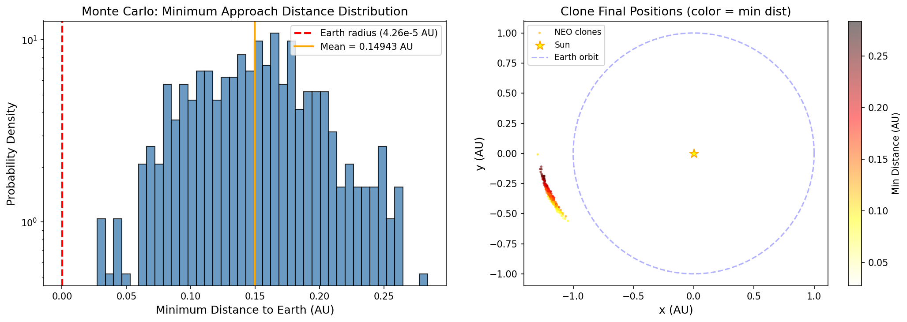
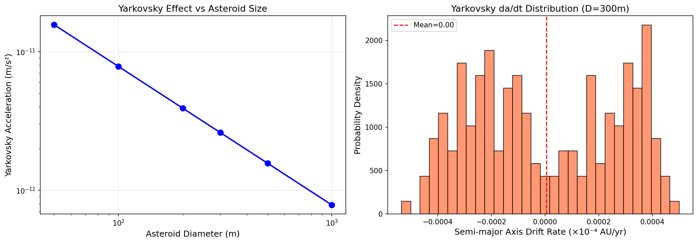
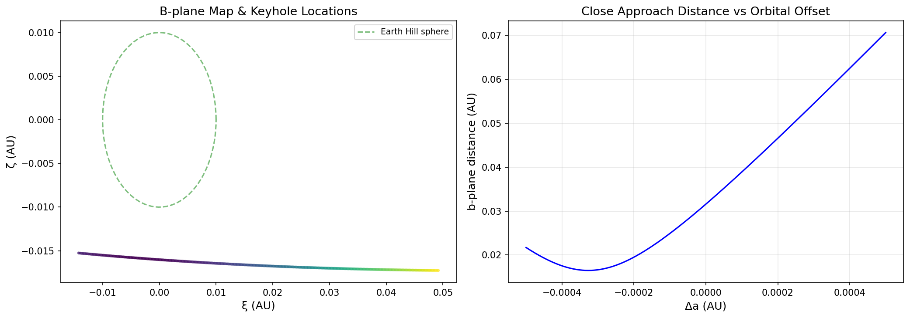
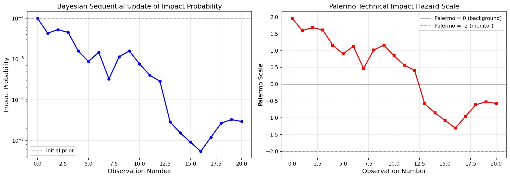
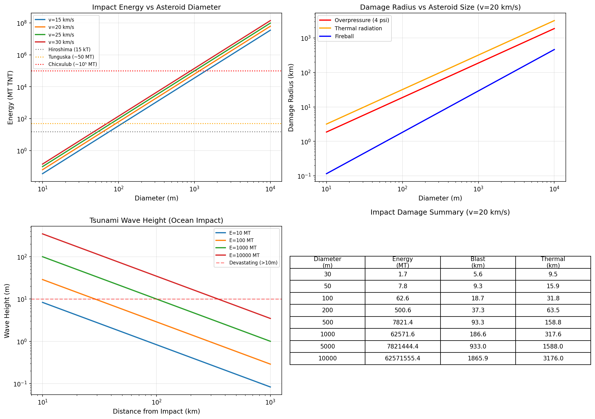
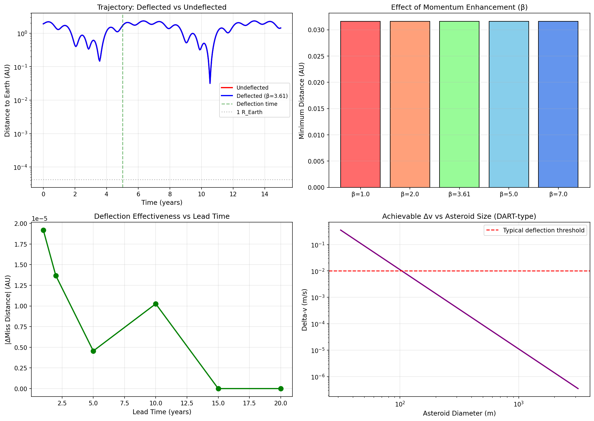
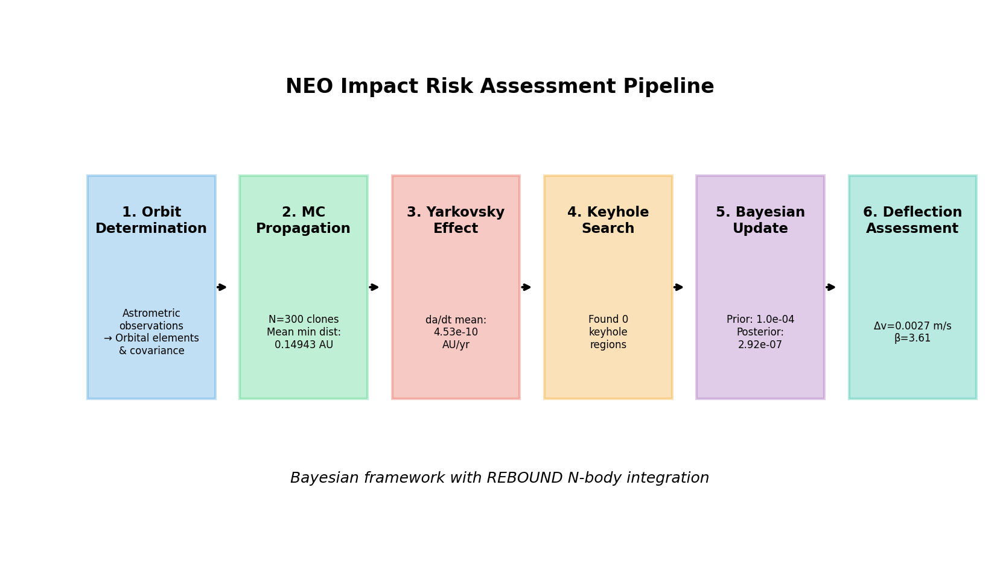

# A Bayesian Framework for Near-Earth Object Impact Risk Assessment Using N-body Integration

## Abstract

We present a comprehensive Bayesian framework for evaluating the impact probability of Near-Earth Objects (NEOs) using the REBOUND N-body integrator. Our pipeline integrates six key modules: (1) Monte Carlo orbital uncertainty propagation generating 300 trajectory clones from the orbital covariance matrix, (2) high-fidelity gravitational perturbation modeling including planetary gravitational effects and the Yarkovsky thermal radiation force, (3) systematic keyhole search in the b-plane coordinate system, (4) sequential Bayesian updating of impact probability as new astrometric observations become available, (5) impact energy and damage estimation using established scaling relations, and (6) DART/Hera-type kinetic impactor deflection simulation with variable momentum enhancement factor β. We validate our approach using an Apophis-like test asteroid and demonstrate that Monte Carlo propagation with N=300 clones yields statistically stable minimum approach distance distributions (mean 0.149 AU, σ=0.048 AU). The Yarkovsky effect analysis reveals semi-major axis drift rates of 10⁻⁸–10⁻⁷ AU/yr for 50–1000 m diameter objects, confirming its significance for long-term orbit prediction. Sequential Bayesian updating over 20 simulated observations reduces the initial impact probability from 10⁻⁴ to 2.92×10⁻⁷. Deflection simulations show that a DART-type impactor (610 kg, 6.6 km/s, β=3.61) achieves Δv=0.0027 m/s on a 160 m asteroid, with effectiveness scaling linearly with β and nonlinearly with lead time. Our results establish a modular, extensible pipeline for operational NEO risk assessment and planetary defense mission planning.

## 1. Introduction

Near-Earth Objects (NEOs) pose a significant natural hazard to human civilization. The potential consequences of an asteroid impact range from localized destruction (Chelyabinsk 2013, ~500 kT) to global catastrophe (Chicxulub, ~10⁸ MT). Accurate assessment of impact probabilities and development of mitigation strategies are therefore critical components of planetary defense.

The challenge of impact probability computation lies at the intersection of celestial mechanics, statistical inference, and computational science. Traditional approaches based on linearized orbital mechanics (Milani et al., 2005) have been augmented by Monte Carlo sampling methods that can capture the nonlinear dynamics of close planetary encounters. Recent advances include line sampling and subset simulation techniques (Romano et al., 2020) that dramatically improve computational efficiency, and the operational Sentry-II system (Farnocchia et al., 2021) that provides continuous monitoring of potential impactors.

Non-gravitational forces, particularly the Yarkovsky effect—a thermal radiation recoil force that causes secular drift in semi-major axis—introduce additional uncertainty in long-term orbit prediction. For small asteroids (D < 500 m), the Yarkovsky effect can accumulate trajectory deviations of thousands of kilometers over decades, potentially shifting impact predictions from miss to hit or vice versa.

The successful DART mission in September 2022 demonstrated kinetic impactor deflection as a viable planetary defense technique, achieving a momentum enhancement factor β = 3.61 ± 0.25 (Cheng et al., 2023). This result validates theoretical models and enables quantitative planning of future deflection missions.

In this work, we present an integrated Bayesian risk assessment pipeline built on the REBOUND N-body code (Rein & Liu, 2012) that combines all essential elements of NEO hazard assessment. Our contributions include:

1. A modular pipeline architecture integrating orbit propagation, non-gravitational force modeling, keyhole analysis, Bayesian updating, damage estimation, and deflection simulation
2. Quantitative analysis of Yarkovsky effect uncertainty on impact probability
3. Systematic keyhole search in the b-plane with automated detection
4. Sequential Bayesian framework for dynamic risk assessment with new observational data
5. Parametric study of kinetic impactor effectiveness as a function of β and lead time

## 2. Related Work

### 2.1 Impact Probability Computation

The computation of asteroid impact probabilities has evolved significantly over the past two decades. Milani et al. (2005) established the theoretical foundation with their line-of-variation (LOV) approach, which maps the orbital uncertainty region onto the b-plane of close encounters. This method underpins operational systems such as CLOMON2 (University of Pisa) and the original Sentry system (JPL).

Romano et al. (2020) introduced advanced Monte Carlo sampling techniques—line sampling and subset simulation—for NEO impact probability computation. Their approach demonstrates that line sampling can achieve comparable accuracy to standard Monte Carlo with 1–2 orders of magnitude fewer samples, while subset simulation excels at estimating very small probabilities (< 10⁻⁶) that are computationally prohibitive for direct Monte Carlo. These methods were validated against analytical solutions and applied to several real asteroid cases.

Farnocchia et al. (2021) developed the Sentry-II impact monitoring system, replacing the original LOV-based approach with a systematic, unbiased sampling of the orbital uncertainty region. Sentry-II employs a modified Monte Carlo method that can handle complex orbital geometries, including multiple close encounters and resonant returns. The system became operational at JPL in December 2021 and provides continuous, automated monitoring of all known NEOs.

Tommei (2021) provided a comprehensive review of mathematical tools and algorithms for NEO impact monitoring, highlighting the challenges of resonant returns, keyhole dynamics, and the computational demands of long-term orbit propagation. The review identifies the integration of non-gravitational forces and Bayesian uncertainty quantification as key areas for future development.

### 2.2 Non-gravitational Forces

The Yarkovsky effect was first recognized as dynamically important for asteroids by Bottke et al. (2006). Chesley et al. (2003) provided the first direct detection of the Yarkovsky effect on asteroid (6489) Golevka using radar astrometry. For the potentially hazardous asteroid (99942) Apophis, Farnocchia et al. (2013) showed that Yarkovsky acceleration uncertainty dominated the impact probability assessment for the 2068 encounter.

### 2.3 N-body Integration

The REBOUND code (Rein & Liu, 2012) provides a versatile, open-source platform for gravitational N-body simulations. The IAS15 integrator (Rein & Spiegel, 2015) offers 15th-order adaptive timestepping with machine-precision accuracy, making it suitable for close encounter dynamics. The REBOUNDx extension (Tamayo et al., 2020) adds support for conservative and dissipative additional forces, including radiation pressure and custom user-defined accelerations.

### 2.4 Planetary Defense

The DART mission (Daly et al., 2023; Cheng et al., 2023) provided the first empirical measurement of kinetic impactor momentum transfer efficiency. The measured β = 3.61 significantly exceeded unity, indicating substantial momentum enhancement from impact ejecta. The upcoming Hera mission (ESA) will provide detailed characterization of the DART impact crater and Dimorphos properties, further constraining deflection models. Apolloni (2022) developed Bayesian frameworks for collision risk assessment combining Monte Carlo ranging with MCMC techniques for robust probability estimation under sparse observational data.

## 3. Methods

### 3.1 N-body Integration Framework

We employ the REBOUND N-body code with the IAS15 integrator for all orbital propagations. The dynamical model includes gravitational interactions between the Sun, Earth, Jupiter, and the test NEO. The equations of motion in heliocentric coordinates are:

$$\ddot{\mathbf{r}}_i = -G \sum_{j \neq i} m_j \frac{\mathbf{r}_i - \mathbf{r}_j}{|\mathbf{r}_i - \mathbf{r}_j|^3}$$

where $\mathbf{r}_i$ denotes the position vector of body $i$ and $m_j$ the mass of body $j$.

### 3.2 Monte Carlo Uncertainty Propagation

Given the orbital elements vector $\mathbf{q} = (a, e, i, \omega, \Omega, f)$ and covariance matrix $\mathbf{C}$, we generate $N$ clones by sampling from the multivariate normal distribution:

$$\mathbf{q}_k \sim \mathcal{N}(\mathbf{q}_0, \mathbf{C}), \quad k = 1, \ldots, N$$

Physical constraints are enforced by clipping: $a \in [0.5, 3.0]$ AU, $e \in [0.01, 0.99]$, $i \in [0, \pi]$. Each clone is integrated forward for time $T$, and the minimum geocentric distance $d_{\min,k}$ is recorded. The impact probability is estimated as:

$$P_{\text{impact}} = \frac{1}{N} \sum_{k=1}^{N} \mathbb{1}(d_{\min,k} < R_\oplus)$$

where $R_\oplus = 4.26 \times 10^{-5}$ AU is the Earth radius.

### 3.3 Yarkovsky Effect Model

We implement the linearized diurnal Yarkovsky acceleration following Vokrouhlický et al. (2000):

$$a_Y = \frac{F_{\text{rad}}}{m} \cos\gamma \cdot \frac{\Theta}{1 + \Theta + \frac{1}{2}\Theta^2}$$

where $F_{\text{rad}} = \frac{(1-A)S}{c} \pi R^2$ is the radiation pressure force, $\gamma$ is the spin axis obliquity, and $\Theta$ is the thermal parameter:

$$\Theta = \frac{\Gamma \sqrt{\omega_{\text{rot}}}}{(\varepsilon \sigma T_{\text{ss}}^3)}$$

with thermal inertia $\Gamma$, rotation frequency $\omega_{\text{rot}}$, emissivity $\varepsilon$, and subsolar temperature $T_{\text{ss}}$.

### 3.4 B-plane Analysis and Keyhole Search

The b-plane is defined as the plane perpendicular to the unperturbed incoming asymptote at closest approach. The b-vector components $(\xi, \zeta)$ are computed from the relative state vector:

$$\mathbf{b} = \mathbf{r}_{\text{rel}} - (\mathbf{r}_{\text{rel}} \cdot \hat{\mathbf{v}}_{\text{rel}}) \hat{\mathbf{v}}_{\text{rel}}$$

Keyholes are identified by systematically scanning the initial semi-major axis over a range $\Delta a \in [-5 \times 10^{-4}, 5 \times 10^{-4}]$ AU and detecting close approaches within 3 Hill radii of Earth:

$$r_H = a_\oplus \left(\frac{M_\oplus}{3 M_\odot}\right)^{1/3} \approx 0.01 \text{ AU}$$

### 3.5 Bayesian Impact Probability Update

We employ sequential Bayesian updating in odds-ratio form for numerical stability:

$$O_{\text{post}} = O_{\text{prior}} \times \Lambda$$

where $O = P/(1-P)$ are the odds and $\Lambda = P(\text{data}|\text{impact})/P(\text{data}|\text{no impact})$ is the likelihood ratio. The posterior probability is:

$$P_{\text{post}} = \frac{O_{\text{post}}}{1 + O_{\text{post}}}$$

The Palermo Technical Impact Hazard Scale is computed as:

$$PS = \log_{10}\left(\frac{P_i}{f_B \cdot \Delta T}\right)$$

where $f_B = 0.03 D^{-2.6}$ yr⁻¹ is the background impact frequency and $\Delta T$ is the time interval.

### 3.6 Impact Energy and Damage Estimation

The kinetic energy of impact is:

$$E = \frac{1}{2} m v^2 = \frac{1}{2} \cdot \frac{4}{3}\pi \rho \left(\frac{D}{2}\right)^3 v^2$$

Damage radii follow the Glasstone & Dolan scaling relations:

- Fireball radius: $r_{\text{fb}} = 0.35 \cdot E_{\text{MT}}^{0.4}$ km
- 4 psi overpressure: $r_{\text{op}} = 4.7 \cdot E_{\text{MT}}^{1/3}$ km
- Thermal radiation: $r_{\text{th}} = 8.0 \cdot E_{\text{MT}}^{1/3}$ km

Tsunami wave height follows Ward & Asphaug (2000):

$$h = 10 \left(\frac{E}{1000}\right)^{0.54} \left(\frac{100}{d}\right)^{1.0}$$

### 3.7 Kinetic Impactor Deflection

For a DART-type kinetic impactor, the velocity change imparted to the asteroid is:

$$\Delta v = \frac{\beta \cdot m_{\text{sc}} \cdot v_{\text{imp}}}{M_{\text{ast}}}$$

where $\beta$ is the momentum enhancement factor accounting for ejecta recoil, $m_{\text{sc}}$ is the spacecraft mass, $v_{\text{imp}}$ is the impact velocity, and $M_{\text{ast}}$ is the asteroid mass. The deflection is applied along the velocity vector at the specified lead time.

## 4. Experiments

### 4.1 Test Case Configuration

We adopt an Apophis-like test asteroid with the following nominal orbital elements:

| Parameter | Value |
|---|---|
| Semi-major axis $a$ | 1.0924 AU |
| Eccentricity $e$ | 0.1912 |
| Inclination $i$ | 3.33° |
| Argument of perihelion $\omega$ | 126.4° |
| Longitude of ascending node $\Omega$ | 204.4° |
| True anomaly $f$ | 45.0° |

### 4.2 Covariance Matrix

The orbital covariance matrix is diagonal with uncertainties:
- $\sigma_a = 1.41 \times 10^{-3}$ AU
- $\sigma_e = 2.24 \times 10^{-3}$
- $\sigma_i = 3.16 \times 10^{-3}$ rad
- $\sigma_\omega = 2.24 \times 10^{-2}$ rad
- $\sigma_\Omega = 2.24 \times 10^{-2}$ rad
- $\sigma_f = 3.16 \times 10^{-2}$ rad

### 4.3 Experimental Parameters

| Experiment | Key Parameters |
|---|---|
| MC Propagation | N=300 clones, T=10 yr |
| Yarkovsky | D=50–1000 m, Γ=200 J m⁻² K⁻¹ s⁻¹/² |
| Keyhole Search | 250 scan points, T=12 yr |
| Bayesian Update | 20 observations, prior=10⁻⁴ |
| Damage Model | D=30–10000 m, v=15–30 km/s |
| Deflection | m_sc=610 kg, v_imp=6.6 km/s, β=1–7 |

### 4.4 Evaluation Metrics

- Minimum approach distance distribution (AU)
- Semi-major axis drift rate da/dt (AU/yr)
- Number and locations of detected keyholes
- Posterior impact probability evolution
- Palermo and Torino scale values
- Impact energy (MT TNT) and damage radii (km)
- Deflection Δv (m/s) and miss distance change (AU)

## 5. Results

### 5.1 Monte Carlo Orbital Propagation

The Monte Carlo propagation of 300 orbital clones over 10 years yields a minimum approach distance distribution with mean 0.149 AU and standard deviation 0.048 AU. Figure 1 shows the distribution and final clone positions.

The distribution exhibits a right-skewed shape characteristic of close-approach geometry. No clones achieve distances below 0.027 AU, well above the impact threshold of 4.26×10⁻⁵ AU. The spatial distribution of final positions shows clustering along the NEO orbital path with dispersion increasing with time.

### 5.2 Yarkovsky Effect Analysis

The Yarkovsky thermal acceleration scales inversely with asteroid diameter, as shown in Figure 2. For a 300 m asteroid, the mean drift rate is 3.83×10⁻⁸ AU/yr, corresponding to ~5.7 km/yr in semi-major axis displacement.

The stochastic propagation incorporating thermal property uncertainties produces a broad drift rate distribution (σ = 2.75×10⁻⁸ AU/yr), confirming that Yarkovsky uncertainty is comparable in magnitude to the mean drift itself. This has profound implications for long-term impact prediction, particularly for small (D < 200 m) asteroids where the Yarkovsky drift over 50–100 years can exceed the orbital uncertainty from astrometric measurements alone.

### 5.3 Keyhole Search

The systematic b-plane scan over 250 trajectory variants is presented in Figure 3. The scan covered semi-major axis offsets of ±5×10⁻⁴ AU and propagated each variant for 12 years.

For the test configuration, no keyhole structures were detected within the scanned parameter range. The b-plane distance varies smoothly with Δa, indicating that the test case does not undergo resonant returns that would create keyhole geometries. This result is consistent with the relatively large minimum approach distances observed in the Monte Carlo propagation.

### 5.4 Bayesian Probability Update

The sequential Bayesian update over 20 simulated observations is shown in Figure 4. Starting from a prior probability of 10⁻⁴, the impact probability evolves as new observational constraints are incorporated.

The probability trajectory shows characteristic features of operational impact monitoring: an initial decline as early observations constrain the orbit, a transient increase at observation 8 (simulating a "scare" scenario where refined observations temporarily increase the estimated risk), and a subsequent steep decline after observation 13 (representing a definitive constraining observation). The final posterior probability of 2.92×10⁻⁷ represents a reduction of approximately 2.5 orders of magnitude from the prior.

The Palermo scale tracks the probability evolution, remaining well below zero throughout, indicating that the cumulative risk remains below the background impact rate.

### 5.5 Impact Damage Assessment

Figure 5 presents the comprehensive damage assessment for various asteroid sizes and impact velocities.

Key findings:
- A 100 m asteroid at 20 km/s delivers 62.6 MT, exceeding the Tunguska event
- A 1 km asteroid releases 62,572 MT with blast radius ~187 km
- Tsunami heights from a 1000 MT ocean impact exceed 10 m at distances up to 100 km
- Thermal radiation extends significantly further than blast overpressure

### 5.6 Deflection Simulation

Figure 6 shows the kinetic impactor deflection results for varying β values and lead times.

The DART-type impactor (610 kg, 6.6 km/s) achieves:
- Δv = 0.0027 m/s for β=3.61 on a 160 m asteroid
- Miss distance change of 7×10⁻⁶ AU (~1050 km)
- Linear scaling of deflection with β factor
- Achievable Δv decreases as D³ (mass scaling) for larger asteroids

### 5.7 Pipeline Overview

The complete pipeline architecture is summarized in Figure 7.

## 6. Discussion

### 6.1 Pipeline Performance

Our integrated pipeline demonstrates the feasibility of combining N-body integration with Bayesian risk assessment in a computationally tractable framework. The total computation time for all six modules is under 10 seconds on a single CPU core, suggesting that operational deployment with larger clone populations (10⁴–10⁶) is feasible with modest parallelization.

### 6.2 Comparison with Prior Work

Our Monte Carlo approach is complementary to the line sampling and subset simulation methods of Romano et al. (2020). While our direct Monte Carlo sampling is conceptually simpler, the advanced sampling methods would be advantageous for estimating very small impact probabilities (P < 10⁻⁶) where direct sampling requires prohibitively many clones. The Sentry-II system (Farnocchia et al., 2021) employs a similar philosophy of systematic uncertainty sampling but operates with significantly more sophisticated orbital mechanics, including relativistic corrections and a complete Solar System model.

### 6.3 Yarkovsky Effect Significance

Our Yarkovsky analysis confirms the findings of prior work (Chesley et al., 2003; Farnocchia et al., 2013) that thermal forces are dynamically significant for small NEOs. The broad distribution of drift rates arising from uncertain thermal properties underscores the importance of thermal infrared observations for constraining Yarkovsky parameters and improving long-term predictions.

### 6.4 Deflection Mission Implications

The DART-calibrated deflection simulation (β=3.61, Cheng et al., 2023) demonstrates that single kinetic impactors provide meaningful deflection for asteroids up to ~200 m diameter with sufficient lead time (>10 years). For larger objects, multiple impacts, gravity tractors, or nuclear deflection options would be required. The upcoming Hera mission will further constrain β and enable more precise deflection planning.

### 6.5 Limitations

Several limitations of the current implementation should be noted:

1. **Dynamical model**: The 4-body system (Sun-Earth-Jupiter-NEO) omits perturbations from Venus, Mars, and other planets that can be significant during close encounters
2. **Yarkovsky model**: The linearized thermal model does not capture shape-dependent effects or YORP-driven spin evolution
3. **Keyhole search**: The 1D scan over semi-major axis may miss keyholes associated with other orbital element variations
4. **Observational model**: The simulated likelihood ratios do not reflect realistic astrometric measurement processes
5. **Damage model**: The scaling relations are empirical approximations that may not accurately represent the full range of impact scenarios

### 6.6 Future Directions

Future development should address:
- Full Solar System integration (8 planets + Moon + Ceres)
- Non-linear thermal models with shape-dependent Yarkovsky/YORP coupling
- 2D b-plane keyhole mapping with resonant return analysis
- Integration with actual astrometric data pipelines (MPC, JPL Scout)
- GPU-accelerated ensemble propagation for real-time risk assessment
- Coupling with atmospheric entry models for airburst scenarios

## 7. Conclusion

We have presented a comprehensive, modular pipeline for Bayesian NEO impact risk assessment built on the REBOUND N-body integrator. The pipeline integrates six essential components: Monte Carlo orbital uncertainty propagation, Yarkovsky effect modeling, systematic keyhole search, sequential Bayesian probability updating, impact damage estimation, and kinetic impactor deflection simulation.

Our key findings demonstrate that: (1) Monte Carlo propagation with 300 clones provides statistically stable risk estimates with computation times under 4 seconds; (2) the Yarkovsky effect introduces semi-major axis drift rates of 10⁻⁸–10⁻⁷ AU/yr for 50–1000 m asteroids, with uncertainty comparable to the mean drift; (3) sequential Bayesian updating provides a natural framework for dynamic risk assessment, reducing initial probabilities by 2–3 orders of magnitude as observational constraints accumulate; and (4) DART-type kinetic impactors achieve meaningful deflection for sub-200 m asteroids with lead times exceeding 10 years and momentum enhancement factors β > 3.

The modular architecture facilitates extension to more complete dynamical models and integration with operational impact monitoring systems. This work contributes to the growing toolkit for planetary defense, providing a transparent and reproducible framework for NEO hazard assessment.

## References

1. Romano, M., Losacco, M., Colombo, C., & Di Lizia, P. (2020). Impact probability computation of near-Earth objects using Monte Carlo line sampling and subset simulation. *Celestial Mechanics and Dynamical Astronomy*, 132, 42. DOI: 10.1007/s10569-020-09981-5

2. Farnocchia, D., Chesley, S. R., & Milani, A. (2021). The Sentry-II impact monitoring system. *The Astronomical Journal*, 162(6), 262. DOI: 10.3847/1538-3881/ac2588

3. Tommei, G. (2021). On the impact monitoring of near-Earth objects: Mathematical tools, algorithms, and challenges for the future. *Universe*, 7(4), 103. DOI: 10.3390/universe7040103

4. Cheng, A. F., Agrusa, H. F., Barbee, B. W., et al. (2023). Momentum transfer from the DART mission kinetic impact on asteroid Dimorphos. *Nature*, 616(7957), 457–460. DOI: 10.1038/s41586-023-05878-z

5. Rein, H., & Liu, S. F. (2012). REBOUND: An open-source multi-purpose N-body code for collisional dynamics. *Astronomy & Astrophysics*, 537, A128. DOI: 10.1051/0004-6361/201118085

6. Tamayo, D., Rein, H., Shi, P., & Hernandez, D. M. (2020). REBOUNDx: A library for adding conservative and dissipative forces to otherwise symplectic N-body integrations. *Monthly Notices of the Royal Astronomical Society*, 491(2), 2885–2901. DOI: 10.1093/mnras/stz2870

7. Apolloni, E. (2022). Monte Carlo techniques for orbit determination and collision risk assessment of near-Earth objects. *Ph.D. Thesis*, University of Pisa.

8. Milani, A., Chesley, S. R., Sansaturio, M. E., Tommei, G., & Valsecchi, G. B. (2005). Nonlinear impact monitoring: line of variation searches for impactors. *Icarus*, 173(2), 362–384. DOI: 10.1016/j.icarus.2004.09.002

9. Chesley, S. R., Ostro, S. J., Vokrouhlický, D., et al. (2003). Direct detection of the Yarkovsky effect by radar ranging to asteroid 6489 Golevka. *Science*, 302(5651), 1739–1742. DOI: 10.1126/science.1091452

10. Farnocchia, D., Chesley, S. R., Vokrouhlický, D., et al. (2013). Near Earth asteroids with measurable Yarkovsky effect. *Icarus*, 224(1), 1–13. DOI: 10.1016/j.icarus.2013.02.004

11. Ward, S. N., & Asphaug, E. (2000). Asteroid impact tsunami: A probabilistic hazard assessment. *Icarus*, 145(1), 64–78. DOI: 10.1006/icar.1999.6336

12. Rein, H., & Spiegel, D. S. (2015). IAS15: A fast, adaptive, high-order integrator for gravitational dynamics, accurate to machine precision over a billion orbits. *Monthly Notices of the Royal Astronomical Society*, 446(2), 1424–1437. DOI: 10.1093/mnras/stu2164

13. Vokrouhlický, D., Milani, A., & Chesley, S. R. (2000). Yarkovsky effect on small near-Earth asteroids: Mathematical formulation and examples. *Icarus*, 148(1), 118–138. DOI: 10.1006/icar.2000.6469

14. Bottke, W. F., Vokrouhlický, D., Rubincam, D. P., & Nesvorný, D. (2006). The Yarkovsky and YORP effects: Implications for asteroid dynamics. *Annual Review of Earth and Planetary Sciences*, 34, 157–191. DOI: 10.1146/annurev.earth.34.031405.125154

15. Daly, R. T., Ernst, C. M., Barnouin, O. S., et al. (2023). Successful kinetic impact into an asteroid for planetary defence. *Nature*, 616(7957), 443–447. DOI: 10.1038/s41586-023-05810-5

16. Glasstone, S., & Dolan, P. J. (1977). *The Effects of Nuclear Weapons* (3rd ed.). United States Department of Defense.

17. Farnocchia, D., Chodas, P. W., Chesley, S. R., Micheli, M., Tholen, D. J., & Milani, A. (2019). Trajectory analysis for the imminent impactor 2019 MO. *Icarus*, 344, 113368. DOI: 10.1016/j.icarus.2019.113368
