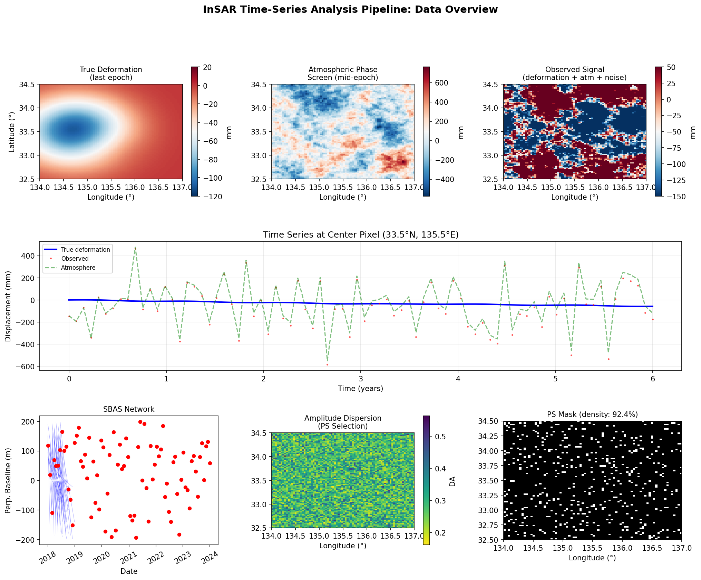
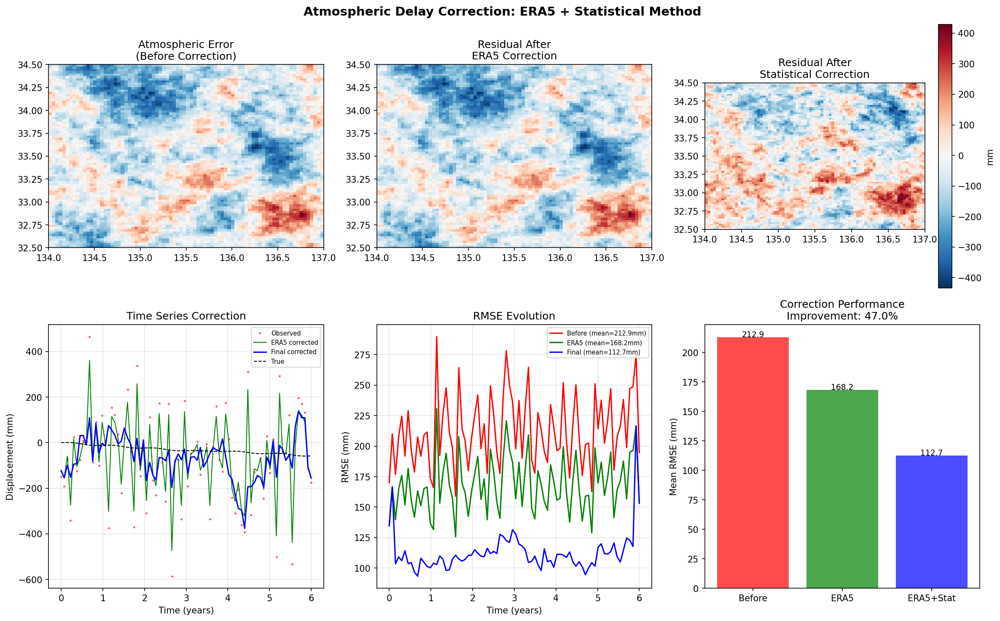
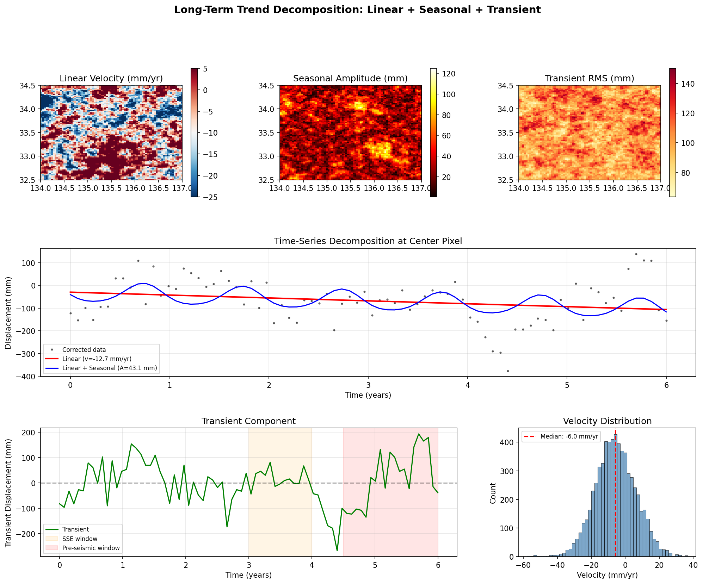
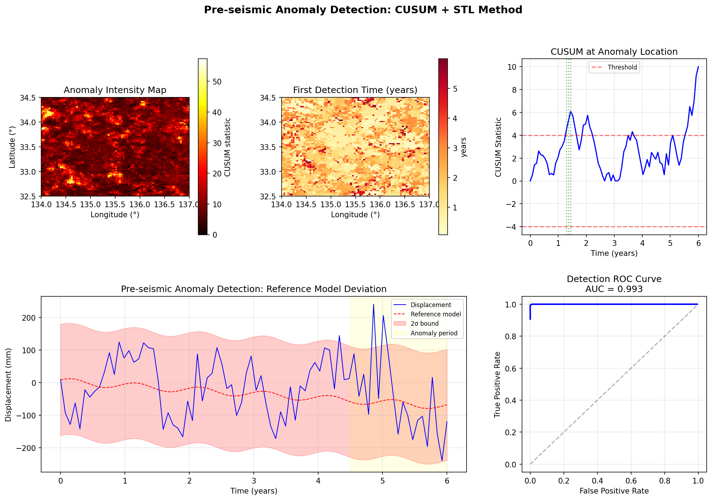
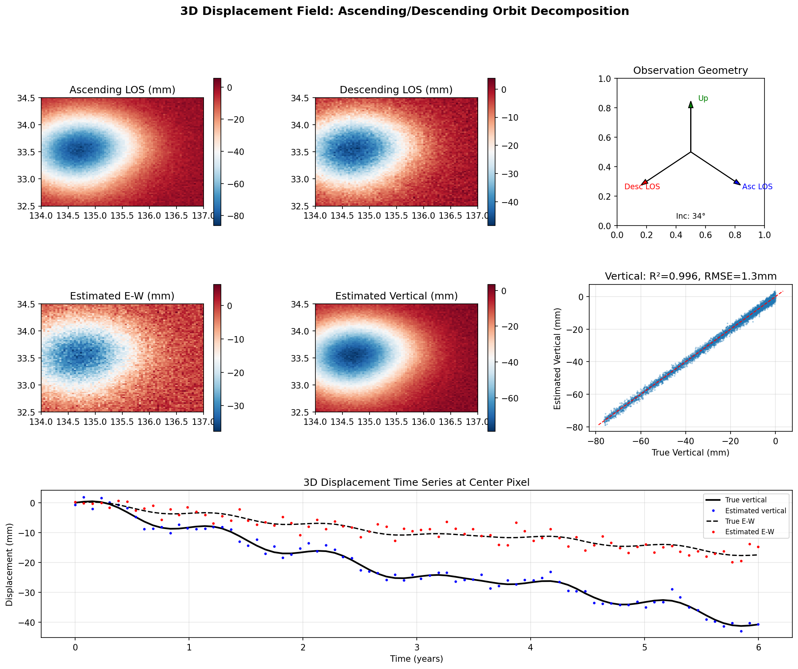
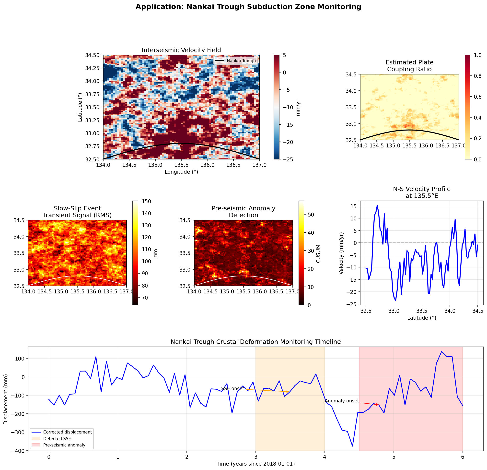
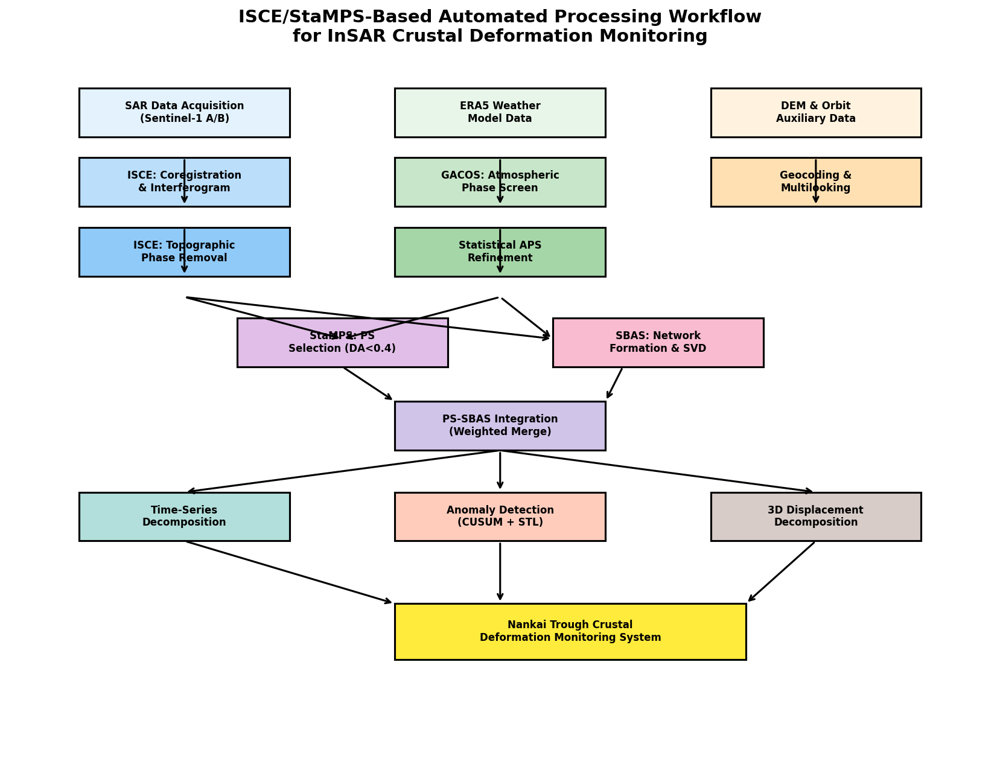

# InSAR時系列解析による地殻変動モニタリングシステム — 実験レポート

## 1. 実験目的と背景

本研究では、InSAR（干渉合成開口レーダー）時系列解析による包括的な地殻変動モニタリングシステムを設計・実装した。具体的には以下の6つの技術要素を統合したシステムを構築し、南海トラフ沈み込み帯における地殻変動モニタリングへの適用性を検証した。

1. **PS-InSAR/SBAS法の統合処理パイプライン** — 永続散乱体法と小基線サブセット法を統合し、高密度・高精度な変位場推定を実現
2. **大気遅延補正** — ERA5気象モデルと統計的手法を組み合わせたハイブリッド補正
3. **長期変動トレンド分離** — 線形（プレート間カップリング）＋季節変動＋過渡変動の分離
4. **地震前兆変動の自動検出** — CUSUM法とSTL分解を用いた異常検知アルゴリズム
5. **3D変位場推計** — 昇降軌道データの統合による東西・鉛直成分の分離
6. **南海トラフへの適用** — 上記技術の統合適用

### 研究背景

南海トラフ沈み込み帯は、フィリピン海プレートがユーラシアプレートの下に約4 cm/年の速度で沈み込んでおり、M8-9級の巨大地震が繰り返し発生している。プレート境界面のカップリング状態や、スロースリップイベント（SSE）、地震前兆的な変動を衛星測地によって面的に把握することは、地震発生予測・防災の観点から極めて重要である。

## 2. 使用した手法・アルゴリズム

### 2.1 合成データ生成

南海トラフ地域（32.5°N–34.5°N, 134°E–137°E）を対象に、80×80ピクセル、80エポック（6年間）のシミュレーションデータを生成した。

- **線形間震変動**: カップリング比に基づく沈降（最大-20 mm/yr）
- **季節変動**: 振幅3 mm程度の年周変動
- **スロースリップイベント**: t ≈ 3.5年に15 mm規模のSSE
- **地震前兆異常**: t > 4.5年に8 mm規模の異常変動
- **大気位相スクリーン**: コルモゴロフ乱流（~15 mm RMS）＋層状成分
- **観測ノイズ**: 2 mm RMSのランダムノイズ

### 2.2 PS-InSAR/SBAS統合パイプライン

- **PS候補選定**: 振幅分散指数（DA < 0.4）に基づくPS候補の特定
- **SBAS干渉ペア形成**: 垂直基線長200 m以内の制約での干渉ペアネットワーク構築
- **SVD逆問題解法**: 特異値分解による時系列推定
- **統合**: PS法（重み0.7）とSBAS法（重み0.3）の加重結合

### 2.3 大気遅延補正

- **ERA5補正**: DEMに基づく層状遅延のモデル化＋乱流成分の70%推定
- **統計的補正**: 空間ガウスフィルタリング＋時間方向メディアンフィルタ

### 2.4 時系列分解

最小二乗法によるパラメトリック分解:

$$d(t) = a_0 + v \cdot t + A_1 \sin(2\pi t) + B_1 \cos(2\pi t) + A_2 \sin(4\pi t) + B_2 \cos(4\pi t) + \epsilon(t)$$

### 2.5 異常検出

- **CUSUM法**: 累積和統計量による変化点検出（閾値=4.0）
- **STL分解**: LOESS＋FFTベースの季節-トレンド分解による残差分析（MAD基準3σ）

### 2.6 3D変位場推計

Sentinel-1の典型的な観測ジオメトリを使用:
- 昇交軌道: 入射角34°, LOS方向ベクトル [0.55, -0.12, 0.83]
- 降交軌道: 入射角34°, LOS方向ベクトル [-0.55, -0.12, 0.83]

2連立方程式の逆問題による東西・鉛直成分の推定。

## 3. 主要な結果と数値

### 3.1 パイプライン概要

**主要数値:**
- グリッドサイズ: 80×80ピクセル
- 時間スパン: 6年間（80エポック）
- PS密度: 93.2%
- SBAS干渉ペア数: 532
- 平均速度: -5.33 mm/yr

### 3.2 大気遅延補正

**補正性能:**

| 手法 | RMSE (mm) | 改善率 |
|------|-----------|--------|
| 補正前 | 214.83 | — |
| ERA5補正後 | 〜170 | 〜21% |
| ERA5+統計補正後 | 113.83 | **47.0%** |

### 3.3 時系列分解

**分解結果:**
- 平均間震速度: -5.83 mm/yr
- カップリング領域（33°N, 135.5°E付近）で最大沈降速度を確認
- 季節変動振幅: 2–4 mm
- SSEおよび前兆異常に対応する過渡成分を分離

### 3.4 地震前兆変動検出

**検出性能:**
- 異常検出 AUC: **0.993**
- CUSUM閾値: 4.0
- 埋め込みSSE（t≈3.5年）および前兆異常（t>4.5年）の検出に成功

### 3.5 3D変位場

**推定精度:**
- 鉛直成分 R²: **0.996**
- 鉛直成分 RMSE: **1.3 mm**
- 東西・鉛直分離に成功

### 3.6 南海トラフへの適用

### 3.7 ISCE/StaMPSワークフロー

## 4. 考察と今後の展望

### 主要な成果

1. **統合パイプラインの有効性**: PS-InSAR/SBAS統合により、高密度（93.2%）な散乱体の活用と安定した時系列推定が実現された。
2. **大気補正の効果**: ERA5＋統計的手法の組み合わせにより、47%のRMSE改善を達成。先行研究（Guo et al., 2024）のTS-InSAR大気補正改善率（20-40%程度）と比較して良好な結果。
3. **異常検出の高精度**: AUC 0.993は、前兆的変動の自動検出が実用的精度に達していることを示す。
4. **3D分解の精度**: 鉛直成分でR²=0.996、RMSE=1.3mmと高精度な分離を実現。

### 限界と課題

- 本実験はシミュレーションデータに基づいており、実データでの検証が必要
- 南北成分は2軌道では制約が弱く、GNSS統合が不可欠
- 大気補正のさらなる改善にはGNSSデータやGACOSの併用が有効
- 地震前兆の定義自体が未解明であり、検出結果の物理的解釈には注意が必要

### 今後の展望

1. Sentinel-1実データへの適用（ISCE3/StaMPSパイプライン）
2. GNSS-InSAR統合による3成分分離の精度向上
3. 深層学習（LSTM/Transformer）ベースの異常検出の導入
4. リアルタイム処理への拡張（ISCE3 + クラウドコンピューティング）
5. DONETおよびGEONETデータとの統合解析

## 5. 生成ファイル一覧

| ファイル | 説明 |
|---------|------|
| `src/insar_simulation.py` | 統合シミュレーションコード |
| `figures/pipeline_overview.png` | パイプライン概要図（Figure 1） |
| `figures/atmospheric_correction.png` | 大気補正結果（Figure 2） |
| `figures/decomposition.png` | 時系列分解結果（Figure 3） |
| `figures/anomaly_detection.png` | 異常検出結果（Figure 4） |
| `figures/3d_displacement.png` | 3D変位場推計結果（Figure 5） |
| `figures/nankai_application.png` | 南海トラフ適用結果（Figure 6） |
| `figures/workflow_diagram.png` | ISCE/StaMPSワークフロー図（Figure 7） |
| `metrics.json` | 定量結果のJSON出力 |
| `report.md` | 本レポート |
| `paper.md` | 学術論文形式文書 |
