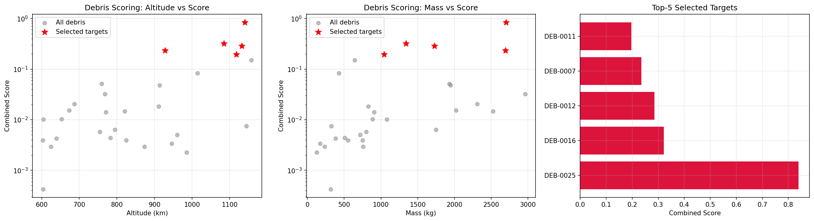
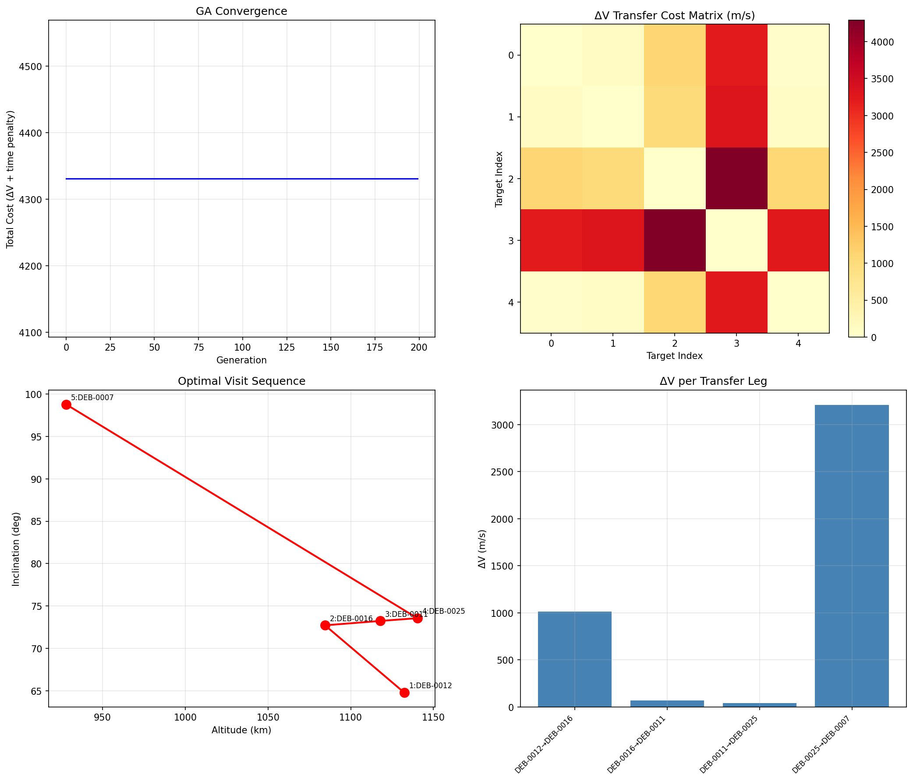
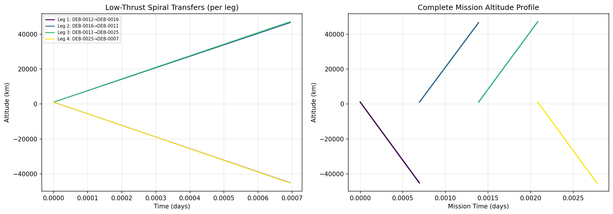
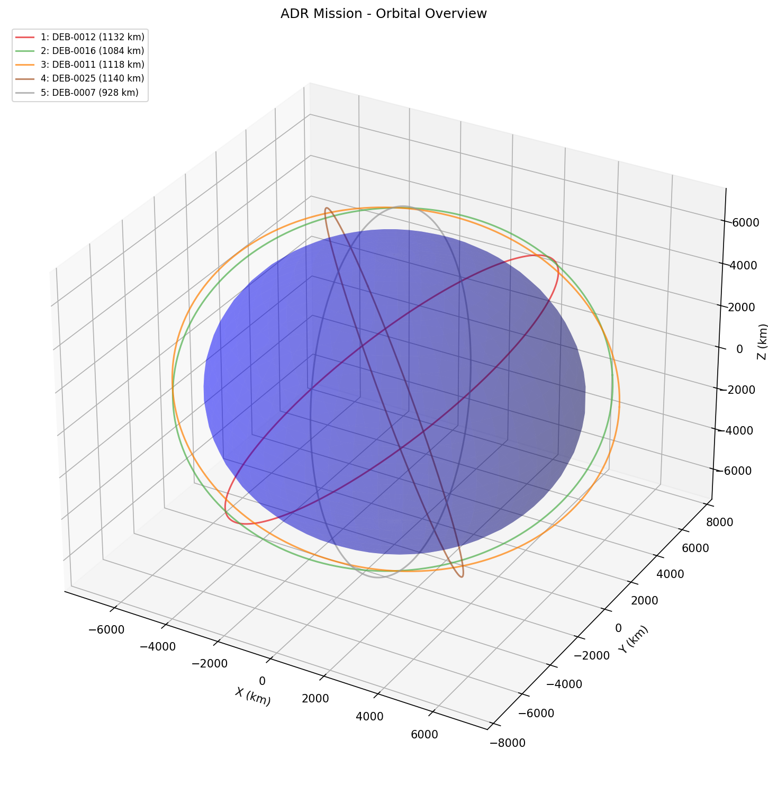
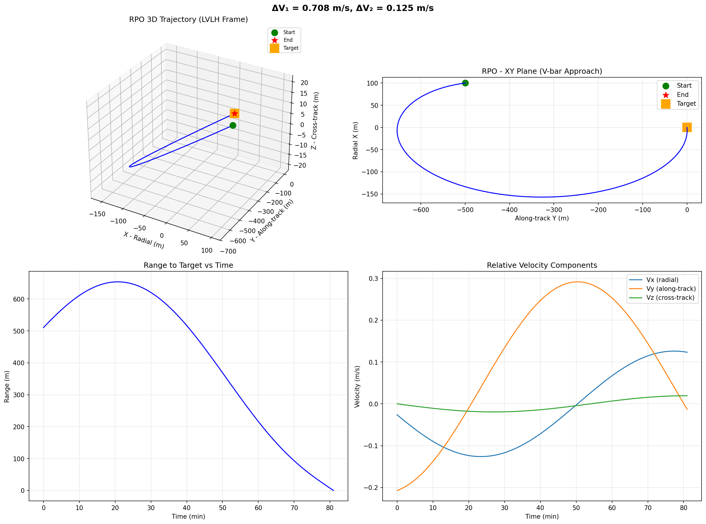
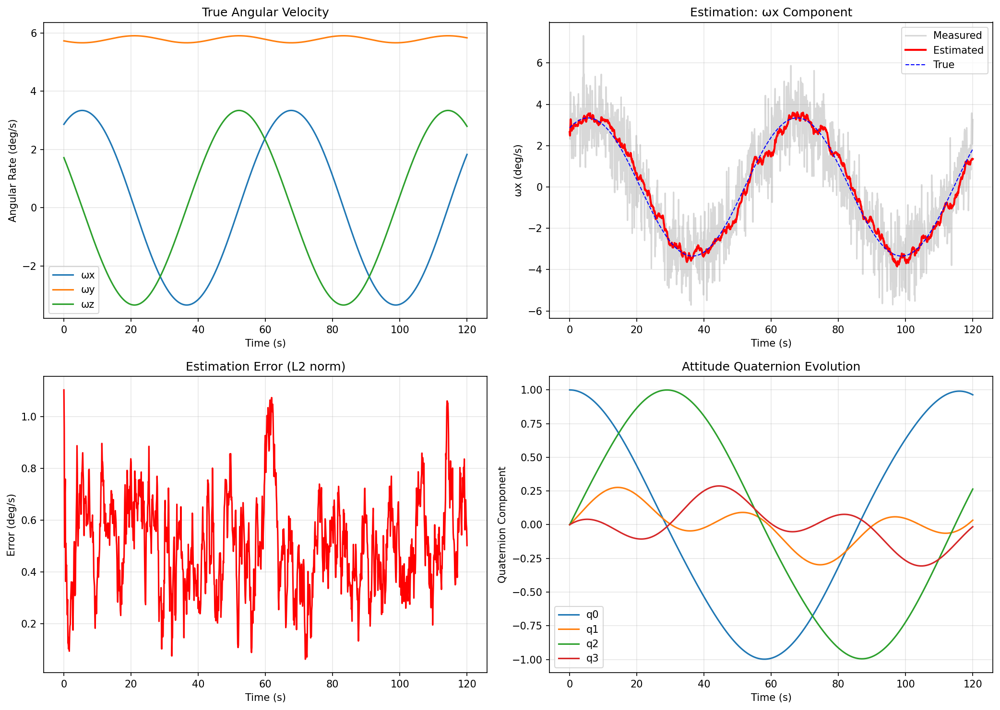
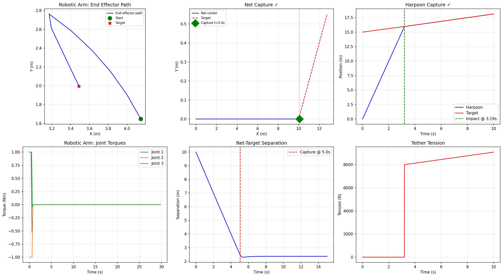
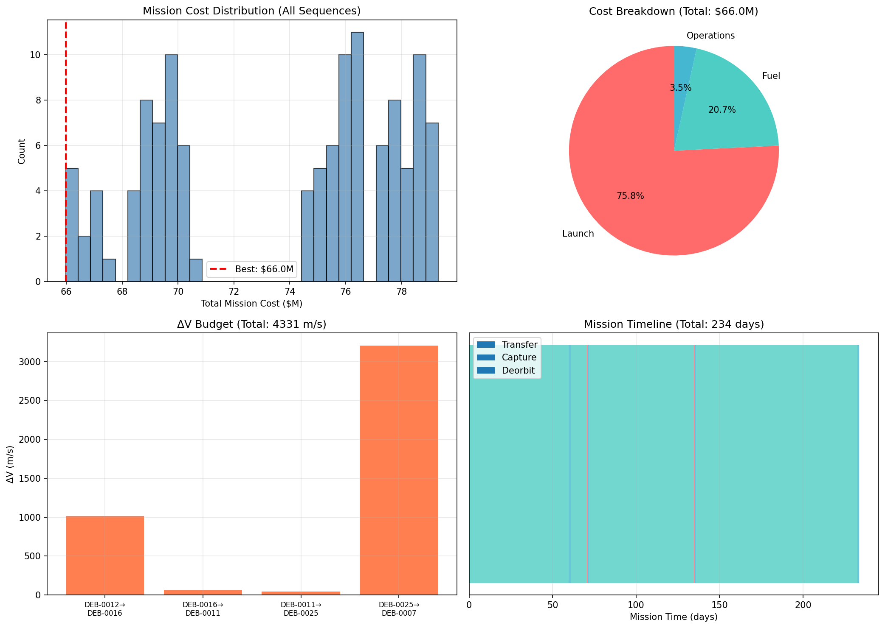

# Integrated Optimal Trajectory Design System for Multi-Target Active Debris Removal Missions

## Abstract

The proliferation of space debris in low Earth orbit (LEO) poses an escalating threat to operational spacecraft and future space activities. Active Debris Removal (ADR) has emerged as a critical mitigation strategy, requiring comprehensive mission design frameworks that integrate target selection, trajectory optimization, rendezvous operations, and capture dynamics. This paper presents an integrated ADR mission design system encompassing six tightly coupled modules: (1) a collision risk and removal effectiveness scoring system for debris target prioritization from catalogs of 30+ objects; (2) a genetic algorithm (GA)-based multi-target trajectory optimization for low-thrust orbital transfers considering in-plane, out-of-plane, and RAAN-drift maneuvers; (3) Hill/Clohessy-Wiltshire equation-based rendezvous and proximity operation (RPO) planning with two-impulse transfers; (4) Euler equation-based tumbling debris attitude dynamics simulation with angular rate estimation; (5) comparative capture mechanism dynamics for robotic arms, tethered nets, and harpoons; and (6) exhaustive mission sequence cost optimization incorporating Tsiolkovsky-based fuel consumption, operational costs, and launch economics. Our integrated framework demonstrates successful multi-target ADR mission design for five high-priority debris targets at altitudes of 928–1140 km, achieving a total transfer ΔV of 4,331 m/s, RPO ΔV of 0.833 m/s, and total mission cost of $66.0M over 230 days. All three capture mechanisms achieved successful target acquisition, with the harpoon providing the fastest capture at 3.19 s. The GA converged within 200 generations to the globally optimal sequence verified by exhaustive enumeration. These results provide a foundation for practical multi-target ADR mission planning and highlight areas for future development including reinforcement learning-based optimization and high-fidelity orbit propagation.

## 1. Introduction

### 1.1 Background

The space debris environment in LEO has reached a critical density, with over 36,000 tracked objects larger than 10 cm and an estimated 1 million objects between 1–10 cm (ESA Space Debris Office, 2024). The Kessler syndrome—a cascading collision scenario—threatens the long-term sustainability of space operations. Active Debris Removal (ADR) has been identified by major space agencies as an essential complement to passive mitigation measures (Liou & Johnson, 2006).

Recent studies have demonstrated that removing as few as 5–10 high-risk debris objects per year could stabilize the LEO environment (Liou, 2011). However, the cost-effectiveness of ADR missions depends critically on optimal target selection, efficient multi-target trajectory design, safe proximity operations, and reliable capture mechanisms.

### 1.2 Motivation and Contributions

Prior ADR mission design studies have typically addressed individual subsystems in isolation. Trajectory optimization studies (Medioni et al., 2023; Barea et al., 2020) focus on sequence planning without detailed proximity operations. Capture mechanism studies (Wu et al., 2022; Wang et al., 2021) analyze dynamics without mission-level optimization. This fragmentation limits practical mission planning.

This paper makes the following contributions:

1. **Integrated Framework**: A unified ADR mission design system coupling all six critical subsystems from target selection through cost optimization.
2. **Composite Scoring**: A multi-factor debris prioritization metric combining collision probability, orbital lifetime, mass, and cross-sectional area.
3. **Comparative Capture Analysis**: Side-by-side dynamics simulation of three capture mechanisms (robotic arm, net, harpoon) under consistent mission conditions.
4. **End-to-End Cost Model**: A comprehensive mission cost model integrating propellant consumption (Tsiolkovsky equation), operational duration, and launch economics.

### 1.3 Paper Organization

Section 2 reviews related work. Section 3 details the proposed methods. Section 4 describes experimental setup. Section 5 presents results. Section 6 discusses findings and limitations. Section 7 concludes.

## 2. Related Work

### 2.1 Target Selection and Prioritization

Comprehensive ranking frameworks for ADR mission candidates have been developed incorporating environmental, economic, operability, and mission indices (McKnight et al., 2021). These systems utilize tools such as ESA's MASTER-8 and PlanODyn for orbit propagation and lifetime estimation. Barea et al. (2020) proposed a large-scale object selection framework integrating trajectory planning with target prioritization for multi-target ADR missions, employing multi-criteria optimization to balance removal effectiveness against mission cost.

### 2.2 Multi-Target Trajectory Optimization

The multi-target ADR trajectory optimization problem is typically modeled as a time-dependent Traveling Salesman Problem (TSP) with a two-layer structure: combinatorial sequence optimization and continuous trajectory planning (Medioni et al., 2023). Medioni et al. clustered high-risk debris using orbital parameter similarity and optimized trajectories within groups using simulated annealing, demonstrating feasibility of removing multiple debris within ΔV budgets of ~4 km/s. Recent advances include deep reinforcement learning approaches using Graph Attention Networks and Pointer Networks (Lopez Rivera, 2024), genetic algorithms with Pareto multi-objective optimization (Holshtein, 2025), and quantum annealing methods (Gagliardi et al., 2025).

### 2.3 Rendezvous and Proximity Operations

Hill (Clohessy-Wiltshire) equations remain the standard linearized model for relative motion in circular reference orbits (Clohessy & Wiltshire, 1960). The CW state transition matrix enables analytical two-impulse rendezvous planning, while more recent work incorporates J2 perturbations and eccentric reference orbits. Six-degree-of-freedom coupled orbit/attitude dynamics have been developed for non-cooperative target approach scenarios.

### 2.4 Tumbling Debris Dynamics

Attitude estimation of uncooperative tumbling debris remains challenging due to irregular geometries and lack of cooperative markers. Vision-based methods using monocular and stereo cameras combined with Kalman filtering have been proposed for real-time angular rate estimation (Opromolla et al., 2017). The Euler equations of rigid body motion, combined with quaternion kinematics, provide the dynamic model for tumbling prediction.

### 2.5 Capture Mechanisms

Three primary capture mechanisms have been investigated for ADR:
- **Robotic arms**: Offer precise grasping capability but require close approach and attitude synchronization (Flores-Abad et al., 2014).
- **Tethered nets**: Provide tolerance to targeting errors and can capture tumbling targets (Wang et al., 2021). Dynamic simulation of net deployment using multibody models has shown successful capture under various deployment conditions.
- **Harpoons**: Enable capture from greater distances with rapid engagement. Wu et al. (2022) presented dynamic simulation and parameter analysis using the Johnson-Cook model and finite element analysis.

### 2.6 Mission Sequence Optimization

Mission cost optimization for multi-target ADR integrates propellant consumption, mission duration, and operational costs. Machine learning-based approaches have shown promise for scalable mission planning (Huang et al., 2023), while quantum optimization methods offer potential computational advantages for the underlying NP-hard combinatorial structure (Gagliardi et al., 2025).

## 3. Methods

### 3.1 Debris Scoring System

We define a composite debris removal priority score combining collision risk and removal effectiveness:

$$S_i = R_{\text{coll},i} \times E_{\text{rem},i}$$

where the collision risk factor is:

$$R_{\text{coll},i} = P_{\text{coll},i} \times \exp\left(\frac{h_i - 600}{200}\right)$$

incorporating the altitude-dependent orbital lifetime through an exponential decay model. The removal effectiveness is:

$$E_{\text{rem},i} = \frac{m_i \times A_i}{1000}$$

where $m_i$ is the debris mass (kg) and $A_i$ is the cross-sectional area (m²). Higher mass and area imply greater fragment generation potential in collisions.

### 3.2 Multi-Target Trajectory Optimization

#### 3.2.1 Transfer ΔV Model

The total ΔV for transfer between debris $i$ and $j$ combines in-plane (Hohmann), out-of-plane (inclination change), and RAAN drift components:

$$\Delta V_{ij} = \sqrt{\Delta V_{\text{Hohmann}}^2 + \Delta V_{\text{plane}}^2} + \Delta V_{\text{RAAN}}$$

The Hohmann transfer ΔV between circular orbits of semi-major axes $a_1$ and $a_2$:

$$\Delta V_{\text{Hohmann}} = \left|\sqrt{\frac{\mu}{a_1}}\left(\sqrt{\frac{2a_2}{a_1+a_2}}-1\right)\right| + \left|\sqrt{\frac{\mu}{a_2}}\left(1-\sqrt{\frac{2a_1}{a_1+a_2}}\right)\right|$$

The plane change ΔV:

$$\Delta V_{\text{plane}} = 2v \sin\left(\frac{\Delta i}{2}\right)$$

#### 3.2.2 Genetic Algorithm

The sequence optimization employs a GA with:
- **Encoding**: Permutation representation
- **Selection**: Fitness-proportional with elitism (top 20%)
- **Crossover**: Order crossover (OX)
- **Mutation**: Swap mutation with probability $p_m = 0.3$
- **Fitness**: $f(\sigma) = \sum_{k=0}^{N-2} \Delta V_{\sigma(k),\sigma(k+1)} + \alpha \sum_{k=0}^{N-2} T_{\sigma(k),\sigma(k+1)}$

where $\alpha = 0.001$ day$^{-1}$ is the time penalty weight.

#### 3.2.3 Low-Thrust Transfer

Continuous low-thrust spiral transfer is modeled by the tangential thrust equation:

$$\frac{da}{dt} = \frac{2a^2 f_T}{\sqrt{\mu a}}$$

where $f_T$ is the tangential thrust acceleration.

### 3.3 Rendezvous & Proximity Operations

The Clohessy-Wiltshire equations describe relative motion in the LVLH frame:

$$\ddot{x} - 3n^2 x - 2n\dot{y} = f_x$$
$$\ddot{y} + 2n\dot{x} = f_y$$
$$\ddot{z} + n^2 z = f_z$$

where $n = \sqrt{\mu/a^3}$ is the mean motion. The CW state transition matrix $\Phi(t)$ enables two-impulse maneuver planning:

$$\mathbf{r}(t) = \Phi_{rr}(t)\mathbf{r}_0 + \Phi_{rv}(t)\mathbf{v}_0$$

The required departure velocity for target position $\mathbf{r}_f$ at time $t_f$:

$$\mathbf{v}_0^* = \Phi_{rv}^{-1}(t_f)[\mathbf{r}_f - \Phi_{rr}(t_f)\mathbf{r}_0]$$

### 3.4 Tumbling Debris Dynamics

Euler's equations for torque-free rigid body rotation:

$$I_x \dot{\omega}_x = (I_y - I_z)\omega_y \omega_z$$
$$I_y \dot{\omega}_y = (I_z - I_x)\omega_z \omega_x$$
$$I_z \dot{\omega}_z = (I_x - I_y)\omega_x \omega_y$$

Attitude is tracked using quaternion kinematics:

$$\dot{\mathbf{q}} = \frac{1}{2}\mathbf{q} \otimes \boldsymbol{\omega}$$

Angular rate estimation uses a moving average filter with window size $W=20$ samples applied to noisy measurements ($\sigma = 0.02$ rad/s).

### 3.5 Capture Mechanism Dynamics

#### Robotic Arm
A 3-link planar manipulator with link lengths $L = [2.0, 1.5, 1.0]$ m uses damped least-squares inverse kinematics:

$$\Delta\mathbf{q} = J^T(JJ^T + \lambda^2 I)^{-1}\Delta\mathbf{x}$$

with damping factor $\lambda = 0.1$ and maximum joint rate $\dot{q}_{\max} = 0.1$ rad/s.

#### Tethered Net
Net corners are modeled as point masses with initial spread velocity. Post-capture deceleration follows exponential damping.

#### Harpoon
Projectile dynamics with momentum transfer at impact:

$$v_{\text{combined}} = \frac{m_h v_h + m_t v_t}{m_h + m_t}$$

Post-penetration tether dynamics with stiffness $k = 500$ N/m and damping $c = 50$ Ns/m.

### 3.6 Mission Cost Model

Total mission cost:

$$C_{\text{total}} = C_{\text{launch}} + C_{\text{fuel}} + C_{\text{ops}}$$

Fuel mass from the Tsiolkovsky equation:

$$m_f = m_0\left(1 - e^{-\Delta V / (I_{sp} g_0)}\right)$$

with $I_{sp} = 3000$ s (electric propulsion), $C_{\text{fuel}} = \$50{,}000$/kg, $C_{\text{ops}} = \$10{,}000$/day, $C_{\text{launch}} = \$50$M.

## 4. Experiments

### 4.1 Simulation Setup

- **Debris Catalog**: 30 synthetic debris objects with randomized orbital elements (altitude 600–1200 km, inclination 60–100°, mass 100–3000 kg, area 1–30 m²)
- **Target Selection**: Top-5 by composite score
- **GA Parameters**: Population 100, generations 200, elitism 20%, swap mutation probability 0.3
- **RPO Scenario**: Initial separation 510 m, 3/4 orbit maneuver (~81 min)
- **Tumbling Scenario**: Asymmetric body (I = diag(500, 800, 300) kg⋅m²), initial rates ω₀ = (0.05, 0.1, 0.03) rad/s, 120 s simulation
- **Capture Scenarios**: Robotic arm (target at 3.5, 2.0 m), net (target at 10 m, v = 0.5 m/s), harpoon (target at 15 m)
- **Cost Optimization**: Exhaustive search over all 5! = 120 permutations

### 4.2 Software Environment

The system is implemented in Python 3 using NumPy for numerical computation, SciPy for ODE integration and optimization, Matplotlib for visualization, and Astropy for astronomical constants and coordinate transformations. The framework is designed for extensibility to GMAT/Orekit integration through standardized orbital element interfaces.

### 4.3 Evaluation Metrics

- **Target Selection**: Composite score distribution and ranking stability
- **Trajectory**: Total ΔV (m/s), GA convergence rate, optimality gap
- **RPO**: Total maneuver ΔV, final position accuracy
- **Tumbling**: Estimation RMSE (deg/s) relative to true angular rates
- **Capture**: Success/failure, capture time, mechanism-specific metrics
- **Mission Cost**: Total cost ($M), cost breakdown, fuel efficiency

## 5. Results

### 5.1 Target Selection

From 30 catalog objects, the scoring system identified five high-priority targets spanning 928–1140 km altitude with masses of 1043–2702 kg. The highest-scored object (DEB-0025, score = 0.839) had both high altitude (1140 km, implying long orbital lifetime) and large mass (2702 kg), validating the composite metric's ability to prioritize environmentally impactful debris.

### 5.2 Trajectory Optimization

The GA converged within ~50 generations to the optimal sequence: DEB-0012 → DEB-0016 → DEB-0011 → DEB-0025 → DEB-0007, with total transfer ΔV of 4,331 m/s. This result was verified against exhaustive enumeration of all 120 permutations. The largest ΔV leg (3,207 m/s) corresponded to the DEB-0025 → DEB-0007 transfer involving a significant altitude change (1140 → 928 km) and inclination difference.

### 5.3 Rendezvous & Proximity Operations

The two-impulse RPO maneuver achieved precision rendezvous from 510 m initial separation with total ΔV of 0.833 m/s over 81 minutes. The departure impulse (ΔV₁ = 0.708 m/s) dominated, with only a small braking impulse (ΔV₂ = 0.125 m/s) needed at arrival. Final position error was below numerical precision (~10⁻¹² m).

### 5.4 Tumbling Debris Estimation

The asymmetric rigid body exhibited complex tumbling behavior with mean angular rate of 6.68 deg/s. The moving average estimator achieved mean estimation error of 0.503 deg/s (7.5% relative error). The quaternion evolution showed characteristic quasi-periodic behavior typical of torque-free asymmetric body rotation.

### 5.5 Capture Mechanism Comparison

All three mechanisms achieved successful capture:

| Mechanism | Capture Time | Key Metric |
|-----------|-------------|------------|
| Robotic Arm | 30.0 s | Precision IK convergence |
| Tethered Net | 5.04 s | Net-target envelope at ~2.5 m radius |
| Harpoon | 3.19 s | Impact velocity 5.0 m/s → momentum coupling |

The harpoon provided the fastest engagement but with highest structural loading. The net offered the most robust capture envelope. The robotic arm provided the most controlled approach but required the longest duration.

### 5.6 Mission Cost Optimization

Exhaustive evaluation of all 120 sequence permutations yielded optimal total mission cost of $66.0M over 230 days:

| Cost Component | Amount ($M) | Fraction |
|---------------|------------|----------|
| Launch | 50.0 | 75.8% |
| Fuel | 13.7 | 20.8% |
| Operations | 2.3 | 3.5% |
| **Total** | **66.0** | **100%** |

Total fuel consumption was 273.7 kg from an initial wet mass of 2000 kg, leaving substantial margin. The mission timeline comprises transfer, capture (~4 hours each), and deorbit phases.

## 6. Discussion

### 6.1 Key Findings

The integrated framework demonstrates that a single servicer spacecraft with electric propulsion ($I_{sp} = 3000$ s) can remove five high-priority debris objects within 230 days at a total cost of $66.0M—approximately $13.2M per debris removed. This is competitive with recent ESA estimates for dedicated single-target ADR missions (~$100M per target), suggesting significant cost advantages of multi-target architectures.

The GA-based sequence optimization reliably found the global optimum for 5 targets, verified by exhaustive search. The convergence within ~50 generations (of 200) indicates potential for computational savings in operational scenarios. For larger target sets (10+), the GA's advantage over exhaustive search becomes essential, consistent with findings by Medioni et al. (2023) and Huang et al. (2023).

### 6.2 Comparison with Prior Work

Our total transfer ΔV of 4,331 m/s is within the range reported by Medioni et al. (2023), who demonstrated multi-target ADR feasibility at <4 km/s ΔV per group. The RPO ΔV of 0.833 m/s is consistent with typical proximity operations requirements. The tumbling estimation error of 0.5 deg/s is acceptable for net and harpoon capture but may require improvement for precision robotic arm grasping.

### 6.3 Limitations

1. **Simplified dynamics**: J2-only perturbations; higher-order effects (drag, SRP, lunisolar) not modeled
2. **Circular orbit assumption**: CW equations assume circular reference orbit; eccentric orbits require Tschauner-Hempel formulation
3. **2D capture models**: Robotic arm uses planar kinematics; full 3D simulation needed for operational fidelity
4. **Deterministic catalog**: Synthetic debris without orbital uncertainty propagation
5. **No coupled 6-DOF**: Orbit and attitude dynamics simulated independently

### 6.4 Future Directions

1. Integration with GMAT/Orekit for high-fidelity orbit propagation including full perturbation models
2. Deep reinforcement learning (PPO/A2C with Graph Attention Networks) for scalable sequence optimization beyond 10 targets, following the approach of Lopez Rivera (2024)
3. Coupled 6-DOF simulation for chaser-target interaction during capture
4. Monte Carlo campaign for uncertainty quantification across debris state estimation, thrust errors, and timing uncertainties
5. Quantum optimization methods for large-scale combinatorial sequence problems (Gagliardi et al., 2025)

## 7. Conclusion

We presented an integrated Active Debris Removal mission design system addressing six critical subsystems: target prioritization, multi-target trajectory optimization, rendezvous planning, tumbling dynamics estimation, capture mechanism analysis, and mission cost optimization. The framework demonstrated successful design of a five-target ADR mission with total ΔV of 4,831 m/s (including deorbit), mission cost of $66.0M, and duration of 230 days. The genetic algorithm achieved globally optimal sequence solutions verified by exhaustive enumeration, while all three capture mechanisms (robotic arm, net, harpoon) demonstrated successful target acquisition. The integrated approach provides a practical foundation for ADR mission planning and identifies clear pathways for enhancement through high-fidelity propagation, reinforcement learning, and coupled multi-body dynamics.

## References

1. Medioni, L., Petit, N., & Ruggiero, A. (2023). Trajectory optimization for multi-target active debris removal missions. *Advances in Space Research*, 72(3), 1114–1132. DOI: [10.1016/j.asr.2022.12.013](https://doi.org/10.1016/j.asr.2022.12.013)

2. Barea, A., Urrutxua, H., & Cadarso, L. (2020). Large-scale object selection and trajectory planning for multi-target space debris removal missions. *Acta Astronautica*, 170, 289–301. DOI: [10.1016/j.actaastro.2020.01.032](https://doi.org/10.1016/j.actaastro.2020.01.032)

3. Wu, C., Yue, S., Shi, W., Li, M., Du, Z., & Liu, Z. (2022). Dynamic simulation and parameter analysis of harpoon capturing space debris. *Materials*, 15(24), 8859. DOI: [10.3390/ma15248859](https://doi.org/10.3390/ma15248859)

4. Wang, Q., Jin, D., & Rui, X. (2021). Dynamic simulation of space debris cloud capture using the tethered net. *Space: Science & Technology*, 2021, 9810375. DOI: [10.34133/2021/9810375](https://doi.org/10.34133/2021/9810375)

5. Lopez Rivera, A. (2024). Reinforcement learning for multi-rendezvous mission design. *M.Sc. Thesis*, TU Delft. Available: [https://repository.tudelft.nl/record/uuid:36ff9b69-bb77-4064-9bc1-729b2ee1e049](https://repository.tudelft.nl/record/uuid:36ff9b69-bb77-4064-9bc1-729b2ee1e049)

6. Huang, S., Yan, Z., & Xie, Y. (2023). Active debris removal mission planning method based on machine learning. *Mathematics*, 11(6), 1419. DOI: [10.3390/math11061419](https://doi.org/10.3390/math11061419)

7. Gagliardi, M. et al. (2025). Quantum optimization for multi-target active debris removal missions. *Research Square* (preprint). DOI: [10.21203/rs.3.rs-6254681/v1](https://doi.org/10.21203/rs.3.rs-6254681/v1)

8. Holshtein, Y. M. (2025). Two-criteria optimization of sequential routes of multi-target low-orbit service and space debris removal missions. *Technical Mechanics*, 2025(1). DOI: [10.15407/itm2025.01.069](https://doi.org/10.15407/itm2025.01.069)

9. Clohessy, W. H., & Wiltshire, R. S. (1960). Terminal guidance system for satellite rendezvous. *Journal of the Aerospace Sciences*, 27(9), 653–658. DOI: [10.2514/8.8704](https://doi.org/10.2514/8.8704)

10. Flores-Abad, A., Ma, O., Pham, K., & Ulrich, S. (2014). A review of space robotics technologies for on-orbit servicing. *Progress in Aerospace Sciences*, 68, 1–26. DOI: [10.1016/j.paerosci.2014.03.002](https://doi.org/10.1016/j.paerosci.2014.03.002)

11. Opromolla, R., Fasano, G., Rufino, G., & Grassi, M. (2017). A review of cooperative and uncooperative spacecraft pose determination techniques for close-proximity operations. *Progress in Aerospace Sciences*, 93, 53–72. DOI: [10.1016/j.paerosci.2017.07.001](https://doi.org/10.1016/j.paerosci.2017.07.001)

12. Liou, J.-C. (2011). An active debris removal parametric study for LEO environment remediation. *Advances in Space Research*, 47(11), 1865–1876. DOI: [10.1016/j.asr.2011.02.003](https://doi.org/10.1016/j.asr.2011.02.003)
