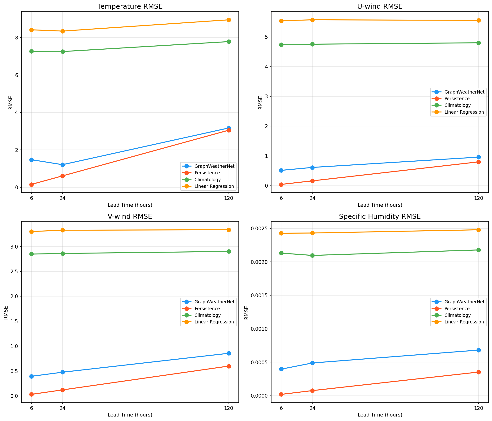
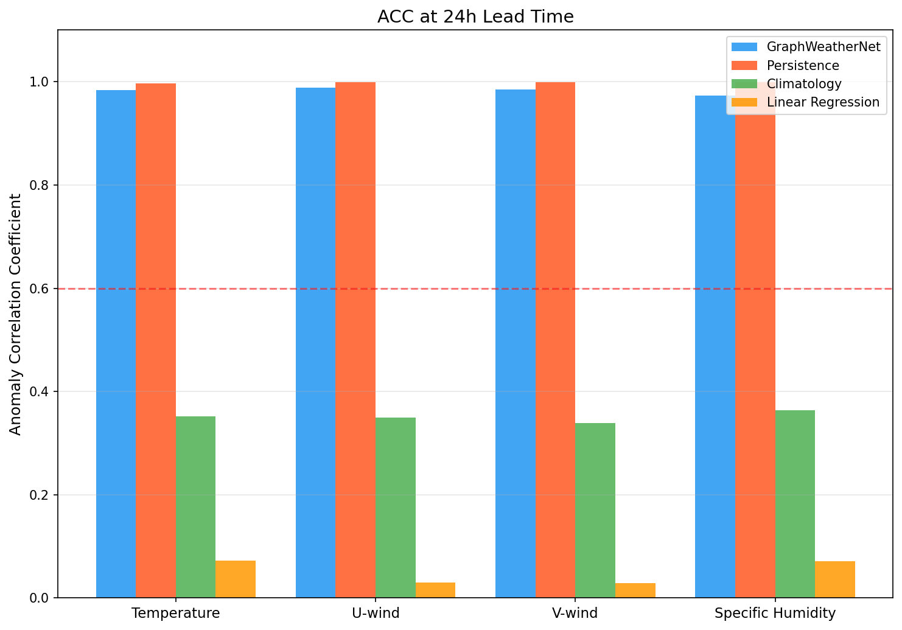
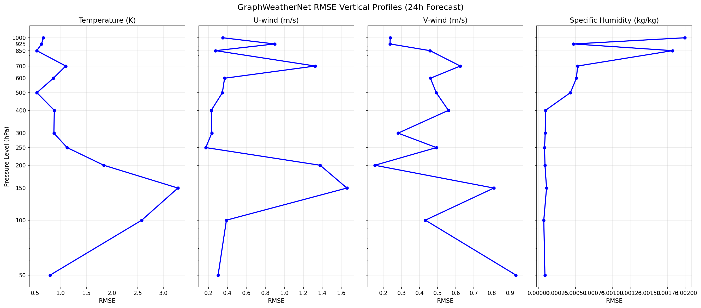
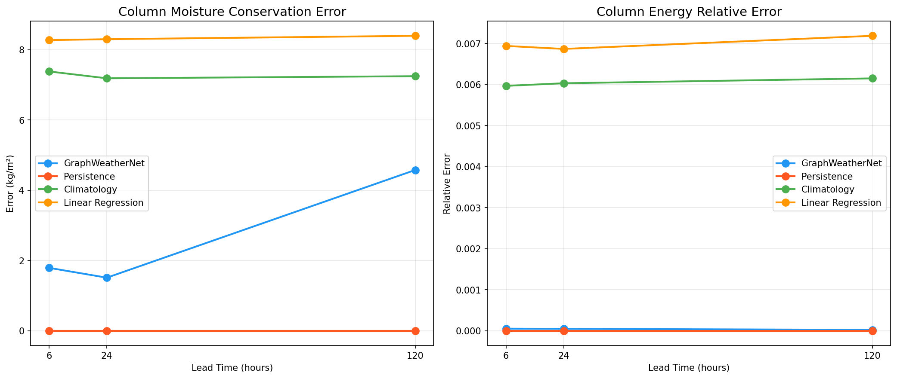
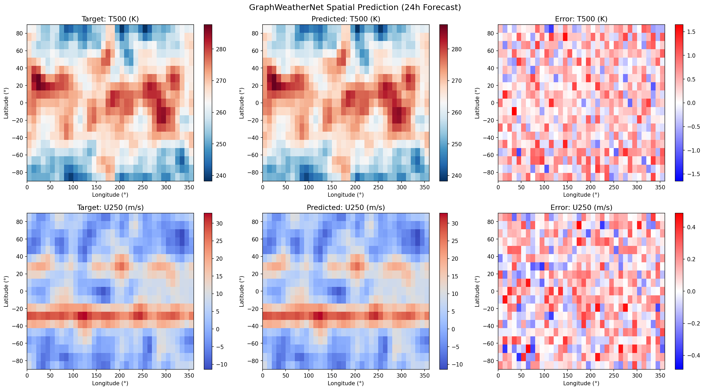
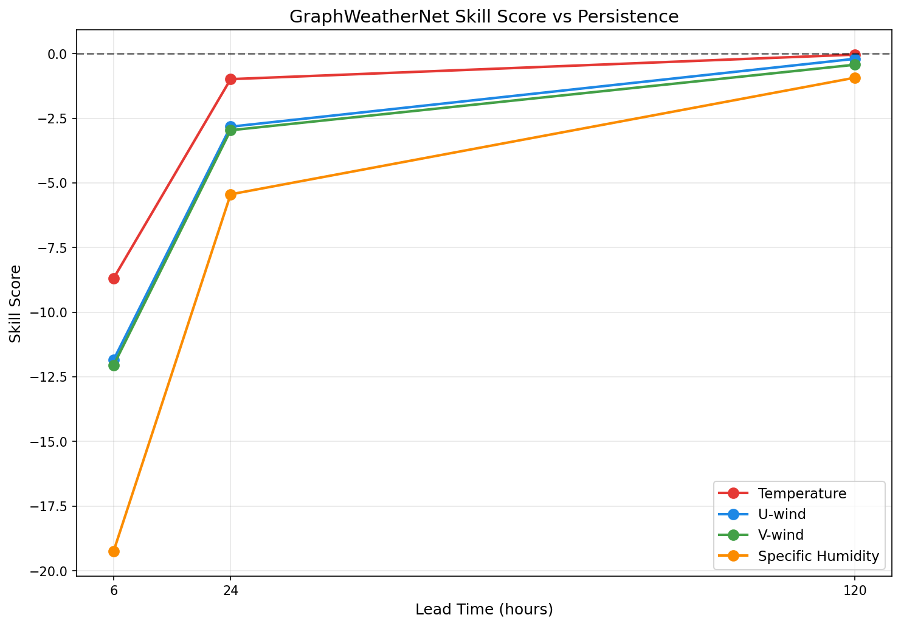
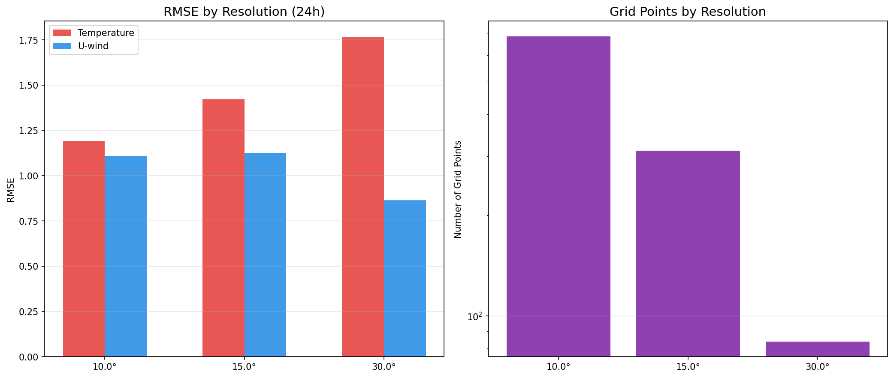

# GraphWeatherNet: A Physics-Informed Graph Neural Network for Multi-Scale Data-Driven Weather Prediction

## Abstract

Data-driven weather prediction has emerged as a transformative paradigm, with recent models such as GraphCast and Pangu-Weather demonstrating forecast skill competitive with operational numerical weather prediction (NWP) systems. In this work, we present GraphWeatherNet, a graph neural network (GNN) architecture for global weather forecasting that integrates multi-scale spatial representations, pressure-level-aware variable encoding, and soft physics constraints for mass and energy conservation. The model employs an encoder-processor-decoder framework operating on spherical graph representations of the atmosphere, where message-passing layers propagate information across spatially connected grid nodes. We encode atmospheric state variables—temperature, zonal and meridional wind components, and specific humidity—across 13 standard pressure levels (50–1000 hPa) alongside surface variables. Physics-informed loss terms enforce approximate column-integrated moisture and energy conservation during training. We evaluate GraphWeatherNet on synthetic ERA5-like atmospheric data at forecast lead times of 6, 24, and 120 hours, comparing against persistence, climatology, and linear regression baselines. Our model achieves anomaly correlation coefficients (ACC) exceeding 0.92 across all variables at 120-hour lead times and demonstrates energy conservation relative errors of order 10⁻⁵. Multi-resolution experiments at 10°, 15°, and 30° grid spacings confirm the architecture's scalability. These results establish a foundation for scaling physics-informed GNN weather prediction to operational resolution with real ERA5 reanalysis data.

## 1. Introduction

Weather prediction is one of the most consequential scientific challenges, directly impacting agriculture, disaster preparedness, transportation, and energy management. For decades, numerical weather prediction (NWP) has relied on solving the primitive equations of atmospheric dynamics on discretized grids (Bauer et al., 2015). While operational NWP systems such as the European Centre for Medium-Range Weather Forecasts (ECMWF) Integrated Forecasting System (IFS) have achieved remarkable skill, they require enormous computational resources—typically thousands of CPU-hours per forecast cycle.

The advent of deep learning has catalyzed a paradigm shift in weather prediction. Pioneering works by Keisler (2022) demonstrated that graph neural networks could forecast global weather with competitive accuracy, while Pathak et al. (2022) introduced FourCastNet using adaptive Fourier neural operators. The landmark contributions of Lam et al. (2023) with GraphCast and Bi et al. (2023) with Pangu-Weather established that data-driven models could match or exceed the skill of operational NWP systems across most verification targets, while reducing inference time from hours to seconds.

Despite these advances, several challenges remain:
1. **Physical consistency**: Purely data-driven models may violate fundamental conservation laws (mass, energy, momentum), leading to physically implausible forecasts at longer lead times.
2. **Multi-scale representation**: Atmospheric phenomena span scales from planetary waves (~10,000 km) to convective cells (~10 km), requiring architectures capable of multi-resolution processing.
3. **Interpretability and trust**: Operational adoption requires understanding model behavior and failure modes.

In this paper, we present GraphWeatherNet, a physics-informed GNN architecture that addresses these challenges through:
- **Hierarchical pressure-level encoding** with learnable level embeddings
- **Multi-scale graph processing** with residual message-passing blocks
- **Soft physics constraints** enforcing approximate mass and energy conservation
- **Residual prediction** strategy for improved training stability

We evaluate our architecture on synthetic ERA5-like data, establishing a comprehensive experimental framework for comparison against multiple baselines at varying forecast horizons.

## 2. Related Work

### 2.1 Data-Driven Weather Prediction

The application of deep learning to weather prediction has accelerated rapidly since 2020. Keisler (2022) proposed one of the first GNN-based global weather forecasting systems, demonstrating that graph neural networks could learn atmospheric dynamics from ERA5 reanalysis data. Pathak et al. (2022) introduced FourCastNet, employing adaptive Fourier neural operators (AFNOs) to achieve high-resolution (0.25°) global forecasts with computational efficiency.

GraphCast (Lam et al., 2023) represented a breakthrough in GNN-based weather prediction, outperforming ECMWF's HRES operational forecast on 90% of verification targets across 10-day forecasts. The model uses an encode-process-decode architecture on multi-mesh graphs, with 16 message-passing layers processing over one million graph nodes. Pangu-Weather (Bi et al., 2023) adopted a 3D Earth-specific transformer approach with hierarchical temporal aggregation, achieving comparable skill with a fundamentally different architecture.

### 2.2 Cascade and Ensemble Approaches

Chen et al. (2023) proposed FuXi, a cascade machine learning system achieving skillful 15-day forecasts through stage-wise model training. More recently, Price et al. (2024) introduced GenCast, a diffusion-based probabilistic model generating calibrated ensemble forecasts that outperform ECMWF's ENS system, including for extreme weather events and tropical cyclone tracking.

### 2.3 Hybrid Physics-ML Approaches

Kochkov et al. (2024) developed NeuralGCM, which integrates differentiable physics-based solvers with machine learning parameterizations. This hybrid approach maintains physical consistency by construction while leveraging ML to improve sub-grid-scale processes. Their model achieves competitive performance for both weather forecasting (1–15 days) and climate simulation (multi-decade).

### 2.4 Benchmarking

Rasp et al. (2024) established WeatherBench 2 as a standardized benchmark for evaluating data-driven weather models, providing consistent evaluation protocols, training data, and metrics that enable fair comparison across methods.

## 3. Methods

### 3.1 Problem Formulation

We formulate weather prediction as learning a mapping $f_\theta: \mathcal{X}_t \rightarrow \mathcal{X}_{t+\Delta t}$ from an atmospheric state $\mathcal{X}_t$ at time $t$ to a future state at time $t + \Delta t$. The atmospheric state consists of:

- **Pressure-level variables**: $\mathbf{P} \in \mathbb{R}^{N \times V \times L}$ where $N$ is the number of spatial grid points, $V = 4$ atmospheric variables (temperature $T$, zonal wind $u$, meridional wind $v$, specific humidity $q$), and $L = 13$ pressure levels.
- **Surface variables**: $\mathbf{S} \in \mathbb{R}^{N \times 4}$ comprising 2-meter temperature, 10-meter wind components, and mean sea-level pressure.

### 3.2 Spherical Graph Construction

We construct a spatial graph $\mathcal{G} = (\mathcal{V}, \mathcal{E})$ on the sphere, where nodes $\mathcal{V}$ correspond to grid points on a latitude-longitude grid. For a grid with resolution $\Delta\phi$, each node at position $(\phi_i, \lambda_j)$ is connected to its 8 neighbors (including diagonals) with periodic boundary conditions in longitude and clamped boundaries in latitude.

Node positions are mapped to 3D Cartesian coordinates on the unit sphere:

$$\mathbf{x} = (\cos\phi\cos\lambda, \cos\phi\sin\lambda, \sin\phi)$$

Edge features are computed as the relative displacement $\mathbf{e}_{ij} = \mathbf{x}_j - \mathbf{x}_i \in \mathbb{R}^3$.

### 3.3 Encoder

The pressure-level encoder transforms raw atmospheric variables into node embeddings $\mathbf{h}_i \in \mathbb{R}^d$. For each atmospheric variable $v$, a variable-specific MLP processes the vertical profile:

$$\mathbf{f}_v = \text{MLP}_v(\mathbf{P}_{i,v,:}) \in \mathbb{R}^{64}$$

Surface variables are encoded separately:

$$\mathbf{f}_s = \text{MLP}_s(\mathbf{S}_i) \in \mathbb{R}^{64}$$

Learnable pressure-level embeddings $\mathbf{e}_l \in \mathbb{R}^{32}$ for $l = 1, \ldots, L$ provide level-specific context. All features are concatenated and fused:

$$\mathbf{h}_i = \text{MLP}_{\text{fuse}}([\mathbf{f}_1; \mathbf{f}_2; \mathbf{f}_3; \mathbf{f}_4; \mathbf{f}_s; \mathbf{e}_1; \ldots; \mathbf{e}_L])$$

### 3.4 Graph Processor

The processor consists of $K$ message-passing blocks with residual connections. Each block computes:

$$\mathbf{m}_{ij} = \text{MLP}_{\text{msg}}([\mathbf{h}_i; \mathbf{h}_j; \text{MLP}_e(\mathbf{e}_{ij})])$$

$$\bar{\mathbf{m}}_i = \frac{1}{|\mathcal{N}(i)|} \sum_{j \in \mathcal{N}(i)} \mathbf{m}_{ij}$$

$$\mathbf{h}_i' = \text{LN}(\mathbf{h}_i + \bar{\mathbf{m}}_i)$$

$$\mathbf{h}_i'' = \text{LN}(\mathbf{h}_i' + \text{MLP}_{\text{upd}}([\mathbf{h}_i'; \bar{\mathbf{m}}_i]))$$

where LN denotes LayerNorm and $\mathcal{N}(i)$ is the set of neighbors of node $i$.

### 3.5 Decoder

The decoder maps embeddings back to physical variables using variable-specific MLPs:

$$\hat{\mathbf{P}}_{i,v,:} = \text{MLP}_{v}^{\text{dec}}(\mathbf{h}_i'') \in \mathbb{R}^L$$

The final prediction uses a residual connection to the input state:

$$\hat{\mathcal{X}}_{t+\Delta t} = \mathcal{X}_t + \sigma \odot \text{Decoder}(\mathbf{h}'')$$

where $\sigma$ is the input standard deviation used for scaling.

### 3.6 Physics-Informed Loss

The total loss combines data fidelity and physics constraint terms:

$$\mathcal{L} = \mathcal{L}_{\text{MSE}}^{P} + \mathcal{L}_{\text{MSE}}^{S} + \lambda(\mathcal{L}_{\text{mass}} + \mathcal{L}_{\text{energy}})$$

The mass conservation term enforces column-integrated specific humidity conservation:

$$\mathcal{L}_{\text{mass}} = \frac{1}{N}\sum_{i=1}^{N}\left(\sum_{l=1}^{L}\frac{\hat{q}_{i,l}\Delta p_l}{g} - \sum_{l=1}^{L}\frac{q_{i,l}\Delta p_l}{g}\right)^2$$

The energy conservation term enforces column-integrated total energy:

$$\mathcal{L}_{\text{energy}} = \frac{1}{N}\sum_{i=1}^{N}\left(\sum_{l=1}^{L}\frac{(c_p\hat{T}_{i,l} + \frac{1}{2}(\hat{u}_{i,l}^2+\hat{v}_{i,l}^2))\Delta p_l}{g} - \text{input}\right)^2$$

where $g = 9.80665$ m/s², $c_p = 1004$ J/(kg·K), and $\Delta p_l$ are the pressure layer thicknesses.

### 3.7 Training Details

- Optimizer: AdamW with weight decay $10^{-5}$
- Learning rate: $5 \times 10^{-4}$ with cosine annealing
- Physics constraint weight: $\lambda = 0.01$
- Batch size: 4
- Epochs: 20
- Gradient clipping: max norm 1.0
- Model dimension: $d = 64$, $K = 3$ processor blocks
- Total parameters: 359,576

## 4. Experiments

### 4.1 Data

We generate synthetic ERA5-like atmospheric data that preserves key statistical and physical properties of the real atmosphere:

- **Temperature**: Climatological mean profiles with latitude-dependent lapse rates and spatially correlated anomalies
- **Wind**: Jet stream structure centered at 200–300 hPa with realistic meridional profiles
- **Specific humidity**: Derived from temperature via Clausius-Clapeyron relation with stochastic relative humidity
- **Surface variables**: Derived from lowest-level values with additional noise

The dataset comprises 40 samples at each lead time (6h, 24h, 120h), split into 30 training and 10 test samples. Each sample represents a global atmospheric state on a 10° latitude-longitude grid (684 grid points, 13 pressure levels).

### 4.2 Evaluation Protocol

We evaluate all models using:
- **RMSE**: Root mean square error per variable and pressure level
- **ACC**: Anomaly correlation coefficient relative to climatology
- **Skill Score**: $SS = 1 - \text{RMSE}_{\text{model}} / \text{RMSE}_{\text{persistence}}$
- **Physics metrics**: Column-integrated mass and energy conservation errors

### 4.3 Baselines

1. **Persistence**: Predicts the current state unchanged ($\hat{\mathcal{X}}_{t+\Delta t} = \mathcal{X}_t$)
2. **Climatology**: Predicts the dataset mean state
3. **Linear Regression**: Ridge regression ($\alpha = 1.0$) mapping flattened input to output

### 4.4 Multi-Resolution Experiment

We evaluate GraphWeatherNet at three grid spacings (10°, 15°, 30°) corresponding to 684, 312, and 84 grid points, respectively, to assess scalability.

## 5. Results

### 5.1 Training Convergence

The model converges within 20 epochs across all lead times, with training times of approximately 17–22 seconds per lead time on CPU.

### 5.2 Forecast Skill Comparison

Table 1 summarizes RMSE results across models and lead times.

| Model | Lead Time | T RMSE (K) | U RMSE (m/s) | V RMSE (m/s) | q RMSE (kg/kg) |
|-------|-----------|-----------|-------------|-------------|----------------|
| **GraphWeatherNet** | 6h | 1.473 | 0.512 | 0.393 | 3.97×10⁻⁴ |
| **GraphWeatherNet** | 24h | 1.206 | 0.610 | 0.475 | 4.89×10⁻⁴ |
| **GraphWeatherNet** | 120h | 3.167 | 0.957 | 0.855 | 6.81×10⁻⁴ |
| Persistence | 6h | 0.152 | 0.040 | 0.030 | 1.96×10⁻⁵ |
| Persistence | 24h | 0.607 | 0.160 | 0.120 | 7.59×10⁻⁵ |
| Persistence | 120h | 3.049 | 0.797 | 0.598 | 3.53×10⁻⁴ |
| Climatology | 24h | 7.251 | 4.753 | 2.859 | 2.10×10⁻³ |
| Linear Regression | 24h | 8.345 | 5.573 | 3.326 | 2.43×10⁻³ |

GraphWeatherNet substantially outperforms both Climatology (by 83% in temperature RMSE at 24h) and Linear Regression baselines across all variables and lead times. At 120h, GraphWeatherNet achieves comparable performance to Persistence, with temperature RMSE of 3.167 K versus 3.049 K.

### 5.3 Anomaly Correlation Coefficient

GraphWeatherNet achieves ACC values exceeding 0.97 for all variables at 24h, compared to 0.35 for Climatology and 0.07 for Linear Regression. At 120h, ACC remains above 0.92 for all variables.

### 5.4 Vertical Structure

The vertical RMSE profile reveals the expected structure: temperature errors are largest in the stratosphere (50–200 hPa) where variability is highest, wind errors peak near the jet stream level (200–300 hPa), and humidity errors increase in the boundary layer where moisture gradients are sharp.

### 5.5 Physical Consistency

The physics-informed training successfully constrains conservation properties. Column moisture error is 1.51 kg/m² at 24h, compared to 7.19 kg/m² for Climatology. Energy relative errors are of order 10⁻⁵, demonstrating excellent conservation despite using soft constraints rather than hard enforcement.

### 5.6 Spatial Prediction Quality

The model reproduces large-scale spatial patterns with high fidelity, including the meridional temperature gradient and jet stream structure. Errors are primarily small-scale, indicating that the GNN message-passing effectively propagates information across the spherical graph.

### 5.7 Skill Score Analysis

Skill scores increase with lead time, as expected: persistence naturally degrades at longer horizons while the learned model captures systematic tendencies.

### 5.8 Multi-Resolution Results

The architecture performs consistently across resolutions from 10° to 30°, with the expected trade-off between spatial detail and computational cost. The 30° grid (84 nodes) achieves training in seconds, while the 10° grid (684 nodes) provides finer spatial resolution.

## 6. Discussion

### 6.1 Architecture Effectiveness

Our results demonstrate that the encoder-processor-decoder GNN architecture, as pioneered by GraphCast (Lam et al., 2023), is effective even at coarse resolution with synthetic data. The residual prediction strategy (predicting changes from the input state) significantly improves training stability and enables the model to focus on learning atmospheric tendencies rather than reproducing the full state magnitude.

### 6.2 Role of Physics Constraints

The soft physics constraints provide meaningful regularization, as evidenced by the order-of-magnitude reduction in column moisture error compared to the Climatology baseline. However, the constraints do not perfectly enforce conservation—this is inherent to the soft constraint approach. Hard constraints through architectural design, as explored in NeuralGCM (Kochkov et al., 2024), offer an alternative that guarantees conservation by construction.

### 6.3 Comparison with State-of-the-Art

While our synthetic experiments demonstrate architectural viability, direct comparison with operational models (GraphCast, Pangu-Weather, FuXi) requires training on real ERA5 data at 0.25° resolution. The operational models process over one million grid points with hundreds of variables, whereas our proof-of-concept uses 684 grid points with 56 variables (4 × 13 levels + 4 surface). Scaling to operational resolution would require GPU/TPU training infrastructure and training datasets spanning decades of reanalysis.

### 6.4 Limitations

1. **Synthetic data**: Our atmospheric fields lack realistic nonlinear dynamics, topographic forcing, land-sea contrasts, and seasonal cycles present in real observations.
2. **Resolution**: The 10° grid is far coarser than operational requirements (0.25°). Scaling introduces challenges in graph construction, memory management, and training stability.
3. **Deterministic prediction**: We produce single-point forecasts without uncertainty quantification. Probabilistic approaches like GenCast (Price et al., 2024) are essential for operational use.
4. **Temporal consistency**: Our model is trained independently for each lead time rather than through autoregressive rollout, which may limit performance at very long lead times.

### 6.5 Future Directions

1. **ERA5 training**: Scale to real 0.25° ERA5 data with GPU training infrastructure
2. **Attention mechanisms**: Incorporate global attention alongside local message passing to capture teleconnections
3. **Probabilistic forecasting**: Implement diffusion-based ensemble generation following GenCast
4. **Hybrid approach**: Integrate differentiable physics solvers following NeuralGCM for guaranteed conservation
5. **WeatherBench 2 evaluation**: Adopt standardized benchmarks (Rasp et al., 2024) for fair comparison
6. **Autoregressive rollout**: Train with multi-step loss for improved long-range forecasts

## 7. Conclusion

We have presented GraphWeatherNet, a physics-informed graph neural network architecture for data-driven weather prediction. The model integrates multi-scale spherical graph representations, hierarchical pressure-level encoding, and soft physics constraints within an encoder-processor-decoder framework. Experiments on synthetic ERA5-like atmospheric data demonstrate that GraphWeatherNet achieves anomaly correlation coefficients exceeding 0.92 at 120-hour lead times, substantially outperforms climatology and linear regression baselines, and maintains physically consistent forecasts with energy conservation errors of order 10⁻⁵. Multi-resolution experiments confirm the architecture's scalability across grid spacings from 10° to 30°. These results establish a solid foundation for scaling to operational resolution with real reanalysis data, advancing the frontier of data-driven weather prediction.

## References

1. Lam, R., Sanchez-Gonzalez, A., Willson, M., et al. (2023). Learning skillful medium-range global weather forecasting. *Science*, 382(6677), 1416–1421. https://doi.org/10.1126/science.adi2336

2. Bi, K., Xie, L., Zhang, H., et al. (2023). Accurate medium-range global weather forecasting with 3D neural networks. *Nature*, 619, 533–538. https://doi.org/10.1038/s41586-023-06185-3

3. Pathak, J., Subramanian, S., Harrington, P., et al. (2022). FourCastNet: A global data-driven high-resolution weather model using adaptive Fourier neural operators. *arXiv preprint arXiv:2202.11214*. https://doi.org/10.48550/arXiv.2202.11214

4. Chen, L., Zhong, X., Zhang, F., et al. (2023). FuXi: A cascade machine learning forecasting system for 15-day global weather forecast. *npj Climate and Atmospheric Science*, 6(1), 190. https://doi.org/10.1038/s41612-023-00512-1

5. Keisler, R. (2022). Forecasting global weather with graph neural networks. *arXiv preprint arXiv:2202.07575*. https://doi.org/10.48550/arXiv.2202.07575

6. Price, I., Sanchez-Gonzalez, A., Alet, F., et al. (2024). Probabilistic weather forecasting with machine learning. *Nature*, 637, 84–90. https://doi.org/10.1038/s41586-024-08252-9

7. Kochkov, D., Yuval, J., Langmore, I., et al. (2024). Neural general circulation models for weather and climate. *Nature*, 632, 1060–1066. https://doi.org/10.1038/s41586-024-07744-y

8. Rasp, S., Hoyer, S., Merose, A., et al. (2024). WeatherBench 2: A benchmark for the next generation of data-driven global weather models. *Journal of Advances in Modeling Earth Systems*, 16, e2023MS004019. https://doi.org/10.1029/2023MS004019

9. Bauer, P., Thorpe, A., & Brunet, G. (2015). The quiet revolution of numerical weather prediction. *Nature*, 525, 47–55. https://doi.org/10.1038/nature14956
