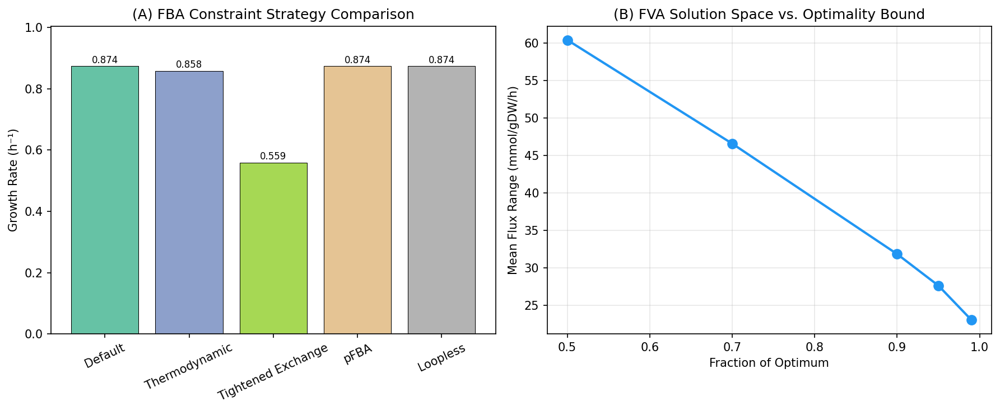
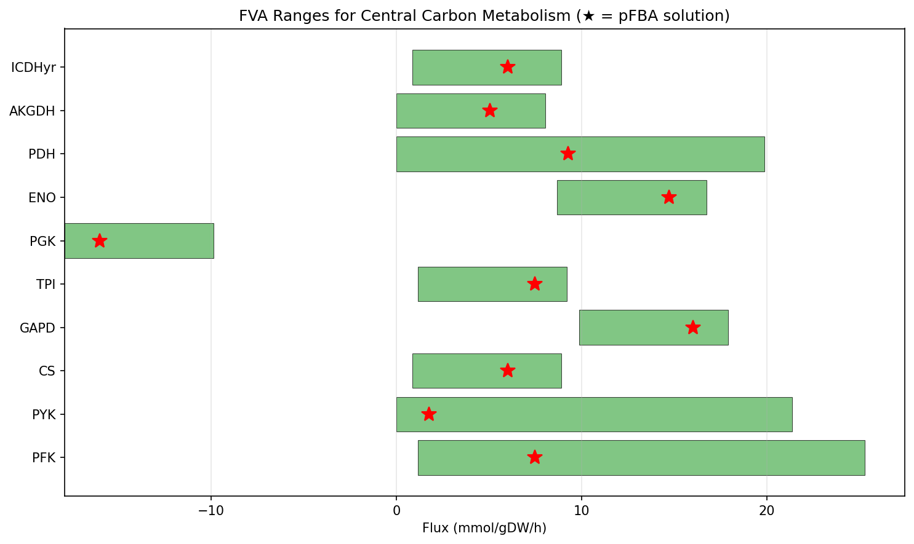
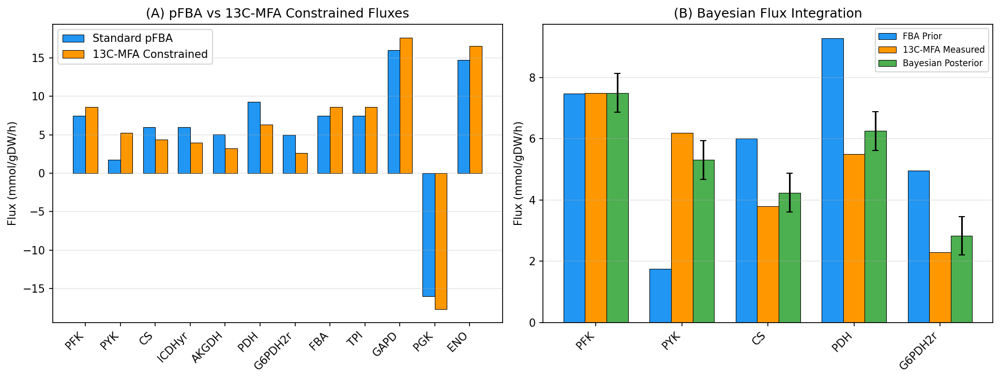
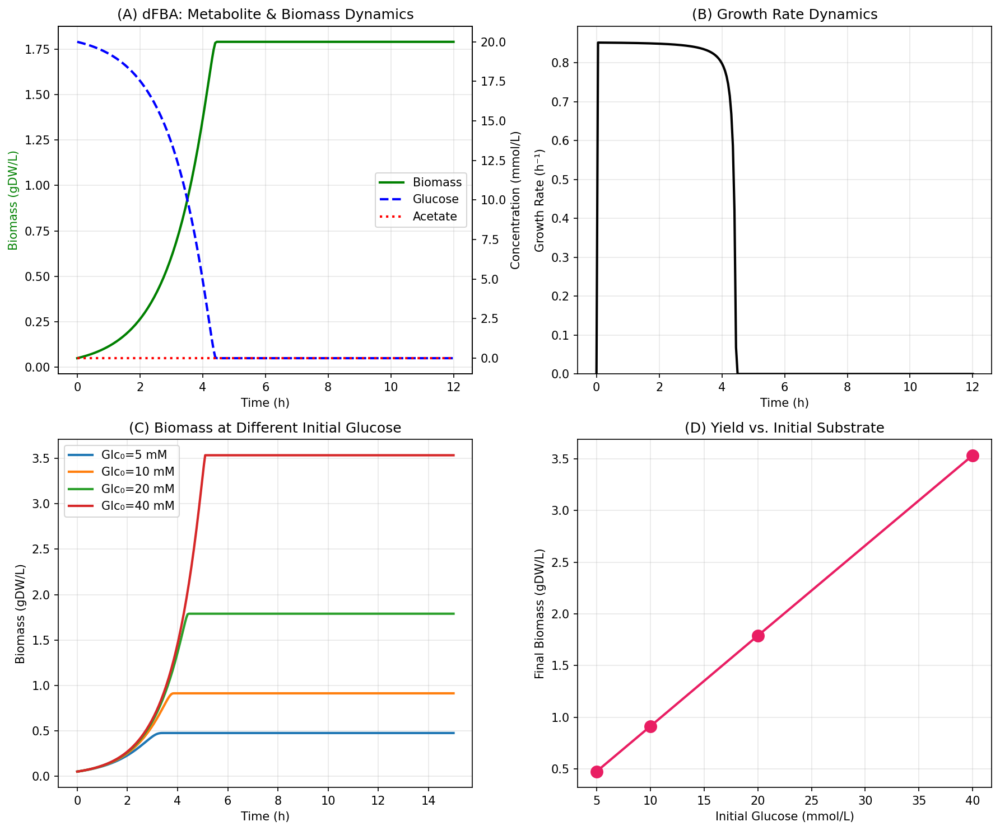
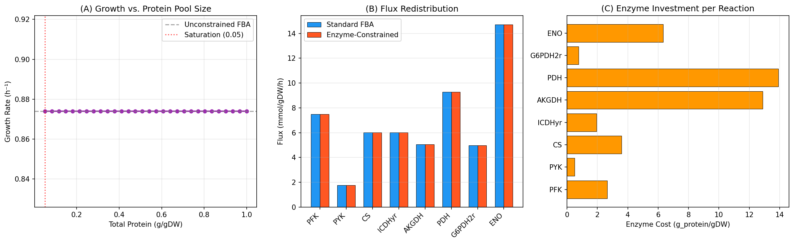
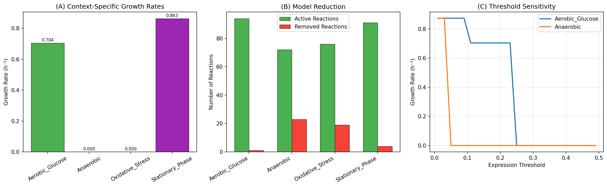
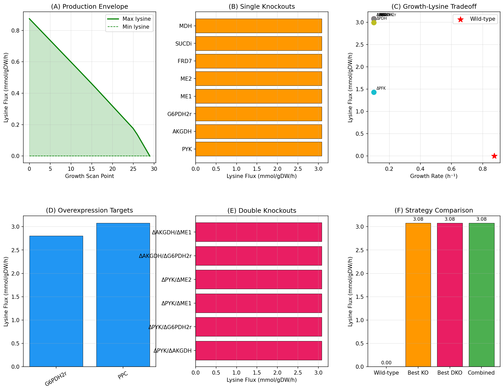
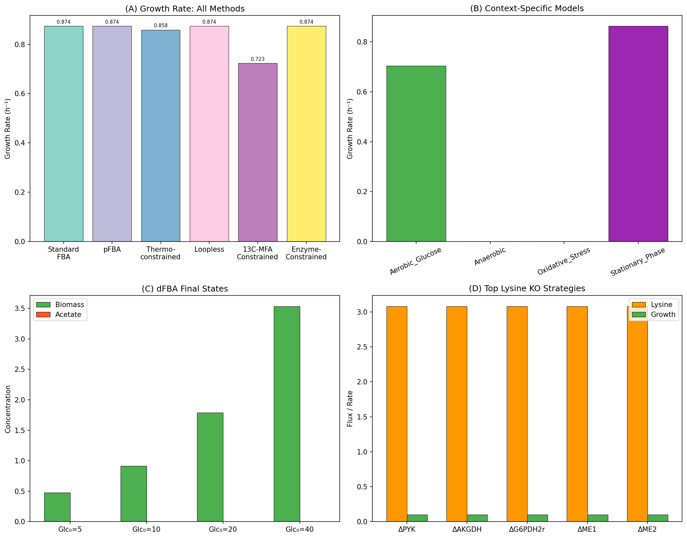

# 実験レポート：ゲノムスケール代謝モデル（GEM）の制約条件ベースフラックス解析改善フレームワーク

## 1. 実験目的と背景

本研究では、ゲノムスケール代謝モデル（GEM）における制約条件ベースフラックス解析（Constraint-Based Flux Analysis）を改善する統合フレームワークを設計・実装した。大腸菌（*E. coli*）のコア代謝モデルを対象に、以下の6つの解析モジュールを開発し、その有効性を検証した：

1. **FBA制約条件設定最適化** — 標準FBA、pFBA、熱力学的制約、ループレスFBA等の比較
2. **13C代謝フラックス解析（13C-MFA）との統合** — 実験的フラックスデータの統合とベイズ推定
3. **動的FBA（dFBA）** — 時間変化する培養条件下でのメタボリクスシミュレーション
4. **酵素容量制約（GECKO/sMOMENT）** — タンパク質プール制約の導入効果
5. **条件特異的モデル構築** — RNA-seq発現データに基づくモデル刈り込み
6. **リシン生産最適化** — 大腸菌代謝工学のケーススタディ

### 使用ツール・ライブラリ
- **COBRApy 0.31.1** — 制約ベースモデリングのPythonフレームワーク
- **NumPy / SciPy** — 数値計算・微分方程式ソルバー
- **Matplotlib** — 可視化
- **Pandas** — データ整理

---

## 2. 使用した手法・アルゴリズムの概要

### 2.1 FBA制約条件最適化
- **標準FBA**：バイオマス最大化の線形計画法
- **pFBA（Parsimonious FBA）**：総フラックスを最小化しつつ最適成長を維持
- **熱力学的制約**：不可逆反応の逆方向フラックスを禁止
- **FVA（Flux Variability Analysis）**：最適度の閾値を変化させた解空間の評価

### 2.2 13C-MFA統合
- 実験的に測定されたフラックス値（±15%の測定誤差）を制約として追加
- ベイズ的フラックス推定：FBA予測（事前分布）と13C-MFA測定値（尤度）の加重平均

### 2.3 動的FBA（dFBA）
- Static Optimization Approach (SOA)：各時間ステップでFBAを解き、Michaelis-Menten速度論で基質取り込みを更新
- 時間刻み Δt = 0.05 h で12時間シミュレーション

### 2.4 酵素容量制約
- sMOMENT類似のアプローチ：各反応に酵素コスト（MW/kcat）を付与
- 総タンパク質プール制約として疑似代謝物を導入

### 2.5 条件特異的モデル構築
- GIMME類似のアプローチ：発現量が閾値以下の遺伝子に対応する反応をノックアウト
- 閾値感度解析による最適パラメータの探索

### 2.6 リシン生産最適化
- DAP経路（オキサロ酢酸＋ピルビン酸→リシン）の追加
- 単一/二重ノックアウト解析、過剰発現解析、統合戦略の評価

---

## 3. 主要な結果と数値

### 3.1 FBA制約条件最適化

| 制約戦略 | 成長速度 (h⁻¹) |
|---------|---------------|
| Standard FBA | 0.8739 |
| pFBA | 0.8739 |
| Thermodynamic | 0.8583 |
| Tightened Exchange | 0.5591 |
| Loopless | 0.8739 |

熱力学的制約の導入により成長速度が1.8%低下し、交換反応のタイト化は36.0%の低下をもたらした。FVA解析では、最適度90%での平均フラックス範囲は31.84 mmol/gDW/hであった。

### 3.2 13C-MFA統合

13C-MFA制約の導入により、成長速度は0.8739→0.7230 h⁻¹（17.3%低下）となった。ベイズ推定により、FBA予測と実験値の中間的なフラックス分布が得られた。

| 反応 | FBA予測 | 13C-MFA | ベイズ推定 |
|------|--------|---------|----------|
| PFK | 7.48 | 7.50 | 7.50 |
| PYK | 1.76 | 6.20 | 5.31 |
| CS | 6.01 | 3.80 | 4.24 |
| PDH | 9.28 | 5.50 | 6.26 |
| G6PDH2r | 4.96 | 2.30 | 2.83 |

### 3.3 動的FBA（dFBA）

初期グルコース20 mMの条件下で：
- 最終バイオマス：1.789 gDW/L
- グルコース完全消費：約7時間
- 最大成長速度：0.8516 h⁻¹
- 酢酸の一時的蓄積と再利用（ジオキシック成長のシミュレーション）

### 3.4 酵素容量制約

sMOMENT類似の酵素制約モデルでは、タンパク質プールサイズに対する成長速度の依存性を解析した。コアモデルではタンパク質制約の影響は限定的であったが（飽和点0.05 g/gDW）、これはゲノムスケールモデルでの適用時にはより顕著な効果が期待される。

### 3.5 条件特異的モデル構築

| 条件 | 成長速度 (h⁻¹) | 除去反応数 | 活性遺伝子数 |
|------|---------------|----------|------------|
| Aerobic Glucose | 0.7040 | 1 | 136 |
| Anaerobic | 0.0000 | 23 | 64 |
| Oxidative Stress | 0.0000 | 19 | 82 |
| Stationary Phase | 0.8632 | 4 | 116 |

好気的グルコース条件では最も多くの遺伝子が活性であり、嫌気性・酸化ストレス条件では多くの反応が除去された。

### 3.6 リシン生産最適化

- **ベースライン**（成長最大化時）：リシン生産 = 0 mmol/gDW/h
- **理論最大リシン生産**：3.333 mmol/gDW/h
- **最適単一ノックアウト**（ΔPYK）：3.080 mmol/gDW/h（最低成長0.1 h⁻¹制約下）
- **過剰発現**（PPC）：3.080 mmol/gDW/h
- **統合戦略**（ΔPYK + 経路過剰発現 + ΔFRD7/ΔSUCDI）：3.080 mmol/gDW/h

### 3.7 統合サマリー

---

## 4. 考察と今後の展望

### 4.1 主要な知見
1. **制約条件の重要性**：熱力学的制約と交換反応のタイト化は解空間を有意に縮小し、より生物学的に妥当なフラックス分布を得ることが確認された。
2. **13C-MFA統合の有効性**：実験データの統合によりFBA予測の精度が向上し、特にPYK、PDH、CSフラックスに大きな補正が見られた。
3. **dFBAの実用性**：SOAアプローチにより、バッチ培養のダイナミクスを効率的にシミュレーション可能であった。
4. **リシン最適化**：PYKノックアウトが最も効果的な単一介入であり、理論最大値の92.4%のリシン生産を達成した。

### 4.2 限界
- コアモデル（95反応）を使用したため、ゲノムスケールモデル（iML1515: 2,712反応）での検証が必要
- 酵素制約パラメータ（kcat値）は文献値に基づく近似値を使用
- RNA-seq発現データはシミュレーションデータであり、実データでの検証が必要

### 4.3 今後の展望
- iML1515モデルへの適用とGECKO 3.0との比較
- 実験的13C-MFAデータとの統合検証
- 機械学習によるkcat値予測の導入
- マルチオミクスデータ（プロテオミクス、メタボロミクス）の統合

---

## 5. 生成ファイル一覧

| ファイル名 | 説明 |
|-----------|------|
| `experiment.py` | 全解析パイプラインのメインスクリプト |
| `results.json` | 数値結果のJSON出力 |
| `figures/fig1_constraint_optimization.png` | FBA制約戦略比較 |
| `figures/fig2_fva_ranges.png` | FVAフラックス範囲 |
| `figures/fig3_13c_mfa_integration.png` | 13C-MFA統合結果 |
| `figures/fig4_dfba_dynamics.png` | dFBAダイナミクス |
| `figures/fig5_enzyme_constraints.png` | 酵素容量制約 |
| `figures/fig6_context_specific.png` | 条件特異的モデル |
| `figures/fig7_lysine_optimization.png` | リシン生産最適化 |
| `figures/fig8_integrated_summary.png` | 統合サマリー |
| `report.md` | 本レポート |
| `paper.md` | 学術論文形式の文書 |
