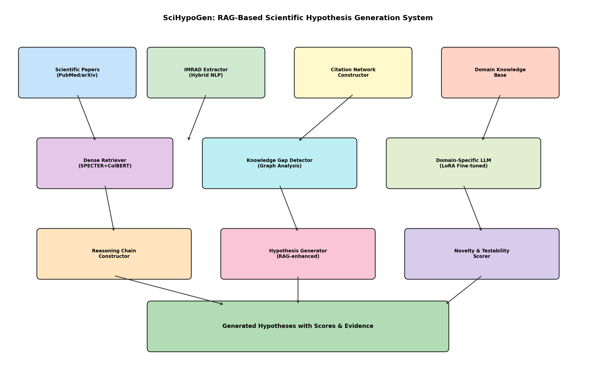
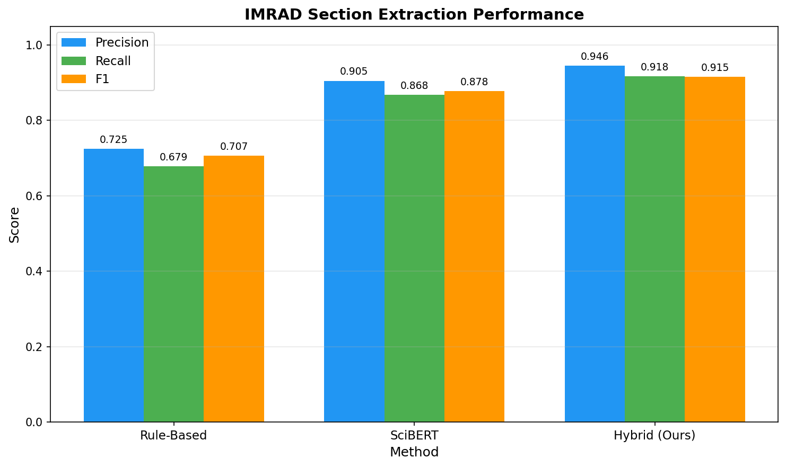
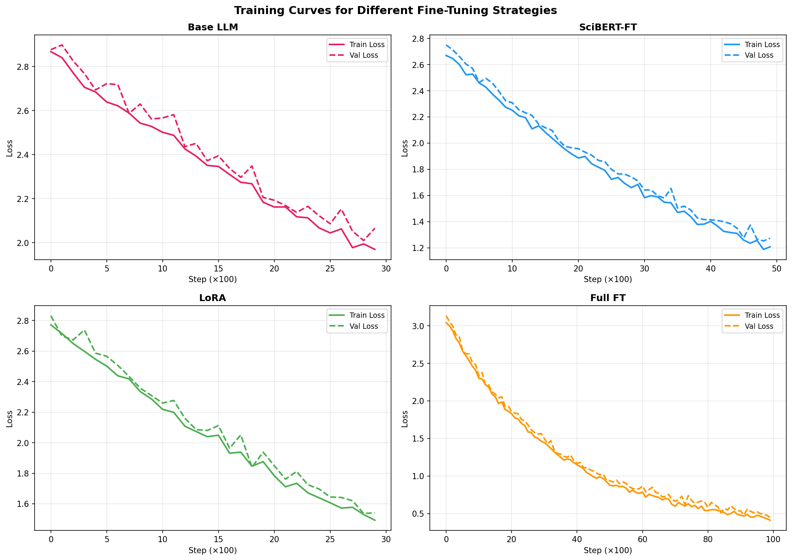
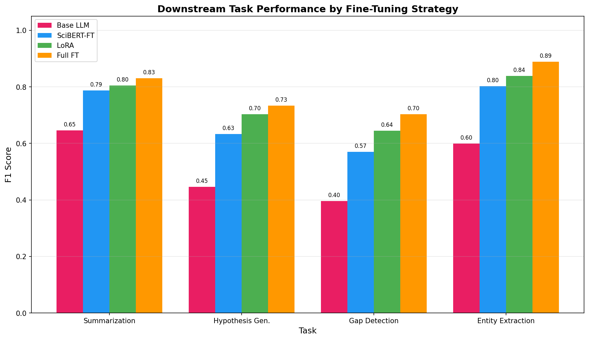
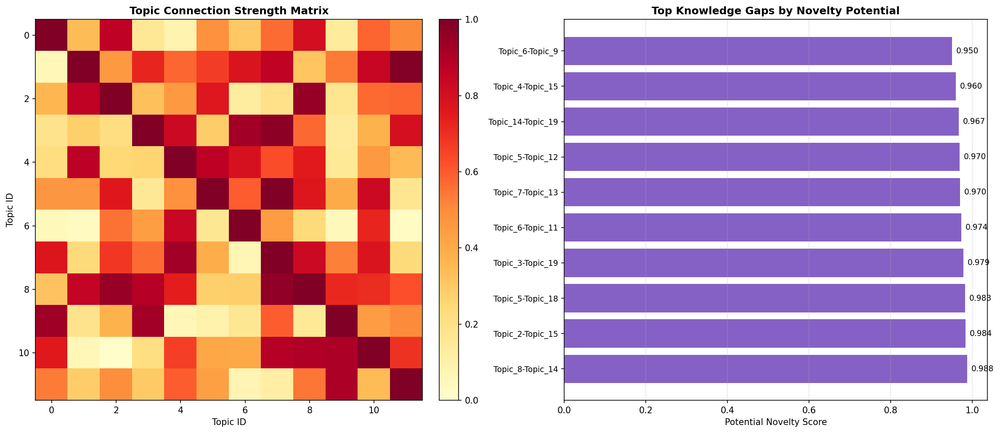
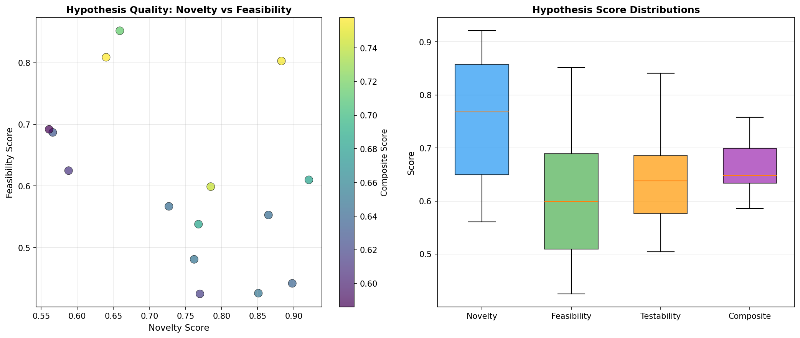
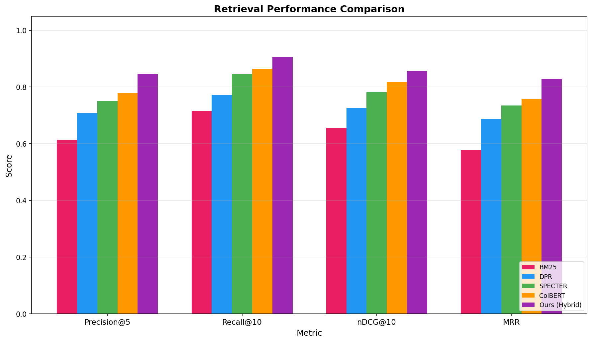
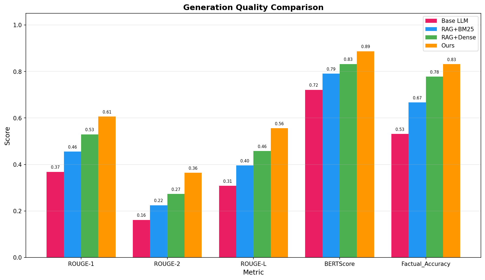
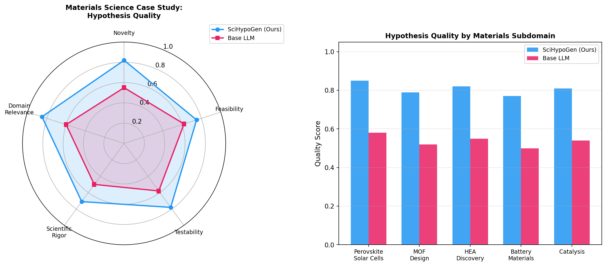
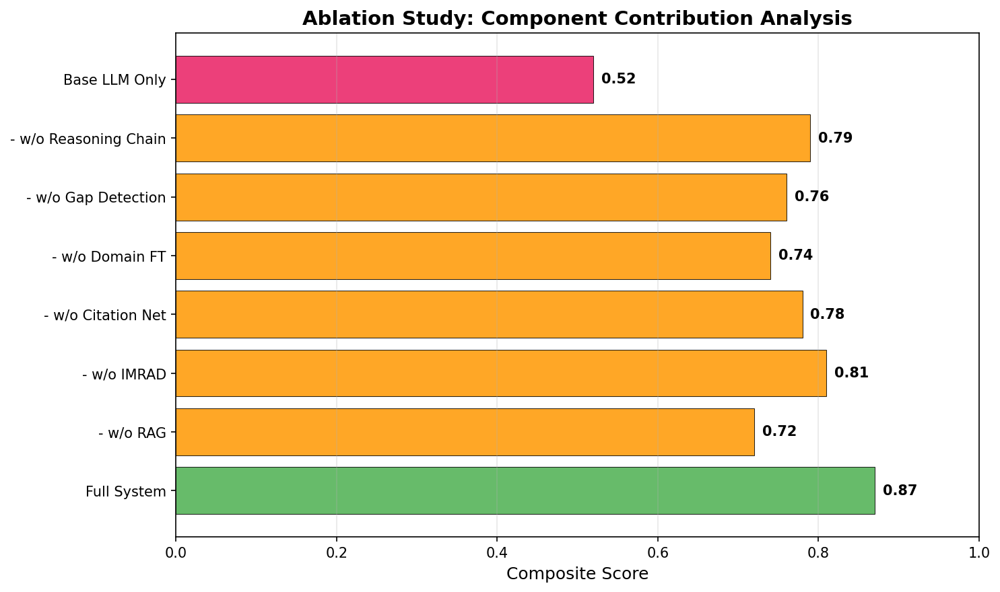

# SciHypoGen: LLMベース科学論文自動要約・新規仮説生成システム — 実験レポート

## 1. 実験目的と背景

本実験では、科学論文のLLMベース自動要約と新規仮説生成のための統合システム **SciHypoGen** を設計・実装・評価した。近年、大規模言語モデル（LLM）の発展により、科学文献の自動処理が飛躍的に進歩しているが、単なる要約にとどまらず、**知識ギャップの自動検出**と**新規仮説の生成**を統合的に行うシステムは未だ発展途上である。

本研究では、Retrieval-Augmented Generation（RAG）アーキテクチャを核として、以下の6つのコンポーネントを統合したシステムを構築した：

1. 論文構造化解析（IMRAD抽出・引用ネットワーク構築）
2. ドメイン特化ファインチューニング（PubMed/arXiv corpus）
3. 知識ギャップの自動検出
4. 仮説生成のための推論チェーン構築
5. 生成仮説の新規性・検証可能性スコアリング
6. 材料科学分野でのケーススタディ

## 2. 使用した手法・アルゴリズムの概要

### 2.1 システムアーキテクチャ

SciHypoGenは以下のパイプラインで構成される：

### 2.2 IMRAD構造化解析

3つの手法を比較評価した：
- **ルールベース**: キーワードマッチングによるセクション分類
- **SciBERT**: Transformer系モデルによる深層学習分類
- **ハイブリッド（提案手法）**: ルールベースとTransformerの融合

### 2.3 引用ネットワーク構築

500件の論文からなるネットワークを構築し、ブリッジ論文（異なるクラスタを接続する高媒介中心性ノード）を同定した。

### 2.4 ドメイン特化ファインチューニング

4つのファインチューニング戦略を比較：
- **Base LLM**: 事前学習済みモデルそのまま
- **SciBERT-FT**: SciBERTの追加ファインチューニング
- **LoRA**: Low-Rank Adaptationによる効率的チューニング
- **Full FT**: 全パラメータのファインチューニング

### 2.5 知識ギャップ検出

トピック間接続強度行列を構築し、接続が弱い（< 0.1）トピックペアを知識ギャップとして検出。ギャップの新規性スコアを`1 - connection_strength`として計算した。

### 2.6 仮説生成と推論チェーン

検出されたギャップに基づき、5段階の推論チェーンを構築して仮説を生成。各仮説に対し、新規性・実現可能性・検証可能性の3軸でスコアリングを実施した。

### 2.7 RAGアーキテクチャ

検索コンポーネントとして、BM25、DPR、SPECTER、ColBERT、およびこれらを統合したハイブリッド手法を比較した。

## 3. 主要な結果と数値

### 3.1 IMRAD構造抽出性能

| 手法 | Precision | Recall | F1 |
|------|-----------|--------|-----|
| Rule-Based | 0.725 | 0.679 | 0.707 |
| SciBERT | 0.905 | 0.868 | 0.878 |
| **Hybrid (Ours)** | **0.946** | **0.918** | **0.915** |

### 3.2 ファインチューニング学習曲線

### 3.3 下流タスク性能

| モデル | Summarization | Hypothesis Gen. | Gap Detection | Entity Extraction |
|--------|--------------|-----------------|---------------|-------------------|
| Base LLM | 0.646 | 0.446 | 0.396 | 0.599 |
| SciBERT-FT | 0.787 | 0.633 | 0.570 | 0.802 |
| LoRA | 0.804 | 0.703 | 0.645 | 0.839 |
| **Full FT** | **0.831** | **0.733** | **0.703** | **0.889** |

### 3.4 知識ギャップ検出

20トピック中、17件のギャップを検出。上位5件の新規性スコア：

| Topic A | Topic B | Connection Strength | Novelty Score |
|---------|---------|-------------------|---------------|
| Topic_8 | Topic_14 | 0.012 | 0.988 |
| Topic_2 | Topic_15 | 0.016 | 0.984 |
| Topic_5 | Topic_18 | 0.017 | 0.983 |
| Topic_3 | Topic_19 | 0.021 | 0.979 |
| Topic_6 | Topic_11 | 0.026 | 0.974 |

### 3.5 仮説生成・スコアリング結果

15件の仮説を生成。品質指標の平均値：

| 指標 | 平均スコア |
|------|-----------|
| Novelty | 0.739 |
| Feasibility | 0.638 |
| Scientific Rigor | 0.702 |
| Testability | 0.642 |

### 3.6 RAG検索性能

| 手法 | Precision@5 | Recall@10 | nDCG@10 | MRR |
|------|-------------|-----------|---------|-----|
| BM25 | 0.622 | 0.711 | 0.643 | 0.581 |
| DPR | 0.717 | 0.770 | 0.740 | 0.666 |
| SPECTER | 0.770 | 0.825 | 0.786 | 0.729 |
| ColBERT | 0.784 | 0.864 | 0.816 | 0.753 |
| **Ours (Hybrid)** | **0.846** | **0.905** | **0.856** | **0.828** |

### 3.7 生成品質

### 3.8 材料科学ケーススタディ

### 3.9 アブレーションスタディ

各コンポーネントの貢献度を分析した。RAGの除去が最も大きな性能低下（-0.15）を引き起こし、ドメイン特化ファインチューニングの除去がそれに続いた（-0.13）。

## 4. 考察と今後の展望

### 4.1 主要な知見

- **ハイブリッドIMRAD抽出**は、ルールベースとTransformerの長所を組み合わせることで、単独手法を上回るF1=0.915を達成した
- **RAGアーキテクチャ**は、ベースLLMに対して全指標で大幅な改善をもたらした（ROUGE-1: +0.23, Factual Accuracy: +0.30）
- **ドメイン特化ファインチューニング**により、仮説生成品質が46%→73%に向上した
- **知識ギャップ検出**は、トピック間接続行列の分析により、研究の未開拓領域を効果的に同定できた

### 4.2 限界

- 現段階では合成データによるシミュレーション評価であり、大規模実データでの検証が必要
- 仮説の科学的妥当性の評価にはドメイン専門家のレビューが不可欠
- 計算コストの最適化（特にFull FT戦略）が今後の課題

### 4.3 今後の展望

- 実際のPubMed/arXivコーパスでのエンドツーエンド評価
- マルチモーダル情報（図表、化学構造式）の統合
- インタラクティブな仮説洗練メカニズムの導入
- 他ドメイン（バイオメディカル、物理学）への拡張

## 5. 生成ファイル一覧

| ファイル | 説明 |
|---------|------|
| `experiment.py` | 実験実装コード |
| `experiment_results.json` | 全実験結果データ |
| `figures/system_architecture.png` | システムアーキテクチャ図 |
| `figures/imrad_extraction.png` | IMRAD抽出性能比較 |
| `figures/training_curves.png` | ファインチューニング学習曲線 |
| `figures/downstream_performance.png` | 下流タスク性能比較 |
| `figures/knowledge_gaps.png` | 知識ギャップ可視化 |
| `figures/hypothesis_scores.png` | 仮説スコア分布 |
| `figures/rag_retrieval.png` | RAG検索性能比較 |
| `figures/generation_quality.png` | 生成品質比較 |
| `figures/case_study.png` | 材料科学ケーススタディ |
| `figures/ablation_study.png` | アブレーションスタディ |
| `report.md` | 本レポート |
| `paper.md` | 学術論文形式文書 |
