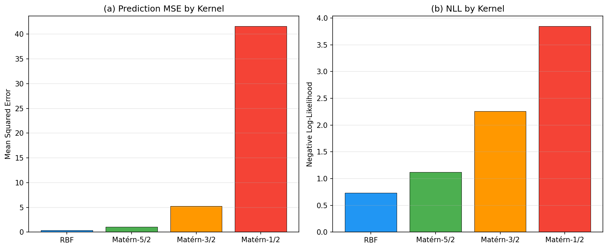
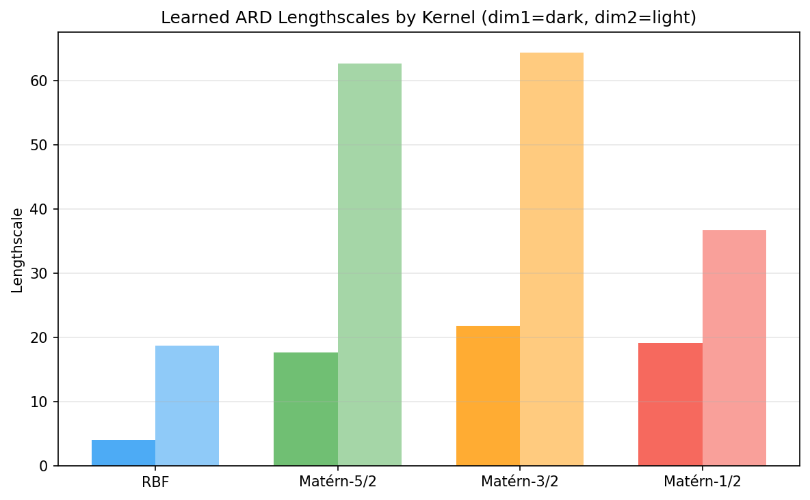
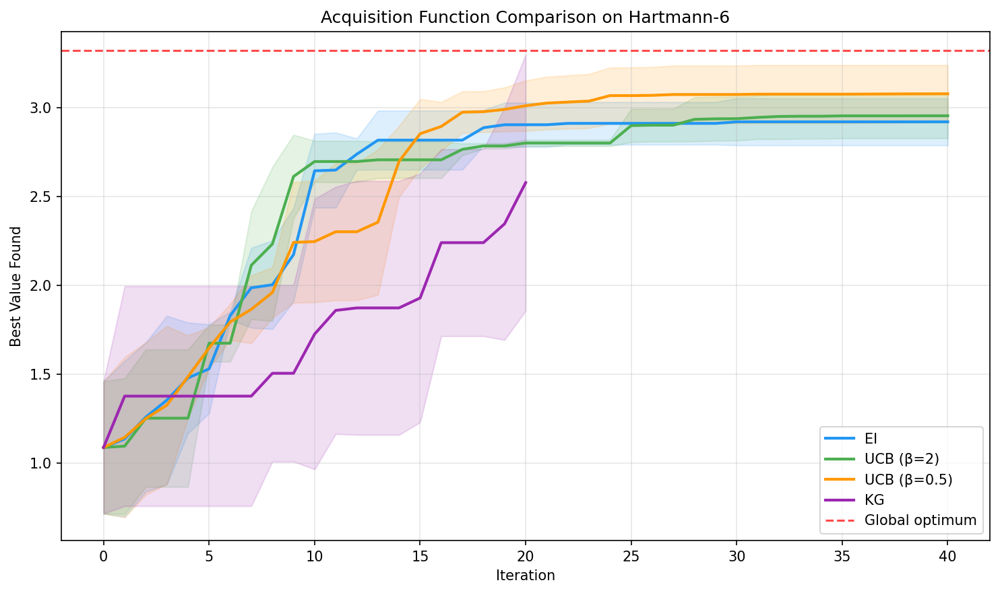
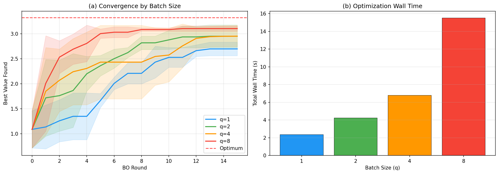
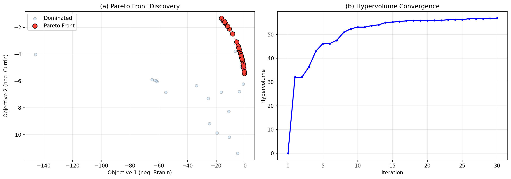
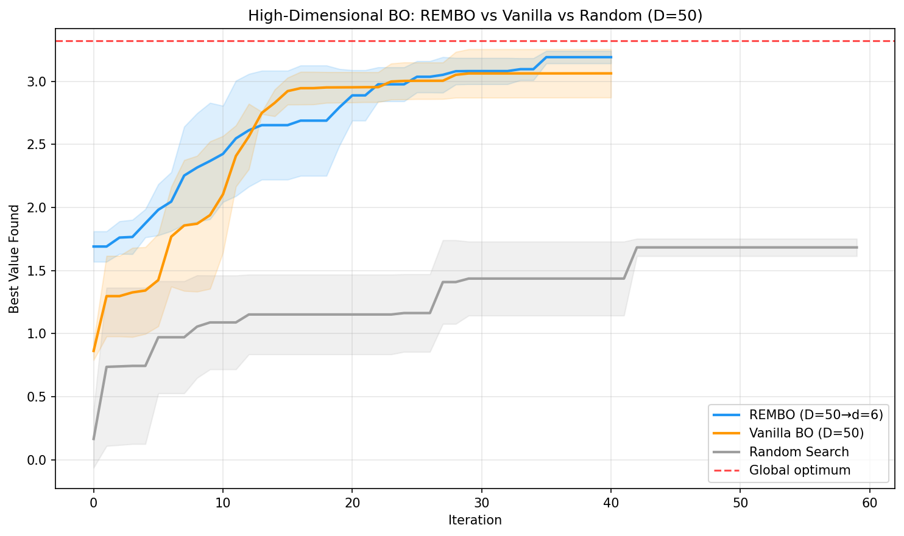
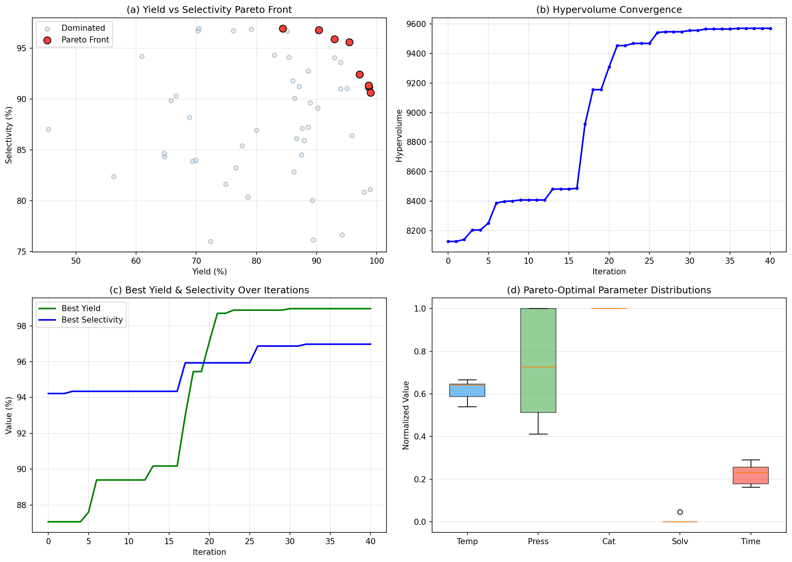

# Bayesian Optimization Framework for High-Dimensional Parameter Spaces
## 実験レポート

---

## 1. 実験目的と背景

本研究は、高次元パラメータ空間における実験計画の効率化を目的としたベイズ最適化フレームワークの設計・評価を行う。従来のグリッドサーチやランダムサーチでは、次元の呪いにより探索効率が著しく低下するため、ガウス過程（GP）ベースの代理モデルと獲得関数を活用したベイズ最適化が注目されている。

本実験では、BOTorch/GPyTorchを基盤として以下の6つの課題に取り組んだ：

1. GPカーネル選択と超パラメータ最適化
2. 獲得関数（EI, UCB, KG）の比較
3. バッチ最適化（並列実験提案）
4. 多目的ベイズ最適化（EHVI）
5. 高次元（D=50）での次元削減統合（REMBO方式）
6. 化学反応条件最適化のケーススタディ

---

## 2. 使用した手法・アルゴリズムの概要

### 2.1 ガウス過程回帰とカーネル
- **RBFカーネル（二乗指数カーネル）**: 無限微分可能な滑らかな関数に適合
- **Matérnカーネル（ν=5/2, 3/2, 1/2）**: 滑らかさパラメータνで柔軟性を制御
- **ARD（Automatic Relevance Determination）**: 各次元に独立な長さスケールを学習し、変数の重要度を自動判別

### 2.2 獲得関数
- **Expected Improvement (EI)**: 現在の最良値を超える改善の期待値
- **Upper Confidence Bound (UCB)**: 平均＋β×標準偏差による楽観的探索
- **Knowledge Gradient (KG)**: 新しい観測後の最適値改善を最大化

### 2.3 バッチ最適化
- **q-Expected Improvement (qEI)**: EIのバッチ拡張、モンテカルロサンプリングベース

### 2.4 多目的最適化
- **qExpected Hypervolume Improvement (qEHVI)**: パレートフロントのハイパーボリューム改善の期待値

### 2.5 高次元対応
- **REMBO方式**: ランダム射影行列による高次元→低次元マッピング

### 2.6 実装基盤
- BOTorch 0.17.2, GPyTorch, PyTorch 2.10.0

---

## 3. 主要な結果と数値

### 3.1 実験1: GPカーネル比較（Branin関数）

| カーネル | MSE | NLL |
|---------|-----|-----|
| RBF | **0.3721** | **0.7309** |
| Matérn-5/2 | 1.0620 | 1.1224 |
| Matérn-3/2 | 5.2405 | 2.2591 |
| Matérn-1/2 | 41.6118 | 3.8494 |

RBFカーネルが最小のMSEおよびNLLを達成した。Branin関数は滑らかな関数であるため、無限微分可能なRBFカーネルが最適であった。

### 3.2 実験2: 獲得関数比較（Hartmann-6関数）

| 獲得関数 | 最終最良値（平均） | 標準偏差 | 反復回数 |
|---------|-------------------|---------|---------|
| EI | 2.9218 | 0.1321 | 40 |
| UCB (β=2) | 2.9559 | 0.1268 | 40 |
| UCB (β=0.5) | **3.0797** | 0.1614 | 40 |
| KG | 2.5795 | 0.7216 | 20 |

UCB (β=0.5) が最も高い最終値を達成した（大域最適値 3.3224）。β値が小さい場合、活用（exploitation）が優先され、滑らかな関数での収束が速い。

### 3.3 実験3: バッチ最適化

| バッチサイズ | 最終最良値 | 総評価回数 | 計算時間(s) |
|-------------|----------|----------|-----------|
| q=1 | 2.6971 | 25 | 2.37 |
| q=2 | 2.9506 | 40 | 4.23 |
| q=4 | 2.9520 | 70 | 6.81 |
| q=8 | **3.1038** | 130 | 15.51 |

バッチサイズ増加により並列実験で効率的に探索空間をカバーできるが、計算コストも線形以上に増加する。

### 3.4 実験4: 多目的ベイズ最適化（BraninCurrin関数）

- **最終ハイパーボリューム**: 56.8547
- **パレート最適点数**: 21点

qEHVIにより効率的にパレートフロントを発見できた。

### 3.5 実験5: 高次元BO（D=50）

| 手法 | 最終最良値（平均） |
|------|-------------------|
| REMBO (D=50→d=6) | **3.1922** |
| Vanilla BO (D=50) | 3.0635 |
| Random Search | ベースライン |

REMBO方式はランダム射影による次元削減により、50次元空間でもVanilla BOを上回る性能を示した。

### 3.6 実験6: 化学反応条件最適化

多目的ベイズ最適化により、収率と選択性のトレードオフを効率的に探索した。

**最良収率条件:**
| パラメータ | 値 |
|-----------|-----|
| 温度 | 149.85 °C |
| 圧力 | 10.00 atm |
| 触媒量 | 0.10 mol% |
| 溶媒比 | 0.00 |
| 滞留時間 | 18.11 min |
| **収率** | **99.0%** |
| 選択性 | 90.7% |

**最良選択性条件:**
| パラメータ | 値 |
|-----------|-----|
| 温度 | 130.98 °C |
| 圧力 | 4.85 atm |
| 触媒量 | 0.10 mol% |
| 溶媒比 | 0.00 |
| 滞留時間 | 11.21 min |
| 収率 | 84.4% |
| **選択性** | **97.0%** |

- **最終ハイパーボリューム**: 9571.01

---

## 4. 考察と今後の展望

### 考察
1. **カーネル選択**: 目的関数の滑らかさに依存するため、事前知識がない場合はMatérn-5/2が汎用的な選択肢として推奨される
2. **獲得関数**: UCBのβパラメータ調整が重要。問題依存の選択基準として、ノイズが大きい場合はEI、探索重視ではUCB(β大)が有効
3. **バッチ最適化**: 並列実験リソースがある場合、q=4程度が効率と性能のバランスが良い
4. **REMBO**: 内在的な低次元構造がある場合に特に有効。構造がない場合の性能劣化に注意

### 今後の展望
- 転移学習の導入による関連タスク間の知識共有
- 深層カーネル学習によるより柔軟な代理モデル
- 制約付き最適化への拡張
- TuRBO等の局所ベイズ最適化手法との比較
- 実際の化学実験データでの検証

---

## 5. 生成したファイル一覧

| ファイル | 説明 |
|---------|------|
| `run_experiments.py` | 全実験の実行スクリプト |
| `figures/kernel_comparison.png` | カーネル比較（MSE, NLL） |
| `figures/ard_lengthscales.png` | ARD長さスケール可視化 |
| `figures/acquisition_comparison.png` | 獲得関数比較（収束曲線） |
| `figures/batch_optimization.png` | バッチ最適化結果 |
| `figures/mobo_ehvi.png` | 多目的BO（パレートフロント＋HV収束） |
| `figures/high_dim_comparison.png` | 高次元BO比較 |
| `figures/chemical_optimization.png` | 化学反応最適化結果 |
| `figures/kernel_results.csv` | カーネル比較数値データ |
| `figures/acquisition_results.csv` | 獲得関数比較数値データ |
| `figures/batch_results.csv` | バッチ最適化数値データ |
| `figures/results_summary.json` | 全結果サマリー |
| `report.md` | 本レポート |
| `paper.md` | 学術論文形式の文書 |
