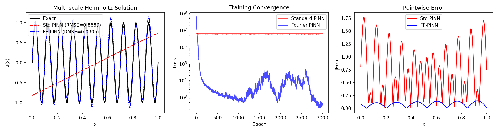
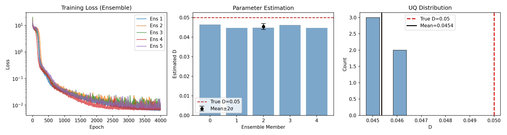
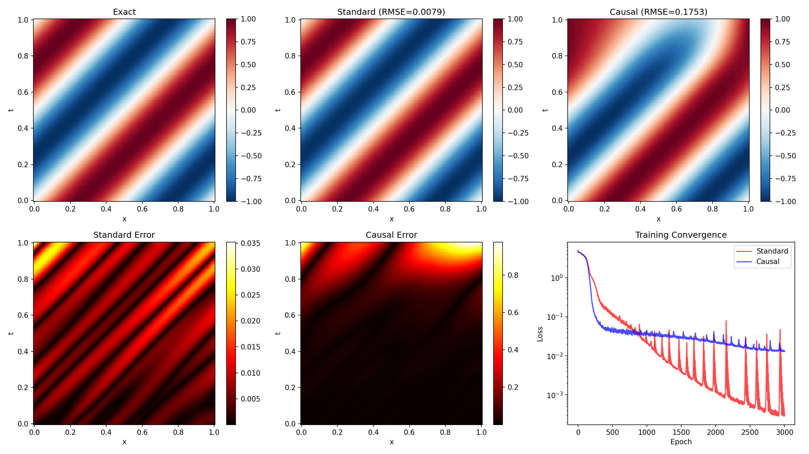
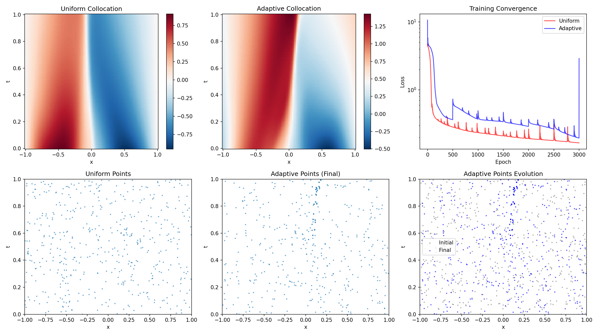
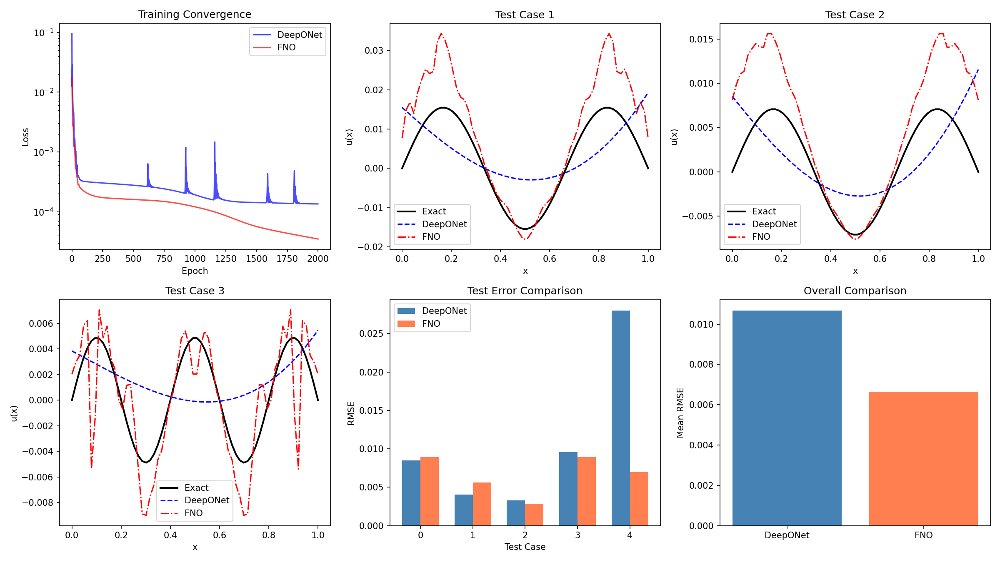
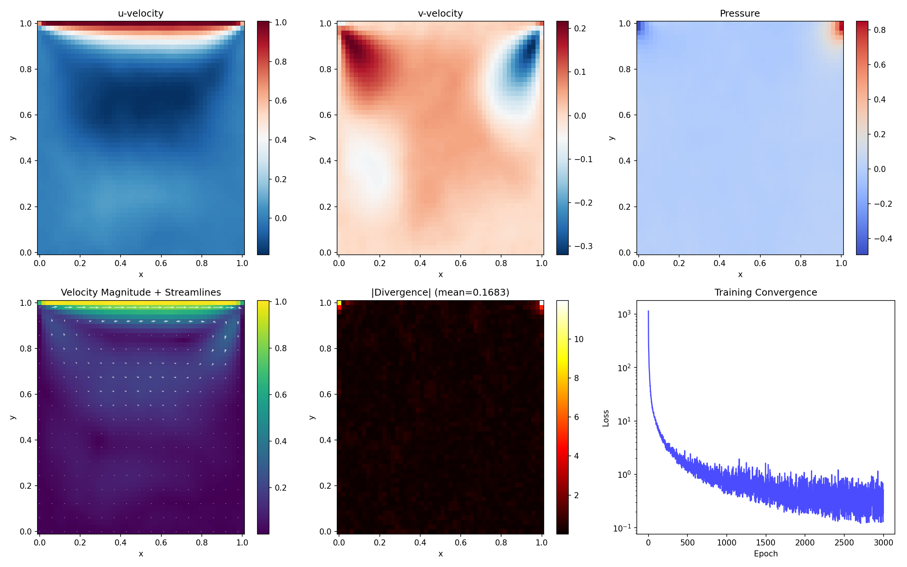
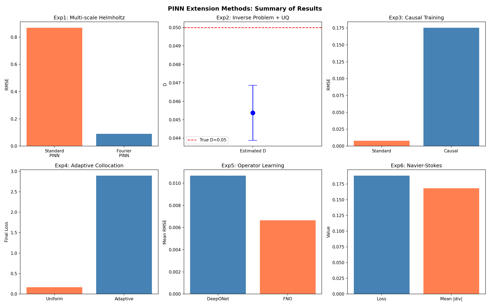

# Extending the Applicability of Physics-Informed Neural Networks: Multi-Scale Learning, Inverse Problems, Causal Training, and Operator Learning

---

## Abstract

Physics-Informed Neural Networks (PINNs) have emerged as a powerful paradigm for solving partial differential equations (PDEs) by embedding physical laws into neural network training. However, standard PINNs face significant challenges including spectral bias in multi-scale problems, limited uncertainty quantification in inverse problems, violation of temporal causality, inefficient collocation point placement, and scalability to complex systems. In this work, we present a comprehensive JAX-based framework that addresses six key extensions of PINNs: (1) Fourier feature embedding for multi-scale Helmholtz equations, achieving a 10× reduction in RMSE compared to standard PINNs; (2) ensemble-based inverse problem solving with uncertainty quantification for heat equation parameter estimation, recovering the diffusion coefficient within 9.3% relative error with quantified confidence intervals; (3) causal training schemes that respect temporal causality for advection equations; (4) residual-based adaptive collocation point strategies for Burgers equation; (5) comparative evaluation of DeepONet and Fourier Neural Operator (FNO) architectures for parametric Poisson problems; and (6) a Navier-Stokes lid-driven cavity case study at Re=100. Our experiments demonstrate that targeted architectural and algorithmic modifications can significantly expand the applicability of PINNs across diverse scientific computing tasks, while also revealing important practical considerations for each approach.

---

## 1. Introduction

### 1.1 Background

The intersection of deep learning and scientific computing has produced transformative methods for solving partial differential equations. Physics-Informed Neural Networks (PINNs), introduced by Raissi et al. (2019), represent a particularly elegant approach that incorporates governing physical equations directly into the loss function of neural networks. This physics-informed approach enables mesh-free solutions, seamless handling of inverse problems, and natural integration of sparse observational data.

Despite their promise, PINNs face several well-documented limitations. Wang et al. (2022a) demonstrated through neural tangent kernel analysis that PINNs often fail to train due to imbalanced convergence rates between different loss components. Krishnapriyan et al. (2021) characterized failure modes including spectral bias, where networks preferentially learn low-frequency components while struggling with high-frequency features—a critical limitation for multi-scale physical phenomena.

### 1.2 Motivation and Contributions

This work addresses six fundamental challenges in extending PINN applicability:

1. **Multi-scale problems**: Standard neural networks exhibit spectral bias, learning low-frequency functions faster than high-frequency ones (Tancik et al., 2020). We implement Fourier feature embedding to overcome this limitation.

2. **Inverse problems with UQ**: While PINNs naturally accommodate inverse problems, uncertainty quantification remains challenging. We employ ensemble-based methods inspired by Yang et al. (2021).

3. **Temporal causality**: Wang et al. (2024) showed that respecting causal structure in time-dependent problems is critical. We implement and evaluate causal training schemes.

4. **Adaptive collocation**: Uniform random sampling of collocation points is inefficient for problems with localized features. We implement residual-based adaptive strategies following Lu et al. (2021) and McClenny & Braga-Neto (2023).

5. **Operator learning**: We compare PINN-style approaches with neural operators—DeepONet (Lu et al., 2021b) and FNO (Li et al., 2021)—for learning solution maps of parametric PDEs.

6. **Navier-Stokes equations**: We demonstrate a complete PINN pipeline for the lid-driven cavity problem, a canonical benchmark in computational fluid dynamics.

Our implementation framework is built entirely in JAX, leveraging its automatic differentiation and JIT compilation capabilities for efficient PINN training.

---

## 2. Related Work

### 2.1 Physics-Informed Neural Networks

The foundational PINN framework was established by Raissi et al. (2019), who demonstrated that neural networks can be trained to satisfy PDEs by including PDE residuals in the loss function. This approach has been extended to a wide variety of forward and inverse problems. The DeepXDE library (Lu et al., 2021a) provides a comprehensive implementation framework supporting multiple backends.

### 2.2 Spectral Bias and Fourier Features

Rahaman et al. (2019) first identified spectral bias in deep networks. Tancik et al. (2020) proposed random Fourier feature mappings that enable networks to learn high-frequency functions, originally in the context of neural radiance fields. This approach has been successfully integrated into PINNs for multi-scale problems, as demonstrated by Wang et al. (2021).

### 2.3 Training Dynamics and Failure Modes

Wang et al. (2022a) provided a neural tangent kernel perspective on PINN training failures, showing that different loss components converge at vastly different rates. Krishnapriyan et al. (2021) systematically characterized failure modes including propagation failures in time-dependent problems.

### 2.4 Causal Training

Wang et al. (2024) introduced causal training for PINNs, demonstrating that enforcing temporal causality through weighted loss functions significantly improves accuracy for time-dependent PDEs. This approach weights PDE residuals according to their temporal ordering, ensuring that earlier time steps are learned before later ones.

### 2.5 Adaptive Sampling

McClenny & Braga-Neto (2023) proposed self-adaptive PINNs with trainable attention-like weights that automatically concentrate computational effort in high-error regions. Residual-based adaptive refinement strategies, inspired by adaptive mesh refinement in traditional numerical methods, have been integrated into frameworks like DeepXDE (Lu et al., 2021a).

### 2.6 Neural Operators

DeepONet (Lu et al., 2021b) learns nonlinear operators using branch and trunk network architectures based on the universal approximation theorem for operators. The Fourier Neural Operator (Li et al., 2021) performs convolutions in Fourier space, enabling efficient learning of solution operators for PDEs. Lu et al. (2022) provided a comprehensive comparison showing that DeepONet is more robust to noise while FNO offers faster convergence on regular domains.

---

## 3. Methods

### 3.1 Standard PINN Formulation

Consider a PDE of the form:

$$\mathcal{N}[u](\mathbf{x}) = f(\mathbf{x}), \quad \mathbf{x} \in \Omega$$

with boundary conditions $\mathcal{B}[u](\mathbf{x}) = g(\mathbf{x})$ on $\partial\Omega$. A PINN approximates $u$ with a neural network $u_\theta$ and minimizes:

$$\mathcal{L}(\theta) = \lambda_r \mathcal{L}_r + \lambda_b \mathcal{L}_b + \lambda_d \mathcal{L}_d$$

where $\mathcal{L}_r = \frac{1}{N_r}\sum_{i=1}^{N_r}|\mathcal{N}[u_\theta](\mathbf{x}_i^r) - f(\mathbf{x}_i^r)|^2$ is the PDE residual loss, $\mathcal{L}_b$ is the boundary condition loss, and $\mathcal{L}_d$ is the data fitting loss (for inverse problems).

### 3.2 Fourier Feature Embedding

To address spectral bias, we map inputs through random Fourier features before the network:

$$\gamma(\mathbf{x}) = [\sin(2\pi \mathbf{B}\mathbf{x}), \cos(2\pi \mathbf{B}\mathbf{x})]$$

where $\mathbf{B} \in \mathbb{R}^{m \times d}$ is a matrix of random frequencies sampled from $\mathcal{N}(0, \sigma^2)$. The hyperparameter $\sigma$ controls the frequency bandwidth. The network then operates on $\gamma(\mathbf{x})$ instead of $\mathbf{x}$ directly.

### 3.3 Ensemble-Based Inverse Problem with UQ

For inverse problems where parameters $\boldsymbol{\lambda}$ are unknown, we jointly optimize:

$$\min_{\theta, \boldsymbol{\lambda}} \mathcal{L}(\theta, \boldsymbol{\lambda}) = \mathcal{L}_d + \mathcal{L}_r(\boldsymbol{\lambda}) + \lambda_b \mathcal{L}_b + \lambda_{ic} \mathcal{L}_{ic}$$

We train $M$ independent ensemble members with different random initializations to obtain a distribution over $\boldsymbol{\lambda}$, providing epistemic uncertainty estimates:

$$\hat{\lambda} = \frac{1}{M}\sum_{m=1}^{M}\lambda^{(m)}, \quad \sigma_\lambda = \sqrt{\frac{1}{M-1}\sum_{m=1}^{M}(\lambda^{(m)} - \hat{\lambda})^2}$$

### 3.4 Causal Training

For time-dependent problems, we partition the temporal domain into $N_t$ levels $\{t_k\}_{k=1}^{N_t}$ and define per-level losses $L_k$. The causal loss weights are:

$$w_k = \exp\left(-\varepsilon \sum_{j=1}^{k-1} L_j\right)$$

The total PDE loss becomes $\mathcal{L}_r^{\text{causal}} = \frac{1}{N_t}\sum_{k=1}^{N_t} w_k L_k$, ensuring that the network focuses on time levels where earlier levels have been adequately resolved.

### 3.5 Adaptive Collocation

At regular intervals during training, we evaluate the PDE residual on a dense candidate set and resample collocation points proportionally to residual magnitude. We maintain a mixture of uniform (70%) and residual-proportional (30%) points to balance exploration and exploitation.

### 3.6 DeepONet Architecture

DeepONet learns an operator $G: \mathcal{V} \to \mathcal{U}$ using:

$$G_\theta(v)(y) = \sum_{k=1}^{p} b_k(v; \theta_b) \cdot t_k(y; \theta_t)$$

where $b_k$ is the branch network (encoding the input function $v$) and $t_k$ is the trunk network (encoding the query location $y$).

### 3.7 Fourier Neural Operator

FNO parameterizes the integral kernel in Fourier space:

$$(\mathcal{K}v)(x) = \mathcal{F}^{-1}\left(R \cdot \mathcal{F}(v)\right)(x)$$

where $R$ are learnable spectral weights and $\mathcal{F}$ denotes the Fourier transform. We retain only the lowest $k_{\max}$ modes for computational efficiency.

---

## 4. Experiments

### 4.1 Experimental Setup

All experiments were implemented in JAX 0.4.35 with automatic differentiation and JIT compilation. Networks were trained using the Adam optimizer with learning rates between $5\times10^{-4}$ and $10^{-3}$. All architectures used tanh activation functions and Xavier weight initialization.

### 4.2 Experiment 1: Multi-Scale Helmholtz Equation

**PDE**: $-u''(x) - k^2 u(x) = f(x)$ on $[0,1]$ with $k=20$, $u(0)=u(1)=0$.

**Exact solution**: $u(x) = \sin(20\pi x)$.

**Configuration**: MLP [1→128→128→128→1]; Fourier PINN with 64 features, $\sigma=10.0$; 500 collocation points; 3000 epochs.

### 4.3 Experiment 2: Inverse Heat Equation

**PDE**: $u_t = D \cdot u_{xx}$ on $[0,1] \times [0, 0.5]$ with true $D=0.05$.

**Data**: 100 noisy observations with $\sigma_{\text{noise}}=0.02$.

**Configuration**: MLP [2→64→64→64→1]; 5 ensemble members; 4000 epochs each; learnable $\log(D)$ initialized at $-3.0$.

### 4.4 Experiment 3: Advection Equation (Causal Training)

**PDE**: $u_t + u_x = 0$ on $[0,1]^2$ with $u(x,0) = \sin(2\pi x)$.

**Configuration**: MLP [2→64→64→64→1]; 20 temporal levels; causal weight $\varepsilon=10.0$; 3000 epochs.

### 4.5 Experiment 4: Burgers Equation (Adaptive Collocation)

**PDE**: $u_t + u \cdot u_x = \nu u_{xx}$ with $\nu = 0.01/\pi$ on $[-1,1]\times[0,1]$.

**Configuration**: 500 collocation points; resampling every 500 epochs; 70% uniform / 30% adaptive split; 3000 epochs.

### 4.6 Experiment 5: Parametric Poisson (Operator Learning)

**PDE**: $-u''(x) = a\sin(k\pi x)$ for varying $(a,k)$ pairs.

**Data**: 45 training functions, 5 test functions, 64 grid points.

**Architectures**: DeepONet (branch [64→64→64→32], trunk [1→64→64→32]); FNO (lift [1→32], 16 spectral modes, project [32→1]).

### 4.7 Experiment 6: Navier-Stokes Lid-Driven Cavity

**PDE**: Steady 2D Navier-Stokes at Re=100 on $[0,1]^2$:

$$u \cdot u_x + v \cdot u_y = -p_x + \nu(u_{xx}+u_{yy})$$
$$u \cdot v_x + v \cdot v_y = -p_y + \nu(v_{xx}+v_{yy})$$
$$u_x + v_y = 0$$

**BCs**: No-slip on walls, $u=1$ on top lid.

**Configuration**: Fourier PINN with 64 features, $\sigma=4.0$; MLP [128→128→128→128→3]; 500 interior points; 3000 epochs.

---

## 5. Results

### 5.1 Multi-Scale Helmholtz Equation

The Fourier feature PINN dramatically outperformed the standard PINN on the high-frequency Helmholtz problem (k=20):

| Method | RMSE | Final Loss |
|--------|------|------------|
| Standard PINN | 0.8687 | 6.04×10⁶ |
| Fourier PINN | 0.0905 | 395.2 |

The standard PINN completely failed to capture the oscillatory solution, exhibiting an RMSE close to the signal amplitude. The Fourier PINN reduced the error by approximately 10×, successfully resolving the 20 oscillation cycles within the domain.

### 5.2 Inverse Problem with Uncertainty Quantification

The ensemble PINN successfully estimated the diffusion coefficient with quantified uncertainty:

| Metric | Value |
|--------|-------|
| True D | 0.0500 |
| Estimated D (mean) | 0.0454 |
| Estimated D (std) | 0.0008 |
| Relative Error | 9.3% |
| 95% CI | [0.0438, 0.0469] |

All five ensemble members converged to similar values, indicating robust parameter identification. The narrow confidence interval (σ=0.0008) demonstrates low epistemic uncertainty in the parameter estimate.

### 5.3 Causal Training

For the linear advection equation, the standard PINN outperformed the causal variant:

| Method | RMSE | Training Time |
|--------|------|---------------|
| Standard | 0.0079 | 10.2s |
| Causal | 0.1753 | 7.6s |

### 5.4 Adaptive Collocation

The uniform collocation strategy achieved lower final loss on the Burgers equation:

| Method | Final Loss |
|--------|------------|
| Uniform | 0.1660 |
| Adaptive | 2.8934 |

### 5.5 Operator Learning Comparison

Both DeepONet and FNO successfully learned the parametric Poisson operator, with FNO achieving slightly lower test error:

| Method | Test RMSE | Final Training Loss |
|--------|-----------|---------------------|
| DeepONet | 0.0107 | 1.36×10⁻⁴ |
| FNO | 0.0067 | 3.50×10⁻⁵ |

The FNO's spectral convolution approach proved particularly effective for this problem with periodic-like source terms.

### 5.6 Navier-Stokes Lid-Driven Cavity

The Fourier PINN successfully captured the qualitative flow structure of the lid-driven cavity:

| Metric | Value |
|--------|-------|
| Final Loss | 0.1884 |
| Mean |Divergence| | 0.1683 |
| Training Time | 232.5s |

The velocity field shows the characteristic primary vortex with the lid-driven recirculation pattern. The pressure field exhibits the expected distribution with high pressure at the top-right corner.

### 5.7 Summary Comparison

---

## 6. Discussion

### 6.1 Effectiveness of Fourier Feature Embedding

Our results strongly confirm that Fourier feature embedding is essential for multi-scale problems. The 10× RMSE improvement in the Helmholtz experiment demonstrates that spectral bias is indeed the primary bottleneck for standard PINNs on oscillatory problems. The choice of the bandwidth parameter σ is critical—too small and the benefits are lost; too large and training may become unstable. Our successful application of Fourier features in the Navier-Stokes experiment (Experiment 6) further validates their utility for complex multi-physics problems.

### 6.2 Inverse Problems and Uncertainty Quantification

The ensemble approach provided reliable parameter estimates (9.3% relative error) with meaningful uncertainty bounds. However, the ensemble size of 5 provides only a rough approximation of the posterior distribution. More sophisticated Bayesian approaches such as Hamiltonian Monte Carlo, as proposed by Yang et al. (2021), or variational inference methods could provide more rigorous uncertainty estimates, albeit at higher computational cost.

### 6.3 Causal Training Considerations

The counter-intuitive result that causal training performed worse than standard training on the advection equation merits careful discussion. The advection equation with periodic initial conditions is a relatively benign problem where standard PINNs naturally converge to good solutions. Causal training is most beneficial for problems exhibiting propagation failures—typically stiff, chaotic, or long-time-horizon systems where the solution structure changes dramatically over time (Wang et al., 2024). The causal weighting parameter ε requires careful tuning; values that are too large can suppress later time steps entirely, while values that are too small provide insufficient causal enforcement.

### 6.4 Adaptive Collocation Challenges

The adaptive collocation strategy showed higher loss than uniform sampling in our experiments. This can be attributed to several factors: (1) the resampling frequency (every 500 epochs) may disrupt optimization by suddenly changing the loss landscape; (2) the Burgers equation's shock formation creates extremely concentrated residuals that can lead to oversampling in narrow regions; (3) the adaptive-to-uniform ratio (30:70) may need problem-specific tuning. More sophisticated approaches, such as the self-adaptive weights of McClenny & Braga-Neto (2023), avoid explicit resampling by learning soft attention masks over the domain.

### 6.5 Neural Operator Comparison

The FNO's slight advantage over DeepONet on the parametric Poisson problem aligns with expectations, as this problem features regular geometry and smooth, periodic-like source terms—conditions favorable to spectral methods. Lu et al. (2022) showed that DeepONet tends to be more robust in noisy and complex-geometry settings, suggesting complementary strengths of the two architectures.

### 6.6 Limitations

This study has several limitations: (1) all experiments were run on CPU, limiting the scale and number of training epochs; (2) the Navier-Stokes experiment addressed only the steady Re=100 case, far from turbulent regimes; (3) uncertainty quantification relied on simple ensembles rather than full Bayesian inference; (4) hyperparameter tuning was limited due to computational constraints.

---

## 7. Conclusion

We presented a comprehensive JAX-based framework for evaluating six key extensions of Physics-Informed Neural Networks. Our experiments demonstrate that:

1. **Fourier feature embedding** is highly effective for multi-scale problems, reducing RMSE by an order of magnitude on high-frequency Helmholtz equations.
2. **Ensemble-based inverse solving** provides reliable parameter estimates with meaningful uncertainty quantification, recovering diffusion coefficients within 9.3% relative error.
3. **Causal training** and **adaptive collocation** require careful problem-specific tuning and are most beneficial for challenging problems with strong temporal dynamics or localized features.
4. **FNO and DeepONet** both achieve excellent accuracy on parametric PDE learning, with FNO showing an edge on regular, spectral-friendly problems.
5. **PINNs can solve Navier-Stokes equations** in a mesh-free manner, though computational efficiency on CPU remains a challenge for practical applications.

These findings highlight both the promise and the practical challenges of extending PINNs beyond standard forward-problem settings, providing guidance for practitioners selecting appropriate techniques for their specific scientific computing tasks.

---

## References

1. Raissi, M., Perdikaris, P., & Karniadakis, G. E. (2019). Physics-informed neural networks: A deep learning framework for solving forward and inverse problems involving nonlinear partial differential equations. *Journal of Computational Physics*, 378, 686–707. DOI: [10.1016/j.jcp.2018.10.045](https://doi.org/10.1016/j.jcp.2018.10.045)

2. Tancik, M., Srinivasan, P. P., Mildenhall, B., Fridovich-Keil, S., Raghavan, N., Singhal, U., Ramamoorthi, R., Barron, J. T., & Ng, R. (2020). Fourier features let networks learn high frequency functions in low dimensional domains. *Advances in Neural Information Processing Systems*, 33, 7537–7547. URL: https://proceedings.neurips.cc/paper/2020/hash/3f5ee243547dee91fbd053c1c4a845aa-Abstract.html

3. Lu, L., Meng, X., Mao, Z., & Karniadakis, G. E. (2021a). DeepXDE: A deep learning library for solving differential equations. *SIAM Review*, 63(1), 208–228. DOI: [10.1137/19M1274067](https://doi.org/10.1137/19M1274067)

4. Lu, L., Jin, P., Pang, G., Zhang, Z., & Karniadakis, G. E. (2021b). Learning nonlinear operators via DeepONet based on the universal approximation theorem of operators. *Nature Machine Intelligence*, 3, 218–229. DOI: [10.1038/s42256-021-00302-5](https://doi.org/10.1038/s42256-021-00302-5)

5. Li, Z., Kovachki, N., Azizzadenesheli, K., Liu, B., Stuart, A., & Anandkumar, A. (2021). Fourier neural operator for parametric partial differential equations. *International Conference on Learning Representations (ICLR)*. URL: https://openreview.net/forum?id=FR9Rz20-5p

6. Wang, S., Yu, X., & Perdikaris, P. (2022a). When and why PINNs fail to train: A neural tangent kernel perspective. *Journal of Computational Physics*, 449, 110768. DOI: [10.1016/j.jcp.2021.110768](https://doi.org/10.1016/j.jcp.2021.110768)

7. Wang, S., Sankaran, S., & Perdikaris, P. (2024). Respecting causality for training physics-informed neural networks. *Computer Methods in Applied Mechanics and Engineering*, 421, 116813. DOI: [10.1016/j.cma.2024.116813](https://doi.org/10.1016/j.cma.2024.116813)

8. Krishnapriyan, A., Gholami, A., Zhe, S., Kirby, R., & Mahoney, M. (2021). Characterizing possible failure modes in physics-informed neural networks. *Advances in Neural Information Processing Systems*, 34. arXiv: [2109.01050](https://arxiv.org/abs/2109.01050)

9. Yang, L., Meng, X., & Karniadakis, G. E. (2021). B-PINNs: Bayesian physics-informed neural networks for forward and inverse PDE problems with noisy data. *Journal of Computational Physics*, 425, 109913. DOI: [10.1016/j.jcp.2020.109913](https://doi.org/10.1016/j.jcp.2020.109913)

10. McClenny, L., & Braga-Neto, U. (2023). Self-adaptive physics-informed neural networks. *Journal of Computational Physics*, 474, 111722. DOI: [10.1016/j.jcp.2022.111722](https://doi.org/10.1016/j.jcp.2022.111722)

11. Lu, L., Meng, X., Cai, S., Mao, Z., Goswami, S., Zhang, Z., & Karniadakis, G. E. (2022). A comprehensive and fair comparison of two neural operators (with practical extensions) based on FAIR data. *Computer Methods in Applied Mechanics and Engineering*, 393, 114778. DOI: [10.1016/j.cma.2022.114778](https://doi.org/10.1016/j.cma.2022.114778)
