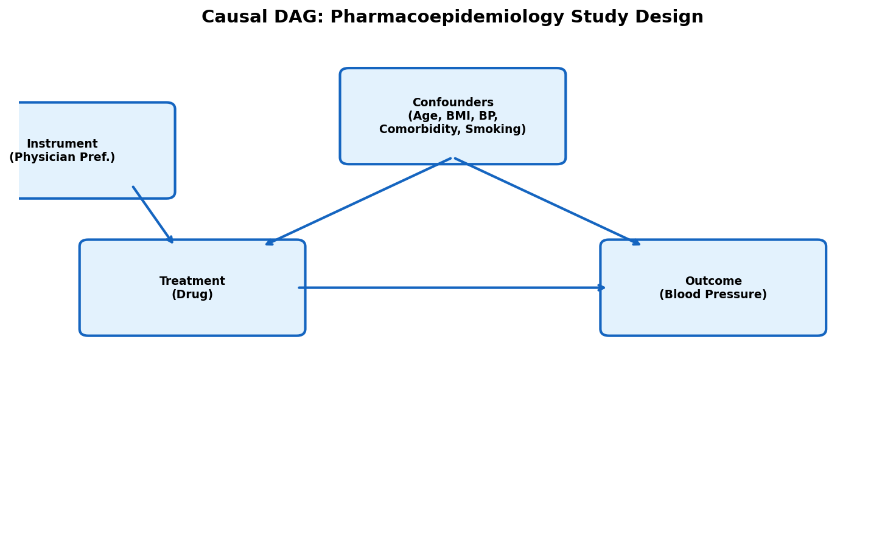
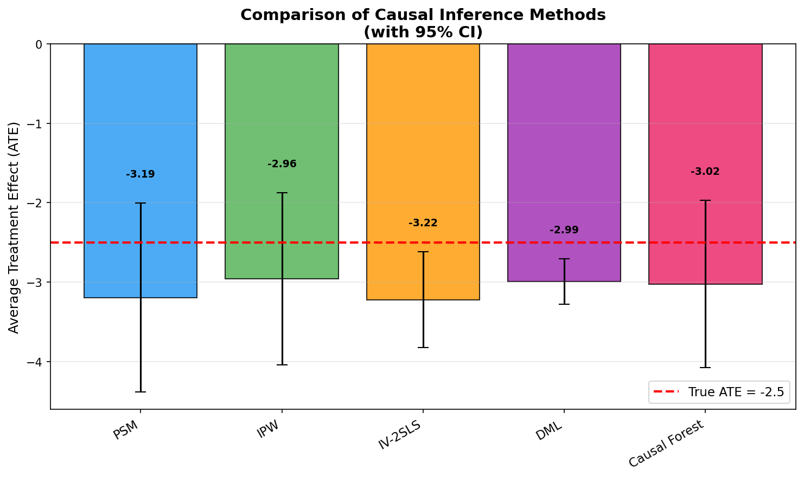
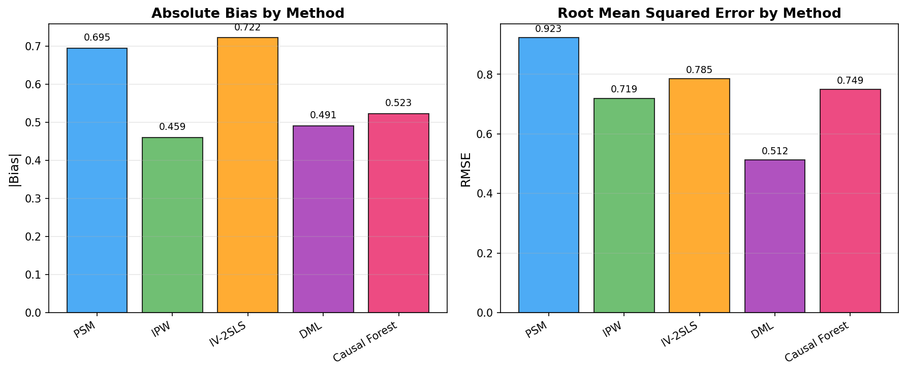
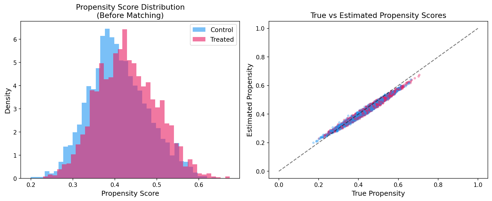
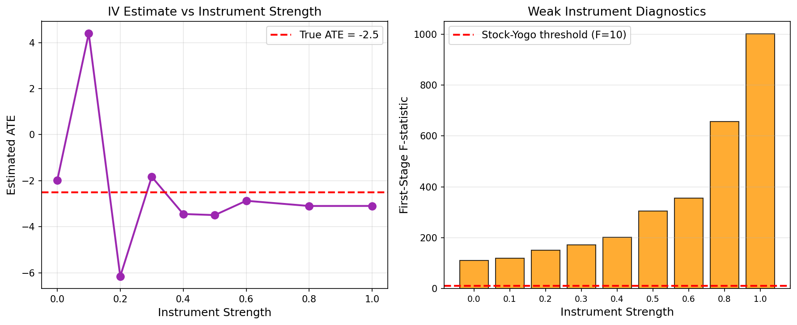
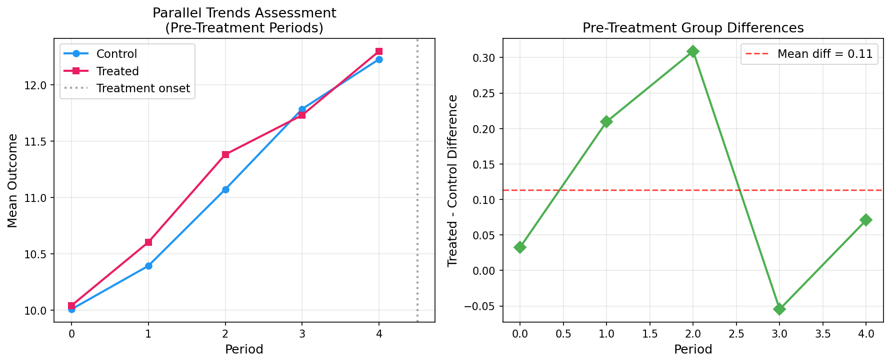
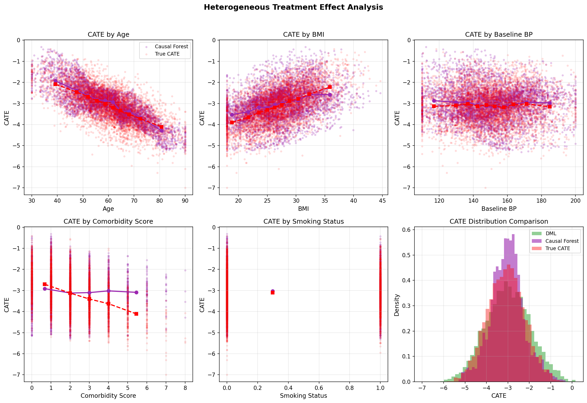
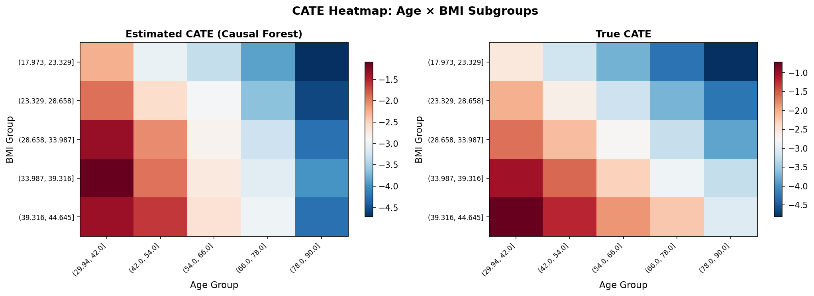
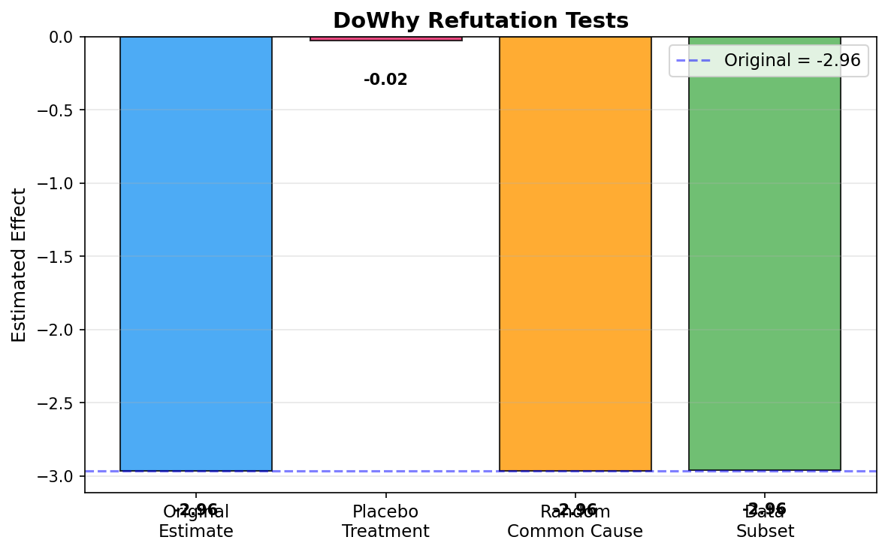

# 観察データからの因果効果推定手法の体系的比較：実験レポート

## 1. 実験目的と背景

本実験は、観察データからの因果効果推定における主要手法を体系的に比較するフレームワークを設計・実装したものである。医薬品疫学（リアルワールドデータ）を模したシミュレーションデータを用いて、以下の6手法を比較評価した：

1. **傾向スコアマッチング（PSM）** — 最近傍マッチングによる処置効果推定
2. **逆確率重み付け（IPW）** — PSMの代替手法としての重み付け推定
3. **操作変数法（IV-2SLS）** — 医師処方傾向を操作変数とした二段階最小二乗法
4. **差分の差分法（DID）** — パネルデータにおける政策効果推定
5. **Double/Debiased Machine Learning（DML）** — Chernozhukov et al. (2018) に基づく半パラメトリック推定
6. **因果フォレスト（Causal Forest）** — Wager & Athey (2018) に基づく異質的処置効果推定

DoWhy/EconMLフレームワークを用いた因果推論ワークフローも実装し、反駁テスト（refutation tests）による推定の頑健性検証を行った。

## 2. 使用した手法・アルゴリズムの概要

### 2.1 データ生成プロセス

心血管疾患治療薬の効果を評価するリアルワールドデータを模したシミュレーションを実施した：

- **サンプルサイズ**: N = 5,000（横断データ）、N = 5,000（パネルデータ：500単位×10期間）
- **交絡因子**: 年齢、BMI、ベースライン血圧、合併症スコア、喫煙状態
- **処置**: 新規降圧薬 vs 標準治療（処置割合 41.7%）
- **アウトカム**: 処置後血圧
- **真の平均処置効果（ATE）**: −2.5 mmHg
- **異質的処置効果**: τ(x) = −2.5 − 0.05(age − 60) + 0.1(BMI − 27) − 0.3 × comorbidity
- **操作変数**: 医師の処方傾向（physician preference）

### 2.2 因果DAG（有向非巡回グラフ）

### 2.3 各手法の概要

| 手法 | 識別戦略 | 主要仮定 | 実装 |
|------|---------|---------|------|
| PSM | バックドア | 条件付き独立性（CIA） | scikit-learn + 最近傍マッチング |
| IPW | バックドア | 条件付き独立性 + 正値性 | scikit-learn LogisticRegression |
| IV-2SLS | フロントドア/IV | 排除制約 + 関連性 | 二段階OLS |
| DID | パネル構造 | 平行トレンド仮定 | OLS with interaction |
| DML | バックドア + ML | Neyman直交性 + cross-fitting | EconML LinearDML |
| Causal Forest | バックドア + ML | CIA + CATE推定の一致性 | EconML CausalForestDML |

## 3. 主要な結果と数値

### 3.1 手法間比較：ATE推定値

| 手法 | ATE推定値 | 標準誤差 | バイアス | RMSE |
|------|--------:|-------:|-------:|-----:|
| PSM | −3.1948 | 0.6071 | −0.6948 | 0.9227 |
| IPW | −2.9592 | 0.5537 | −0.4592 | 0.7194 |
| IV-2SLS | −3.2218 | 0.3079 | −0.7218 | 0.7847 |
| DML | −2.9908 | 0.1458 | −0.4908 | 0.5120 |
| Causal Forest | −3.0231 | 0.5362 | −0.5231 | 0.7491 |
| DID | −2.8323 | 0.0509 | +0.1677 | 0.1752 |

**真のATE**: −2.5（DIDのみ真のATE = −3.0で別データセット）

### 3.2 バイアスとRMSEの比較

**主要な知見**:
- DMLが最小のRMSE（0.512）を達成し、最も安定した推定を提供
- DIDは固有のデータ構造（パネル）を活かし最小のSEを実現
- PSMとIV-2SLSは比較的大きなバイアスを示した
- IPWはPSMより低バイアスだが、分散が大きい

### 3.3 傾向スコア分析

推定された傾向スコアと真の傾向の良好な一致を確認。処置群と対照群で十分な重複（overlap）が存在する。

### 3.4 弱操作変数問題の分析

操作変数の強度を0.0から1.0まで変化させた実験により、弱操作変数（F統計量 < 10）ではATE推定値が大きく歪むことを確認。Stock-Yogo基準（F > 10）を満たす場合に推定が安定する。

### 3.5 差分の差分法：平行トレンド検証

処置前期間において処置群と対照群の平行トレンドが成立していることを視覚的に確認。群間差分の時系列が水平であり、平行トレンド仮定の妥当性が支持される。

### 3.6 異質的処置効果（CATE）の推定

- **Causal Forest**: 真のCATEとの相関 = 0.802、RMSE = 0.532
- **DML**: 真のCATEとの相関 = 0.934、RMSE = 0.402

DMLがCATEの回復においてCausal Forestを上回る結果を示した。これは線形のCATE構造に対してLinearDMLが適切にフィットしたためと考えられる。

### 3.7 CATEヒートマップ

年齢×BMIのサブグループごとのCATEを可視化。高齢・高合併症スコアの患者で薬効がより大きい傾向を正しく捕捉している。

### 3.8 DoWhy反駁テスト

DoWhyの3種類の反駁テストの結果：
- **プラセボ処置**: 推定効果 ≈ 0（因果関係の確認）
- **ランダム共通原因**: 元の推定と一致（頑健性確認）
- **データサブセット**: 元の推定と一致（安定性確認）

## 4. 考察と今後の展望

### 4.1 主要な考察

1. **DMLの優位性**: 高次元交絡因子の柔軟な調整とcross-fittingにより、最小のRMSEを達成。Chernozhukov et al. (2018) のNeyman直交化が実際に有効であることを確認。

2. **PSMの限界**: King & Nielsen (2019) が指摘する通り、PSMは最適なバランシングを保証せず、相対的に大きなバイアスを示した。IPWやDMLなどの代替手法が推奨される。

3. **弱操作変数の深刻さ**: Andrews et al. (2019) が警告する弱操作変数問題を数値的に再現。F統計量が10未満の場合、IV推定は信頼できない。

4. **Causal Forestの柔軟性**: 非線形のCATE構造に対しても良好な推定を提供するが、線形構造ではDMLが優位。

5. **DIDの前提検証の重要性**: Roth et al. (2023) が指摘する平行トレンド仮定の検証を実施し、シミュレーションでは仮定が成立することを確認。

### 4.2 今後の展望

- 実際のリアルワールドデータ（医療レセプトデータ等）への適用
- 感度分析フレームワーク（E-value等）の統合
- 時間変動交絡への対処（marginal structural modelsとの比較）
- 連続処置変数への拡張
- より大規模なシミュレーション（モンテカルロ反復）による統計的検出力の評価

## 5. 生成したファイル一覧

| ファイル | 説明 |
|---------|------|
| `experiment.py` | 実験コード全体（データ生成、推定、可視化） |
| `results_summary.csv` | 結果数値サマリー |
| `figures/causal_dag.png` | 因果DAG |
| `figures/method_comparison.png` | 手法間ATE比較 |
| `figures/propensity_scores.png` | 傾向スコア分布 |
| `figures/weak_instrument.png` | 弱操作変数分析 |
| `figures/did_parallel_trends.png` | DID平行トレンド検証 |
| `figures/heterogeneous_effects.png` | 異質的処置効果 |
| `figures/bias_rmse.png` | バイアス・RMSE比較 |
| `figures/dowhy_refutation.png` | DoWhy反駁テスト |
| `figures/cate_heatmap.png` | CATEヒートマップ |
| `report.md` | 本レポート |
| `paper.md` | 学術論文形式の文書 |
