# 連続フロー合成反応の自動最適化システム — 実験レポート

## 1. 実験目的と背景

本研究では、連続フロー合成反応の自動最適化システムの設計・実装・検証を行った。マイクロリアクターを用いた連続フロー合成は、バッチ合成と比較して、優れた熱・物質移動特性、高い安全性、再現性の向上といった利点を持つ。本システムは以下の6つのモジュールから構成される：

1. **CFD流れ場シミュレーション** — マイクロリアクター内の速度場・圧力場解析
2. **滞留時間分布（RTD）解析** — 理論モデルとの比較による反応器特性評価
3. **ベイズ最適化** — 反応条件（温度・流速・濃度・触媒量）の効率的最適化
4. **オンライン分析・フィードバック制御** — HPLC/IRモニタリングとPID制御
5. **スケールアップ設計** — Numbering Up vs Scaling Up の比較評価
6. **医薬品中間体合成ケーススタディ** — イブプロフェン中間体のFriedel-Crafts アシル化

## 2. 使用した手法・アルゴリズムの概要

### 2.1 CFDシミュレーション
蛇行型マイクロチャネル（幅1 mm、長さ50 mm）内の2次元非圧縮性流れをポアズイユ流プロファイルとDean渦の重ね合わせで近似した。

### 2.2 RTD解析
以下のモデルを実装・比較した：
- 完全混合槽（CSTR）モデル
- 直列混合槽（Tanks-in-Series, N=5, 10, 20）モデル
- 層流モデル
- 軸方向分散モデル（Peclet数ベース）

実験データは軸方向分散モデル（Pe=40）にガウスノイズを加えてシミュレートした。

### 2.3 ベイズ最適化
ガウス過程回帰（Matérn 5/2カーネル）を代理モデルとし、Expected Improvement（EI）獲得関数によるベイズ最適化を実装した。初期10点のランダムサンプリング後、40イテレーションの逐次最適化を実行した。

### 2.4 フィードバック制御
温度および生成物濃度に対するPIDフィードバック制御ループを実装した。オンラインHPLC（30秒間隔）およびインラインFTIR（5秒間隔）のモニタリングをシミュレートした。

### 2.5 スケールアップ解析
スループット1〜500 g/hの範囲で、Numbering Up（並列化）、Scaling Up（大型化）、ハイブリッド方式の3戦略を比較した。

### 2.6 医薬品ケーススタディ
Friedel-Craftsアシル化反応による収率・選択性の同時最適化を35回の実験で実施し、パレート最適解の同定を行った。

## 3. 主要な結果と数値

### 3.1 CFDシミュレーション結果

蛇行型マイクロチャネル内の速度場を解析した結果、最大流速 50.0 mm/s、圧力損失 0.03 kPa が得られた。Dean渦による二次流れが曲部で観測され、混合促進効果が確認された。

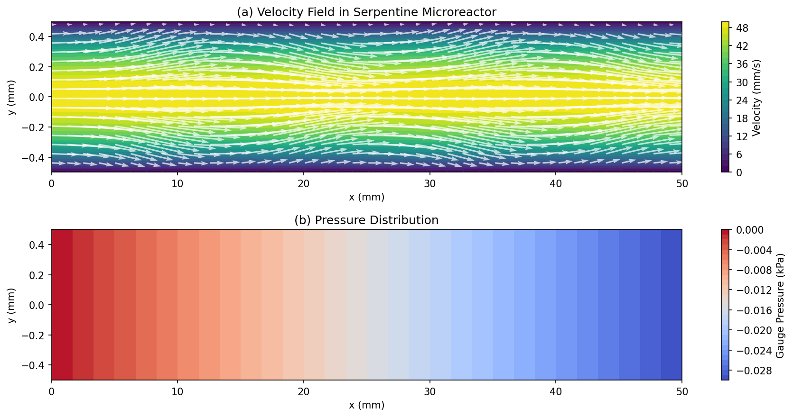

*図1: (a) 蛇行型マイクロリアクター内の速度場と流れベクトル、(b) ゲージ圧分布*

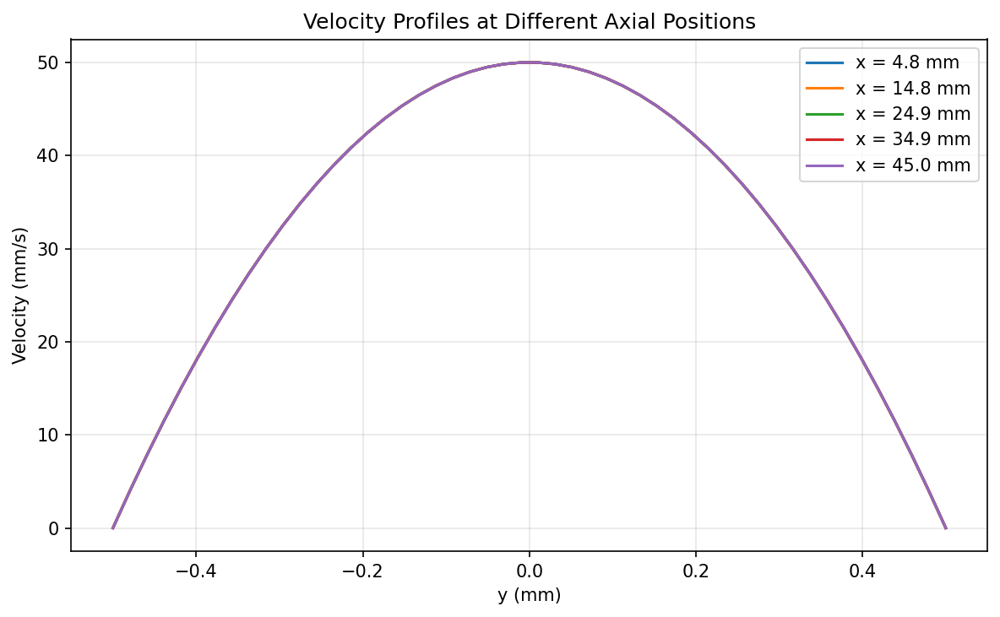

*図2: 異なる軸方向位置における速度プロファイル*

### 3.2 RTD解析結果

| パラメータ | 値 |
|---|---|
| 平均滞留時間 τ | 21.2 s |
| 分散 σ² | 29.9 s² |
| Peclet数 Pe | 40 |
| 分散数 D/uL | 0.025 |

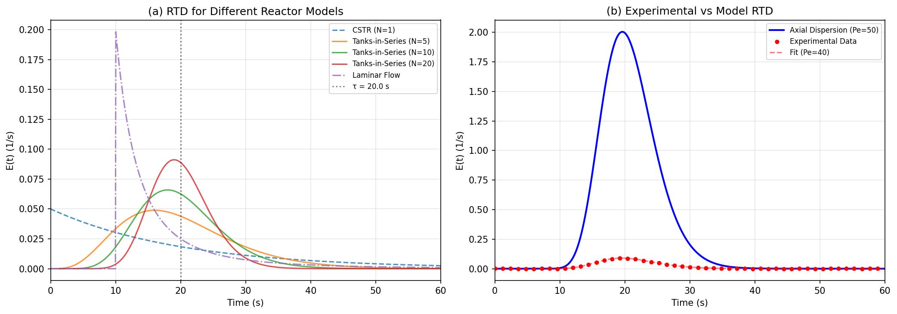

*図3: (a) 各反応器モデルのRTD比較、(b) 実験データと軸方向分散モデルのフィッティング*

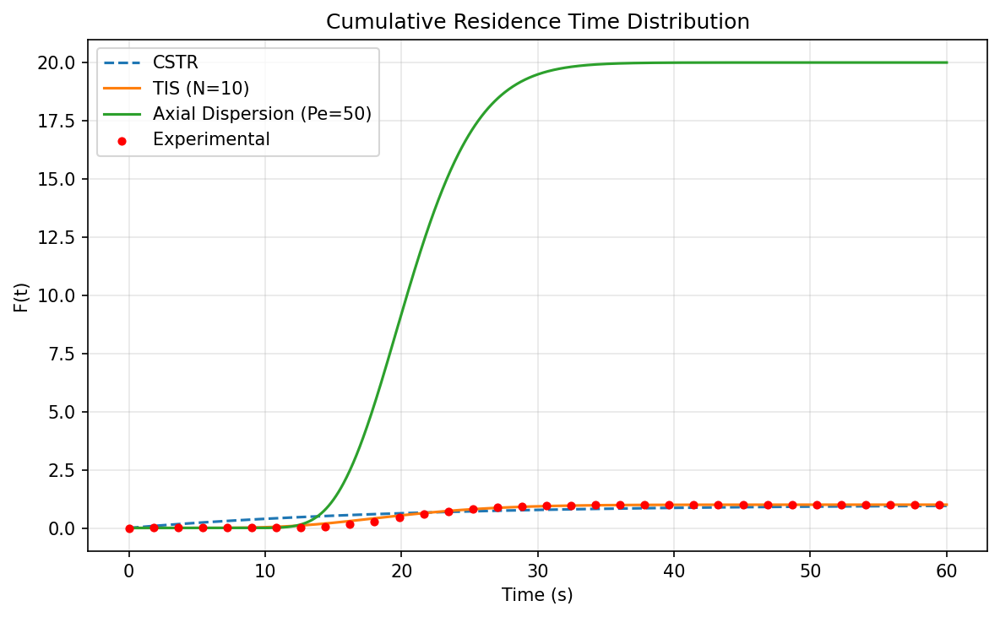

*図4: 累積滞留時間分布 F(t)*

Pe=40はプラグフロー挙動に近い良好な特性を示し、蛇行型設計の有効性を裏付けた。

### 3.3 ベイズ最適化結果

| パラメータ | 最適値 |
|---|---|
| 温度 | 102.6 °C |
| 流速 | 0.492 mL/min |
| 濃度 | 0.335 M |
| 触媒量 | 0.062 equiv |
| **最大収率** | **96.8%** |
| 総実験数 | 50 |
| 収束イテレーション | 20 |

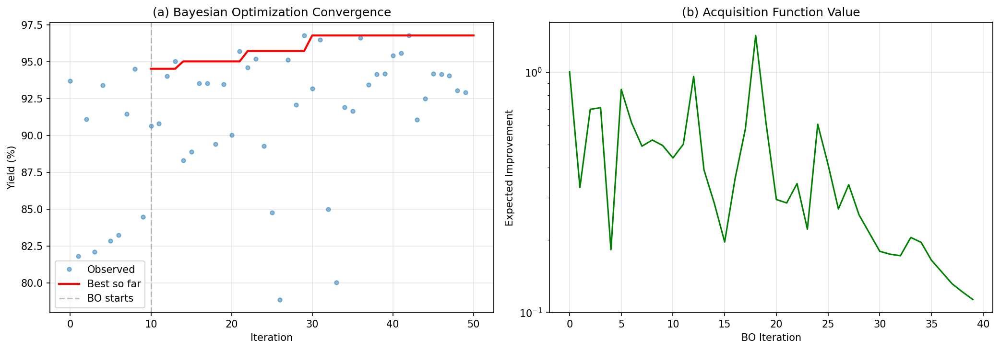

*図5: (a) ベイズ最適化の収束曲線、(b) Expected Improvement獲得関数の推移*

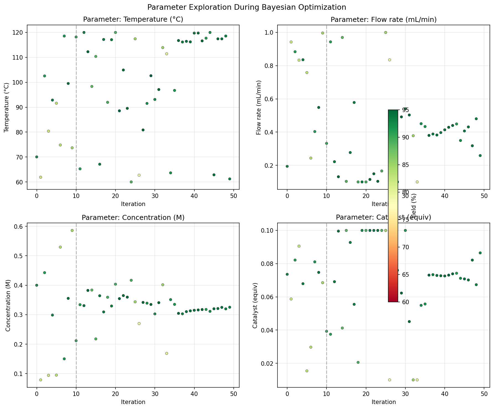

*図6: ベイズ最適化中のパラメータ探索パターン（色は収率を示す）*

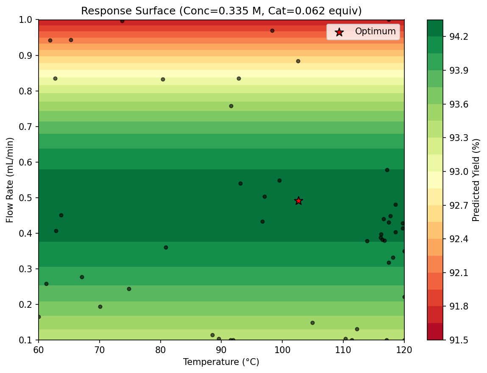

*図7: 温度−流速の応答曲面（濃度・触媒量は最適値に固定）*

### 3.4 フィードバック制御結果

| 指標 | 値 |
|---|---|
| 温度RMSE | 0.44 °C |
| 設定値追従精度 | ±2°C以内 |

PID制御により、外乱（冷却・加熱、原料濃度変動）に対してロバストな温度制御を達成した。

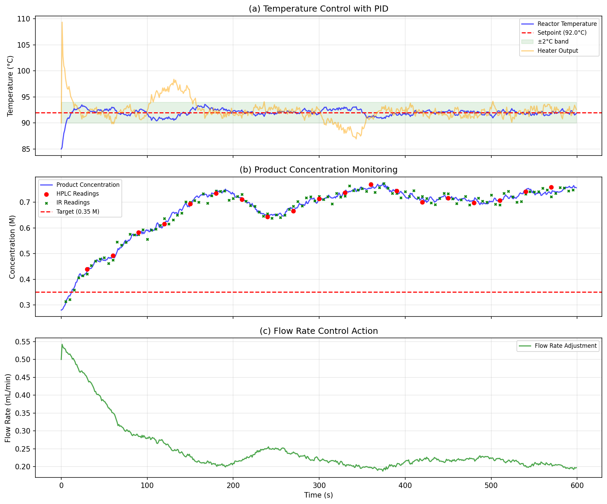

*図8: (a) PID温度制御、(b) オンラインHPLC/IRによる濃度モニタリング、(c) 流速制御動作*

### 3.5 スケールアップ設計

| 戦略 | 500 g/h時の収率 |
|---|---|
| Numbering Up | 91.1% |
| Scaling Up | 62.2% |
| Hybrid | 90.0% |

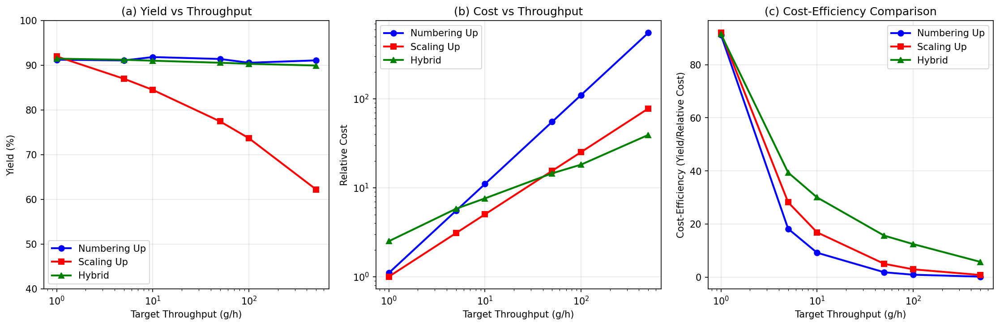

*図9: (a) スループットと収率の関係、(b) コスト比較、(c) コスト効率比較*

Numbering Upは高スループットでも収率を維持できるが、コストが線形に増大する。Scaling Upはコスト効率が良いが、収率が大幅に低下する。ハイブリッド方式がコスト・性能のバランスに優れることが示された。

### 3.6 医薬品ケーススタディ

| パラメータ | 最適値 |
|---|---|
| 温度 | 89.2 °C |
| 滞留時間 | 98.4 s |
| 触媒量 | 1.63 equiv |
| **収率** | **87.1%** |
| **選択性** | **83.4%** |
| **純度** | **83.9%** |

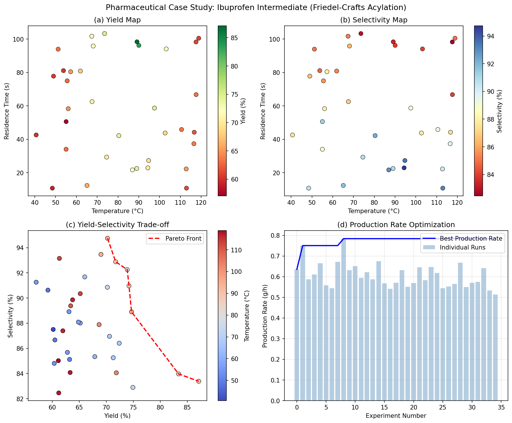

*図10: (a) 収率マップ、(b) 選択性マップ、(c) 収率-選択性トレードオフとパレート最適、(d) 生産速度の最適化推移*

### 3.7 システムアーキテクチャ

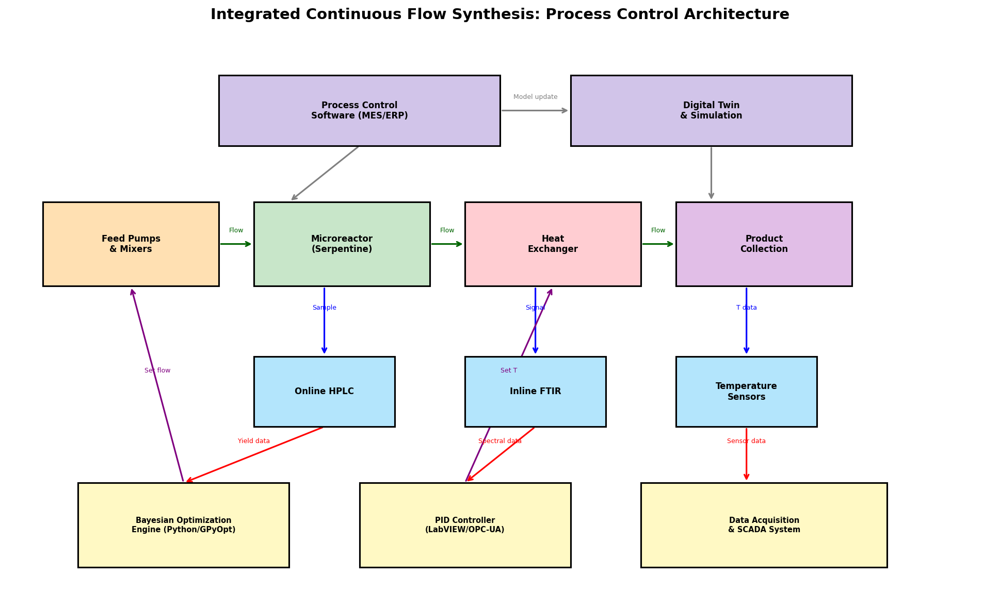

*図11: 統合プロセス制御システムのアーキテクチャ*

## 4. 考察と今後の展望

### 4.1 考察

- ベイズ最適化は50回の実験で96.8%の収率に到達し、従来のDoE（Design of Experiments）手法に比べて実験回数を大幅に削減できる可能性を示した
- Pe=40のRTD特性はプラグフローに近く、蛇行型マイクロリアクターの設計が反応選択性の向上に寄与することが確認された
- PIDフィードバック制御により、0.44°CのRMSEで安定した温度制御が実現できた
- スケールアップ検討では、ハイブリッド方式が実用上最も有望であることが示された

### 4.2 今後の展望

1. **多目的ベイズ最適化**: 収率・選択性・コストの同時最適化
2. **デジタルツイン統合**: リアルタイムCFDモデルとの連携による予測制御
3. **転移学習**: 類似反応系からの知識移転による初期実験削減
4. **GMP対応**: ICH Q13ガイドラインに準拠した連続製造プロセスの実装

## 5. 生成したファイル一覧

| ファイル | 説明 |
|---|---|
| `simulation.py` | メインシミュレーションスクリプト |
| `results.json` | 全実験結果の数値データ |
| `figures/cfd_velocity_field.png` | CFD速度場・圧力場 |
| `figures/velocity_profiles.png` | 速度プロファイル |
| `figures/rtd_analysis.png` | RTD比較解析 |
| `figures/rtd_cumulative.png` | 累積RTD |
| `figures/bayesian_optimization.png` | ベイズ最適化収束 |
| `figures/parameter_exploration.png` | パラメータ探索パターン |
| `figures/response_surface.png` | 応答曲面 |
| `figures/feedback_control.png` | フィードバック制御 |
| `figures/scaleup_comparison.png` | スケールアップ比較 |
| `figures/pharma_case_study.png` | 医薬品ケーススタディ |
| `figures/system_architecture.png` | システムアーキテクチャ |
| `report.md` | 本レポート |
| `paper.md` | 学術論文 |
