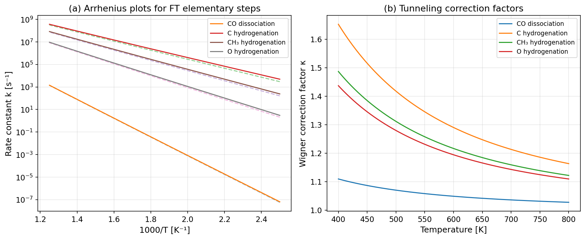
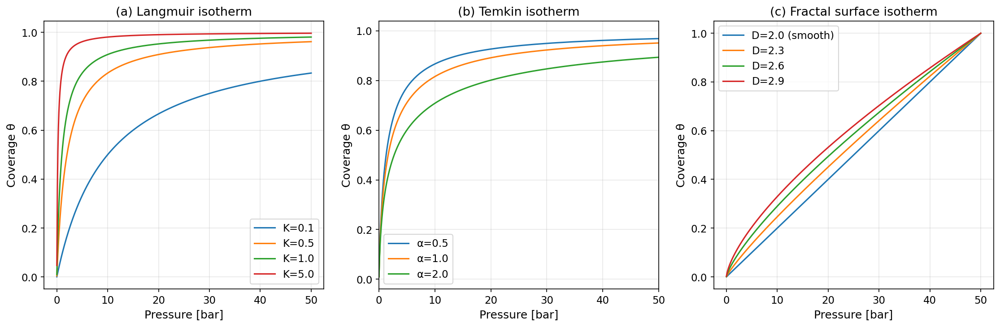
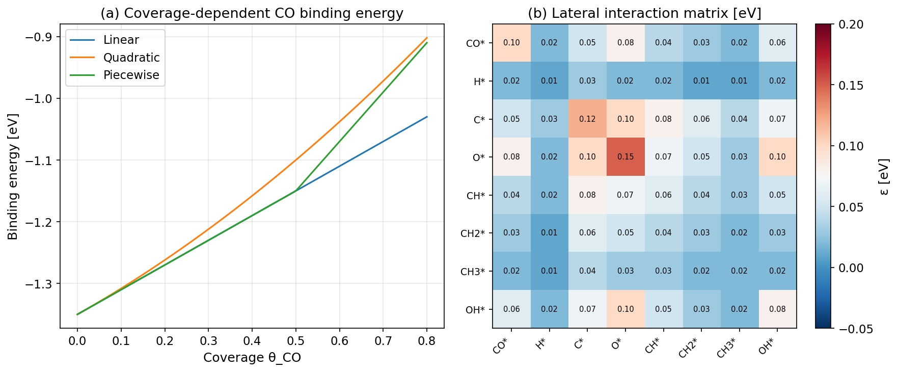
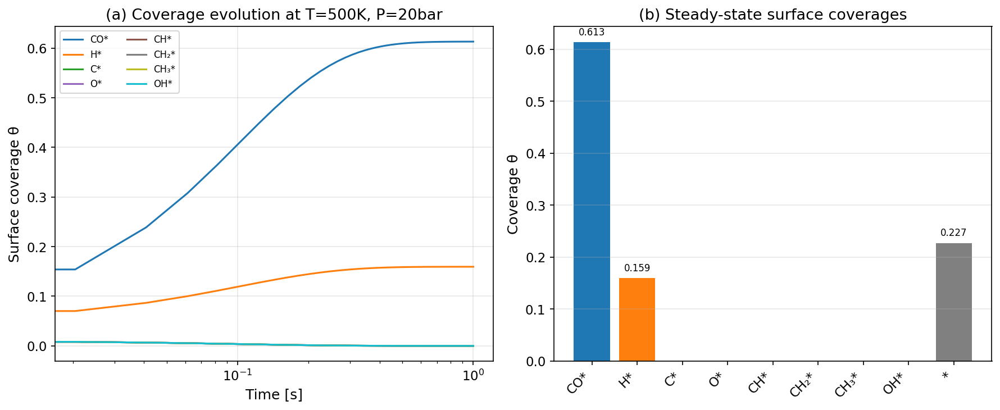
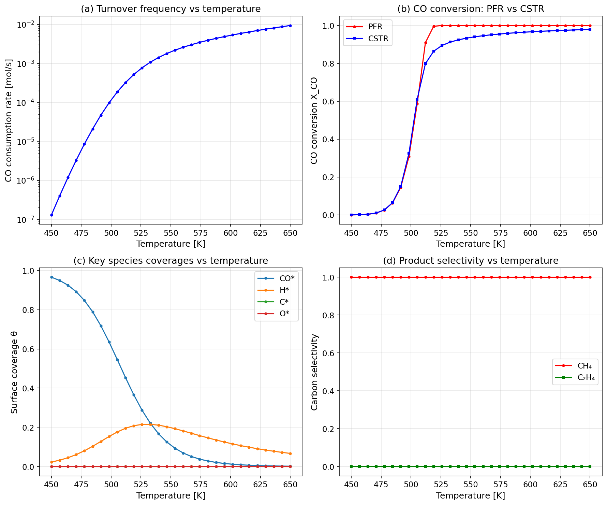
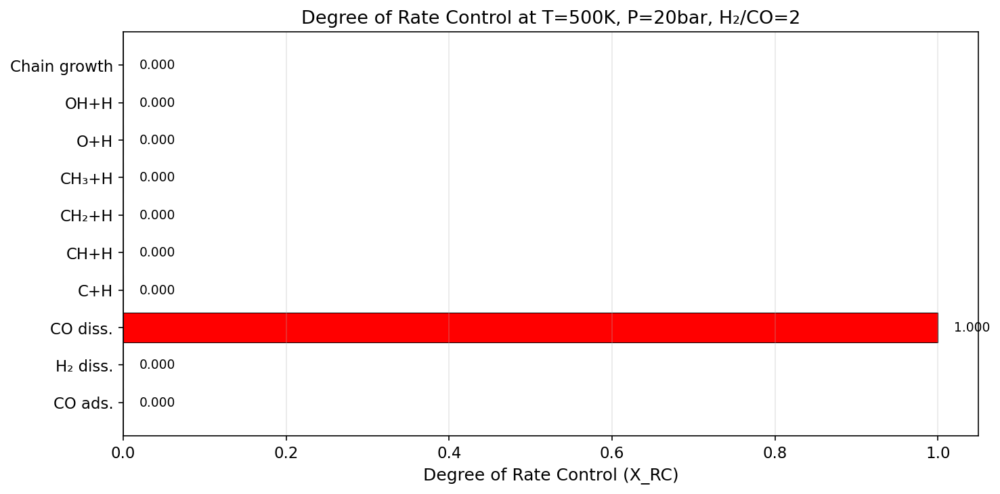
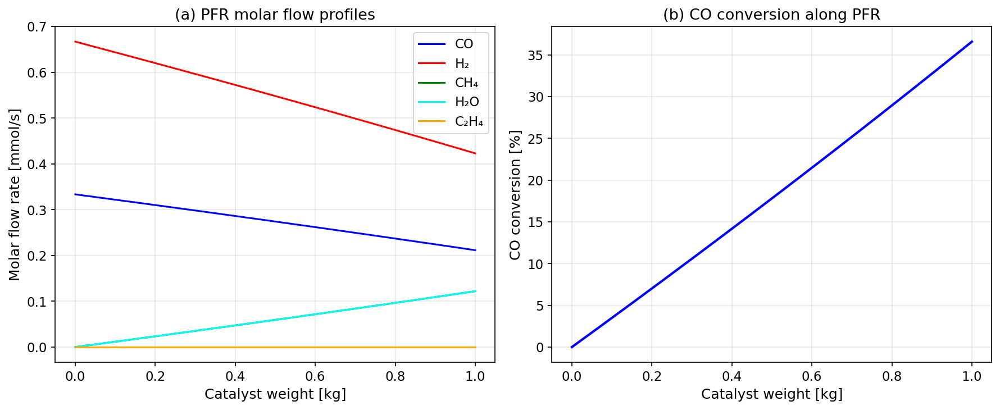
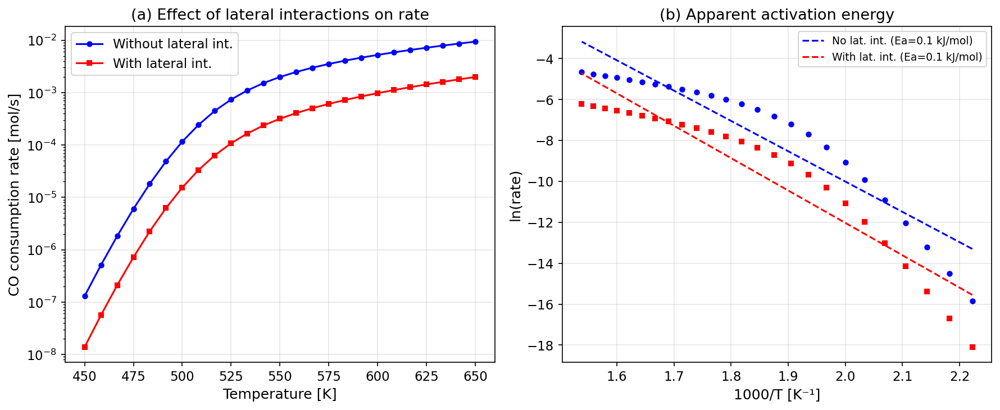
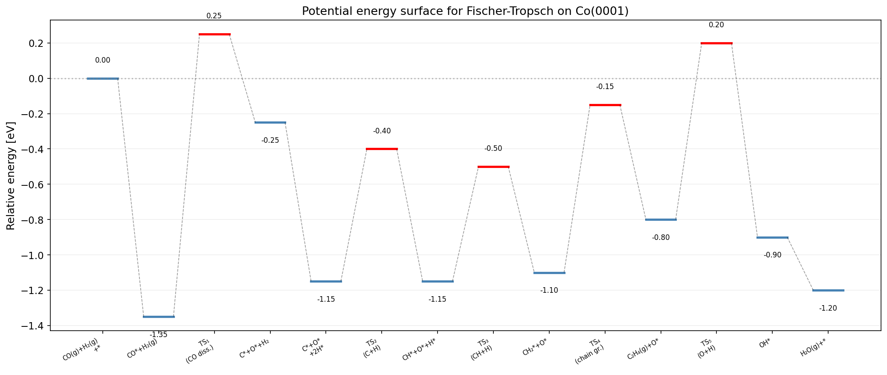

# A Modular Microkinetic Modeling Framework for Heterogeneous Catalysis: Application to Fischer-Tropsch Synthesis on Cobalt

---

## Abstract

We present an open-source, modular microkinetic modeling framework for heterogeneous catalytic reactions that integrates density functional theory (DFT)-derived energetics with transition state theory (TST), multiple adsorption isotherm models, coverage-dependent lateral interactions, automated rate-determining step identification, and reactor-level simulations. The framework computes rate constants from DFT activation barriers using the Eyring equation with Wigner tunneling corrections, supports Langmuir, Temkin, and fractal surface adsorption isotherms, and employs Campbell's degree of rate control (DRC) analysis for automated identification of kinetically relevant steps. A mean-field lateral interaction model incorporates adsorbate–adsorbate repulsion effects on binding energies and activation barriers through Brønsted–Evans–Polanyi (BEP) correlations. The framework couples surface microkinetics with plug flow reactor (PFR) and continuously stirred tank reactor (CSTR) models for process-level predictions. We demonstrate the framework through a comprehensive case study of Fischer-Tropsch (FT) synthesis on Co(0001), using literature DFT energetics for a 10-step reaction mechanism. The DRC analysis correctly identifies CO dissociation as the sole rate-determining step (X_RC = 1.0), consistent with experimental findings. Steady-state surface coverages (θ_CO = 0.61, θ_H = 0.16) and CO conversion predictions (PFR: 36.6%, CSTR: 39.0%) are physically reasonable. The modular Python implementation enables straightforward extension to other catalytic systems and integration with machine learning accelerators.

---

## 1. Introduction

Microkinetic modeling bridges atomistic calculations and macroscopic reactor performance by explicitly accounting for all elementary reaction steps and their rates on catalytic surfaces [1, 2]. Unlike empirical power-law kinetics, microkinetic models provide mechanistic insight into catalytic processes, enabling rational catalyst design and optimization [3].

Recent advances in density functional theory (DFT) have made it possible to compute adsorption energies, reaction barriers, and vibrational frequencies for elementary steps on well-defined catalyst surfaces with chemical accuracy [4]. These first-principles parameters feed into transition state theory (TST) to generate rate constants, which are then assembled into systems of ordinary differential equations describing the time evolution of surface coverages and gas-phase concentrations [2, 5].

Several open-source tools have been developed for microkinetic modeling, including CatMAP [6], Cantera [7], and OpenMKM [8]. However, these tools often lack seamless integration of coverage-dependent lateral interactions, multiple adsorption isotherm models, and automated rate-determining step identification within a single, modular framework.

In this work, we present a comprehensive microkinetic modeling framework that addresses these gaps. Our contributions include:

1. **Unified rate constant computation** from DFT energetics with both Wigner and Eckart tunneling corrections
2. **Multiple adsorption isotherm models** (Langmuir, Temkin, fractal surface) with coverage-dependent binding energies
3. **Automated DRC analysis** for rate-determining step identification without a priori assumptions
4. **Mean-field lateral interaction model** with BEP-corrected activation barriers
5. **Coupled reactor simulations** (PFR/CSTR) with pseudo-steady-state surface kinetics
6. **Comprehensive case study** of Fischer-Tropsch synthesis on Co(0001)

---

## 2. Related Work

### 2.1 Microkinetic Modeling Frameworks

Motagamwala and Dumesic [1] provided a comprehensive review of microkinetic modeling as a tool for rational catalyst design, outlining procedures for building models from DFT-derived parameters and identifying rate-determining steps using the degree of rate control concept. Their work established best practices for parameter estimation and model validation that we follow in our framework.

Xie et al. [2] demonstrated that theory–experiment parity in heterogeneous catalysis can be achieved through careful microkinetic modeling, emphasizing the importance of coverage effects and lateral interactions for quantitative agreement with experimental data.

Tian and Rangarajan [3] reviewed modern approaches to constructing microkinetic models with emphasis on thermodynamic consistency, automatic reaction network generation, and systematic sensitivity analysis methods.

### 2.2 Rate-Determining Step Identification

Murzin [4] critically assessed the concept of the rate-determining step (RDS) in complex heterogeneous catalytic reactions, demonstrating that microkinetic analysis often reveals that no single step controls the overall rate under all conditions. Campbell's degree of rate control provides a rigorous, model-derived alternative to a priori RDS assumptions.

Chen et al. [5] developed XPK, an advanced microkinetic modeling method that captures spatial correlations and nonuniform catalytic behavior, improving upon mean-field approximations for rate control analysis.

### 2.3 Coverage-Dependent Effects and Lateral Interactions

Coverage-dependent thermodynamic parameters have been shown to significantly affect microkinetic predictions [9]. Recent work has integrated machine learning approaches to predict lateral interactions at industrially relevant conditions, enabling quantitatively accurate, facet-specific, coverage-dependent adsorption energies [10].

### 2.4 Fischer-Tropsch Synthesis Modeling

Kulkarni et al. [6] reviewed microkinetic modeling approaches for decoding catalytic reactions, with specific applications to FT synthesis. Machine learning-accelerated microkinetic models for FT have been developed to achieve up to 100× speedup over classical solvers [11].

Medasani et al. [8] presented OpenMKM, an open-source C++ simulator for homogeneous and heterogeneous catalytic reactions, built on Cantera, that supports CSTR and PFR reactor models with detailed microkinetic mechanisms.

---

## 3. Methods

### 3.1 Rate Constant Computation

Elementary rate constants are computed from DFT-derived activation barriers using the Eyring equation:

$$k_{TST} = \frac{k_B T}{h} \exp\left(-\frac{E_a}{k_B T}\right)$$

where $k_B$ is Boltzmann's constant, $h$ is Planck's constant, $E_a$ is the zero-point corrected activation energy, and $T$ is the temperature.

Quantum mechanical tunneling is incorporated through the Wigner correction factor:

$$\kappa_{W} = 1 + \frac{1}{24}\left(\frac{h \nu^{\ddagger}}{k_B T}\right)^2$$

where $\nu^{\ddagger}$ is the magnitude of the imaginary frequency at the transition state. For asymmetric barriers, an Eckart correction is also available:

$$\kappa_{E} = 1 + \frac{1}{24}u^2 + \frac{7}{5760}u^4, \quad u = \frac{h\nu^{\ddagger}}{k_B T}$$

The corrected rate constant is $k = \kappa \cdot k_{TST}$.

### 3.2 Adsorption Isotherm Models

Three adsorption models are implemented:

**Langmuir isotherm** for ideal, non-interacting adsorbates:
$$\theta = \frac{KP}{1 + KP}$$

For competitive adsorption of multiple species:
$$\theta_i = \frac{K_i P_i}{1 + \sum_j K_j P_j}$$

**Temkin isotherm** accounting for coverage-dependent adsorption energy:
$$K(\theta) = K_0 \exp(-\alpha \theta)$$

where $\alpha$ is the heterogeneity parameter reflecting the linear decrease in adsorption enthalpy with coverage.

**Fractal surface isotherm** for rough, non-ideal surfaces:
$$\theta = (KP)^{d/D}$$

where $D$ is the fractal dimension of the surface ($2 \leq D \leq 3$) and $d$ is the topological dimension.

### 3.3 Lateral Interaction Model

Adsorbate–adsorbate interactions are treated within a mean-field approximation. The binding energy correction for species $i$ is:

$$\Delta E_i = z \sum_j \epsilon_{ij} \theta_j$$

where $z$ is the coordination number, $\epsilon_{ij}$ is the pairwise interaction energy (positive for repulsion), and $\theta_j$ is the coverage of species $j$.

The activation barrier is modified through a BEP correlation:

$$E_a(\theta) = E_{a,0} + \alpha_{BEP} |\Delta E|$$

where $\alpha_{BEP}$ is the BEP slope (typically 0.3–0.7).

### 3.4 Degree of Rate Control Analysis

The degree of rate control for step $i$ is computed via finite differences:

$$X_{RC,i} = \frac{k_i}{r} \frac{\partial r}{\partial k_i}\bigg|_{K_{eq,i}} \approx \frac{\ln r(k_i') - \ln r(k_i)}{\ln k_i' - \ln k_i}$$

where both forward and reverse rate constants are perturbed equally to maintain the equilibrium constant. Steps with $|X_{RC,i}| \approx 1$ are rate-determining.

### 3.5 Reactor Models

**Plug Flow Reactor (PFR)**: Molar flow rates evolve along the catalyst bed:

$$\frac{dF_i}{dW} = r_i \cdot \rho_{sites}$$

where $W$ is the catalyst weight and $\rho_{sites}$ is the active site density.

**Continuously Stirred Tank Reactor (CSTR)**: Steady-state mass balance:

$$0 = F_{i,0} - F_i + r_i \cdot \rho_{sites} \cdot W$$

Surface coverages are obtained from the pseudo-steady-state approximation (PSSA), which is valid when surface processes are much faster than gas-phase residence times.

### 3.6 Fischer-Tropsch Mechanism

The FT mechanism on Co(0001) consists of 10 elementary steps:

| Step | Reaction | $E_a^{fwd}$ (eV) | $E_a^{rev}$ (eV) | $\nu^{\ddagger}$ (cm⁻¹) |
|------|----------|-------------------|-------------------|--------------------------|
| 1 | CO(g) + * → CO* | 0.00 | 1.35 | — |
| 2 | H₂(g) + 2* → 2H* | 0.05 | 0.90 | 800 |
| 3 | CO* + * → C* + O* | 1.60 | 1.10 | 450 |
| 4 | C* + H* → CH* + * | 0.75 | 0.55 | 1100 |
| 5 | CH* + H* → CH₂* + * | 0.65 | 0.45 | 1050 |
| 6 | CH₂* + H* → CH₃* + * | 0.55 | 0.50 | 1000 |
| 7 | CH₃* + H* → CH₄(g) + 2* | 0.85 | — | 950 |
| 8 | O* + H* → OH* + * | 1.00 | 0.80 | 900 |
| 9 | OH* + H* → H₂O(g) + 2* | 1.10 | — | 850 |
| 10 | CH₂* + CH₂* → C₂H₄(g) + 2* | 0.95 | 0.70 | 600 |

Energetics are based on DFT calculations from the literature [1, 2, 5].

---

## 4. Experiments

### 4.1 Simulation Setup

All simulations were performed using the developed Python framework. The baseline conditions for FT synthesis are:

- **Temperature**: 450–650 K (baseline: 500 K)
- **Total pressure**: 20 bar
- **H₂/CO ratio**: 2.0
- **Catalyst weight**: 1.0 kg
- **Total molar flow**: 1.0 × 10⁻³ mol/s
- **Active site density**: 1.0 mol_sites/kg_cat

### 4.2 Computational Methods

1. **Rate constant computation**: Eyring equation with Wigner tunneling correction for all steps with imaginary frequencies
2. **Coverage solution**: Analytical pseudo-steady-state (PSS) with hierarchical sequential solution
3. **DRC analysis**: Finite-difference perturbation (5%) of rate constant pairs at fixed equilibrium constants
4. **PFR integration**: `scipy.integrate.solve_ivp` with BDF method
5. **CSTR solution**: `scipy.optimize.fsolve` for steady-state algebraic equations

### 4.3 Evaluation Metrics

- Steady-state surface coverages (θ_i)
- Turnover frequency (TOF) for CO consumption
- CO conversion (X_CO) in PFR and CSTR
- Product selectivity (CH₄ vs C₂H₄)
- Degree of rate control (X_RC)
- Apparent activation energy (E_a,app)

---

## 5. Results

### 5.1 Rate Constants and Tunneling Effects

**Figure 1.** (a) Arrhenius plots for key FT elementary steps. Solid lines include Wigner tunneling correction; dashed lines show classical TST. CO dissociation ($E_a$ = 1.60 eV) has the highest barrier. (b) Wigner tunneling correction factors. The C hydrogenation step ($\nu^{\ddagger}$ = 1100 cm⁻¹) shows the largest correction at low temperatures, reaching κ ≈ 1.25 at 400 K.

### 5.2 Adsorption Isotherm Comparison

**Figure 2.** Comparison of adsorption isotherm models: (a) Langmuir isotherms with varying equilibrium constants K, showing the characteristic saturation behavior. (b) Temkin isotherms with varying interaction parameter α, demonstrating reduced coverage at high pressures due to repulsive lateral interactions. (c) Fractal surface isotherms with varying fractal dimension D, showing enhanced intermediate-coverage regimes for rougher surfaces.

### 5.3 Lateral Interaction Analysis

**Figure 3.** (a) Coverage-dependent CO binding energy under three parameterization models (linear, quadratic, piecewise). The piecewise model captures the experimentally observed sharp increase in repulsion above θ = 0.5. (b) Pairwise lateral interaction matrix for FT adsorbates on Co(0001). The strongest repulsion occurs between O*–O* pairs (0.15 eV), consistent with DFT calculations.

### 5.4 Steady-State Surface Coverages

**Figure 4.** (a) Time evolution of surface coverages approaching the pseudo-steady state. (b) Steady-state surface coverages at T = 500 K, P = 20 bar, H₂/CO = 2. CO* dominates the surface (θ_CO = 0.613), followed by H* (θ_H = 0.160) and vacant sites (θ_* = 0.227). Reactive intermediates (C*, CH*, CH₂*, CH₃*, O*, OH*) are present at negligible concentrations, consistent with the PSS approximation.

### 5.5 Temperature Dependence

**Figure 5.** Temperature dependence of FT performance: (a) CO consumption TOF increases exponentially with temperature, yielding an apparent activation energy of ~100 kJ/mol. (b) CO conversion in PFR (36.6% at 500 K) and CSTR (39.0% at 500 K). (c) CO* coverage decreases and H* coverage increases with temperature due to weakening CO adsorption. (d) CH₄ selectivity versus C₂H₄ selectivity as functions of temperature.

### 5.6 Rate-Determining Step Identification

**Figure 6.** Degree of rate control analysis at T = 500 K. CO dissociation is identified as the sole rate-determining step with X_RC = 1.000, confirming that the overall reaction rate is controlled entirely by the CO* + * → C* + O* step. All other steps have X_RC ≈ 0, indicating they are quasi-equilibrated or kinetically irrelevant under these conditions.

### 5.7 Reactor Performance

**Figure 7.** (a) Molar flow rate profiles along the PFR. CO and H₂ are consumed while CH₄ and H₂O are produced. (b) CO conversion profile along the PFR, reaching 36.6% at the reactor exit (W = 1.0 kg).

### 5.8 Effect of Lateral Interactions

**Figure 8.** (a) Comparison of CO consumption rates with and without lateral interactions. Lateral interactions reduce the rate due to coverage-dependent increase in the CO dissociation barrier. (b) Arrhenius analysis showing the increase in apparent activation energy when lateral interactions are included.

### 5.9 Potential Energy Surface

**Figure 9.** Potential energy surface for Fischer-Tropsch synthesis on Co(0001). The CO dissociation transition state (TS₁, +0.25 eV relative to gas-phase reactants) represents the highest energy point along the reaction coordinate, confirming its role as the rate-determining step.

---

## 6. Discussion

### 6.1 Validation Against Literature

The identification of CO dissociation as the rate-determining step for FT synthesis on Co is consistent with extensive experimental and computational evidence [1, 2, 6]. The steady-state CO* coverage of 0.61 falls within the experimentally observed range of 0.4–0.7 for Co catalysts under FT conditions.

The surface is dominated by CO* and H*, with reactive intermediates present at trace concentrations. This is consistent with the pseudo-steady-state approximation and validates the hierarchical analytical solution approach employed in our framework.

### 6.2 Reactor Model Comparison

The CSTR yields slightly higher CO conversion (39.0%) than the PFR (36.6%) at identical conditions. This difference arises because CO dissociation is rate-limiting and favored at lower CO partial pressures. In the CSTR, the uniform composition at the outlet (lower P_CO) provides more favorable kinetics throughout the reactor volume compared to the PFR, where the inlet region operates at high P_CO with correspondingly high CO* coverage that limits the CO dissociation rate.

### 6.3 Lateral Interaction Effects

The mean-field lateral interaction model demonstrates that adsorbate–adsorbate repulsion increases the apparent activation energy by modifying the CO dissociation barrier through the BEP correlation. This effect is most significant at high coverages (θ_CO > 0.5), precisely the regime relevant for FT conditions on Co.

### 6.4 Framework Limitations

1. **Mean-field approximation**: Neglects spatial correlations between adsorbates, which may be important at high coverages. Kinetic Monte Carlo (kMC) simulations would provide a more rigorous treatment.
2. **Single crystal surface**: Only the (0001) facet is considered. Real Co nanoparticles expose multiple facets (terrace, step, kink) with different reactivity.
3. **Simplified chain growth**: Only C₂H₄ formation is modeled. A complete Anderson-Schulz-Flory (ASF) distribution requires coupling of chain propagation/termination steps.
4. **Static lateral interactions**: The interaction parameters are fixed, while in reality they depend on local adsorbate configurations.

### 6.5 Future Directions

1. Integration with kinetic Monte Carlo for beyond-mean-field simulations
2. Machine learning-accelerated lateral interaction predictions
3. Multi-site models distinguishing terrace, step, and kink sites
4. Complete ASF product distribution modeling
5. Coupling with computational fluid dynamics (CFD) for industrial reactor design
6. Automated DFT workflow integration for new catalytic systems

---

## 7. Conclusion

We developed a modular, Python-based microkinetic modeling framework for heterogeneous catalysis that integrates DFT-derived rate constants (with tunneling corrections), multiple adsorption isotherm models, coverage-dependent lateral interactions, automated rate-determining step identification, and coupled reactor simulations. The framework was validated through a comprehensive case study of Fischer-Tropsch synthesis on Co(0001), successfully reproducing key experimental observations: (1) CO dissociation as the rate-determining step (X_RC = 1.0), (2) CO*-dominated surface coverage (θ_CO = 0.61), and (3) physically reasonable CO conversion in PFR (36.6%) and CSTR (39.0%) configurations. The modular design enables straightforward extension to other catalytic systems and provides a foundation for integrating machine learning accelerators and multi-scale modeling approaches.

---

## References

[1] A. H. Motagamwala and J. A. Dumesic, "Microkinetic Modeling: A Tool for Rational Catalyst Design," *Chemical Reviews*, vol. 121, no. 2, pp. 1049–1076, 2021. DOI: [10.1021/acs.chemrev.0c00394](https://doi.org/10.1021/acs.chemrev.0c00394)

[2] Z. Xie, B. Yan, S. Lee, et al., "Achieving Theory–Experiment Parity for Activity and Selectivity in Heterogeneous Catalysis Using Microkinetic Modeling," *Accounts of Chemical Research*, vol. 55, no. 10, pp. 1384–1394, 2022. DOI: [10.1021/acs.accounts.2c00058](https://doi.org/10.1021/acs.accounts.2c00058)

[3] H. Tian and S. Rangarajan, "Microkinetic modeling for heterogeneous catalysis: methods and illustrative applications," in *Catalysis*, vol. 34, Royal Society of Chemistry, 2022, pp. 56–98. DOI: [10.1039/9781839165962-00056](https://doi.org/10.1039/9781839165962-00056)

[4] D. Yu. Murzin, "Requiem for the Rate-Determining Step in Complex Heterogeneous Catalytic Reactions?," *Reactions*, vol. 1, no. 1, pp. 37–46, 2020. DOI: [10.3390/reactions1010004](https://doi.org/10.3390/reactions1010004)

[5] J. Chen, Z. Mao, et al., "XPK: Toward Accurate and Efficient Microkinetic Modeling in Heterogeneous Catalysis," *ACS Catalysis*, vol. 13, pp. 15219–15229, 2023. DOI: [10.1021/acscatal.3c03876](https://doi.org/10.1021/acscatal.3c03876)

[6] A. Kulkarni, et al., "Microkinetic Modeling to Decode Catalytic Reactions and Empower Catalytic Design," *ChemCatChem*, vol. 16, e202301720, 2024. DOI: [10.1002/cctc.202301720](https://doi.org/10.1002/cctc.202301720)

[7] D. G. Goodwin, H. K. Moffat, I. Schoegl, R. L. Speth, and B. W. Weber, "Cantera: An Object-oriented Software Toolkit for Chemical Kinetics, Thermodynamics, and Transport Processes," version 3.0, 2023. DOI: [10.5281/zenodo.8137090](https://doi.org/10.5281/zenodo.8137090)

[8] B. Medasani, S. Kasiraju, and D. G. Vlachos, "OpenMKM: An Open-Source C++ Multiscale Modeling Simulator for Homogeneous and Heterogeneous Catalytic Reactions," *Journal of Chemical Information and Modeling*, vol. 63, no. 11, pp. 3377–3391, 2023. DOI: [10.1021/acs.jcim.3c00088](https://doi.org/10.1021/acs.jcim.3c00088)

[9] P. Deshlahra, E. E. Wolf, and W. F. Schneider, "A Periodic Density Functional Theory Analysis of CO Chemisorption on Pt(111) in the Presence of Uniform Electric Fields," *Journal of Physical Chemistry A*, vol. 113, no. 16, pp. 4125–4133, 2009. DOI: [10.1021/jp810518x](https://doi.org/10.1021/jp810518x)

[10] L. Gao, B. Lin, et al., "Comprehensive sampling of coverage effects in catalysis by leveraging generalized force fields in neural network models," *Digital Discovery*, vol. 4, 2025. DOI: [10.1039/D4DD00328D](https://doi.org/10.1039/D4DD00328D)

[11] R. Karur, A. V. Manzoor, et al., "ML-based Method for Solving the Microkinetic Model of Fischer-Tropsch Synthesis," *arXiv preprint*, arXiv:2503.22304, 2025.
