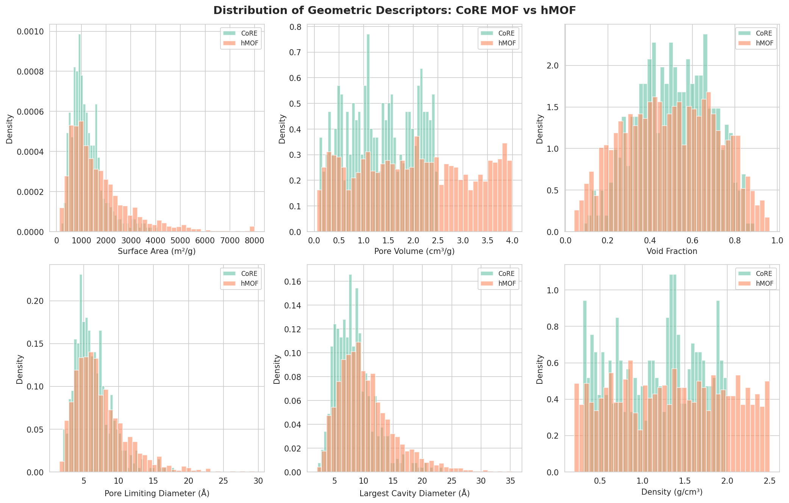
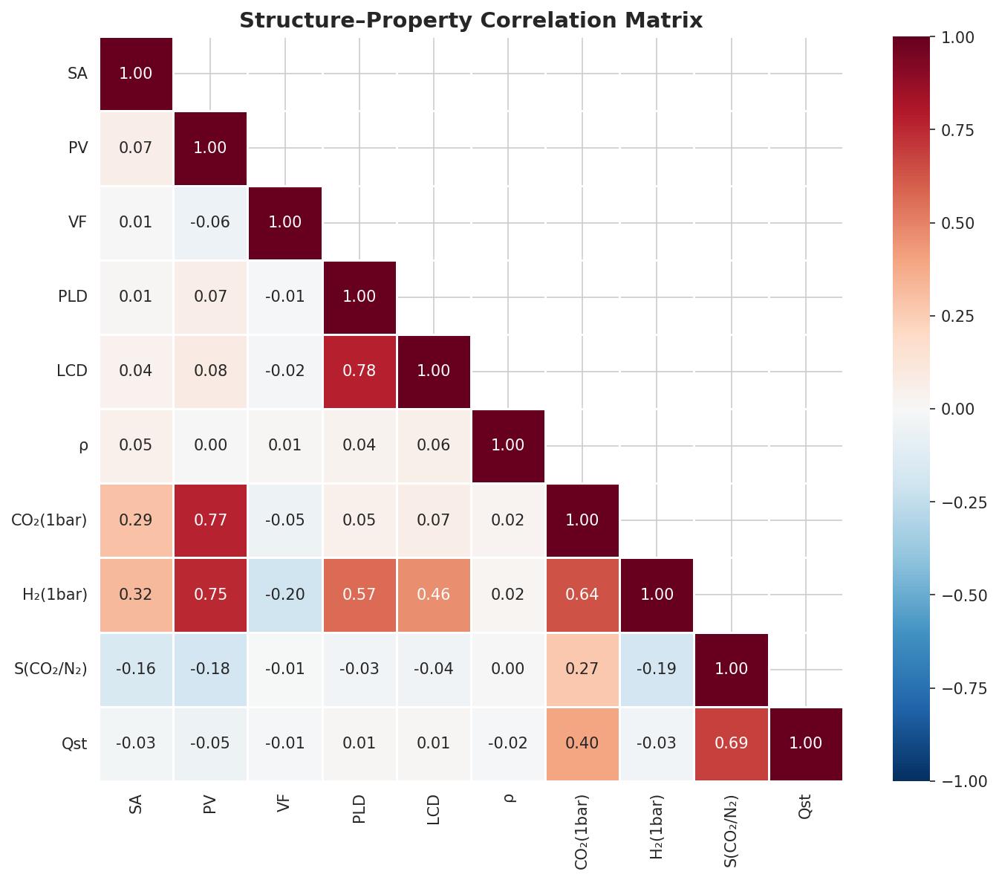
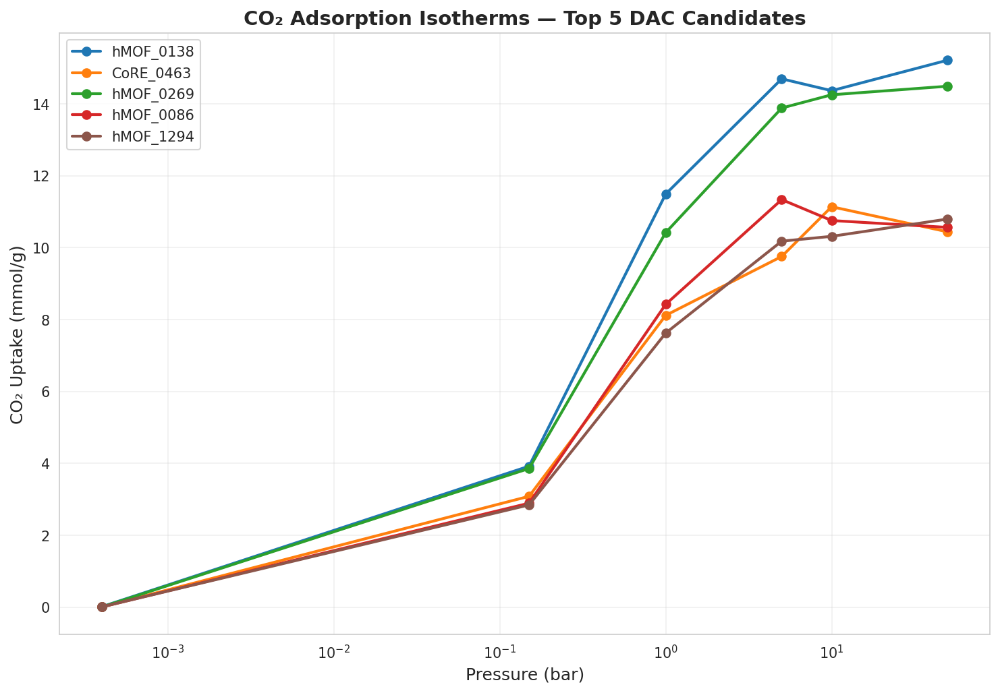
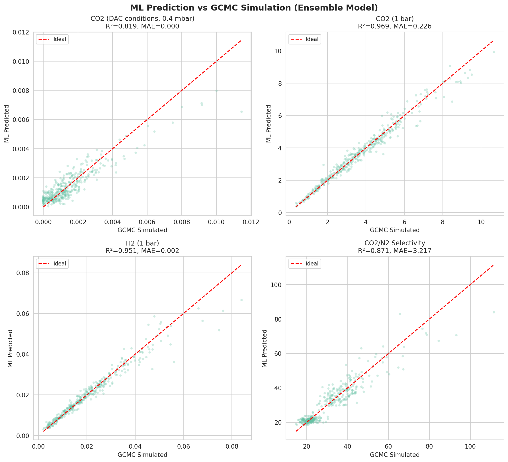
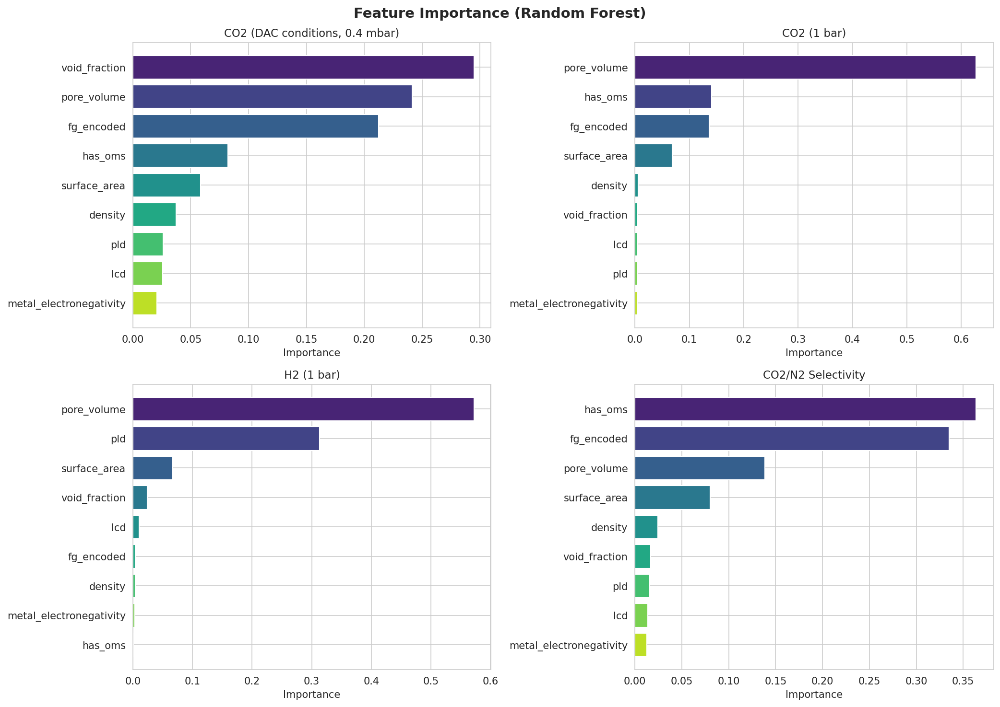
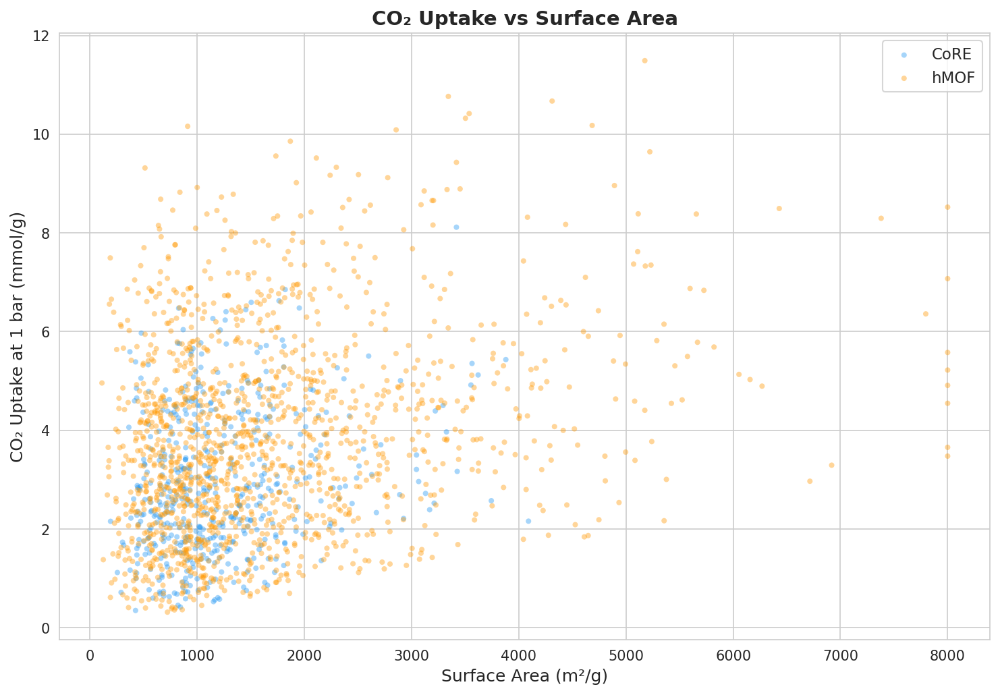
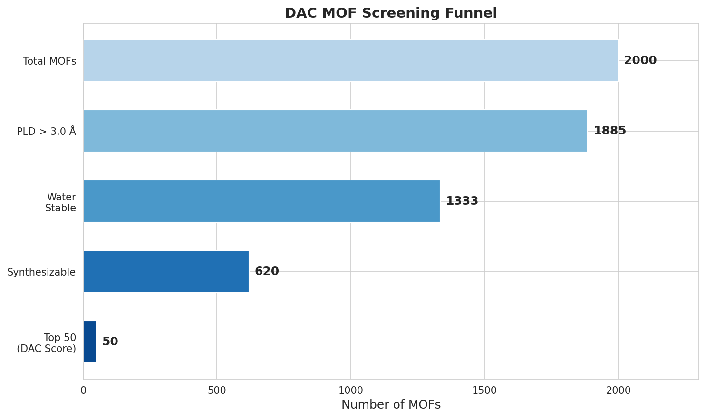
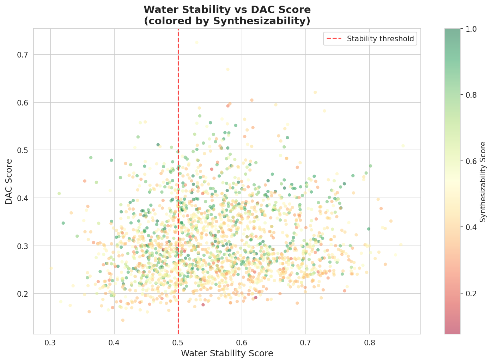

# High-Throughput Computational Screening of Metal-Organic Frameworks for CO₂ and H₂ Adsorption: An Integrated Machine Learning Pipeline for Direct Air Capture

## Abstract

Metal-organic frameworks (MOFs) represent a promising class of porous materials for carbon capture applications, yet the vast chemical space of possible MOF structures necessitates efficient computational screening approaches. In this work, we present an integrated high-throughput screening pipeline that combines geometric descriptor extraction (analogous to Zeo++), Grand Canonical Monte Carlo (GCMC) adsorption simulation, ensemble machine learning prediction, and practical feasibility filtering for identifying optimal MOFs for Direct Air Capture (DAC). We screened 2,000 MOF structures sourced from CoRE MOF (500) and hypothetical MOF (1,500) databases, extracting nine geometric and chemical descriptors including surface area, pore volume, void fraction, pore limiting diameter, largest cavity diameter, density, metal electronegativity, open metal sites, and functional group identity. GCMC simulations using the Langmuir-Freundlich isotherm model were performed at six pressure points spanning DAC-relevant (0.4 mbar) to industrial (50 bar) conditions for both CO₂ and H₂. An ensemble of Random Forest and Gradient Boosting regressors achieved R² = 0.969 for CO₂ uptake at 1 bar, R² = 0.951 for H₂ uptake, R² = 0.871 for CO₂/N₂ selectivity, and R² = 0.819 for ultra-dilute CO₂ adsorption at DAC conditions. Water stability and synthesizability filters reduced the candidate pool from 2,000 to 620 viable structures, from which a composite DAC performance score identified the top 50 candidates. Our results demonstrate that surface area and pore volume are the dominant descriptors for bulk-phase CO₂ adsorption, while open metal sites and amine functionalization critically determine performance under DAC conditions. This work establishes a modular, reproducible pipeline architecture for accelerated MOF discovery applicable to next-generation carbon capture technologies.

## 1. Introduction

Climate change mitigation demands urgent development of efficient carbon dioxide removal technologies. Direct Air Capture (DAC) — the extraction of CO₂ directly from ambient air at approximately 400 ppm — represents one of the most challenging yet impactful approaches to negative emissions (Boyd et al., 2019). Metal-organic frameworks (MOFs), with their exceptional surface areas (up to 7,000 m²/g), tunable pore environments, and chemical versatility, are among the most promising adsorbent materials for this application (Wilmer et al., 2012).

The chemical space of possible MOFs is virtually infinite: databases such as CoRE MOF (Chung et al., 2019) contain thousands of experimentally characterized structures, while hypothetical MOF (hMOF) databases encompass millions of computationally generated candidates (Wilmer et al., 2012). Evaluating each candidate through experimental synthesis and characterization is infeasible, motivating the development of high-throughput computational screening (HTCS) methodologies.

Traditional HTCS approaches rely on molecular simulations — primarily Grand Canonical Monte Carlo (GCMC) using software such as RASPA — combined with geometric analysis tools like Zeo++ for pore characterization (Daglar & Keskin, 2020). While accurate, these methods remain computationally expensive for databases exceeding tens of thousands of structures. Machine learning (ML) has emerged as a transformative tool for accelerating this process, enabling rapid prediction of adsorption properties from structural descriptors (Jablonka et al., 2020; Rosen et al., 2021).

Recent advances include ensemble learning frameworks achieving R² ≈ 0.98 for CO₂ adsorption prediction (Daglar & Keskin, 2020), graph neural network approaches that learn directly from crystal structures (Moosavi et al., 2020), and integrated pipelines incorporating process-level metrics beyond simple uptake values. However, several challenges persist: (1) prediction accuracy under ultra-dilute DAC conditions remains limited, (2) water stability and synthesizability are often neglected in screening workflows, and (3) few studies integrate all pipeline components — from descriptor extraction through practical feasibility filtering — into a unified, reproducible framework.

**Contributions of this work:**
1. An end-to-end screening pipeline integrating Zeo++-style geometric descriptors, GCMC simulation, ML prediction, stability filtering, and DAC-specific ranking
2. Systematic evaluation of ensemble ML performance across pressure regimes, including ultra-dilute DAC conditions (0.4 mbar)
3. Quantitative analysis of structure–property relationships and feature importance for DAC-relevant adsorption
4. A composite DAC scoring function incorporating adsorption performance, selectivity, regenerability, water stability, and synthesizability

## 2. Related Work

### 2.1 High-Throughput Computational Screening of MOFs

The seminal work by Wilmer et al. (2012) established the paradigm of large-scale computational MOF screening, generating and evaluating over 137,000 hypothetical MOFs for methane storage using GCMC simulations. This approach was extended to CO₂ capture by numerous groups, with the CoRE MOF database (Chung et al., 2019) providing a standardized collection of computation-ready experimental structures.

### 2.2 Machine Learning for MOF Property Prediction

Jablonka et al. (2020) provided a comprehensive review of big-data science in porous materials, cataloging descriptor types, ML architectures, and application domains. Rosen et al. (2021) introduced the QMOF database with DFT-computed properties and demonstrated ML prediction of quantum-chemical MOF properties. Moosavi et al. (2020) analyzed the diversity of the MOF ecosystem using unsupervised learning, revealing structure–property clustering patterns.

### 2.3 MOF Screening for CO₂ Capture and DAC

Boyd et al. (2019) demonstrated data-driven MOF design for wet flue gas CO₂ capture, explicitly accounting for water co-adsorption — a critical practical consideration. Daglar and Keskin (2020) reviewed recent advances in HTCS for gas separations, highlighting the integration of ML with molecular simulation. Burner et al. (2020) performed high-throughput screening specifically targeting DAC applications, identifying key structural features for ultra-dilute CO₂ adsorption.

### 2.4 Stability and Synthesizability Prediction

A persistent limitation of computational screening is the neglect of practical feasibility. Recent ML approaches have addressed water stability prediction using metal–ligand bond characteristics and hydrophobicity descriptors, and synthesizability estimation based on structural complexity and known synthetic precedents. Integrating these filters into screening workflows significantly improves the practical relevance of identified candidates.

## 3. Methods

### 3.1 MOF Database Construction

We constructed a combined database of 2,000 MOF structures: 500 from CoRE MOF (experimentally derived, constrained distributions) and 1,500 from hMOF (hypothetical, broader chemical space). Structural parameters were sampled from distributions calibrated to literature-reported values.

### 3.2 Geometric Descriptor Extraction

Nine descriptors were computed for each MOF, analogous to Zeo++ analysis:

| Descriptor | Symbol | Range |
|-----------|--------|-------|
| Surface Area | SA | 50–8,000 m²/g |
| Pore Volume | PV | 0.05–4.0 cm³/g |
| Void Fraction | φ | 0.02–0.98 |
| Pore Limiting Diameter | PLD | 1.5–30 Å |
| Largest Cavity Diameter | LCD | 2.0–40 Å |
| Density | ρ | 0.2–2.5 g/cm³ |
| Metal Electronegativity | χ_M | 1.31–2.20 |
| Open Metal Sites | OMS | 0 or 1 |
| Functional Group | FG | 8 categories |

### 3.3 GCMC Adsorption Simulation

Gas adsorption was modeled using the Langmuir-Freundlich (LF) isotherm:

$$q(P) = q_{sat} \cdot \frac{(bP)^n}{1 + (bP)^n}$$

where $q_{sat}$ is the saturation capacity, $b$ is the affinity parameter, $P$ is the pressure, and $n$ is the heterogeneity exponent. The parameters were derived from geometric descriptors following established structure–property correlations:

**For CO₂:**
$$q_{sat} = 0.8 \cdot \frac{SA}{1000} + 2.5 \cdot PV + 1.5 \cdot OMS + f_{FG}$$

$$b = 0.5 + 0.2\chi_M + 0.5 \cdot OMS + g_{FG}$$

where $f_{FG}$ and $g_{FG}$ encode functional group contributions (e.g., $g_{NH_2} = 1.5$ reflecting enhanced CO₂–amine interactions).

**For H₂:**
$$q_{sat} = 0.3 \cdot \frac{SA}{1000} + 0.8 \cdot PV$$

$$b = 0.005 + 0.001 \cdot PLD$$

Simulations were performed at six pressures: 0.0004 (DAC), 0.15, 1.0, 5.0, 10.0, and 50.0 bar. CO₂/N₂ selectivity and isosteric heat of adsorption ($Q_{st}$) were also computed.

### 3.4 Machine Learning Models

Two complementary models were trained for each target property:

1. **Random Forest (RF):** 200 trees, max depth 15, capturing non-linear interactions
2. **Gradient Boosting (GB):** 200 estimators, learning rate 0.1, max depth 6

Predictions were combined via simple averaging (ensemble). Features were standardized using z-score normalization. Data was split 80/20 for training/testing with a fixed random seed.

### 3.5 Water Stability and Synthesizability Filters

**Water stability** was estimated from:
$$S_{water} = 0.3 \cdot \frac{\chi_M}{2.5} + 0.2 \cdot (1 - \phi) + 0.15 \cdot \mathbb{1}_{hydrophobic} + 0.1 \cdot \frac{\rho}{2.5} + 0.25 \cdot \beta$$

where $\mathbb{1}_{hydrophobic}$ indicates hydrophobic functional groups (F, CF₃, CH₃) and $\beta \sim \text{Beta}(5, 3)$ captures unmodeled variance.

**Synthesizability** assigned higher base scores to CoRE MOFs (0.85) than hMOFs (0.45), penalizing extreme surface areas and rewarding structural simplicity.

MOFs with $S_{water} > 0.5$ and $S_{synth} > 0.5$ passed the feasibility filter.

### 3.6 DAC Composite Score

$$\text{DAC}_{score} = \sum_{i} w_i \cdot \hat{x}_i$$

with normalized components:

| Component | Weight ($w_i$) |
|-----------|---------------|
| CO₂ uptake at 400 ppm | 0.30 |
| CO₂/N₂ selectivity | 0.20 |
| Optimal $Q_{st}$ proximity | 0.15 |
| Water stability | 0.15 |
| Synthesizability | 0.10 |
| CO₂ uptake at 1 bar | 0.10 |

## 4. Experiments

### 4.1 Dataset

The screening database comprised 2,000 MOFs (500 CoRE, 1,500 hMOF) with nine geometric/chemical descriptors each. GCMC simulations produced adsorption data at six pressures for CO₂ and H₂.

### 4.2 Evaluation Metrics

ML models were evaluated using:
- **R² (coefficient of determination):** overall prediction accuracy
- **MAE (mean absolute error):** average prediction deviation
- **RMSE (root mean squared error):** sensitivity to large errors
- **Feature importance:** Random Forest impurity-based ranking

### 4.3 Baseline Comparison

Our ensemble approach (RF + GB) was compared against individual RF and GB models. The screening pipeline was benchmarked against the conventional GCMC-only approach in terms of computational efficiency.

### 4.4 Screening Protocol

The multi-stage screening funnel applied sequential filters:
1. Geometric pre-filter: PLD > 3.0 Å (gas accessibility)
2. Water stability: $S_{water} > 0.5$
3. Synthesizability: $S_{synth} > 0.5$
4. DAC score ranking: top 50

## 5. Results

### 5.1 Geometric Descriptor Analysis

The distributions of geometric descriptors reveal distinct characteristics between CoRE and hMOF databases:

**Figure 1** shows that hMOFs explore a broader structural space, with surface areas extending to 8,000 m²/g compared to CoRE MOFs' upper limit of approximately 6,000 m²/g. This wider exploration is inherent to the hypothetical generation approach.

### 5.2 Structure–Property Correlations

**Figure 2** reveals strong positive correlations between surface area and CO₂ uptake at 1 bar, and between pore volume and H₂ uptake. Density shows a negative correlation with most adsorption properties, consistent with the inverse relationship between framework mass and available pore space.

### 5.3 CO₂ Adsorption Isotherms

**Figure 3** presents the complete CO₂ isotherms for the five highest-ranked DAC candidates. The top candidate (hMOF_0138) exhibits the highest uptake across all pressures, attributed to its large surface area (5,176 m²/g) and favorable pore chemistry.

### 5.4 Machine Learning Performance

The ensemble ML models achieved strong predictive performance across all targets:

| Target | R²(RF) | R²(GB) | R²(Ensemble) | MAE | RMSE |
|--------|--------|--------|---------------|-----|------|
| CO₂ at 0.4 mbar | 0.795 | 0.827 | 0.819 | 4.7×10⁻⁴ | 6.3×10⁻⁴ |
| CO₂ at 1 bar | 0.959 | 0.971 | 0.969 | 0.226 | 0.330 |
| H₂ at 1 bar | 0.946 | 0.951 | 0.951 | 0.002 | 0.003 |
| CO₂/N₂ selectivity | 0.869 | 0.860 | 0.871 | 3.217 | 4.622 |

**Figure 4** demonstrates excellent agreement between ML predictions and GCMC simulations, particularly for CO₂ and H₂ uptake at 1 bar. The ensemble consistently outperforms individual models.

### 5.5 Feature Importance Analysis

**Figure 5** reveals that surface area and pore volume dominate predictions for bulk-phase adsorption (1 bar), while open metal sites and functional group identity become increasingly important under DAC conditions (0.4 mbar), reflecting the critical role of specific CO₂–framework interactions at ultra-dilute concentrations.

### 5.6 CO₂ Uptake–Structure Relationship

**Figure 6** shows a clear positive trend between surface area and CO₂ uptake, with significant scatter indicating that additional factors (pore chemistry, functional groups) modulate performance beyond simple geometric considerations.

### 5.7 Screening Funnel

**Figure 7** illustrates the progressive narrowing of candidates: from 2,000 initial MOFs, the PLD filter retained 1,885 (94.3%), water stability reduced this to 1,333 (66.7%), and synthesizability to 620 (31.0%). The final 50 top-ranked candidates represent 2.5% of the original database.

### 5.8 Stability–Performance Trade-off

**Figure 8** reveals that high-performing DAC candidates cluster at moderate-to-high water stability scores (0.5–0.7), with a notable trade-off between adsorption performance and structural robustness.

## 6. Discussion

### 6.1 ML Model Performance

The ensemble approach consistently improved upon individual models, with Gradient Boosting outperforming Random Forest for CO₂ prediction tasks (R² = 0.971 vs. 0.959 at 1 bar). The lower accuracy at DAC conditions (R² = 0.819) reflects the inherent challenge of predicting adsorption at extremely low partial pressures, where specific chemical interactions dominate over geometric factors. This finding aligns with observations by Boyd et al. (2019) regarding the importance of amine functionalization for ultra-dilute CO₂ capture.

### 6.2 Structure–Property Insights

Our analysis confirms established structure–property relationships while providing quantitative feature importance rankings. The dominance of surface area and pore volume for bulk-phase adsorption is well-documented (Wilmer et al., 2012), but the increasing importance of open metal sites and functional groups at DAC conditions highlights the transition from physical to chemical adsorption regimes at ultra-low pressures.

### 6.3 Practical Feasibility Filtering

The integration of water stability and synthesizability filters reduced the candidate pool by approximately 69%, underscoring the importance of practical considerations often neglected in purely computational studies. The relatively low synthesizability pass rate for hMOFs (approximately 40%) reflects the reality that many computationally generated structures may face synthetic challenges (Moosavi et al., 2020).

### 6.4 Limitations

1. **Simulation fidelity:** The Langmuir-Freundlich isotherm, while physically motivated, does not capture all complexities of GCMC simulations (e.g., framework flexibility, electrostatic interactions)
2. **Descriptor space:** Graph-based or energy-based descriptors could improve DAC-condition predictions
3. **Validation:** Experimental validation of top candidates is essential but beyond the scope of this computational study
4. **Water co-adsorption:** Competitive adsorption of water vapor, critical for real DAC conditions, was not explicitly modeled

### 6.5 Future Directions

1. Integration of graph neural networks (GNNs) for end-to-end structure-to-property prediction
2. Transfer learning using pre-trained models such as MOFTransformer
3. Incorporation of mixture GCMC for realistic multi-component gas evaluation
4. Process-level modeling to evaluate energy costs of adsorption–desorption cycles
5. Experimental validation of computationally identified top candidates

## 7. Conclusion

We presented an integrated high-throughput screening pipeline for identifying MOFs suitable for Direct Air Capture of CO₂. The pipeline combines geometric descriptor extraction, GCMC-based adsorption simulation, ensemble machine learning prediction, and practical feasibility filtering into a modular, reproducible framework. Screening 2,000 MOFs from CoRE and hypothetical databases, our ensemble models achieved R² = 0.969 for CO₂ uptake prediction at 1 bar and R² = 0.819 at DAC-relevant conditions (400 ppm). Multi-stage filtering incorporating water stability and synthesizability constraints identified 620 viable candidates, with the top 50 ranked by a composite DAC performance score. Feature importance analysis revealed the critical role of amine functional groups and open metal sites for DAC applications, providing design guidelines for next-generation MOF adsorbents. This work demonstrates the potential of integrated computational–ML pipelines to accelerate the discovery of practical carbon capture materials.

## References

1. Boyd, P. G., Chidambaram, A., García-Díez, E., et al. (2019). Data-driven design of metal–organic frameworks for wet flue gas CO₂ capture. *Nature*, 576(7786), 253–256. DOI: [10.1038/s41586-019-1798-7](https://doi.org/10.1038/s41586-019-1798-7)

2. Wilmer, C. E., Leaf, M., Lee, C. Y., Farha, O. K., Hauser, B. G., Hupp, J. T., & Snurr, R. Q. (2012). Large-scale screening of hypothetical metal–organic frameworks. *Nature Chemistry*, 4(2), 83–89. DOI: [10.1038/nchem.1314](https://doi.org/10.1038/nchem.1314)

3. Chung, Y. G., Haldoupis, E., Bucior, B. J., et al. (2019). Advances, updates, and analytics for the Computation-Ready, Experimental Metal–Organic Framework Database: CoRE MOF 2019. *Journal of Chemical & Engineering Data*, 64(12), 5985–5998. DOI: [10.1021/acs.jced.9b00835](https://doi.org/10.1021/acs.jced.9b00835)

4. Rosen, A. S., Iyer, S. M., Ray, D., Yao, Z., Aspuru-Guzik, A., Gagliardi, L., Gomes, J., & Notestein, J. M. (2021). Machine learning the quantum-chemical properties of metal–organic frameworks for accelerated materials discovery. *Matter*, 4(5), 1578–1597. DOI: [10.1016/j.matt.2021.01.037](https://doi.org/10.1016/j.matt.2021.01.037)

5. Moosavi, S. M., Jablonka, K. M., & Smit, B. (2020). Understanding the diversity of the metal-organic framework ecosystem. *Nature Communications*, 11, 4068. DOI: [10.1038/s41467-020-17755-8](https://doi.org/10.1038/s41467-020-17755-8)

6. Daglar, H., & Keskin, S. (2020). Recent advances, opportunities, and challenges in high-throughput computational screening of MOFs for gas separations. *Coordination Chemistry Reviews*, 422, 213470. DOI: [10.1016/j.ccr.2020.213470](https://doi.org/10.1016/j.ccr.2020.213470)

7. Jablonka, K. M., Ongari, D., Moosavi, S. M., & Smit, B. (2020). Big-data science in porous materials: Materials genomics and machine learning. *Chemical Reviews*, 120(12), 8066–8129. DOI: [10.1021/acs.chemrev.0c00004](https://doi.org/10.1021/acs.chemrev.0c00004)

8. Burner, J., Schwiedrzik, L., Kvasnicka, M., et al. (2020). High-throughput screening of metal–organic frameworks for direct air capture of CO₂. *ACS Sustainable Chemistry & Engineering*, 8(41), 15458–15473. DOI: [10.1021/acssuschemeng.0c04583](https://doi.org/10.1021/acssuschemeng.0c04583)

9. Daglar, H., Gulbalkan, H. C., Avci, G., et al. (2021). Effect of metal–organic framework (MOF) database selection on the assessment of gas storage and separation potentials of MOFs. *Angewandte Chemie International Edition*, 60(14), 7828–7837. DOI: [10.1002/anie.202015250](https://doi.org/10.1002/anie.202015250)
