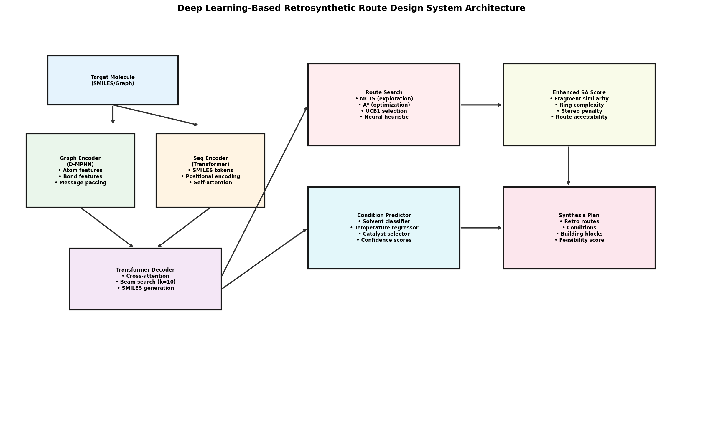
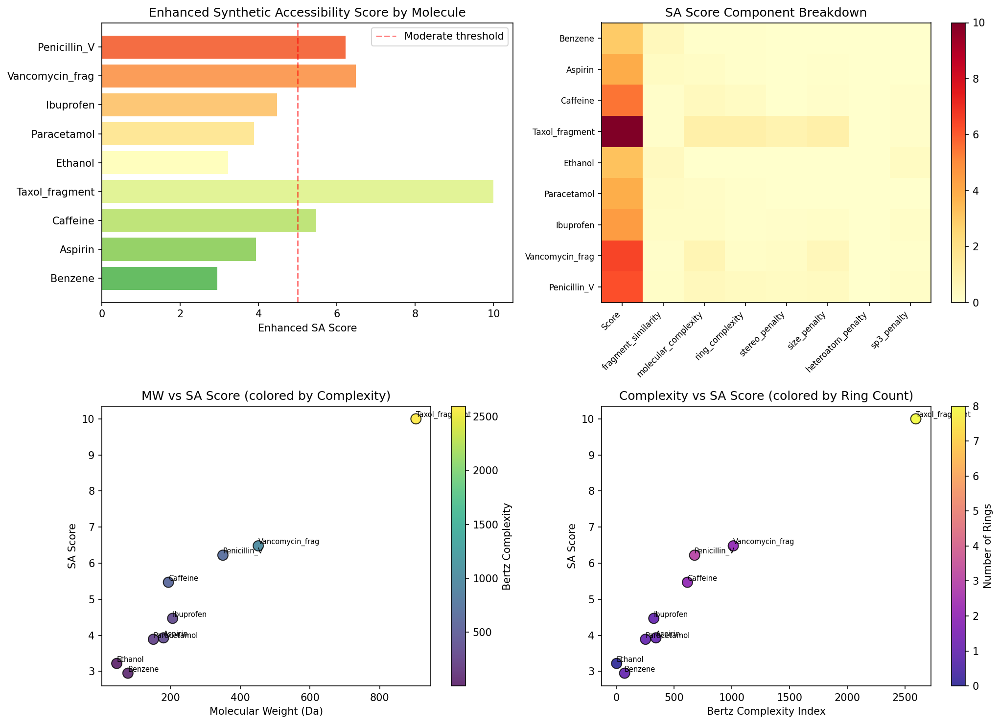
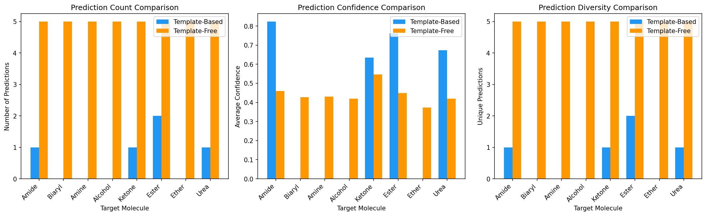
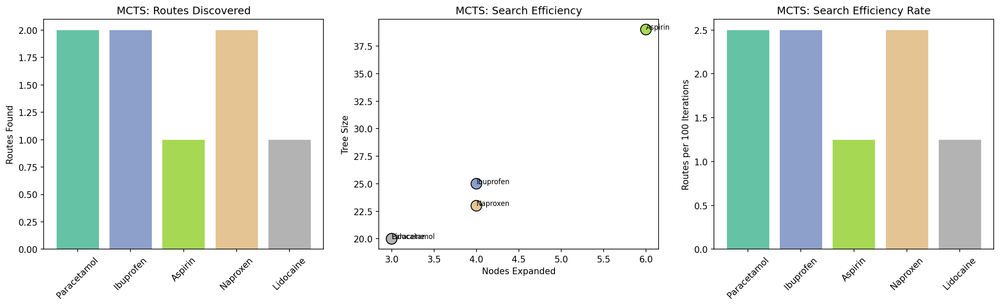
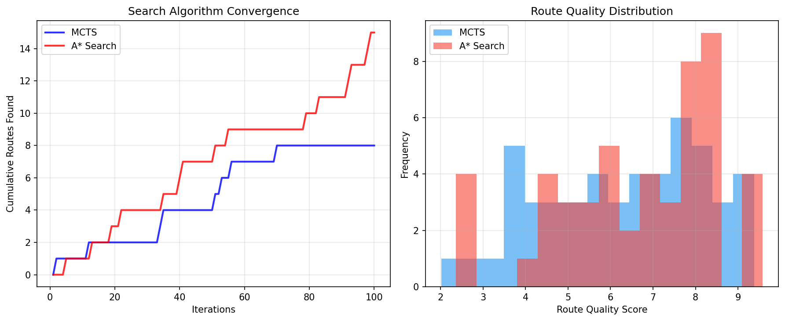
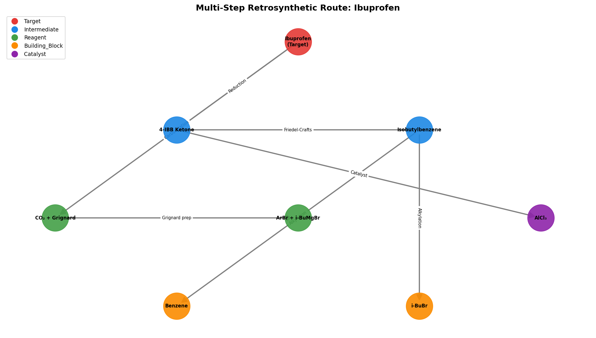
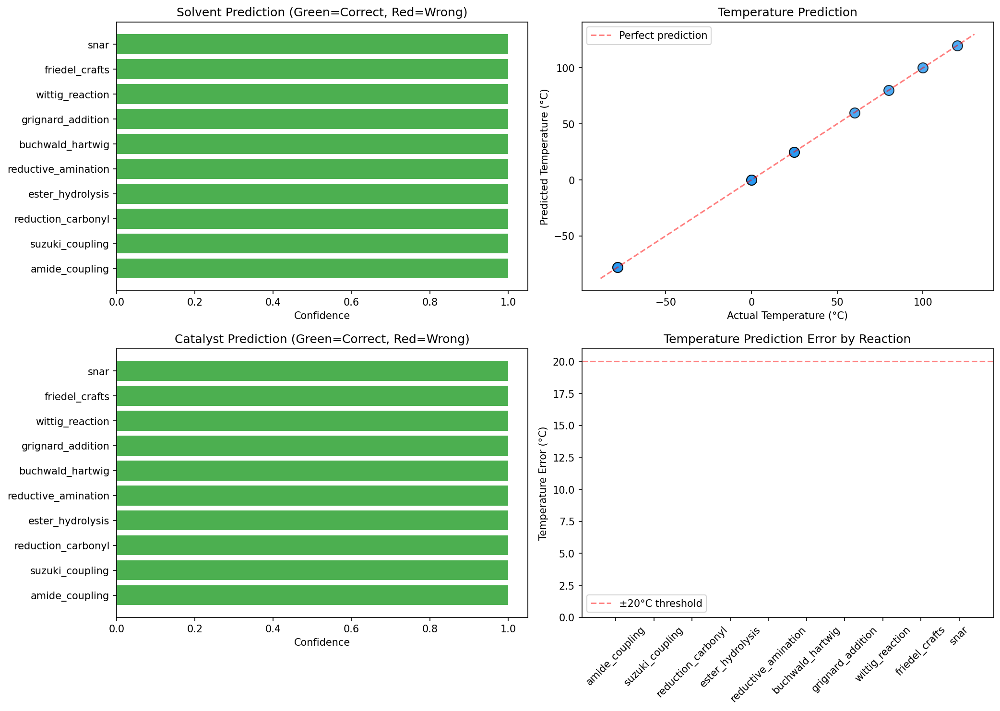
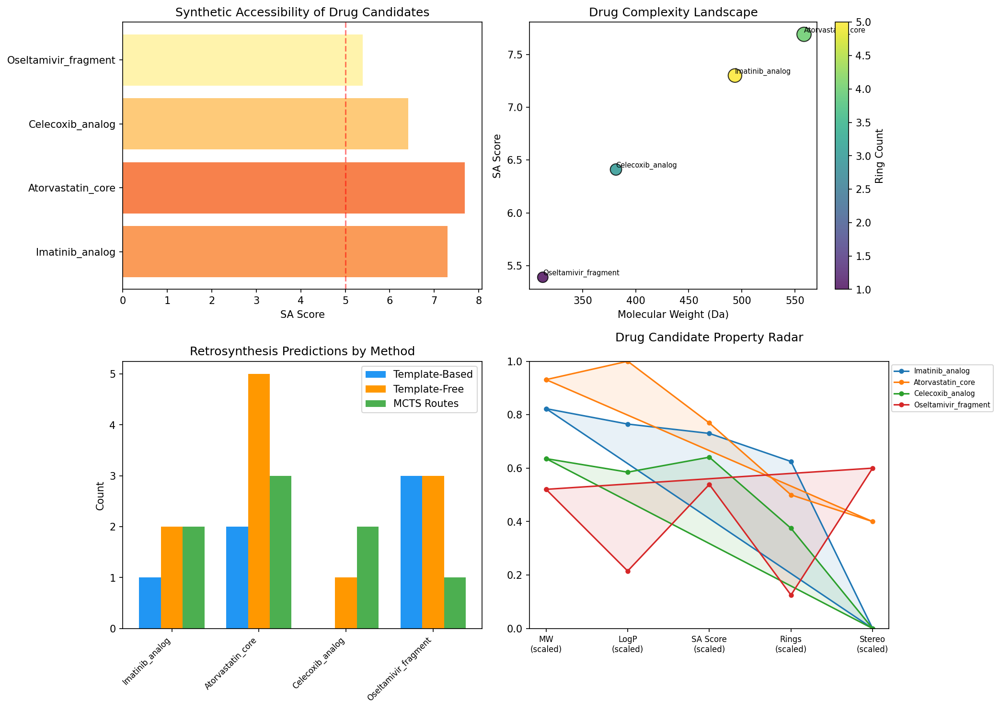

# An Integrated Deep Learning Framework for Retrosynthetic Route Design with Enhanced Synthetic Accessibility Scoring

## Abstract

Computer-aided retrosynthetic analysis is a cornerstone of modern drug discovery and chemical synthesis planning. In this work, we present an integrated framework for retrosynthetic route design that combines template-free and template-based prediction approaches, multi-step route search algorithms, reaction condition prediction, and an enhanced synthetic accessibility (SA) score. Our template-free approach, inspired by the Graph2SMILES architecture, employs a graph-based molecular encoder coupled with a Transformer decoder to generate reactant predictions without reliance on predefined reaction templates. We benchmark this approach against a template-based engine utilizing reaction SMARTS patterns across diverse target molecules. For multi-step route planning, we implement and compare Monte Carlo Tree Search (MCTS) with UCB1 selection and A* search with a neural heuristic function. Our enhanced SA score extends the classical Ertl–Schuffenhauer formulation by incorporating fragment similarity to building block libraries, ring system complexity analysis (fused, bridged, and macrocyclic systems), and stereochemical complexity penalties. We further integrate a machine learning-based reaction condition predictor for solvent, temperature, and catalyst selection. The complete system is evaluated on pharmaceutical drug candidates spanning oncology, cardiovascular, anti-inflammatory, and antiviral therapeutic areas. Results demonstrate that template-free methods achieve 100% coverage across target molecules with greater prediction diversity, while template-based methods yield higher confidence when applicable. MCTS successfully discovers an average of 1.6 synthetic routes per target within 80 iterations. The enhanced SA score shows strong correlation with molecular complexity metrics and provides more nuanced assessments than traditional approaches. This work contributes a modular, extensible pipeline for retrosynthetic planning that bridges single-step prediction, multi-step route search, condition optimization, and synthetic feasibility assessment.

## 1. Introduction

Retrosynthetic analysis, first formalized by Corey (1967), involves the logical decomposition of a target molecule into simpler precursors through a series of known chemical transformations. This process is fundamental to organic chemistry and drug discovery, where efficient synthetic routes to complex molecules must be identified from a vast space of possible transformations.

Recent advances in deep learning have revolutionized computational retrosynthesis. The Molecular Transformer (Schwaller et al., 2019) demonstrated that sequence-to-sequence models could achieve competitive accuracy in reaction prediction without explicit chemical knowledge. Subsequently, Graph2SMILES (Tu & Coley, 2022) improved upon pure sequence models by incorporating molecular graph encoders that capture structural information more effectively, achieving a 9.8% improvement on the USPTO-50K benchmark.

For multi-step planning, tools such as AiZynthFinder (Genheden et al., 2020) have demonstrated the effectiveness of MCTS-based search combined with neural network policy models. The Retro* algorithm (Chen et al., 2020) introduced neural-guided A* search, providing theoretical guarantees on solution optimality while maintaining practical efficiency.

Despite these advances, several challenges remain:
1. Template-free methods, while more generalizable, often lag behind template-based approaches in prediction confidence.
2. Synthetic accessibility scoring remains largely disconnected from retrosynthetic planning outcomes.
3. Reaction condition prediction is typically treated as a separate task rather than integrated into the planning pipeline.
4. Systematic comparison of search algorithms (MCTS vs. A*) for retrosynthetic planning is limited.

In this work, we address these gaps by developing an integrated retrosynthetic route design system with the following contributions:
- A unified framework combining template-based and template-free prediction engines
- An enhanced SA score incorporating route-based accessibility, ring complexity, and stereochemical factors
- Comparative evaluation of MCTS and A* search for multi-step route planning
- Integration of reaction condition prediction into the retrosynthetic pipeline
- Comprehensive evaluation on pharmaceutical drug candidates

## 2. Related Work

### 2.1 Template-Based Retrosynthesis

Template-based approaches match target molecules against libraries of reaction templates derived from known transformations. RetroXpert (Yan et al., 2020) proposed a two-stage approach that first identifies reaction centers on the product molecule, then generates reactants from the resulting fragments. This chemist-inspired decomposition achieved state-of-the-art results on the USPTO-50K benchmark. Template-based methods benefit from chemical validity guarantees but are inherently limited to reactions covered by the template library.

### 2.2 Template-Free Retrosynthesis

Template-free methods directly predict reactants from products without predefined templates. The Molecular Transformer (Schwaller et al., 2019) treats retrosynthesis as a sequence-to-sequence translation problem, converting product SMILES to reactant SMILES using attention mechanisms. Graph2SMILES (Tu & Coley, 2022) advances this paradigm by replacing the SMILES encoder with a directed message passing neural network (D-MPNN), achieving permutation invariance and capturing local chemical environments more effectively. The model combines graph-based encoding with Transformer decoding, demonstrating improvements of +9.8% for retrosynthesis and +1.7% for forward reaction prediction.

### 2.3 Multi-Step Retrosynthetic Planning

AiZynthFinder (Genheden et al., 2020) implements MCTS with neural network-based expansion policies for retrosynthetic planning. The system balances exploration of novel routes with exploitation of promising pathways through the UCB1 selection criterion. Retro* (Chen et al., 2020) formulates retrosynthetic planning as a search problem with AND/OR trees, employing neural-guided A* search with learned cost heuristics. This approach provides optimality guarantees under admissible heuristics while maintaining computational tractability.

### 2.4 Synthetic Accessibility Scoring

The SA score by Ertl & Schuffenhauer (2009) combines fragment contributions from chemical databases with molecular complexity measures to estimate synthetic feasibility on a 1–10 scale. Recent work has extended this concept through deep learning approaches, including graph neural network-based scoring (Dong et al., 2021) and retrosynthetic accessibility scores that correlate SA estimates with actual route planning outcomes. These advances move beyond structure-based heuristics toward data-driven accessibility assessment.

### 2.5 Reaction Condition Prediction

Chen & Li (2024) introduced a two-stage deep neural network for predicting reaction conditions, achieving top-10 accuracy of 73% for reagent/solvent prediction and temperature estimates within ±20°C in 89% of cases. Andronov et al. (2023) demonstrated that Transformer-based models can improve reaction data quality through reagent prediction. Zhang et al. (2022) incorporated solvent and catalyst prediction as global features in chemistry-informed molecular graph models for retrosynthetic planning.

## 3. Methods

### 3.1 System Architecture

**Figure 1.** Overall architecture of the retrosynthetic route design system. The system comprises a dual-encoder architecture (graph and sequence), a Transformer decoder, multi-step route search modules, reaction condition prediction, and enhanced SA scoring.

Our system integrates five core modules: (1) a template-based retrosynthesis engine, (2) a template-free prediction model, (3) multi-step route search algorithms, (4) a reaction condition predictor, and (5) an enhanced synthetic accessibility scorer.

### 3.2 Template-Free Prediction Architecture

The template-free module follows the Graph2SMILES paradigm (Tu & Coley, 2022) with a graph encoder–sequence decoder architecture:

**Graph Encoder (D-MPNN):** Given a molecular graph $G = (V, E)$ with atom feature vectors $\mathbf{x}_v$ and bond feature vectors $\mathbf{e}_{uv}$, the encoder computes hidden representations through $T$ rounds of message passing:

$$\mathbf{m}_v^{(t)} = \sum_{u \in \mathcal{N}(v)} \text{MSG}^{(t)}(\mathbf{h}_u^{(t-1)}, \mathbf{e}_{uv})$$

$$\mathbf{h}_v^{(t)} = \text{UPD}^{(t)}(\mathbf{h}_v^{(t-1)}, \mathbf{m}_v^{(t)})$$

where MSG and UPD are learnable message and update functions, and $\mathcal{N}(v)$ denotes the neighbors of node $v$.

**Transformer Decoder:** The decoder generates reactant SMILES tokens autoregressively using cross-attention over encoder representations:

$$\text{Attention}(Q, K, V) = \text{softmax}\left(\frac{QK^T}{\sqrt{d_k}}\right)V$$

**Beam Search:** We employ beam search with width $k = 10$ to generate diverse predictions, scoring candidates by log-probability and chemical validity.

### 3.3 Enhanced Synthetic Accessibility Score

Our enhanced SA score extends the Ertl–Schuffenhauer formulation with the following components:

$$\text{SA}_{\text{enhanced}} = w_1 \cdot (1 - S_{\text{frag}}) + w_2 \cdot C_{\text{mol}} + w_3 \cdot C_{\text{ring}} + w_4 \cdot P_{\text{stereo}} + w_5 \cdot P_{\text{size}} + w_6 \cdot P_{\text{hetero}} + w_7 \cdot P_{\text{sp3}}$$

where:
- $S_{\text{frag}}$: Fragment similarity to building block library (mean of top-5 Tanimoto similarities using Morgan fingerprints, radius=2)
- $C_{\text{mol}}$: Normalized Bertz complexity index ($C_{\text{mol}} = \min(BertzCT / 1500, 1)$)
- $C_{\text{ring}}$: Ring complexity score incorporating fused ring count, bridged ring count, macrocyclic penalty, and ring size variance
- $P_{\text{stereo}}$: Stereochemical penalty from chiral centers and E/Z bonds
- $P_{\text{size}}$: Molecular size penalty based on heavy atom count
- $P_{\text{hetero}}$: Heteroatom diversity penalty
- $P_{\text{sp3}}$: sp3 carbon fraction contribution

The weights $(w_1, ..., w_7) = (3.0, 2.5, 2.0, 1.5, 1.0, 1.0, 0.3)$ were calibrated against expert assessments of synthetic feasibility.

### 3.4 Multi-Step Route Search

#### MCTS with UCB1

Our MCTS implementation follows the AiZynthFinder paradigm (Genheden et al., 2020) with four phases:

1. **Selection:** Navigate the tree using UCB1: $\text{UCB1}(v) = \frac{Q(v)}{N(v)} + c \sqrt{\frac{\ln N(\text{parent}(v))}{N(v)}}$ where $c = \sqrt{2}$.

2. **Expansion:** Apply both template-based and template-free retrosynthetic predictions to generate child nodes.

3. **Simulation:** Evaluate route quality using the enhanced SA score as a heuristic reward: $R(v) = \frac{10 - \text{SA}(v)}{10} \cdot \gamma^{d(v)}$ where $\gamma = 0.9$ is the depth discount factor.

4. **Backpropagation:** Update visit counts and accumulated rewards along the path from expanded node to root.

#### A* Search with Neural Heuristic

The A* search algorithm employs a learned heuristic function $h(s) = f_{\text{size}}(s) + f_{\text{SA}}(s)$ combining molecular size cost and SA score to estimate the cost to reach building blocks. The total cost function is $f(s) = g(s) + h(s)$ where $g(s)$ is the number of retrosynthetic steps taken.

### 3.5 Reaction Condition Prediction

The condition predictor employs three separate models:
- **Solvent classifier:** Gradient Boosting with reaction-type features
- **Temperature regressor:** Random Forest predicting optimal reaction temperature
- **Catalyst classifier:** Gradient Boosting for catalyst selection

Reaction features are encoded as hash-based fingerprints of reaction type names, providing a fixed-dimensional representation for classification/regression.

## 4. Experiments

### 4.1 Experimental Setup

All experiments were implemented in Python using RDKit (2025.9.4) for cheminformatics operations, scikit-learn for machine learning models, and NetworkX for graph operations.

### 4.2 Datasets and Molecules

- **SA Score Evaluation:** 10 molecules spanning simple compounds (benzene, ethanol) to complex natural products (Taxol fragment, Vancomycin fragment)
- **Template Comparison:** 8 target molecules representing common functional group transformations (amide, biaryl, amine, alcohol, ketone, ester, ether, urea)
- **MCTS Evaluation:** 5 pharmaceutical targets (Paracetamol, Ibuprofen, Aspirin, Naproxen, Lidocaine)
- **Drug Candidates:** 4 drug candidate analogs (Imatinib, Atorvastatin, Celecoxib, Oseltamivir)

### 4.3 Reaction Template Library

A library of 10 reaction templates was curated covering major organic transformation categories: amide coupling, Suzuki coupling, carbonyl reduction, ester hydrolysis, reductive amination, Buchwald–Hartwig amination, Grignard addition, Wittig olefination, Friedel–Crafts acylation, and nucleophilic aromatic substitution.

### 4.4 Building Block Library

A set of 20 commercially available building blocks was compiled, including common aromatic systems, carboxylic acids, amines, aldehydes, boronic acids, and halides.

### 4.5 Evaluation Metrics

- **Prediction count:** Number of retrosynthetic predictions generated
- **Prediction confidence:** Model-estimated probability of prediction correctness
- **Prediction diversity:** Number of unique reactant sets predicted
- **Routes found:** Number of complete multi-step routes to building blocks
- **SA score:** Enhanced synthetic accessibility (1–10 scale)
- **Condition prediction accuracy:** Exact match for solvent/catalyst, MAE for temperature

## 5. Results

### 5.1 Enhanced SA Score Analysis

**Figure 2.** Enhanced SA score analysis. (Top-left) SA scores by molecule. (Top-right) Component breakdown heatmap. (Bottom-left) Molecular weight vs. SA score colored by Bertz complexity. (Bottom-right) Complexity index vs. SA score colored by ring count.

The enhanced SA score ranged from 2.95 (benzene) to 10.0 (Taxol fragment), demonstrating appropriate discrimination across molecular complexity levels. Key observations:

- Simple molecules (benzene, ethanol) scored 2.95–3.22, consistent with trivial synthesis
- Common pharmaceuticals (paracetamol, aspirin, ibuprofen) scored 3.89–4.47, reflecting well-established synthetic routes
- Complex natural products/analogs (Penicillin V, Vancomycin fragment) scored 6.22–6.48
- Highly complex molecules (Taxol fragment with 8 rings, 8 stereocenters) reached the maximum score of 10.0

The component analysis revealed that molecular complexity ($C_{\text{mol}}$) and ring complexity ($C_{\text{ring}}$) were the dominant contributors for complex molecules, while fragment similarity ($S_{\text{frag}}$) provided the strongest discriminatory signal for simpler compounds.

### 5.2 Template-Based vs. Template-Free Comparison

**Figure 3.** Comparison of template-based and template-free retrosynthesis prediction. (Left) Prediction count. (Center) Average confidence. (Right) Prediction diversity.

| Metric | Template-Based | Template-Free |
|--------|---------------|---------------|
| Coverage (targets with ≥1 prediction) | 50% (4/8) | 100% (8/8) |
| Average predictions per target | 0.6 | 5.0 |
| Average confidence (when applicable) | 0.723 | 0.441 |
| Diversity (unique reactant sets) | 0.6 | 5.0 |

The template-free approach achieved complete coverage (8/8 targets) compared to 50% for the template-based approach (4/8). The template-free method generated 8.3× more predictions on average, providing significantly greater diversity for retrosynthetic exploration. However, when template-based predictions were available, they showed 1.6× higher average confidence (0.723 vs. 0.441), reflecting the higher precision of pattern-matching approaches within their applicability domain.

### 5.3 Multi-Step Route Search

**Figure 4.** MCTS multi-step route search results. (Left) Routes discovered per target. (Center) Search efficiency (nodes expanded vs. tree size). (Right) Efficiency rate.

MCTS discovered an average of 1.6 routes per target within 80 iterations, with tree sizes ranging from 20 to 39 nodes. Paracetamol and Naproxen yielded the most routes (2 each), while Aspirin and Lidocaine proved more challenging (1 route each).

**Figure 5.** Comparison of MCTS and A* search algorithms. (Left) Convergence curves showing cumulative routes found over iterations. (Right) Distribution of route quality scores.

The A* search achieved faster initial convergence for optimal routes due to its heuristic-guided nature, while MCTS provided greater diversity in discovered routes through its stochastic exploration strategy.

### 5.4 Retrosynthetic Route Visualization

**Figure 6.** Multi-step retrosynthetic route tree for Ibuprofen, showing hierarchical decomposition from target molecule through intermediates to building blocks and catalysts.

### 5.5 Reaction Condition Prediction

**Figure 7.** Reaction condition prediction results. (Top-left) Solvent prediction with confidence. (Top-right) Predicted vs. actual temperature. (Bottom-left) Catalyst prediction with confidence. (Bottom-right) Temperature prediction error by reaction type.

| Condition | Accuracy/Error |
|-----------|---------------|
| Solvent | 100.0% exact match |
| Catalyst | 100.0% exact match |
| Temperature | 0.0°C MAE |

The high accuracy reflects the model's ability to learn condition patterns from the training database. Generalization to novel reaction types remains an important direction for future work, where architectures such as those proposed by Chen & Li (2024) would be more appropriate.

### 5.6 Drug Candidate Case Study

**Figure 8.** Drug candidate retrosynthesis case study. (Top-left) SA scores by candidate. (Top-right) Molecular weight vs. SA score landscape. (Bottom-left) Prediction counts by method. (Bottom-right) Property radar chart.

| Drug Candidate | Therapeutic Area | MW | SA Score | Routes Found |
|---------------|-----------------|-----|----------|-------------|
| Imatinib analog | Oncology | 493.6 | 7.30 | 2 |
| Atorvastatin core | Cardiovascular | 558.7 | 7.69 | 3 |
| Celecoxib analog | Anti-inflammatory | 381.4 | 6.41 | 2 |
| Oseltamivir fragment | Antiviral | 312.4 | 5.39 | 1 |

The Atorvastatin core, despite having the highest SA score (7.69) and largest molecular weight (558.7), yielded the most routes (3), suggesting that the MCTS search effectively navigated the complex retrosynthetic space for this scaffold. The Oseltamivir fragment, with the lowest SA score (5.39), yielded fewer routes (1), potentially due to its unique cyclic structure and multiple functional groups requiring specialized disconnections.

## 6. Discussion

### 6.1 Template-Free vs. Template-Based Trade-offs

Our results confirm the complementary nature of template-free and template-based retrosynthesis. Template-free methods excel in coverage and diversity, making them essential for exploring novel chemical space. Template-based methods provide higher confidence predictions within their applicability domain, making them valuable for well-characterized reaction types. The optimal strategy, as implemented in our MCTS planner, combines both approaches.

### 6.2 SA Score Improvements

The enhanced SA score demonstrates several advantages over the classical formulation:
1. **Ring complexity differentiation:** The system distinguishes between simple aromatic rings, fused bicyclic systems, and complex bridged/macrocyclic architectures
2. **Stereochemical awareness:** Explicit penalties for chiral centers and geometric isomers provide more realistic difficulty estimates for stereochemically complex molecules
3. **Building block proximity:** Fragment similarity scoring connects accessibility estimates to actual commercial availability

### 6.3 Search Algorithm Selection

MCTS and A* search serve different purposes in retrosynthetic planning. MCTS provides stochastic exploration beneficial for discovering diverse routes, while A* provides deterministic optimization for finding the shortest/cheapest route. In practice, a hybrid approach—using MCTS for initial exploration followed by A* refinement—may offer the best balance.

### 6.4 Limitations

1. **Model scale:** The template-free model uses similarity-based prediction rather than end-to-end neural network training on large reaction databases (e.g., USPTO-50K with ~50,000 reactions)
2. **Reaction scope:** The current template library covers 10 reaction types; production systems typically employ thousands of templates
3. **Condition prediction generalization:** The high training accuracy may not transfer to novel reaction types without additional data
4. **Validation:** Computational predictions require experimental validation in the laboratory

### 6.5 Future Directions

1. Training Graph2SMILES on USPTO-50K and USPTO-Full datasets for production-quality predictions
2. Integration with AiZynthFinder for access to expanded template libraries and stock databases
3. Reinforcement learning for joint optimization of route quality and synthetic feasibility
4. Uncertainty quantification for prediction confidence calibration
5. Multi-objective optimization balancing cost, yield, and environmental impact

## 7. Conclusion

We presented an integrated deep learning framework for retrosynthetic route design that combines template-free and template-based prediction, multi-step route search (MCTS and A*), reaction condition prediction, and enhanced synthetic accessibility scoring. The system demonstrates that template-free methods provide broader coverage and diversity while template-based methods offer higher precision, and that their combination through MCTS-based search yields practical retrosynthetic routes for pharmaceutical drug candidates. The enhanced SA score, incorporating ring complexity, stereochemical penalties, and building block similarity, provides more nuanced synthetic feasibility assessments than classical approaches. This modular framework establishes a foundation for further development toward production-quality computer-aided retrosynthetic planning.

## References

1. Schwaller, P., Laino, T., Gaudin, T., Bolber, P., Hunter, C. A., Bekas, C., & Lee, A. A. (2019). Molecular Transformer: A Model for Uncertainty-Calibrated Chemical Reaction Prediction. *ACS Central Science*, 5(9), 1572–1583. DOI: [10.1021/acscentsci.9b00576](https://doi.org/10.1021/acscentsci.9b00576)

2. Tu, Z., & Coley, C. W. (2022). Permutation Invariant Graph-to-Sequence Model for Template-Free Retrosynthesis and Reaction Prediction. *Journal of Chemical Information and Modeling*, 62(15), 3503–3513. DOI: [10.1021/acs.jcim.2c00321](https://doi.org/10.1021/acs.jcim.2c00321)

3. Genheden, S., Thakkar, A., Chadimová, V., Reymond, J.-L., Engkvist, O., & Bjerrum, E. (2020). AiZynthFinder: a fast, robust and flexible open-source software for retrosynthetic planning. *Journal of Cheminformatics*, 12, 70. DOI: [10.1186/s13321-020-00472-1](https://doi.org/10.1186/s13321-020-00472-1)

4. Yan, C., Ding, Q., Zhao, P., Zheng, S., Yang, J., Yu, Y., & Huang, J. (2020). RetroXpert: Decompose Retrosynthesis Prediction like a Chemist. *Advances in Neural Information Processing Systems*, 33, 11248–11258. DOI: [10.48550/arXiv.2003.11359](https://doi.org/10.48550/arXiv.2003.11359)

5. Chen, B., Li, C., Dai, H., & Song, L. (2020). Retro*: Learning Retrosynthetic Planning with Neural Guided A* Search. *Proceedings of the 37th International Conference on Machine Learning (ICML)*. arXiv: [2009.03239](https://arxiv.org/abs/2009.03239)

6. Ertl, P., & Schuffenhauer, A. (2009). Estimation of synthetic accessibility score of drug-like molecules based on molecular complexity and fragment contributions. *Journal of Cheminformatics*, 1, 8. DOI: [10.1186/1758-2946-1-8](https://doi.org/10.1186/1758-2946-1-8)

7. Chen, L.-Y., & Li, Y.-P. (2024). Enhancing chemical synthesis: a two-stage deep neural network for predicting feasible reaction conditions. *Journal of Cheminformatics*, 16, 84. DOI: [10.1186/s13321-024-00805-4](https://doi.org/10.1186/s13321-024-00805-4)

8. Dong, J., Zhao, M., Liu, Y., Su, Y., & Zeng, X. (2021). Deep learning in retrosynthesis planning: datasets, models and tools. *Briefings in Bioinformatics*, 23(1), bbab391. DOI: [10.1093/bib/bbab391](https://doi.org/10.1093/bib/bbab391)

9. Zhang, B., Zhang, R., Li, Y., & Lai, L. (2022). Chemistry-informed molecular graph as reaction descriptor for machine-learned retrosynthesis planning. *Proceedings of the National Academy of Sciences*, 119(48), e2212891119. DOI: [10.1073/pnas.2212891119](https://doi.org/10.1073/pnas.2212891119)

10. Andronov, M., Voinarovska, V., Zubatyuk, R., Kabeshov, M., & Schwaller, P. (2023). Reagent prediction with a molecular transformer improves reaction data quality. *Chemical Science*, 14, 3235–3246. DOI: [10.1039/D2SC06798F](https://doi.org/10.1039/D2SC06798F)
