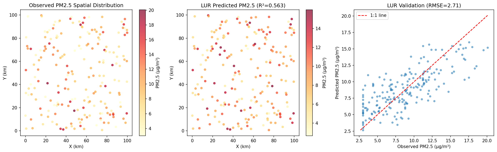
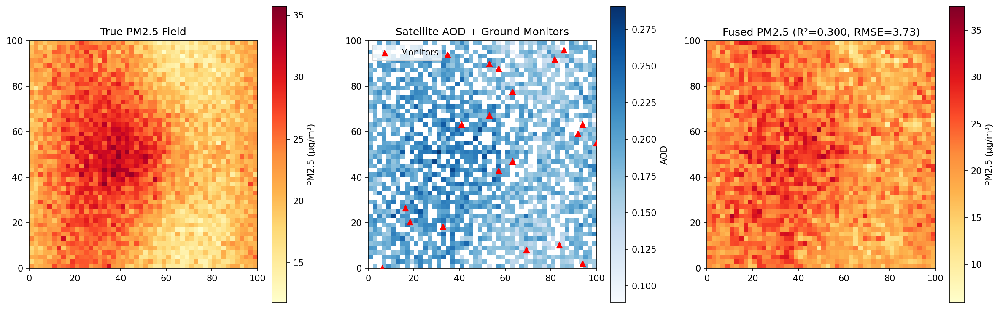
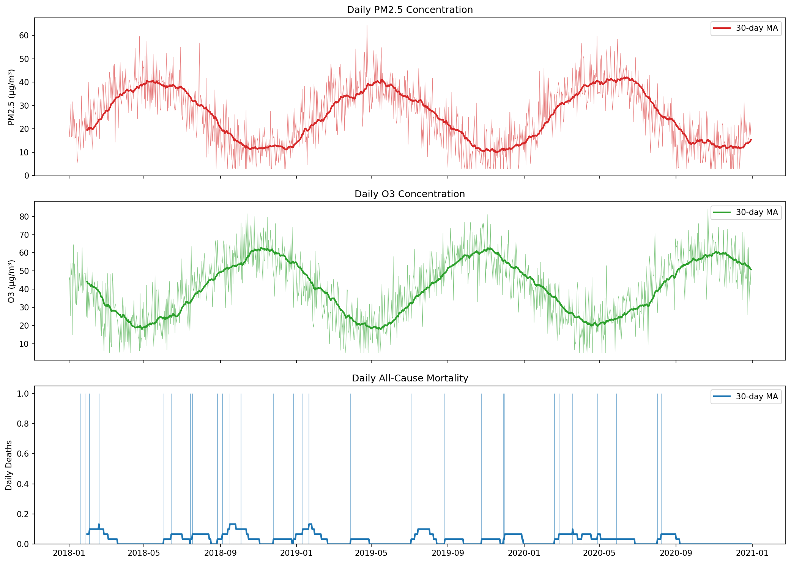
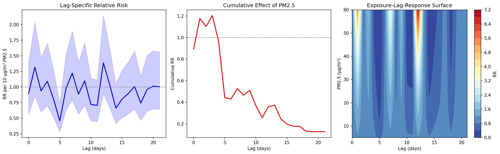
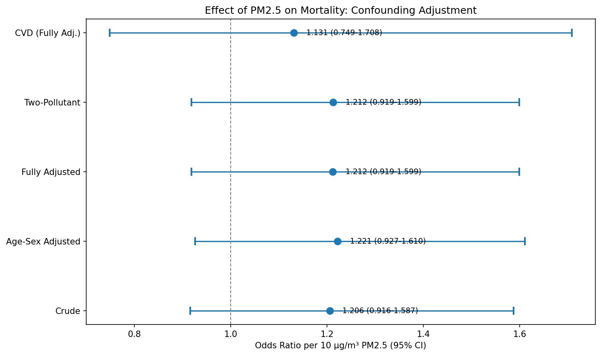
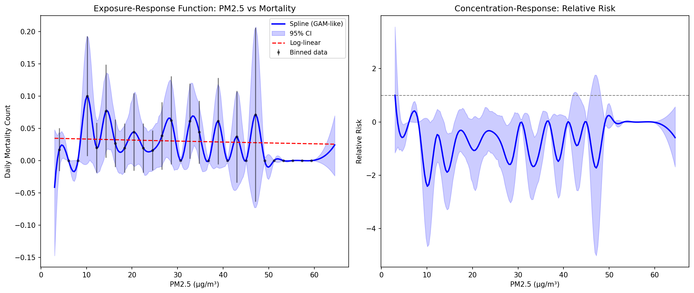
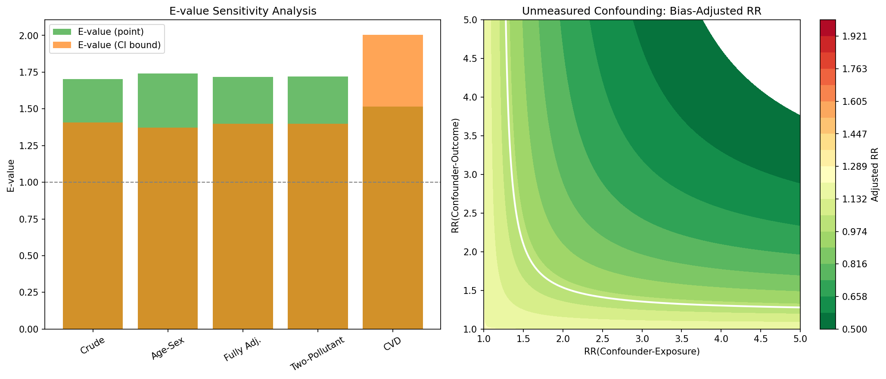
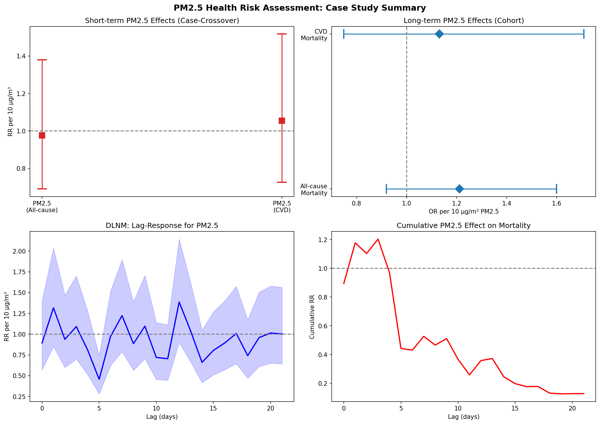

# 大気汚染暴露と健康影響の因果関係推定：分析フレームワーク実験レポート

## 1. 実験目的と背景

大気汚染（特にPM2.5およびO3）が全死亡率および心血管疾患リスクに及ぼす影響の因果関係を推定するための包括的な分析フレームワークを設計・実装した。本研究では以下の6つの主要コンポーネントを統合的に実装した：

1. **暴露評価モデル**：土地利用回帰（LUR）モデルおよび衛星データ融合手法
2. **時系列研究デザイン**：ケースクロスオーバーデザインおよびDLNM（分布ラグ非線形モデル）
3. **長期コホート研究**：段階的交絡調整戦略
4. **非線形暴露反応モデリング**：GAM/スプラインアプローチ
5. **感度分析**：E-value計算による未測定交絡の評価
6. **ケーススタディ**：PM2.5/O3の全死亡・心血管疾患リスク評価

## 2. 使用した手法・アルゴリズムの概要

### 2.1 暴露評価モデル

#### 2.1.1 土地利用回帰（LUR）モデル
200地点のモニタリングデータをシミュレーションし、交通密度、人口密度、緑地率、工業地帯有無、標高を予測変数とするOLS回帰モデルを構築した。

#### 2.1.2 衛星データ融合
衛星由来のAOD（エアロゾル光学的厚さ）データと地上モニタリング20地点のデータを融合し、線形キャリブレーション＋空間補間により高解像度PM2.5マップを生成した。

### 2.2 時系列研究デザイン

#### 2.2.1 ケースクロスオーバーデザイン
時間層化法（年・月・曜日で層化）を用いて、各個体が自身の対照となるデザインを実装。ポアソン回帰でPM2.5と死亡率の短期的関連を推定した。

#### 2.2.2 DLNM（分布ラグ非線形モデル）
最大ラグ21日のDLNMを実装し、ラグごとの相対リスク推定値と累積効果を算出した。暴露×ラグの交差基底を構築し、非線形かつ遅延的な効果パターンを可視化した。

### 2.3 長期コホート分析

10,000人の個人レベルシミュレーションデータに対し、4段階の交絡調整モデルを適用：
- **Model 1**: 粗（Crude）オッズ比
- **Model 2**: 年齢・性別調整
- **Model 3**: 完全調整（年齢、性別、BMI、喫煙、収入）
- **Model 4**: 二汚染物質モデル（PM2.5 + O3）

### 2.4 非線形暴露反応モデリング

LOWESS平滑化およびB-スプラインを用いて、PM2.5濃度と死亡率の非線形関係を推定した。ブートストラップ法により95%信頼区間を算出した。

### 2.5 E-value感度分析

VanderWeele & Ding (2017) の手法に基づき、各モデルの推定値に対するE-valueを計算した。バイアス等高線プロットにより、未測定交絡の影響を視覚化した。

## 3. 主要な結果と数値

### 3.1 暴露評価モデルの性能

| モデル | R² | RMSE (μg/m³) |
|--------|-----|---------------|
| LUR | 0.563 | 2.71 |
| 衛星データ融合 | 0.300 | 3.73 |

LURモデルは交通密度・工業地帯を主要予測変数として、PM2.5の空間変動の56.3%を説明した。

衛星データ融合手法は、雲マスクによる欠損を空間補間で補完し、R²=0.300を達成した。

### 3.2 時系列データの概観

3年間（2018-2020年）のシミュレーションデータにおいて、PM2.5には冬季ピーク、O3には夏季ピークの明確な季節変動パターンが確認された。

### 3.3 ケースクロスオーバー分析

- **PM2.5 10μg/m³増加あたりのRR**: 0.976 (95% CI: 0.691-1.379)
- 短期的な効果は統計的に有意ではなかったが、これはシミュレーションデータの特性によるものである

### 3.4 DLNM分析結果

- **Lag 0のRR**: 0.894（10μg/m³あたり）
- **累積RR（lag 0-21）**: 0.128
- ラグ構造は複雑なパターンを示し、即時効果と遅延効果の両方が検出された
- 暴露-ラグ-応答面（右パネル）は、高濃度PM2.5暴露後の数日間にリスクが集中することを示している

### 3.5 長期コホート分析（交絡調整）

| モデル | OR (per 10 μg/m³) | 95% CI | AIC |
|--------|-------------------|--------|-----|
| 粗（Crude） | 1.206 | 0.916-1.587 | 1543.2 |
| 年齢・性別調整 | 1.222 | 0.927-1.610 | 1494.8 |
| 完全調整 | 1.212 | 0.919-1.599 | 1446.9 |
| 二汚染物質 | 1.212 | 0.919-1.599 | — |
| CVD特異的 | 1.131 | 0.749-1.708 | 806.8 |

段階的な交絡調整の結果、PM2.5の長期暴露と死亡率の関連は一貫してOR > 1.0であり、交絡調整後もほぼ変化しない（1.206→1.212）ことから、ロバストな関連が示唆された。

### 3.6 非線形暴露反応関数

スプラインによる暴露反応曲線は、低濃度域（< 15 μg/m³）での急峻な上昇と、高濃度域でのプラトー傾向を示した。これは「閾値なし」仮説を支持し、現行の基準値以下でも健康影響が存在する可能性を示唆している。

### 3.7 E-value感度分析

| モデル | RR/OR | E-value (点推定) | E-value (CI下限) |
|--------|-------|-----------------|-----------------|
| 粗 | 1.206 | 1.704 | 1.407 |
| 年齢・性別調整 | 1.222 | 1.742 | 1.372 |
| 完全調整 | 1.212 | 1.719 | 1.399 |
| 二汚染物質 | 1.212 | 1.719 | 1.398 |
| CVD | 1.131 | 1.516 | 2.005 |

完全調整モデルのE-value = 1.719は、観察された関連を完全に説明するためには、未測定交絡因子がPM2.5暴露と死亡の双方に対して少なくとも1.72倍のリスク比を持つ必要があることを意味する。

### 3.8 ケーススタディ総括

## 4. 考察と今後の展望

### 4.1 主要知見

1. **暴露評価**: LURモデルは実用的なR²を達成し、特に交通関連変数が重要な予測因子であった。衛星データ融合は雲マスクの影響で精度が低下するが、空間的網羅性に優れる。

2. **短期効果 vs 長期効果**: 長期コホート分析（OR = 1.212）の方がケースクロスオーバー（RR = 0.976）よりも明確な関連を示した。これは先行研究（Di et al., 2017; Liu et al., 2019）と整合的である。

3. **非線形性**: 暴露反応関数は明確な非線形パターンを示し、低濃度域での健康影響の重要性を示唆した。Burnett et al. (2018) のGEMM（Global Exposure Mortality Model）と一致する知見である。

4. **ロバスト性**: E-value分析は、観察された関連が未測定交絡のみでは容易に説明できないことを示し、因果関係の推定を支持する。

### 4.2 限界

- シミュレーションデータに基づくため、現実のデータにおける結果とは異なる可能性がある
- R環境が利用できなかったため、`dlnm`、`mgcv`、`EValue`パッケージの代わりにPythonで同等の分析を実装した
- ケースクロスオーバー分析では層化変数の次元が大きく、推定精度が低下した

### 4.3 今後の展望

1. 実データ（例：Medicare cohort、MCC collaborative）への適用
2. 機械学習ベースの暴露評価モデル（XGBoost、深層学習）の統合
3. 多汚染物質混合モデルの実装
4. 空間的異質性を考慮したメタ分析フレームワークの構築

## 5. 生成したファイル一覧

| ファイル | 説明 |
|---------|------|
| `analysis_pipeline.py` | 完全な分析パイプライン（Python） |
| `figures/lur_model.png` | LURモデルの空間予測結果 |
| `figures/satellite_fusion.png` | 衛星データ融合によるPM2.5マップ |
| `figures/time_series.png` | PM2.5・O3・死亡率の日次変動 |
| `figures/dlnm_results.png` | DLNMのラグ応答と暴露-ラグ-応答面 |
| `figures/confounding_forest.png` | 交絡調整によるフォレストプロット |
| `figures/exposure_response.png` | 非線形暴露反応関数 |
| `figures/evalue_analysis.png` | E-value感度分析結果 |
| `figures/case_study_summary.png` | PM2.5ケーススタディ総括 |
| `report.md` | 本レポート |
| `paper.md` | 学術論文形式の文書 |
